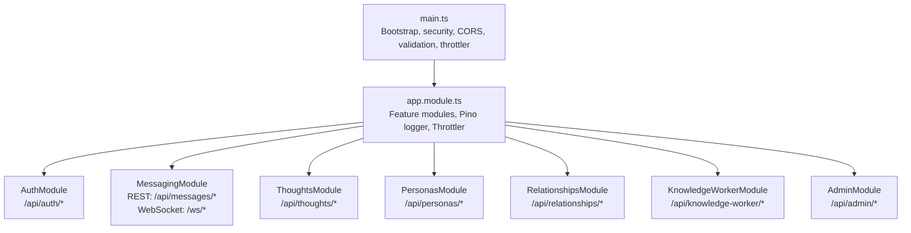
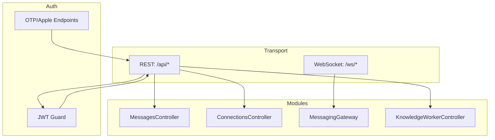
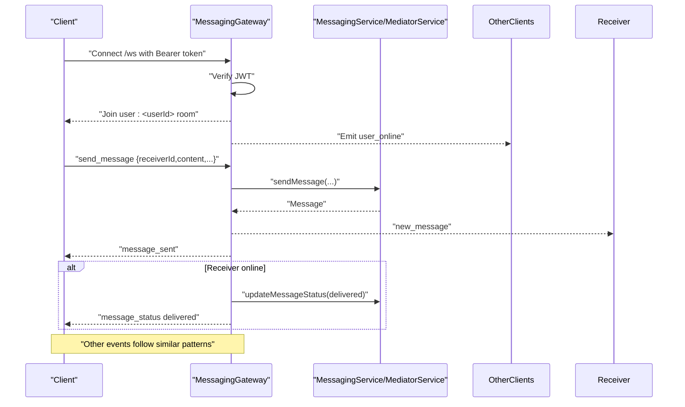
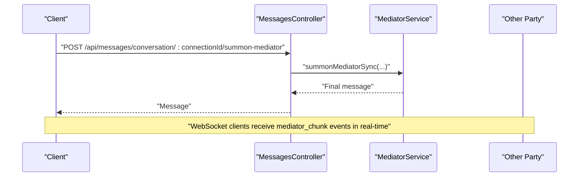
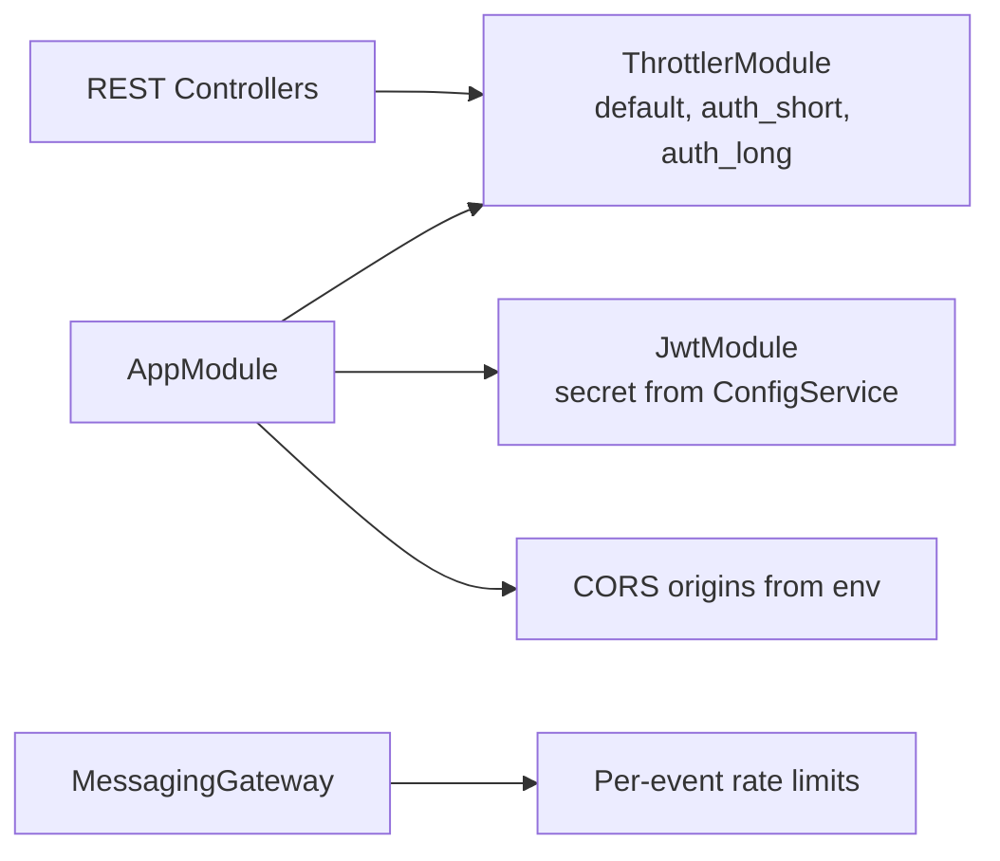

# API Reference

<cite>
**Referenced Files in This Document**
- [main.ts](file://backend/src/main.ts)
- [app.module.ts](file://backend/src/app.module.ts)
- [auth.controller.ts](file://backend/src/auth/auth.controller.ts)
- [jwt-auth.guard.ts](file://backend/src/auth/jwt-auth.guard.ts)
- [jwt.strategy.ts](file://backend/src/auth/jwt.strategy.ts)
- [request-otp.dto.ts](file://backend/src/auth/dto/request-otp.dto.ts)
- [verify-otp.dto.ts](file://backend/src/auth/dto/verify-otp.dto.ts)
- [set-name.dto.ts](file://backend/src/auth/dto/set-name.dto.ts)
- [apple-signin.dto.ts](file://backend/src/auth/dto/apple-signin.dto.ts)
- [messaging.gateway.ts](file://backend/src/messaging/messaging.gateway.ts)
- [messaging.module.ts](file://backend/src/messaging/messaging.module.ts)
- [messages.controller.ts](file://backend/src/messaging/messages.controller.ts)
- [connections.controller.ts](file://backend/src/messaging/connections.controller.ts)
- [thoughts.controller.ts](file://backend/src/thoughts/thoughts.controller.ts)
- [create-thought.dto.ts](file://backend/src/thoughts/dto/create-thought.dto.ts)
- [update-thought.dto.ts](file://backend/src/thoughts/dto/update-thought.dto.ts)
- [personas.controller.ts](file://backend/src/personas/personas.controller.ts)
- [create-persona.dto.ts](file://backend/src/personas/dto/create-persona.dto.ts)
- [update-persona.dto.ts](file://backend/src/personas/dto/update-persona.dto.ts)
- [relationships.controller.ts](file://backend/src/relationships/relationships.controller.ts)
- [create-relationship.dto.ts](file://backend/src/relationships/dto/create-relationship.dto.ts)
- [update-relationship.dto.ts](file://backend/src/relationships/dto/update-relationship.dto.ts)
- [add-relationship-note.dto.ts](file://backend/src/relationships/dto/add-relationship-note.dto.ts)
- [knowledge-worker.controller.ts](file://backend/src/knowledge-worker/knowledge-worker.controller.ts)
- [kw-stream.dto.ts](file://backend/src/knowledge-worker/dto/kw-stream.dto.ts)
- [admin.controller.ts](file://backend/src/admin/admin.controller.ts)
</cite>

## Table of Contents
1. [Introduction](#introduction)
2. [Project Structure](#project-structure)
3. [Core Components](#core-components)
4. [Architecture Overview](#architecture-overview)
5. [Detailed Component Analysis](#detailed-component-analysis)
6. [Dependency Analysis](#dependency-analysis)
7. [Performance Considerations](#performance-considerations)
8. [Troubleshooting Guide](#troubleshooting-guide)
9. [Conclusion](#conclusion)
10. [Appendices](#appendices)

## Introduction
This document provides a comprehensive API reference for the 4Ever backend, covering REST endpoints and WebSocket interfaces. It describes HTTP methods, URL patterns, request/response schemas, authentication, rate limiting, and error handling. It also documents real-time messaging and tri-chat mediator features via WebSocket, including connection handling, message formats, and event types.

## Project Structure
The backend is a NestJS application with modularized features. The global prefix for REST endpoints is /api. Security headers, CORS, compression, validation, and structured logging are configured at startup. Rate limiting is enforced globally via a throttler module with named buckets.

**Diagram sources**
- [main.ts:95-97](file://backend/src/main.ts#L95-L97)
- [app.module.ts:34-163](file://backend/src/app.module.ts#L34-L163)

**Section sources**
- [main.ts:35-97](file://backend/src/main.ts#L35-L97)
- [app.module.ts:133-137](file://backend/src/app.module.ts#L133-L137)

## Core Components
- Authentication and Authorization
  - JWT guard protects most endpoints.
  - OTP and Apple sign-in endpoints are rate-limited with layered buckets.
- Real-time Messaging
  - WebSocket gateway under /ws with per-event rate limits and input validation.
- Knowledge Worker
  - Premium-gated SSE streaming and document ingestion with quota enforcement.

Key configuration highlights:
- Global throttler buckets: default, auth_short, auth_long.
- JWT secret sourced from environment.
- CORS origins configurable via environment variable.
- Body size limit 2 MB for JSON payloads.

**Section sources**
- [jwt-auth.guard.ts](file://backend/src/auth/jwt-auth.guard.ts)
- [auth.controller.ts:17-20](file://backend/src/auth/auth.controller.ts#L17-L20)
- [app.module.ts:133-137](file://backend/src/app.module.ts#L133-L137)
- [messaging.gateway.ts:55-61](file://backend/src/messaging/messaging.gateway.ts#L55-L61)
- [main.ts:68-79](file://backend/src/main.ts#L68-L79)
- [main.ts:62-66](file://backend/src/main.ts#L62-L66)

## Architecture Overview
The API follows a layered architecture:
- Transport: REST (HTTP) and WebSocket (Socket.IO).
- Authentication: JWT bearer tokens for REST; JWT verification for WebSocket.
- Rate Limiting: Global throttler with named buckets; WebSocket has per-event sliding windows.
- Modules: Feature-specific controllers and services.

**Diagram sources**
- [main.ts:95-97](file://backend/src/main.ts#L95-L97)
- [auth.controller.ts:22-58](file://backend/src/auth/auth.controller.ts#L22-L58)
- [messages.controller.ts:21-27](file://backend/src/messaging/messages.controller.ts#L21-L27)
- [connections.controller.ts:19-25](file://backend/src/messaging/connections.controller.ts#L19-L25)
- [messaging.gateway.ts:62-63](file://backend/src/messaging/messaging.gateway.ts#L62-L63)
- [knowledge-worker.controller.ts:35-44](file://backend/src/knowledge-worker/knowledge-worker.controller.ts#L35-L44)

## Detailed Component Analysis

### Authentication Endpoints
- Base Path: /api/auth
- Guards: JWT for name setting; OTP/Apple endpoints are rate-limited.

Endpoints
- POST /api/auth/request-otp
  - Rate limit: auth_short, auth_long.
  - Request DTO: [request-otp.dto.ts](file://backend/src/auth/dto/request-otp.dto.ts)
  - Response: token issuance outcome.
- POST /api/auth/verify-otp
  - Rate limit: auth_short, auth_long.
  - Request DTO: [verify-otp.dto.ts](file://backend/src/auth/dto/verify-otp.dto.ts)
  - Response: session token and user profile.
- POST /api/auth/set-name
  - Guard: JWT.
  - Request DTO: [set-name.dto.ts](file://backend/src/auth/dto/set-name.dto.ts)
  - Response: updated profile.
- POST /api/auth/apple
  - Rate limit: auth_short, auth_long.
  - Request DTO: [apple-signin.dto.ts](file://backend/src/auth/dto/apple-signin.dto.ts)
  - Response: session token and user profile.

Authentication Methods
- JWT Bearer: Authorization: Bearer <token>.
- Phone OTP: request-otp, verify-otp.
- Apple Sign-In: identityToken verification.

Rate Limiting
- auth_short: 3/min per IP.
- auth_long: 10 per 15 minutes per IP.

Example Requests
- curl -X POST https://$HOST/api/auth/request-otp -H "Content-Type: application/json" -d '{"phoneNumber":"+15551234567"}'
- curl -X POST https://$HOST/api/auth/verify-otp -H "Content-Type: application/json" -d '{"phoneNumber":"+15551234567","code":"123456"}'
- curl -X POST https://$HOST/api/auth/set-name -H "Authorization: Bearer $JWT" -H "Content-Type: application/json" -d '{"name":"Alex"}'

**Section sources**
- [auth.controller.ts:26-57](file://backend/src/auth/auth.controller.ts#L26-L57)
- [request-otp.dto.ts](file://backend/src/auth/dto/request-otp.dto.ts)
- [verify-otp.dto.ts](file://backend/src/auth/dto/verify-otp.dto.ts)
- [set-name.dto.ts](file://backend/src/auth/dto/set-name.dto.ts)
- [apple-signin.dto.ts](file://backend/src/auth/dto/apple-signin.dto.ts)

### Real-time Messaging (WebSocket)
- Namespace: /ws
- CORS origins from environment.
- JWT verification on connect; emits user_online/user_offline on connect/disconnect.
- Rooms: user:<userId> for targeted delivery.

Per-Event Rate Limits (sliding window, 60s)
- send_message: 60
- edit_message: 30
- delete_message: 20
- toggle_reaction: 60
- mark_read: 60
- typing: 240
- get_online_status: 30
- get_last_seen: 30
- toggle_tri_chat: 20
- summon_mediator: 12
- reply_to_mediator: 12
- end_mediator_session: 20
- clear_chat_history: 10
- rename_mediator: 10
- accept_mediator_action: 30

Events
- Client connects with Bearer token or token in handshake.auth.
- send_message
  - Payload: receiverId, content, replyToId?, messageType?, metadata?, clientTempId?
  - Emits: new_message, message_sent, message_status (delivered), message_error.
- edit_message
  - Payload: messageId, content.
  - Emits: message_edited, message_error.
- delete_message
  - Payload: messageId.
  - Emits: message_deleted, message_error.
- toggle_reaction
  - Payload: messageId, emoji.
  - Emits: reaction_updated, message_error.
- mark_read
  - Payload: otherUserId.
  - Emits: messages_read (to other party).
- typing
  - Payload: receiverId, isTyping.
  - Emits: user_typing to receiver.
- get_online_status
  - Payload: userIds[] (max 500).
  - Emits: online_status.
- get_last_seen
  - Payload: userId.
  - Emits: last_seen.
- toggle_tri_chat
  - Payload: connectionId, enabled.
  - Emits: tri_chat_toggled.
- summon_mediator
  - Payload: connectionId.
  - Emits: new_message (placeholder), mediator_typing, mediator_chunk (stream), mediator_complete, mediator_error.
- reply_to_mediator
  - Payload: connectionId, sessionId, text.
  - Emits: new_message (reply placeholder), mediator_typing, mediator_chunk, mediator_complete, mediator_error.
- end_mediator_session
  - Payload: connectionId, sessionId.
  - Emits: mediator_session_ended.
- clear_chat_history
  - Payload: connectionId.
  - Emits: chat_history_cleared.
- rename_mediator
  - Payload: connectionId, name.
  - Emits: mediator_renamed.
- accept_mediator_action
  - Payload: messageId, actionIndex.
  - Emits: mediator_action_accepted.

Client Integration Patterns
- Connect to /ws with Authorization header or handshake.auth.token.
- Join user:<userId> room automatically after successful JWT verification.
- Handle message_error events for rate limits and invalid payloads.
- For tri-chat mediator, listen for mediator_chunk events to render streaming deltas.

**Diagram sources**
- [messaging.gateway.ts:127-160](file://backend/src/messaging/messaging.gateway.ts#L127-L160)
- [messaging.gateway.ts:191-247](file://backend/src/messaging/messaging.gateway.ts#L191-L247)

**Section sources**
- [messaging.gateway.ts:55-61](file://backend/src/messaging/messaging.gateway.ts#L55-L61)
- [messaging.gateway.ts:91-125](file://backend/src/messaging/messaging.gateway.ts#L91-L125)
- [messaging.gateway.ts:127-180](file://backend/src/messaging/messaging.gateway.ts#L127-L180)
- [messaging.gateway.ts:191-247](file://backend/src/messaging/messaging.gateway.ts#L191-L247)
- [messaging.gateway.ts:251-314](file://backend/src/messaging/messaging.gateway.ts#L251-L314)
- [messaging.gateway.ts:318-360](file://backend/src/messaging/messaging.gateway.ts#L318-L360)
- [messaging.gateway.ts:364-384](file://backend/src/messaging/messaging.gateway.ts#L364-L384)
- [messaging.gateway.ts:388-403](file://backend/src/messaging/messaging.gateway.ts#L388-L403)
- [messaging.gateway.ts:407-424](file://backend/src/messaging/messaging.gateway.ts#L407-L424)
- [messaging.gateway.ts:428-443](file://backend/src/messaging/messaging.gateway.ts#L428-L443)
- [messaging.gateway.ts:447-480](file://backend/src/messaging/messaging.gateway.ts#L447-L480)
- [messaging.gateway.ts:484-544](file://backend/src/messaging/messaging.gateway.ts#L484-L544)
- [messaging.gateway.ts:548-617](file://backend/src/messaging/messaging.gateway.ts#L548-L617)
- [messaging.gateway.ts:621-653](file://backend/src/messaging/messaging.gateway.ts#L621-L653)
- [messaging.gateway.ts:657-684](file://backend/src/messaging/messaging.gateway.ts#L657-L684)
- [messaging.gateway.ts:688-720](file://backend/src/messaging/messaging.gateway.ts#L688-L720)
- [messaging.gateway.ts:724-760](file://backend/src/messaging/messaging.gateway.ts#L724-L760)

### REST Messaging Endpoints
- Base Path: /api/messages
- Guard: JWT

Endpoints
- GET /api/messages/conversations
  - Response: conversation list.
- GET /api/messages/unread
  - Response: total unread count.
- GET /api/messages/:userId
  - Query: cursor.
  - Response: conversation messages.
- GET /api/messages/:userId/search?q=
  - Response: search results.
- POST /api/messages/:userId/read
  - Response: success.
- PUT /api/messages/:messageId/edit
  - Body: content.
  - Response: edited message.
- DELETE /api/messages/:messageId
  - Response: deletion info.
- POST /api/messages/:messageId/reactions
  - Body: emoji.
  - Response: reactions.
- GET /api/messages/:messageId/reactions
  - Response: reactions.
- PUT /api/messages/conversation/:connectionId/settings
  - Body: pinned, mutedUntil?, archived.
  - Response: updated settings.
- GET /api/messages/user/:userId/last-seen
  - Response: lastSeenAt, online flag.
- POST /api/messages/conversation/:connectionId/tri-chat/toggle
  - Body: enabled.
  - Response: tri-chat state.
- GET /api/messages/conversation/:connectionId/tri-chat/status
  - Response: tri-chat status.
- POST /api/messages/conversation/:connectionId/summon-mediator
  - Body: sessionId?, replyText?.
  - Response: final message (sync fallback).
- POST /api/messages/conversation/:connectionId/mediator-session/:sessionId/reply
  - Body: text.
  - Response: final message (sync fallback).
- POST /api/messages/conversation/:connectionId/mediator-session/:sessionId/end
  - Response: session summary.
- POST /api/messages/conversation/:connectionId/clear-history
  - Response: clearedAt, summarized.
- PUT /api/messages/conversation/:connectionId/mediator-name
  - Body: name.
  - Response: renamed mediator.
- POST /api/messages/:messageId/mediator-action/:actionIndex/accept
  - Response: action acceptance result.

**Diagram sources**
- [messages.controller.ts:144-160](file://backend/src/messaging/messages.controller.ts#L144-L160)
- [messages.controller.ts:162-174](file://backend/src/messaging/messages.controller.ts#L162-L174)
- [messages.controller.ts:176-187](file://backend/src/messaging/messages.controller.ts#L176-L187)
- [messages.controller.ts:189-198](file://backend/src/messaging/messages.controller.ts#L189-L198)
- [messages.controller.ts:200-211](file://backend/src/messaging/messages.controller.ts#L200-L211)
- [messages.controller.ts:213-225](file://backend/src/messaging/messages.controller.ts#L213-L225)

**Section sources**
- [messages.controller.ts:29-38](file://backend/src/messaging/messages.controller.ts#L29-L38)
- [messages.controller.ts:40-56](file://backend/src/messaging/messages.controller.ts#L40-L56)
- [messages.controller.ts:58-61](file://backend/src/messaging/messages.controller.ts#L58-L61)
- [messages.controller.ts:65-77](file://backend/src/messaging/messages.controller.ts#L65-L77)
- [messages.controller.ts:81-93](file://backend/src/messaging/messages.controller.ts#L81-L93)
- [messages.controller.ts:97-112](file://backend/src/messaging/messages.controller.ts#L97-L112)
- [messages.controller.ts:116-119](file://backend/src/messaging/messages.controller.ts#L116-L119)
- [messages.controller.ts:123-142](file://backend/src/messaging/messages.controller.ts#L123-L142)
- [messages.controller.ts:144-160](file://backend/src/messaging/messages.controller.ts#L144-L160)
- [messages.controller.ts:162-174](file://backend/src/messaging/messages.controller.ts#L162-L174)
- [messages.controller.ts:176-187](file://backend/src/messaging/messages.controller.ts#L176-L187)
- [messages.controller.ts:189-198](file://backend/src/messaging/messages.controller.ts#L189-L198)
- [messages.controller.ts:200-211](file://backend/src/messaging/messages.controller.ts#L200-L211)
- [messages.controller.ts:213-225](file://backend/src/messaging/messages.controller.ts#L213-L225)

### Connections and Social Features
- Base Path: /api/connections
- Guard: JWT

Endpoints
- GET /api/connections/search?q=
  - Response: users.
- GET /api/connections
  - Response: connections.
- GET /api/connections/pending
  - Response: pending requests.
- POST /api/connections/discover
  - Body: phoneNumbers[].
  - Response: discovered contacts.
- POST /api/connections/resolve-phone
  - Body: phoneNumber.
  - Response: user if found.
- POST /api/connections/request
  - Body: receiverId.
  - Response: request.
- POST /api/connections/invite
  - Body: phoneNumber.
  - Response: invite.
- POST /api/connections/:id/accept
  - Response: accepted.
- POST /api/connections/:id/reject
  - Response: rejected.
- DELETE /api/connections/:id
  - Response: removed.
- GET /api/connections/:id/notes?type=
  - Response: notes.
- POST /api/connections/:id/notes
  - Body: content, noteType.
  - Response: note.
- DELETE /api/connections/notes/:noteId
  - Response: deleted.
- GET /api/connections/:id/shared
  - Response: shared relationship view.

**Section sources**
- [connections.controller.ts:27-30](file://backend/src/messaging/connections.controller.ts#L27-L30)
- [connections.controller.ts:32-35](file://backend/src/messaging/connections.controller.ts#L32-L35)
- [connections.controller.ts:37-40](file://backend/src/messaging/connections.controller.ts#L37-L40)
- [connections.controller.ts:42-45](file://backend/src/messaging/connections.controller.ts#L42-L45)
- [connections.controller.ts:47-50](file://backend/src/messaging/connections.controller.ts#L47-L50)
- [connections.controller.ts:52-70](file://backend/src/messaging/connections.controller.ts#L52-L70)
- [connections.controller.ts:72-75](file://backend/src/messaging/connections.controller.ts#L72-L75)
- [connections.controller.ts:79-100](file://backend/src/messaging/connections.controller.ts#L79-L100)
- [connections.controller.ts:102-105](file://backend/src/messaging/connections.controller.ts#L102-L105)
- [connections.controller.ts:109-112](file://backend/src/messaging/connections.controller.ts#L109-L112)

### Thought Management
- Base Path: /api/thoughts
- Guard: JWT

Endpoints
- POST /api/thoughts
  - Body: CreateThoughtDto.
  - Response: created thought.
- GET /api/thoughts?take=&skip=
  - Response: paginated thoughts.
- GET /api/thoughts/:id
  - Response: thought.
- PUT /api/thoughts/:id
  - Body: UpdateThoughtDto.
  - Response: updated thought.
- DELETE /api/thoughts/:id
  - Response: removal result.
- POST /api/thoughts/:threadId/continue
  - Body: content.
  - Response: continuation result.

DTOs
- [create-thought.dto.ts](file://backend/src/thoughts/dto/create-thought.dto.ts)
- [update-thought.dto.ts](file://backend/src/thoughts/dto/update-thought.dto.ts)

**Section sources**
- [thoughts.controller.ts:23-67](file://backend/src/thoughts/thoughts.controller.ts#L23-L67)
- [create-thought.dto.ts](file://backend/src/thoughts/dto/create-thought.dto.ts)
- [update-thought.dto.ts](file://backend/src/thoughts/dto/update-thought.dto.ts)

### Persona Operations
- Base Path: /api/personas
- Guard: JWT

Endpoints
- POST /api/personas
  - Body: CreatePersonaDto.
  - Response: created persona.
- GET /api/personas
  - Response: all personas.
- GET /api/personas/active
  - Response: active persona.
- GET /api/personas/:id
  - Response: persona.
- PUT /api/personas/:id
  - Body: UpdatePersonaDto.
  - Response: updated persona.
- DELETE /api/personas/:id
  - Response: removal result.

DTOs
- [create-persona.dto.ts](file://backend/src/personas/dto/create-persona.dto.ts)
- [update-persona.dto.ts](file://backend/src/personas/dto/update-persona.dto.ts)

**Section sources**
- [personas.controller.ts:22-54](file://backend/src/personas/personas.controller.ts#L22-L54)
- [create-persona.dto.ts](file://backend/src/personas/dto/create-persona.dto.ts)
- [update-persona.dto.ts](file://backend/src/personas/dto/update-persona.dto.ts)

### Relationship Handling
- Base Path: /api/relationships
- Guard: JWT

Endpoints
- POST /api/relationships
  - Body: CreateRelationshipDto.
  - Response: created relationship.
- GET /api/relationships
  - Response: all relationships.
- GET /api/relationships/health
  - Response: health metrics.
- GET /api/relationships/annual-review
  - Response: annual review.
- GET /api/relationships/:id
  - Response: relationship.
- PUT /api/relationships/:id
  - Body: UpdateRelationshipDto.
  - Response: updated relationship.
- DELETE /api/relationships/:id
  - Response: removal result.
- POST /api/relationships/:id/notes
  - Body: content, sentiment, topic.
  - Response: note.
- POST /api/relationships/:id/create-persona
  - Response: persona created from person.
- POST /api/relationships/:id/link-user
  - Body: linkedUserId?.
  - Response: link result.

DTOs
- [create-relationship.dto.ts](file://backend/src/relationships/dto/create-relationship.dto.ts)
- [update-relationship.dto.ts](file://backend/src/relationships/dto/update-relationship.dto.ts)
- [add-relationship-note.dto.ts](file://backend/src/relationships/dto/add-relationship-note.dto.ts)

**Section sources**
- [relationships.controller.ts:23-90](file://backend/src/relationships/relationships.controller.ts#L23-L90)
- [create-relationship.dto.ts](file://backend/src/relationships/dto/create-relationship.dto.ts)
- [update-relationship.dto.ts](file://backend/src/relationships/dto/update-relationship.dto.ts)
- [add-relationship-note.dto.ts](file://backend/src/relationships/dto/add-relationship-note.dto.ts)

### Knowledge Worker Tools (Premium)
- Base Path: /api/knowledge-worker
- Guards: JWT + PremiumGuard
- SSE Streaming: text/event-stream

Endpoints
- GET /api/knowledge-worker/conversations
  - Response: conversations.
- GET /api/knowledge-worker/conversations/:id/messages
  - Response: messages.
- DELETE /api/knowledge-worker/conversations/:id
  - Response: deletion.
- POST /api/knowledge-worker/stream
  - Body: KwStreamDto.
  - Response: SSE stream of events.
- POST /api/knowledge-worker/documents/upload
  - Form-Data: file.
  - Response: ingestion result.
- GET /api/knowledge-worker/documents
  - Response: documents.
- DELETE /api/knowledge-worker/documents/:id
  - Response: deletion.
- GET /api/knowledge-worker/generated/:filename
  - Response: file download (public).

DTOs
- [kw-stream.dto.ts](file://backend/src/knowledge-worker/dto/kw-stream.dto.ts)

Rate Limiting
- Default bucket: 10 requests/minute for /knowledge-worker/stream.

Quota Enforcement
- Monthly token quota checked before streaming.

**Section sources**
- [knowledge-worker.controller.ts:48-61](file://backend/src/knowledge-worker/knowledge-worker.controller.ts#L48-L61)
- [knowledge-worker.controller.ts:53-56](file://backend/src/knowledge-worker/knowledge-worker.controller.ts#L53-L56)
- [knowledge-worker.controller.ts:58-61](file://backend/src/knowledge-worker/knowledge-worker.controller.ts#L58-L61)
- [knowledge-worker.controller.ts:63-93](file://backend/src/knowledge-worker/knowledge-worker.controller.ts#L63-L93)
- [knowledge-worker.controller.ts:97-113](file://backend/src/knowledge-worker/knowledge-worker.controller.ts#L97-L113)
- [knowledge-worker.controller.ts:115-123](file://backend/src/knowledge-worker/knowledge-worker.controller.ts#L115-L123)
- [knowledge-worker.controller.ts:150-218](file://backend/src/knowledge-worker/knowledge-worker.controller.ts#L150-L218)
- [kw-stream.dto.ts](file://backend/src/knowledge-worker/dto/kw-stream.dto.ts)

### Administrative Functions
- Base Path: /api/admin
- Guard: AdminSecretGuard (requires x-admin-secret header)

Endpoints
- POST /api/admin/users/:id/tier
  - Body: { tier: "free"|"premium", expiresAt?: string|null }.
  - Response: updated tier.

**Section sources**
- [admin.controller.ts:24-38](file://backend/src/admin/admin.controller.ts#L24-L38)

## Dependency Analysis
- Global Throttler
  - Buckets: default, auth_short, auth_long.
  - Applied to REST endpoints; WebSocket has separate per-event rate limits.
- JWT
  - Secret from environment; verified on WebSocket connect and required for protected REST endpoints.
- CORS
  - Origin list from environment; production requires explicit configuration.

**Diagram sources**
- [app.module.ts:133-137](file://backend/src/app.module.ts#L133-L137)
- [messaging.gateway.ts:31-47](file://backend/src/messaging/messaging.gateway.ts#L31-L47)
- [messaging.module.ts:18-24](file://backend/src/messaging/messaging.module.ts#L18-L24)
- [main.ts:68-79](file://backend/src/main.ts#L68-L79)

**Section sources**
- [app.module.ts:133-137](file://backend/src/app.module.ts#L133-L137)
- [messaging.gateway.ts:31-47](file://backend/src/messaging/messaging.gateway.ts#L31-L47)
- [messaging.module.ts:18-24](file://backend/src/messaging/messaging.module.ts#L18-L24)
- [main.ts:68-79](file://backend/src/main.ts#L68-L79)

## Performance Considerations
- Compression is disabled for SSE streams to preserve real-time token-by-token delivery.
- Body size limit 2 MB for JSON payloads; file uploads use multer with per-route limits.
- WebSocket rate-limit counters are periodically cleaned to prevent unbounded growth.
- JWT verification occurs on connect; rooms and presence tracking are maintained in-memory.

[No sources needed since this section provides general guidance]

## Troubleshooting Guide
Common Issues and Remedies
- 401 Unauthorized
  - Cause: Missing or invalid Authorization header.
  - Fix: Include Bearer <token> for JWT-protected endpoints.
- 403 Forbidden
  - Cause: Premium feature access denied or admin secret missing.
  - Fix: Ensure PremiumGuard passes; for admin endpoints, set x-admin-secret header.
- 429 Too Many Requests
  - Cause: Exceeded global or per-event rate limits.
  - Fix: Back off and retry; observe per-event rate limits for WebSocket.
- 413 Payload Too Large
  - Cause: Request body exceeds 2 MB limit.
  - Fix: Reduce payload size or use file upload endpoints.
- WebSocket Disconnected
  - Cause: Missing or invalid JWT in handshake.
  - Fix: Provide token via Authorization header or handshake.auth.token.

Error Handling
- REST: ValidationPipe enforces DTOs; global filters forward unhandled errors to Sentry.
- WebSocket: message_error events carry error details and optional clientTempId.

**Section sources**
- [main.ts:82-93](file://backend/src/main.ts#L82-L93)
- [messaging.gateway.ts:111-125](file://backend/src/messaging/messaging.gateway.ts#L111-L125)
- [messaging.gateway.ts:127-160](file://backend/src/messaging/messaging.gateway.ts#L127-L160)

## Conclusion
This API reference covers authentication, real-time messaging, thought management, persona operations, relationships, knowledge worker tools, and administrative functions. Use JWT for REST and WebSocket authentication, adhere to rate limits, and leverage SSE for streaming experiences. For WebSocket, handle message_error events and respect per-event rate caps.

[No sources needed since this section summarizes without analyzing specific files]

## Appendices

### Versioning and Backwards Compatibility
- No explicit API versioning scheme is evident in the documented endpoints.
- Backward compatibility is not explicitly noted; consult release notes for breaking changes.

[No sources needed since this section provides general guidance]

### Request/Response Schema References
- Authentication
  - RequestOtpDto: [request-otp.dto.ts](file://backend/src/auth/dto/request-otp.dto.ts)
  - VerifyOtpDto: [verify-otp.dto.ts](file://backend/src/auth/dto/verify-otp.dto.ts)
  - SetNameDto: [set-name.dto.ts](file://backend/src/auth/dto/set-name.dto.ts)
  - AppleSignInDto: [apple-signin.dto.ts](file://backend/src/auth/dto/apple-signin.dto.ts)
- Messaging (REST)
  - EditMessageDto: [edit-message.dto.ts](file://backend/src/messaging/dto/edit-message.dto.ts)
  - AddReactionDto: [add-reaction.dto.ts](file://backend/src/messaging/dto/add-reaction.dto.ts)
  - ConversationSettingsDto: [conversation-settings.dto.ts](file://backend/src/messaging/dto/conversation-settings.dto.ts)
- Messaging (WebSocket)
  - Payloads defined inline in [messaging.gateway.ts](file://backend/src/messaging/messaging.gateway.ts)
- Thoughts
  - CreateThoughtDto: [create-thought.dto.ts](file://backend/src/thoughts/dto/create-thought.dto.ts)
  - UpdateThoughtDto: [update-thought.dto.ts](file://backend/src/thoughts/dto/update-thought.dto.ts)
- Personas
  - CreatePersonaDto: [create-persona.dto.ts](file://backend/src/personas/dto/create-persona.dto.ts)
  - UpdatePersonaDto: [update-persona.dto.ts](file://backend/src/personas/dto/update-persona.dto.ts)
- Relationships
  - CreateRelationshipDto: [create-relationship.dto.ts](file://backend/src/relationships/dto/create-relationship.dto.ts)
  - UpdateRelationshipDto: [update-relationship.dto.ts](file://backend/src/relationships/dto/update-relationship.dto.ts)
  - AddRelationshipNoteDto: [add-relationship-note.dto.ts](file://backend/src/relationships/dto/add-relationship-note.dto.ts)
- Knowledge Worker
  - KwStreamDto: [kw-stream.dto.ts](file://backend/src/knowledge-worker/dto/kw-stream.dto.ts)

**Section sources**
- [request-otp.dto.ts](file://backend/src/auth/dto/request-otp.dto.ts)
- [verify-otp.dto.ts](file://backend/src/auth/dto/verify-otp.dto.ts)
- [set-name.dto.ts](file://backend/src/auth/dto/set-name.dto.ts)
- [apple-signin.dto.ts](file://backend/src/auth/dto/apple-signin.dto.ts)
- [messages.controller.ts:17-19](file://backend/src/messaging/messages.controller.ts#L17-L19)
- [messaging.gateway.ts:191-247](file://backend/src/messaging/messaging.gateway.ts#L191-L247)
- [create-thought.dto.ts](file://backend/src/thoughts/dto/create-thought.dto.ts)
- [update-thought.dto.ts](file://backend/src/thoughts/dto/update-thought.dto.ts)
- [create-persona.dto.ts](file://backend/src/personas/dto/create-persona.dto.ts)
- [update-persona.dto.ts](file://backend/src/personas/dto/update-persona.dto.ts)
- [create-relationship.dto.ts](file://backend/src/relationships/dto/create-relationship.dto.ts)
- [update-relationship.dto.ts](file://backend/src/relationships/dto/update-relationship.dto.ts)
- [add-relationship-note.dto.ts](file://backend/src/relationships/dto/add-relationship-note.dto.ts)
- [kw-stream.dto.ts](file://backend/src/knowledge-worker/dto/kw-stream.dto.ts)