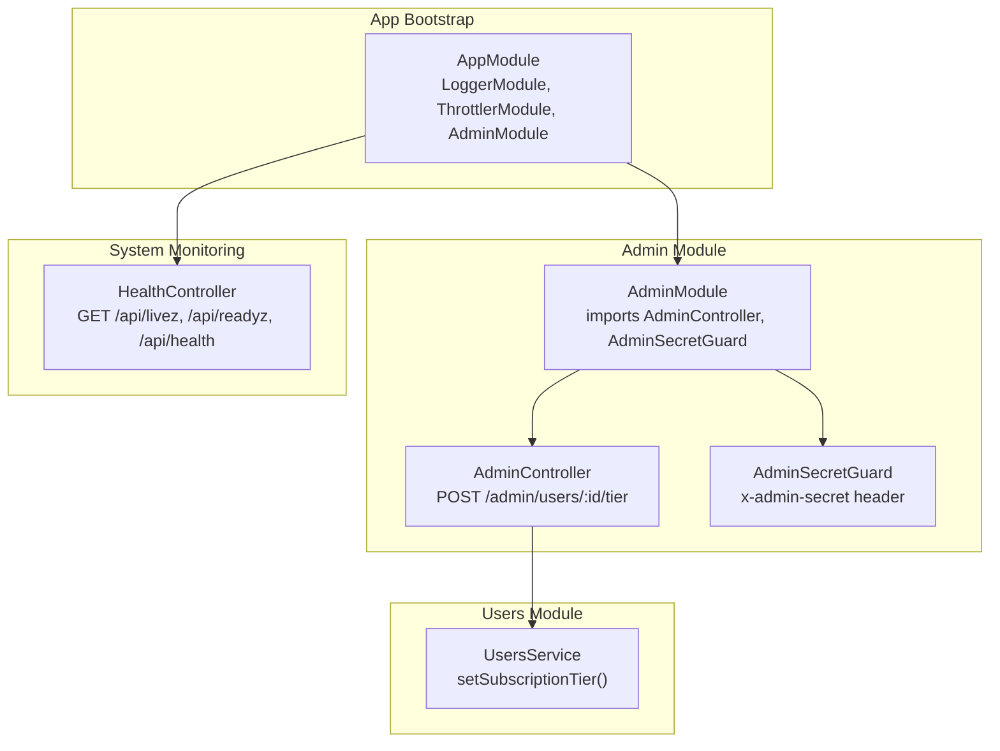
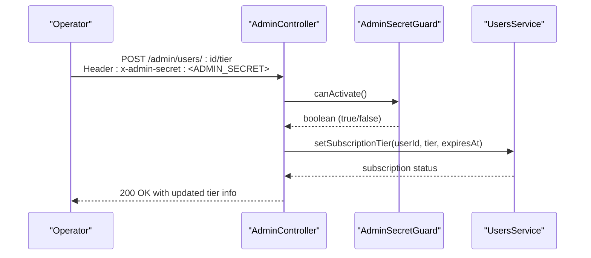
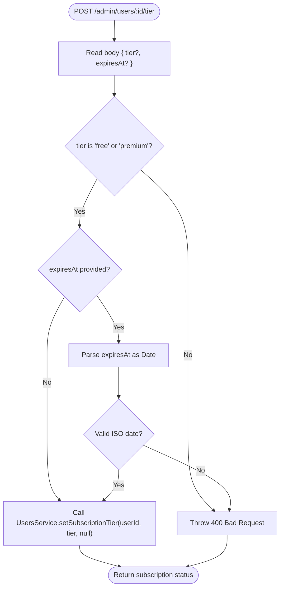
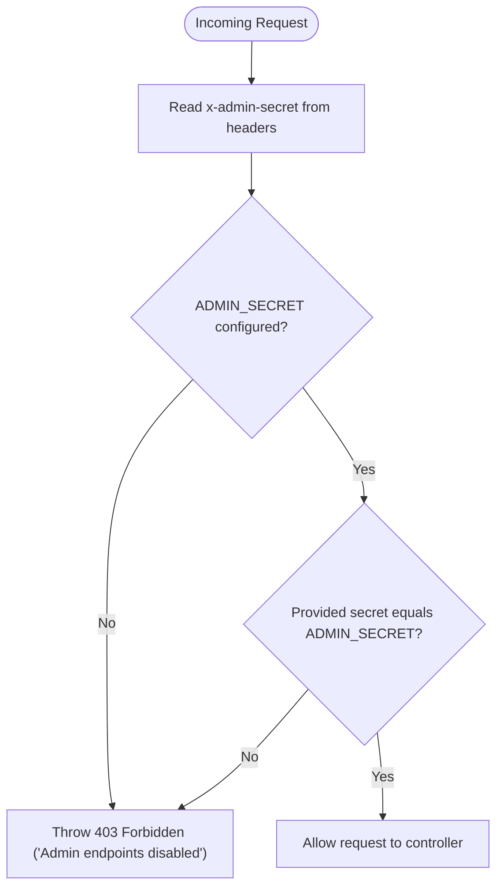
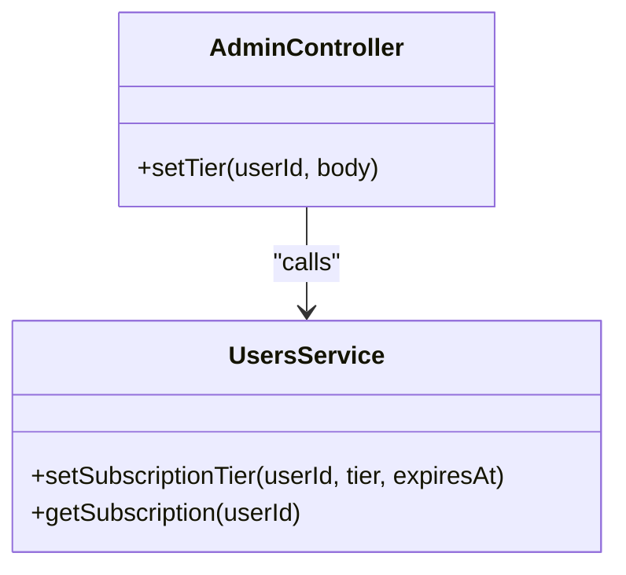
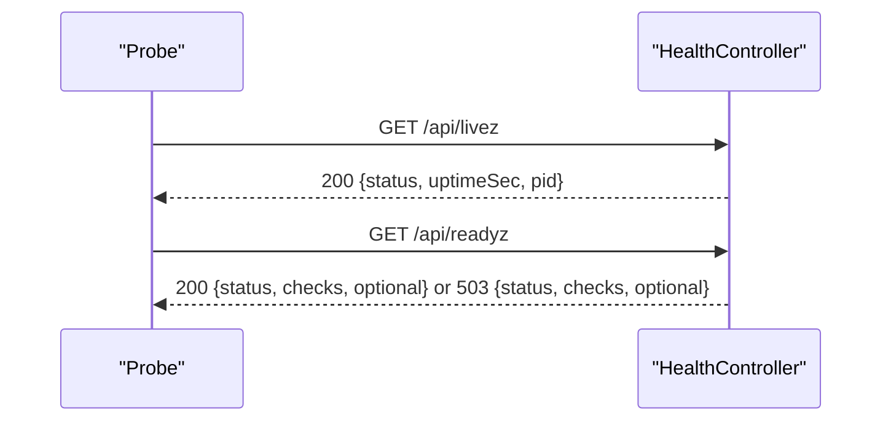
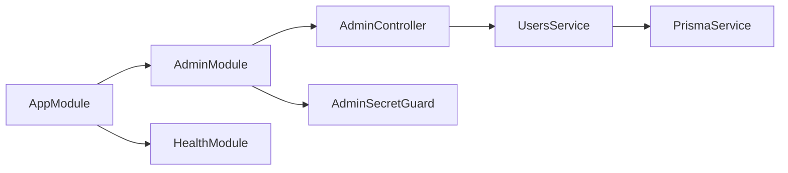

# Admin API

<cite>
**Referenced Files in This Document**
- [admin.module.ts](file://backend/src/admin/admin.module.ts)
- [admin.controller.ts](file://backend/src/admin/admin.controller.ts)
- [admin-secret.guard.ts](file://backend/src/admin/admin-secret.guard.ts)
- [users.service.ts](file://backend/src/users/users.service.ts)
- [health.controller.ts](file://backend/src/health/health.controller.ts)
- [app.module.ts](file://backend/src/app.module.ts)
</cite>

## Table of Contents
1. [Introduction](#introduction)
2. [Project Structure](#project-structure)
3. [Core Components](#core-components)
4. [Architecture Overview](#architecture-overview)
5. [Detailed Component Analysis](#detailed-component-analysis)
6. [Dependency Analysis](#dependency-analysis)
7. [Performance Considerations](#performance-considerations)
8. [Troubleshooting Guide](#troubleshooting-guide)
9. [Conclusion](#conclusion)

## Introduction
This document describes the administrative endpoints exposed by the backend API. It focuses on:
- Administrative user management (subscription tier updates)
- System monitoring and health probes
- Authentication and access control for admin operations
- Audit and logging behavior
- Practical operational examples using curl

The administrative surface is intentionally minimal and guarded by a shared secret header. Additional platform oversight capabilities (monitoring, quotas, and usage) are documented for completeness.

## Project Structure
Administrative functionality is encapsulated in a dedicated module with a single controller and guard. Supporting services provide administrative operations and system health checks.

**Diagram sources**
- [admin.module.ts:1-12](file://backend/src/admin/admin.module.ts#L1-L12)
- [admin.controller.ts:16-39](file://backend/src/admin/admin.controller.ts#L16-L39)
- [admin-secret.guard.ts:14-31](file://backend/src/admin/admin-secret.guard.ts#L14-L31)
- [users.service.ts:76-89](file://backend/src/users/users.service.ts#L76-L89)
- [health.controller.ts:14-121](file://backend/src/health/health.controller.ts#L14-L121)
- [app.module.ts:27-31](file://backend/src/app.module.ts#L27-L31)

**Section sources**
- [admin.module.ts:1-12](file://backend/src/admin/admin.module.ts#L1-L12)
- [admin.controller.ts:16-39](file://backend/src/admin/admin.controller.ts#L16-L39)
- [admin-secret.guard.ts:14-31](file://backend/src/admin/admin-secret.guard.ts#L14-L31)
- [users.service.ts:76-89](file://backend/src/users/users.service.ts#L76-L89)
- [health.controller.ts:14-121](file://backend/src/health/health.controller.ts#L14-L121)
- [app.module.ts:27-31](file://backend/src/app.module.ts#L27-L31)

## Core Components
- AdminModule: Declares the AdminController and AdminSecretGuard, and imports UsersModule for administrative operations.
- AdminController: Provides administrative endpoints under /admin, currently focused on user subscription tier management.
- AdminSecretGuard: Enforces admin access via a shared secret header and environment variable configuration.
- UsersService: Implements administrative operations such as setting a user’s subscription tier and expiration.
- HealthController: Exposes liveness and readiness probes for system monitoring and deployment platforms.

**Section sources**
- [admin.module.ts:6-11](file://backend/src/admin/admin.module.ts#L6-L11)
- [admin.controller.ts:12-39](file://backend/src/admin/admin.controller.ts#L12-L39)
- [admin-secret.guard.ts:9-31](file://backend/src/admin/admin-secret.guard.ts#L9-L31)
- [users.service.ts:72-89](file://backend/src/users/users.service.ts#L72-L89)
- [health.controller.ts:21-121](file://backend/src/health/health.controller.ts#L21-L121)

## Architecture Overview
Administrative endpoints are protected by a shared-secret guard and routed through a dedicated controller. The controller delegates administrative operations to the UsersService. System health is exposed via the HealthController for deployment and monitoring.

**Diagram sources**
- [admin.controller.ts:24-38](file://backend/src/admin/admin.controller.ts#L24-L38)
- [admin-secret.guard.ts:18-30](file://backend/src/admin/admin-secret.guard.ts#L18-L30)
- [users.service.ts:76-89](file://backend/src/users/users.service.ts#L76-L89)

## Detailed Component Analysis

### Admin Module and Controller
- Purpose: Provide administrative endpoints under /admin.
- Current endpoint: POST /admin/users/:id/tier to set a user’s subscription tier and optional expiration.
- Validation: Ensures tier is either "free" or "premium"; validates ISO date string for expiresAt if provided.

**Diagram sources**
- [admin.controller.ts:24-38](file://backend/src/admin/admin.controller.ts#L24-L38)

**Section sources**
- [admin.controller.ts:21-38](file://backend/src/admin/admin.controller.ts#L21-L38)

### Access Control and Authentication
- Secret Guard: Validates the presence and value of the x-admin-secret header against the ADMIN_SECRET environment variable.
- Behavior: If ADMIN_SECRET is not configured, access is denied immediately. If the provided secret does not match, access is denied.
- Scope: Applied globally to the AdminController.

**Diagram sources**
- [admin-secret.guard.ts:18-30](file://backend/src/admin/admin-secret.guard.ts#L18-L30)

**Section sources**
- [admin-secret.guard.ts:9-31](file://backend/src/admin/admin-secret.guard.ts#L9-L31)

### Users Service Integration
- Operation: setSubscriptionTier updates a user’s subscription tier and optional expiration date, then returns the updated subscription status.
- Usage: AdminController delegates administrative tier changes to this service.

**Diagram sources**
- [admin.controller.ts:24-38](file://backend/src/admin/admin.controller.ts#L24-L38)
- [users.service.ts:76-89](file://backend/src/users/users.service.ts#L76-L89)

**Section sources**
- [users.service.ts:72-89](file://backend/src/users/users.service.ts#L72-L89)

### System Monitoring Endpoints
- Liveness Probe: GET /api/livez returns basic runtime info without checking dependencies.
- Readiness Probe: GET /api/readyz performs database and environment checks; returns degraded status with 503 when checks fail.
- Legacy Health: GET /api/health remains for backward compatibility.

**Diagram sources**
- [health.controller.ts:27-106](file://backend/src/health/health.controller.ts#L27-L106)

**Section sources**
- [health.controller.ts:21-121](file://backend/src/health/health.controller.ts#L21-L121)

## Dependency Analysis
- AdminModule depends on UsersModule for administrative operations.
- AdminController depends on AdminSecretGuard for access control.
- UsersService depends on PrismaService for persistence.
- AppModule configures logging, throttling, and schedules the AdminModule.

**Diagram sources**
- [app.module.ts:27-31](file://backend/src/app.module.ts#L27-L31)
- [admin.module.ts:6-11](file://backend/src/admin/admin.module.ts#L6-L11)
- [admin.controller.ts:9](file://backend/src/admin/admin.controller.ts#L9)
- [users.service.ts:20-24](file://backend/src/users/users.service.ts#L20-L24)

**Section sources**
- [app.module.ts:34-171](file://backend/src/app.module.ts#L34-L171)
- [admin.module.ts:1-12](file://backend/src/admin/admin.module.ts#L1-L12)
- [users.service.ts:18-24](file://backend/src/users/users.service.ts#L18-L24)

## Performance Considerations
- The administrative endpoint performs a single database write and a subsequent read to return the updated subscription status. Complexity is O(1) with respect to user data.
- Health probes avoid heavy operations: liveness is immediate, readiness performs minimal checks and returns quickly.

[No sources needed since this section provides general guidance]

## Troubleshooting Guide
Common scenarios and resolutions:
- Unauthorized admin access
  - Cause: Missing or incorrect x-admin-secret header, or ADMIN_SECRET not configured.
  - Resolution: Ensure ADMIN_SECRET is set in the environment and include the matching secret in the x-admin-secret header.
  - Evidence: AdminSecretGuard throws 403 Forbidden when ADMIN_SECRET is absent or when the provided secret mismatches.
- Invalid request payload
  - Cause: tier is not "free" or "premium", or expiresAt is not a valid ISO date string.
  - Resolution: Correct the payload to match allowed values and valid date format.
  - Evidence: AdminController validates inputs and throws 400 Bad Request on invalid values.
- System maintenance mode symptoms
  - Symptom: Readiness probe returns 503 with degraded status.
  - Causes: Database connectivity issues, missing required environment variables, or dependency misconfiguration.
  - Resolution: Fix database credentials/network, ensure required environment variables are present, and verify optional integrations as needed.
  - Evidence: HealthController.readyz performs checks and returns 503 when any check fails.

**Section sources**
- [admin-secret.guard.ts:22-29](file://backend/src/admin/admin-secret.guard.ts#L22-L29)
- [admin.controller.ts:29-36](file://backend/src/admin/admin.controller.ts#L29-L36)
- [health.controller.ts:52-106](file://backend/src/health/health.controller.ts#L52-L106)

## Conclusion
The administrative API provides a minimal, secure surface for critical operations such as user subscription tier management. Access is enforced by a shared secret guard, and system health is exposed via standard probes for deployment platforms. Operational tasks like user onboarding assistance, diagnostics, and emergency maintenance can be performed with the documented endpoints and curl examples below.

[No sources needed since this section summarizes without analyzing specific files]

## API Reference

### Authentication
- Header: x-admin-secret: <ADMIN_SECRET>
- Requirement: ADMIN_SECRET must be configured in the environment; otherwise admin endpoints are disabled.

**Section sources**
- [admin-secret.guard.ts:21-29](file://backend/src/admin/admin-secret.guard.ts#L21-L29)

### Endpoints

- POST /admin/users/:id/tier
  - Description: Set a user’s subscription tier and optional expiration.
  - Path Parameters:
    - id: string (user identifier)
  - Request Body:
    - tier: "free" | "premium"
    - expiresAt: ISO date string (optional)
  - Responses:
    - 200 OK: Updated subscription status
    - 400 Bad Request: Invalid tier or expiresAt format
    - 403 Forbidden: Missing or invalid admin secret, or admin endpoints disabled
  - Example curl:
    - curl -X POST https://your-host/api/admin/users/{USER_ID}/tier \
      -H "x-admin-secret: YOUR_ADMIN_SECRET" \
      -H "Content-Type: application/json" \
      -d '{"tier":"premium","expiresAt":"2025-12-31T23:59:59Z"}'

**Section sources**
- [admin.controller.ts:24-38](file://backend/src/admin/admin.controller.ts#L24-L38)
- [users.service.ts:76-89](file://backend/src/users/users.service.ts#L76-L89)

### System Monitoring

- GET /api/livez
  - Description: Liveness probe indicating the process is responsive.
  - Response: 200 with status, uptime in seconds, and process ID.

- GET /api/readyz
  - Description: Readiness probe indicating the service can serve traffic.
  - Response: 200 with status, checks, and optional integration presence; 503 when checks fail.

- GET /api/health
  - Description: Legacy health endpoint for backward compatibility.
  - Response: 200 with status, timestamp, and uptime.

**Section sources**
- [health.controller.ts:27-119](file://backend/src/health/health.controller.ts#L27-L119)

## Operational Examples

- User onboarding assistance
  - Scenario: Grant a user premium access until a specific date.
  - curl:
    - curl -X POST https://your-host/api/admin/users/{USER_ID}/tier \
      -H "x-admin-secret: YOUR_ADMIN_SECRET" \
      -H "Content-Type: application/json" \
      -d '{"tier":"premium","expiresAt":"2025-12-31T23:59:59Z"}'

- System diagnostics
  - Check liveness: curl https://your-host/api/livez
  - Check readiness: curl https://your-host/api/readyz

- Emergency maintenance
  - If readiness probe fails, investigate database connectivity and required environment variables before restoring traffic.

**Section sources**
- [admin.controller.ts:24-38](file://backend/src/admin/admin.controller.ts#L24-L38)
- [health.controller.ts:52-106](file://backend/src/health/health.controller.ts#L52-L106)