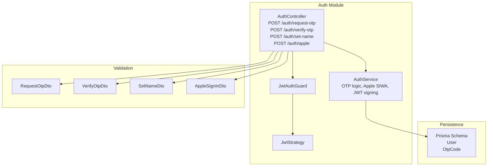
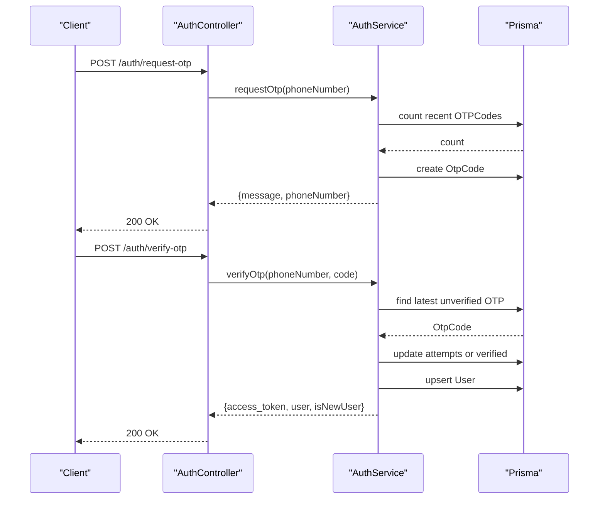
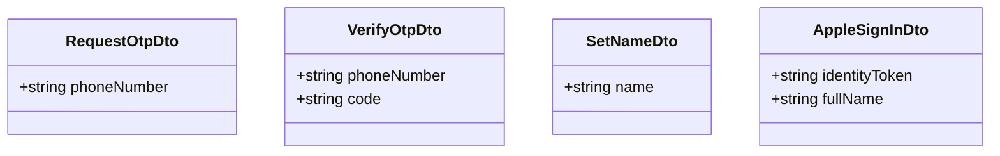
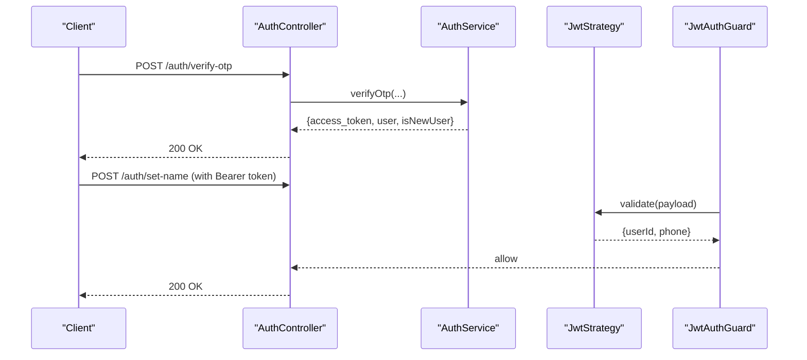
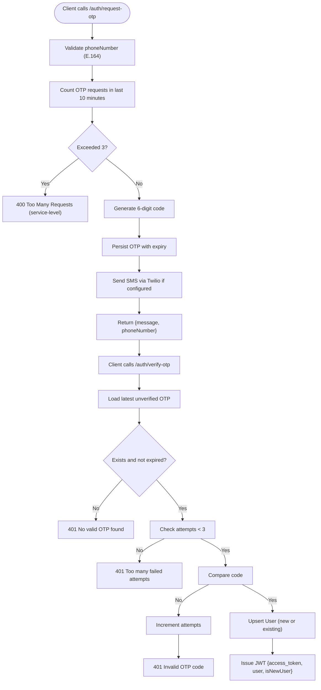
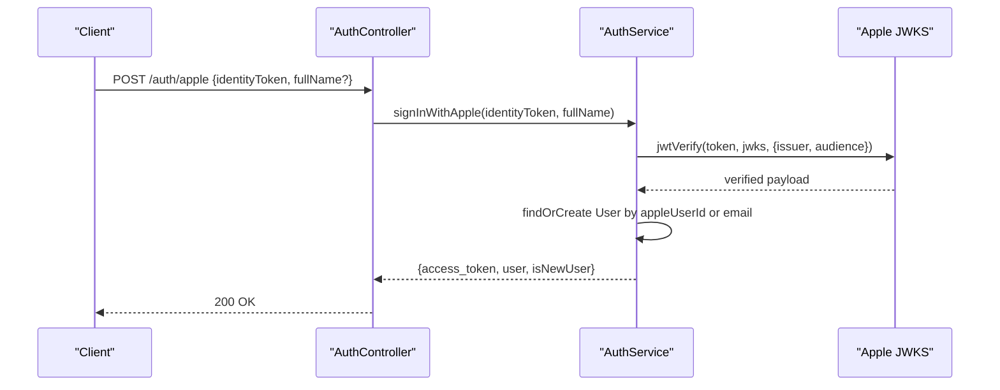
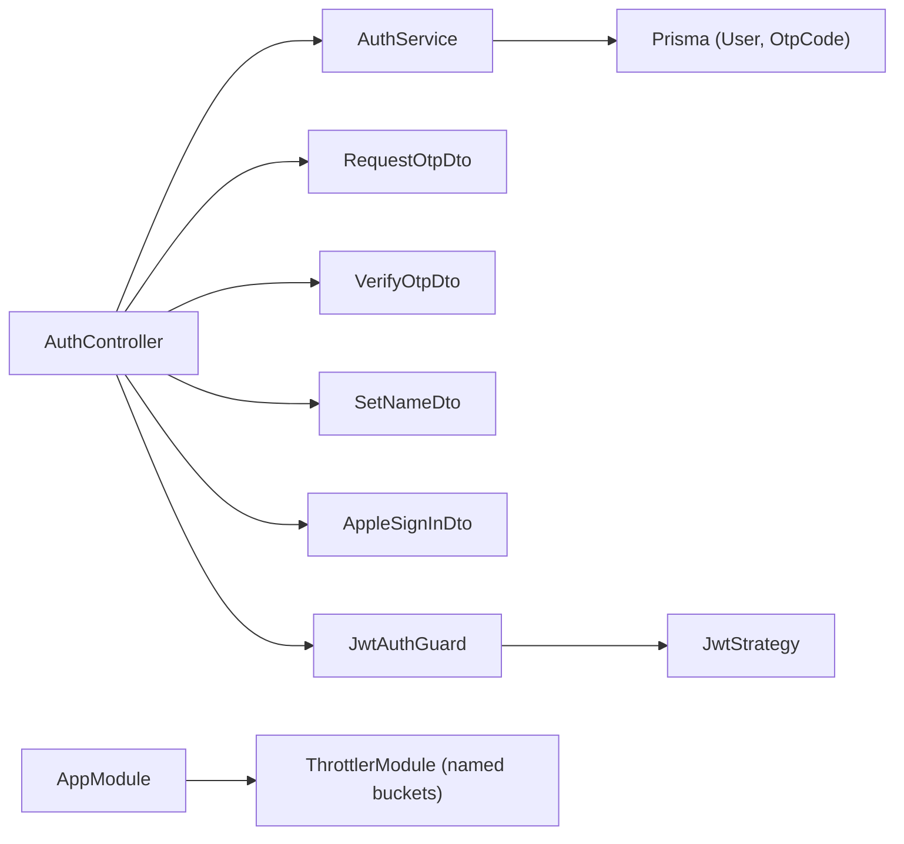

# Authentication API

<cite>
**Referenced Files in This Document**
- [auth.controller.ts](file://backend/src/auth/auth.controller.ts)
- [auth.service.ts](file://backend/src/auth/auth.service.ts)
- [auth.module.ts](file://backend/src/auth/auth.module.ts)
- [jwt.strategy.ts](file://backend/src/auth/jwt.strategy.ts)
- [jwt-auth.guard.ts](file://backend/src/auth/jwt-auth.guard.ts)
- [request-otp.dto.ts](file://backend/src/auth/dto/request-otp.dto.ts)
- [verify-otp.dto.ts](file://backend/src/auth/dto/verify-otp.dto.ts)
- [set-name.dto.ts](file://backend/src/auth/dto/set-name.dto.ts)
- [apple-signin.dto.ts](file://backend/src/auth/dto/apple-signin.dto.ts)
- [schema.prisma](file://backend/prisma/schema.prisma)
- [app.module.ts](file://backend/src/app.module.ts)
- [auth.ts (frontend)](file://frontend/src/api/auth.ts)
- [auth.ts (mobile)](file://mobile/src/api/auth.ts)
</cite>

## Table of Contents
1. [Introduction](#introduction)
2. [Project Structure](#project-structure)
3. [Core Components](#core-components)
4. [Architecture Overview](#architecture-overview)
5. [Detailed Component Analysis](#detailed-component-analysis)
6. [Dependency Analysis](#dependency-analysis)
7. [Performance Considerations](#performance-considerations)
8. [Troubleshooting Guide](#troubleshooting-guide)
9. [Conclusion](#conclusion)
10. [Appendices](#appendices)

## Introduction
This document describes the Authentication API endpoints for phone-based OTP and Apple Sign-In, including HTTP methods, URL patterns, request/response schemas, authentication requirements, rate limiting, and JWT token management. It also provides practical examples using curl commands, error handling strategies, and security considerations.

## Project Structure
The authentication subsystem is implemented as a NestJS module with a controller, service, guards, strategies, and DTOs. The module integrates with Prisma for persistence and uses NestJS Throttler for rate limiting.

**Diagram sources**
- [auth.controller.ts:22-58](file://backend/src/auth/auth.controller.ts#L22-L58)
- [auth.service.ts:9-340](file://backend/src/auth/auth.service.ts#L9-L340)
- [jwt-auth.guard.ts:1-6](file://backend/src/auth/jwt-auth.guard.ts#L1-L6)
- [jwt.strategy.ts:1-27](file://backend/src/auth/jwt.strategy.ts#L1-L27)
- [request-otp.dto.ts:1-10](file://backend/src/auth/dto/request-otp.dto.ts#L1-L10)
- [verify-otp.dto.ts:1-14](file://backend/src/auth/dto/verify-otp.dto.ts#L1-L14)
- [set-name.dto.ts:1-8](file://backend/src/auth/dto/set-name.dto.ts#L1-L8)
- [apple-signin.dto.ts:1-24](file://backend/src/auth/dto/apple-signin.dto.ts#L1-L24)
- [schema.prisma:12-74](file://backend/prisma/schema.prisma#L12-L74)
- [schema.prisma:701-712](file://backend/prisma/schema.prisma#L701-L712)

**Section sources**
- [auth.controller.ts:1-59](file://backend/src/auth/auth.controller.ts#L1-L59)
- [auth.service.ts:1-340](file://backend/src/auth/auth.service.ts#L1-L340)
- [auth.module.ts:1-40](file://backend/src/auth/auth.module.ts#L1-L40)
- [jwt.strategy.ts:1-27](file://backend/src/auth/jwt.strategy.ts#L1-L27)
- [jwt-auth.guard.ts:1-6](file://backend/src/auth/jwt-auth.guard.ts#L1-L6)
- [request-otp.dto.ts:1-10](file://backend/src/auth/dto/request-otp.dto.ts#L1-L10)
- [verify-otp.dto.ts:1-14](file://backend/src/auth/dto/verify-otp.dto.ts#L1-L14)
- [set-name.dto.ts:1-8](file://backend/src/auth/dto/set-name.dto.ts#L1-L8)
- [apple-signin.dto.ts:1-24](file://backend/src/auth/dto/apple-signin.dto.ts#L1-L24)
- [schema.prisma:12-74](file://backend/prisma/schema.prisma#L12-L74)
- [schema.prisma:701-712](file://backend/prisma/schema.prisma#L701-L712)

## Core Components
- AuthController: Exposes four endpoints under /auth and applies throttling and guards.
- AuthService: Implements OTP generation and verification, Apple Sign-In with JWT verification, user creation, and JWT issuance.
- DTOs: Strongly typed request schemas validated by class-validator.
- Guards and Strategy: JWT guard and passport-jwt strategy for bearer token validation.
- Persistence: Prisma models for User and OtpCode.

**Section sources**
- [auth.controller.ts:22-58](file://backend/src/auth/auth.controller.ts#L22-L58)
- [auth.service.ts:32-150](file://backend/src/auth/auth.service.ts#L32-L150)
- [auth.service.ts:237-322](file://backend/src/auth/auth.service.ts#L237-L322)
- [request-otp.dto.ts:1-10](file://backend/src/auth/dto/request-otp.dto.ts#L1-L10)
- [verify-otp.dto.ts:1-14](file://backend/src/auth/dto/verify-otp.dto.ts#L1-L14)
- [set-name.dto.ts:1-8](file://backend/src/auth/dto/set-name.dto.ts#L1-L8)
- [apple-signin.dto.ts:1-24](file://backend/src/auth/dto/apple-signin.dto.ts#L1-L24)
- [jwt-auth.guard.ts:1-6](file://backend/src/auth/jwt-auth.guard.ts#L1-L6)
- [jwt.strategy.ts:1-27](file://backend/src/auth/jwt.strategy.ts#L1-L27)
- [schema.prisma:12-74](file://backend/prisma/schema.prisma#L12-L74)
- [schema.prisma:701-712](file://backend/prisma/schema.prisma#L701-L712)

## Architecture Overview
The authentication flow integrates three layers:
- Transport and rate limiting: NestJS @Throttle decorator with named buckets.
- Validation: DTOs with class-validator constraints.
- Business logic: AuthService orchestrates OTP and Apple SIWA flows, persists data, and issues JWTs.

**Diagram sources**
- [auth.controller.ts:26-36](file://backend/src/auth/auth.controller.ts#L26-L36)
- [auth.service.ts:32-80](file://backend/src/auth/auth.service.ts#L32-L80)
- [auth.service.ts:86-150](file://backend/src/auth/auth.service.ts#L86-L150)
- [schema.prisma:701-712](file://backend/prisma/schema.prisma#L701-L712)
- [schema.prisma:12-74](file://backend/prisma/schema.prisma#L12-L74)

## Detailed Component Analysis

### Endpoint Catalog

- POST /auth/request-otp
  - Purpose: Generate and deliver a 6-digit OTP to the given phone number.
  - Authentication: Not required.
  - Rate Limiting: auth_short: 3 per minute; auth_long: 10 per 15 minutes (layered).
  - Request DTO: RequestOtpDto
    - Fields:
      - phoneNumber: string, E.164 format with optional leading plus.
  - Response:
    - message: string
    - phoneNumber: string (normalized)
  - Errors:
    - 400 Bad Request: Too many OTP requests in the last 10 minutes (service-level).
    - 400 Bad Request: Validation errors on phoneNumber format.
  - Security:
    - OTP stored with expiry and limited attempts.
    - SMS delivery via Twilio when configured and destination differs from sender number.

- POST /auth/verify-otp
  - Purpose: Verify OTP and issue JWT for the user (creating user if new).
  - Authentication: Not required.
  - Rate Limiting: auth_short: 3 per minute; auth_long: 10 per 15 minutes (layered).
  - Request DTO: VerifyOtpDto
    - Fields:
      - phoneNumber: string, E.164 format.
      - code: string, exactly 6 digits.
  - Response:
    - access_token: string (JWT)
    - user: object
      - id: string
      - phoneNumber: string
      - name: string
      - avatarUrl: string|null
    - isNewUser: boolean
  - Errors:
    - 401 Unauthorized: No valid OTP found; invalid or expired.
    - 401 Unauthorized: Too many failed attempts; invalid code.
  - Security:
    - Attempts tracked per OTP record; max 3 failures.
    - JWT payload includes sub (user id) and phone.

- POST /auth/set-name
  - Purpose: Set user’s display name after initial authentication.
  - Authentication: JWT required (JwtAuthGuard).
  - Request DTO: SetNameDto
    - Fields:
      - name: string, minimum length 1.
  - Response:
    - id: string
    - phoneNumber: string
    - name: string
    - avatarUrl: string|null
  - Errors:
    - 401 Unauthorized: Missing/invalid JWT.
    - 400 Bad Request: Validation errors on name.

- POST /auth/apple
  - Purpose: Sign in with Apple using identityToken; returns JWT and user info.
  - Authentication: Not required.
  - Rate Limiting: auth_short: 3 per minute; auth_long: 10 per 15 minutes (layered).
  - Request DTO: AppleSignInDto
    - Fields:
      - identityToken: string (required)
      - fullName: string, optional, max 80 chars.
  - Response:
    - access_token: string (JWT)
    - user: object
      - id: string
      - phoneNumber: string (empty if Apple-only user)
      - name: string
      - avatarUrl: string|null
      - email: string|null
    - isNewUser: boolean
  - Errors:
    - 400 Bad Request: Missing identityToken or server misconfigured.
    - 401 Unauthorized: Invalid Apple token (aud/iss/exp/sub checks).
  - Security:
    - Verified against Apple JWKS with issuer and audience checks.
    - Uses stable sub (Apple user id) as primary identity.

**Section sources**
- [auth.controller.ts:26-57](file://backend/src/auth/auth.controller.ts#L26-L57)
- [auth.service.ts:32-80](file://backend/src/auth/auth.service.ts#L32-L80)
- [auth.service.ts:86-150](file://backend/src/auth/auth.service.ts#L86-L150)
- [auth.service.ts:237-322](file://backend/src/auth/auth.service.ts#L237-L322)
- [request-otp.dto.ts:1-10](file://backend/src/auth/dto/request-otp.dto.ts#L1-L10)
- [verify-otp.dto.ts:1-14](file://backend/src/auth/dto/verify-otp.dto.ts#L1-L14)
- [set-name.dto.ts:1-8](file://backend/src/auth/dto/set-name.dto.ts#L1-L8)
- [apple-signin.dto.ts:1-24](file://backend/src/auth/dto/apple-signin.dto.ts#L1-L24)
- [jwt-auth.guard.ts:1-6](file://backend/src/auth/jwt-auth.guard.ts#L1-L6)

### DTO Schemas

**Diagram sources**
- [request-otp.dto.ts:1-10](file://backend/src/auth/dto/request-otp.dto.ts#L1-L10)
- [verify-otp.dto.ts:1-14](file://backend/src/auth/dto/verify-otp.dto.ts#L1-L14)
- [set-name.dto.ts:1-8](file://backend/src/auth/dto/set-name.dto.ts#L1-L8)
- [apple-signin.dto.ts:1-24](file://backend/src/auth/dto/apple-signin.dto.ts#L1-L24)

**Section sources**
- [request-otp.dto.ts:1-10](file://backend/src/auth/dto/request-otp.dto.ts#L1-L10)
- [verify-otp.dto.ts:1-14](file://backend/src/auth/dto/verify-otp.dto.ts#L1-L14)
- [set-name.dto.ts:1-8](file://backend/src/auth/dto/set-name.dto.ts#L1-L8)
- [apple-signin.dto.ts:1-24](file://backend/src/auth/dto/apple-signin.dto.ts#L1-L24)

### JWT Token Management
- Issuance:
  - After successful OTP verification or Apple Sign-In, the service creates a JWT with payload containing sub (user id) and phone.
- Validation:
  - JwtAuthGuard delegates to JwtStrategy, which extracts the token from Authorization header and validates it using the configured secret.
- Expiration:
  - Configurable via JWT_EXPIRATION environment variable; default shown in module factory.
- Secret Requirement:
  - Boot fails if JWT_SECRET is not present or too weak.

**Diagram sources**
- [auth.controller.ts:38-42](file://backend/src/auth/auth.controller.ts#L38-L42)
- [auth.service.ts:136-149](file://backend/src/auth/auth.service.ts#L136-L149)
- [jwt-auth.guard.ts:1-6](file://backend/src/auth/jwt-auth.guard.ts#L1-L6)
- [jwt.strategy.ts:23-25](file://backend/src/auth/jwt.strategy.ts#L23-L25)
- [auth.module.ts:12-33](file://backend/src/auth/auth.module.ts#L12-L33)

**Section sources**
- [auth.service.ts:136-149](file://backend/src/auth/auth.service.ts#L136-L149)
- [jwt-auth.guard.ts:1-6](file://backend/src/auth/jwt-auth.guard.ts#L1-L6)
- [jwt.strategy.ts:8-21](file://backend/src/auth/jwt.strategy.ts#L8-L21)
- [auth.module.ts:12-33](file://backend/src/auth/auth.module.ts#L12-L33)

### Phone OTP Authentication Flow

**Diagram sources**
- [auth.service.ts:32-80](file://backend/src/auth/auth.service.ts#L32-L80)
- [auth.service.ts:86-150](file://backend/src/auth/auth.service.ts#L86-L150)
- [schema.prisma:701-712](file://backend/prisma/schema.prisma#L701-L712)
- [schema.prisma:12-74](file://backend/prisma/schema.prisma#L12-L74)

**Section sources**
- [auth.service.ts:32-80](file://backend/src/auth/auth.service.ts#L32-L80)
- [auth.service.ts:86-150](file://backend/src/auth/auth.service.ts#L86-L150)
- [schema.prisma:701-712](file://backend/prisma/schema.prisma#L701-L712)
- [schema.prisma:12-74](file://backend/prisma/schema.prisma#L12-L74)

### Apple Sign-In Integration
- Validates identityToken against Apple JWKS with issuer https://appleid.apple.com and expected audience from APPLE_CLIENT_ID.
- Creates or links a user using stable sub (Apple user id), optionally email, and optional fullName.
- Issues JWT with the same payload as OTP flow.

**Diagram sources**
- [auth.controller.ts:53-57](file://backend/src/auth/auth.controller.ts#L53-L57)
- [auth.service.ts:237-322](file://backend/src/auth/auth.service.ts#L237-L322)

**Section sources**
- [auth.controller.ts:44-57](file://backend/src/auth/auth.controller.ts#L44-L57)
- [auth.service.ts:237-322](file://backend/src/auth/auth.service.ts#L237-L322)

## Dependency Analysis
- Controller depends on AuthService and DTOs.
- AuthService depends on Prisma models, JWT service, and configuration.
- JwtAuthGuard depends on JwtStrategy.
- Global throttling is configured in AppModule with named buckets.

**Diagram sources**
- [auth.controller.ts:1-59](file://backend/src/auth/auth.controller.ts#L1-L59)
- [auth.service.ts:1-340](file://backend/src/auth/auth.service.ts#L1-L340)
- [jwt-auth.guard.ts:1-6](file://backend/src/auth/jwt-auth.guard.ts#L1-L6)
- [jwt.strategy.ts:1-27](file://backend/src/auth/jwt.strategy.ts#L1-L27)
- [app.module.ts:133-137](file://backend/src/app.module.ts#L133-L137)
- [schema.prisma:12-74](file://backend/prisma/schema.prisma#L12-L74)
- [schema.prisma:701-712](file://backend/prisma/schema.prisma#L701-L712)

**Section sources**
- [auth.controller.ts:1-59](file://backend/src/auth/auth.controller.ts#L1-L59)
- [auth.service.ts:1-340](file://backend/src/auth/auth.service.ts#L1-L340)
- [jwt-auth.guard.ts:1-6](file://backend/src/auth/jwt-auth.guard.ts#L1-L6)
- [jwt.strategy.ts:1-27](file://backend/src/auth/jwt.strategy.ts#L1-L27)
- [app.module.ts:133-137](file://backend/src/app.module.ts#L133-L137)
- [schema.prisma:12-74](file://backend/prisma/schema.prisma#L12-L74)
- [schema.prisma:701-712](file://backend/prisma/schema.prisma#L701-L712)

## Performance Considerations
- Layered throttling:
  - auth_short: 3 requests per minute (per IP).
  - auth_long: 10 requests per 15 minutes (per IP).
- Additional protections:
  - Service-level cap of 3 OTP requests per phone in the last 10 minutes.
  - OTP max attempts: 3 per code.
  - Automatic cleanup of expired OTPs hourly.
- Recommendations:
  - Use exponential backoff on client retry.
  - Cache successful OTPs briefly to reduce redundant requests.
  - Monitor rate limit violations and adjust thresholds as needed.

[No sources needed since this section provides general guidance]

## Troubleshooting Guide
Common errors and resolutions:
- 400 Bad Request
  - Invalid phone number format: Ensure E.164 format with country code.
  - Too many OTP requests in the last 10 minutes: Wait before requesting another OTP.
  - Missing identityToken for Apple Sign-In: Provide a valid Apple identityToken.
- 401 Unauthorized
  - No valid OTP found or expired: Request a new OTP.
  - Too many failed attempts: Request a new OTP; avoid brute-force.
  - Invalid OTP code: Re-enter the code; ensure it is exactly 6 digits.
  - Invalid Apple identity token: Verify token audience and issuer; ensure APPLE_CLIENT_ID is configured.
  - Missing/invalid JWT: Include a valid Authorization: Bearer <token>.
- Rate limit exceeded
  - Reduce request frequency; respect auth_short and auth_long buckets.
  - Consider client-side jitter/backoff.

**Section sources**
- [auth.service.ts:44-46](file://backend/src/auth/auth.service.ts#L44-L46)
- [auth.service.ts:99-115](file://backend/src/auth/auth.service.ts#L99-L115)
- [auth.service.ts:238-248](file://backend/src/auth/auth.service.ts#L238-L248)
- [auth.service.ts:257-261](file://backend/src/auth/auth.service.ts#L257-L261)
- [jwt.strategy.ts:12-15](file://backend/src/auth/jwt.strategy.ts#L12-L15)

## Conclusion
The Authentication API provides secure, rate-limited phone OTP and Apple Sign-In flows with robust validation, JWT issuance, and user persistence. Clients should follow the documented schemas, respect rate limits, and handle error responses appropriately.

[No sources needed since this section summarizes without analyzing specific files]

## Appendices

### Practical Examples

- Request OTP
  - curl
    - curl -X POST https://yourdomain.com/auth/request-otp -H "Content-Type: application/json" -d '{"phoneNumber":"+15551234567"}'
  - Response
    - {"message":"OTP sent successfully","phoneNumber":"+15551234567"}

- Verify OTP
  - curl
    - curl -X POST https://yourdomain.com/auth/verify-otp -H "Content-Type: application/json" -d '{"phoneNumber":"+15551234567","code":"123456"}'
  - Response
    - {"access_token":"<JWT>","user":{"id":"...","phoneNumber":"+15551234567","name":"","avatarUrl":null},"isNewUser":true}

- Set Name (after initial verification)
  - curl
    - curl -X POST https://yourdomain.com/auth/set-name -H "Authorization: Bearer <JWT>" -H "Content-Type: application/json" -d '{"name":"Alex"}'
  - Response
    - {"id":"...","phoneNumber":"+15551234567","name":"Alex","avatarUrl":null}

- Apple Sign-In
  - curl
    - curl -X POST https://yourdomain.com/auth/apple -H "Content-Type: application/json" -d '{"identityToken":"<Apple identityToken>","fullName":"Alex"}'
  - Response
    - {"access_token":"<JWT>","user":{"id":"...","phoneNumber":"","name":"Alex","avatarUrl":null,"email":null},"isNewUser":true}

### Error Handling Strategies
- Invalid OTP code: Prompt user to re-enter; do not spam retries.
- Rate limit exceeded: Implement client-side backoff and inform the user.
- Apple token invalid: Re-initiate Apple Sign-In flow; verify server configuration (APPLE_CLIENT_ID).

### Security Considerations
- Always use HTTPS in production.
- Enforce JWT_SECRET strength and rotation.
- Validate Apple token audience and issuer strictly.
- Avoid logging OTP codes; mask logs in non-production environments.
- Keep Twilio credentials secure and restrict sender/receiver numbers.

**Section sources**
- [auth.controller.ts:26-57](file://backend/src/auth/auth.controller.ts#L26-L57)
- [auth.service.ts:62-77](file://backend/src/auth/auth.service.ts#L62-L77)
- [auth.service.ts:242-248](file://backend/src/auth/auth.service.ts#L242-L248)
- [auth.module.ts:18-24](file://backend/src/auth/auth.module.ts#L18-L24)