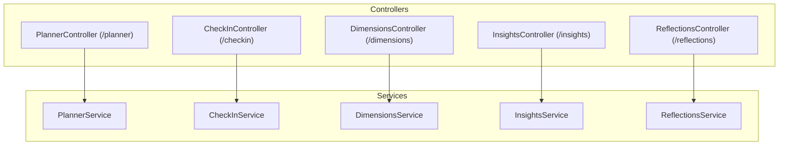
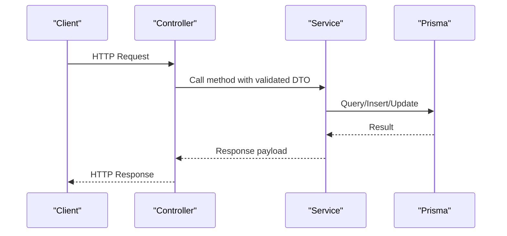
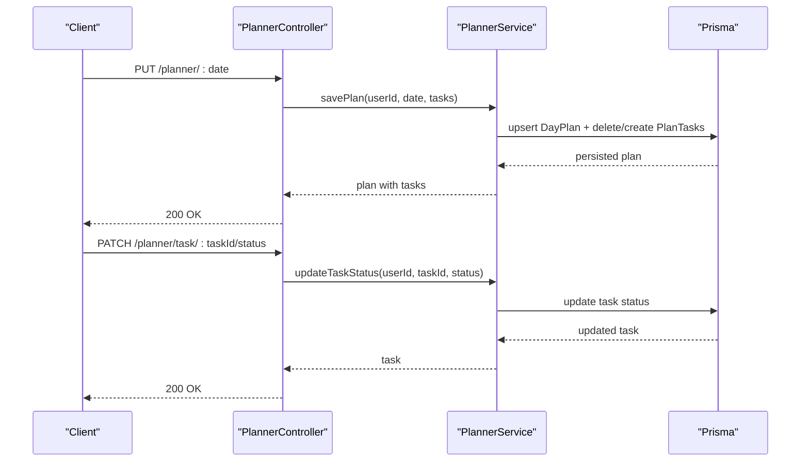
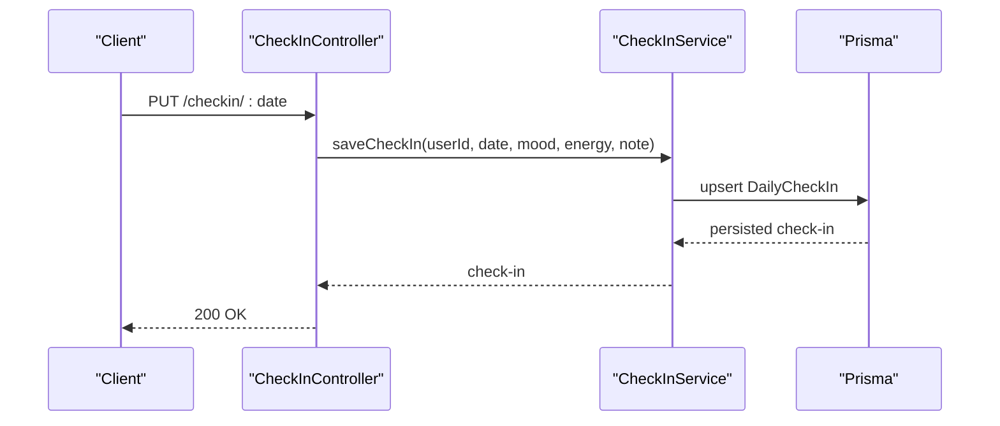
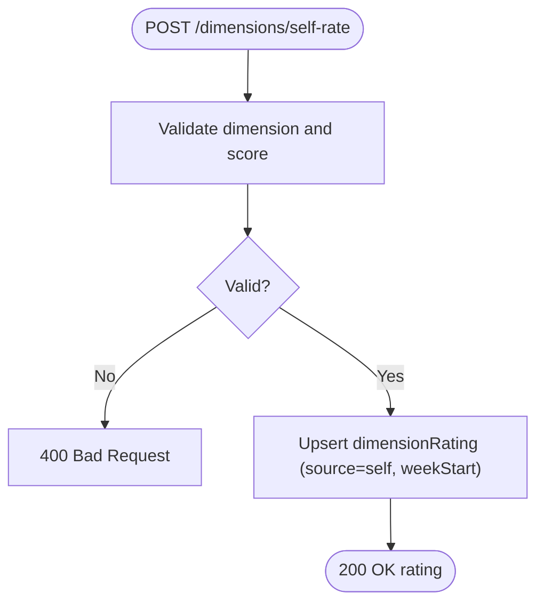
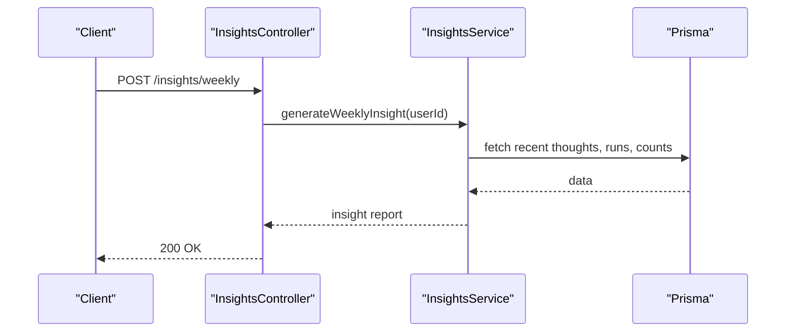
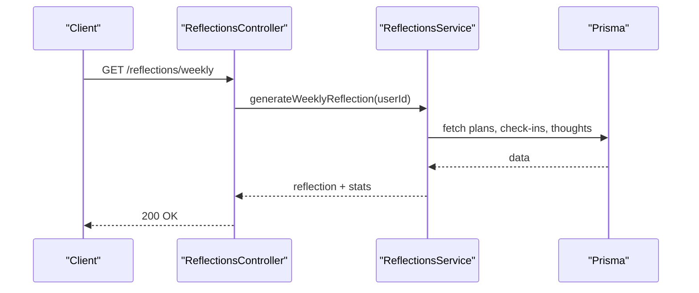
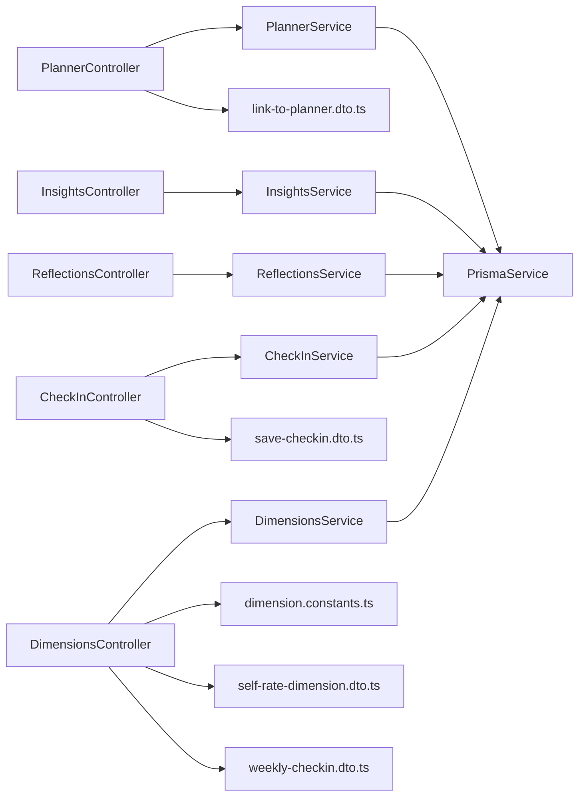

# Core Features API

<cite>
**Referenced Files in This Document**
- [planner.controller.ts](file://backend/src/planner/planner.controller.ts)
- [planner.service.ts](file://backend/src/planner/planner.service.ts)
- [checkin.controller.ts](file://backend/src/checkin/checkin.controller.ts)
- [checkin.service.ts](file://backend/src/checkin/checkin.service.ts)
- [dimensions.controller.ts](file://backend/src/dimensions/dimensions.controller.ts)
- [dimensions.service.ts](file://backend/src/dimensions/dimensions.service.ts)
- [dimension.constants.ts](file://backend/src/dimensions/dimension.constants.ts)
- [self-rate-dimension.dto.ts](file://backend/src/dimensions/dto/self-rate-dimension.dto.ts)
- [weekly-checkin.dto.ts](file://backend/src/dimensions/dto/weekly-checkin.dto.ts)
- [save-checkin.dto.ts](file://backend/src/checkin/dto/save-checkin.dto.ts)
- [insights.controller.ts](file://backend/src/insights/insights.controller.ts)
- [insights.service.ts](file://backend/src/insights/insights.service.ts)
- [reflections.controller.ts](file://backend/src/reflections/reflections.controller.ts)
- [reflections.service.ts](file://backend/src/reflections/reflections.service.ts)
</cite>

## Table of Contents
1. [Introduction](#introduction)
2. [Project Structure](#project-structure)
3. [Core Components](#core-components)
4. [Architecture Overview](#architecture-overview)
5. [Detailed Component Analysis](#detailed-component-analysis)
6. [Dependency Analysis](#dependency-analysis)
7. [Performance Considerations](#performance-considerations)
8. [Troubleshooting Guide](#troubleshooting-guide)
9. [Conclusion](#conclusion)
10. [Appendices](#appendices)

## Introduction
This document describes the core life management APIs for planner operations, daily check-in, dimension tracking, and insights generation. It covers endpoint URLs, HTTP methods, request/response shapes, and practical usage examples with curl commands. It also explains the dimension rating system, signal collection, weekly check-in workflows, and automated insight generation.

## Project Structure
The core endpoints are organized under dedicated NestJS controllers and services:
- Planner: manage daily plans, task status, and AI-powered task insights
- Check-in: log daily mood and energy, retrieve recent entries
- Dimensions: self-ratings, weekly check-in, radar view, history, and detail
- Insights: statistics, recurring topics, weekly and evolution reports, relationship health, life dimensions classification
- Reflections: evening and weekly reflection prompts

**Diagram sources**
- [planner.controller.ts:16-62](file://backend/src/planner/planner.controller.ts#L16-L62)
- [checkin.controller.ts:15-47](file://backend/src/checkin/checkin.controller.ts#L15-L47)
- [dimensions.controller.ts:15-54](file://backend/src/dimensions/dimensions.controller.ts#L15-L54)
- [insights.controller.ts:13-62](file://backend/src/insights/insights.controller.ts#L13-L62)
- [reflections.controller.ts:5-19](file://backend/src/reflections/reflections.controller.ts#L5-L19)

**Section sources**
- [planner.controller.ts:16-62](file://backend/src/planner/planner.controller.ts#L16-L62)
- [checkin.controller.ts:15-47](file://backend/src/checkin/checkin.controller.ts#L15-L47)
- [dimensions.controller.ts:15-54](file://backend/src/dimensions/dimensions.controller.ts#L15-L54)
- [insights.controller.ts:13-62](file://backend/src/insights/insights.controller.ts#L13-L62)
- [reflections.controller.ts:5-19](file://backend/src/reflections/reflections.controller.ts#L5-L19)

## Core Components
- Planner: CRUD-like plan management, task status updates, and AI-powered task insights
- Check-in: daily mood and energy logging with recent history retrieval
- Dimensions: weekly radar view, individual dimension self-ratings, weekly check-in, history, and detail
- Insights: weekly and evolution reports, recurring topics, stats, and relationship health
- Reflections: evening and weekly reflection prompts

**Section sources**
- [planner.controller.ts:21-61](file://backend/src/planner/planner.controller.ts#L21-L61)
- [checkin.controller.ts:20-46](file://backend/src/checkin/checkin.controller.ts#L20-L46)
- [dimensions.controller.ts:20-53](file://backend/src/dimensions/dimensions.controller.ts#L20-L53)
- [insights.controller.ts:18-61](file://backend/src/insights/insights.controller.ts#L18-L61)
- [reflections.controller.ts:10-18](file://backend/src/reflections/reflections.controller.ts#L10-L18)

## Architecture Overview
The API follows a layered architecture:
- Controllers expose HTTP endpoints and apply JWT guard
- Services encapsulate business logic and interact with Prisma
- DTOs validate request bodies
- Constants define dimension taxonomy and computation helpers

**Diagram sources**
- [planner.controller.ts:16-62](file://backend/src/planner/planner.controller.ts#L16-L62)
- [planner.service.ts:26-142](file://backend/src/planner/planner.service.ts#L26-L142)
- [checkin.controller.ts:15-47](file://backend/src/checkin/checkin.controller.ts#L15-L47)
- [checkin.service.ts:6-47](file://backend/src/checkin/checkin.service.ts#L6-L47)
- [dimensions.controller.ts:15-54](file://backend/src/dimensions/dimensions.controller.ts#L15-L54)
- [dimensions.service.ts:31-198](file://backend/src/dimensions/dimensions.service.ts#L31-L198)
- [insights.controller.ts:13-62](file://backend/src/insights/insights.controller.ts#L13-L62)
- [insights.service.ts:8-174](file://backend/src/insights/insights.service.ts#L8-L174)
- [reflections.controller.ts:5-19](file://backend/src/reflections/reflections.controller.ts#L5-L19)
- [reflections.service.ts:8-129](file://backend/src/reflections/reflections.service.ts#L8-L129)

## Detailed Component Analysis

### Planner API
Endpoints for daily plan creation, retrieval, task status updates, and AI-powered task insights.

- GET /api/planner/dates/:year/:month
  - Purpose: List dates with saved plans for a calendar month
  - Path params: year (number), month (number)
  - Response: Array of { date, taskCount }
  - Notes: Returns only dates with non-empty plans

- GET /api/planner/stats?days=N
  - Purpose: Completion statistics over N days (default 7)
  - Query: days (optional)
  - Response: { total, done, skipped, pending, completionRate, streak, days }

- GET /api/planner/:date
  - Purpose: Retrieve plan and tasks for a specific date
  - Path param: date (ISO string)
  - Response: Plan object with tasks ordered by sort order

- PUT /api/planner/:date
  - Purpose: Save or replace tasks for a date
  - Path param: date (ISO string)
  - Body: tasks[] with { timeSlot, task, sortOrder }
  - Response: Full plan with tasks

- POST /api/planner/insight/:taskId
  - Purpose: Generate AI-powered workflow insight for a task
  - Path param: taskId (string)
  - Response: { taskId, insight, cached: boolean }
  - Notes: Results are cached on the task

- PATCH /api/planner/task/:taskId/status
  - Purpose: Update task status
  - Path param: taskId (string)
  - Body: { status: "done" | "skipped" | "pending" }
  - Response: Updated task

Common errors:
- Task not found (404) when updating status or retrieving insights

Example curl commands:
- Create/replace plan for 2025-06-15:
  - curl -X PUT "$BASE_URL/api/planner/2025-06-15" -H "Authorization: Bearer $TOKEN" -H "Content-Type: application/json" -d '{"tasks":[{"timeSlot":"09:00-10:00","task":"Review Q2 goals","sortOrder":1}]}'

- Update task status:
  - curl -X PATCH "$BASE_URL/api/planner/task/12345/status" -H "Authorization: Bearer $TOKEN" -H "Content-Type: application/json" -d '{"status":"done"}'

- Get AI insight for a task:
  - curl -X POST "$BASE_URL/api/planner/insight/12345" -H "Authorization: Bearer $TOKEN"

**Diagram sources**
- [planner.controller.ts:40-61](file://backend/src/planner/planner.controller.ts#L40-L61)
- [planner.service.ts:90-142](file://backend/src/planner/planner.service.ts#L90-L142)
- [planner.service.ts:147-172](file://backend/src/planner/planner.service.ts#L147-L172)

**Section sources**
- [planner.controller.ts:21-61](file://backend/src/planner/planner.controller.ts#L21-L61)
- [planner.service.ts:44-142](file://backend/src/planner/planner.service.ts#L44-L142)
- [planner.service.ts:147-172](file://backend/src/planner/planner.service.ts#L147-L172)

### Daily Check-in API
Endpoints for logging mood and energy, retrieving recent entries, and fetching a specific day’s check-in.

- GET /api/checkin/recent?days=N
  - Purpose: Retrieve recent check-ins
  - Query: days (optional, default 14)
  - Response: Array of check-ins sorted by date desc

- GET /api/checkin/:date
  - Purpose: Retrieve a specific day’s check-in
  - Path param: date (ISO string)
  - Response: Single check-in or null

- PUT /api/checkin/:date
  - Purpose: Save or update mood and energy for a date
  - Path param: date (ISO string)
  - Body: { mood: integer 1-5, energy: integer 1-5, note?: string }
  - Response: Saved check-in

Validation rules:
- mood ∈ [1,5], energy ∈ [1,5]
- note is optional

Example curl commands:
- Log mood and energy for 2025-06-15:
  - curl -X PUT "$BASE_URL/api/checkin/2025-06-15" -H "Authorization: Bearer $TOKEN" -H "Content-Type: application/json" -d '{"mood":4,"energy":3,"note":"Team sync went well"}'

- Get recent check-ins:
  - curl -X GET "$BASE_URL/api/checkin/recent?days=7" -H "Authorization: Bearer $TOKEN"

**Diagram sources**
- [checkin.controller.ts:33-46](file://backend/src/checkin/checkin.controller.ts#L33-L46)
- [checkin.service.ts:13-47](file://backend/src/checkin/checkin.service.ts#L13-L47)

**Section sources**
- [checkin.controller.ts:20-46](file://backend/src/checkin/checkin.controller.ts#L20-L46)
- [checkin.service.ts:13-73](file://backend/src/checkin/checkin.service.ts#L13-L73)
- [save-checkin.dto.ts:3-17](file://backend/src/checkin/dto/save-checkin.dto.ts#L3-L17)

### Dimensions API
Endpoints for life wheel radar, self-ratings, weekly check-in, history, and detail views.

- GET /api/dimensions
  - Purpose: Full life wheel (radar payload)
  - Response: { dimensions[], weekStart, needsWeeklyCheckin, daysSinceCheckin }

- POST /api/dimensions/self-rate
  - Purpose: Rate a single dimension
  - Body: { dimension: string, score: integer 1-10, note?: string }
  - Response: Persisted rating
  - Validation: dimension must be one of health, financial, career, intellectual, relationships, purpose

- POST /api/dimensions/weekly-checkin
  - Purpose: Submit ratings for all dimensions in one call
  - Body: { ratings: Record<string,number>, note?: string }
  - Response: { weekStart, ratings[] }
  - Behavior: Skips unknown dimensions; clamps scores to 1–10

- GET /api/dimensions/:dim/history
  - Purpose: 12-week trend for a dimension
  - Path param: dim ∈ {health, financial, career, intellectual, relationships, purpose}
  - Response: { dimension, label, weeks[] }

- GET /api/dimensions/:dim/detail
  - Purpose: Recent signals and latest self rating for a dimension
  - Response: { dimension, label, description, observedScore, latestSelfScore, latestSelfRatedAt, recentSignals[] }

Dimension taxonomy and computation:
- Dimensions: health, financial, career, intellectual, relationships, purpose
- Observed score computed from valence signals with a 4-week decaying window
- Week start is the Monday of the ISO week (UTC)

Example curl commands:
- Self-rate relationships:
  - curl -X POST "$BASE_URL/api/dimensions/self-rate" -H "Authorization: Bearer $TOKEN" -H "Content-Type: application/json" -d '{"dimension":"relationships","score":8,"note":"Quality time with family"}'

- Weekly check-in:
  - curl -X POST "$BASE_URL/api/dimensions/weekly-checkin" -H "Authorization: Bearer $TOKEN" -H "Content-Type: application/json" -d '{"ratings":{"health":7,"career":6},"note":"Midweek check-in"}'

- Get dimension history:
  - curl -X GET "$BASE_URL/api/dimensions/health/history" -H "Authorization: Bearer $TOKEN"

- Get dimension detail:
  - curl -X GET "$BASE_URL/api/dimensions/purpose/detail" -H "Authorization: Bearer $TOKEN"

**Diagram sources**
- [dimensions.controller.ts:26-35](file://backend/src/dimensions/dimensions.controller.ts#L26-L35)
- [self-rate-dimension.dto.ts:4-17](file://backend/src/dimensions/dto/self-rate-dimension.dto.ts#L4-L17)
- [dimensions.service.ts:41-58](file://backend/src/dimensions/dimensions.service.ts#L41-L58)

**Section sources**
- [dimensions.controller.ts:20-53](file://backend/src/dimensions/dimensions.controller.ts#L20-L53)
- [dimensions.service.ts:126-198](file://backend/src/dimensions/dimensions.service.ts#L126-L198)
- [dimensions.service.ts:200-245](file://backend/src/dimensions/dimensions.service.ts#L200-L245)
- [dimensions.service.ts:247-291](file://backend/src/dimensions/dimensions.service.ts#L247-L291)
- [self-rate-dimension.dto.ts:4-17](file://backend/src/dimensions/dto/self-rate-dimension.dto.ts#L4-L17)
- [weekly-checkin.dto.ts:8-15](file://backend/src/dimensions/dto/weekly-checkin.dto.ts#L8-L15)
- [dimension.constants.ts:7-38](file://backend/src/dimensions/dimension.constants.ts#L7-L38)
- [dimension.constants.ts:59-73](file://backend/src/dimensions/dimension.constants.ts#L59-L73)

### Insights API
Endpoints for statistics, recurring topics, weekly and evolution reports, cached reports, and relationship health.

- GET /api/insights/stats
  - Response: Combined stats (topic distribution, timeline, status flow, persona effectiveness)

- GET /api/insights/recurring-topics
  - Response: Clusters of semantically similar thoughts

- POST /api/insights/evolution
  - Body: { thoughtIds: string[] }
  - Response: Insight report with evolution analysis

- POST /api/insights/weekly
  - Response: Weekly insight report for the last 7 days

- GET /api/insights/reports
  - Response: List of cached insight reports

- GET /api/insights/life-dimensions
  - Response: Classification of recent thoughts into life dimensions

- GET /api/insights/relationship-health?connectionId=ID&days=N
  - Response: Relationship health reports per connection (requires opt-in)

Automated insight generation:
- Weekly insight: summarizes recent thoughts, personas, and resolutions
- Evolution analysis: compares related thoughts over time
- Life dimensions: classifies thoughts into Health, Career, Relationships, Finance, Learning, Creativity, Spirituality, Other

Example curl commands:
- Generate weekly insight:
  - curl -X POST "$BASE_URL/api/insights/weekly" -H "Authorization: Bearer $TOKEN"

- Get cached reports:
  - curl -X GET "$BASE_URL/api/insights/reports" -H "Authorization: Bearer $TOKEN"

- Get life dimensions classification:
  - curl -X GET "$BASE_URL/api/insights/life-dimensions" -H "Authorization: Bearer $TOKEN"

**Diagram sources**
- [insights.controller.ts:36-39](file://backend/src/insights/insights.controller.ts#L36-L39)
- [insights.service.ts:345-464](file://backend/src/insights/insights.service.ts#L345-L464)

**Section sources**
- [insights.controller.ts:18-61](file://backend/src/insights/insights.controller.ts#L18-L61)
- [insights.service.ts:26-174](file://backend/src/insights/insights.service.ts#L26-L174)
- [insights.service.ts:179-251](file://backend/src/insights/insights.service.ts#L179-L251)
- [insights.service.ts:256-340](file://backend/src/insights/insights.service.ts#L256-L340)
- [insights.service.ts:345-464](file://backend/src/insights/insights.service.ts#L345-L464)
- [insights.service.ts:469-475](file://backend/src/insights/insights.service.ts#L469-L475)
- [insights.service.ts:602-683](file://backend/src/insights/insights.service.ts#L602-L683)

### Reflections API
Endpoints for evening and weekly reflection prompts.

- GET /api/reflections/evening
  - Response: { reflection: string, date: string }

- GET /api/reflections/weekly
  - Response: { reflection: string, stats: object }

Reflection generation considers:
- Today’s plan and task statuses
- Today’s mood and energy
- Today’s thoughts
- Weekly plan, check-in, and thinking patterns

Example curl commands:
- Get evening reflection:
  - curl -X GET "$BASE_URL/api/reflections/evening" -H "Authorization: Bearer $TOKEN"

- Get weekly reflection:
  - curl -X GET "$BASE_URL/api/reflections/weekly" -H "Authorization: Bearer $TOKEN"

**Diagram sources**
- [reflections.controller.ts:15-18](file://backend/src/reflections/reflections.controller.ts#L15-L18)
- [reflections.service.ts:134-265](file://backend/src/reflections/reflections.service.ts#L134-L265)

**Section sources**
- [reflections.controller.ts:10-18](file://backend/src/reflections/reflections.controller.ts#L10-L18)
- [reflections.service.ts:29-129](file://backend/src/reflections/reflections.service.ts#L29-L129)
- [reflections.service.ts:134-265](file://backend/src/reflections/reflections.service.ts#L134-L265)

## Dependency Analysis
- Controllers depend on services for business logic
- Services depend on Prisma for persistence
- DTOs validate controller inputs
- Constants define dimension taxonomy and computation helpers

**Diagram sources**
- [planner.controller.ts:16-19](file://backend/src/planner/planner.controller.ts#L16-L19)
- [checkin.controller.ts:17-18](file://backend/src/checkin/checkin.controller.ts#L17-L18)
- [dimensions.controller.ts:17-18](file://backend/src/dimensions/dimensions.controller.ts#L17-L18)
- [insights.controller.ts:16-16](file://backend/src/insights/insights.controller.ts#L16-L16)
- [reflections.controller.ts:8-8](file://backend/src/reflections/reflections.controller.ts#L8-L8)
- [planner.service.ts:32-39](file://backend/src/planner/planner.service.ts#L32-L39)
- [checkin.service.ts:8-11](file://backend/src/checkin/checkin.service.ts#L8-L11)
- [dimensions.service.ts:35-35](file://backend/src/dimensions/dimensions.service.ts#L35-L35)
- [insights.service.ts:14-21](file://backend/src/insights/insights.service.ts#L14-L21)
- [reflections.service.ts:14-24](file://backend/src/reflections/reflections.service.ts#L14-L24)
- [dimension.constants.ts:1-14](file://backend/src/dimensions/dimension.constants.ts#L1-L14)
- [self-rate-dimension.dto.ts:1-17](file://backend/src/dimensions/dto/self-rate-dimension.dto.ts#L1-L17)
- [weekly-checkin.dto.ts:1-15](file://backend/src/dimensions/dto/weekly-checkin.dto.ts#L1-L15)
- [save-checkin.dto.ts:1-17](file://backend/src/checkin/dto/save-checkin.dto.ts#L1-L17)

**Section sources**
- [planner.controller.ts:16-19](file://backend/src/planner/planner.controller.ts#L16-L19)
- [checkin.controller.ts:17-18](file://backend/src/checkin/checkin.controller.ts#L17-L18)
- [dimensions.controller.ts:17-18](file://backend/src/dimensions/dimensions.controller.ts#L17-L18)
- [insights.controller.ts:16-16](file://backend/src/insights/insights.controller.ts#L16-L16)
- [reflections.controller.ts:8-8](file://backend/src/reflections/reflections.controller.ts#L8-L8)
- [planner.service.ts:32-39](file://backend/src/planner/planner.service.ts#L32-L39)
- [checkin.service.ts:8-11](file://backend/src/checkin/checkin.service.ts#L8-L11)
- [dimensions.service.ts:35-35](file://backend/src/dimensions/dimensions.service.ts#L35-L35)
- [insights.service.ts:14-21](file://backend/src/insights/insights.service.ts#L14-L21)
- [reflections.service.ts:14-24](file://backend/src/reflections/reflections.service.ts#L14-L24)
- [dimension.constants.ts:1-14](file://backend/src/dimensions/dimension.constants.ts#L1-L14)
- [self-rate-dimension.dto.ts:1-17](file://backend/src/dimensions/dto/self-rate-dimension.dto.ts#L1-L17)
- [weekly-checkin.dto.ts:1-15](file://backend/src/dimensions/dto/weekly-checkin.dto.ts#L1-L15)
- [save-checkin.dto.ts:1-17](file://backend/src/checkin/dto/save-checkin.dto.ts#L1-L17)

## Performance Considerations
- Planner
  - Batch operations: saving plans replaces all tasks for a date; prefer incremental updates when possible
  - Task insights are cached; subsequent requests return cached content
- Check-in
  - Upserts are efficient; recent history queries limit range by date
- Dimensions
  - Computation uses rolling windows; pre-fetch signals and ratings to minimize repeated work
  - History and detail queries fetch bounded windows to keep responses fast
- Insights
  - Weekly insight aggregates recent data; evolution analysis requires multiple thoughts
  - Recurring topics use vector similarity; clustering is O(n^2) in worst-case; consider limits
- Reflections
  - Evening and weekly reflections aggregate recent data; consider pagination for very large datasets

## Troubleshooting Guide
Common error scenarios and resolutions:
- Invalid dimension value
  - Symptom: 400 Bad Request when self-rating or requesting history/detail
  - Cause: dimension not in {health, financial, career, intellectual, relationships, purpose}
  - Resolution: Use valid dimension codes

- Missing or unauthorized access
  - Symptom: 401 Unauthorized or 404 Not Found for planner tasks
  - Cause: Missing/invalid JWT or task does not belong to user
  - Resolution: Ensure Authorization header and correct ownership

- Invalid score ranges
  - Symptom: Validation errors for check-in or dimension ratings
  - Cause: mood/energy outside [1,5] or score outside [1,10]
  - Resolution: Clamp values to allowed ranges

- Weekly check-in skipping unknown dimensions
  - Symptom: Some dimensions not reflected in response
  - Cause: Unknown dimension keys are ignored
  - Resolution: Only submit known dimension codes

- No recent data
  - Symptom: Empty arrays for recent check-ins, thoughts, or reports
  - Cause: No records in the queried period
  - Resolution: Adjust date range or confirm data entry

**Section sources**
- [self-rate-dimension.dto.ts:6-12](file://backend/src/dimensions/dto/self-rate-dimension.dto.ts#L6-L12)
- [save-checkin.dto.ts:4-12](file://backend/src/checkin/dto/save-checkin.dto.ts#L4-L12)
- [dimensions.service.ts:42-44](file://backend/src/dimensions/dimensions.service.ts#L42-L44)
- [planner.service.ts:153-155](file://backend/src/planner/planner.service.ts#L153-L155)
- [insights.service.ts:274-276](file://backend/src/insights/insights.service.ts#L274-L276)

## Conclusion
The Core Features API provides a cohesive set of endpoints for planning, daily check-in, dimension tracking, insights, and reflections. Together, they enable habit tracking, progress monitoring, personalized recommendations, and automated insights grounded in user data and LLM assistance.

## Appendices

### Endpoint Reference Summary
- Planner
  - GET /api/planner/dates/:year/:month
  - GET /api/planner/stats?days=N
  - GET /api/planner/:date
  - PUT /api/planner/:date
  - POST /api/planner/insight/:taskId
  - PATCH /api/planner/task/:taskId/status

- Check-in
  - GET /api/checkin/recent?days=N
  - GET /api/checkin/:date
  - PUT /api/checkin/:date

- Dimensions
  - GET /api/dimensions
  - POST /api/dimensions/self-rate
  - POST /api/dimensions/weekly-checkin
  - GET /api/dimensions/:dim/history
  - GET /api/dimensions/:dim/detail

- Insights
  - GET /api/insights/stats
  - GET /api/insights/recurring-topics
  - POST /api/insights/evolution
  - POST /api/insights/weekly
  - GET /api/insights/reports
  - GET /api/insights/life-dimensions
  - GET /api/insights/relationship-health?connectionId&days

- Reflections
  - GET /api/reflections/evening
  - GET /api/reflections/weekly