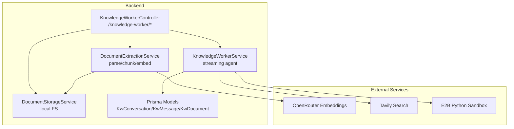
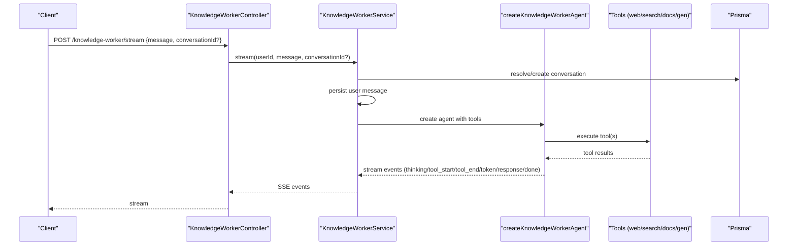
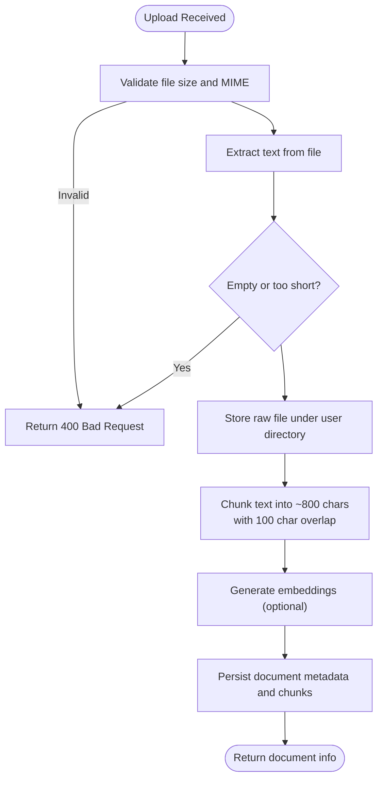
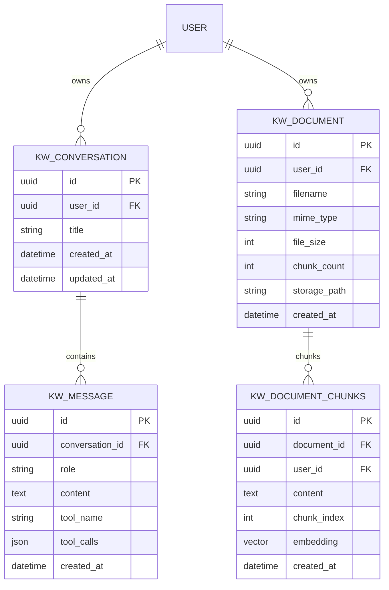
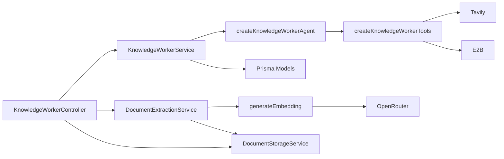

# Knowledge Worker API

<cite>
**Referenced Files in This Document**
- [knowledge-worker.controller.ts](file://backend/src/knowledge-worker/knowledge-worker.controller.ts)
- [knowledge-worker.service.ts](file://backend/src/knowledge-worker/knowledge-worker.service.ts)
- [document-extraction.service.ts](file://backend/src/knowledge-worker/services/document-extraction.service.ts)
- [document-storage.service.ts](file://backend/src/knowledge-worker/services/document-storage.service.ts)
- [kw-stream.dto.ts](file://backend/src/knowledge-worker/dto/kw-stream.dto.ts)
- [kw-agent.ts](file://backend/src/knowledge-worker/graph/kw-agent.ts)
- [kw-tools.ts](file://backend/src/knowledge-worker/graph/tools/kw-tools.ts)
- [read-document.tool.ts](file://backend/src/knowledge-worker/graph/tools/read-document.tool.ts)
- [embeddings.ts](file://backend/src/orchestration/graph/utils/embeddings.ts)
- [schema.prisma](file://backend/prisma/schema.prisma)
- [knowledge-worker.ts](file://frontend/src/api/knowledge-worker.ts)
</cite>

## Table of Contents
1. [Introduction](#introduction)
2. [Project Structure](#project-structure)
3. [Core Components](#core-components)
4. [Architecture Overview](#architecture-overview)
5. [Detailed Component Analysis](#detailed-component-analysis)
6. [Dependency Analysis](#dependency-analysis)
7. [Performance Considerations](#performance-considerations)
8. [Troubleshooting Guide](#troubleshooting-guide)
9. [Conclusion](#conclusion)
10. [Appendices](#appendices)

## Introduction
This document describes the Knowledge Worker API, designed for premium subscribers to upload and analyze documents, manage conversations, and execute research and generation tools. It covers HTTP endpoints, streaming behavior, document ingestion pipeline, vector search, and practical usage examples with curl commands.

## Project Structure
The Knowledge Worker API is implemented as a NestJS controller with dedicated services for document extraction and storage, and a streaming agent that orchestrates tools for research, analysis, and document generation.

**Diagram sources**
- [knowledge-worker.controller.ts:35-130](file://backend/src/knowledge-worker/knowledge-worker.controller.ts#L35-L130)
- [knowledge-worker.service.ts:91-345](file://backend/src/knowledge-worker/knowledge-worker.service.ts#L91-L345)
- [document-extraction.service.ts:27-240](file://backend/src/knowledge-worker/services/document-extraction.service.ts#L27-L240)
- [document-storage.service.ts:13-55](file://backend/src/knowledge-worker/services/document-storage.service.ts#L13-L55)
- [schema.prisma:717-762](file://backend/prisma/schema.prisma#L717-L762)

**Section sources**
- [knowledge-worker.controller.ts:35-130](file://backend/src/knowledge-worker/knowledge-worker.controller.ts#L35-L130)
- [knowledge-worker.service.ts:91-345](file://backend/src/knowledge-worker/knowledge-worker.service.ts#L91-L345)
- [document-extraction.service.ts:27-240](file://backend/src/knowledge-worker/services/document-extraction.service.ts#L27-L240)
- [document-storage.service.ts:13-55](file://backend/src/knowledge-worker/services/document-storage.service.ts#L13-L55)
- [schema.prisma:717-762](file://backend/prisma/schema.prisma#L717-L762)

## Core Components
- Controllers
  - KnowledgeWorkerController: exposes endpoints for conversations, document upload/list/delete, and a server-sent events streaming endpoint.
  - KnowledgeWorkerAssetsController: serves generated artifacts via signed URLs or local file streaming.
- Services
  - KnowledgeWorkerService: orchestrates streaming agent, manages conversations/messages, enforces quotas, and emits SSE events.
  - DocumentExtractionService: validates, parses, chunks, embeds, and persists documents.
  - DocumentStorageService: stores/retrieves raw files on local filesystem.
- Tools and Agent
  - createKnowledgeWorkerAgent: constructs a LangGraph agent with tools for research, document reading, and generation.
  - Tools: python_analyst, web_search/news_search/url_reader/deep_research, list_documents, read_document, generate_document.

**Section sources**
- [knowledge-worker.controller.ts:35-130](file://backend/src/knowledge-worker/knowledge-worker.controller.ts#L35-L130)
- [knowledge-worker.service.ts:91-345](file://backend/src/knowledge-worker/knowledge-worker.service.ts#L91-L345)
- [document-extraction.service.ts:27-240](file://backend/src/knowledge-worker/services/document-extraction.service.ts#L27-L240)
- [document-storage.service.ts:13-55](file://backend/src/knowledge-worker/services/document-storage.service.ts#L13-L55)
- [kw-agent.ts:16-51](file://backend/src/knowledge-worker/graph/kw-agent.ts#L16-L51)
- [kw-tools.ts:15-41](file://backend/src/knowledge-worker/graph/tools/kw-tools.ts#L15-L41)

## Architecture Overview
The Knowledge Worker API follows a streaming-first design:
- Clients connect to the SSE endpoint to receive structured events.
- The service resolves or creates a conversation, persists the user message, builds a system prompt augmented with uploaded documents, and streams tool events and tokens.
- Document ingestion uses a pipeline with MIME-aware parsing, chunking, optional embeddings, and persistence.

**Diagram sources**
- [knowledge-worker.controller.ts:63-93](file://backend/src/knowledge-worker/knowledge-worker.controller.ts#L63-L93)
- [knowledge-worker.service.ts:164-343](file://backend/src/knowledge-worker/knowledge-worker.service.ts#L164-L343)
- [kw-agent.ts:16-51](file://backend/src/knowledge-worker/graph/kw-agent.ts#L16-L51)
- [kw-tools.ts:15-41](file://backend/src/knowledge-worker/graph/tools/kw-tools.ts#L15-L41)

## Detailed Component Analysis

### Conversation Management Endpoints
- GET /knowledge-worker/conversations
  - Lists user’s conversations ordered by last update.
- GET /knowledge-worker/conversations/{id}/messages
  - Retrieves messages for a given conversation (validated by ownership).
- DELETE /knowledge-worker/conversations/{id}
  - Deletes a user-owned conversation.

Behavior:
- Conversation creation is implicit when streaming without an existing conversationId.
- Each user message is persisted; the assistant’s final response is also persisted.
- The conversation updatedAt is touched after each response to keep it at the top of the list.

**Section sources**
- [knowledge-worker.controller.ts:48-61](file://backend/src/knowledge-worker/knowledge-worker.controller.ts#L48-L61)
- [knowledge-worker.service.ts:117-155](file://backend/src/knowledge-worker/knowledge-worker.service.ts#L117-L155)
- [knowledge-worker.service.ts:164-343](file://backend/src/knowledge-worker/knowledge-worker.service.ts#L164-L343)

### Streaming Endpoint
- POST /knowledge-worker/stream
  - Requires JWT and Premium guard.
  - Enforces monthly token quota before opening the expensive pipeline.
  - Emits SSE events: conversation, thinking, tool_start, tool_end, token, token_reset, response, done.
  - On error, sends a response event with a friendly message and a done event.

Request body:
- message: string
- conversationId: optional UUID

Response:
- Server-sent events with structured data payloads.

**Section sources**
- [knowledge-worker.controller.ts:63-93](file://backend/src/knowledge-worker/knowledge-worker.controller.ts#L63-L93)
- [kw-stream.dto.ts:3-12](file://backend/src/knowledge-worker/dto/kw-stream.dto.ts#L3-L12)
- [knowledge-worker.service.ts:164-343](file://backend/src/knowledge-worker/knowledge-worker.service.ts#L164-L343)

### Document Upload and Management
- POST /knowledge-worker/documents/upload
  - Multipart upload with file field.
  - Max file size 25 MB.
  - Supported MIME types: PDF, DOCX, XLSX, XLS, CSV, TXT, MD.
  - Returns document metadata (id, filename, mimeType, fileSize, chunkCount, createdAt).

- GET /knowledge-worker/documents
  - Lists user’s documents.

- DELETE /knowledge-worker/documents/{id}
  - Removes document and associated chunks; deletes raw file from storage.

Processing pipeline:
- Validation and MIME resolution.
- Text extraction (PDF via parser, DOCX via raw text, XLSX/XLS/CSV via CSV conversion, TXT/MD as-is).
- Storage of raw file under user-scoped directory.
- Chunking into ~800-character segments with ~100-character overlap.
- Optional vector embedding generation and insertion into pgvector-enabled table.
- Persistence of document metadata and counts.

**Diagram sources**
- [document-extraction.service.ts:41-111](file://backend/src/knowledge-worker/services/document-extraction.service.ts#L41-L111)
- [document-storage.service.ts:24-35](file://backend/src/knowledge-worker/services/document-storage.service.ts#L24-L35)
- [embeddings.ts:17-82](file://backend/src/orchestration/graph/utils/embeddings.ts#L17-L82)

**Section sources**
- [knowledge-worker.controller.ts:97-123](file://backend/src/knowledge-worker/knowledge-worker.controller.ts#L97-L123)
- [document-extraction.service.ts:41-111](file://backend/src/knowledge-worker/services/document-extraction.service.ts#L41-L111)
- [document-storage.service.ts:24-35](file://backend/src/knowledge-worker/services/document-storage.service.ts#L24-L35)
- [embeddings.ts:17-82](file://backend/src/orchestration/graph/utils/embeddings.ts#L17-L82)

### Generated File Download
- GET /knowledge-worker/generated/{filename}
  - Serves generated artifacts (charts, exports) via signed URLs or local file streaming.
  - Filename must match UUID-based pattern and pass path traversal checks.
  - Supports PDF, DOCX, XLSX, PPTX, PNG, JPG/JPEG, SVG.

Security:
- No JWT required; relies on unpredictable UUID in filename.

**Section sources**
- [knowledge-worker.controller.ts:139-218](file://backend/src/knowledge-worker/knowledge-worker.controller.ts#L139-L218)

### Tool Execution and Search Integration
Available tools (selected dynamically):
- python_analyst: stateful Python sandbox for numeric analysis, plotting, and exporting files to a shared OUT_DIR. Returns markdown image links and download links for generated files.
- web_search, news_search, url_reader, deep_research: Tavily-powered web search and URL reading.
- list_documents, read_document: semantic search over user’s uploaded documents using pgvector similarity.
- generate_document: produces styled PDF/DOCX/PPTX from markdown.

Search behavior:
- read_document computes an embedding for the query and performs cosine similarity search against kw_document_chunks.
- Results include top-K passages with filenames, chunk indices, and similarity scores.

**Section sources**
- [knowledge-worker.service.ts:6-89](file://backend/src/knowledge-worker/knowledge-worker.service.ts#L6-L89)
- [kw-tools.ts:15-41](file://backend/src/knowledge-worker/graph/tools/kw-tools.ts#L15-L41)
- [read-document.tool.ts:11-87](file://backend/src/knowledge-worker/graph/tools/read-document.tool.ts#L11-L87)

### Data Models

**Diagram sources**
- [schema.prisma:717-762](file://backend/prisma/schema.prisma#L717-L762)

**Section sources**
- [schema.prisma:717-762](file://backend/prisma/schema.prisma#L717-L762)

## Dependency Analysis
- Controllers depend on services for business logic and on guards for authentication/premium gating.
- KnowledgeWorkerService composes a LangGraph agent with tools and interacts with Prisma for persistence.
- DocumentExtractionService depends on DocumentStorageService and embeddings utility.
- External dependencies: OpenRouter embeddings, Tavily search, E2B sandbox.

**Diagram sources**
- [knowledge-worker.controller.ts:35-130](file://backend/src/knowledge-worker/knowledge-worker.controller.ts#L35-L130)
- [knowledge-worker.service.ts:91-345](file://backend/src/knowledge-worker/knowledge-worker.service.ts#L91-L345)
- [kw-agent.ts:16-51](file://backend/src/knowledge-worker/graph/kw-agent.ts#L16-L51)
- [kw-tools.ts:15-41](file://backend/src/knowledge-worker/graph/tools/kw-tools.ts#L15-L41)
- [document-extraction.service.ts:27-240](file://backend/src/knowledge-worker/services/document-extraction.service.ts#L27-L240)
- [embeddings.ts:17-82](file://backend/src/orchestration/graph/utils/embeddings.ts#L17-L82)

**Section sources**
- [knowledge-worker.controller.ts:35-130](file://backend/src/knowledge-worker/knowledge-worker.controller.ts#L35-L130)
- [knowledge-worker.service.ts:91-345](file://backend/src/knowledge-worker/knowledge-worker.service.ts#L91-L345)
- [kw-agent.ts:16-51](file://backend/src/knowledge-worker/graph/kw-agent.ts#L16-L51)
- [kw-tools.ts:15-41](file://backend/src/knowledge-worker/graph/tools/kw-tools.ts#L15-L41)
- [document-extraction.service.ts:27-240](file://backend/src/knowledge-worker/services/document-extraction.service.ts#L27-L240)
- [embeddings.ts:17-82](file://backend/src/orchestration/graph/utils/embeddings.ts#L17-L82)

## Performance Considerations
- Streaming SSE reduces latency and allows incremental rendering.
- Chunk size and overlap are tuned for ~800 tokens with paragraph-first splitting and sentence fallback.
- Embedding generation is retried with exponential backoff; partial failures are handled gracefully.
- Quota enforcement prevents runaway usage; throttling limits burst requests.

[No sources needed since this section provides general guidance]

## Troubleshooting Guide
Common issues and resolutions:
- File format not supported
  - Symptom: 400 Bad Request indicating unsupported type.
  - Resolution: Use PDF, DOCX, XLSX, XLS, CSV, TXT, or MD.
- Empty or unreadable document
  - Symptom: 400 Bad Request stating the document appears empty.
  - Resolution: Verify content exists and is not password-protected or corrupted.
- File too large
  - Symptom: 400 Bad Request exceeding 25 MB limit.
  - Resolution: Split the file or compress content appropriately.
- Processing timeout or embedding failure
  - Symptom: Stream ends with an error message.
  - Resolution: Retry after rephrasing the query or reducing workload; check external service availability.
- Conversation not found
  - Symptom: 404 Not Found when accessing messages or streaming with an invalid conversationId.
  - Resolution: Omit conversationId to auto-create, or use a valid UUID owned by the user.
- Generated artifact not found
  - Symptom: 404 Not Found when downloading generated files.
  - Resolution: Ensure the filename includes a valid UUID and matches the expected extension.

**Section sources**
- [document-extraction.service.ts:43-62](file://backend/src/knowledge-worker/services/document-extraction.service.ts#L43-L62)
- [knowledge-worker.controller.ts:104-113](file://backend/src/knowledge-worker/knowledge-worker.controller.ts#L104-L113)
- [knowledge-worker.service.ts:176-178](file://backend/src/knowledge-worker/knowledge-worker.service.ts#L176-L178)
- [read-document.tool.ts:24-26](file://backend/src/knowledge-worker/graph/tools/read-document.tool.ts#L24-L26)
- [embeddings.ts:53-62](file://backend/src/orchestration/graph/utils/embeddings.ts#L53-L62)

## Conclusion
The Knowledge Worker API provides a robust, streaming-first platform for document analysis, research assistance, and content generation. Its modular design separates concerns across controllers, services, and tools, while integrating securely with external providers for embeddings, web search, and sandboxed computing.

[No sources needed since this section summarizes without analyzing specific files]

## Appendices

### API Reference

- Authentication and authorization
  - All endpoints require a valid JWT bearer token and Premium subscription tier.
  - Rate limiting applies to streaming; throttling is bypassed for document upload.

- Endpoints

  - Conversations
    - GET /knowledge-worker/conversations
      - Query parameters: None
      - Response: array of conversation objects with id, title, createdAt, updatedAt
    - GET /knowledge-worker/conversations/{id}/messages
      - Path parameters: id (UUID)
      - Response: array of message objects with role, content, toolName, toolCalls, createdAt
    - DELETE /knowledge-worker/conversations/{id}
      - Path parameters: id (UUID)
      - Response: { ok: true }

  - Streaming
    - POST /knowledge-worker/stream
      - Request body: { message: string, conversationId?: string }
      - Response: Server-sent events (conversation, thinking, tool_start, tool_end, token, token_reset, response, done)

  - Documents
    - POST /knowledge-worker/documents/upload
      - Form field: file (binary)
      - Response: { id, filename, mimeType, fileSize, chunkCount, createdAt }
    - GET /knowledge-worker/documents
      - Response: array of document objects with id, filename, mimeType, fileSize, chunkCount, createdAt
    - DELETE /knowledge-worker/documents/{id}
      - Path parameters: id (UUID)
      - Response: { ok: true }

  - Generated Artifacts
    - GET /knowledge-worker/generated/{filename}
      - Path parameters: filename (UUID-based)
      - Response: binary stream (PDF, DOCX, XLSX, PPTX, PNG, JPG, SVG)

- Practical Examples

  - Upload a document with metadata
    - curl command:
      - curl -X POST "{BASE_URL}/api/knowledge-worker/documents/upload" \
        -H "Authorization: Bearer {JWT}" \
        -F "file=@/path/to/document.pdf" \
        -v

  - Initiate AI analysis (streaming)
    - curl command:
      - curl -N -H "Authorization: Bearer {JWT}" \
        "{BASE_URL}/api/knowledge-worker/stream" \
        -H "Content-Type: application/json" \
        -d '{"message":"Summarize the key findings","conversationId":"{optional-conversation-id}"}'

  - Manage KW conversations
    - List conversations:
      - curl -H "Authorization: Bearer {JWT}" "{BASE_URL}/api/knowledge-worker/conversations"
    - Get messages:
      - curl -H "Authorization: Bearer {JWT}" "{BASE_URL}/api/knowledge-worker/conversations/{id}/messages"
    - Delete conversation:
      - curl -X DELETE -H "Authorization: Bearer {JWT}" "{BASE_URL}/api/knowledge-worker/conversations/{id}"

  - Execute research tools
    - Use the streaming endpoint to trigger read_document or web_search; the agent will emit tool_start/tool_end and token events.

  - Retrieve processed results
    - Download generated files via GET /knowledge-worker/generated/{filename} using the UUID-based filename returned by tools.

- Common Use Cases
  - Document analysis workflows
    - Upload documents, then ask the agent to analyze specific content using read_document with a focused query.
  - Research assistance
    - Ask current events or comparative questions; the agent uses web_search or deep_research as appropriate.
  - Content summarization
    - Request summaries or briefs; the agent can draft content and use generate_document for styled outputs.
  - Error scenarios
    - File format limitations: ensure supported MIME types.
    - Processing timeouts: retry with clearer queries or smaller files.

**Section sources**
- [knowledge-worker.controller.ts:48-130](file://backend/src/knowledge-worker/knowledge-worker.controller.ts#L48-L130)
- [knowledge-worker.service.ts:164-343](file://backend/src/knowledge-worker/knowledge-worker.service.ts#L164-L343)
- [document-extraction.service.ts:41-111](file://backend/src/knowledge-worker/services/document-extraction.service.ts#L41-L111)
- [read-document.tool.ts:11-87](file://backend/src/knowledge-worker/graph/tools/read-document.tool.ts#L11-L87)
- [knowledge-worker.ts:41-131](file://frontend/src/api/knowledge-worker.ts#L41-L131)