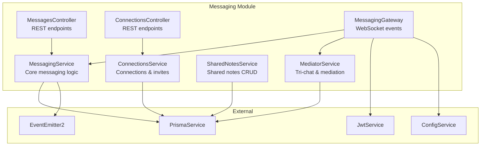
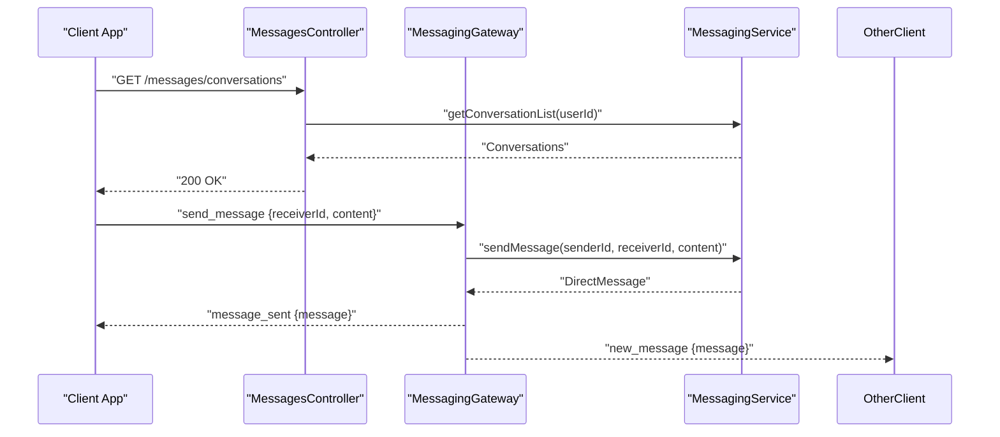
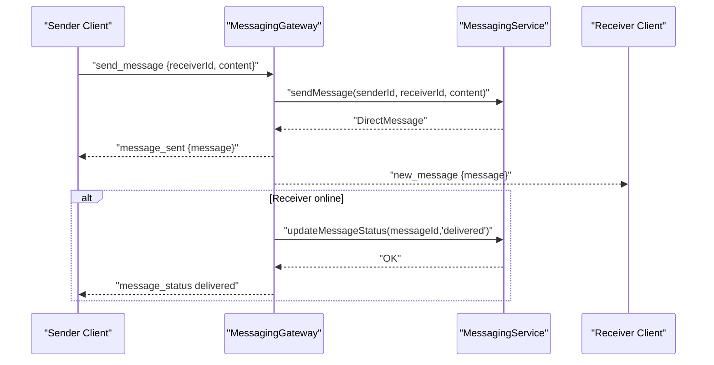
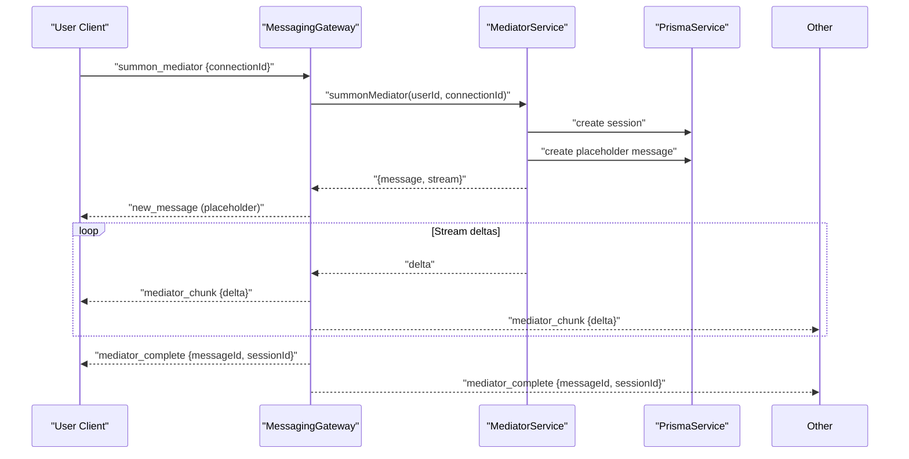
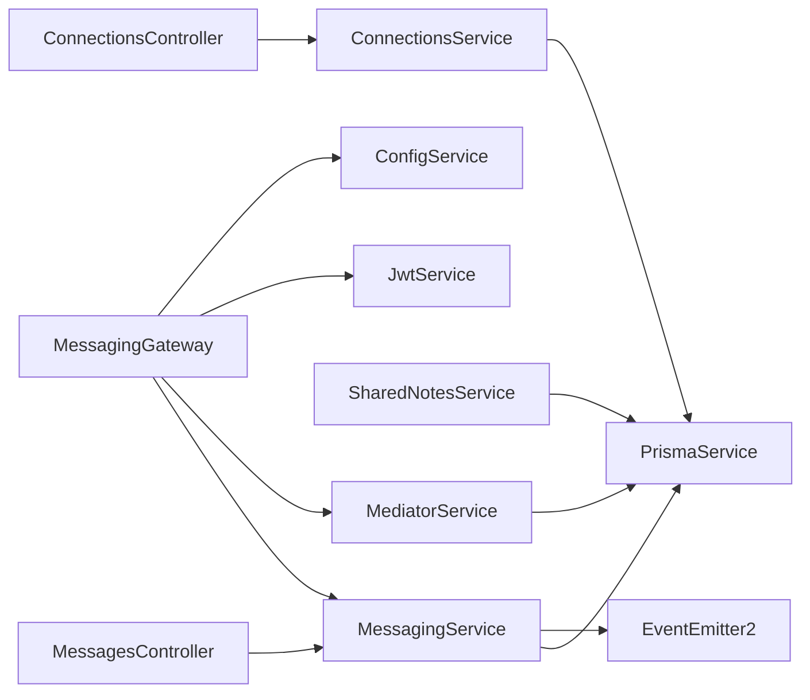

# Messaging API

<cite>
**Referenced Files in This Document**
- [messaging.module.ts](file://backend/src/messaging/messaging.module.ts)
- [messages.controller.ts](file://backend/src/messaging/messages.controller.ts)
- [connections.controller.ts](file://backend/src/messaging/connections.controller.ts)
- [messaging.gateway.ts](file://backend/src/messaging/messaging.gateway.ts)
- [messaging.service.ts](file://backend/src/messaging/messaging.service.ts)
- [connections.service.ts](file://backend/src/messaging/connections.service.ts)
- [shared-notes.service.ts](file://backend/src/messaging/shared-notes.service.ts)
- [mediator.service.ts](file://backend/src/messaging/mediator.service.ts)
- [edit-message.dto.ts](file://backend/src/messaging/dto/edit-message.dto.ts)
- [add-reaction.dto.ts](file://backend/src/messaging/dto/add-reaction.dto.ts)
- [conversation-settings.dto.ts](file://backend/src/messaging/dto/conversation-settings.dto.ts)
- [send-request.dto.ts](file://backend/src/messaging/dto/send-request.dto.ts)
- [send-invite.dto.ts](file://backend/src/messaging/dto/send-invite.dto.ts)
- [add-shared-note.dto.ts](file://backend/src/messaging/dto/add-shared-note.dto.ts)
</cite>

## Table of Contents
1. [Introduction](#introduction)
2. [Project Structure](#project-structure)
3. [Core Components](#core-components)
4. [Architecture Overview](#architecture-overview)
5. [Detailed Component Analysis](#detailed-component-analysis)
6. [Dependency Analysis](#dependency-analysis)
7. [Performance Considerations](#performance-considerations)
8. [Troubleshooting Guide](#troubleshooting-guide)
9. [Conclusion](#conclusion)
10. [Appendices](#appendices)

## Introduction
This document describes the Messaging API, covering endpoints for sending and managing messages, connection lifecycle, conversation settings, reactions, and shared notes. It also documents the real-time messaging architecture using WebSockets, message threading, presence tracking, and tri-chat mediation features. Practical curl examples are included for common workflows such as sending messages, accepting connection requests, and moderating conversations.

## Project Structure
The messaging domain is organized under a dedicated NestJS module with controllers, services, DTOs, and a WebSocket gateway. Controllers expose REST endpoints; the gateway handles real-time events; services encapsulate business logic and database interactions.



**Diagram sources**
- [messaging.module.ts:14-36](file://backend/src/messaging/messaging.module.ts#L14-L36)
- [messages.controller.ts:21-27](file://backend/src/messaging/messages.controller.ts#L21-L27)
- [connections.controller.ts:19-25](file://backend/src/messaging/connections.controller.ts#L19-L25)
- [messaging.gateway.ts:62-87](file://backend/src/messaging/messaging.gateway.ts#L62-L87)
- [messaging.service.ts:21-26](file://backend/src/messaging/messaging.service.ts#L21-L26)
- [connections.service.ts:6-8](file://backend/src/messaging/connections.service.ts#L6-L8)
- [shared-notes.service.ts:4-6](file://backend/src/messaging/shared-notes.service.ts#L4-L6)
- [mediator.service.ts:7-11](file://backend/src/messaging/mediator.service.ts#L7-L11)

**Section sources**
- [messaging.module.ts:14-36](file://backend/src/messaging/messaging.module.ts#L14-L36)

## Core Components
- MessagesController: REST endpoints for conversations, unread counts, message actions (edit/delete), reactions, conversation settings, last seen, tri-chat toggles, and mediator controls.
- ConnectionsController: REST endpoints for user search, connection management (send/accept/reject/remove), phone discovery, and shared notes.
- MessagingGateway: Real-time WebSocket events for sending, editing, deleting, reactions, read receipts, typing indicators, online status, tri-chat, mediator streaming, and session controls.
- MessagingService: Validates connections, persists messages, manages reactions, delivery/read status, conversation lists, and tri-chat clear-history continuity.
- ConnectionsService: Manages connection requests, invites, phone resolution, and mirror-circle creation.
- SharedNotesService: Adds, retrieves, deletes shared notes, and builds shared relationship summaries.
- MediatorService: Implements tri-chat mediation, session management, quota enforcement, and context building.

**Section sources**
- [messages.controller.ts:21-227](file://backend/src/messaging/messages.controller.ts#L21-L227)
- [connections.controller.ts:19-114](file://backend/src/messaging/connections.controller.ts#L19-L114)
- [messaging.gateway.ts:62-762](file://backend/src/messaging/messaging.gateway.ts#L62-L762)
- [messaging.service.ts:21-647](file://backend/src/messaging/messaging.service.ts#L21-L647)
- [connections.service.ts:6-385](file://backend/src/messaging/connections.service.ts#L6-L385)
- [shared-notes.service.ts:4-119](file://backend/src/messaging/shared-notes.service.ts#L4-L119)
- [mediator.service.ts:132-800](file://backend/src/messaging/mediator.service.ts#L132-L800)

## Architecture Overview
The system combines REST and WebSocket transports:
- REST: Authentication via JWT guard, controller-layer endpoints for CRUD-like operations.
- WebSocket (/ws): Event-driven real-time updates with rate limiting, input validation, and presence notifications.



**Diagram sources**
- [messages.controller.ts:29-38](file://backend/src/messaging/messages.controller.ts#L29-L38)
- [messaging.gateway.ts:191-247](file://backend/src/messaging/messaging.gateway.ts#L191-L247)
- [messaging.service.ts:53-96](file://backend/src/messaging/messaging.service.ts#L53-L96)

## Detailed Component Analysis

### REST Endpoints

#### Messages
- GET /messages/conversations
  - Description: Retrieve conversation list with last message preview and unread counts.
  - Auth: JWT required.
  - Response: Array of conversations with connectionId, user, lastMessage, unreadCount, and settings.
  - Example curl:
    ```bash
    curl -H "Authorization: Bearer $TOKEN" https://api.example.com/messages/conversations
    ```

- GET /messages/unread
  - Description: Total unread message count for the authenticated user.
  - Auth: JWT required.
  - Response: { unread: number }.
  - Example curl:
    ```bash
    curl -H "Authorization: Bearer $TOKEN" https://api.example.com/messages/unread
    ```

- GET /messages/:userId
  - Description: Paginate conversation history with optional cursor.
  - Auth: JWT required.
  - Query: cursor (string).
  - Response: { messages[], hasMore, nextCursor }.
  - Example curl:
    ```bash
    curl -H "Authorization: Bearer $TOKEN" "https://api.example.com/messages/:userId?cursor=abc123"
    ```

- GET /messages/:userId/search?q=term
  - Description: Search messages in a conversation.
  - Auth: JWT required.
  - Query: q (string).
  - Response: Array of messages.
  - Example curl:
    ```bash
    curl -H "Authorization: Bearer $TOKEN" "https://api.example.com/messages/:userId/search?q=hello"
    ```

- POST /messages/:userId/read
  - Description: Mark messages from other user as read.
  - Auth: JWT required.
  - Response: { marked: number }.
  - Example curl:
    ```bash
    curl -X POST -H "Authorization: Bearer $TOKEN" https://api.example.com/messages/:userId/read
    ```

- PUT /messages/:messageId/edit
  - Description: Edit a message (sender only).
  - Auth: JWT required.
  - Body: { content: string } (validated by EditMessageDto).
  - Response: Updated message.
  - Example curl:
    ```bash
    curl -X PUT -H "Authorization: Bearer $TOKEN" -H "Content-Type: application/json" \
      -d '{"content":"updated"}' \
      https://api.example.com/messages/:messageId/edit
    ```

- DELETE /messages/:messageId
  - Description: Delete a message (soft-delete).
  - Auth: JWT required.
  - Response: Deleted message with deletion timestamp.
  - Example curl:
    ```bash
    curl -X DELETE -H "Authorization: Bearer $TOKEN" https://api.example.com/messages/:messageId
    ```

- POST /messages/:messageId/reactions
  - Description: Add or remove a reaction (emoji).
  - Auth: JWT required.
  - Body: { emoji: string } (validated by AddReactionDto).
  - Response: { action: "added|removed", messageId, emoji, userId }.
  - Example curl:
    ```bash
    curl -X POST -H "Authorization: Bearer $TOKEN" -H "Content-Type: application/json" \
      -d '{"emoji":"👍"}' \
      https://api.example.com/messages/:messageId/reactions
    ```

- GET /messages/:messageId/reactions
  - Description: List reactions for a message.
  - Auth: JWT required.
  - Response: Array of reactions with user info.
  - Example curl:
    ```bash
    curl -H "Authorization: Bearer $TOKEN" https://api.example.com/messages/:messageId/reactions
    ```

- PUT /messages/conversation/:connectionId/settings
  - Description: Update conversation settings (pin/mute/archive).
  - Auth: JWT required.
  - Body: { pinned?, mutedUntil?, archived? } (validated by ConversationSettingsDto).
  - Response: Updated connection settings.
  - Example curl:
    ```bash
    curl -X PUT -H "Authorization: Bearer $TOKEN" -H "Content-Type: application/json" \
      -d '{"pinned":true,"mutedUntil":"2026-06-01T12:00:00Z","archived":false}' \
      https://api.example.com/messages/conversation/:connectionId/settings
    ```

- GET /messages/user/:userId/last-seen
  - Description: Get last seen timestamp for a user.
  - Auth: JWT required.
  - Response: { lastSeenAt: string|null }.
  - Example curl:
    ```bash
    curl -H "Authorization: Bearer $TOKEN" https://api.example.com/messages/user/:userId/last-seen
    ```

- POST /messages/conversation/:connectionId/tri-chat/toggle
  - Description: Toggle tri-chat for a connection.
  - Auth: JWT required.
  - Body: { enabled: boolean }.
  - Response: { connectionId, byUserId, enabled, bothEnabled, otherUserId }.
  - Example curl:
    ```bash
    curl -X POST -H "Authorization: Bearer $TOKEN" -H "Content-Type: application/json" \
      -d '{"enabled":true}' \
      https://api.example.com/messages/conversation/:connectionId/tri-chat/toggle
    ```

- GET /messages/conversation/:connectionId/tri-chat/status
  - Description: Get tri-chat status and quota.
  - Auth: JWT required.
  - Response: TriChatStatus object.
  - Example curl:
    ```bash
    curl -H "Authorization: Bearer $TOKEN" https://api.example.com/messages/conversation/:connectionId/tri-chat/status
    ```

- POST /messages/conversation/:connectionId/summon-mediator
  - Description: Summons the mediator (REST fallback). Prefer WebSocket for streaming.
  - Auth: JWT required.
  - Body: { sessionId?, replyText? }.
  - Response: Final mediator message.
  - Example curl:
    ```bash
    curl -X POST -H "Authorization: Bearer $TOKEN" -H "Content-Type: application/json" \
      -d '{}' \
      https://api.example.com/messages/conversation/:connectionId/summon-mediator
    ```

- POST /messages/conversation/:connectionId/mediator-session/:sessionId/reply
  - Description: Reply within an active mediator session.
  - Auth: JWT required.
  - Body: { text: string }.
  - Response: Updated mediator message.
  - Example curl:
    ```bash
    curl -X POST -H "Authorization: Bearer $TOKEN" -H "Content-Type: application/json" \
      -d '{"text":"Thanks!"}' \
      https://api.example.com/messages/conversation/:connectionId/mediator-session/:sessionId/reply
    ```

- POST /messages/conversation/:connectionId/mediator-session/:sessionId/end
  - Description: End a mediator session.
  - Auth: JWT required.
  - Response: Session summary.
  - Example curl:
    ```bash
    curl -X POST -H "Authorization: Bearer $TOKEN" \
      https://api.example.com/messages/conversation/:connectionId/mediator-session/:sessionId/end
    ```

- POST /messages/conversation/:connectionId/clear-history
  - Description: One-sided chat history clear with continuity summary.
  - Auth: JWT required.
  - Response: { connectionId, clearedAt, summarized, otherUserId }.
  - Example curl:
    ```bash
    curl -X POST -H "Authorization: Bearer $TOKEN" \
      https://api.example.com/messages/conversation/:connectionId/clear-history
    ```

- PUT /messages/conversation/:connectionId/mediator-name
  - Description: Rename mediator (shared).
  - Auth: JWT required.
  - Body: { name: string }.
  - Response: { connectionId, mediatorName, otherUserId }.
  - Example curl:
    ```bash
    curl -X PUT -H "Authorization: Bearer $TOKEN" -H "Content-Type: application/json" \
      -d '{"name":"Guide"}' \
      https://api.example.com/messages/conversation/:connectionId/mediator-name
    ```

- POST /messages/:messageId/mediator-action/:actionIndex/accept
  - Description: Accept a mediator action card.
  - Auth: JWT required.
  - Response: Action acceptance result.
  - Example curl:
    ```bash
    curl -X POST -H "Authorization: Bearer $TOKEN" \
      https://api.example.com/messages/:messageId/mediator-action/:actionIndex/accept
    ```

#### Connections
- GET /connections/search?q=query
  - Description: Search users by phone or name (excluding self).
  - Auth: JWT required.
  - Response: Array of users with connection status.
  - Example curl:
    ```bash
    curl -H "Authorization: Bearer $TOKEN" "https://api.example.com/connections/search?q=alex"
    ```

- GET /connections
  - Description: List accepted connections.
  - Auth: JWT required.
  - Response: Array of connections with user and connectedAt.
  - Example curl:
    ```bash
    curl -H "Authorization: Bearer $TOKEN" https://api.example.com/connections
    ```

- GET /connections/pending
  - Description: List incoming pending requests.
  - Auth: JWT required.
  - Response: Array of requests with requester info.
  - Example curl:
    ```bash
    curl -H "Authorization: Bearer $TOKEN" https://api.example.com/connections/pending
    ```

- POST /connections/discover
  - Description: Discover which phone contacts are on the platform.
  - Auth: JWT required.
  - Body: { phoneNumbers: string[] }.
  - Response: Array of discovered users with connection status.
  - Example curl:
    ```bash
    curl -X POST -H "Authorization: Bearer $TOKEN" -H "Content-Type: application/json" \
      -d '{"phoneNumbers":["+15551234567"]}' \
      https://api.example.com/connections/discover
    ```

- POST /connections/resolve-phone
  - Description: Resolve a single phone number to a user and connection status.
  - Auth: JWT required.
  - Body: { phoneNumber: string } (validated by SendInviteDto).
  - Response: { user, connectionStatus, connectionId, iAmRequester? }.
  - Example curl:
    ```bash
    curl -X POST -H "Authorization: Bearer $TOKEN" -H "Content-Type: application/json" \
      -d '{"phoneNumber":"+15551234567"}' \
      https://api.example.com/connections/resolve-phone
    ```

- POST /connections/request
  - Description: Send a connection request.
  - Auth: JWT required.
  - Body: { receiverId: string } (validated by SendRequestDto).
  - Response: Created connection with receiver info.
  - Example curl:
    ```bash
    curl -X POST -H "Authorization: Bearer $TOKEN" -H "Content-Type: application/json" \
      -d '{"receiverId":"uuid"}' \
      https://api.example.com/connections/request
    ```

- POST /connections/invite
  - Description: Invite by phone number.
  - Auth: JWT required.
  - Body: { phoneNumber: string } (validated by SendInviteDto).
  - Response: Created connection with receiver info.
  - Example curl:
    ```bash
    curl -X POST -H "Authorization: Bearer $TOKEN" -H "Content-Type: application/json" \
      -d '{"phoneNumber":"+15551234567"}' \
      https://api.example.com/connections/invite
    ```

- POST /connections/:id/accept
  - Description: Accept a pending request.
  - Auth: JWT required.
  - Response: Updated connection with mirrored circle entries.
  - Example curl:
    ```bash
    curl -X POST -H "Authorization: Bearer $TOKEN" https://api.example.com/connections/:id/accept
    ```

- POST /connections/:id/reject
  - Description: Reject a pending request.
  - Auth: JWT required.
  - Response: Updated connection with status rejected.
  - Example curl:
    ```bash
    curl -X POST -H "Authorization: Bearer $TOKEN" https://api.example.com/connections/:id/reject
    ```

- DELETE /connections/:id
  - Description: Remove a connection.
  - Auth: JWT required.
  - Response: { deleted: true }.
  - Example curl:
    ```bash
    curl -X DELETE -H "Authorization: Bearer $TOKEN" https://api.example.com/connections/:id
    ```

- GET /connections/:id/notes?type=general
  - Description: Get shared notes for a connection.
  - Auth: JWT required.
  - Response: Array of notes with author info.
  - Example curl:
    ```bash
    curl -H "Authorization: Bearer $TOKEN" "https://api.example.com/connections/:id/notes?type=general"
    ```

- POST /connections/:id/notes
  - Description: Add a shared note.
  - Auth: JWT required.
  - Body: { content: string, noteType?: string } (validated by AddSharedNoteDto).
  - Response: Created note with author info.
  - Example curl:
    ```bash
    curl -X POST -H "Authorization: Bearer $TOKEN" -H "Content-Type: application/json" \
      -d '{"content":"Meeting notes","noteType":"general"}' \
      https://api.example.com/connections/:id/notes
    ```

- DELETE /connections/notes/:noteId
  - Description: Delete a shared note (author only).
  - Auth: JWT required.
  - Response: { deleted: true }.
  - Example curl:
    ```bash
    curl -X DELETE -H "Authorization: Bearer $TOKEN" https://api.example.com/connections/notes/:noteId
    ```

- GET /connections/:id/shared
  - Description: Get shared relationship summary.
  - Auth: JWT required.
  - Response: { connectionId, connectedSince, partner, sharedNotes, totalNotes, totalMessages, notesByType }.
  - Example curl:
    ```bash
    curl -H "Authorization: Bearer $TOKEN" https://api.example.com/connections/:id/shared
    ```

**Section sources**
- [messages.controller.ts:29-227](file://backend/src/messaging/messages.controller.ts#L29-L227)
- [connections.controller.ts:27-114](file://backend/src/messaging/connections.controller.ts#L27-L114)
- [edit-message.dto.ts:3-7](file://backend/src/messaging/dto/edit-message.dto.ts#L3-L7)
- [add-reaction.dto.ts:3-8](file://backend/src/messaging/dto/add-reaction.dto.ts#L3-L8)
- [conversation-settings.dto.ts:3-15](file://backend/src/messaging/dto/conversation-settings.dto.ts#L3-L15)
- [send-request.dto.ts:3-7](file://backend/src/messaging/dto/send-request.dto.ts#L3-L7)
- [send-invite.dto.ts:3-9](file://backend/src/messaging/dto/send-invite.dto.ts#L3-L9)
- [add-shared-note.dto.ts:3-11](file://backend/src/messaging/dto/add-shared-note.dto.ts#L3-L11)

### WebSocket Events

#### Connection Lifecycle
- On connect: Authenticate via JWT, join user-specific room, broadcast online status, mark pending messages as delivered.
- On disconnect: Update last seen, broadcast offline with lastSeenAt.

```mermaid
sequenceDiagram
participant Client as "Client"
participant GW as "MessagingGateway"
participant SVC as "MessagingService"
Client->>GW : "Connect with Bearer token"
GW->>GW : "Verify JWT"
GW->>GW : "Join user room"
GW->>SVC : "markAsDelivered(userId)"
SVC-->>GW : "Count"
GW-->>Client : "Connected"
GW-->>Others : "user_online {userId}"
Client--/x GW : "Disconnect"
GW->>SVC : "updateLastSeen(userId)"
SVC-->>GW : "OK"
GW-->>Others : "user_offline {userId, lastSeenAt}"
```

**Diagram sources**
- [messaging.gateway.ts:127-180](file://backend/src/messaging/messaging.gateway.ts#L127-L180)
- [messaging.service.ts:231-251](file://backend/src/messaging/messaging.service.ts#L231-L251)

#### Real-Time Messaging
- send_message: Validate payload, enforce rate limits, persist message, notify receiver, optionally auto-mark delivered if online.
- edit_message: Sender-only edit with validation and broadcast to both parties.
- delete_message: Sender-only soft-delete with deletion event broadcast.
- toggle_reaction: Toggle reaction with privacy-scoped broadcast to participants.
- mark_read: Mark messages as read and notify the other party.
- typing: Broadcast typing indicators scoped to receiver.
- get_online_status: Batch online status query with rate limit.
- get_last_seen: Fetch last seen and online status.



**Diagram sources**
- [messaging.gateway.ts:191-247](file://backend/src/messaging/messaging.gateway.ts#L191-L247)
- [messaging.service.ts:53-96](file://backend/src/messaging/messaging.service.ts#L53-L96)

#### Presence Tracking
- Online map tracks socketIds per userId.
- Broadcasts user_online and user_offline with lastSeenAt.
- get_online_status batches up to 500 user IDs per request.

**Section sources**
- [messaging.gateway.ts:68-424](file://backend/src/messaging/messaging.gateway.ts#L68-L424)
- [messaging.service.ts:246-262](file://backend/src/messaging/messaging.service.ts#L246-L262)

### Tri-Chat and Mediation
- toggle_tri_chat: Enable/disable tri-chat per user; broadcast to both parties.
- get_tri_chat_status: Returns selfEnabled, otherEnabled, bothEnabled, premium, turnsLeft, activeSessionId, hasClearedHistory, mediatorName.
- summon_mediator: Creates/continues session, persists placeholder, streams deltas to both parties, emits mediator_complete or mediator_error.
- reply_to_mediator: Sends user reply into an active session and resumes streaming.
- end_mediator_session: Ends session and broadcasts summary.
- clear_my_history: One-sided clear with continuity summary generation.
- rename_mediator: Renames mediator (shared).
- accept_mediator_action: Accepts action cards proposed by the mediator.



**Diagram sources**
- [messaging.gateway.ts:484-544](file://backend/src/messaging/messaging.gateway.ts#L484-L544)
- [mediator.service.ts:661-800](file://backend/src/messaging/mediator.service.ts#L661-L800)

**Section sources**
- [messaging.gateway.ts:447-760](file://backend/src/messaging/messaging.gateway.ts#L447-L760)
- [mediator.service.ts:203-444](file://backend/src/messaging/mediator.service.ts#L203-L444)

### Message Threading and Moderation
- Message threading: Each message links to a replyToId for nested threads; reactions are scoped to the message.
- Conversation settings: pin/mute/archive per user via updateConversationSettings.
- Moderation: Soft-delete for message removal; reactions can be toggled; clear-my-history provides one-sided moderation continuity.

**Section sources**
- [messaging.service.ts:49-96](file://backend/src/messaging/messaging.service.ts#L49-L96)
- [messaging.service.ts:267-291](file://backend/src/messaging/messaging.service.ts#L267-L291)
- [messaging.service.ts:148-174](file://backend/src/messaging/messaging.service.ts#L148-L174)
- [messaging.service.ts:179-202](file://backend/src/messaging/messaging.service.ts#L179-L202)
- [mediator.service.ts:346-444](file://backend/src/messaging/mediator.service.ts#L346-L444)

### Shared Notes Collaboration
- Add note: Requires membership in the connection; author-only deletion.
- Shared relationship view: Aggregates notes, message counts, and note-type breakdowns.

**Section sources**
- [shared-notes.service.ts:26-67](file://backend/src/messaging/shared-notes.service.ts#L26-L67)
- [shared-notes.service.ts:73-117](file://backend/src/messaging/shared-notes.service.ts#L73-L117)

## Dependency Analysis
- Controllers depend on Services for business logic.
- Gateway depends on MessagingService and MediatorService for real-time operations.
- Services depend on PrismaService for persistence and EventEmitter2 for relational ontology emissions.
- DTOs validate request bodies for REST endpoints.



**Diagram sources**
- [messages.controller.ts:24-27](file://backend/src/messaging/messages.controller.ts#L24-L27)
- [connections.controller.ts:22-25](file://backend/src/messaging/connections.controller.ts#L22-L25)
- [messaging.gateway.ts:74-79](file://backend/src/messaging/messaging.gateway.ts#L74-L79)
- [messaging.service.ts:23-26](file://backend/src/messaging/messaging.service.ts#L23-L26)
- [connections.service.ts:8](file://backend/src/messaging/connections.service.ts#L8)
- [shared-notes.service.ts:6](file://backend/src/messaging/shared-notes.service.ts#L6)
- [mediator.service.ts:139-142](file://backend/src/messaging/mediator.service.ts#L139-L142)

**Section sources**
- [messaging.module.ts:14-36](file://backend/src/messaging/messaging.module.ts#L14-L36)

## Performance Considerations
- REST endpoints use pagination and cursor-based retrieval to avoid heavy scans.
- Conversation list uses a single query with DISTINCT ON and grouped unread counts for O(1) scaling.
- WebSocket rate limits prevent abuse; sliding windows reset periodically.
- Mediator context is truncated to a soft cap to maintain responsiveness.

[No sources needed since this section provides general guidance]

## Troubleshooting Guide
Common error scenarios and handling:
- Network connectivity issues: WebSocket disconnects gracefully; clients should reconnect and rely on REST endpoints for state reconciliation.
- Message delivery failures: The gateway emits message_error with details; clients can retry with exponential backoff.
- Rate limit exceeded: Clients receive RATE_LIMIT errors; throttle requests according to event-specific limits.
- Unauthorized or forbidden: JWT guard rejects invalid tokens; permission checks prevent editing/deleting others’ messages or toggling reactions outside conversations.
- Not found: Attempts to operate on non-existent messages, notes, or connections return appropriate errors.

**Section sources**
- [messaging.gateway.ts:111-125](file://backend/src/messaging/messaging.gateway.ts#L111-L125)
- [messaging.gateway.ts:241-246](file://backend/src/messaging/messaging.gateway.ts#L241-L246)
- [messaging.service.ts:148-174](file://backend/src/messaging/messaging.service.ts#L148-L174)
- [shared-notes.service.ts:60-67](file://backend/src/messaging/shared-notes.service.ts#L60-L67)
- [connections.service.ts:122-145](file://backend/src/messaging/connections.service.ts#L122-L145)

## Conclusion
The Messaging API provides a robust foundation for real-time communication with REST endpoints for administrative tasks and WebSocket events for live interactions. It supports connection management, conversation moderation, reactions, shared notes, and advanced tri-chat mediation with streaming capabilities. Clients should leverage both REST and WebSocket transports for optimal user experience and resilience.

[No sources needed since this section summarizes without analyzing specific files]

## Appendices

### Practical Examples

- Send a message via WebSocket:
  ```bash
  # Connect to /ws with Bearer token
  # Emit "send_message" with {receiverId, content, replyToId?, messageType?, metadata?, clientTempId?}
  ```

- Accept a connection request:
  ```bash
  curl -X POST -H "Authorization: Bearer $TOKEN" \
    https://api.example.com/connections/:id/accept
  ```

- Update conversation settings:
  ```bash
  curl -X PUT -H "Authorization: Bearer $TOKEN" -H "Content-Type: application/json" \
    -d '{"pinned":true,"mutedUntil":"2026-06-01T12:00:00Z","archived":false}' \
    https://api.example.com/messages/conversation/:connectionId/settings
  ```

- Add a reaction:
  ```bash
  curl -X POST -H "Authorization: Bearer $TOKEN" -H "Content-Type: application/json" \
    -d '{"emoji":"❤️"}' \
    https://api.example.com/messages/:messageId/reactions
  ```

- Share a note:
  ```bash
  curl -X POST -H "Authorization: Bearer $TOKEN" -H "Content-Type: application/json" \
    -d '{"content":"Important note","noteType":"general"}' \
    https://api.example.com/connections/:id/notes
  ```

- Toggle tri-chat:
  ```bash
  curl -X POST -H "Authorization: Bearer $TOKEN" -H "Content-Type: application/json" \
    -d '{"enabled":true}' \
    https://api.example.com/messages/conversation/:connectionId/tri-chat/toggle
  ```

- Summon mediator (streaming):
  ```bash
  # Via WebSocket "summon_mediator" event
  # Client receives new_message (placeholder), mediator_chunk, mediator_complete
  ```

[No sources needed since this section provides general guidance]