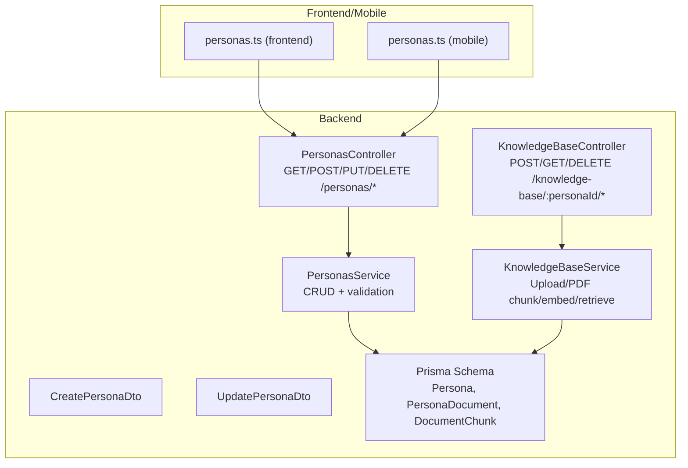
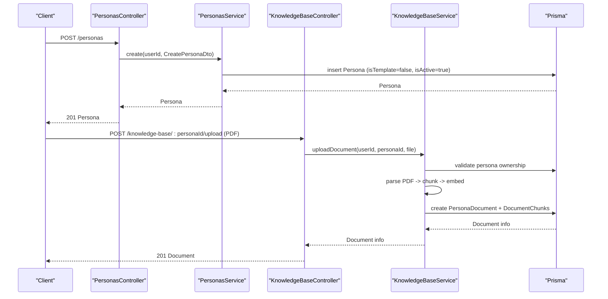
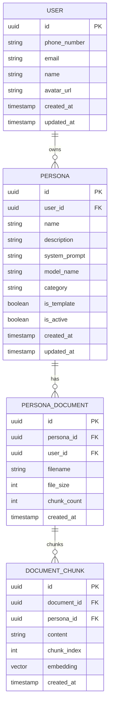
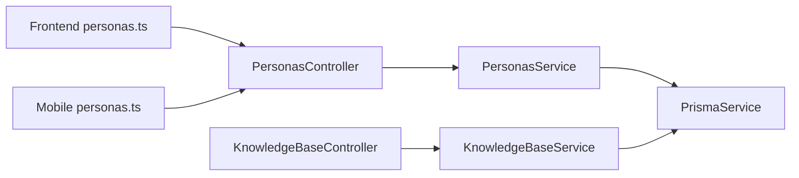

# Personas API

<cite>
**Referenced Files in This Document**
- [personas.controller.ts](file://backend/src/personas/personas.controller.ts)
- [personas.service.ts](file://backend/src/personas/personas.service.ts)
- [create-persona.dto.ts](file://backend/src/personas/dto/create-persona.dto.ts)
- [update-persona.dto.ts](file://backend/src/personas/dto/update-persona.dto.ts)
- [personas.module.ts](file://backend/src/personas/personas.module.ts)
- [schema.prisma](file://backend/prisma/schema.prisma)
- [seed-persona-templates.ts](file://backend/scripts/seed-persona-templates.ts)
- [knowledge-base.controller.ts](file://backend/src/knowledge-base/knowledge-base.controller.ts)
- [knowledge-base.service.ts](file://backend/src/knowledge-base/knowledge-base.service.ts)
- [personas.ts (frontend API)](file://frontend/src/api/personas.ts)
- [personas.ts (mobile API)](file://mobile/src/api/personas.ts)
- [Personas.tsx (frontend UI)](file://frontend/src/pages/Personas.tsx)
- [PersonasScreen.tsx (mobile UI)](file://mobile/src/screens/PersonasScreen.tsx)
- [core-chat-tools.ts](file://backend/src/orchestration/graph/tools/core-chat-tools.ts)
</cite>

## Table of Contents
1. [Introduction](#introduction)
2. [Project Structure](#project-structure)
3. [Core Components](#core-components)
4. [Architecture Overview](#architecture-overview)
5. [Detailed Component Analysis](#detailed-component-analysis)
6. [Dependency Analysis](#dependency-analysis)
7. [Performance Considerations](#performance-considerations)
8. [Troubleshooting Guide](#troubleshooting-guide)
9. [Conclusion](#conclusion)
10. [Appendices](#appendices)

## Introduction
This document describes the Personas API for persona management, covering CRUD operations, authentication, request/response schemas using DTO patterns, and knowledge base integration. It explains persona lifecycle management, template-based persona creation, and persona selection for thought analysis. Practical curl examples demonstrate creating custom personas with personality traits, assigning knowledge base documents, and configuring personas. Common use cases include persona customization, template inheritance, persona switching during conversations, and error handling for invalid references and permissions.

## Project Structure
The persona feature spans NestJS controllers/services, DTOs, Prisma models, and frontend/mobile clients. Knowledge base endpoints integrate with persona documents and semantic retrieval.



**Diagram sources**
- [personas.controller.ts:17-55](file://backend/src/personas/personas.controller.ts#L17-L55)
- [personas.service.ts:10-103](file://backend/src/personas/personas.service.ts#L10-L103)
- [create-persona.dto.ts:3-21](file://backend/src/personas/dto/create-persona.dto.ts#L3-L21)
- [update-persona.dto.ts:3-27](file://backend/src/personas/dto/update-persona.dto.ts#L3-L27)
- [knowledge-base.controller.ts:17-59](file://backend/src/knowledge-base/knowledge-base.controller.ts#L17-L59)
- [knowledge-base.service.ts:27-123](file://backend/src/knowledge-base/knowledge-base.service.ts#L27-L123)
- [schema.prisma:108-128](file://backend/prisma/schema.prisma#L108-L128)

**Section sources**
- [personas.controller.ts:17-55](file://backend/src/personas/personas.controller.ts#L17-L55)
- [personas.service.ts:10-103](file://backend/src/personas/personas.service.ts#L10-L103)
- [knowledge-base.controller.ts:17-59](file://backend/src/knowledge-base/knowledge-base.controller.ts#L17-L59)
- [knowledge-base.service.ts:27-123](file://backend/src/knowledge-base/knowledge-base.service.ts#L27-L123)
- [schema.prisma:108-128](file://backend/prisma/schema.prisma#L108-L128)

## Core Components
- PersonasController: Exposes HTTP endpoints under /personas with JWT authentication guard.
- PersonasService: Implements CRUD, visibility rules (user-owned vs templates), and soft deletion.
- DTOs: Strongly typed request/response shapes for create and update operations.
- KnowledgeBaseController/Service: Uploads PDFs, chunks text, stores embeddings, and retrieves relevant chunks for a persona.
- Frontend/Mobile APIs: Typed wrappers around the backend endpoints.

**Section sources**
- [personas.controller.ts:17-55](file://backend/src/personas/personas.controller.ts#L17-L55)
- [personas.service.ts:10-103](file://backend/src/personas/personas.service.ts#L10-L103)
- [create-persona.dto.ts:3-21](file://backend/src/personas/dto/create-persona.dto.ts#L3-L21)
- [update-persona.dto.ts:3-27](file://backend/src/personas/dto/update-persona.dto.ts#L3-L27)
- [knowledge-base.controller.ts:17-59](file://backend/src/knowledge-base/knowledge-base.controller.ts#L17-L59)
- [knowledge-base.service.ts:27-123](file://backend/src/knowledge-base/knowledge-base.service.ts#L27-L123)
- [personas.ts (frontend API):4-48](file://frontend/src/api/personas.ts#L4-L48)
- [personas.ts (mobile API):16-62](file://mobile/src/api/personas.ts#L16-L62)

## Architecture Overview
The persona lifecycle integrates with the knowledge base for contextual retrieval. Templates are curated and globally visible, while user-created personas are owned and editable by their creators.



**Diagram sources**
- [personas.controller.ts:22-25](file://backend/src/personas/personas.controller.ts#L22-L25)
- [personas.service.ts:10-23](file://backend/src/personas/personas.service.ts#L10-L23)
- [knowledge-base.controller.ts:22-39](file://backend/src/knowledge-base/knowledge-base.controller.ts#L22-L39)
- [knowledge-base.service.ts:27-123](file://backend/src/knowledge-base/knowledge-base.service.ts#L27-L123)

## Detailed Component Analysis

### Authentication and Authorization
- All persona endpoints require JWT authentication via the JWT auth guard.
- Ownership checks prevent editing or deleting library templates.
- Knowledge base operations enforce persona ownership.

**Section sources**
- [personas.controller.ts:13-18](file://backend/src/personas/personas.controller.ts#L13-L18)
- [personas.service.ts:63-96](file://backend/src/personas/personas.service.ts#L63-L96)
- [knowledge-base.controller.ts:17-18](file://backend/src/knowledge-base/knowledge-base.controller.ts#L17-L18)
- [knowledge-base.service.ts:32-44](file://backend/src/knowledge-base/knowledge-base.service.ts#L32-L44)

### Endpoints and Schemas

#### Base Path
- /personas

#### Authentication
- Header: Authorization: Bearer <token>
- Scope: Requires authenticated user

#### Create Persona
- Method: POST
- URL: /personas
- Request body (DTO): CreatePersonaDto
- Response: Persona object

CreatePersonaDto fields:
- name: string (required)
- description: string (optional)
- systemPrompt: string (required)
- modelName: string (optional, defaults applied server-side)
- category: string (optional)

Response fields (subset):
- id: string
- name: string
- description: string
- systemPrompt: string
- modelName: string
- category: string
- isTemplate: boolean
- isActive: boolean
- createdAt: datetime
- updatedAt: datetime

curl example:
```bash
curl -X POST "$BASE_URL/personas" \
  -H "Authorization: Bearer $TOKEN" \
  -H "Content-Type: application/json" \
  -d '{
    "name": "Strategic Advisor",
    "description": "Helps evaluate business opportunities",
    "systemPrompt": "You are a strategic advisor focused on market fit and scalability...",
    "modelName": "deepseek/deepseek-v3.2",
    "category": "Business & Strategy"
  }'
```

**Section sources**
- [personas.controller.ts:22-25](file://backend/src/personas/personas.controller.ts#L22-L25)
- [create-persona.dto.ts:3-21](file://backend/src/personas/dto/create-persona.dto.ts#L3-L21)
- [personas.service.ts:10-23](file://backend/src/personas/personas.service.ts#L10-L23)
- [schema.prisma:108-119](file://backend/prisma/schema.prisma#L108-L119)

#### List Personas
- Method: GET
- URL: /personas
- Description: Returns user’s own personas plus all library templates, ordered by template first, then recency.

Response: Array of Persona objects

curl example:
```bash
curl -X GET "$BASE_URL/personas" \
  -H "Authorization: Bearer $TOKEN"
```

**Section sources**
- [personas.controller.ts:27-30](file://backend/src/personas/personas.controller.ts#L27-L30)
- [personas.service.ts:25-36](file://backend/src/personas/personas.service.ts#L25-L36)

#### Get Active Personas
- Method: GET
- URL: /personas/active
- Description: Returns active personas (user-owned + templates), ordered similarly.

Response: Array of Persona objects

curl example:
```bash
curl -X GET "$BASE_URL/personas/active" \
  -H "Authorization: Bearer $TOKEN"
```

**Section sources**
- [personas.controller.ts:32-35](file://backend/src/personas/personas.controller.ts#L32-L35)
- [personas.service.ts:38-46](file://backend/src/personas/personas.service.ts#L38-L46)

#### Get Persona by ID
- Method: GET
- URL: /personas/:id
- URL param: id (string)
- Response: Persona object

curl example:
```bash
curl -X GET "$BASE_URL/personas/$PERSONA_ID" \
  -H "Authorization: Bearer $TOKEN"
```

**Section sources**
- [personas.controller.ts:37-40](file://backend/src/personas/personas.controller.ts#L37-L40)
- [personas.service.ts:48-61](file://backend/src/personas/personas.service.ts#L48-L61)

#### Update Persona
- Method: PUT
- URL: /personas/:id
- URL param: id (string)
- Request body (DTO): UpdatePersonaDto
- Response: Persona object

UpdatePersonaDto fields:
- name: string (optional)
- description: string (optional)
- systemPrompt: string (optional)
- modelName: string (optional)
- category: string (optional)
- isActive: boolean (optional)

curl example:
```bash
curl -X PUT "$BASE_URL/personas/$PERSONA_ID" \
  -H "Authorization: Bearer $TOKEN" \
  -H "Content-Type: application/json" \
  -d '{
    "name": "Updated Name",
    "isActive": true
  }'
```

Notes:
- Editing library templates is forbidden; users must clone/create their own copy.

**Section sources**
- [personas.controller.ts:42-49](file://backend/src/personas/personas.controller.ts#L42-L49)
- [update-persona.dto.ts:3-27](file://backend/src/personas/dto/update-persona.dto.ts#L3-L27)
- [personas.service.ts:63-85](file://backend/src/personas/personas.service.ts#L63-L85)

#### Delete Persona
- Method: DELETE
- URL: /personas/:id
- URL param: id (string)
- Response: No content (soft-deleted by deactivating)

curl example:
```bash
curl -X DELETE "$BASE_URL/personas/$PERSONA_ID" \
  -H "Authorization: Bearer $TOKEN"
```

Notes:
- Deleting library templates is forbidden; only user-owned personas can be removed.

**Section sources**
- [personas.controller.ts:51-54](file://backend/src/personas/personas.controller.ts#L51-L54)
- [personas.service.ts:87-103](file://backend/src/personas/personas.service.ts#L87-L103)

### Knowledge Base Integration

#### Upload Document to Persona
- Method: POST
- URL: /knowledge-base/:personaId/upload
- Form field: file (PDF, max 20MB)
- Validation:
  - Only PDFs allowed
  - Only one document per persona
  - Persona must belong to the requesting user
- Response: Document info (id, filename, fileSize, chunkCount, createdAt)

curl example:
```bash
curl -X POST "$BASE_URL/knowledge-base/$PERSONA_ID/upload" \
  -H "Authorization: Bearer $TOKEN" \
  -F "file=@/path/to/your/document.pdf"
```

**Section sources**
- [knowledge-base.controller.ts:22-39](file://backend/src/knowledge-base/knowledge-base.controller.ts#L22-L39)
- [knowledge-base.service.ts:27-123](file://backend/src/knowledge-base/knowledge-base.service.ts#L27-L123)

#### List Documents for a Persona
- Method: GET
- URL: /knowledge-base/:personaId/documents
- Response: Array of document info objects

curl example:
```bash
curl -X GET "$BASE_URL/knowledge-base/$PERSONA_ID/documents" \
  -H "Authorization: Bearer $TOKEN"
```

**Section sources**
- [knowledge-base.controller.ts:41-47](file://backend/src/knowledge-base/knowledge-base.controller.ts#L41-L47)
- [knowledge-base.service.ts:128-146](file://backend/src/knowledge-base/knowledge-base.service.ts#L128-L146)

#### Delete Document
- Method: DELETE
- URL: /knowledge-base/documents/:documentId
- Response: { deleted: true }

curl example:
```bash
curl -X DELETE "$BASE_URL/knowledge-base/documents/$DOCUMENT_ID" \
  -H "Authorization: Bearer $TOKEN"
```

**Section sources**
- [knowledge-base.controller.ts:49-58](file://backend/src/knowledge-base/knowledge-base.controller.ts#L49-L58)
- [knowledge-base.service.ts:151-168](file://backend/src/knowledge-base/knowledge-base.service.ts#L151-L168)

### Template-Based Persona Creation
- Templates are curated library personas (isTemplate=true) seeded into the database.
- Users can select a template and customize it to create a new persona.
- Templates are visible alongside user personas and can be filtered by category.

Seed script details:
- Upserts 57 curated templates with name, description, systemPrompt, category.
- Sets default model and marks as templates.

curl example (conceptual):
- Use the template name to prefill a new persona creation form; then POST to /personas with desired overrides.

**Section sources**
- [seed-persona-templates.ts:90-130](file://backend/scripts/seed-persona-templates.ts#L90-L130)
- [personas.service.ts:25-36](file://backend/src/personas/personas.service.ts#L25-L36)

### Persona Selection for Thought Analysis
- The system can filter persona runs by persona name for a user’s thoughts.
- If no explicit persona is provided, the most recent persona run for the user’s thoughts is returned.

**Section sources**
- [core-chat-tools.ts:1833-1874](file://backend/src/orchestration/graph/tools/core-chat-tools.ts#L1833-L1874)

### Data Model and Relationships


**Diagram sources**
- [schema.prisma:108-128](file://backend/prisma/schema.prisma#L108-L128)
- [schema.prisma:318-346](file://backend/prisma/schema.prisma#L318-L346)

## Dependency Analysis
- PersonasController depends on PersonasService and JWT guard.
- PersonasService depends on PrismaService and enforces ownership and template rules.
- KnowledgeBaseController/Service depend on PrismaService, OpenRouter API key, and event emitter.
- Frontend/mobile clients consume typed endpoints.



**Diagram sources**
- [personas.controller.ts:17-55](file://backend/src/personas/personas.controller.ts#L17-L55)
- [personas.service.ts](file://backend/src/personas/personas.service.ts#L8)
- [knowledge-base.controller.ts:17-59](file://backend/src/knowledge-base/knowledge-base.controller.ts#L17-L59)
- [knowledge-base.service.ts:15-21](file://backend/src/knowledge-base/knowledge-base.service.ts#L15-L21)

**Section sources**
- [personas.controller.ts:17-55](file://backend/src/personas/personas.controller.ts#L17-L55)
- [personas.service.ts](file://backend/src/personas/personas.service.ts#L8)
- [knowledge-base.controller.ts:17-59](file://backend/src/knowledge-base/knowledge-base.controller.ts#L17-L59)
- [knowledge-base.service.ts:15-21](file://backend/src/knowledge-base/knowledge-base.service.ts#L15-L21)

## Performance Considerations
- Knowledge base retrieval uses vector similarity; ensure embeddings are generated and stored efficiently.
- Chunking strategy balances token length and overlap for optimal retrieval quality.
- Limit file sizes and enforce per-persona document caps to control ingestion overhead.

[No sources needed since this section provides general guidance]

## Troubleshooting Guide
Common errors and resolutions:
- Not Found (Persona not found)
  - Cause: Accessing non-existent persona or persona not owned by user.
  - Resolution: Verify persona ID and ownership.
- Forbidden (Library personas cannot be edited/deleted)
  - Cause: Attempting to modify a template.
  - Resolution: Clone/create a new persona from the template.
- Bad Request (Only PDF files supported)
  - Cause: Non-PDF upload.
  - Resolution: Convert to PDF before uploading.
- Bad Request (Limit reached: only 1 document per persona)
  - Cause: Attempting to upload a second document for the same persona.
  - Resolution: Delete existing document first, then upload.

**Section sources**
- [personas.service.ts:66-72](file://backend/src/personas/personas.service.ts#L66-L72)
- [personas.service.ts:94-96](file://backend/src/personas/personas.service.ts#L94-L96)
- [knowledge-base.service.ts:46-48](file://backend/src/knowledge-base/knowledge-base.service.ts#L46-L48)
- [knowledge-base.service.ts:42-44](file://backend/src/knowledge-base/knowledge-base.service.ts#L42-L44)

## Conclusion
The Personas API provides robust CRUD operations for custom personas, supports template-based creation, and integrates seamlessly with the knowledge base for contextual retrieval. Strong ownership and template rules ensure safe customization and reuse. The provided curl examples and troubleshooting guidance enable efficient adoption across client platforms.

[No sources needed since this section summarizes without analyzing specific files]

## Appendices

### API Reference Summary

- Authentication
  - Header: Authorization: Bearer <token>

- Personas
  - POST /personas
  - GET /personas
  - GET /personas/active
  - GET /personas/:id
  - PUT /personas/:id
  - DELETE /personas/:id

- Knowledge Base
  - POST /knowledge-base/:personaId/upload
  - GET /knowledge-base/:personaId/documents
  - DELETE /knowledge-base/documents/:documentId

### Practical Examples

- Create a custom persona
  - Use POST /personas with CreatePersonaDto fields.

- Assign a knowledge base document
  - Use POST /knowledge-base/:personaId/upload with a PDF file.

- Update persona configuration
  - Use PUT /personas/:id with UpdatePersonaDto fields.

- Manage persona templates
  - Templates are curated and visible; clone/edit requires creating a new persona.

- Select persona for thought analysis
  - Filter by persona name or rely on the most recent run for the user’s thoughts.

**Section sources**
- [personas.ts (frontend API):19-48](file://frontend/src/api/personas.ts#L19-L48)
- [personas.ts (mobile API):33-62](file://mobile/src/api/personas.ts#L33-L62)
- [Personas.tsx (frontend UI):437-456](file://frontend/src/pages/Personas.tsx#L437-L456)
- [PersonasScreen.tsx (mobile UI):269-270](file://mobile/src/screens/PersonasScreen.tsx#L269-L270)
- [core-chat-tools.ts:1833-1874](file://backend/src/orchestration/graph/tools/core-chat-tools.ts#L1833-L1874)