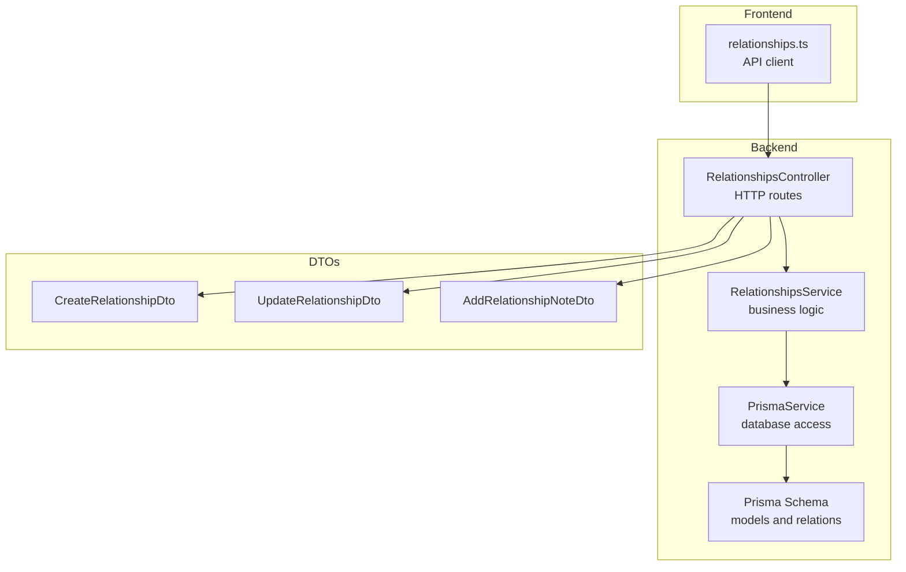
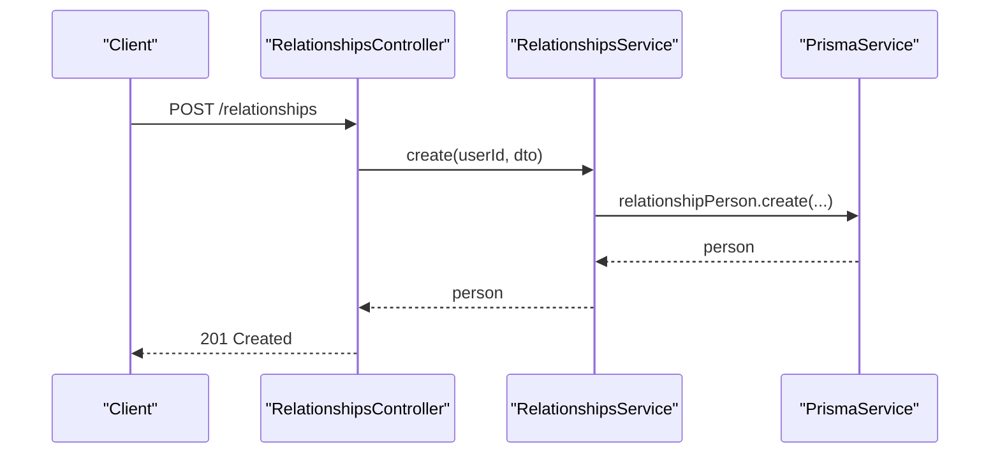
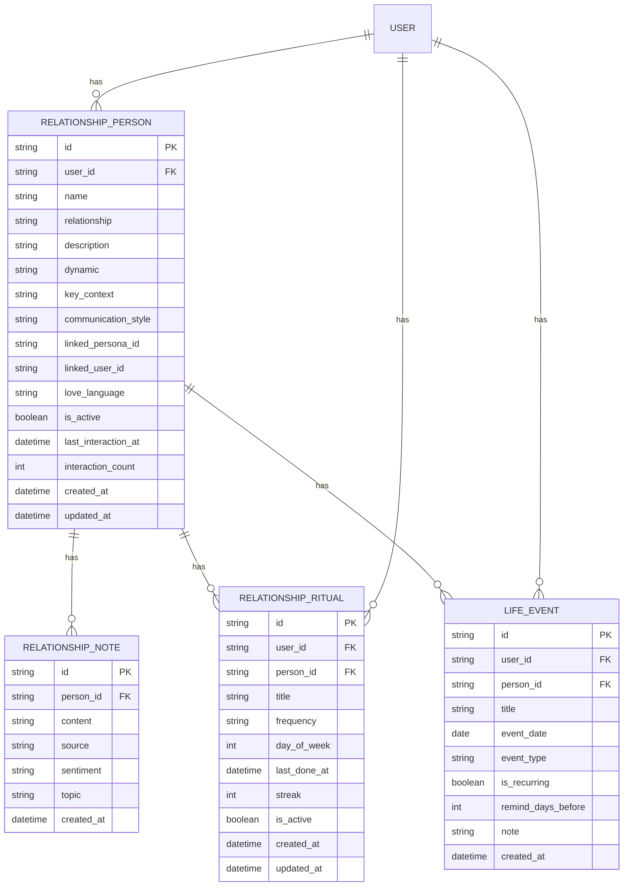
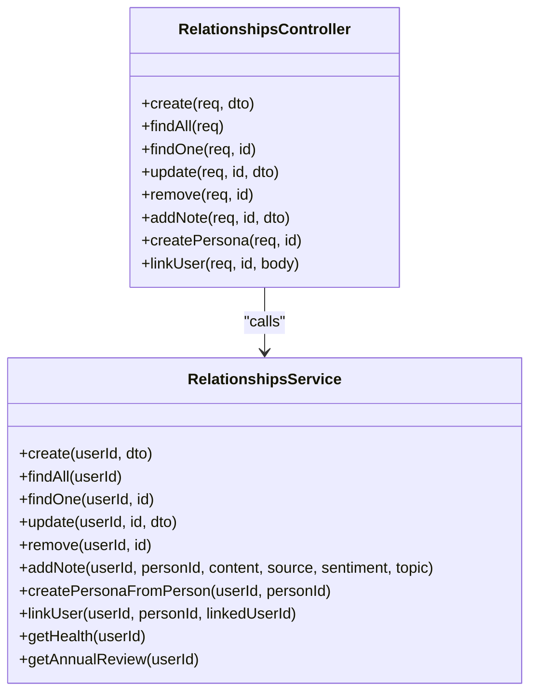

# Relationships API

<cite>
**Referenced Files in This Document**
- [relationships.controller.ts](file://backend/src/relationships/relationships.controller.ts)
- [relationships.service.ts](file://backend/src/relationships/relationships.service.ts)
- [create-relationship.dto.ts](file://backend/src/relationships/dto/create-relationship.dto.ts)
- [update-relationship.dto.ts](file://backend/src/relationships/dto/update-relationship.dto.ts)
- [add-relationship-note.dto.ts](file://backend/src/relationships/dto/add-relationship-note.dto.ts)
- [schema.prisma](file://backend/prisma/schema.prisma)
- [20260419180329_add_relationship_circle/migration.sql](file://backend/prisma/migrations/20260419180329_add_relationship_circle/migration.sql)
- [20260419191045_add_relationship_evolution/migration.sql](file://backend/prisma/migrations/20260419191045_add_relationship_evolution/migration.sql)
- [20260422080027_add_love_language/migration.sql](file://backend/prisma/migrations/20260422080027_add_love_language/migration.sql)
- [20260422073952_add_rituals_and_life_events/migration.sql](file://backend/prisma/migrations/20260422073952_add_rituals_and_life_events/migration.sql)
- [20260430100000_add_relationship_person_linked_user/migration.sql](file://backend/prisma/migrations/20260430100000_add_relationship_person_linked_user/migration.sql)
- [jwt-auth.guard.ts](file://backend/src/auth/jwt-auth.guard.ts)
- [relationships.ts](file://frontend/src/api/relationships.ts)
</cite>

## Table of Contents
1. [Introduction](#introduction)
2. [Project Structure](#project-structure)
3. [Core Components](#core-components)
4. [Architecture Overview](#architecture-overview)
5. [Detailed Component Analysis](#detailed-component-analysis)
6. [Dependency Analysis](#dependency-analysis)
7. [Performance Considerations](#performance-considerations)
8. [Troubleshooting Guide](#troubleshooting-guide)
9. [Conclusion](#conclusion)
10. [Appendices](#appendices)

## Introduction
This document describes the Relationships API, which manages a user’s social circle and relationship dynamics. It covers HTTP endpoints for creating, listing, retrieving, updating, and deleting relationship entries; adding notes with sentiment and topics; linking a Circle person to a registered user; and deriving relationship health and annual review insights. It also documents DTO schemas, authentication requirements, and practical curl examples.

## Project Structure
The Relationships feature is implemented as a NestJS controller and service with Prisma-backed persistence. DTOs define request schemas. Migrations establish the underlying tables for persons, notes, rituals, and life events.

**Diagram sources**
- [relationships.controller.ts:18-91](file://backend/src/relationships/relationships.controller.ts#L18-L91)
- [relationships.service.ts:10-19](file://backend/src/relationships/relationships.service.ts#L10-L19)
- [schema.prisma:401-499](file://backend/prisma/schema.prisma#L401-L499)
- [create-relationship.dto.ts:3-47](file://backend/src/relationships/dto/create-relationship.dto.ts#L3-L47)
- [update-relationship.dto.ts:3-42](file://backend/src/relationships/dto/update-relationship.dto.ts#L3-L42)
- [add-relationship-note.dto.ts:3-14](file://backend/src/relationships/dto/add-relationship-note.dto.ts#L3-L14)
- [relationships.ts:94-147](file://frontend/src/api/relationships.ts#L94-L147)

**Section sources**
- [relationships.controller.ts:18-91](file://backend/src/relationships/relationships.controller.ts#L18-L91)
- [relationships.service.ts:10-19](file://backend/src/relationships/relationships.service.ts#L10-L19)
- [schema.prisma:401-499](file://backend/prisma/schema.prisma#L401-L499)

## Core Components
- RelationshipsController: Exposes REST endpoints under /relationships with JWT authentication.
- RelationshipsService: Implements CRUD, note management, persona creation from a person, user-linking, health scoring, and annual review computation.
- DTOs: Strongly typed request schemas for create, update, and note creation.
- Prisma models: RelationshipPerson, RelationshipNote, RelationshipRitual, LifeEvent.

**Section sources**
- [relationships.controller.ts:18-91](file://backend/src/relationships/relationships.controller.ts#L18-L91)
- [relationships.service.ts:27-180](file://backend/src/relationships/relationships.service.ts#L27-L180)
- [create-relationship.dto.ts:3-47](file://backend/src/relationships/dto/create-relationship.dto.ts#L3-L47)
- [update-relationship.dto.ts:3-42](file://backend/src/relationships/dto/update-relationship.dto.ts#L3-L42)
- [add-relationship-note.dto.ts:3-14](file://backend/src/relationships/dto/add-relationship-note.dto.ts#L3-L14)
- [schema.prisma:401-499](file://backend/prisma/schema.prisma#L401-L499)

## Architecture Overview
The API follows a layered architecture:
- HTTP layer: Controller handles routing and validation via DTOs.
- Application layer: Service orchestrates Prisma queries, emits ontology events, and performs analytics.
- Persistence layer: Prisma models map to PostgreSQL tables.

**Diagram sources**
- [relationships.controller.ts:23-26](file://backend/src/relationships/relationships.controller.ts#L23-L26)
- [relationships.service.ts:27-49](file://backend/src/relationships/relationships.service.ts#L27-L49)

## Detailed Component Analysis

### Authentication and Authorization
- All endpoints require a valid JWT bearer token.
- Guard: JwtAuthGuard derived from Passport’s JWT strategy.

**Section sources**
- [relationships.controller.ts:18-19](file://backend/src/relationships/relationships.controller.ts#L18-L19)
- [jwt-auth.guard.ts:1-6](file://backend/src/auth/jwt-auth.guard.ts#L1-L6)

### Endpoint Catalog

- Base Path: /relationships
- Authentication: Required (Bearer JWT)

#### List Relationships
- Method: GET
- URL: /relationships
- Description: Returns all active relationships for the authenticated user, ordered by creation date, with note counts.
- Response: Array of RelationshipPerson

#### Retrieve Relationship Details
- Method: GET
- URL: /relationships/:id
- Description: Returns a single relationship with up to 20 latest notes.
- Response: RelationshipPerson

#### Create Relationship
- Method: POST
- URL: /relationships
- Description: Creates a new relationship person entry. Supports optional fields for description, dynamic, key context, communication style, love language, linked user, and phone number.
- Request Body: CreateRelationshipDto
- Response: RelationshipPerson

#### Update Relationship
- Method: PUT
- URL: /relationships/:id
- Description: Partially updates a relationship. Fields are optional and only provided ones are changed.
- Request Body: UpdateRelationshipDto
- Response: RelationshipPerson

#### Delete Relationship
- Method: DELETE
- URL: /relationships/:id
- Description: Removes a relationship.
- Response: { success: true }

#### Add Relationship Note
- Method: POST
- URL: /relationships/:id/notes
- Description: Adds a note associated with a person. Optional sentiment and topic are stored. Increments interaction counters on the person.
- Request Body: AddRelationshipNoteDto
- Response: RelationshipNote

#### Create Persona From Person
- Method: POST
- URL: /relationships/:id/create-persona
- Description: Creates a Persona based on the person’s attributes (description, dynamic, key context, communication style). Links the persona back to the person.
- Response: { persona: ..., alreadyExists: boolean }

#### Link User to Person
- Method: POST
- URL: /relationships/:id/link-user
- Description: Authoritative link from a Circle person to a registered 4Ever user. Pass null to clear an existing link.
- Request Body: { linkedUserId: string | null }
- Response: RelationshipPerson

#### Health Report
- Method: GET
- URL: /relationships/health
- Description: Computes relationship health scores using a combination of messaging, notes, and rituals. Includes overall score, people with scores, drifting people, and recent activity.
- Response: RelationshipHealthData

#### Annual Review
- Method: GET
- URL: /relationships/annual-review
- Description: Aggregates yearly insights: most active relationships, new people, neglected relationships, tension stats, ritual count, life events, and monthly interaction trends.
- Response: AnnualReviewData

**Section sources**
- [relationships.controller.ts:23-91](file://backend/src/relationships/relationships.controller.ts#L23-L91)
- [relationships.service.ts:51-180](file://backend/src/relationships/relationships.service.ts#L51-L180)
- [relationships.ts:94-147](file://frontend/src/api/relationships.ts#L94-L147)

### Request/Response Schemas (DTOs)

#### CreateRelationshipDto
- name: string (required, length limits)
- relationship: string (required, length limits)
- description?: string (optional)
- dynamic?: string (optional)
- keyContext?: string (optional)
- communicationStyle?: string (optional)
- loveLanguage?: string (optional)
- linkedUserId?: string (optional)
- phoneNumber?: string (optional)

#### UpdateRelationshipDto
- name?, relationship?, description?, dynamic?, keyContext?, communicationStyle?, loveLanguage?, phoneNumber? (all optional)

#### AddRelationshipNoteDto
- content: string (required)
- sentiment?: string (optional)
- topic?: string (optional)

**Section sources**
- [create-relationship.dto.ts:3-47](file://backend/src/relationships/dto/create-relationship.dto.ts#L3-L47)
- [update-relationship.dto.ts:3-42](file://backend/src/relationships/dto/update-relationship.dto.ts#L3-L42)
- [add-relationship-note.dto.ts:3-14](file://backend/src/relationships/dto/add-relationship-note.dto.ts#L3-L14)

### Data Model Overview

**Diagram sources**
- [schema.prisma:401-499](file://backend/prisma/schema.prisma#L401-L499)
- [20260419180329_add_relationship_circle/migration.sql:1-35](file://backend/prisma/migrations/20260419180329_add_relationship_circle/migration.sql#L1-L35)
- [20260419191045_add_relationship_evolution/migration.sql:1-8](file://backend/prisma/migrations/20260419191045_add_relationship_evolution/migration.sql#L1-L8)
- [20260422080027_add_love_language/migration.sql:1-3](file://backend/prisma/migrations/20260422080027_add_love_language/migration.sql#L1-L3)
- [20260422073952_add_rituals_and_life_events/migration.sql:1-45](file://backend/prisma/migrations/20260422073952_add_rituals_and_life_events/migration.sql#L1-L45)
- [20260430100000_add_relationship_person_linked_user/migration.sql:1-8](file://backend/prisma/migrations/20260430100000_add_relationship_person_linked_user/migration.sql#L1-L8)

### Practical Examples

- Create a relationship with person associations
  - curl -X POST https://your-host/relationships \
    -H "Authorization: Bearer YOUR_JWT" \
    -H "Content-Type: application/json" \
    -d '{
      "name":"Alice",
      "relationship":"Friend",
      "description":"Art collector",
      "dynamic":"Mutual support",
      "keyContext":"Recent gallery show",
      "communicationStyle":"Direct and encouraging",
      "loveLanguage":"Quality time",
      "linkedUserId":null,
      "phoneNumber":"+15551234567"
    }'

- Add a relationship note
  - curl -X POST https://your-host/relationships/<PERSON_ID>/notes \
    -H "Authorization: Bearer YOUR_JWT" \
    -H "Content-Type: application/json" \
    -d '{
      "content":"Discussed upcoming art walk",
      "sentiment":"positive",
      "topic":"casual"
    }'

- Update relationship details
  - curl -X PUT https://your-host/relationships/<PERSON_ID> \
    -H "Authorization: Bearer YOUR_JWT" \
    -H "Content-Type: application/json" \
    -d '{
      "communicationStyle":"More reflective",
      "loveLanguage":"Acts of service"
    }'

- Link a Circle person to a registered user
  - curl -X POST https://your-host/relationships/<PERSON_ID>/link-user \
    -H "Authorization: Bearer YOUR_JWT" \
    -H "Content-Type: application/json" \
    -d '{"linkedUserId":"USER_ID"}'

- Clear a link
  - curl -X POST https://your-host/relationships/<PERSON_ID>/link-user \
    -H "Authorization: Bearer YOUR_JWT" \
    -H "Content-Type: application/json" \
    -d '{"linkedUserId":null}'

- Create a persona from a person
  - curl -X POST https://your-host/relationships/<PERSON_ID>/create-persona \
    -H "Authorization: Bearer YOUR_JWT"

- Get health report
  - curl -X GET https://your-host/relationships/health \
    -H "Authorization: Bearer YOUR_JWT"

- Get annual review
  - curl -X GET https://your-host/relationships/annual-review \
    -H "Authorization: Bearer YOUR_JWT"

**Section sources**
- [relationships.controller.ts:23-91](file://backend/src/relationships/relationships.controller.ts#L23-L91)
- [relationships.ts:94-147](file://frontend/src/api/relationships.ts#L94-L147)

### Relationship Mapping Features
- Person-to-User linkage: An authoritative link (linked_user_id) enables precise matching across messaging, health, and ontology pipelines.
- Fuzzy fallback: When no explicit link exists, the health report matches names against connected users to infer relationships.

**Section sources**
- [relationships.service.ts:224-245](file://backend/src/relationships/relationships.service.ts#L224-L245)
- [20260430100000_add_relationship_person_linked_user/migration.sql:1-8](file://backend/prisma/migrations/20260430100000_add_relationship_person_linked_user/migration.sql#L1-L8)

### Love Language Assessment Integration
- Field: love_language is persisted on RelationshipPerson.
- Used in persona creation prompt to tailor role-play behavior.

**Section sources**
- [relationships.service.ts:592-617](file://backend/src/relationships/relationships.service.ts#L592-L617)
- [20260422080027_add_love_language/migration.sql:1-3](file://backend/prisma/migrations/20260422080027_add_love_language/migration.sql#L1-L3)

### Relationship Timeline Management
- RelationshipNote supports sentiment and topic auto-detection, enabling timeline-style analysis.
- Annual review aggregates monthly note counts and sentiment breakdowns.

**Section sources**
- [relationships.service.ts:480-574](file://backend/src/relationships/relationships.service.ts#L480-L574)
- [20260419191045_add_relationship_evolution/migration.sql:1-8](file://backend/prisma/migrations/20260419191045_add_relationship_evolution/migration.sql#L1-L8)

### Connection Status Tracking
- Health report correlates direct messages with relationship persons to compute recency and engagement metrics.

**Section sources**
- [relationships.service.ts:207-260](file://backend/src/relationships/relationships.service.ts#L207-L260)

### Analytics and Insights
- Health report: Single LLM call to score all relationships; fallback scoring when LLM is unavailable.
- Annual review: Activity trends, sentiment distribution, new additions, neglected relationships, and event counts.

**Section sources**
- [relationships.service.ts:363-423](file://backend/src/relationships/relationships.service.ts#L363-L423)
- [relationships.service.ts:480-574](file://backend/src/relationships/relationships.service.ts#L480-L574)

## Dependency Analysis

**Diagram sources**
- [relationships.controller.ts:18-91](file://backend/src/relationships/relationships.controller.ts#L18-L91)
- [relationships.service.ts:10-19](file://backend/src/relationships/relationships.service.ts#L10-L19)

**Section sources**
- [relationships.controller.ts:18-91](file://backend/src/relationships/relationships.controller.ts#L18-L91)
- [relationships.service.ts:10-19](file://backend/src/relationships/relationships.service.ts#L10-L19)

## Performance Considerations
- Batch queries: Health report batches lookups for notes, rituals, and direct messages to minimize round-trips.
- Indexing: Composite index on (user_id, linked_user_id) supports fast authoritative linking.
- LLM fallback: When LLM scoring fails, a deterministic scoring method ensures resilience.

**Section sources**
- [relationships.service.ts:222-297](file://backend/src/relationships/relationships.service.ts#L222-L297)
- [relationships.service.ts:388-423](file://backend/src/relationships/relationships.service.ts#L388-L423)
- [20260430100000_add_relationship_person_linked_user/migration.sql:6-7](file://backend/prisma/migrations/20260430100000_add_relationship_person_linked_user/migration.sql#L6-L7)

## Troubleshooting Guide
- 404 Not Found: Occurs when a person does not belong to the authenticated user or does not exist.
- Cannot link to self: Attempting to link a Circle person to oneself is rejected.
- Missing JWT: All endpoints require a valid bearer token.

Common scenarios:
- Duplicate relationships: Not prevented by the API; create multiple entries if needed.
- Invalid person association: Use the person’s id from the RelationshipPerson record.
- Sentiment/topic validation: Optional fields; invalid values are ignored by the API.

**Section sources**
- [relationships.service.ts:103-111](file://backend/src/relationships/relationships.service.ts#L103-L111)
- [relationships.service.ts:117-138](file://backend/src/relationships/relationships.service.ts#L117-L138)

## Conclusion
The Relationships API provides a comprehensive foundation for managing personal relationships, capturing sentiment-driven notes, linking Circle persons to registered users, and generating actionable insights through health reports and annual reviews. Its DTO-driven design and strong Prisma models enable safe, extensible evolution of relationship features.

## Appendices

### Endpoint Reference Summary
- GET /relationships
- GET /relationships/:id
- POST /relationships
- PUT /relationships/:id
- DELETE /relationships/:id
- POST /relationships/:id/notes
- POST /relationships/:id/create-persona
- POST /relationships/:id/link-user
- GET /relationships/health
- GET /relationships/annual-review

**Section sources**
- [relationships.controller.ts:23-91](file://backend/src/relationships/relationships.controller.ts#L23-L91)