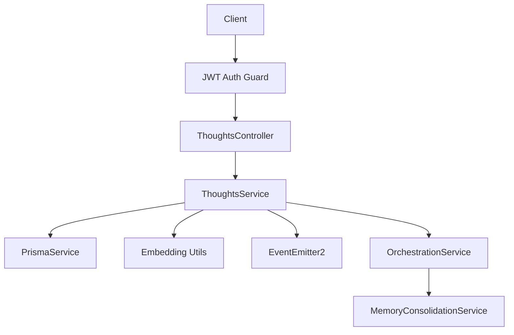
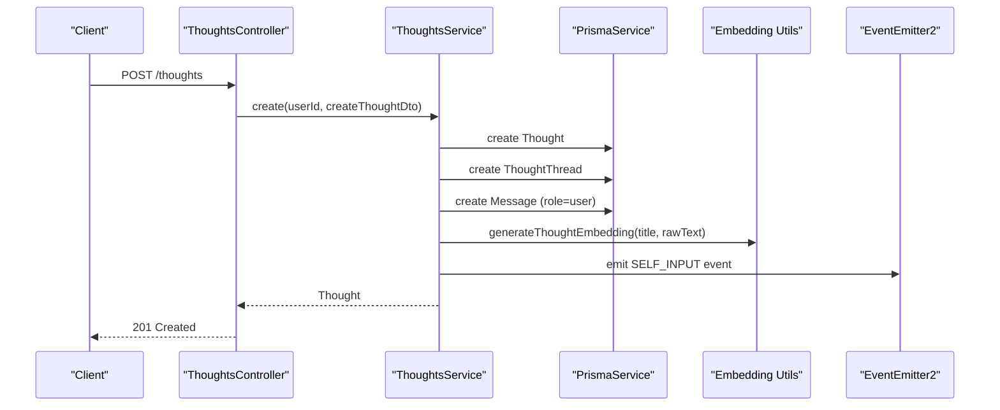
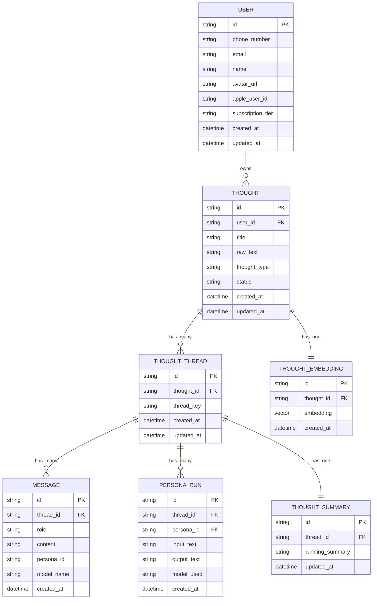
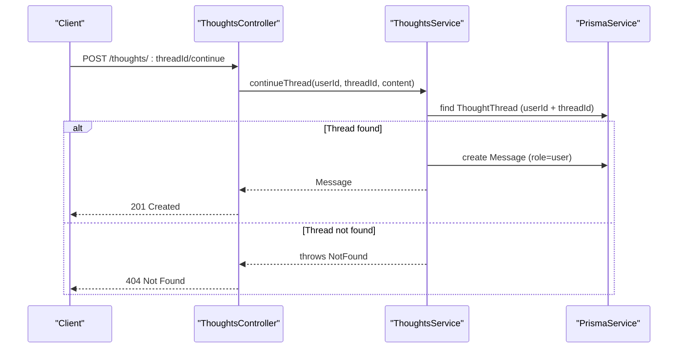
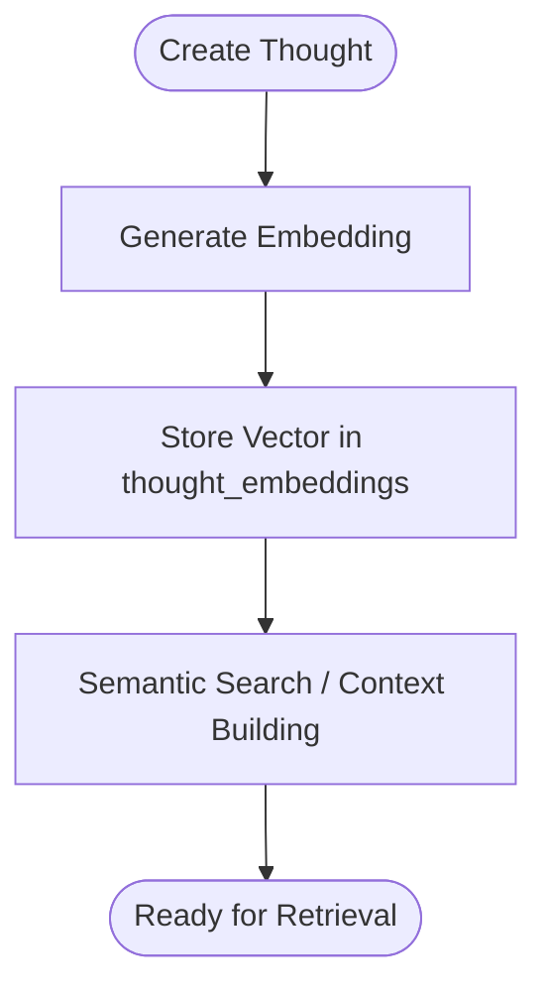
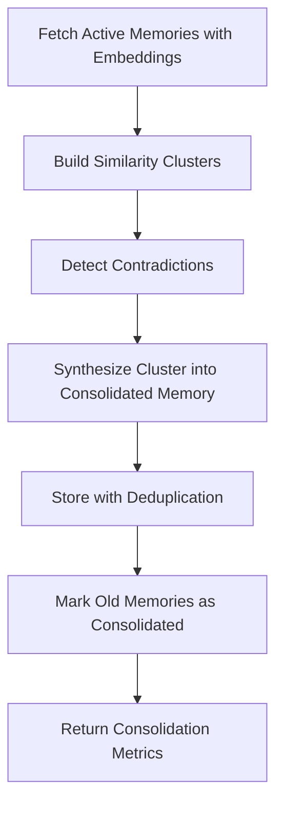
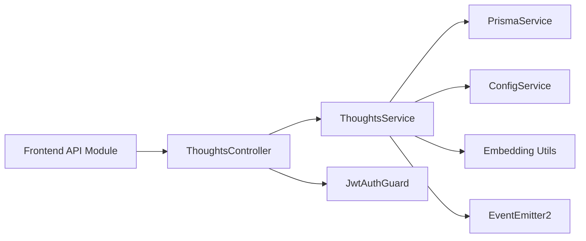

# Thoughts API

<cite>
**Referenced Files in This Document**
- [thoughts.controller.ts](file://backend/src/thoughts/thoughts.controller.ts)
- [thoughts.service.ts](file://backend/src/thoughts/thoughts.service.ts)
- [create-thought.dto.ts](file://backend/src/thoughts/dto/create-thought.dto.ts)
- [update-thought.dto.ts](file://backend/src/thoughts/dto/update-thought.dto.ts)
- [schema.prisma](file://backend/prisma/schema.prisma)
- [jwt-auth.guard.ts](file://backend/src/auth/jwt-auth.guard.ts)
- [jwt.strategy.ts](file://backend/src/auth/jwt.strategy.ts)
- [thoughts.ts](file://frontend/src/api/thoughts.ts)
- [orchestration.service.ts](file://backend/src/orchestration/orchestration.service.ts)
- [memory-consolidation.service.ts](file://backend/src/orchestration/memory-consolidation.service.ts)
</cite>

## Table of Contents
1. [Introduction](#introduction)
2. [Project Structure](#project-structure)
3. [Core Components](#core-components)
4. [Architecture Overview](#architecture-overview)
5. [Detailed Component Analysis](#detailed-component-analysis)
6. [Dependency Analysis](#dependency-analysis)
7. [Performance Considerations](#performance-considerations)
8. [Troubleshooting Guide](#troubleshooting-guide)
9. [Conclusion](#conclusion)
10. [Appendices](#appendices)

## Introduction
This document describes the Thoughts API, which manages user thoughts and their associated persona orchestration workflows. It covers HTTP endpoints for CRUD operations, request/response schemas using DTO patterns, authentication requirements, and integrations with persona orchestration, memory consolidation, and semantic search. Practical curl examples demonstrate creating thoughts, continuing threads, and handling responses. Guidance is included for common use cases such as editing thoughts, pagination, filtering by date ranges, and error scenarios.

## Project Structure
The Thoughts API is implemented as a NestJS controller with a dedicated service and DTOs. It integrates with:
- Authentication via JWT guard and strategy
- Prisma ORM for persistence and relationships
- Persona orchestration for thread continuation and persona runs
- Memory consolidation and semantic search for context enrichment

**Diagram sources**
- [thoughts.controller.ts:18-68](file://backend/src/thoughts/thoughts.controller.ts#L18-L68)
- [thoughts.service.ts:10-21](file://backend/src/thoughts/thoughts.service.ts#L10-L21)
- [jwt-auth.guard.ts:1-6](file://backend/src/auth/jwt-auth.guard.ts#L1-L6)
- [jwt.strategy.ts:6-26](file://backend/src/auth/jwt.strategy.ts#L6-L26)
- [orchestration.service.ts:24-74](file://backend/src/orchestration/orchestration.service.ts#L24-L74)
- [memory-consolidation.service.ts:15-27](file://backend/src/orchestration/memory-consolidation.service.ts#L15-L27)

**Section sources**
- [thoughts.controller.ts:18-68](file://backend/src/thoughts/thoughts.controller.ts#L18-L68)
- [thoughts.service.ts:10-21](file://backend/src/thoughts/thoughts.service.ts#L10-L21)
- [jwt-auth.guard.ts:1-6](file://backend/src/auth/jwt-auth.guard.ts#L1-L6)
- [jwt.strategy.ts:6-26](file://backend/src/auth/jwt.strategy.ts#L6-L26)

## Core Components
- ThoughtsController: Exposes REST endpoints under /thoughts with JWT authentication applied at the controller level.
- ThoughtsService: Implements business logic for creating thoughts, generating embeddings, managing threads/messages, and emitting ontology events.
- DTOs: Strongly typed request/response schemas validated by class-validator.
- Prisma schema: Defines the data model for thoughts, threads, messages, persona runs, and embeddings.

Key capabilities:
- Create thoughts with initial thread and user message
- List thoughts with pagination and total counts
- Retrieve individual thoughts with nested threads, messages, persona runs, and summaries
- Update thought metadata/status
- Delete thoughts
- Continue threads by adding user messages

**Section sources**
- [thoughts.controller.ts:23-67](file://backend/src/thoughts/thoughts.controller.ts#L23-L67)
- [thoughts.service.ts:22-187](file://backend/src/thoughts/thoughts.service.ts#L22-L187)
- [create-thought.dto.ts:3-15](file://backend/src/thoughts/dto/create-thought.dto.ts#L3-L15)
- [update-thought.dto.ts:3-19](file://backend/src/thoughts/dto/update-thought.dto.ts#L3-L19)
- [schema.prisma:76-106](file://backend/prisma/schema.prisma#L76-L106)

## Architecture Overview
The Thoughts API orchestrates persona orchestration through the OrchestrationService and MemoryConsolidationService. When a thought is created, an initial thread is established, a user message is stored, and embeddings are generated asynchronously. The system emits an ontology event for self insights. Thread continuation adds user messages to existing threads.

**Diagram sources**
- [thoughts.controller.ts:23-26](file://backend/src/thoughts/thoughts.controller.ts#L23-L26)
- [thoughts.service.ts:22-60](file://backend/src/thoughts/thoughts.service.ts#L22-L60)
- [orchestration.service.ts:56-74](file://backend/src/orchestration/orchestration.service.ts#L56-L74)

## Detailed Component Analysis

### Authentication and Authorization
- All endpoints are protected by JWT authentication via JwtAuthGuard.
- The JWT strategy extracts the token from the Authorization header and validates it against the configured secret.
- The validate method returns a user object containing userId and phone.

Authentication requirements:
- Include Authorization: Bearer <token> header in all requests except public endpoints.

**Section sources**
- [thoughts.controller.ts:18-19](file://backend/src/thoughts/thoughts.controller.ts#L18-L19)
- [jwt-auth.guard.ts:1-6](file://backend/src/auth/jwt-auth.guard.ts#L1-L6)
- [jwt.strategy.ts:16-25](file://backend/src/auth/jwt.strategy.ts#L16-L25)

### Endpoint Reference

- Base Path: /thoughts
- Authentication: Required (JWT)
- Content-Type: application/json

Endpoints:
- POST /
  - Description: Create a new thought and initialize a thread with a user message.
  - Request Body: CreateThoughtDto
  - Response: Thought object
  - Notes: Emits an ontology event and generates embeddings asynchronously.

- GET /
  - Description: List thoughts with pagination.
  - Query Parameters:
    - take: Number of items to return (default 20, max 100)
    - skip: Number of items to skip
  - Response: Paginated result with items, total, hasMore

- GET /:id
  - Description: Retrieve a single thought by ID.
  - Response: Thought with nested threads, messages, persona runs, and summaries.
  - Errors: 404 Not Found if thought does not belong to the user.

- PUT /:id
  - Description: Update thought metadata (title, rawText, thoughtType, status).
  - Request Body: UpdateThoughtDto
  - Response: Updated Thought

- DELETE /:id
  - Description: Delete a thought by ID.
  - Response: Deletion result
  - Errors: 404 Not Found if thought does not belong to the user.

- POST /:threadId/continue
  - Description: Add a user message to continue an existing thread.
  - Request Body: { content: string }
  - Response: Created Message
  - Errors: 404 Not Found if thread does not belong to the user.

**Section sources**
- [thoughts.controller.ts:23-67](file://backend/src/thoughts/thoughts.controller.ts#L23-L67)
- [thoughts.service.ts:83-187](file://backend/src/thoughts/thoughts.service.ts#L83-L187)
- [frontend/api/thoughts.ts:17-48](file://frontend/src/api/thoughts.ts#L17-L48)

### Request/Response Schemas (DTOs)

CreateThoughtDto
- title: string (required, min length 1)
- rawText: string (required, min length 1)
- thoughtType: string (optional)

UpdateThoughtDto
- title: string (optional)
- rawText: string (optional)
- thoughtType: string (optional)
- status: string (optional)

Response shape (Thought)
- id: string
- userId: string
- title: string
- rawText: string
- thoughtType: string
- status: string
- createdAt: datetime
- updatedAt: datetime
- threads: array of ThoughtThread (when retrieved individually)
- embedding: ThoughtEmbedding (when retrieved individually)

Response shape (Paginated list)
- items: Thought[]
- total: number
- hasMore: boolean

**Section sources**
- [create-thought.dto.ts:3-15](file://backend/src/thoughts/dto/create-thought.dto.ts#L3-L15)
- [update-thought.dto.ts:3-19](file://backend/src/thoughts/dto/update-thought.dto.ts#L3-L19)
- [schema.prisma:76-91](file://backend/prisma/schema.prisma#L76-L91)
- [thoughts.service.ts:83-102](file://backend/src/thoughts/thoughts.service.ts#L83-L102)

### Data Model Relationships

**Diagram sources**
- [schema.prisma:76-168](file://backend/prisma/schema.prisma#L76-L168)

**Section sources**
- [schema.prisma:76-168](file://backend/prisma/schema.prisma#L76-L168)

### Persona Orchestration and Thread Continuation
- Creating a thought initializes a ThoughtThread and a Message with role=user.
- Thread continuation adds another user Message to the specified thread.
- Persona orchestration occurs in the broader OrchestrationService, which builds context and coordinates persona runs across threads.

**Diagram sources**
- [thoughts.controller.ts:60-67](file://backend/src/thoughts/thoughts.controller.ts#L60-L67)
- [thoughts.service.ts:166-187](file://backend/src/thoughts/thoughts.service.ts#L166-L187)

**Section sources**
- [thoughts.controller.ts:60-67](file://backend/src/thoughts/thoughts.controller.ts#L60-L67)
- [thoughts.service.ts:166-187](file://backend/src/thoughts/thoughts.service.ts#L166-L187)
- [orchestration.service.ts:56-74](file://backend/src/orchestration/orchestration.service.ts#L56-L74)

### Semantic Search Integration
- Thought embeddings are generated asynchronously during creation and stored in thought_embeddings.
- The OrchestrationService demonstrates semantic search patterns using vector similarity queries for memory retrieval and persona context building.

**Diagram sources**
- [thoughts.service.ts:66-81](file://backend/src/thoughts/thoughts.service.ts#L66-L81)
- [schema.prisma:218-227](file://backend/prisma/schema.prisma#L218-L227)
- [orchestration.service.ts:512-565](file://backend/src/orchestration/orchestration.service.ts#L512-L565)

**Section sources**
- [thoughts.service.ts:66-81](file://backend/src/thoughts/thoughts.service.ts#L66-L81)
- [schema.prisma:218-227](file://backend/prisma/schema.prisma#L218-L227)
- [orchestration.service.ts:512-565](file://backend/src/orchestration/orchestration.service.ts#L512-L565)

### Memory Consolidation Workflow
- The MemoryConsolidationService consolidates semantically similar memories, detects contradictions, and stores consolidated results to reduce bloat and maintain coherence.
- While separate from thoughts, this service influences the broader context used by persona orchestration.

**Diagram sources**
- [memory-consolidation.service.ts:29-127](file://backend/src/orchestration/memory-consolidation.service.ts#L29-L127)

**Section sources**
- [memory-consolidation.service.ts:29-127](file://backend/src/orchestration/memory-consolidation.service.ts#L29-L127)

### Practical Examples

curl: Create a thought
- Method: POST
- URL: https://BASE_URL/thoughts
- Headers: Authorization: Bearer <token>, Content-Type: application/json
- Body:
  {
    "title": "My reflection",
    "rawText": "I reflected on my day...",
    "thoughtType": "journal"
  }
- Response: 201 Created with Thought object

curl: List thoughts with pagination
- Method: GET
- URL: https://BASE_URL/thoughts?take=20&skip=0
- Headers: Authorization: Bearer <token>
- Response: { items: Thought[], total: number, hasMore: boolean }

curl: Retrieve a single thought
- Method: GET
- URL: https://BASE_URL/thoughts/:id
- Headers: Authorization: Bearer <token>
- Response: Thought with nested threads, messages, persona runs, and summaries

curl: Update a thought
- Method: PUT
- URL: https://BASE_URL/thoughts/:id
- Headers: Authorization: Bearer <token>, Content-Type: application/json
- Body:
  {
    "title": "Updated title",
    "rawText": "Updated content",
    "thoughtType": "reflection",
    "status": "resolved"
  }
- Response: Updated Thought

curl: Delete a thought
- Method: DELETE
- URL: https://BASE_URL/thoughts/:id
- Headers: Authorization: Bearer <token>
- Response: 200 OK

curl: Continue a thread
- Method: POST
- URL: https://BASE_URL/thoughts/:threadId/continue
- Headers: Authorization: Bearer <token>, Content-Type: application/json
- Body: { "content": "Follow-up message..." }
- Response: Created Message

Common use cases:
- Thought editing: Use PUT to update title, rawText, thoughtType, and status.
- Pagination: Use take and skip query parameters on GET /thoughts.
- Filtering by date ranges: Extend service to accept date filters (not currently exposed in controller).
- Error scenarios:
  - Unauthorized: Missing or invalid Authorization header yields 401/403.
  - Not Found: Attempting to access another user's thought/thread yields 404.
  - Validation errors: DTO validation failures return 400 with validation errors.

**Section sources**
- [thoughts.controller.ts:23-67](file://backend/src/thoughts/thoughts.controller.ts#L23-L67)
- [frontend/api/thoughts.ts:17-48](file://frontend/src/api/thoughts.ts#L17-L48)
- [create-thought.dto.ts:3-15](file://backend/src/thoughts/dto/create-thought.dto.ts#L3-L15)
- [update-thought.dto.ts:3-19](file://backend/src/thoughts/dto/update-thought.dto.ts#L3-L19)

## Dependency Analysis
- Controller depends on ThoughtsService and JwtAuthGuard.
- Service depends on PrismaService, ConfigService, EventEmitter2, and embedding utilities.
- Embeddings rely on OPENROUTER_API_KEY and OPENROUTER_DEFAULT_MODEL.
- Frontend API module consumes the backend endpoints.

**Diagram sources**
- [thoughts.controller.ts:13-19](file://backend/src/thoughts/thoughts.controller.ts#L13-L19)
- [thoughts.service.ts:14-20](file://backend/src/thoughts/thoughts.service.ts#L14-L20)
- [frontend/api/thoughts.ts:1-49](file://frontend/src/api/thoughts.ts#L1-L49)

**Section sources**
- [thoughts.controller.ts:13-19](file://backend/src/thoughts/thoughts.controller.ts#L13-L19)
- [thoughts.service.ts:14-20](file://backend/src/thoughts/thoughts.service.ts#L14-L20)
- [frontend/api/thoughts.ts:1-49](file://frontend/src/api/thoughts.ts#L1-L49)

## Performance Considerations
- Embedding generation is asynchronous to avoid blocking thought creation.
- Pagination limits items per request (max 100) and includes hasMore for client-side pagination.
- Vector similarity queries are used for semantic search in orchestration and memory consolidation.

[No sources needed since this section provides general guidance]

## Troubleshooting Guide
- 401/403 Unauthorized: Ensure a valid JWT bearer token is included in the Authorization header.
- 404 Not Found: The requested thought or thread does not exist or does not belong to the authenticated user.
- 400 Bad Request: DTO validation failed (missing required fields, invalid types).
- Embedding generation failures: OPENROUTER_API_KEY must be configured; failures are logged and do not block operations.

**Section sources**
- [jwt.strategy.ts:12-15](file://backend/src/auth/jwt.strategy.ts#L12-L15)
- [thoughts.service.ts:78-81](file://backend/src/thoughts/thoughts.service.ts#L78-L81)
- [thoughts.service.ts:125-127](file://backend/src/thoughts/thoughts.service.ts#L125-L127)
- [thoughts.service.ts:176-178](file://backend/src/thoughts/thoughts.service.ts#L176-L178)

## Conclusion
The Thoughts API provides a robust foundation for managing thoughts, initializing threads, and integrating with persona orchestration and semantic search. With JWT authentication, structured DTOs, and scalable pagination, it supports both simple CRUD operations and advanced workflows involving memory consolidation and contextual persona interactions.

[No sources needed since this section summarizes without analyzing specific files]

## Appendices

### API Definition Summary
- Base Path: /thoughts
- Authentication: JWT Bearer
- Content-Type: application/json

Endpoints:
- POST /: Create thought
- GET /: List thoughts (pagination)
- GET /:id: Get thought
- PUT /:id: Update thought
- DELETE /:id: Delete thought
- POST /:threadId/continue: Continue thread

**Section sources**
- [thoughts.controller.ts:23-67](file://backend/src/thoughts/thoughts.controller.ts#L23-L67)
- [frontend/api/thoughts.ts:17-48](file://frontend/src/api/thoughts.ts#L17-L48)