# Analytics & Insights

<cite>
**Referenced Files in This Document**
- [insights.service.ts](file://backend/src/insights/insights.service.ts)
- [insights.controller.ts](file://backend/src/insights/insights.controller.ts)
- [insights.module.ts](file://backend/src/insights/insights.module.ts)
- [reflections.service.ts](file://backend/src/reflections/reflections.service.ts)
- [reflections.controller.ts](file://backend/src/reflections/reflections.controller.ts)
- [reflections.module.ts](file://backend/src/reflections/reflections.module.ts)
- [ontology.service.ts](file://backend/src/ontology/ontology.service.ts)
- [synthesis.service.ts](file://backend/src/ontology/synthesis.service.ts)
- [ontology.module.ts](file://backend/src/ontology/ontology.module.ts)
- [self.schema.ts](file://backend/src/ontology/schemas/self.schema.ts)
- [emotional.schema.ts](file://backend/src/ontology/schemas/emotional.schema.ts)
- [relational.schema.ts](file://backend/src/ontology/schemas/relational.schema.ts)
- [self.synthesizer.ts](file://backend/src/ontology/synthesizers/self.synthesizer.ts)
- [emotional.synthesizer.ts](file://backend/src/ontology/synthesizers/emotional.synthesizer.ts)
- [relational.synthesizer.ts](file://backend/src/ontology/synthesizers/relational.synthesizer.ts)
- [data-analyst.skill.md](file://backend/src/skills/system-skills/data-analyst.skill.md)
- [schema.prisma](file://backend/prisma/schema.prisma)
- [PRIVACY.md](file://docs/PRIVACY.md)
</cite>

## Table of Contents
1. [Introduction](#introduction)
2. [Project Structure](#project-structure)
3. [Core Components](#core-components)
4. [Architecture Overview](#architecture-overview)
5. [Detailed Component Analysis](#detailed-component-analysis)
6. [Dependency Analysis](#dependency-analysis)
7. [Performance Considerations](#performance-considerations)
8. [Troubleshooting Guide](#troubleshooting-guide)
9. [Conclusion](#conclusion)
10. [Appendices](#appendices)

## Introduction
This document explains the analytics and insights generation system powering personalized self-awareness and knowledge synthesis in the platform. It covers:
- How insights are computed from user thinking, persona interactions, and life dimensions
- The reflection system for structured self-analysis (daily and weekly)
- The ontology synthesis engine that builds and maintains three knowledge domains: Self, Emotional, and Relational
- Pattern recognition, trend analysis, and recommendation generation
- API endpoints for retrieving insights, managing reflections, and operating on ontologies
- Data privacy considerations for analytical processing and personalization

## Project Structure
The analytics and insights subsystem spans three main areas:
- Insights: statistical summaries, recurring topics, weekly evolution reports, relationship health, and life dimensions classification
- Reflections: automated prompts and reflective summaries for daily and weekly cycles
- Ontology: persistent knowledge bases across Self, Emotional, and Relational domains with scheduled synthesis

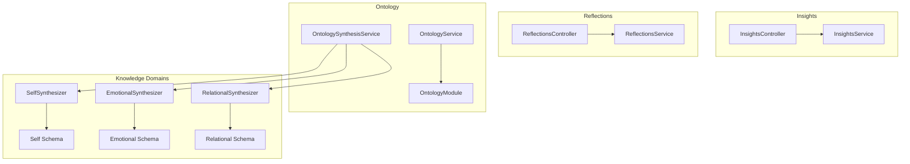

**Diagram sources**
- [insights.controller.ts:1-63](file://backend/src/insights/insights.controller.ts#L1-L63)
- [insights.service.ts:1-685](file://backend/src/insights/insights.service.ts#L1-L685)
- [reflections.controller.ts:1-20](file://backend/src/reflections/reflections.controller.ts#L1-L20)
- [reflections.service.ts:1-267](file://backend/src/reflections/reflections.service.ts#L1-L267)
- [ontology.service.ts:1-272](file://backend/src/ontology/ontology.service.ts#L1-L272)
- [synthesis.service.ts:1-175](file://backend/src/ontology/synthesis.service.ts#L1-L175)
- [self.synthesizer.ts:1-209](file://backend/src/ontology/synthesizers/self.synthesizer.ts#L1-L209)
- [emotional.synthesizer.ts:1-224](file://backend/src/ontology/synthesizers/emotional.synthesizer.ts#L1-L224)
- [relational.synthesizer.ts:1-283](file://backend/src/ontology/synthesizers/relational.synthesizer.ts#L1-L283)
- [self.schema.ts:1-40](file://backend/src/ontology/schemas/self.schema.ts#L1-L40)
- [emotional.schema.ts:1-39](file://backend/src/ontology/schemas/emotional.schema.ts#L1-L39)
- [relational.schema.ts:1-25](file://backend/src/ontology/schemas/relational.schema.ts#L1-L25)

**Section sources**
- [insights.module.ts:1-11](file://backend/src/insights/insights.module.ts#L1-L11)
- [reflections.module.ts:1-12](file://backend/src/reflections/reflections.module.ts#L1-L12)
- [ontology.module.ts:1-33](file://backend/src/ontology/ontology.module.ts#L1-L33)

## Core Components
- InsightsService: Computes statistics, detects recurring topics via semantic clustering, generates weekly and evolution reports, classifies life dimensions, and aggregates relationship health metrics.
- ReflectionsService: Generates daily and weekly reflection prompts and summaries grounded in the user’s plan, check-in, and thoughts.
- OntologyService: Provides read APIs for composed Self/Emotional/Relational snapshots and formats them for LLM context.
- OntologySynthesisService: Orchestrates domain-specific synthesis with debouncing and periodic cron jobs, ensuring freshness and resilience.
- Domain Synthesizers: Self, Emotional, and Relational synthesizers transform raw data into validated JSON snapshots.

**Section sources**
- [insights.service.ts:1-685](file://backend/src/insights/insights.service.ts#L1-L685)
- [reflections.service.ts:1-267](file://backend/src/reflections/reflections.service.ts#L1-L267)
- [ontology.service.ts:1-272](file://backend/src/ontology/ontology.service.ts#L1-L272)
- [synthesis.service.ts:1-175](file://backend/src/ontology/synthesis.service.ts#L1-L175)
- [self.synthesizer.ts:1-209](file://backend/src/ontology/synthesizers/self.synthesizer.ts#L1-L209)
- [emotional.synthesizer.ts:1-224](file://backend/src/ontology/synthesizers/emotional.synthesizer.ts#L1-L224)
- [relational.synthesizer.ts:1-283](file://backend/src/ontology/synthesizers/relational.synthesizer.ts#L1-L283)

## Architecture Overview
The system integrates analytics, reflection, and knowledge synthesis around a central event-snapshot model. Events trigger debounced synthesis; snapshots are persisted and exposed via a unified composition API.

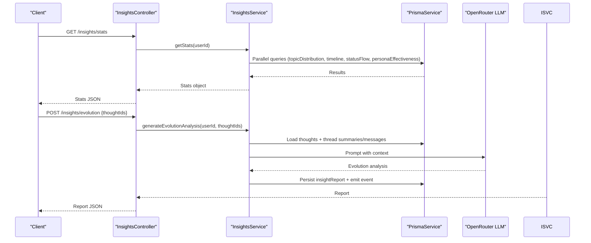

**Diagram sources**
- [insights.controller.ts:1-63](file://backend/src/insights/insights.controller.ts#L1-L63)
- [insights.service.ts:23-340](file://backend/src/insights/insights.service.ts#L23-L340)

**Section sources**
- [insights.controller.ts:1-63](file://backend/src/insights/insights.controller.ts#L1-L63)
- [insights.service.ts:23-464](file://backend/src/insights/insights.service.ts#L23-L464)

## Detailed Component Analysis

### Insights: Analytics and Personalized Reports
InsightsService performs:
- Aggregated stats: topic distribution, timeline, status flow, and persona effectiveness
- Recurring topic detection using semantic embeddings and union-find clustering
- Evolution analysis across related thoughts
- Weekly insight report generation
- Relationship health aggregation with trend comparisons
- Life dimensions classification using LLM with fallback logic

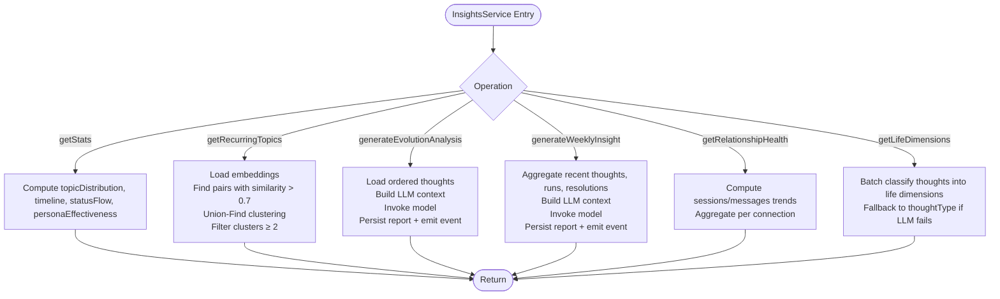

**Diagram sources**
- [insights.service.ts:23-685](file://backend/src/insights/insights.service.ts#L23-L685)

**Section sources**
- [insights.service.ts:23-685](file://backend/src/insights/insights.service.ts#L23-L685)
- [insights.controller.ts:1-63](file://backend/src/insights/insights.controller.ts#L1-L63)

### Reflections: Structured Self-Analysis
ReflectionsService produces:
- Evening reflection prompt and summary based on plan, check-in, and daily thoughts
- Weekly reflection summarizing tasks, mood/energy trends, and thinking patterns

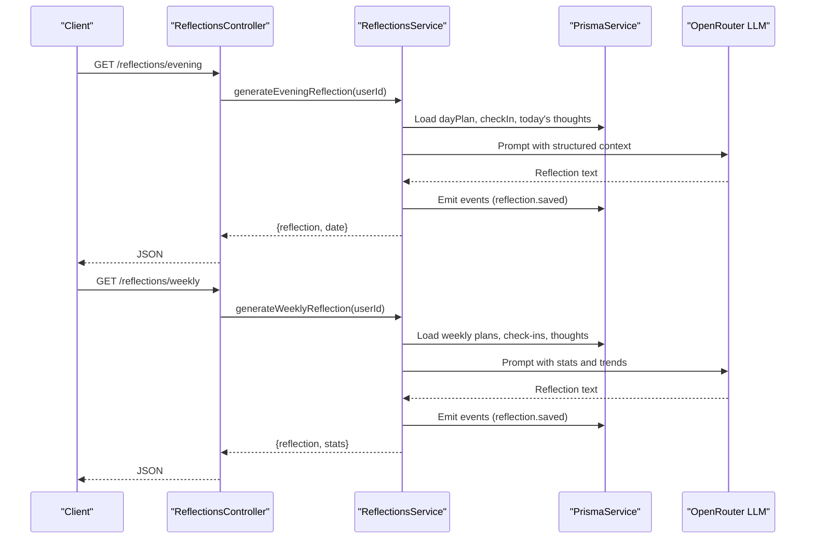

**Diagram sources**
- [reflections.controller.ts:1-20](file://backend/src/reflections/reflections.controller.ts#L1-L20)
- [reflections.service.ts:29-265](file://backend/src/reflections/reflections.service.ts#L29-L265)

**Section sources**
- [reflections.service.ts:29-265](file://backend/src/reflections/reflections.service.ts#L29-L265)
- [reflections.controller.ts:1-20](file://backend/src/reflections/reflections.controller.ts#L1-L20)

### Ontology Synthesis Engine: Knowledge Processing
The engine composes three knowledge domains:
- Self: Identity, values, traits, goals, decisions, trajectory
- Emotional: Weather, trends, active tensions, cooldowns, focus
- Relational: Bond strength, trend, drift risk, recurring topics, friction, next interaction, suggested rituals

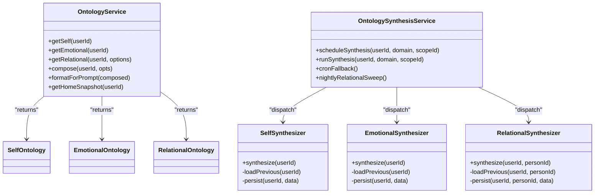

**Diagram sources**
- [ontology.service.ts:1-272](file://backend/src/ontology/ontology.service.ts#L1-L272)
- [synthesis.service.ts:1-175](file://backend/src/ontology/synthesis.service.ts#L1-L175)
- [self.synthesizer.ts:1-209](file://backend/src/ontology/synthesizers/self.synthesizer.ts#L1-L209)
- [emotional.synthesizer.ts:1-224](file://backend/src/ontology/synthesizers/emotional.synthesizer.ts#L1-L224)
- [relational.synthesizer.ts:1-283](file://backend/src/ontology/synthesizers/relational.synthesizer.ts#L1-L283)
- [self.schema.ts:1-40](file://backend/src/ontology/schemas/self.schema.ts#L1-L40)
- [emotional.schema.ts:1-39](file://backend/src/ontology/schemas/emotional.schema.ts#L1-L39)
- [relational.schema.ts:1-25](file://backend/src/ontology/schemas/relational.schema.ts#L1-L25)

**Section sources**
- [ontology.service.ts:1-272](file://backend/src/ontology/ontology.service.ts#L1-L272)
- [synthesis.service.ts:1-175](file://backend/src/ontology/synthesis.service.ts#L1-L175)
- [self.synthesizer.ts:1-209](file://backend/src/ontology/synthesizers/self.synthesizer.ts#L1-L209)
- [emotional.synthesizer.ts:1-224](file://backend/src/ontology/synthesizers/emotional.synthesizer.ts#L1-L224)
- [relational.synthesizer.ts:1-283](file://backend/src/ontology/synthesizers/relational.synthesizer.ts#L1-L283)

### Pattern Recognition, Trend Analysis, and Recommendations
- Pattern recognition: Semantic similarity clustering of thoughts using embeddings and union-find grouping
- Trend analysis: Weekly mood/energy trends, session/message growth rates, and relational drift risk thresholds
- Recommendation generation: LLM-driven insights and focus areas, persona effectiveness scoring, and relational suggestions

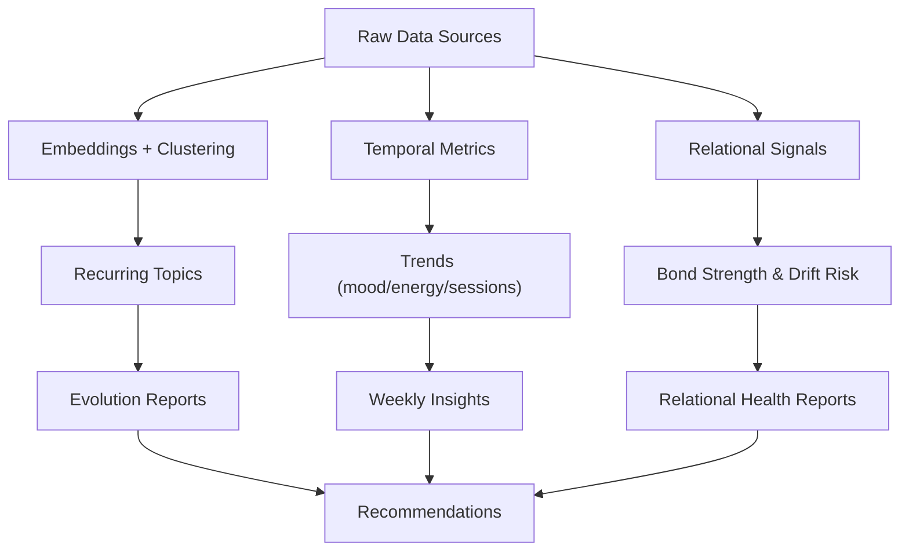

**Diagram sources**
- [insights.service.ts:176-251](file://backend/src/insights/insights.service.ts#L176-L251)
- [insights.service.ts:58-102](file://backend/src/insights/insights.service.ts#L58-L102)
- [relational.synthesizer.ts:269-283](file://backend/src/ontology/synthesizers/relational.synthesizer.ts#L269-L283)

**Section sources**
- [insights.service.ts:176-251](file://backend/src/insights/insights.service.ts#L176-L251)
- [relational.synthesizer.ts:269-283](file://backend/src/ontology/synthesizers/relational.synthesizer.ts#L269-L283)

### API Endpoints

#### Insights Endpoints
- GET /insights/stats
  - Returns combined stats: topicDistribution, timeline, statusFlow, personaEffectiveness
- GET /insights/recurring-topics
  - Returns clusters of recurring thoughts with metadata
- POST /insights/evolution
  - Body: thoughtIds[]
  - Returns an evolution report across related thoughts
- POST /insights/weekly
  - Returns a weekly insight report
- GET /insights/reports
  - Returns cached insight reports for the user
- GET /insights/life-dimensions
  - Returns classification of thoughts across life dimensions
- GET /insights/relationship-health?connectionId={id}&days={n}
  - Returns relationship health report for selected or all connections

**Section sources**
- [insights.controller.ts:1-63](file://backend/src/insights/insights.controller.ts#L1-L63)

#### Reflections Endpoints
- GET /reflections/evening
  - Returns an evening reflection prompt and date
- GET /reflections/weekly
  - Returns a weekly reflection and stats

**Section sources**
- [reflections.controller.ts:1-20](file://backend/src/reflections/reflections.controller.ts#L1-L20)

#### Ontology Endpoints
- GET /ontology/compose
  - Returns composed Self/Emotional/Relational snapshot with staleness indicators
- GET /ontology/home-snapshot
  - Returns a compact snapshot for home screen
- GET /ontology/formatted
  - Returns formatted prompt blocks for LLM context

Note: The controller methods are defined in the module; refer to the controller implementation for exact route paths.

**Section sources**
- [ontology.service.ts:92-272](file://backend/src/ontology/ontology.service.ts#L92-L272)
- [ontology.module.ts:1-33](file://backend/src/ontology/ontology.module.ts#L1-L33)

### Knowledge Synthesis Processes
- Debounced scheduling: Rapidly occurring events are coalesced into a single synthesis run per (user, domain, scopeId)
- Periodic fallback: Cron jobs detect unprocessed events and stale snapshots to ensure freshness
- Nightly relational sweep: Refreshes relational snapshots for all active relationships to maintain drift detection accuracy

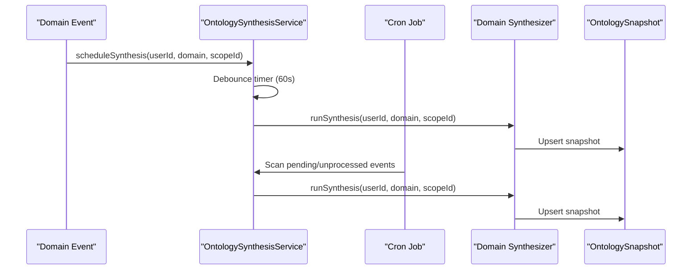

**Diagram sources**
- [synthesis.service.ts:28-129](file://backend/src/ontology/synthesis.service.ts#L28-L129)

**Section sources**
- [synthesis.service.ts:28-175](file://backend/src/ontology/synthesis.service.ts#L28-L175)

### Example Workflows

#### Insight Generation Workflow: Weekly Insight
- Input: user context, recent thoughts, persona runs, status changes
- Processing: build structured context, invoke LLM with system prompt, persist report
- Output: weekly insight report with metadata

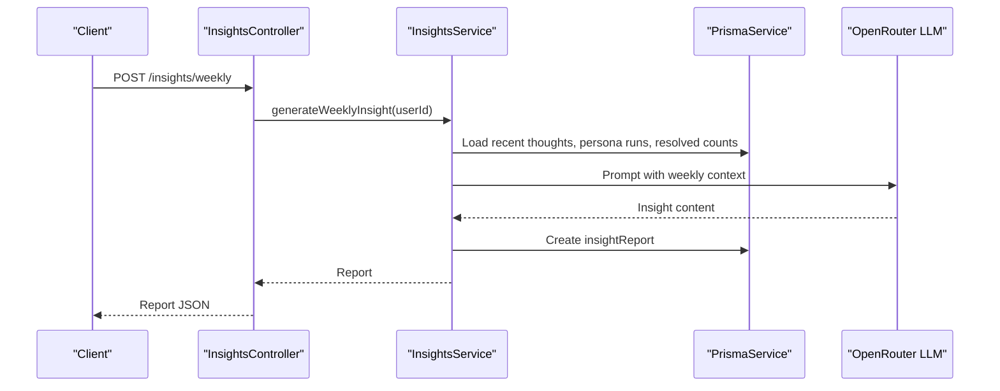

**Diagram sources**
- [insights.controller.ts:36-41](file://backend/src/insights/insights.controller.ts#L36-L41)
- [insights.service.ts:345-464](file://backend/src/insights/insights.service.ts#L345-L464)

#### Reflection Prompt Workflow: Evening Reflection
- Input: day plan, check-in, today’s thoughts
- Processing: construct context, invoke LLM with system prompt, emit events
- Output: reflection prompt and date

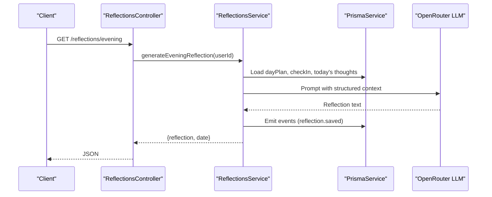

**Diagram sources**
- [reflections.controller.ts:10-13](file://backend/src/reflections/reflections.controller.ts#L10-L13)
- [reflections.service.ts:29-129](file://backend/src/reflections/reflections.service.ts#L29-L129)

#### Ontology Synthesis Workflow: Relational Snapshot
- Input: person profile, notes, rituals, life events, tensions
- Processing: compute deterministic signals (bond, drift risk), synthesize JSON, persist snapshot
- Output: relational snapshot for the person

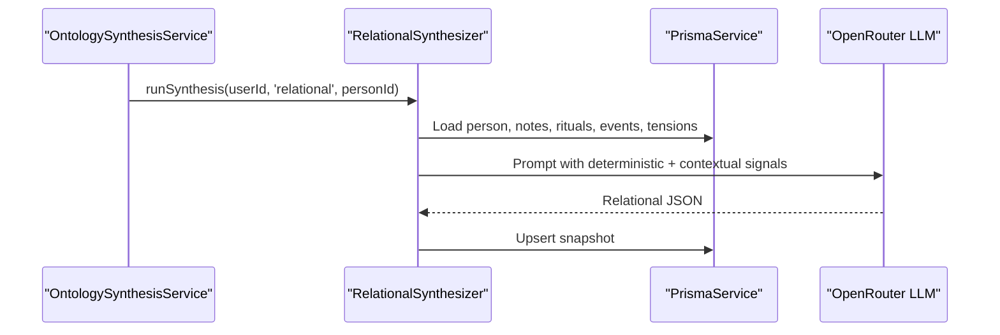

**Diagram sources**
- [synthesis.service.ts:50-75](file://backend/src/ontology/synthesis.service.ts#L50-L75)
- [relational.synthesizer.ts:26-190](file://backend/src/ontology/synthesizers/relational.synthesizer.ts#L26-L190)

## Dependency Analysis
- InsightsService depends on Prisma for analytics queries and OpenRouter for LLM generation
- ReflectionsService mirrors InsightsService’s LLM and event emission patterns
- OntologySynthesisService coordinates domain-specific synthesizers and schedules periodic maintenance
- OntologyService reads snapshots and formats them for downstream consumers

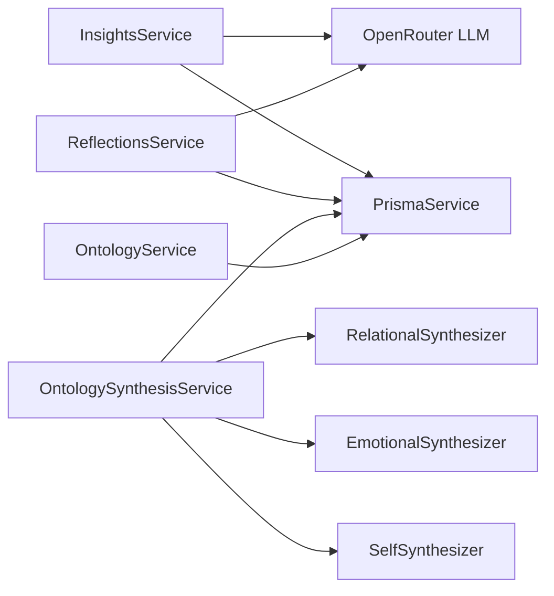

**Diagram sources**
- [insights.service.ts:1-21](file://backend/src/insights/insights.service.ts#L1-L21)
- [reflections.service.ts:1-24](file://backend/src/reflections/reflections.service.ts#L1-L24)
- [synthesis.service.ts:1-26](file://backend/src/ontology/synthesis.service.ts#L1-L26)
- [ontology.service.ts:1-28](file://backend/src/ontology/ontology.service.ts#L1-L28)

**Section sources**
- [insights.service.ts:1-21](file://backend/src/insights/insights.service.ts#L1-L21)
- [reflections.service.ts:1-24](file://backend/src/reflections/reflections.service.ts#L1-L24)
- [synthesis.service.ts:1-26](file://backend/src/ontology/synthesis.service.ts#L1-L26)
- [ontology.service.ts:1-28](file://backend/src/ontology/ontology.service.ts#L1-L28)

## Performance Considerations
- Embedding similarity queries and union-find clustering scale with the number of thought embeddings; consider indexing and limiting search windows
- LLM calls are rate-limited by API keys and model constraints; batching and caching reduce redundant generations
- Debounced synthesis prevents thrashing during bursts of activity; adjust debounce intervals based on workload
- Cron fallback ensures eventual consistency for stale snapshots; tune cadence to balance freshness and cost

## Troubleshooting Guide
- If weekly insight generation returns a light report, it indicates no recent thoughts; ensure data ingestion is active
- If evolution analysis fails, verify that at least two related thoughts exist for the given IDs
- If relational health reports are empty, confirm the user has opted in and has accepted connections
- If life dimensions classification fails, the system falls back to thought types; check LLM availability and prompts
- For reflection prompts, ensure daily plan, check-in, and thoughts exist for the requested day

**Section sources**
- [insights.service.ts:395-411](file://backend/src/insights/insights.service.ts#L395-L411)
- [insights.service.ts:274-276](file://backend/src/insights/insights.service.ts#L274-L276)
- [insights.service.ts:490-492](file://backend/src/insights/insights.service.ts#L490-L492)
- [insights.service.ts:669-682](file://backend/src/insights/insights.service.ts#L669-L682)
- [reflections.service.ts:29-129](file://backend/src/reflections/reflections.service.ts#L29-L129)

## Conclusion
The platform’s analytics and insights system combines robust data analytics, structured reflection, and a resilient knowledge synthesis engine to deliver personalized insights and recommendations. By leveraging semantic clustering, trend analysis, and validated domain ontologies, it supports continuous self-awareness and relationship intelligence while maintaining operational reliability through debounced synthesis and periodic maintenance.

## Appendices

### Data Privacy Considerations
- Data minimization: Insights and reflections are derived from user-provided inputs and interactions; avoid exposing unnecessary identifiers
- Consent and opt-out: Relationship health reporting requires explicit opt-in; ensure users can disable analytics features
- Secure storage: Embeddings and reports are stored in the database; enforce access controls and encryption at rest
- Export and deletion: Provide mechanisms for users to export or delete their analytics data per policy

**Section sources**
- [PRIVACY.md](file://docs/PRIVACY.md)
- [insights.service.ts:482-598](file://backend/src/insights/insights.service.ts#L482-L598)

### Related Skills for Quantitative Analysis
- The Data Analyst skill enables structured quantitative analysis workflows, including descriptive statistics, trend identification, and correlation assessment, with safeguards against fabricating data.

**Section sources**
- [data-analyst.skill.md:1-44](file://backend/src/skills/system-skills/data-analyst.skill.md#L1-L44)