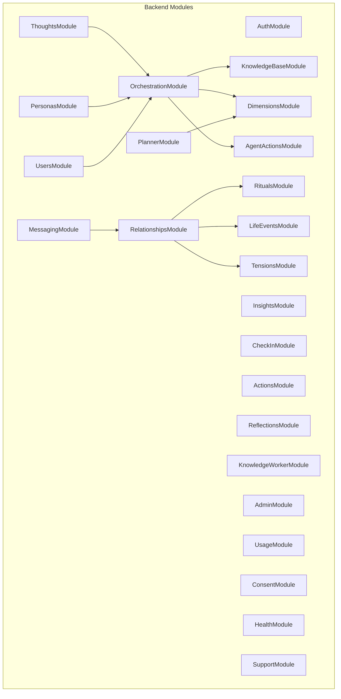
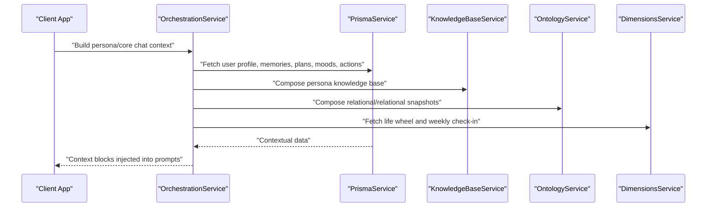
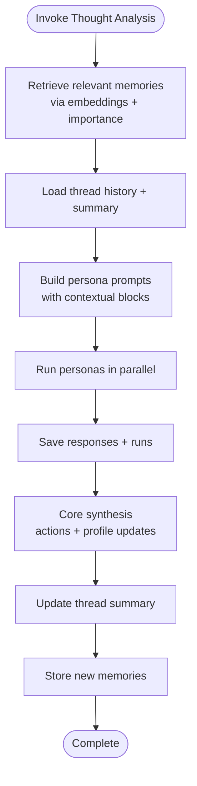
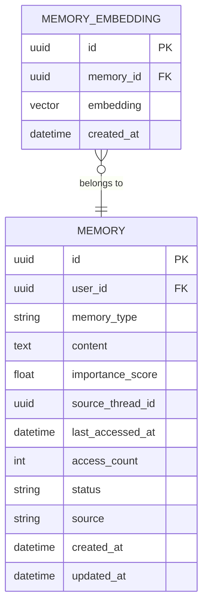
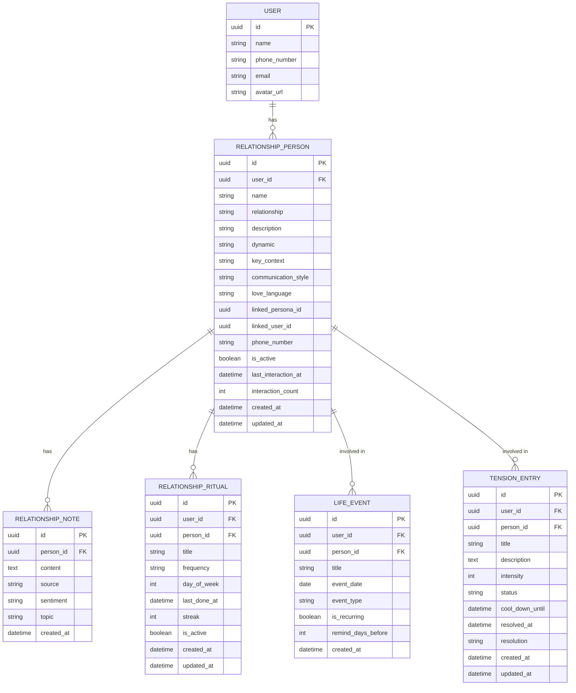
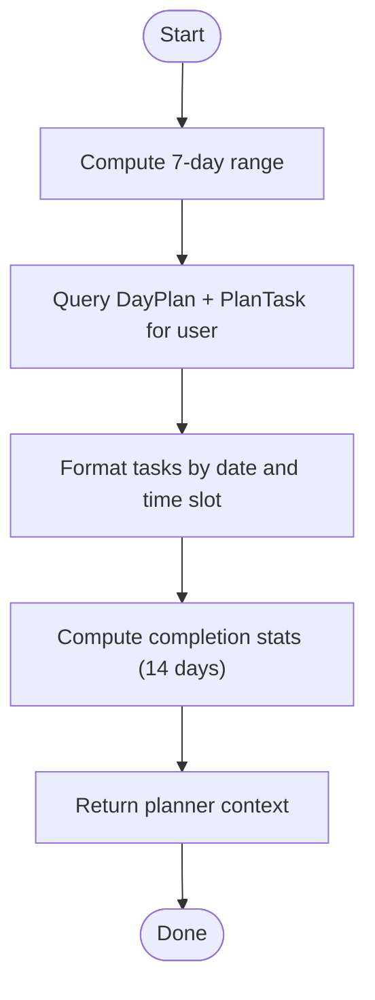
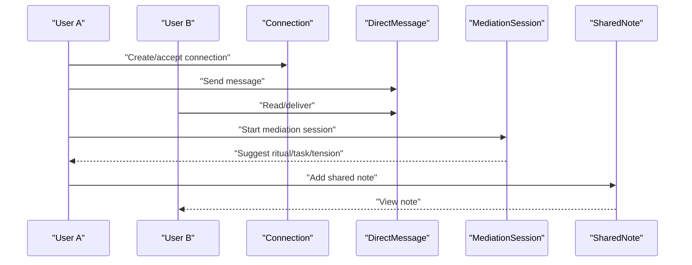
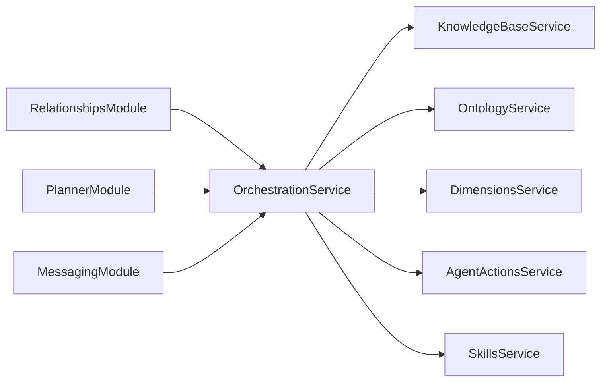

# Core Features

<cite>
**Referenced Files in This Document**
- [app.module.ts](file://backend/src/app.module.ts)
- [main.ts](file://backend/src/main.ts)
- [schema.prisma](file://backend/prisma/schema.prisma)
- [orchestration.module.ts](file://backend/src/orchestration/orchestration.module.ts)
- [orchestration.service.ts](file://backend/src/orchestration/orchestration.service.ts)
- [thought-analysis.graph.ts](file://backend/src/orchestration/graph/thought-analysis.graph.ts)
- [state.ts](file://backend/src/orchestration/graph/state.ts)
- [retrieve-memory.node.ts](file://backend/src/orchestration/graph/nodes/retrieve-memory.node.ts)
- [relationships.module.ts](file://backend/src/relationships/relationships.module.ts)
- [planner.module.ts](file://backend/src/planner/planner.module.ts)
- [messaging.module.ts](file://backend/src/messaging/messaging.module.ts)
- [MyCircle.tsx](file://frontend/src/pages/MyCircle.tsx)
- [Dashboard.tsx](file://frontend/src/pages/Dashboard.tsx)
- [MyCircleScreen.tsx](file://mobile/src/screens/MyCircleScreen.tsx)
</cite>

## Table of Contents
1. [Introduction](#introduction)
2. [Project Structure](#project-structure)
3. [Core Components](#core-components)
4. [Architecture Overview](#architecture-overview)
5. [Detailed Component Analysis](#detailed-component-analysis)
6. [Dependency Analysis](#dependency-analysis)
7. [Performance Considerations](#performance-considerations)
8. [Troubleshooting Guide](#troubleshooting-guide)
9. [Conclusion](#conclusion)

## Introduction
This document explains the core features that define 4Ever as a personal AI life management system. It focuses on:
- Multi-persona thought analysis (persona orchestration)
- Semantic memory system
- Relationship intelligence (relationship circle)
- Daily planning
- Real-time communication

These features are designed to work together: persona orchestration analyzes thoughts and conversations, the semantic memory system retrieves and consolidates meaningful experiences, relationship intelligence keeps social dynamics healthy, daily planning aligns actions with goals, and real-time communication enables live mediation and messaging. The result is a cohesive, adaptive AI companion that evolves with the user’s life.

## Project Structure
At runtime, the backend composes a modular NestJS application with dedicated modules for each capability. The orchestration module is central, coordinating persona orchestration, semantic memory, and contextual synthesis. Relationship intelligence, daily planning, and real-time messaging are provided by their respective modules. The frontend and mobile apps expose intuitive UIs for each feature area.

**Diagram sources**
- [app.module.ts:34-163](file://backend/src/app.module.ts#L34-L163)
- [orchestration.module.ts:11-17](file://backend/src/orchestration/orchestration.module.ts#L11-L17)
- [relationships.module.ts:7-13](file://backend/src/relationships/relationships.module.ts#L7-L13)
- [planner.module.ts:5-9](file://backend/src/planner/planner.module.ts#L5-L9)
- [messaging.module.ts:14-36](file://backend/src/messaging/messaging.module.ts#L14-L36)

**Section sources**
- [app.module.ts:34-163](file://backend/src/app.module.ts#L34-L163)

## Core Components
- Persona orchestration: A LangGraph-based workflow that retrieves memories, loads thread history, builds persona prompts, runs multiple personas, saves responses, synthesizes insights, updates summaries, and stores new memories.
- Semantic memory: Vector-backed recall with embedding similarity and importance-aware scoring, plus memory consolidation and lifecycle management.
- Relationship intelligence: A relationship circle with people, notes, rituals, life events, and tension tracking, plus drift detection and love languages.
- Daily planning: A seven-day rolling planner with tasks, statuses, and completion analytics.
- Real-time communication: Live messaging with tri-chat mediation, shared notes, reactions, and presence-awareness.

**Section sources**
- [orchestration.service.ts:24-74](file://backend/src/orchestration/orchestration.service.ts#L24-L74)
- [orchestration.service.ts:567-764](file://backend/src/orchestration/orchestration.service.ts#L567-L764)
- [schema.prisma:170-202](file://backend/prisma/schema.prisma#L170-L202)
- [relationships.module.ts:7-13](file://backend/src/relationships/relationships.module.ts#L7-L13)
- [planner.module.ts:5-9](file://backend/src/planner/planner.module.ts#L5-L9)
- [messaging.module.ts:14-36](file://backend/src/messaging/messaging.module.ts#L14-L36)

## Architecture Overview
The orchestration engine orchestrates persona analysis and synthesis across multiple domains. It composes contextual blocks from user profile, calendars, moods, completion stats, pending actions, memories, relationships, upcoming events, connections, unread messages, shared notes, session summaries, and life wheel snapshots. These blocks inform both persona-level and core chat-level reasoning.

**Diagram sources**
- [orchestration.service.ts:660-764](file://backend/src/orchestration/orchestration.service.ts#L660-L764)
- [orchestration.service.ts:572-606](file://backend/src/orchestration/orchestration.service.ts#L572-L606)

## Detailed Component Analysis

### Persona Orchestration (Multi-persona Thought Analysis)
Persona orchestration is implemented as a LangGraph workflow that:
- Retrieves relevant memories using semantic embeddings
- Loads thread history and existing summaries
- Builds persona-specific prompts with contextual blocks
- Runs multiple personas in parallel
- Saves responses and updates thread summaries
- Synthesizes core insights and profile updates
- Stores new memories and consolidates older ones

**Diagram sources**
- [thought-analysis.graph.ts:29-67](file://backend/src/orchestration/graph/thought-analysis.graph.ts#L29-L67)
- [state.ts:88-177](file://backend/src/orchestration/graph/state.ts#L88-L177)

Implementation highlights:
- Memory retrieval uses vector similarity with a fallback to importance-based selection.
- Context building is scoped to persona or core chat depending on intent.
- Core synthesis produces actionable items and potential profile updates.
- Memory lifecycle includes deduplication, access tracking, and consolidation.

**Section sources**
- [orchestration.service.ts:512-565](file://backend/src/orchestration/orchestration.service.ts#L512-L565)
- [orchestration.service.ts:567-764](file://backend/src/orchestration/orchestration.service.ts#L567-L764)
- [retrieve-memory.node.ts:11-21](file://backend/src/orchestration/graph/nodes/retrieve-memory.node.ts#L11-L21)
- [state.ts:88-177](file://backend/src/orchestration/graph/state.ts#L88-L177)

### Semantic Memory System
The semantic memory system supports long-term recall and consolidation:
- Embeddings are stored alongside memories for vector search.
- Retrieval blends embedding similarity, importance score, recency, and access frequency.
- Access counts and last-access timestamps help surface relevant memories.
- Deduplication and consolidation reduce noise and improve recall quality.

**Diagram sources**
- [schema.prisma:170-202](file://backend/prisma/schema.prisma#L170-L202)

**Section sources**
- [schema.prisma:170-202](file://backend/prisma/schema.prisma#L170-L202)
- [orchestration.service.ts:512-565](file://backend/src/orchestration/orchestration.service.ts#L512-L565)

### Relationship Intelligence (Relationship Circle)
Relationship intelligence centers on a “relationship circle” that tracks:
- People: names, relationships, descriptions, communication styles, love languages, and interaction history
- Notes: sentiment-tagged, topic-assigned notes per person
- Rituals: frequency-based touchpoints with streak tracking
- Life events: upcoming milestones and recurring celebrations
- Tensions: intensity, status, and resolution tracking

**Diagram sources**
- [schema.prisma:401-499](file://backend/prisma/schema.prisma#L401-L499)

UI touchpoints:
- Web dashboard cards and navigation to the relationship circle
- Mobile and web screens for people, rituals, events, and tensions
- Love language and drift detection indicators

**Section sources**
- [relationships.module.ts:7-13](file://backend/src/relationships/relationships.module.ts#L7-L13)
- [schema.prisma:401-499](file://backend/prisma/schema.prisma#L401-L499)
- [MyCircle.tsx:45-55](file://frontend/src/pages/MyCircle.tsx#L45-L55)
- [Dashboard.tsx:473-489](file://frontend/src/pages/Dashboard.tsx#L473-L489)
- [MyCircleScreen.tsx:35-65](file://mobile/src/screens/MyCircleScreen.tsx#L35-L65)

### Daily Planning
Daily planning provides a seven-day rolling schedule with tasks, statuses, and analytics:
- Fetches today, tomorrow, and the next five days
- Aggregates tasks by time slots and sorts by sort order
- Computes completion statistics and highlights repeated patterns
- Integrates with persona orchestration for planner-focused context

**Diagram sources**
- [orchestration.service.ts:77-125](file://backend/src/orchestration/orchestration.service.ts#L77-L125)
- [orchestration.service.ts:156-209](file://backend/src/orchestration/orchestration.service.ts#L156-L209)

**Section sources**
- [planner.module.ts:5-9](file://backend/src/planner/planner.module.ts#L5-L9)
- [orchestration.service.ts:77-125](file://backend/src/orchestration/orchestration.service.ts#L77-L125)
- [orchestration.service.ts:156-209](file://backend/src/orchestration/orchestration.service.ts#L156-L209)

### Real-Time Communication
Real-time communication integrates live messaging with tri-chat mediation:
- Connections and direct messages with read/status tracking
- Shared notes and reactions
- Mediator sessions with suggested actions and agreements
- Presence-awareness and one-sided clearing with continuity summaries

**Diagram sources**
- [schema.prisma:516-596](file://backend/prisma/schema.prisma#L516-L596)
- [schema.prisma:626-637](file://backend/prisma/schema.prisma#L626-L637)
- [messaging.module.ts:14-36](file://backend/src/messaging/messaging.module.ts#L14-L36)

**Section sources**
- [messaging.module.ts:14-36](file://backend/src/messaging/messaging.module.ts#L14-L36)
- [schema.prisma:516-596](file://backend/prisma/schema.prisma#L516-L596)
- [schema.prisma:626-637](file://backend/prisma/schema.prisma#L626-L637)

## Dependency Analysis
The orchestration module depends on knowledge base, ontology, dimensions, agent actions, and skills to enrich persona and core chat reasoning. Relationship intelligence, daily planning, and messaging modules supply complementary context and capabilities.

**Diagram sources**
- [orchestration.module.ts:11-17](file://backend/src/orchestration/orchestration.module.ts#L11-L17)
- [relationships.module.ts:7-13](file://backend/src/relationships/relationships.module.ts#L7-L13)
- [planner.module.ts:5-9](file://backend/src/planner/planner.module.ts#L5-L9)
- [messaging.module.ts:14-36](file://backend/src/messaging/messaging.module.ts#L14-L36)

**Section sources**
- [orchestration.module.ts:11-17](file://backend/src/orchestration/orchestration.module.ts#L11-L17)

## Performance Considerations
- Streaming timeouts and rate limiting: The orchestration service enforces streaming timeouts and relies on throttling guards to protect resources.
- Parallel context fetching: Context builders use Promise.all to minimize latency across heterogeneous data sources.
- Vector search with fallback: Memory retrieval prefers embeddings but falls back to importance/recency scoring.
- Compression and CORS: Responses are compressed except for streaming; CORS origins are validated in production.

**Section sources**
- [orchestration.service.ts:43-44](file://backend/src/orchestration/orchestration.service.ts#L43-L44)
- [app.module.ts:133-137](file://backend/src/app.module.ts#L133-L137)
- [main.ts:51-60](file://backend/src/main.ts#L51-L60)
- [main.ts:68-79](file://backend/src/main.ts#L68-L79)

## Troubleshooting Guide
- Missing API keys: If the OpenRouter API key is missing or invalid, persona responses will fail. The service logs warnings and continues with reduced capability.
- Memory retrieval failures: Vector search may fall back to importance-based retrieval; errors are logged and non-fatal.
- CORS misconfiguration: In production, CORS_ORIGINS must be explicitly set; otherwise, startup fails fast.
- Logging and redaction: Logs include correlation IDs and redact sensitive fields; verify redaction paths if PII appears in logs.

**Section sources**
- [orchestration.service.ts:56-61](file://backend/src/orchestration/orchestration.service.ts#L56-L61)
- [main.ts:72-75](file://backend/src/main.ts#L72-L75)
- [app.module.ts:72-97](file://backend/src/app.module.ts#L72-L97)

## Conclusion
4Ever’s core features form a tightly integrated AI life management system. Persona orchestration drives deep reflection and synthesis, semantic memory ensures meaningful continuity, relationship intelligence maintains social health, daily planning aligns actions with goals, and real-time communication enables live mediation and connection. Together, they create a responsive, evolving personal AI companion.