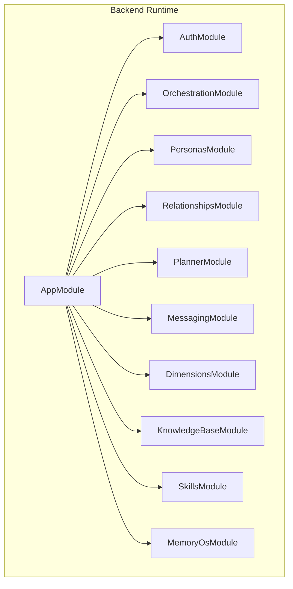
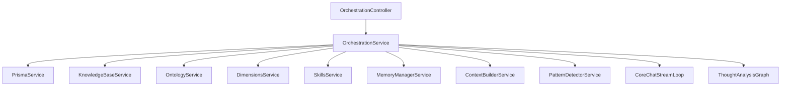
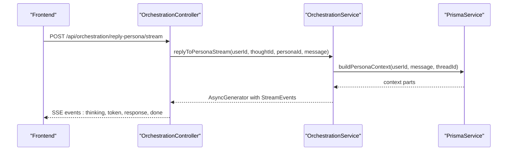
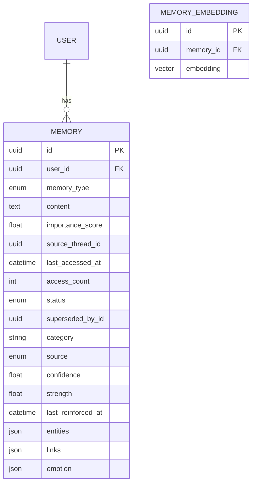
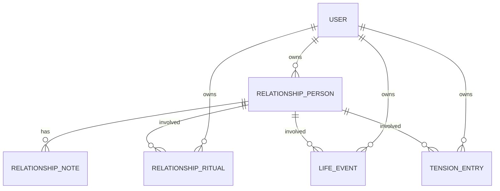
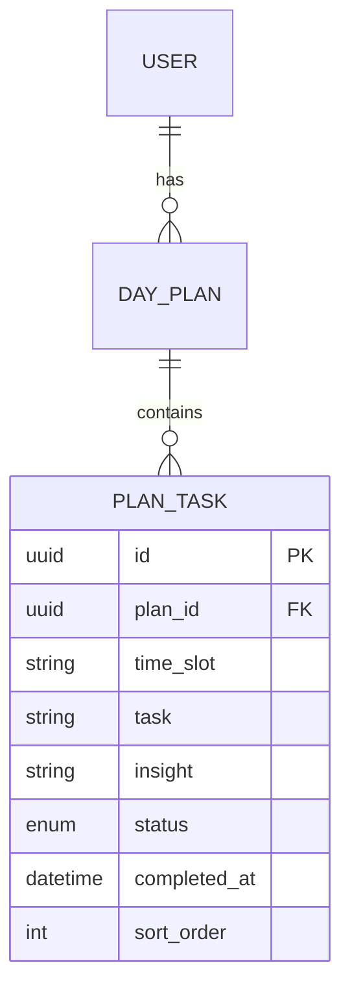
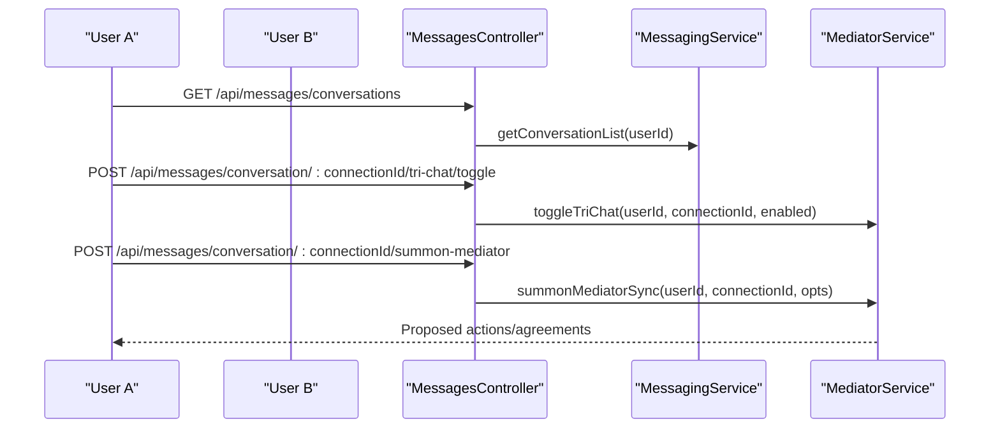
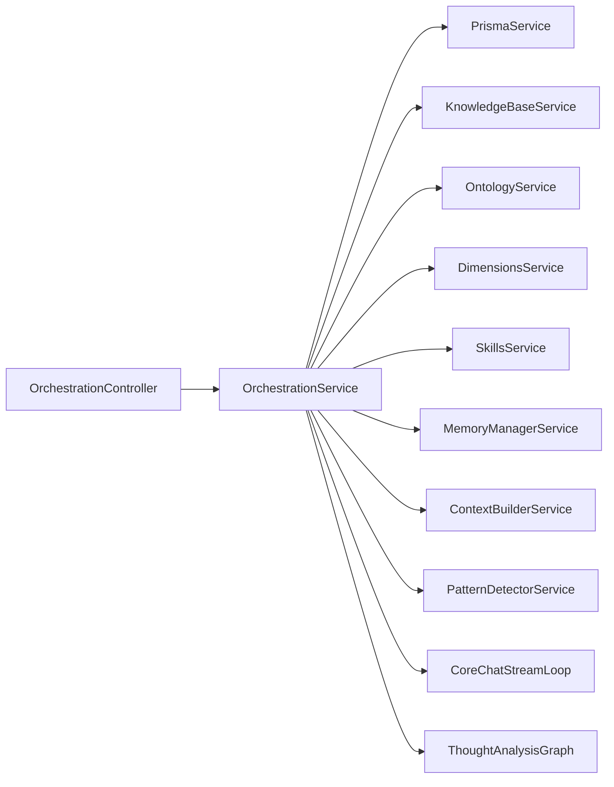

# Core Features

<cite>
**Referenced Files in This Document**
- [app.module.ts](file://backend/src/app.module.ts)
- [main.ts](file://backend/src/main.ts)
- [schema.prisma](file://backend/prisma/schema.prisma)
- [orchestration.controller.ts](file://backend/src/orchestration/orchestration.controller.ts)
- [orchestration.service.ts](file://backend/src/orchestration/orchestration.service.ts)
- [context-scope.ts](file://backend/src/orchestration/context-scope.ts)
- [personas.controller.ts](file://backend/src/personas/personas.controller.ts)
- [relationships.controller.ts](file://backend/src/relationships/relationships.controller.ts)
- [planner.controller.ts](file://backend/src/planner/planner.controller.ts)
- [messages.controller.ts](file://backend/src/messaging/messages.controller.ts)
- [MyCircle.tsx](file://frontend/src/pages/MyCircle.tsx)
- [core-chat-loop.ts](file://backend/src/orchestration/graph/core-chat-loop.ts)
- [thought-analysis.graph.ts](file://backend/src/orchestration/graph/thought-analysis.graph.ts)
- [CoreChat.tsx](file://frontend/src/pages/CoreChat.tsx)
- [orchestration.ts](file://frontend/src/api/orchestration.ts)
</cite>

## Update Summary
**Changes Made**
- Enhanced persona orchestration section to document new streaming ReAct loop capabilities
- Updated conversation management documentation to include comprehensive streaming chat orchestration
- Added detailed coverage of real-time thinking streams and tool activity indicators
- Expanded persona direct chat streaming capabilities with reasoning deltas
- Updated architecture diagrams to reflect streaming event-driven flows

## Table of Contents
1. [Introduction](#introduction)
2. [Project Structure](#project-structure)
3. [Core Components](#core-components)
4. [Architecture Overview](#architecture-overview)
5. [Detailed Component Analysis](#detailed-component-analysis)
6. [Dependency Analysis](#dependency-analysis)
7. [Performance Considerations](#performance-considerations)
8. [Troubleshooting Guide](#troubleshooting-guide)
9. [Conclusion](#conclusion)

## Introduction
This document explains the core features that define 4Ever as a personal AI life management system. It focuses on:
- Multi-persona thought analysis and persona orchestration with real-time streaming
- Semantic memory system and memory consolidation
- Relationship intelligence and the relationship circle
- Daily planning and task lifecycle
- Real-time communication with tri-chat mediator and streaming conversation management

These features integrate to form a cohesive platform where AI personas think alongside the user with real-time streaming feedback, memories inform decisions, relationships are tracked and nurtured, plans evolve dynamically, and conversations are supported by a mediator that surfaces actionable insights with immediate response streaming.

## Project Structure
At runtime, the backend composes a modular NestJS application with dedicated modules for each capability. The orchestration module coordinates persona orchestration, semantic memory, and contextual synthesis with streaming capabilities. Controllers expose REST endpoints under a single API namespace, with rate limiting and JWT authentication applied globally.

**Diagram sources**
- [app.module.ts:34-162](file://backend/src/app.module.ts#L34-L162)

**Section sources**
- [app.module.ts:34-162](file://backend/src/app.module.ts#L34-L162)
- [main.ts:24-125](file://backend/src/main.ts#L24-L125)

## Core Components
This section introduces the five pillars of 4Ever's personal AI life management with enhanced streaming capabilities:

- **Persona orchestration**: Multi-persona thought analysis, persona chat, and core chat with contextual synthesis and real-time streaming
- **Semantic memory**: Vector-backed memory storage, embeddings, and memory consolidation
- **Relationship intelligence**: Relationship circle, notes, life events, rituals, and tension tracking
- **Daily planning**: Day plans, tasks, completion stats, and insights
- **Real-time communication**: Direct messaging, tri-chat mediator, shared notes, and streaming conversation management

Each component is backed by strongly typed database models and exposed via REST endpoints with comprehensive streaming support. The orchestration layer ties them together by building context from user data and orchestrating persona responses with real-time feedback.

**Section sources**
- [schema.prisma:12-800](file://backend/prisma/schema.prisma#L12-L800)
- [orchestration.controller.ts:17-369](file://backend/src/orchestration/orchestration.controller.ts#L17-L369)
- [personas.controller.ts:17-56](file://backend/src/personas/personas.controller.ts#L17-L56)
- [relationships.controller.ts:18-92](file://backend/src/relationships/relationships.controller.ts#L18-L92)
- [planner.controller.ts:16-63](file://backend/src/planner/planner.controller.ts#L16-L63)
- [messages.controller.ts:21-227](file://backend/src/messaging/messages.controller.ts#L21-L227)

## Architecture Overview
The orchestration service compiles a LangGraph thought analysis pipeline and builds context from multiple domains (user profile, planner, mood, actions, memories, relationships, messaging, sessions). It supports streaming persona responses with real-time thinking indicators and tool activity monitoring, and provides comprehensive streaming capabilities for both persona-direct chat and core chat orchestration.

**Diagram sources**
- [orchestration.controller.ts:17-369](file://backend/src/orchestration/orchestration.controller.ts#L17-L369)
- [orchestration.service.ts:24-44](file://backend/src/orchestration/orchestration.service.ts#L24-L44)
- [core-chat-loop.ts:1-116](file://backend/src/orchestration/graph/core-chat-loop.ts#L1-L116)
- [thought-analysis.graph.ts:1-68](file://backend/src/orchestration/graph/thought-analysis.graph.ts#L1-L68)

**Section sources**
- [orchestration.service.ts:49-77](file://backend/src/orchestration/orchestration.service.ts#L49-L77)
- [orchestration.service.ts:576-610](file://backend/src/orchestration/orchestration.service.ts#L576-L610)
- [orchestration.service.ts:663-767](file://backend/src/orchestration/orchestration.service.ts#L663-L767)

## Detailed Component Analysis

### Enhanced Persona Orchestration with Streaming Capabilities
Persona orchestration powers multi-persona thought analysis and conversational AI with comprehensive streaming support. It builds rich context from user profile, planner, mood, completion stats, pending actions, memories, and optionally the relationship circle and life dimensions. It supports:

- **Analyze thought with multiple personas** - Real-time streaming with thinking indicators and tool activity monitoring
- **Reply to persona with streaming SSE** - Token-by-token delivery with thinking deltas and reasoning transparency
- **Quick chat with a persona** - Standard non-streaming responses for simple queries
- **Core chat with broader life context** - Advanced streaming orchestration with ReAct loop capabilities
- **Persona-direct chat with history** - Personalized streaming chat with conversation context and reasoning visibility

**Diagram sources**
- [orchestration.controller.ts:59-94](file://backend/src/orchestration/orchestration.controller.ts#L59-L94)
- [orchestration.service.ts:1338-1361](file://backend/src/orchestration/orchestration.service.ts#L1338-L1361)

**Updated** Enhanced with comprehensive streaming ReAct loop improvements including thinking deltas, tool activity monitoring, and real-time reasoning transparency.

Key implementation details:
- **StreamLoopConfig**: Defines streaming configuration with timeout handling and tool binding
- **StreamEvent interface**: Supports thinking, tool_start, tool_end, token, token_reset, response, and error events
- **Thinking deltas**: Real-time reasoning transparency with incremental thinking content streaming
- **Tool activity monitoring**: Live tool execution indicators with start/end notifications
- **Token streaming**: Progressive text delivery with automatic message composition
- **Timeout handling**: 300-second timeout protection with graceful error recovery

Practical workflows:
- **Multi-persona analysis**: Stream persona responses with real-time thinking indicators and tool activity
- **Interactive reasoning**: Observe AI reasoning process through thinking deltas during complex analysis
- **Real-time collaboration**: Monitor tool execution progress and receive immediate feedback on persona actions
- **Enhanced debugging**: Transparent reasoning process enables better understanding of AI decision-making

**Section sources**
- [core-chat-loop.ts:11-22](file://backend/src/orchestration/graph/core-chat-loop.ts#L11-L22)
- [core-chat-loop.ts:28-116](file://backend/src/orchestration/graph/core-chat-loop.ts#L28-L116)
- [orchestration.controller.ts:59-94](file://backend/src/orchestration/orchestration.controller.ts#L59-L94)
- [orchestration.controller.ts:228-257](file://backend/src/orchestration/orchestration.controller.ts#L228-L257)
- [orchestration.service.ts:1338-1361](file://backend/src/orchestration/orchestration.service.ts#L1338-L1361)
- [orchestration.service.ts:2516-2636](file://backend/src/orchestration/orchestration.service.ts#L2516-L2636)

### Semantic Memory System
The semantic memory system stores memories with embeddings, confidence, strength, and entity/link metadata. It supports:
- Listing and searching memories
- Creating, updating, and deleting memories
- Consolidating memories and computing stats
- Access tracking and reinforcement

**Diagram sources**
- [schema.prisma:179-222](file://backend/prisma/schema.prisma#L179-L222)

Practical workflows:
- Memory dashboard: Browse memories by status, type, and source.
- Search: Find relevant memories using vector similarity and metadata filters.
- Consolidation: Periodically consolidate overlapping or outdated memories.

**Section sources**
- [schema.prisma:179-222](file://backend/prisma/schema.prisma#L179-L222)
- [orchestration.controller.ts:277-343](file://backend/src/orchestration/orchestration.controller.ts#L277-L343)
- [orchestration.service.ts:516-569](file://backend/src/orchestration/orchestration.service.ts#L516-L569)

### Relationship Intelligence and Relationship Circle
Relationship intelligence tracks people in the user's circle, notes, life events, rituals, and tensions. It surfaces drift warnings, overdue rituals, and upcoming events to help maintain relationships proactively.

**Diagram sources**
- [schema.prisma:442-540](file://backend/prisma/schema.prisma#L442-L540)

Frontend integration:
- The MyCircle page aggregates tabs for rituals, life events, tensions, graph, and annual review, integrating with relationship APIs.

**Section sources**
- [relationships.controller.ts:18-92](file://backend/src/relationships/relationships.controller.ts#L18-L92)
- [schema.prisma:442-540](file://backend/prisma/schema.prisma#L442-L540)
- [MyCircle.tsx:1-27](file://frontend/src/pages/MyCircle.tsx#L1-L27)

### Daily Planning
Daily planning centers around day plans and tasks with status tracking, completion insights, and lifecycle updates.

**Diagram sources**
- [schema.prisma:270-298](file://backend/prisma/schema.prisma#L270-L298)

Practical workflows:
- Create or update a plan for a given date.
- Toggle task statuses and receive insights.
- Review completion stats over time.

**Section sources**
- [planner.controller.ts:16-63](file://backend/src/planner/planner.controller.ts#L16-L63)
- [schema.prisma:270-298](file://backend/prisma/schema.prisma#L270-L298)

### Enhanced Real-Time Communication with Streaming Management
Real-time communication includes direct messaging, reactions, shared notes, and tri-chat mediator sessions with comprehensive streaming capabilities. The mediator can propose actions and agreements, sessions can be summarized and managed, and all conversations support real-time streaming with thinking indicators.

**Diagram sources**
- [messages.controller.ts:21-227](file://backend/src/messaging/messages.controller.ts#L21-L227)

**Updated** Enhanced with comprehensive streaming capabilities including thinking deltas, tool activity monitoring, and real-time reasoning transparency for all conversation management features.

Practical workflows:
- Start or manage tri-chat sessions with a mediator and real-time streaming feedback.
- Clear history (one-sided) to reset continuity while preserving the other user's view.
- Rename the mediator and accept proposed actions with immediate response streaming.
- Monitor tool execution progress and receive live feedback on mediator actions.

**Section sources**
- [messages.controller.ts:121-227](file://backend/src/messaging/messages.controller.ts#L121-L227)

## Dependency Analysis
The orchestration module depends on several specialized services to assemble context and drive persona orchestration with streaming capabilities. The controller enforces rate limits and quotas, and the service orchestrates context building, streaming, and real-time event emission.

**Diagram sources**
- [orchestration.controller.ts:17-369](file://backend/src/orchestration/orchestration.controller.ts#L17-L369)
- [orchestration.service.ts:24-44](file://backend/src/orchestration/orchestration.service.ts#L24-L44)
- [core-chat-loop.ts:1-116](file://backend/src/orchestration/graph/core-chat-loop.ts#L1-L116)
- [thought-analysis.graph.ts:1-68](file://backend/src/orchestration/graph/thought-analysis.graph.ts#L1-L68)

**Section sources**
- [orchestration.service.ts:24-44](file://backend/src/orchestration/orchestration.service.ts#L24-L44)
- [orchestration.controller.ts:17-369](file://backend/src/orchestration/orchestration.controller.ts#L17-L369)

## Performance Considerations
- **Streaming optimization**: SSE streaming is configured to bypass compression to preserve real-time delivery with thinking deltas and tool activity monitoring.
- **Rate limiting**: Throttler buckets protect LLM-heavy endpoints; usage quotas guard per-user spending with streaming endpoints included.
- **Embeddings**: Vector similarity queries leverage PostgreSQL vector extension for efficient retrieval.
- **Parallel context loading**: Many context sources are fetched concurrently to reduce latency, especially important for streaming performance.
- **Timeout management**: 300-second timeout protection ensures streaming responses don't hang indefinitely.
- **Event buffering**: Frontend implements robust SSE parsing with buffer management for reliable streaming delivery.

## Troubleshooting Guide
Common issues and remedies:
- **Authentication failures**: Ensure JWT guard is applied and tokens are valid for streaming endpoints.
- **Quota exceeded**: Usage quotas throttle requests; reduce frequency or upgrade, including streaming endpoint usage.
- **Missing embeddings**: Vector similarity requires embeddings; regenerate if missing.
- **Streaming errors**: Controller emits a final SSE event on error and closes the stream gracefully.
- **Timeout issues**: 300-second timeout indicates slow LLM responses or network issues; retry with simpler queries.
- **Parsing failures**: Frontend implements robust SSE parsing with error handling for malformed lines.

**Section sources**
- [main.ts:90-94](file://backend/src/main.ts#L90-L94)
- [orchestration.controller.ts:67-94](file://backend/src/orchestration/orchestration.controller.ts#L67-L94)
- [orchestration.controller.ts:143-152](file://backend/src/orchestration/orchestration.controller.ts#L143-L152)

## Conclusion
4Ever's core features form a tightly integrated personal AI life management system with comprehensive streaming capabilities. Persona orchestration thinks deeply with the user through real-time streaming feedback, semantic memory remembers and consolidates experiences, relationship intelligence keeps bonds strong, daily planning adapts to progress, and real-time communication is empowered by a mediator with immediate response streaming. The enhanced streaming ReAct loop improvements provide unprecedented transparency into AI reasoning processes, while comprehensive tool activity monitoring enhances user trust and understanding. Together, they create a responsive, evolving companion for everyday life with immediate, transparent, and highly interactive AI assistance.