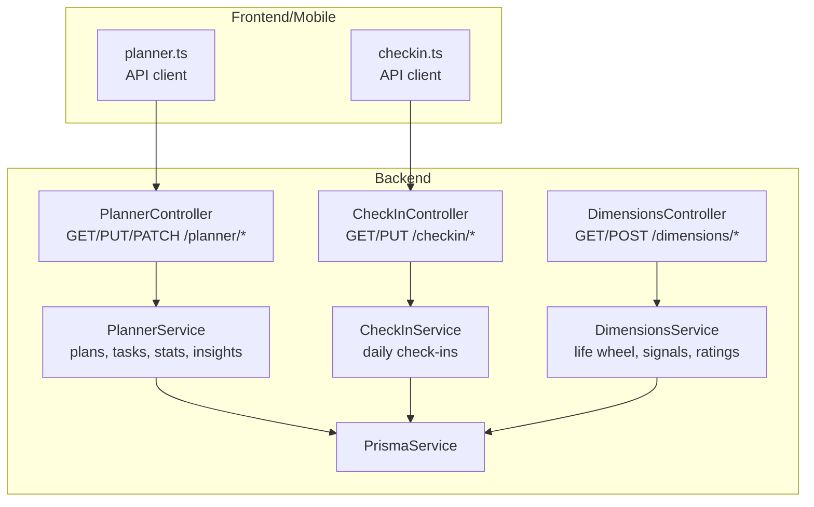
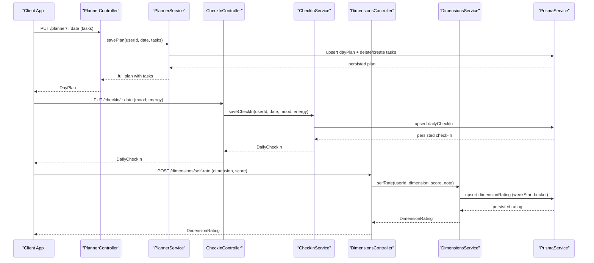
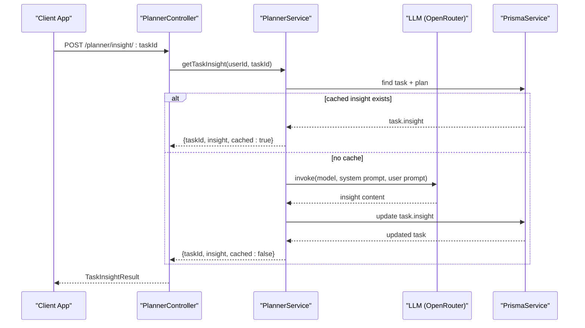
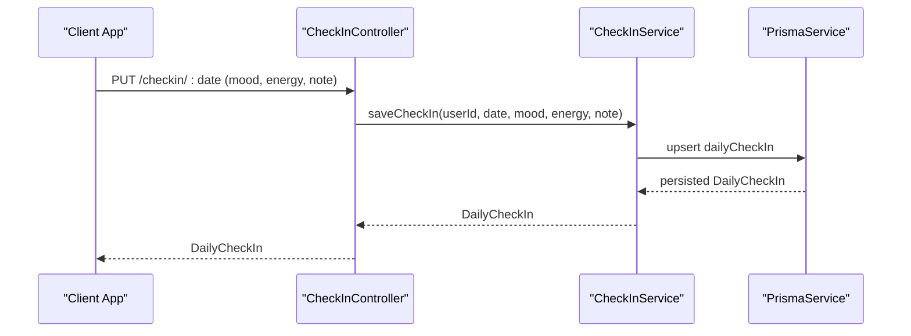
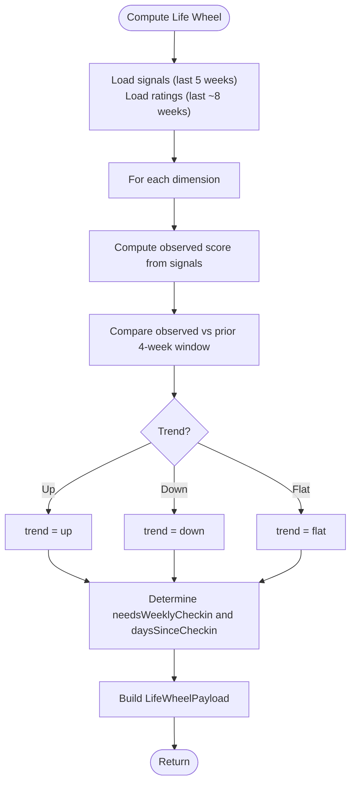
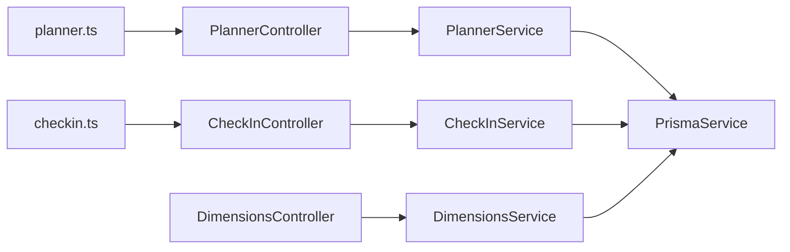

# Daily Planning & Organization

<cite>
**Referenced Files in This Document**
- [planner.controller.ts](file://backend/src/planner/planner.controller.ts)
- [planner.service.ts](file://backend/src/planner/planner.service.ts)
- [planner.ts](file://frontend/src/api/planner.ts)
- [checkin.controller.ts](file://backend/src/checkin/checkin.controller.ts)
- [checkin.service.ts](file://backend/src/checkin/checkin.service.ts)
- [checkin.ts](file://frontend/src/api/checkin.ts)
- [dimensions.controller.ts](file://backend/src/dimensions/dimensions.controller.ts)
- [dimensions.service.ts](file://backend/src/dimensions/dimensions.service.ts)
- [dimension.constants.ts](file://backend/src/dimensions/dimension.constants.ts)
- [self-rate-dimension.dto.ts](file://backend/src/dimensions/dto/self-rate-dimension.dto.ts)
- [weekly-checkin.dto.ts](file://backend/src/dimensions/dto/weekly-checkin.dto.ts)
- [link-to-planner.dto.ts](file://backend/src/actions/dto/link-to-planner.dto.ts)
</cite>

## Table of Contents
1. [Introduction](#introduction)
2. [Project Structure](#project-structure)
3. [Core Components](#core-components)
4. [Architecture Overview](#architecture-overview)
5. [Detailed Component Analysis](#detailed-component-analysis)
6. [Dependency Analysis](#dependency-analysis)
7. [Performance Considerations](#performance-considerations)
8. [Troubleshooting Guide](#troubleshooting-guide)
9. [Conclusion](#conclusion)
10. [Appendices](#appendices)

## Introduction
This document explains the daily planning and organization features of the platform, focusing on:
- Day planner: creation, editing, and completion tracking of daily plans and tasks
- Habit tracking and goal management: completion statistics, streaks, and task status updates
- Mood tracking: daily check-ins with mood and energy levels
- Weekly check-ins and life dimension assessment: six-dimensional radar, observed and self-rated scores, trends, and nudges
- AI insights and recommendations: LLM-powered task workflow breakdowns
- API endpoints for planner operations, check-in management, and dimension ratings
- Integration points with external systems and notification scheduling

## Project Structure
The planning and organization features span backend NestJS modules and frontend/mobile API clients:
- Planner module: controller, service, and client bindings
- Check-in module: controller, service, and client bindings
- Dimensions module: controller, service, constants, and DTOs
- Actions module: DTOs enabling linking external items to planner entries

**Diagram sources**
- [planner.controller.ts:16-62](file://backend/src/planner/planner.controller.ts#L16-L62)
- [planner.service.ts:26-266](file://backend/src/planner/planner.service.ts#L26-L266)
- [checkin.controller.ts:15-47](file://backend/src/checkin/checkin.controller.ts#L15-L47)
- [checkin.service.ts:6-74](file://backend/src/checkin/checkin.service.ts#L6-L74)
- [dimensions.controller.ts:15-54](file://backend/src/dimensions/dimensions.controller.ts#L15-L54)
- [dimensions.service.ts:31-310](file://backend/src/dimensions/dimensions.service.ts#L31-L310)
- [planner.ts:40-70](file://frontend/src/api/planner.ts#L40-L70)
- [checkin.ts:11-26](file://frontend/src/api/checkin.ts#L11-L26)

**Section sources**
- [planner.controller.ts:16-62](file://backend/src/planner/planner.controller.ts#L16-L62)
- [checkin.controller.ts:15-47](file://backend/src/checkin/checkin.controller.ts#L15-L47)
- [dimensions.controller.ts:15-54](file://backend/src/dimensions/dimensions.controller.ts#L15-L54)
- [planner.ts:40-70](file://frontend/src/api/planner.ts#L40-L70)
- [checkin.ts:11-26](file://frontend/src/api/checkin.ts#L11-L26)

## Core Components
- Planner: manage daily plans and tasks, completion stats, and AI-driven insights
- Check-in: capture daily mood and energy levels with recent history
- Dimensions: six-dimensional life wheel with observed and self-rated scores, trends, and nudges
- Actions: link external items to planner entries (e.g., calendar events)

Key capabilities:
- Create or replace a day plan with ordered tasks
- Update task status (done/skipped/pending) and track completion streaks
- Generate AI-powered task insights and cache them
- Record passive signals and derive observed dimension scores
- Weekly self-ratings and bulk weekly check-in
- Retrieve life wheel, dimension histories, and details

**Section sources**
- [planner.service.ts:44-213](file://backend/src/planner/planner.service.ts#L44-L213)
- [checkin.service.ts:13-72](file://backend/src/checkin/checkin.service.ts#L13-L72)
- [dimensions.service.ts:126-291](file://backend/src/dimensions/dimensions.service.ts#L126-L291)
- [link-to-planner.dto.ts:1-12](file://backend/src/actions/dto/link-to-planner.dto.ts#L1-L12)

## Architecture Overview
The system integrates planner, check-in, and dimensions modules with a shared persistence layer. Planner and check-in emit domain-specific events for downstream synthesis and recommendations. Dimensions aggregates passive signals and self-ratings to produce a life wheel and trend analytics.

**Diagram sources**
- [planner.controller.ts:40-47](file://backend/src/planner/planner.controller.ts#L40-L47)
- [planner.service.ts:90-142](file://backend/src/planner/planner.service.ts#L90-L142)
- [checkin.controller.ts:33-46](file://backend/src/checkin/checkin.controller.ts#L33-L46)
- [checkin.service.ts:13-47](file://backend/src/checkin/checkin.service.ts#L13-L47)
- [dimensions.controller.ts:26-35](file://backend/src/dimensions/dimensions.controller.ts#L26-L35)
- [dimensions.service.ts:41-58](file://backend/src/dimensions/dimensions.service.ts#L41-L58)

## Detailed Component Analysis

### Planner Module
The planner enables daily planning, task management, and AI-powered insights.

- Endpoints
  - GET /planner/dates/:year/:month → planned dates with task counts
  - GET /planner/stats?days=7 → completion stats and streak
  - GET /planner/:date → day plan with tasks
  - PUT /planner/:date → save plan (replaces all tasks)
  - POST /planner/insight/:taskId → generate AI insight for a task
  - PATCH /planner/task/:taskId/status → update task status

- Data model highlights
  - DayPlan: unique per user-date
  - PlanTask: ordered by sortOrder, supports status and cached insight

- AI insights pipeline
  - Validates ownership
  - Returns cached insight if present
  - Otherwise queries LLM with a structured prompt and caches the result

**Diagram sources**
- [planner.controller.ts:49-52](file://backend/src/planner/planner.controller.ts#L49-L52)
- [planner.service.ts:219-264](file://backend/src/planner/planner.service.ts#L219-L264)

- Example workflows
  - Daily planning: fetch plan for a date, update tasks, save plan, then update task statuses
  - Habit formation: monitor completion stats and streaks over N-day windows
  - Dimension alignment: link planner tasks to dimension signals via actions (see Actions section)

**Section sources**
- [planner.controller.ts:21-61](file://backend/src/planner/planner.controller.ts#L21-L61)
- [planner.service.ts:44-213](file://backend/src/planner/planner.service.ts#L44-L213)
- [planner.ts:40-70](file://frontend/src/api/planner.ts#L40-L70)

### Check-in Module
Daily mood and energy tracking with recent history retrieval.

- Endpoints
  - GET /checkin/recent?days=14 → recent check-ins
  - GET /checkin/:date → check-in for a specific date
  - PUT /checkin/:date → save or update mood and energy

- Behavior
  - Upserts daily check-in with note support
  - Emits an event for emotional input synthesis

**Diagram sources**
- [checkin.controller.ts:33-46](file://backend/src/checkin/checkin.controller.ts#L33-L46)
- [checkin.service.ts:13-47](file://backend/src/checkin/checkin.service.ts#L13-L47)

**Section sources**
- [checkin.controller.ts:20-46](file://backend/src/checkin/checkin.controller.ts#L20-L46)
- [checkin.service.ts:13-72](file://backend/src/checkin/checkin.service.ts#L13-L72)
- [checkin.ts:11-26](file://frontend/src/api/checkin.ts#L11-L26)

### Dimensions Module
Six-dimensional life wheel with observed and self-rated scores, trends, and nudges.

- Dimensions
  - Health, Financial, Career, Intellectual, Relationships, Purpose

- Endpoints
  - GET /dimensions → life wheel payload (current week, needs weekly check-in, days since checkin)
  - POST /dimensions/self-rate → self-rate a single dimension
  - POST /dimensions/weekly-checkin → self-rate all dimensions in one call
  - GET /dimensions/:dim/history → 12-week trend
  - GET /dimensions/:dim/detail → recent signals and latest self rating

- Data aggregation
  - Observed score computed from passive signals with a 4-week decaying window
  - Trend compared against a prior 4-week window
  - Weekly check-in window anchored to week start (Monday)

**Diagram sources**
- [dimensions.service.ts:126-198](file://backend/src/dimensions/dimensions.service.ts#L126-L198)
- [dimension.constants.ts:59-73](file://backend/src/dimensions/dimension.constants.ts#L59-L73)

**Section sources**
- [dimensions.controller.ts:20-53](file://backend/src/dimensions/dimensions.controller.ts#L20-L53)
- [dimensions.service.ts:126-291](file://backend/src/dimensions/dimensions.service.ts#L126-L291)
- [dimension.constants.ts:1-74](file://backend/src/dimensions/dimension.constants.ts#L1-L74)

### Actions Module (Integration Point)
Link external items to planner entries to align activities with daily plans.

- DTO
  - LinkToPlannerDto: date and timeSlot for planner linkage

- Use cases
  - Calendar events → planner tasks
  - External reminders → planner tasks
  - Notifications → planner tasks

**Section sources**
- [link-to-planner.dto.ts:1-12](file://backend/src/actions/dto/link-to-planner.dto.ts#L1-L12)

## Dependency Analysis
- Planner depends on Prisma for persistence and emits domain events for synthesis
- Check-in persists daily metrics and emits emotional input events
- Dimensions aggregates signals and ratings to produce life wheel analytics
- Frontend/mobile clients consume typed APIs for planner and check-in operations

**Diagram sources**
- [planner.ts:40-70](file://frontend/src/api/planner.ts#L40-L70)
- [checkin.ts:11-26](file://frontend/src/api/checkin.ts#L11-L26)
- [planner.controller.ts:16-62](file://backend/src/planner/planner.controller.ts#L16-L62)
- [checkin.controller.ts:15-47](file://backend/src/checkin/checkin.controller.ts#L15-L47)
- [dimensions.controller.ts:15-54](file://backend/src/dimensions/dimensions.controller.ts#L15-L54)
- [planner.service.ts:26-39](file://backend/src/planner/planner.service.ts#L26-L39)
- [checkin.service.ts:6-11](file://backend/src/checkin/checkin.service.ts#L6-L11)
- [dimensions.service.ts:31-35](file://backend/src/dimensions/dimensions.service.ts#L31-L35)

**Section sources**
- [planner.service.ts:26-39](file://backend/src/planner/planner.service.ts#L26-L39)
- [checkin.service.ts:6-11](file://backend/src/checkin/checkin.service.ts#L6-L11)
- [dimensions.service.ts:31-35](file://backend/src/dimensions/dimensions.service.ts#L31-L35)

## Performance Considerations
- Planner
  - Batch operations: saving a plan replaces all tasks for the date, minimizing partial updates
  - Insight caching: avoids repeated LLM calls for the same task
  - Stats computation: O(N) over plans/tasks within the selected window
- Dimensions
  - Aggregation uses two queries (signals and ratings) with bounded windows
  - Trend comparison uses fixed-size windows for stability
- Check-in
  - Upsert pattern minimizes write conflicts
  - Recent history query bounds the date range

[No sources needed since this section provides general guidance]

## Troubleshooting Guide
- Planner
  - Task not found: updating status requires ownership verification; ensure the taskId belongs to the requesting user
  - Insight generation: if cached insight is missing, LLM invocation occurs; verify API keys and model configuration
- Check-in
  - Validation errors: mood and energy must be within 1–5; note is optional
- Dimensions
  - Unknown dimension: only predefined dimensions are accepted
  - Rating normalization: scores are clamped to integers in [1, 10]
  - History and detail queries require a valid dimension code

**Section sources**
- [planner.service.ts:147-172](file://backend/src/planner/planner.service.ts#L147-L172)
- [checkin.service.ts:13-47](file://backend/src/checkin/checkin.service.ts#L13-L47)
- [dimensions.service.ts:41-86](file://backend/src/dimensions/dimensions.service.ts#L41-L86)
- [self-rate-dimension.dto.ts:4-16](file://backend/src/dimensions/dto/self-rate-dimension.dto.ts#L4-L16)
- [weekly-checkin.dto.ts:8-15](file://backend/src/dimensions/dto/weekly-checkin.dto.ts#L8-L15)

## Conclusion
The platform provides a cohesive system for daily planning, habit tracking, mood monitoring, and weekly life dimension assessment. AI insights enhance task execution, while passive signals and self-ratings inform a dynamic life wheel. The modular backend and typed frontend APIs enable scalable integrations and reliable workflows.

[No sources needed since this section summarizes without analyzing specific files]

## Appendices

### API Reference: Planner Operations
- GET /planner/dates/:year/:month
  - Returns planned dates with task counts for calendar rendering
- GET /planner/stats?days=N
  - Returns completion stats and streak over N days
- GET /planner/:date
  - Returns day plan with tasks ordered by sort index
- PUT /planner/:date
  - Body: array of tasks with timeSlot, task, sortOrder; replaces all tasks for the date
- POST /planner/insight/:taskId
  - Generates and caches an AI-powered workflow for the task
- PATCH /planner/task/:taskId/status
  - Updates task status to done, skipped, or pending

**Section sources**
- [planner.controller.ts:21-61](file://backend/src/planner/planner.controller.ts#L21-L61)
- [planner.ts:40-70](file://frontend/src/api/planner.ts#L40-L70)

### API Reference: Check-in Management
- GET /checkin/recent?days=N
  - Returns recent check-ins over N days
- GET /checkin/:date
  - Returns the check-in for a specific date
- PUT /checkin/:date
  - Body: mood (1–5), energy (1–5), note (optional)

**Section sources**
- [checkin.controller.ts:20-46](file://backend/src/checkin/checkin.controller.ts#L20-L46)
- [checkin.ts:11-26](file://frontend/src/api/checkin.ts#L11-L26)

### API Reference: Dimension Ratings
- GET /dimensions
  - Returns life wheel payload: dimensions, weekStart, needsWeeklyCheckin, daysSinceCheckin
- POST /dimensions/self-rate
  - Body: dimension, score (1–10), note (optional)
- POST /dimensions/weekly-checkin
  - Body: ratings (object with dimension -> score), note (optional)
- GET /dimensions/:dim/history
  - Returns 12 weeks of observed and self scores
- GET /dimensions/:dim/detail
  - Returns recent signals and latest self rating

**Section sources**
- [dimensions.controller.ts:20-53](file://backend/src/dimensions/dimensions.controller.ts#L20-L53)
- [self-rate-dimension.dto.ts:4-16](file://backend/src/dimensions/dto/self-rate-dimension.dto.ts#L4-L16)
- [weekly-checkin.dto.ts:8-15](file://backend/src/dimensions/dto/weekly-checkin.dto.ts#L8-L15)

### Integration Notes
- External calendar systems
  - Link calendar events to planner via Actions DTO (date and timeSlot)
  - Use planner endpoints to synchronize tasks and adjust plans accordingly
- Notification scheduling
  - Combine planner task deadlines with check-in reminders and weekly check-in nudges
  - Use Dimensions service to detect when a weekly check-in is overdue and surface nudges

[No sources needed since this section provides general guidance]