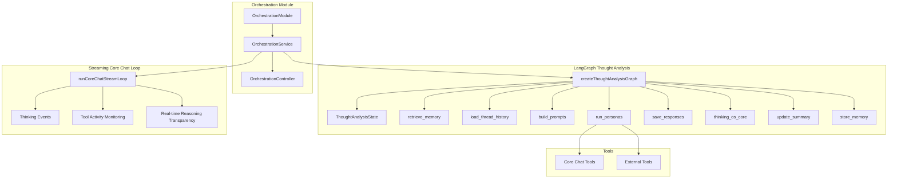
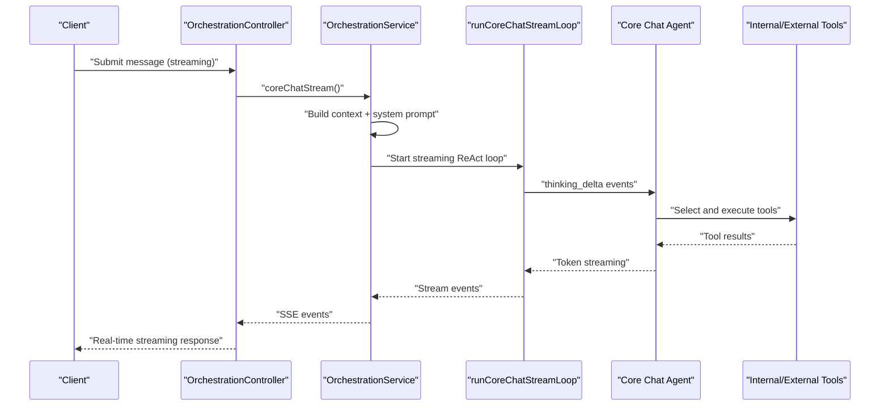
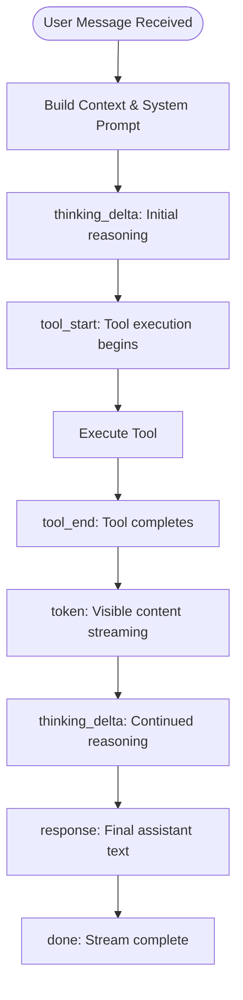
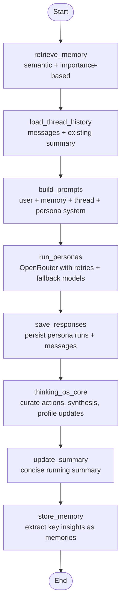
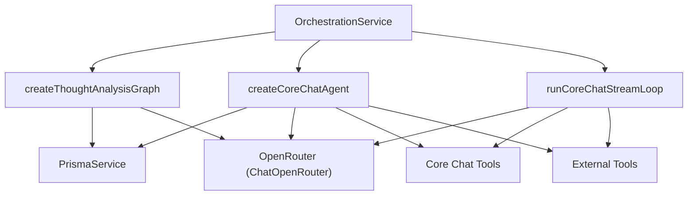

# AI Agent Orchestration

<cite>
**Referenced Files in This Document**
- [orchestration.module.ts](file://backend/src/orchestration/orchestration.module.ts)
- [orchestration.service.ts](file://backend/src/orchestration/orchestration.service.ts)
- [orchestration.controller.ts](file://backend/src/orchestration/orchestration.controller.ts)
- [thought-analysis.graph.ts](file://backend/src/orchestration/graph/thought-analysis.graph.ts)
- [state.ts](file://backend/src/orchestration/graph/state.ts)
- [core-chat-agent.ts](file://backend/src/orchestration/graph/core-chat-agent.ts)
- [core-chat-loop.ts](file://backend/src/orchestration/graph/core-chat-loop.ts)
- [retrieve-memory.node.ts](file://backend/src/orchestration/graph/nodes/retrieve-memory.node.ts)
- [load-thread-history.node.ts](file://backend/src/orchestration/graph/nodes/load-thread-history.node.ts)
- [build-prompts.node.ts](file://backend/src/orchestration/graph/nodes/build-prompts.node.ts)
- [run-personas.node.ts](file://backend/src/orchestration/graph/nodes/run-personas.node.ts)
- [save-responses.node.ts](file://backend/src/orchestration/graph/nodes/save-responses.node.ts)
- [thinking-os-core.node.ts](file://backend/src/orchestration/graph/nodes/thinking-os-core.node.ts)
- [update-summary.node.ts](file://backend/src/orchestration/graph/nodes/update-summary.node.ts)
- [store-memory.node.ts](file://backend/src/orchestration/graph/nodes/store-memory.node.ts)
- [core-chat-tools.ts](file://backend/src/orchestration/graph/tools/core-chat-tools.ts)
- [external-tools.ts](file://backend/src/orchestration/graph/tools/external-tools.ts)
</cite>

## Update Summary
**Changes Made**
- Added comprehensive documentation for the new streaming chat loop system with real-time reasoning transparency
- Updated Core Chat architecture to include thinking deltas, tool activity monitoring, and streaming ReAct capabilities
- Enhanced tool execution framework with detailed event streaming and error handling
- Updated pending action creation functionality to reflect temporary disablement due to AgentActionsModule removal
- Expanded performance considerations to include streaming optimizations and real-time feedback mechanisms

## Table of Contents
1. [Introduction](#introduction)
2. [Project Structure](#project-structure)
3. [Core Components](#core-components)
4. [Architecture Overview](#architecture-overview)
5. [Streaming Chat Loop System](#streaming-chat-loop-system)
6. [Detailed Component Analysis](#detailed-component-analysis)
7. [Dependency Analysis](#dependency-analysis)
8. [Performance Considerations](#performance-considerations)
9. [Troubleshooting Guide](#troubleshooting-guide)
10. [Conclusion](#conclusion)

## Introduction
This document explains the AI agent orchestration system built with LangGraph, featuring a revolutionary streaming chat loop system. It covers the LangGraph-based agent architecture, tool execution framework, and conversational flow management with real-time reasoning transparency. It documents the agent's decision-making process, tool selection logic, and response generation pipeline with streaming capabilities. It also details the available tools (web search, document reading, analysis, and content generation), provides examples of agent conversations and tool chaining patterns, and addresses performance optimization, rate limiting, and cost management for external API usage.

## Project Structure
The orchestration system lives under backend/src/orchestration and is organized into:
- Graph definition and state machine
- Nodes implementing the thought analysis workflow
- Tools enabling internal and external capabilities
- Streaming chat loop system with real-time reasoning transparency
- Service orchestrating persona and core chat flows

**Diagram sources**
- [orchestration.module.ts:11-17](file://backend/src/orchestration/orchestration.module.ts#L11-L17)
- [orchestration.service.ts:46-74](file://backend/src/orchestration/orchestration.service.ts#L46-L74)
- [orchestration.controller.ts:17-24](file://backend/src/orchestration/orchestration.controller.ts#L17-L24)
- [thought-analysis.graph.ts:29-67](file://backend/src/orchestration/graph/thought-analysis.graph.ts#L29-L67)
- [core-chat-loop.ts:1-194](file://backend/src/orchestration/graph/core-chat-loop.ts#L1-L194)

**Section sources**
- [orchestration.module.ts:1-18](file://backend/src/orchestration/orchestration.module.ts#L1-L18)
- [orchestration.service.ts:46-74](file://backend/src/orchestration/orchestration.service.ts#L46-L74)
- [orchestration.controller.ts:17-24](file://backend/src/orchestration/orchestration.controller.ts#L17-L24)

## Core Components
- Thought Analysis Graph: A linear LangGraph pipeline that retrieves memories, loads thread history, builds persona prompts, runs personas, saves responses, synthesizes with the Core agent, updates summaries, and stores new memories.
- Streaming Core Chat Loop: A real-time ReAct agent powered by OpenRouter with streaming capabilities, providing thinking deltas, tool activity monitoring, and transparent reasoning processes.
- Tool Ecosystem: Internal tools for action creation, thought creation, planner queries, profile updates, memory search, check-ins, relationship and messaging helpers, and external tools for web search, URL reading, weather, Wikipedia, and news.

**Section sources**
- [thought-analysis.graph.ts:15-67](file://backend/src/orchestration/graph/thought-analysis.graph.ts#L15-L67)
- [state.ts:88-177](file://backend/src/orchestration/graph/state.ts#L88-L177)
- [core-chat-agent.ts:18-41](file://backend/src/orchestration/graph/core-chat-agent.ts#L18-L41)
- [core-chat-loop.ts:1-194](file://backend/src/orchestration/graph/core-chat-loop.ts#L1-L194)
- [core-chat-tools.ts:14-20](file://backend/src/orchestration/graph/tools/core-chat-tools.ts#L14-L20)
- [external-tools.ts:12-12](file://backend/src/orchestration/graph/tools/external-tools.ts#L12-L12)

## Architecture Overview
The system composes two major flows with enhanced streaming capabilities:
- Persona Thought Analysis: A LangGraph pipeline that gathers context, builds persona prompts, executes multiple personas, curates synthesis, updates summaries, and extracts memories.
- Streaming Core Chat: A real-time ReAct agent that provides transparent reasoning, tool activity monitoring, and streaming responses with thinking deltas and live feedback.

**Diagram sources**
- [orchestration.controller.ts:123-152](file://backend/src/orchestration/orchestration.controller.ts#L123-L152)
- [orchestration.service.ts:1794-1960](file://backend/src/orchestration/orchestration.service.ts#L1794-L1960)
- [core-chat-loop.ts:28-116](file://backend/src/orchestration/graph/core-chat-loop.ts#L28-L116)

## Streaming Chat Loop System

### Real-time Reasoning Transparency
The new streaming chat loop provides unprecedented insight into the agent's decision-making process through structured event streaming:

**Diagram sources**
- [core-chat-loop.ts:28-116](file://backend/src/orchestration/graph/core-chat-loop.ts#L28-L116)
- [orchestration.service.ts:1794-1960](file://backend/src/orchestration/orchestration.service.ts#L1794-L1960)

### Event Stream Protocol
The streaming system emits structured events for real-time client-side rendering:

| Event Type | Data Payload | Purpose |
|------------|--------------|---------|
| `thinking_delta` | `{ text: string }` | Real-time reasoning tokens during thinking phase |
| `tool_start` | `{ name: string, args: any }` | Tool execution initiation with arguments |
| `tool_end` | `{ name: string, result?: string, error?: string }` | Tool completion with result or error |
| `token` | `{ text: string }` | Visible content token for streaming response |
| `token_reset` | `{}` | Reset signal for token streaming |
| `response` | `{ text: string }` | Final assistant response text |
| `error` | `{ message: string }` | Error condition with error message |

### Thinking Deltas and Tool Monitoring
The system provides granular visibility into agent processes:
- **Thinking Deltas**: Real-time streaming of reasoning tokens during the agent's deliberation phase
- **Tool Activity Monitoring**: Complete lifecycle tracking of tool executions with argument inspection
- **Real-time Reasoning Transparency**: Clients can render agent thinking processes as they unfold

**Section sources**
- [core-chat-loop.ts:19-22](file://backend/src/orchestration/graph/core-chat-loop.ts#L19-L22)
- [core-chat-loop.ts:59-96](file://backend/src/orchestration/graph/core-chat-loop.ts#L59-L96)
- [orchestration.service.ts:1914-1933](file://backend/src/orchestration/orchestration.service.ts#L1914-L1933)

## Detailed Component Analysis

### LangGraph Thought Analysis Pipeline
The pipeline is a linear chain of nodes that processes a user's thought through persona analysis and synthesis.

**Diagram sources**
- [thought-analysis.graph.ts:15-67](file://backend/src/orchestration/graph/thought-analysis.graph.ts#L15-L67)
- [retrieve-memory.node.ts:11-72](file://backend/src/orchestration/graph/nodes/retrieve-memory.node.ts#L11-L72)
- [load-thread-history.node.ts:9-28](file://backend/src/orchestration/graph/nodes/load-thread-history.node.ts#L9-L28)
- [build-prompts.node.ts:72-175](file://backend/src/orchestration/graph/nodes/build-prompts.node.ts#L72-L175)
- [run-personas.node.ts:80-125](file://backend/src/orchestration/graph/nodes/run-personas.node.ts#L80-L125)
- [save-responses.node.ts:12-41](file://backend/src/orchestration/graph/nodes/save-responses.node.ts#L12-L41)
- [thinking-os-core.node.ts:22-248](file://backend/src/orchestration/graph/nodes/thinking-os-core.node.ts#L22-L248)
- [update-summary.node.ts:10-93](file://backend/src/orchestration/graph/nodes/update-summary.node.ts#L10-L93)
- [store-memory.node.ts:14-111](file://backend/src/orchestration/graph/nodes/store-memory.node.ts#L14-L111)

#### Decision-Making and Tool Selection Logic
- Persona Thought Analysis: Deterministic linear flow driven by state transitions; no tool calls occur inside the graph nodes.
- Streaming Core Chat: Uses ReAct prompting with real-time streaming to decide tool usage based on user intent. Tools are bound to the current user context and invoked atomically with comprehensive monitoring.

**Section sources**
- [thought-analysis.graph.ts:15-67](file://backend/src/orchestration/graph/thought-analysis.graph.ts#L15-L67)
- [core-chat-agent.ts:18-41](file://backend/src/orchestration/graph/core-chat-agent.ts#L18-L41)
- [core-chat-loop.ts:28-116](file://backend/src/orchestration/graph/core-chat-loop.ts#L28-L116)

#### Response Generation Pipeline
- Persona responses are generated via OpenRouter with retry and fallback logic, then persisted and summarized.
- The Core node synthesizes insights, curates actions, and updates user profile fields.
- Streaming responses provide real-time content generation with thinking transparency.

**Section sources**
- [run-personas.node.ts:25-72](file://backend/src/orchestration/graph/nodes/run-personas.node.ts#L25-L72)
- [save-responses.node.ts:12-41](file://backend/src/orchestration/graph/nodes/save-responses.node.ts#L12-L41)
- [thinking-os-core.node.ts:22-248](file://backend/src/orchestration/graph/nodes/thinking-os-core.node.ts#L22-L248)
- [core-chat-loop.ts:59-96](file://backend/src/orchestration/graph/core-chat-loop.ts#L59-L96)

### Available Tools

#### Internal Tools (Core Chat)
- create_action: Create deduplicated action items with optional dimension and due date. **Note**: Pending action creation functionality is temporarily disabled due to AgentActionsModule removal.
- create_thought: Create a thought and initial thread/message; embeds thought content.
- update_profile: Append new information to user context fields.
- query_planner: Lookup daily plan for a date.
- trigger_persona_analysis: Trigger a persona to analyze a specific thought and return the full response verbatim.
- search_memories: Semantic memory search with fallback importance-based retrieval.
- create_checkin: Log mood/energy with optional note and date.
- search_relationships: Search Relationship Circle members by name/type/context.
- add_relationship_note: Log interaction notes with sentiment/topic and update interaction counters.
- suggest_conversation_starters: Generate personalized conversation starters using LLM.
- search_connections: List/search 4Ever connections.
- send_message: Send a direct message to a connected user.
- get_unread_messages: Summarize unread messages grouped by sender.

**Section sources**
- [core-chat-tools.ts:21-800](file://backend/src/orchestration/graph/tools/core-chat-tools.ts#L21-L800)

#### External Tools (Core Chat)
- web_search: Internet search via Tavily API with answer and sources.
- calculator: Evaluate mathematical expressions safely.
- url_reader: Extract readable content from URLs with direct fetch and Tavily fallback.
- weather: Current conditions and 3-day forecast for any location.
- wikipedia: Factual knowledge lookup with disambiguation support.
- news_search: Recent news articles via Tavily API.

**Section sources**
- [external-tools.ts:15-536](file://backend/src/orchestration/graph/tools/external-tools.ts#L15-L536)

### Conversational Examples and Tool Chaining Patterns

#### Example 1: Planning and Task Management
- User: "What's on my schedule for today?"
- Agent: Calls query_planner to retrieve tasks and returns a formatted list.

#### Example 2: Relationship Coaching
- User: "I want to talk to my partner about finances."
- Agent: Uses suggest_conversation_starters to generate warm, specific prompts based on relationship context and recent interactions.

#### Example 3: Research and Content Consumption
- User: "Can you read this article and summarize?"
- Agent: Uses url_reader to extract content, then synthesizes a summary.

#### Example 4: Knowledge Discovery
- User: "Tell me about compound interest."
- Agent: Uses wikipedia to retrieve a concise summary with links.

#### Example 5: Curated Action Items
- User: "I'm overwhelmed with work."
- Agent: After gathering persona insights, creates curated actions and updates profile context accordingly.

**Section sources**
- [core-chat-tools.ts:169-212](file://backend/src/orchestration/graph/tools/core-chat-tools.ts#L169-L212)
- [core-chat-tools.ts:594-681](file://backend/src/orchestration/graph/tools/core-chat-tools.ts#L594-L681)
- [external-tools.ts:15-95](file://backend/src/orchestration/graph/tools/external-tools.ts#L15-L95)
- [external-tools.ts:122-210](file://backend/src/orchestration/graph/tools/external-tools.ts#L122-L210)
- [external-tools.ts:267-321](file://backend/src/orchestration/graph/tools/external-tools.ts#L267-L321)

### Error Recovery Mechanisms
- LLM Failures: run_personas retries with exponential backoff and tries fallback models before failing gracefully.
- Semantic Memory Retrieval: Falls back to importance-based retrieval if vector search fails.
- Summary and Memory Extraction: Falls back to basic summaries and a default memory when LLM calls fail.
- External Tool Failures: Provides graceful error messages and suggests alternatives (e.g., Tavily fallback for URL reader).
- Streaming Errors: Comprehensive error handling with structured error events and fallback responses.

**Section sources**
- [run-personas.node.ts:25-72](file://backend/src/orchestration/graph/nodes/run-personas.node.ts#L25-L72)
- [retrieve-memory.node.ts:55-70](file://backend/src/orchestration/graph/nodes/retrieve-memory.node.ts#L55-L70)
- [update-summary.node.ts:75-91](file://backend/src/orchestration/graph/nodes/update-summary.node.ts#L75-L91)
- [store-memory.node.ts:94-111](file://backend/src/orchestration/graph/nodes/store-memory.node.ts#L94-L111)
- [external-tools.ts:136-191](file://backend/src/orchestration/graph/tools/external-tools.ts#L136-L191)
- [core-chat-loop.ts:104-114](file://backend/src/orchestration/graph/core-chat-loop.ts#L104-L114)

## Dependency Analysis
The orchestration service initializes the LangGraph and constructs the Core Chat agent per request with bound tools. The streaming loop system integrates seamlessly with the existing architecture while providing real-time capabilities. The graph nodes depend on Prisma for persistence and OpenRouter for LLM calls. Tools depend on internal services (Prisma, Dimensions) and external APIs (Tavily, OpenRouter, weather service).

**Diagram sources**
- [orchestration.service.ts:46-74](file://backend/src/orchestration/orchestration.service.ts#L46-L74)
- [core-chat-agent.ts:18-41](file://backend/src/orchestration/graph/core-chat-agent.ts#L18-L41)
- [core-chat-loop.ts:8-41](file://backend/src/orchestration/graph/core-chat-loop.ts#L8-L41)
- [thought-analysis.graph.ts:29-44](file://backend/src/orchestration/graph/thought-analysis.graph.ts#L29-L44)

**Section sources**
- [orchestration.service.ts:32-41](file://backend/src/orchestration/orchestration.service.ts#L32-L41)
- [core-chat-agent.ts:18-41](file://backend/src/orchestration/graph/core-chat-agent.ts#L18-L41)
- [core-chat-loop.ts:8-41](file://backend/src/orchestration/graph/core-chat-loop.ts#L8-L41)

## Performance Considerations
- Streaming and Timeouts: The service sets a streaming timeout for LLM fetch calls to prevent long-hanging requests.
- Vector Search Efficiency: Semantic memory retrieval uses composite scoring (similarity + importance + frequency + recency) and limits results to reduce latency.
- Retry and Backoff: LLM invocations use exponential backoff and fallback models to improve reliability under rate limits or transient errors.
- Prompt Size Control: Running summaries reduce context size for subsequent turns, lowering token usage and latency.
- Tool Parallelism: Core Chat tools are designed to be atomic and deterministic, minimizing overhead.
- Streaming Optimizations: Real-time event streaming minimizes client-server round trips and provides immediate feedback.
- Memory Management: Streaming responses are processed incrementally to reduce memory footprint during long conversations.

**Section sources**
- [orchestration.service.ts:43-44](file://backend/src/orchestration/orchestration.service.ts#L43-L44)
- [retrieve-memory.node.ts:24-40](file://backend/src/orchestration/graph/nodes/retrieve-memory.node.ts#L24-L40)
- [run-personas.node.ts:13-14](file://backend/src/orchestration/graph/nodes/run-personas.node.ts#L13-L14)
- [update-summary.node.ts:33-53](file://backend/src/orchestration/graph/nodes/update-summary.node.ts#L33-L53)
- [core-chat-loop.ts:28-116](file://backend/src/orchestration/graph/core-chat-loop.ts#L28-L116)

## Troubleshooting Guide
- Missing API Keys: If OPENROUTER_API_KEY is not set, persona responses will fail; TAVILY_API_KEY is required for web and news search.
- Rate Limits and Errors: LLM calls implement retry with exponential backoff; monitor logs for 429 or server errors.
- Memory Retrieval Failures: Vector search failures fall back to importance-based retrieval; verify embeddings exist.
- Tool Failures: External tools return explicit error messages; verify network connectivity and API quotas.
- Context Scope Mismatch: Core Chat context builders classify scopes (planner, life_review, memory_recall, relationship, messaging) to load only relevant context.
- Streaming Issues: Monitor SSE event delivery; check for network interruptions or client disconnections.
- Thinking Delta Problems: Ensure proper event handling for thinking_delta events in client implementations.

**Section sources**
- [orchestration.service.ts:56-61](file://backend/src/orchestration/orchestration.service.ts#L56-L61)
- [run-personas.node.ts:51-53](file://backend/src/orchestration/graph/nodes/run-personas.node.ts#L51-L53)
- [retrieve-memory.node.ts:51-53](file://backend/src/orchestration/graph/nodes/retrieve-memory.node.ts#L51-L53)
- [external-tools.ts:17-18](file://backend/src/orchestration/graph/tools/external-tools.ts#L17-L18)
- [orchestration.service.ts:660-696](file://backend/src/orchestration/orchestration.service.ts#L660-L696)
- [core-chat-loop.ts:104-114](file://backend/src/orchestration/graph/core-chat-loop.ts#L104-L114)

## Conclusion
The AI agent orchestration system combines a robust LangGraph pipeline for persona-driven thought analysis with a revolutionary streaming chat loop system featuring real-time reasoning transparency. The new streaming capabilities provide unprecedented insight into agent decision-making through structured event streaming, thinking deltas, and comprehensive tool activity monitoring. Its tool ecosystem integrates internal domain capabilities with external knowledge and computation, while built-in retry, fallback, and summarization mechanisms ensure reliability and performance. The addition of streaming ReAct capabilities with thinking transparency transforms conversational AI from opaque processing into a transparent, collaborative experience. By structuring flows around clear decision points and context-aware prompts with real-time feedback, the system supports deep, coherent conversations and actionable outcomes with complete reasoning visibility.