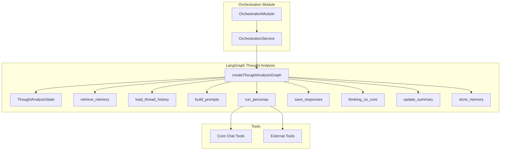
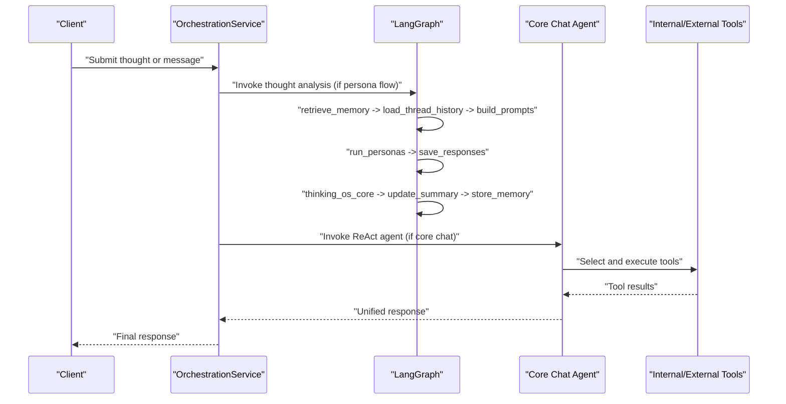
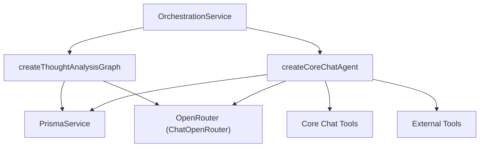

# AI Agent Orchestration

<cite>
**Referenced Files in This Document**
- [orchestration.module.ts](file://backend/src/orchestration/orchestration.module.ts)
- [orchestration.service.ts](file://backend/src/orchestration/orchestration.service.ts)
- [thought-analysis.graph.ts](file://backend/src/orchestration/graph/thought-analysis.graph.ts)
- [state.ts](file://backend/src/orchestration/graph/state.ts)
- [core-chat-agent.ts](file://backend/src/orchestration/graph/core-chat-agent.ts)
- [retrieve-memory.node.ts](file://backend/src/orchestration/graph/nodes/retrieve-memory.node.ts)
- [load-thread-history.node.ts](file://backend/src/orchestration/graph/nodes/load-thread-history.node.ts)
- [build-prompts.node.ts](file://backend/src/orchestration/graph/nodes/build-prompts.node.ts)
- [run-personas.node.ts](file://backend/src/orchestration/graph/nodes/run-personas.node.ts)
- [save-responses.node.ts](file://backend/src/orchestration/graph/nodes/save-responses.node.ts)
- [thinking-os-core.node.ts](file://backend/src/orchestration/graph/nodes/thinking-os-core.node.ts)
- [update-summary.node.ts](file://backend/src/orchestration/graph/nodes/update-summary.node.ts)
- [store-memory.node.ts](file://backend/src/orchestration/graph/nodes/store-memory.node.ts)
- [core-chat-tools.ts](file://backend/src/orchestration/graph/tools/core-chat-tools.ts)
- [external-tools.ts](file://backend/src/orchestration/graph/tools/external-tools.ts)
</cite>

## Table of Contents
1. [Introduction](#introduction)
2. [Project Structure](#project-structure)
3. [Core Components](#core-components)
4. [Architecture Overview](#architecture-overview)
5. [Detailed Component Analysis](#detailed-component-analysis)
6. [Dependency Analysis](#dependency-analysis)
7. [Performance Considerations](#performance-considerations)
8. [Troubleshooting Guide](#troubleshooting-guide)
9. [Conclusion](#conclusion)

## Introduction
This document explains the AI agent orchestration system built with LangGraph. It covers the LangGraph-based agent architecture, tool execution framework, and conversational flow management. It documents the agent’s decision-making process, tool selection logic, and response generation pipeline. It also details the available tools (web search, document reading, analysis, and content generation), provides examples of agent conversations and tool chaining patterns, and addresses performance optimization, rate limiting, and cost management for external API usage.

## Project Structure
The orchestration system lives under backend/src/orchestration and is organized into:
- Graph definition and state machine
- Nodes implementing the thought analysis workflow
- Tools enabling internal and external capabilities
- Service orchestrating persona and core chat flows

**Diagram sources**
- [orchestration.module.ts:11-17](file://backend/src/orchestration/orchestration.module.ts#L11-L17)
- [orchestration.service.ts:46-74](file://backend/src/orchestration/orchestration.service.ts#L46-L74)
- [thought-analysis.graph.ts:29-67](file://backend/src/orchestration/graph/thought-analysis.graph.ts#L29-L67)
- [state.ts:88-177](file://backend/src/orchestration/graph/state.ts#L88-L177)
- [core-chat-tools.ts:14-20](file://backend/src/orchestration/graph/tools/core-chat-tools.ts#L14-L20)
- [external-tools.ts:12-12](file://backend/src/orchestration/graph/tools/external-tools.ts#L12-L12)

**Section sources**
- [orchestration.module.ts:1-18](file://backend/src/orchestration/orchestration.module.ts#L1-L18)
- [orchestration.service.ts:46-74](file://backend/src/orchestration/orchestration.service.ts#L46-L74)

## Core Components
- Thought Analysis Graph: A linear LangGraph pipeline that retrieves memories, loads thread history, builds persona prompts, runs personas, saves responses, synthesizes with the Core agent, updates summaries, and stores new memories.
- Core Chat Agent: A ReAct agent powered by OpenRouter, equipped with internal and external tools for planning, relationship management, messaging, web search, calculation, and more.
- Tool Ecosystem: Internal tools for action creation, thought creation, planner queries, profile updates, memory search, check-ins, relationship and messaging helpers, and external tools for web search, URL reading, weather, Wikipedia, and news.

**Section sources**
- [thought-analysis.graph.ts:15-67](file://backend/src/orchestration/graph/thought-analysis.graph.ts#L15-L67)
- [state.ts:88-177](file://backend/src/orchestration/graph/state.ts#L88-L177)
- [core-chat-agent.ts:18-41](file://backend/src/orchestration/graph/core-chat-agent.ts#L18-L41)
- [core-chat-tools.ts:14-20](file://backend/src/orchestration/graph/tools/core-chat-tools.ts#L14-L20)
- [external-tools.ts:12-12](file://backend/src/orchestration/graph/tools/external-tools.ts#L12-L12)

## Architecture Overview
The system composes two major flows:
- Persona Thought Analysis: A LangGraph pipeline that gathers context, builds persona prompts, executes multiple personas, curates synthesis, updates summaries, and extracts memories.
- Core Chat: A ReAct agent that decides whether to use internal tools (create actions, query planner, update profile, search memories, manage relationships/messages) or external tools (web search, URL reader, calculator, weather, Wikipedia, news).

**Diagram sources**
- [orchestration.service.ts:46-74](file://backend/src/orchestration/orchestration.service.ts#L46-L74)
- [thought-analysis.graph.ts:15-67](file://backend/src/orchestration/graph/thought-analysis.graph.ts#L15-L67)
- [core-chat-agent.ts:18-41](file://backend/src/orchestration/graph/core-chat-agent.ts#L18-L41)

## Detailed Component Analysis

### LangGraph Thought Analysis Pipeline
The pipeline is a linear chain of nodes that processes a user’s thought through persona analysis and synthesis.

**Diagram sources**
- [thought-analysis.graph.ts:15-67](file://backend/src/orchestration/graph/thought-analysis.graph.ts#L15-L67)
- [retrieve-memory.node.ts:11-72](file://backend/src/orchestration/graph/nodes/retrieve-memory.node.ts#L11-L72)
- [load-thread-history.node.ts:9-28](file://backend/src/orchestration/graph/nodes/load-thread-history.node.ts#L9-L28)
- [build-prompts.node.ts:72-175](file://backend/src/orchestration/graph/nodes/build-prompts.node.ts#L72-L175)
- [run-personas.node.ts:80-125](file://backend/src/orchestration/graph/nodes/run-personas.node.ts#L80-L125)
- [save-responses.node.ts:12-41](file://backend/src/orchestration/graph/nodes/save-responses.node.ts#L12-L41)
- [thinking-os-core.node.ts:22-248](file://backend/src/orchestration/graph/nodes/thinking-os-core.node.ts#L22-L248)
- [update-summary.node.ts:10-93](file://backend/src/orchestration/graph/nodes/update-summary.node.ts#L10-L93)
- [store-memory.node.ts:14-111](file://backend/src/orchestration/graph/nodes/store-memory.node.ts#L14-L111)

#### Decision-Making and Tool Selection Logic
- Persona Thought Analysis: Deterministic linear flow driven by state transitions; no tool calls occur inside the graph nodes.
- Core Chat Agent: Uses ReAct prompting to decide tool usage based on user intent. Tools are bound to the current user context and invoked atomically.

**Section sources**
- [thought-analysis.graph.ts:15-67](file://backend/src/orchestration/graph/thought-analysis.graph.ts#L15-L67)
- [core-chat-agent.ts:18-41](file://backend/src/orchestration/graph/core-chat-agent.ts#L18-L41)

#### Response Generation Pipeline
- Persona responses are generated via OpenRouter with retry and fallback logic, then persisted and summarized.
- The Core node synthesizes insights, curates actions, and updates user profile fields.

**Section sources**
- [run-personas.node.ts:25-72](file://backend/src/orchestration/graph/nodes/run-personas.node.ts#L25-L72)
- [save-responses.node.ts:12-41](file://backend/src/orchestration/graph/nodes/save-responses.node.ts#L12-L41)
- [thinking-os-core.node.ts:22-248](file://backend/src/orchestration/graph/nodes/thinking-os-core.node.ts#L22-L248)

### Available Tools

#### Internal Tools (Core Chat)
- create_action: Create deduplicated action items with optional dimension and due date.
- create_thought: Create a thought and initial thread/message; embeds thought content.
- update_profile: Append new information to user context fields.
- query_planner: Lookup daily plan for a date.
- trigger_persona_analysis: Trigger a persona to analyze a specific thought and return the full response verbatim.
- search_memories: Semantic memory search with fallback importance-based retrieval.
- create_checkin: Log mood/energy with optional note and date.
- search_relationships: Search Relationship Circle members by name/type/context.
- add_relationship_note: Log interaction notes with sentiment/topic and update interaction counters.
- suggest_conversation_starters: Generate personalized conversation starters using LLM.
- search_connections: List/search 4Ever connections.
- send_message: Send a direct message to a connected user.
- get_unread_messages: Summarize unread messages grouped by sender.

**Section sources**
- [core-chat-tools.ts:21-800](file://backend/src/orchestration/graph/tools/core-chat-tools.ts#L21-L800)

#### External Tools (Core Chat)
- web_search: Internet search via Tavily API with answer and sources.
- calculator: Evaluate mathematical expressions safely.
- url_reader: Extract readable content from URLs with direct fetch and Tavily fallback.
- weather: Current conditions and 3-day forecast for any location.
- wikipedia: Factual knowledge lookup with disambiguation support.
- news_search: Recent news articles via Tavily API.

**Section sources**
- [external-tools.ts:15-536](file://backend/src/orchestration/graph/tools/external-tools.ts#L15-L536)

### Conversational Examples and Tool Chaining Patterns

#### Example 1: Planning and Task Management
- User: “What’s on my schedule for today?”
- Agent: Calls query_planner to retrieve tasks and returns a formatted list.

#### Example 2: Relationship Coaching
- User: “I want to talk to my partner about finances.”
- Agent: Uses suggest_conversation_starters to generate warm, specific prompts based on relationship context and recent interactions.

#### Example 3: Research and Content Consumption
- User: “Can you read this article and summarize?”
- Agent: Uses url_reader to extract content, then synthesizes a summary.

#### Example 4: Knowledge Discovery
- User: “Tell me about compound interest.”
- Agent: Uses wikipedia to retrieve a concise summary with links.

#### Example 5: Curated Action Items
- User: “I’m overwhelmed with work.”
- Agent: After gathering persona insights, creates curated actions and updates profile context accordingly.

**Section sources**
- [core-chat-tools.ts:169-212](file://backend/src/orchestration/graph/tools/core-chat-tools.ts#L169-L212)
- [core-chat-tools.ts:594-681](file://backend/src/orchestration/graph/tools/core-chat-tools.ts#L594-L681)
- [external-tools.ts:15-95](file://backend/src/orchestration/graph/tools/external-tools.ts#L15-L95)
- [external-tools.ts:122-210](file://backend/src/orchestration/graph/tools/external-tools.ts#L122-L210)
- [external-tools.ts:267-321](file://backend/src/orchestration/graph/tools/external-tools.ts#L267-L321)

### Error Recovery Mechanisms
- LLM Failures: run_personas retries with exponential backoff and tries fallback models before failing gracefully.
- Semantic Memory Retrieval: Falls back to importance-based retrieval if vector search fails.
- Summary and Memory Extraction: Falls back to basic summaries and a default memory when LLM calls fail.
- External Tool Failures: Provides graceful error messages and suggests alternatives (e.g., Tavily fallback for URL reader).

**Section sources**
- [run-personas.node.ts:25-72](file://backend/src/orchestration/graph/nodes/run-personas.node.ts#L25-L72)
- [retrieve-memory.node.ts:55-70](file://backend/src/orchestration/graph/nodes/retrieve-memory.node.ts#L55-L70)
- [update-summary.node.ts:75-91](file://backend/src/orchestration/graph/nodes/update-summary.node.ts#L75-L91)
- [store-memory.node.ts:94-111](file://backend/src/orchestration/graph/nodes/store-memory.node.ts#L94-L111)
- [external-tools.ts:136-191](file://backend/src/orchestration/graph/tools/external-tools.ts#L136-L191)

## Dependency Analysis
The orchestration service initializes the LangGraph and constructs the Core Chat agent per request with bound tools. The graph nodes depend on Prisma for persistence and OpenRouter for LLM calls. Tools depend on internal services (Prisma, Dimensions) and external APIs (Tavily, OpenRouter, weather service).

**Diagram sources**
- [orchestration.service.ts:46-74](file://backend/src/orchestration/orchestration.service.ts#L46-L74)
- [core-chat-agent.ts:18-41](file://backend/src/orchestration/graph/core-chat-agent.ts#L18-L41)
- [thought-analysis.graph.ts:29-44](file://backend/src/orchestration/graph/thought-analysis.graph.ts#L29-L44)

**Section sources**
- [orchestration.service.ts:32-41](file://backend/src/orchestration/orchestration.service.ts#L32-L41)
- [core-chat-agent.ts:18-41](file://backend/src/orchestration/graph/core-chat-agent.ts#L18-L41)

## Performance Considerations
- Streaming and Timeouts: The service sets a streaming timeout for LLM fetch calls to prevent long-hanging requests.
- Vector Search Efficiency: Semantic memory retrieval uses composite scoring (similarity + importance + frequency + recency) and limits results to reduce latency.
- Retry and Backoff: LLM invocations use exponential backoff and fallback models to improve reliability under rate limits or transient errors.
- Prompt Size Control: Running summaries reduce context size for subsequent turns, lowering token usage and latency.
- Tool Parallelism: Core Chat tools are designed to be atomic and deterministic, minimizing overhead.

**Section sources**
- [orchestration.service.ts:43-44](file://backend/src/orchestration/orchestration.service.ts#L43-L44)
- [retrieve-memory.node.ts:24-40](file://backend/src/orchestration/graph/nodes/retrieve-memory.node.ts#L24-L40)
- [run-personas.node.ts:13-14](file://backend/src/orchestration/graph/nodes/run-personas.node.ts#L13-L14)
- [update-summary.node.ts:33-53](file://backend/src/orchestration/graph/nodes/update-summary.node.ts#L33-L53)

## Troubleshooting Guide
- Missing API Keys: If OPENROUTER_API_KEY is not set, persona responses will fail; TAVILY_API_KEY is required for web and news search.
- Rate Limits and Errors: LLM calls implement retry with exponential backoff; monitor logs for 429 or server errors.
- Memory Retrieval Failures: Vector search failures fall back to importance-based retrieval; verify embeddings exist.
- Tool Failures: External tools return explicit error messages; verify network connectivity and API quotas.
- Context Scope Mismatch: Core Chat context builders classify scopes (planner, life_review, memory_recall, relationship, messaging) to load only relevant context.

**Section sources**
- [orchestration.service.ts:56-61](file://backend/src/orchestration/orchestration.service.ts#L56-L61)
- [run-personas.node.ts:51-53](file://backend/src/orchestration/graph/nodes/run-personas.node.ts#L51-L53)
- [retrieve-memory.node.ts:51-53](file://backend/src/orchestration/graph/nodes/retrieve-memory.node.ts#L51-L53)
- [external-tools.ts:17-18](file://backend/src/orchestration/graph/tools/external-tools.ts#L17-L18)
- [orchestration.service.ts:660-696](file://backend/src/orchestration/orchestration.service.ts#L660-L696)

## Conclusion
The AI agent orchestration system combines a robust LangGraph pipeline for persona-driven thought analysis with a flexible ReAct agent for conversational task execution. Its tool ecosystem integrates internal domain capabilities with external knowledge and computation, while built-in retry, fallback, and summarization mechanisms ensure reliability and performance. By structuring flows around clear decision points and context-aware prompts, the system supports deep, coherent conversations and actionable outcomes.