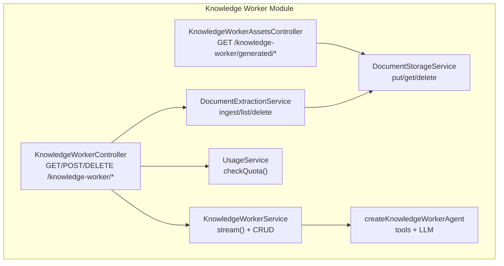
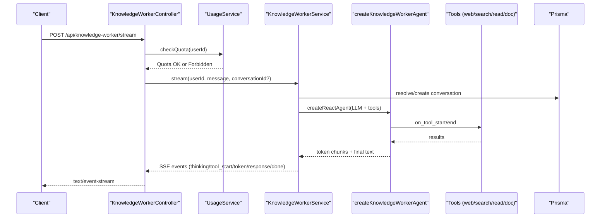
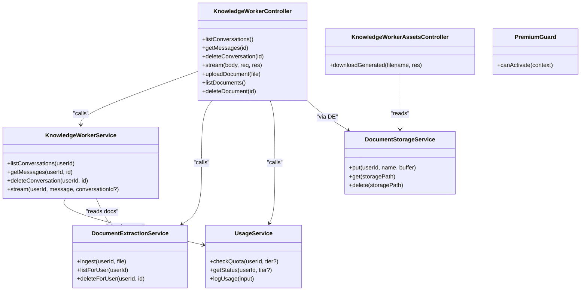

# API Endpoints

<cite>
**Referenced Files in This Document**
- [knowledge-worker.controller.ts](file://backend/src/knowledge-worker/knowledge-worker.controller.ts)
- [knowledge-worker.service.ts](file://backend/src/knowledge-worker/knowledge-worker.service.ts)
- [kw-stream.dto.ts](file://backend/src/knowledge-worker/dto/kw-stream.dto.ts)
- [document-extraction.service.ts](file://backend/src/knowledge-worker/services/document-extraction.service.ts)
- [document-storage.service.ts](file://backend/src/knowledge-worker/services/document-storage.service.ts)
- [kw-agent.ts](file://backend/src/knowledge-worker/graph/kw-agent.ts)
- [usage.service.ts](file://backend/src/usage/usage.service.ts)
- [premium.guard.ts](file://backend/src/auth/premium.guard.ts)
- [knowledge-worker.ts (frontend)](file://frontend/src/api/knowledge-worker.ts)
- [knowledge-worker.ts (mobile)](file://mobile/src/api/knowledge-worker.ts)
- [main.ts](file://backend/src/main.ts)
</cite>

## Table of Contents
1. [Introduction](#introduction)
2. [Project Structure](#project-structure)
3. [Core Components](#core-components)
4. [Architecture Overview](#architecture-overview)
5. [Detailed Component Analysis](#detailed-component-analysis)
6. [Dependency Analysis](#dependency-analysis)
7. [Performance Considerations](#performance-considerations)
8. [Troubleshooting Guide](#troubleshooting-guide)
9. [Conclusion](#conclusion)
10. [Appendices](#appendices)

## Introduction
This document describes the Knowledge Worker API surface, including conversation management, document ingestion, streaming responses, and public asset downloads. It covers authentication, request/response schemas, error handling, rate limiting, SSE streaming semantics, file upload mechanics, and security/access controls. The endpoints are designed for premium-tier access and integrate with usage quotas and tooling for research, analysis, and document generation.

## Project Structure
The Knowledge Worker feature spans a dedicated controller, service, DTOs, and supporting services for document extraction and storage. Streaming leverages an agent with tool integrations and SSE. Asset downloads are exposed via a separate public controller to support browser-friendly access without bearer tokens.

**Diagram sources**
- [knowledge-worker.controller.ts:35-131](file://backend/src/knowledge-worker/knowledge-worker.controller.ts#L35-L131)
- [knowledge-worker.controller.ts:139-219](file://backend/src/knowledge-worker/knowledge-worker.controller.ts#L139-L219)
- [knowledge-worker.service.ts:92-344](file://backend/src/knowledge-worker/knowledge-worker.service.ts#L92-L344)
- [document-extraction.service.ts:27-239](file://backend/src/knowledge-worker/services/document-extraction.service.ts#L27-L239)
- [document-storage.service.ts:13-54](file://backend/src/knowledge-worker/services/document-storage.service.ts#L13-L54)
- [kw-agent.ts:16-51](file://backend/src/knowledge-worker/graph/kw-agent.ts#L16-L51)
- [usage.service.ts:51-214](file://backend/src/usage/usage.service.ts#L51-L214)

**Section sources**
- [knowledge-worker.controller.ts:35-131](file://backend/src/knowledge-worker/knowledge-worker.controller.ts#L35-L131)
- [knowledge-worker.controller.ts:139-219](file://backend/src/knowledge-worker/knowledge-worker.controller.ts#L139-L219)
- [knowledge-worker.service.ts:92-344](file://backend/src/knowledge-worker/knowledge-worker.service.ts#L92-L344)
- [document-extraction.service.ts:27-239](file://backend/src/knowledge-worker/services/document-extraction.service.ts#L27-L239)
- [document-storage.service.ts:13-54](file://backend/src/knowledge-worker/services/document-storage.service.ts#L13-L54)
- [kw-agent.ts:16-51](file://backend/src/knowledge-worker/graph/kw-agent.ts#L16-L51)
- [usage.service.ts:51-214](file://backend/src/usage/usage.service.ts#L51-L214)

## Core Components
- Controllers
  - KnowledgeWorkerController: Exposes conversation CRUD, streaming, and document upload/delete/list endpoints.
  - KnowledgeWorkerAssetsController: Provides public download of generated assets via UUID-named files.
- Services
  - KnowledgeWorkerService: Manages conversations, persists messages, orchestrates the agent, and emits SSE events.
  - DocumentExtractionService: Validates, parses, chunks, embeds, and persists user documents.
  - DocumentStorageService: Stores/retrieves files under user-scoped directories.
  - UsageService: Enforces monthly token quotas and logs usage.
- Guards and Tools
  - PremiumGuard: Gatekeeper for premium features (currently allows all authenticated users).
  - createKnowledgeWorkerAgent: Composes tools (web search, document read, analyst sandbox, document generation).

**Section sources**
- [knowledge-worker.controller.ts:35-131](file://backend/src/knowledge-worker/knowledge-worker.controller.ts#L35-L131)
- [knowledge-worker.controller.ts:139-219](file://backend/src/knowledge-worker/knowledge-worker.controller.ts#L139-L219)
- [knowledge-worker.service.ts:92-344](file://backend/src/knowledge-worker/knowledge-worker.service.ts#L92-L344)
- [document-extraction.service.ts:27-239](file://backend/src/knowledge-worker/services/document-extraction.service.ts#L27-L239)
- [document-storage.service.ts:13-54](file://backend/src/knowledge-worker/services/document-storage.service.ts#L13-L54)
- [usage.service.ts:51-214](file://backend/src/usage/usage.service.ts#L51-L214)
- [premium.guard.ts:18-45](file://backend/src/auth/premium.guard.ts#L18-L45)
- [kw-agent.ts:16-51](file://backend/src/knowledge-worker/graph/kw-agent.ts#L16-L51)

## Architecture Overview
The Knowledge Worker integrates:
- Authentication and access control via JWT and PremiumGuard.
- Rate limiting via NestJS throttler and usage quotas.
- Streaming via SSE with a carefully defined event contract.
- Tooling for web search, document reading, Python analysis, and styled document generation.
- Secure asset delivery using UUID-based filenames and optional S3 signed URLs.

**Diagram sources**
- [knowledge-worker.controller.ts:63-93](file://backend/src/knowledge-worker/knowledge-worker.controller.ts#L63-L93)
- [usage.service.ts:98-130](file://backend/src/usage/usage.service.ts#L98-L130)
- [knowledge-worker.service.ts:164-343](file://backend/src/knowledge-worker/knowledge-worker.service.ts#L164-L343)
- [kw-agent.ts:16-51](file://backend/src/knowledge-worker/graph/kw-agent.ts#L16-L51)

## Detailed Component Analysis

### Authentication and Access Control
- Authentication: All Knowledge Worker endpoints are protected by JWT and PremiumGuard.
- PremiumGuard: Currently allows all authenticated users; retained for future usage-based gating.
- Authorization: Endpoints enforce per-user resource ownership (e.g., conversation and document CRUD).

**Section sources**
- [knowledge-worker.controller.ts:35-44](file://backend/src/knowledge-worker/knowledge-worker.controller.ts#L35-L44)
- [premium.guard.ts:18-45](file://backend/src/auth/premium.guard.ts#L18-L45)

### Rate Limiting and Quotas
- Route-level throttling: The streaming endpoint applies a per-minute, per-user bucket.
- Hard quota enforcement: UsageService.checkQuota enforces monthly token caps per tier; throws Forbidden on exceedance.
- Tier caps: Free tier and Premium tier caps are defined centrally; unlimited tiers supported internally.

**Section sources**
- [knowledge-worker.controller.ts:63-69](file://backend/src/knowledge-worker/knowledge-worker.controller.ts#L63-L69)
- [usage.service.ts:11-15](file://backend/src/usage/usage.service.ts#L11-L15)
- [usage.service.ts:98-130](file://backend/src/usage/usage.service.ts#L98-L130)

### Conversation Management Endpoints
- List conversations
  - Method: GET
  - Path: /api/knowledge-worker/conversations
  - Auth: JWT + PremiumGuard
  - Response: Array of conversation summaries
- Get messages
  - Method: GET
  - Path: /api/knowledge-worker/conversations/{id}/messages
  - Auth: JWT + PremiumGuard
  - Response: Array of messages
- Delete conversation
  - Method: DELETE
  - Path: /api/knowledge-worker/conversations/{id}
  - Auth: JWT + PremiumGuard
  - Response: { ok: true }

Validation and errors:
- Nonexistent conversation ID yields NotFound on message retrieval.
- Ownership checks ensure only the user’s resources are accessed.

**Section sources**
- [knowledge-worker.controller.ts:48-61](file://backend/src/knowledge-worker/knowledge-worker.controller.ts#L48-L61)
- [knowledge-worker.service.ts:117-155](file://backend/src/knowledge-worker/knowledge-worker.service.ts#L117-L155)

### Streaming Endpoint (SSE)
- Method: POST
- Path: /api/knowledge-worker/stream
- Auth: JWT + PremiumGuard
- Body: KwStreamDto (message, optional conversationId)
- Headers:
  - Content-Type: application/json
  - Authorization: Bearer {token}
- Response: text/event-stream with ordered events

SSE Event Contract:
- conversation: { conversationId }
- thinking: { status: "reasoning" }
- tool_start: { tool, input }
- tool_end: { tool }
- token: { chunk }
- token_reset: {}
- response: { text, conversationId }
- done: { conversationId }

Behavior:
- Creates or resolves a conversation.
- Persists user message and loads recent history.
- Emits tool lifecycle and token events.
- Finalizes with response and done; updates conversation timestamp.

Rate limiting:
- Enforced via @Throttle decorator (per-minute limit).
- Additional hard quota enforced via UsageService.checkQuota prior to streaming.

Client usage (examples):
- Frontend: Uses fetch with manual SSE parsing.
- Mobile: Uses XMLHttpRequest-compatible SSE parsing.

**Section sources**
- [knowledge-worker.controller.ts:63-93](file://backend/src/knowledge-worker/knowledge-worker.controller.ts#L63-L93)
- [kw-stream.dto.ts:3-12](file://backend/src/knowledge-worker/dto/kw-stream.dto.ts#L3-L12)
- [knowledge-worker.service.ts:164-343](file://backend/src/knowledge-worker/knowledge-worker.service.ts#L164-L343)
- [knowledge-worker.ts (frontend):61-108](file://frontend/src/api/knowledge-worker.ts#L61-L108)
- [knowledge-worker.ts (mobile):112-125](file://mobile/src/api/knowledge-worker.ts#L112-L125)

### Document Upload API
- Method: POST
- Path: /api/knowledge-worker/documents/upload
- Auth: JWT + PremiumGuard
- Body: multipart/form-data with field file
- Limits:
  - Max file size: 25 MB
  - Supported MIME types: PDF, DOCX, XLSX/XLS, CSV, TXT, MD
- Response: Document metadata (id, filename, mimeType, fileSize, chunkCount, createdAt)
- Errors:
  - BadRequest for missing file, unsupported type, or empty content.
  - InternalServerError for processing failures.

Processing pipeline:
- Validates MIME/type and size.
- Extracts text from the file.
- Stores raw file under user-scoped directory.
- Chunks text and optionally computes embeddings.
- Persists document and chunk records.

Timeouts:
- Frontend/mobile clients configure long timeouts suitable for analysis tasks.

**Section sources**
- [knowledge-worker.controller.ts:97-113](file://backend/src/knowledge-worker/knowledge-worker.controller.ts#L97-L113)
- [document-extraction.service.ts:41-111](file://backend/src/knowledge-worker/services/document-extraction.service.ts#L41-L111)
- [document-extraction.service.ts:12-20](file://backend/src/knowledge-worker/services/document-extraction.service.ts#L12-L20)
- [document-storage.service.ts:24-35](file://backend/src/knowledge-worker/services/document-storage.service.ts#L24-L35)
- [knowledge-worker.ts (frontend):120-130](file://frontend/src/api/knowledge-worker.ts#L120-L130)
- [knowledge-worker.ts (mobile):137-152](file://mobile/src/api/knowledge-worker.ts#L137-L152)

### Document Management Endpoints
- List documents
  - Method: GET
  - Path: /api/knowledge-worker/documents
  - Auth: JWT + PremiumGuard
  - Response: Array of document summaries
- Delete document
  - Method: DELETE
  - Path: /api/knowledge-worker/documents/{id}
  - Auth: JWT + PremiumGuard
  - Response: { ok: true }

Ownership and cascading:
- Deletion removes document and associated chunks; raw file is deleted from storage.

**Section sources**
- [knowledge-worker.controller.ts:115-123](file://backend/src/knowledge-worker/knowledge-worker.controller.ts#L115-L123)
- [document-extraction.service.ts:113-137](file://backend/src/knowledge-worker/services/document-extraction.service.ts#L113-L137)

### Public Asset Download Routes
- Method: GET
- Path: /api/knowledge-worker/generated/{filename}
- Auth: None (public)
- Security:
  - Filename must match a strict regex and contain a UUID.
  - Path traversal protections are enforced.
  - Attempts S3 signed URL resolution first; falls back to local file scanning across user directories.
- Response: Binary stream with appropriate Content-Type and Content-Disposition.
- Supported formats: PDF, DOCX, XLSX, PPTX, PNG, JPG/JPEG, SVG.

Notes:
- Designed for browser-friendly access (e.g.,  and <a download>).
- Access is protected by the unpredictability of UUID-based filenames.

**Section sources**
- [knowledge-worker.controller.ts:139-219](file://backend/src/knowledge-worker/knowledge-worker.controller.ts#L139-L219)

### SSE Streaming Contract Details
- Event ordering: conversation, thinking, zero or more tool_start/tool_end pairs, token_reset followed by token chunks, response, done.
- Tool calls: When the model decides to use a tool, token events pause and token_reset is emitted before tool execution begins.
- Finalization: The assistant’s final text is emitted in a response event; done signals completion.

Client-side consumption:
- Both frontend and mobile clients parse SSE frames and dispatch events to UI layers.

**Section sources**
- [knowledge-worker.service.ts:164-343](file://backend/src/knowledge-worker/knowledge-worker.service.ts#L164-L343)
- [knowledge-worker.ts (frontend):4-15](file://frontend/src/api/knowledge-worker.ts#L4-L15)
- [knowledge-worker.ts (mobile):28-95](file://mobile/src/api/knowledge-worker.ts#L28-L95)

### File Upload Mechanics
- Client sends multipart/form-data with a file field.
- Server validates presence, size, and MIME type.
- Extraction pipeline:
  - Parse PDF/DOCX/XLSX/CSV/TXT/MD to text.
  - Sanitize text for database safety.
  - Store raw file under user-scoped directory.
  - Split into overlapping chunks (~800 tokens).
  - Optionally compute embeddings and persist chunks.
- Response includes identifiers and counts for downstream UI and tooling.

**Section sources**
- [knowledge-worker.controller.ts:97-113](file://backend/src/knowledge-worker/knowledge-worker.controller.ts#L97-L113)
- [document-extraction.service.ts:163-238](file://backend/src/knowledge-worker/services/document-extraction.service.ts#L163-L238)
- [document-storage.service.ts:24-35](file://backend/src/knowledge-worker/services/document-storage.service.ts#L24-L35)

### Public Asset Access Patterns
- Filename validation ensures only UUID-containing files are served.
- MIME detection drives Content-Type and inline vs attachment behavior.
- Cache headers applied for efficient browser caching.

**Section sources**
- [knowledge-worker.controller.ts:150-218](file://backend/src/knowledge-worker/knowledge-worker.controller.ts#L150-L218)

### Security Considerations
- Transport security: HTTPS recommended in production.
- CORS: Origin list must be explicitly configured in production.
- Helmet: Security headers enabled; CSP report-only initially.
- Compression: Disabled for SSE to preserve streaming.
- Static assets: Serving uploads disabled in production; rely on authenticated routes or cloud storage.
- Public asset access: Relies on unpredictable UUID filenames; no bearer token required.

**Section sources**
- [main.ts:37-60](file://backend/src/main.ts#L37-L60)
- [main.ts:68-79](file://backend/src/main.ts#L68-L79)
- [main.ts:99-111](file://backend/src/main.ts#L99-L111)
- [knowledge-worker.controller.ts:125-130](file://backend/src/knowledge-worker/knowledge-worker.controller.ts#L125-L130)
- [knowledge-worker.controller.ts:150-170](file://backend/src/knowledge-worker/knowledge-worker.controller.ts#L150-L170)

### Quota Enforcement for Premium Features
- Monthly token caps are enforced before streaming begins.
- Free tier and Premium tier caps differ; unlimited tiers supported.
- Over-limit responses include quota metadata for client UX.

**Section sources**
- [usage.service.ts:11-15](file://backend/src/usage/usage.service.ts#L11-L15)
- [usage.service.ts:98-130](file://backend/src/usage/usage.service.ts#L98-L130)
- [knowledge-worker.controller.ts:63-69](file://backend/src/knowledge-worker/knowledge-worker.controller.ts#L63-L69)

## Dependency Analysis

**Diagram sources**
- [knowledge-worker.controller.ts:35-131](file://backend/src/knowledge-worker/knowledge-worker.controller.ts#L35-L131)
- [knowledge-worker.controller.ts:139-219](file://backend/src/knowledge-worker/knowledge-worker.controller.ts#L139-L219)
- [knowledge-worker.service.ts:92-344](file://backend/src/knowledge-worker/knowledge-worker.service.ts#L92-L344)
- [document-extraction.service.ts:27-239](file://backend/src/knowledge-worker/services/document-extraction.service.ts#L27-L239)
- [document-storage.service.ts:13-54](file://backend/src/knowledge-worker/services/document-storage.service.ts#L13-L54)
- [usage.service.ts:51-214](file://backend/src/usage/usage.service.ts#L51-L214)
- [premium.guard.ts:18-45](file://backend/src/auth/premium.guard.ts#L18-L45)

**Section sources**
- [knowledge-worker.controller.ts:35-131](file://backend/src/knowledge-worker/knowledge-worker.controller.ts#L35-L131)
- [knowledge-worker.controller.ts:139-219](file://backend/src/knowledge-worker/knowledge-worker.controller.ts#L139-L219)
- [knowledge-worker.service.ts:92-344](file://backend/src/knowledge-worker/knowledge-worker.service.ts#L92-L344)
- [document-extraction.service.ts:27-239](file://backend/src/knowledge-worker/services/document-extraction.service.ts#L27-L239)
- [document-storage.service.ts:13-54](file://backend/src/knowledge-worker/services/document-storage.service.ts#L13-L54)
- [usage.service.ts:51-214](file://backend/src/usage/usage.service.ts#L51-L214)
- [premium.guard.ts:18-45](file://backend/src/auth/premium.guard.ts#L18-L45)

## Performance Considerations
- Streaming: SSE streaming avoids buffering and supports real-time token emission; compression is disabled for SSE.
- Chunking: Document chunks use overlapping windows to improve retrieval accuracy.
- Embeddings: Optional vector indexing improves semantic search quality.
- Timeouts: Long timeouts for uploads and streaming accommodate heavy analysis tasks.
- Rate limiting: Per-user throttling reduces abuse; quotas cap spending for premium users.

[No sources needed since this section provides general guidance]

## Troubleshooting Guide
Common errors and resolutions:
- Quota exceeded (Forbidden)
  - Cause: Monthly token cap reached.
  - Action: Upgrade tier or wait for next billing cycle.
  - Reference: [usage.service.ts:98-130](file://backend/src/usage/usage.service.ts#L98-L130)
- Conversation not found (NotFound)
  - Cause: Invalid or unauthorized conversationId.
  - Action: Ensure conversation belongs to the user.
  - Reference: [knowledge-worker.service.ts:130-138](file://backend/src/knowledge-worker/knowledge-worker.service.ts#L130-L138)
- Unsupported file type or empty content (BadRequest)
  - Cause: MIME not supported or parsing produced insufficient text.
  - Action: Verify file type and content.
  - Reference: [document-extraction.service.ts:52-62](file://backend/src/knowledge-worker/services/document-extraction.service.ts#L52-L62)
- Upload failure (InternalServerError)
  - Cause: Unexpected processing error.
  - Action: Retry after checking server logs.
  - Reference: [knowledge-worker.controller.ts:104-113](file://backend/src/knowledge-worker/knowledge-worker.controller.ts#L104-L113)
- SSE connection issues
  - Cause: Network interruptions or client parser errors.
  - Action: Inspect progress callbacks and retry logic.
  - References: [knowledge-worker.ts (frontend):80-108](file://frontend/src/api/knowledge-worker.ts#L80-L108), [knowledge-worker.ts (mobile):29-95](file://mobile/src/api/knowledge-worker.ts#L29-L95)

**Section sources**
- [usage.service.ts:98-130](file://backend/src/usage/usage.service.ts#L98-L130)
- [knowledge-worker.service.ts:130-138](file://backend/src/knowledge-worker/knowledge-worker.service.ts#L130-L138)
- [document-extraction.service.ts:52-62](file://backend/src/knowledge-worker/services/document-extraction.service.ts#L52-L62)
- [knowledge-worker.controller.ts:104-113](file://backend/src/knowledge-worker/knowledge-worker.controller.ts#L104-L113)
- [knowledge-worker.ts (frontend):80-108](file://frontend/src/api/knowledge-worker.ts#L80-L108)
- [knowledge-worker.ts (mobile):29-95](file://mobile/src/api/knowledge-worker.ts#L29-L95)

## Conclusion
The Knowledge Worker API provides a secure, quota-enforced platform for conversational AI with integrated document ingestion, analysis, and export capabilities. Its SSE streaming aligns with companion endpoints, while public asset downloads enable seamless browser integration. Together with robust validation, rate limiting, and security headers, it offers a production-ready foundation for premium knowledge work.

[No sources needed since this section summarizes without analyzing specific files]

## Appendices

### API Reference Summary

- Authentication
  - Header: Authorization: Bearer {token}
  - Guard: JwtAuthGuard + PremiumGuard

- Conversations
  - GET /api/knowledge-worker/conversations
  - GET /api/knowledge-worker/conversations/{id}/messages
  - DELETE /api/knowledge-worker/conversations/{id}

- Streaming (SSE)
  - POST /api/knowledge-worker/stream
  - Body: { message, conversationId? }
  - Events: conversation, thinking, tool_start, tool_end, token, token_reset, response, done

- Documents
  - POST /api/knowledge-worker/documents/upload (multipart/form-data)
  - GET /api/knowledge-worker/documents
  - DELETE /api/knowledge-worker/documents/{id}

- Public Assets
  - GET /api/knowledge-worker/generated/{filename}

- Rate Limiting
  - Streaming: per-minute per-user throttle
  - Quotas: monthly token caps by tier

- Security
  - CORS origins must be explicitly configured in production
  - Helmet security headers enabled
  - Static uploads disabled in production; serve via authenticated routes or cloud storage
  - Public asset access relies on UUID-based filenames

**Section sources**
- [knowledge-worker.controller.ts:35-131](file://backend/src/knowledge-worker/knowledge-worker.controller.ts#L35-L131)
- [knowledge-worker.controller.ts:139-219](file://backend/src/knowledge-worker/knowledge-worker.controller.ts#L139-L219)
- [main.ts:37-79](file://backend/src/main.ts#L37-L79)
- [usage.service.ts:98-130](file://backend/src/usage/usage.service.ts#L98-L130)