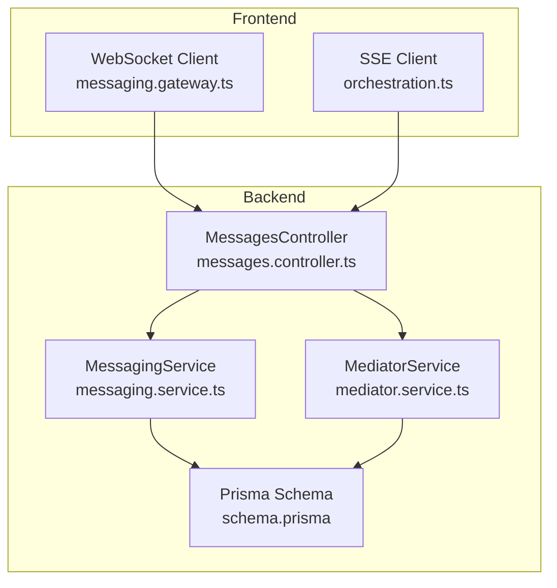
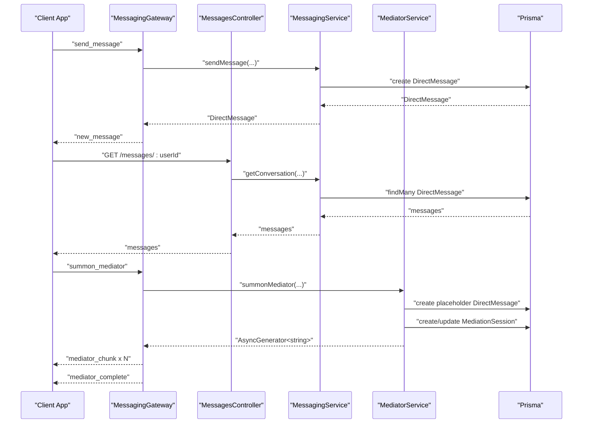
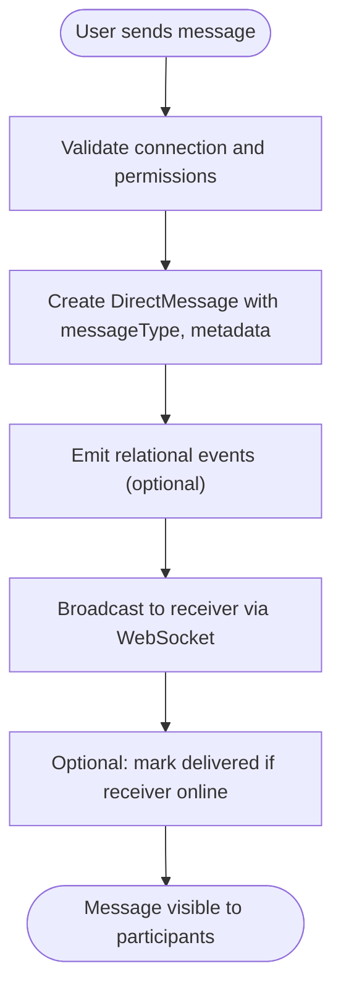
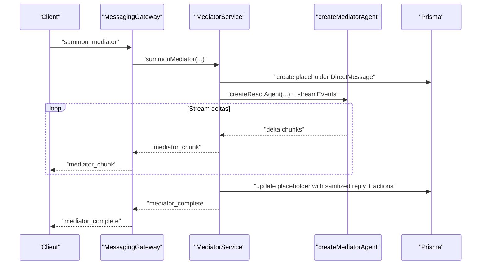
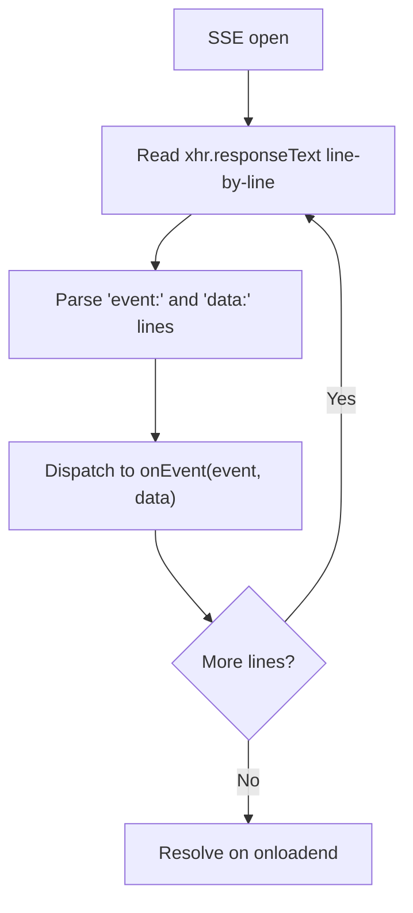
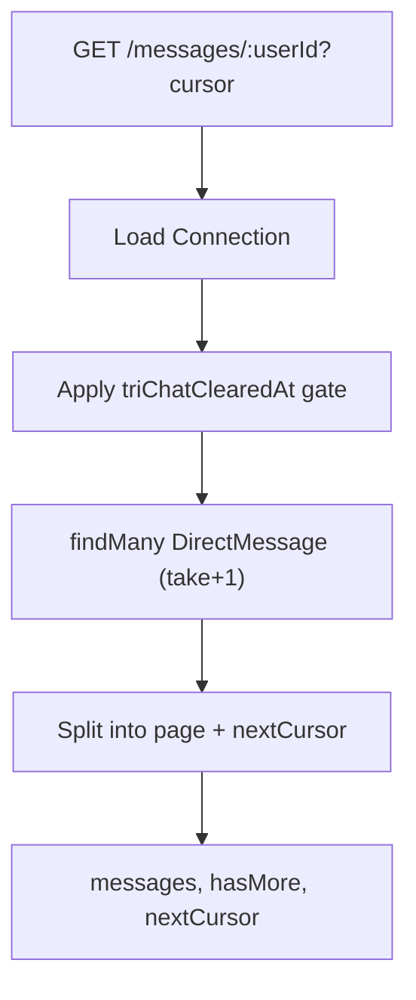
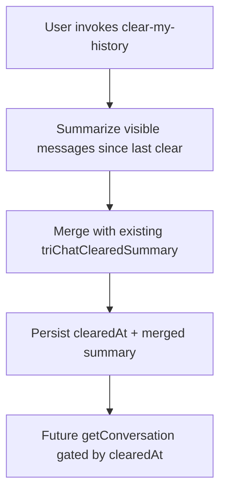
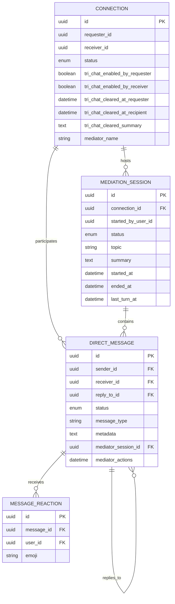
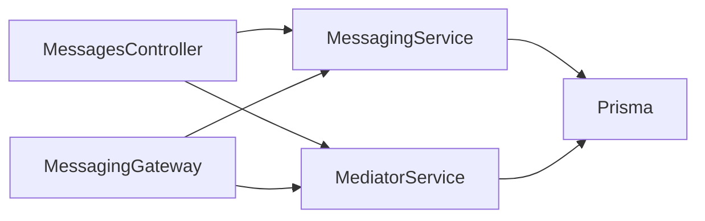

# Conversation Management

<cite>
**Referenced Files in This Document**
- [messaging.service.ts](file://backend/src/messaging/messaging.service.ts)
- [messages.controller.ts](file://backend/src/messaging/messages.controller.ts)
- [messaging.gateway.ts](file://backend/src/messaging/messaging.gateway.ts)
- [mediator.service.ts](file://backend/src/messaging/mediator.service.ts)
- [mediator-agent.ts](file://backend/src/messaging/graph/mediator-agent.ts)
- [schema.prisma](file://backend/prisma/schema.prisma)
- [orchestration.service.ts](file://backend/src/orchestration/orchestration.service.ts)
- [orchestration.ts](file://mobile/src/api/orchestration.ts)
- [MessagesScreen.tsx](file://mobile/src/screens/MessagesScreen.tsx)
</cite>

## Table of Contents
1. [Introduction](#introduction)
2. [Project Structure](#project-structure)
3. [Core Components](#core-components)
4. [Architecture Overview](#architecture-overview)
5. [Detailed Component Analysis](#detailed-component-analysis)
6. [Dependency Analysis](#dependency-analysis)
7. [Performance Considerations](#performance-considerations)
8. [Troubleshooting Guide](#troubleshooting-guide)
9. [Conclusion](#conclusion)

## Introduction
This document explains the conversation management functionality across the backend messaging subsystem and the tri-chat mediator. It covers the conversation lifecycle, message threading, session persistence, real-time streaming via Server-Sent Events and WebSockets, conversation history retrieval, state management, conversation ID systems, message categorization, metadata handling, quotas and storage optimization, and privacy considerations for stored conversations.

## Project Structure
The conversation management spans three layers:
- Backend REST and WebSocket APIs for direct messaging and tri-chat mediator
- Database schema modeling direct messages, connections, mediation sessions, and related metadata
- Frontend integrations for SSE streaming and real-time updates

**Diagram sources**
- [messages.controller.ts:21-227](file://backend/src/messaging/messages.controller.ts#L21-L227)
- [messaging.service.ts:22-647](file://backend/src/messaging/messaging.service.ts#L22-L647)
- [messaging.gateway.ts:62-762](file://backend/src/messaging/messaging.gateway.ts#L62-L762)
- [mediator.service.ts:132-1279](file://backend/src/messaging/mediator.service.ts#L132-L1279)
- [schema.prisma:516-577](file://backend/prisma/schema.prisma#L516-L577)

**Section sources**
- [messages.controller.ts:21-227](file://backend/src/messaging/messages.controller.ts#L21-L227)
- [messaging.service.ts:22-647](file://backend/src/messaging/messaging.service.ts#L22-L647)
- [messaging.gateway.ts:62-762](file://backend/src/messaging/messaging.gateway.ts#L62-L762)
- [mediator.service.ts:132-1279](file://backend/src/messaging/mediator.service.ts#L132-L1279)
- [schema.prisma:516-577](file://backend/prisma/schema.prisma#L516-L577)

## Core Components
- MessagingService: Implements CRUD for direct messages, reactions, status updates, conversation lists, and search. Handles privacy gates for one-sided history clear and emits relational events.
- MessagesController: Exposes REST endpoints for conversations, unread counts, message actions, reactions, and tri-chat controls.
- MessagingGateway: Real-time WebSocket transport for sending, editing, deleting messages, reactions, typing indicators, online status, and tri-chat mediator streaming.
- MediatorService: Orchestrates tri-chat mediator sessions, manages quotas, builds context per session, streams deltas, persists mediator messages, and handles action cards.
- Prisma Schema: Defines DirectMessage, Connection, MediationSession, MessageReaction, and related indexes and constraints for efficient queries and privacy isolation.

**Section sources**
- [messaging.service.ts:22-647](file://backend/src/messaging/messaging.service.ts#L22-L647)
- [messages.controller.ts:21-227](file://backend/src/messaging/messages.controller.ts#L21-L227)
- [messaging.gateway.ts:62-762](file://backend/src/messaging/messaging.gateway.ts#L62-L762)
- [mediator.service.ts:132-1279](file://backend/src/messaging/mediator.service.ts#L132-L1279)
- [schema.prisma:516-577](file://backend/prisma/schema.prisma#L516-L577)

## Architecture Overview
The system supports two complementary channels:
- REST + SSE for non-realtime operations and fallback streaming
- WebSocket for real-time messaging and live mediator streaming

**Diagram sources**
- [messaging.gateway.ts:191-247](file://backend/src/messaging/messaging.gateway.ts#L191-L247)
- [messages.controller.ts:40-47](file://backend/src/messaging/messages.controller.ts#L40-L47)
- [messaging.service.ts:53-96](file://backend/src/messaging/messaging.service.ts#L53-L96)
- [mediator.service.ts:661-1008](file://backend/src/messaging/mediator.service.ts#L661-L1008)
- [schema.prisma:551-577](file://backend/prisma/schema.prisma#L551-L577)

## Detailed Component Analysis

### Conversation Lifecycle and Message Threading
- Creation: sendMessage validates connections, ensures users are connected, and persists a DirectMessage with optional replyToId, messageType, and metadata.
- Editing and Deletion: editMessage and deleteMessage enforce ownership and soft-delete semantics for privacy-preserving UI behavior.
- Replies: replyToId links messages to a parent, enabling threaded views.
- Status Tracking: updateMessageStatus and markAsDelivered/markAsRead manage delivery/read states.
- Privacy Gates: getConversation applies per-user triChatClearedAt timestamps to hide messages older than a user’s one-sided clear.

**Diagram sources**
- [messaging.service.ts:53-96](file://backend/src/messaging/messaging.service.ts#L53-L96)
- [messaging.gateway.ts:224-240](file://backend/src/messaging/messaging.gateway.ts#L224-L240)

**Section sources**
- [messaging.service.ts:53-96](file://backend/src/messaging/messaging.service.ts#L53-L96)
- [messaging.service.ts:148-174](file://backend/src/messaging/messaging.service.ts#L148-L174)
- [messaging.service.ts:217-225](file://backend/src/messaging/messaging.service.ts#L217-L225)
- [messaging.service.ts:458-503](file://backend/src/messaging/messaging.service.ts#L458-L503)

### Session Persistence and Tri-Chat Mediator
- Sessions: MediationSession tracks active/ended sessions per Connection with startedAt, lastTurnAt, topic, and summary.
- Placeholders: summonMediator creates a placeholder DirectMessage with messageType "mediator" and streaming metadata to render UI immediately.
- Streaming: MediatorService streams deltas via an AsyncGenerator, sanitizing tool artifacts and emitting only the final reply turn.
- Action Cards: Tools can propose suggested_ritual, suggested_task, suggested_tension, or agreement; acceptMediatorAction persists chosen actions and records MediationEvent.

**Diagram sources**
- [messaging.gateway.ts:484-544](file://backend/src/messaging/messaging.gateway.ts#L484-L544)
- [mediator.service.ts:661-1008](file://backend/src/messaging/mediator.service.ts#L661-L1008)
- [mediator-agent.ts:23-71](file://backend/src/messaging/graph/mediator-agent.ts#L23-L71)
- [schema.prisma:579-610](file://backend/prisma/schema.prisma#L579-L610)

**Section sources**
- [mediator.service.ts:661-1008](file://backend/src/messaging/mediator.service.ts#L661-L1008)
- [mediator.service.ts:1156-1279](file://backend/src/messaging/mediator.service.ts#L1156-L1279)
- [schema.prisma:579-610](file://backend/prisma/schema.prisma#L579-L610)

### SSE Streaming Implementation for Real-Time Responses
- Frontend SSE parsing: The mobile client parses multipart lines into structured events, handling partial buffers and JSON payloads.
- Typical flow: Client initiates SSE, receives event lines, parses event/data pairs, and dispatches to handlers.

**Diagram sources**
- [orchestration.ts:34-75](file://mobile/src/api/orchestration.ts#L34-L75)

**Section sources**
- [orchestration.ts:34-75](file://mobile/src/api/orchestration.ts#L34-L75)

### Conversation History Retrieval and Pagination
- getConversation: Returns paginated messages between two users, respecting per-user triChatClearedAt timestamps for privacy.
- getConversationList: Efficiently computes last message previews and unread counts per conversation using a single query with DISTINCT ON and grouped counts.
- getTotalUnread: Aggregates unread counts for sidebar badges.

**Diagram sources**
- [messages.controller.ts:40-47](file://backend/src/messaging/messages.controller.ts#L40-L47)
- [messaging.service.ts:458-503](file://backend/src/messaging/messaging.service.ts#L458-L503)

**Section sources**
- [messages.controller.ts:29-56](file://backend/src/messaging/messages.controller.ts#L29-L56)
- [messaging.service.ts:514-634](file://backend/src/messaging/messaging.service.ts#L514-L634)

### State Management and Privacy Controls
- One-sided clear: clearMyHistory summarizes pre-clear transcript segments and stores a shared triChatClearedSummary; it sets per-user triChatClearedAtRequester/recip to gate visibility.
- Privacy lockdown: Mediator context excludes private user/relationship details; only earlier summary, recent conversation, current session, and prior mediation history are injected.
- Online presence: MessagingGateway tracks online users and updates lastSeenAt on disconnect.

**Diagram sources**
- [mediator.service.ts:334-444](file://backend/src/messaging/mediator.service.ts#L334-L444)
- [messaging.service.ts:458-503](file://backend/src/messaging/messaging.service.ts#L458-L503)

**Section sources**
- [mediator.service.ts:334-444](file://backend/src/messaging/mediator.service.ts#L334-L444)
- [messaging.gateway.ts:162-180](file://backend/src/messaging/messaging.gateway.ts#L162-L180)

### Conversation ID System and Message Categorization
- Conversation ID: Connections define a unique pairing of requester and receiver; tri-chat mediator uses connectionId to scope sessions and settings.
- Message ID: DirectMessage.id is UUID; replyToId forms threaded replies; messageType distinguishes text, mediator, and other categories.
- Metadata: DirectMessage.metadata stores structured JSON (e.g., mediator flags, session IDs, tool counts).

**Diagram sources**
- [schema.prisma:516-577](file://backend/prisma/schema.prisma#L516-L577)
- [schema.prisma:579-610](file://backend/prisma/schema.prisma#L579-L610)
- [schema.prisma:612-624](file://backend/prisma/schema.prisma#L612-L624)

**Section sources**
- [messages.controller.ts:97-112](file://backend/src/messaging/messages.controller.ts#L97-L112)
- [messaging.service.ts:55-75](file://backend/src/messaging/messaging.service.ts#L55-L75)
- [schema.prisma:551-577](file://backend/prisma/schema.prisma#L551-L577)

### Examples of Conversation Workflows
- Real-time messaging:
  - Client sends a message via WebSocket; server persists and emits new_message to both parties.
  - Optional: receiver online triggers delivered status update.
- Tri-chat mediator:
  - Client summons mediator; server creates a placeholder, streams deltas, and persists the final sanitized reply with optional action cards.
  - Client can reply to an active session or end the session to generate a summary/topic.
- Conversation history:
  - Client requests a paginated history; server returns messages after the per-user clearedAt boundary.

**Section sources**
- [messaging.gateway.ts:191-247](file://backend/src/messaging/messaging.gateway.ts#L191-L247)
- [messaging.gateway.ts:484-544](file://backend/src/messaging/messaging.gateway.ts#L484-L544)
- [mediator.service.ts:661-1008](file://backend/src/messaging/mediator.service.ts#L661-L1008)
- [messaging.service.ts:458-503](file://backend/src/messaging/messaging.service.ts#L458-L503)

### Cleanup Procedures
- One-sided clear:
  - Summarize visible messages since last clear, persist clearedAt and merged summary, and gate future queries for that user.
- Placeholder cleanup:
  - If streaming fails mid-turn with no content, delete the placeholder to avoid ghost bubbles.
- Session idle timeout:
  - Inactive sessions are ended automatically after a threshold.

**Section sources**
- [mediator.service.ts:334-444](file://backend/src/messaging/mediator.service.ts#L334-L444)
- [mediator.service.ts:970-999](file://backend/src/messaging/mediator.service.ts#L970-L999)
- [mediator.service.ts:714-725](file://backend/src/messaging/mediator.service.ts#L714-L725)

### Quotas, Storage Optimization, and Privacy
- Quotas:
  - Free users get a monthly allowance for tri-chat mediator turns; quota consumption is tracked per user and resets monthly.
  - Additional LLM usage quotas are enforced elsewhere in the system.
- Storage optimization:
  - Indexes on sender/receiver/date and replyToId improve query performance.
  - Soft-deleting messages preserves UI semantics without reclaiming storage.
  - Privacy gates (per-user clearedAt) reduce effective dataset sizes per user.
- Privacy:
  - Mediator context excludes private user/relationship details; only curated excerpts are injected.
  - Online presence updates lastSeenAt on disconnect; reactions are scoped to participating users.

**Section sources**
- [mediator.service.ts:305-332](file://backend/src/messaging/mediator.service.ts#L305-L332)
- [schema.prisma:573-576](file://backend/prisma/schema.prisma#L573-L576)
- [messaging.service.ts:334-444](file://backend/src/messaging/messaging.service.ts#L334-L444)
- [messaging.gateway.ts:162-180](file://backend/src/messaging/messaging.gateway.ts#L162-L180)

## Dependency Analysis
- MessagingService depends on PrismaService and EventEmitter2 for relational events.
- MediatorService composes a ReAct agent with tools and persists session state and action cards.
- MessagingGateway depends on JWT verification and Socket.IO to scope events to users and rooms.
- REST endpoints delegate to MessagingService and MediatorService.

**Diagram sources**
- [messages.controller.ts:24-27](file://backend/src/messaging/messages.controller.ts#L24-L27)
- [messaging.service.ts:23-26](file://backend/src/messaging/messaging.service.ts#L23-L26)
- [mediator.service.ts:139-145](file://backend/src/messaging/mediator.service.ts#L139-L145)
- [messaging.gateway.ts:74-79](file://backend/src/messaging/messaging.gateway.ts#L74-L79)

**Section sources**
- [messages.controller.ts:24-27](file://backend/src/messaging/messages.controller.ts#L24-L27)
- [messaging.service.ts:23-26](file://backend/src/messaging/messaging.service.ts#L23-L26)
- [mediator.service.ts:139-145](file://backend/src/messaging/mediator.service.ts#L139-L145)
- [messaging.gateway.ts:74-79](file://backend/src/messaging/messaging.gateway.ts#L74-L79)

## Performance Considerations
- Efficient conversation list: A single query with DISTINCT ON and grouped counts avoids O(N) queries for last-message and unread-count.
- Indexes: Composite indexes on sender/receiver/date and replyToId optimize frequent queries.
- Streaming: AsyncGenerator minimizes memory overhead by yielding deltas; sanitizer prevents leaking tool artifacts.
- Rate limiting: Sliding-window counters in MessagingGateway throttle high-frequency events.

[No sources needed since this section provides general guidance]

## Troubleshooting Guide
- WebSocket rate limit exceeded: The gateway rejects events exceeding configured rates and emits message_error with RATE_LIMIT code.
- Invalid payload: Inputs are validated against length limits; invalid payloads trigger message_error with INVALID_INPUT code.
- Mediator failures: On streaming errors, placeholders are cleaned up or updated with partial content and error flags.
- Frontend SSE parsing: The mobile client handles partial buffers and JSON parse errors gracefully.

**Section sources**
- [messaging.gateway.ts:91-126](file://backend/src/messaging/messaging.gateway.ts#L91-L126)
- [messaging.gateway.ts:524-543](file://backend/src/messaging/messaging.gateway.ts#L524-L543)
- [orchestration.ts:34-75](file://mobile/src/api/orchestration.ts#L34-L75)

## Conclusion
The conversation management system integrates REST, SSE, and WebSocket transports to support real-time messaging and tri-chat mediation. It enforces privacy through per-user visibility gates, optimizes performance with indexed queries and streaming, and maintains robust state via session persistence and action cards. Quotas and storage strategies ensure scalability and cost control while preserving user privacy.