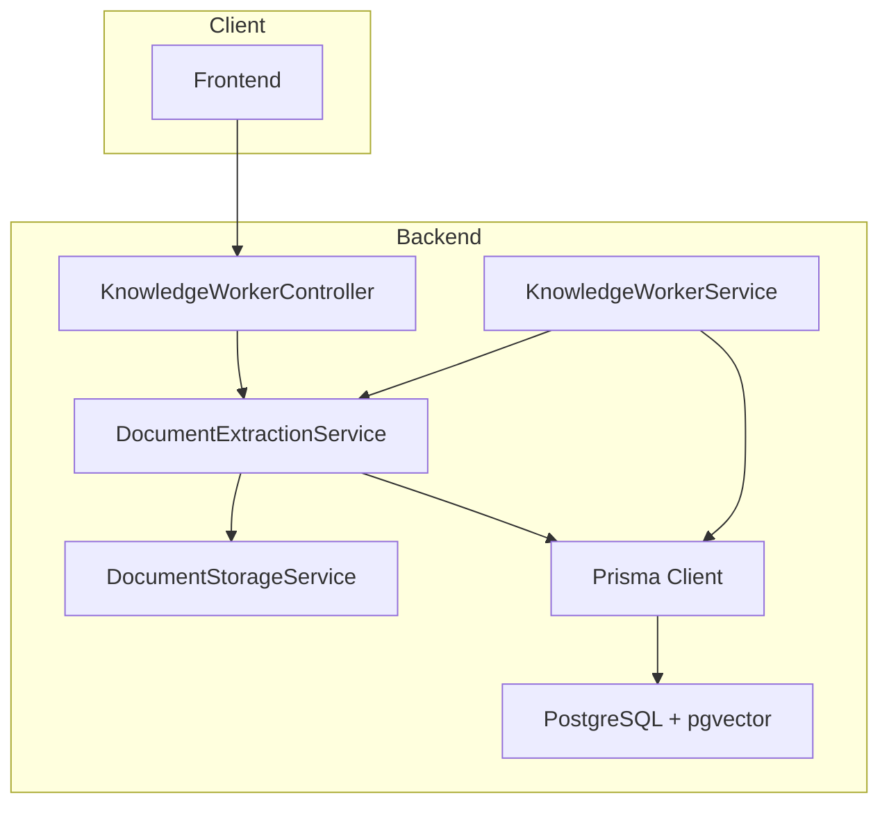
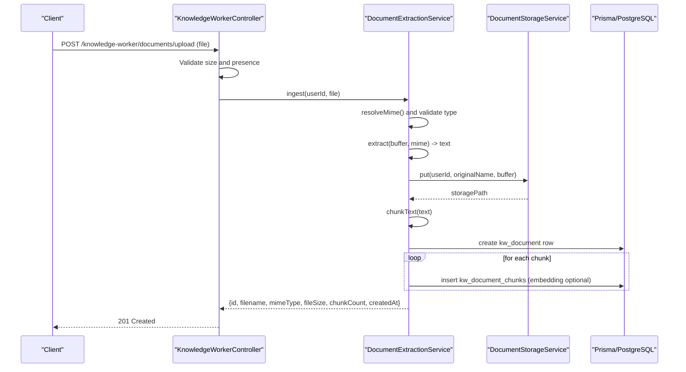
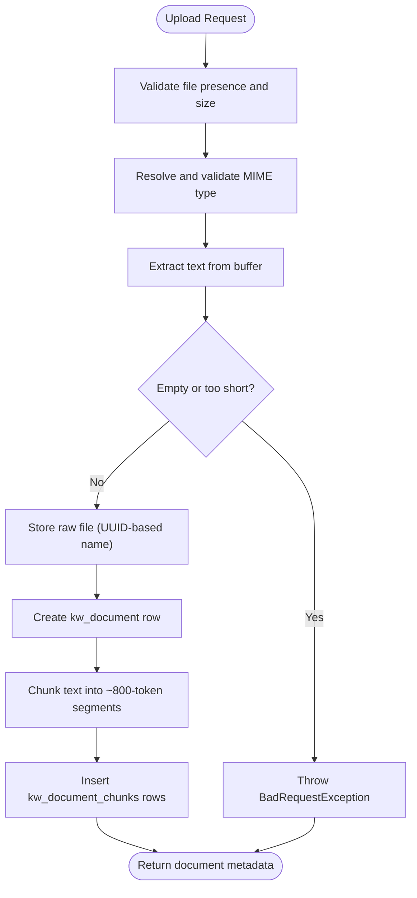
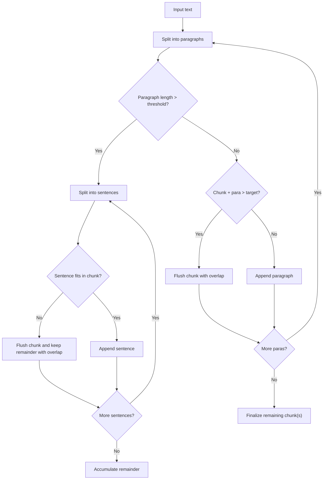
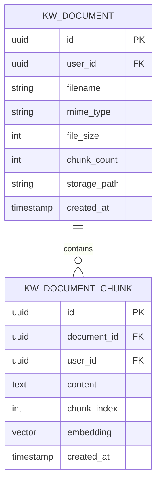
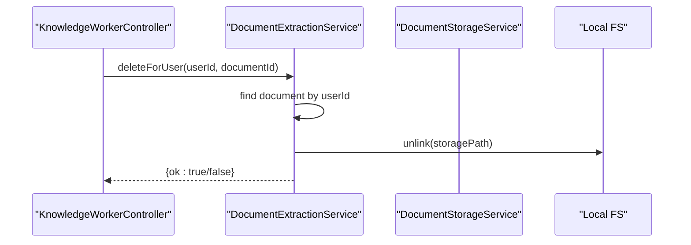
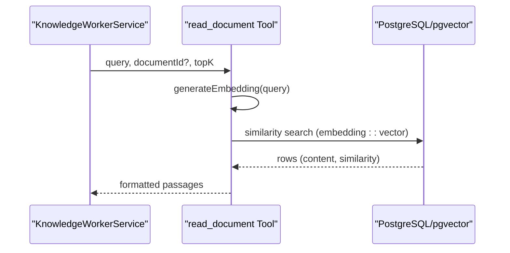
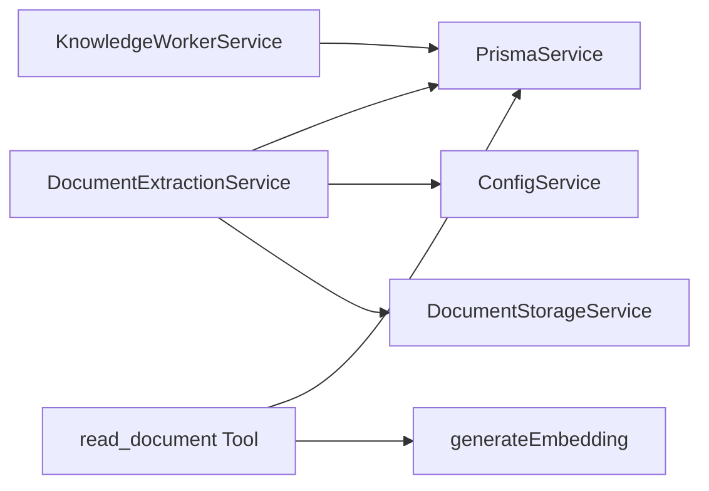

# Document Processing Pipeline

<cite>
**Referenced Files in This Document**
- [document-extraction.service.ts](file://backend/src/knowledge-worker/services/document-extraction.service.ts)
- [document-storage.service.ts](file://backend/src/knowledge-worker/services/document-storage.service.ts)
- [knowledge-worker.controller.ts](file://backend/src/knowledge-worker/knowledge-worker.controller.ts)
- [knowledge-worker.service.ts](file://backend/src/knowledge-worker/knowledge-worker.service.ts)
- [read-document.tool.ts](file://backend/src/knowledge-worker/graph/tools/read-document.tool.ts)
- [schema.prisma](file://backend/prisma/schema.prisma)
- [package.json](file://backend/package.json)
- [app.module.ts](file://backend/src/app.module.ts)
</cite>

## Table of Contents
1. [Introduction](#introduction)
2. [Project Structure](#project-structure)
3. [Core Components](#core-components)
4. [Architecture Overview](#architecture-overview)
5. [Detailed Component Analysis](#detailed-component-analysis)
6. [Dependency Analysis](#dependency-analysis)
7. [Performance Considerations](#performance-considerations)
8. [Troubleshooting Guide](#troubleshooting-guide)
9. [Conclusion](#conclusion)
10. [Appendices](#appendices)

## Introduction
This document describes the end-to-end document processing pipeline used by the Knowledge Worker feature. It covers the upload workflow, file validation, storage mechanisms, text extraction, chunking strategies, metadata handling, supported formats, size limits, security measures, error handling patterns, and storage optimization techniques. It also explains file naming conventions, UUID-based security for downloads, and cleanup procedures for temporary files.

## Project Structure
The document processing pipeline is implemented within the Knowledge Worker module and consists of:
- A controller that validates uploads and delegates processing
- A service that orchestrates extraction, chunking, embedding, and persistence
- A storage service that writes files to a user-scoped directory
- A database schema that stores document metadata and vector-backed chunks
- Tools that enable semantic search over user documents

**Diagram sources**
- [knowledge-worker.controller.ts:97-113](file://backend/src/knowledge-worker/knowledge-worker.controller.ts#L97-L113)
- [document-extraction.service.ts:41-111](file://backend/src/knowledge-worker/services/document-extraction.service.ts#L41-L111)
- [document-storage.service.ts:25-35](file://backend/src/knowledge-worker/services/document-storage.service.ts#L25-L35)
- [knowledge-worker.service.ts:164-343](file://backend/src/knowledge-worker/knowledge-worker.service.ts#L164-L343)
- [schema.prisma:748-762](file://backend/prisma/schema.prisma#L748-L762)

**Section sources**
- [knowledge-worker.controller.ts:97-113](file://backend/src/knowledge-worker/knowledge-worker.controller.ts#L97-L113)
- [document-extraction.service.ts:28-111](file://backend/src/knowledge-worker/services/document-extraction.service.ts#L28-L111)
- [document-storage.service.ts:14-35](file://backend/src/knowledge-worker/services/document-storage.service.ts#L14-L35)
- [schema.prisma:748-762](file://backend/prisma/schema.prisma#L748-L762)

## Core Components
- DocumentExtractionService: Validates, extracts text, chunks, embeds, and persists documents; stores raw files via DocumentStorageService.
- DocumentStorageService: Provides a small, pluggable interface to store/retrieve/delete files under a user-scoped directory with UUID-based naming.
- KnowledgeWorkerController: Exposes upload/list/delete endpoints and enforces size limits and guards.
- KnowledgeWorkerService: Streams agent responses and integrates document retrieval/search.
- Database Schema: Defines document metadata and vector-backed chunks with pgvector.

**Section sources**
- [document-extraction.service.ts:28-111](file://backend/src/knowledge-worker/services/document-extraction.service.ts#L28-L111)
- [document-storage.service.ts:14-35](file://backend/src/knowledge-worker/services/document-storage.service.ts#L14-L35)
- [knowledge-worker.controller.ts:97-123](file://backend/src/knowledge-worker/knowledge-worker.controller.ts#L97-L123)
- [knowledge-worker.service.ts:164-343](file://backend/src/knowledge-worker/knowledge-worker.service.ts#L164-L343)
- [schema.prisma:748-762](file://backend/prisma/schema.prisma#L748-L762)

## Architecture Overview
The pipeline follows a strict separation of concerns:
- Validation and routing occur at the controller level
- Extraction and persistence are handled by the extraction service
- Storage is abstracted behind a simple interface
- Vector search leverages PostgreSQL with pgvector for similarity retrieval

**Diagram sources**
- [knowledge-worker.controller.ts:97-113](file://backend/src/knowledge-worker/knowledge-worker.controller.ts#L97-L113)
- [document-extraction.service.ts:41-111](file://backend/src/knowledge-worker/services/document-extraction.service.ts#L41-L111)
- [document-storage.service.ts:25-35](file://backend/src/knowledge-worker/services/document-storage.service.ts#L25-L35)
- [schema.prisma:748-762](file://backend/prisma/schema.prisma#L748-L762)

## Detailed Component Analysis

### Document Upload Workflow
- Endpoint: POST /knowledge-worker/documents/upload
- Validation:
  - Uses Multer interceptor with a 25 MB file size limit
  - Throws BadRequestException if no file is present
- Processing:
  - Validates MIME type against a whitelist
  - Extracts text from supported formats
  - Stores raw file under a user-scoped directory with a UUID-based filename
  - Creates a document record with metadata
  - Generates chunks and inserts them into kw_document_chunks
  - Optionally computes embeddings and stores them as pgvector vectors

**Diagram sources**
- [knowledge-worker.controller.ts:97-113](file://backend/src/knowledge-worker/knowledge-worker.controller.ts#L97-L113)
- [document-extraction.service.ts:41-111](file://backend/src/knowledge-worker/services/document-extraction.service.ts#L41-L111)
- [document-storage.service.ts:25-35](file://backend/src/knowledge-worker/services/document-storage.service.ts#L25-L35)

**Section sources**
- [knowledge-worker.controller.ts:97-113](file://backend/src/knowledge-worker/knowledge-worker.controller.ts#L97-L113)
- [document-extraction.service.ts:41-111](file://backend/src/knowledge-worker/services/document-extraction.service.ts#L41-L111)

### File Validation and Supported Formats
- Size limit: 25 MB enforced at controller and service level
- Supported MIME types:
  - application/pdf
  - application/vnd.openxmlformats-officedocument.wordprocessingml.document (.docx)
  - application/vnd.openxmlformats-officedocument.spreadsheetml.sheet (.xlsx)
  - application/vnd.ms-excel (.xls)
  - text/csv
  - text/plain
  - text/markdown
- MIME resolution:
  - If the incoming MIME is octet-stream, resolves based on file extension
  - Throws if unsupported

**Section sources**
- [knowledge-worker.controller.ts:100-102](file://backend/src/knowledge-worker/knowledge-worker.controller.ts#L100-L102)
- [document-extraction.service.ts:12-20](file://backend/src/knowledge-worker/services/document-extraction.service.ts#L12-L20)
- [document-extraction.service.ts:141-161](file://backend/src/knowledge-worker/services/document-extraction.service.ts#L141-L161)

### Text Extraction and Chunking Strategies
- Extraction:
  - PDF: parsed via pdf-parse
  - DOCX: extracted via mammoth
  - XLS/XLSX/CSV: read via xlsx; sheets converted to CSV and concatenated with sheet headers
  - Plain text: read as-is
  - Sanitization: removes null bytes and non-printable characters for UTF-8 safety
- Chunking:
  - Targets ~800 characters per token × 4 chars per token ≈ 3200 characters per chunk
  - Overlap of ~100 characters per token × 4 chars per token ≈ 400 characters
  - Strategy:
    - Split by paragraph first
    - For very large paragraphs, split into sentences and apply overlap slicing
    - Fallback: single chunk if text is minimal

**Diagram sources**
- [document-extraction.service.ts:198-238](file://backend/src/knowledge-worker/services/document-extraction.service.ts#L198-L238)

**Section sources**
- [document-extraction.service.ts:163-192](file://backend/src/knowledge-worker/services/document-extraction.service.ts#L163-L192)
- [document-extraction.service.ts:198-238](file://backend/src/knowledge-worker/services/document-extraction.service.ts#L198-L238)

### Metadata Handling and Persistence
- Document metadata stored in kw_documents:
  - userId, filename, mimeType, fileSize, chunkCount, storagePath
- Chunks stored in kw_document_chunks:
  - document_id, user_id, content, chunk_index, embedding (vector), created_at
- Embeddings:
  - Computed via generateEmbedding and inserted as pgvector(1536)
  - If embedding fails, chunk is still persisted without vector

**Diagram sources**
- [schema.prisma:748-762](file://backend/prisma/schema.prisma#L748-L762)
- [document-extraction.service.ts:71-99](file://backend/src/knowledge-worker/services/document-extraction.service.ts#L71-L99)

**Section sources**
- [schema.prisma:748-762](file://backend/prisma/schema.prisma#L748-L762)
- [document-extraction.service.ts:71-99](file://backend/src/knowledge-worker/services/document-extraction.service.ts#L71-L99)

### Storage Mechanisms and Cleanup
- Storage path:
  - Local filesystem under uploads/kw-docs/<userId>/<uuid-original.ext>
  - Directory is created recursively if missing
- Cleanup:
  - Deletion of a document triggers removal of associated chunks (via FK cascade) and deletion of the stored file
- Download security:
  - Public controller serves generated files via UUID-based filenames
  - Filename validation prevents path traversal and rejects invalid patterns

**Diagram sources**
- [knowledge-worker.controller.ts:120-123](file://backend/src/knowledge-worker/knowledge-worker.controller.ts#L120-L123)
- [document-extraction.service.ts:128-137](file://backend/src/knowledge-worker/services/document-extraction.service.ts#L128-L137)
- [document-storage.service.ts:44-53](file://backend/src/knowledge-worker/services/document-storage.service.ts#L44-L53)

**Section sources**
- [document-storage.service.ts:18-35](file://backend/src/knowledge-worker/services/document-storage.service.ts#L18-L35)
- [document-extraction.service.ts:128-137](file://backend/src/knowledge-worker/services/document-extraction.service.ts#L128-L137)
- [knowledge-worker.controller.ts:120-123](file://backend/src/knowledge-worker/knowledge-worker.controller.ts#L120-L123)

### Semantic Search and Retrieval
- Tool: read_document
  - Generates an embedding for the query
  - Performs pgvector cosine similarity search over kw_document_chunks
  - Returns top-K relevant passages with filename and chunk index
- Tool: list_documents
  - Lists user’s documents with metadata for agent awareness

**Diagram sources**
- [knowledge-worker.service.ts:207-246](file://backend/src/knowledge-worker/knowledge-worker.service.ts#L207-L246)
- [read-document.tool.ts:16-87](file://backend/src/knowledge-worker/graph/tools/read-document.tool.ts#L16-L87)
- [schema.prisma:764-767](file://backend/prisma/schema.prisma#L764-L767)

**Section sources**
- [read-document.tool.ts:16-87](file://backend/src/knowledge-worker/graph/tools/read-document.tool.ts#L16-L87)
- [knowledge-worker.service.ts:207-246](file://backend/src/knowledge-worker/knowledge-worker.service.ts#L207-L246)

### Security Measures
- Authentication and authorization:
  - Controllers guarded by JWT and Premium guard
- Rate limiting:
  - Streaming endpoint uses throttling to prevent abuse
- File naming and access:
  - Uploads use UUID-based filenames to avoid guessable URLs
  - Public download controller validates filenames and disallows path traversal
- Logging and sanitization:
  - Centralized logging with Pino and redaction of sensitive fields
  - Text sanitization to prevent invalid UTF-8 in database

**Section sources**
- [knowledge-worker.controller.ts:36-93](file://backend/src/knowledge-worker/knowledge-worker.controller.ts#L36-L93)
- [knowledge-worker.controller.ts:141-218](file://backend/src/knowledge-worker/knowledge-worker.controller.ts#L141-L218)
- [app.module.ts:133-137](file://backend/src/app.module.ts#L133-L137)
- [document-extraction.service.ts:190-192](file://backend/src/knowledge-worker/services/document-extraction.service.ts#L190-L192)

## Dependency Analysis
- External libraries:
  - pdf-parse, mammoth, xlsx for parsing
  - generateEmbedding for embeddings
- Internal dependencies:
  - DocumentExtractionService depends on PrismaService, ConfigService, DocumentStorageService
  - KnowledgeWorkerService composes tools and agents
  - read_document tool depends on PrismaService and generateEmbedding

**Diagram sources**
- [document-extraction.service.ts:32-38](file://backend/src/knowledge-worker/services/document-extraction.service.ts#L32-L38)
- [knowledge-worker.service.ts:99-102](file://backend/src/knowledge-worker/knowledge-worker.service.ts#L99-L102)
- [read-document.tool.ts:1-5](file://backend/src/knowledge-worker/graph/tools/read-document.tool.ts#L1-L5)

**Section sources**
- [package.json:27-72](file://backend/package.json#L27-L72)
- [document-extraction.service.ts:32-38](file://backend/src/knowledge-worker/services/document-extraction.service.ts#L32-L38)
- [read-document.tool.ts:1-5](file://backend/src/knowledge-worker/graph/tools/read-document.tool.ts#L1-L5)

## Performance Considerations
- Embedding cost:
  - Embeddings are computed per chunk; consider batching or caching if throughput increases
- Chunk sizing:
  - ~800 tokens with 100-token overlap balances recall and cost; adjust targetTokens/overlapTokens if needed
- Vector search:
  - Ensure pgvector index is optimized; leverage similarity ordering efficiently
- I/O:
  - Local filesystem storage is simple but can be swapped to cloud storage for scalability

## Troubleshooting Guide
Common issues and resolutions:
- Unsupported file type:
  - Ensure the file extension and MIME type match supported formats; the service resolves octet-stream based on extension
- Empty or unreadable content:
  - Some PDFs/DOCX/XLSX may not parse cleanly; verify file integrity
- Embedding failures:
  - If embedding generation fails, chunks are still stored without vectors; retry or re-upload
- File size exceeded:
  - Uploads larger than 25 MB are rejected; compress or split files
- Path traversal during download:
  - Public download validates filenames and rejects unsafe patterns

**Section sources**
- [document-extraction.service.ts:52-62](file://backend/src/knowledge-worker/services/document-extraction.service.ts#L52-L62)
- [document-extraction.service.ts:43-45](file://backend/src/knowledge-worker/services/document-extraction.service.ts#L43-L45)
- [knowledge-worker.controller.ts:155-170](file://backend/src/knowledge-worker/knowledge-worker.controller.ts#L155-L170)

## Conclusion
The document processing pipeline provides a robust, secure, and scalable mechanism for ingesting, extracting, chunking, embedding, and persisting user documents. It supports multiple formats, enforces strict validation and size limits, and leverages pgvector for semantic search. The UUID-based naming scheme and controller-level validations ensure secure access to stored files.

## Appendices

### Supported File Formats and Limits
- Formats: PDF, DOCX, XLSX, XLS, CSV, TXT, MD
- Size limit: 25 MB
- Embedding dimension: 1536 (pgvector)

**Section sources**
- [document-extraction.service.ts:12-20](file://backend/src/knowledge-worker/services/document-extraction.service.ts#L12-L20)
- [knowledge-worker.controller.ts:100-102](file://backend/src/knowledge-worker/knowledge-worker.controller.ts#L100-L102)
- [schema.prisma:764-767](file://backend/prisma/schema.prisma#L764-L767)

### File Naming Conventions and UUID-Based Security
- Uploads: <uuid>-<sanitized-original-name>
- Downloads: Public controller accepts UUID-based filenames with strict validation to prevent path traversal

**Section sources**
- [document-storage.service.ts:26-34](file://backend/src/knowledge-worker/services/document-storage.service.ts#L26-L34)
- [knowledge-worker.controller.ts:145-170](file://backend/src/knowledge-worker/knowledge-worker.controller.ts#L145-L170)