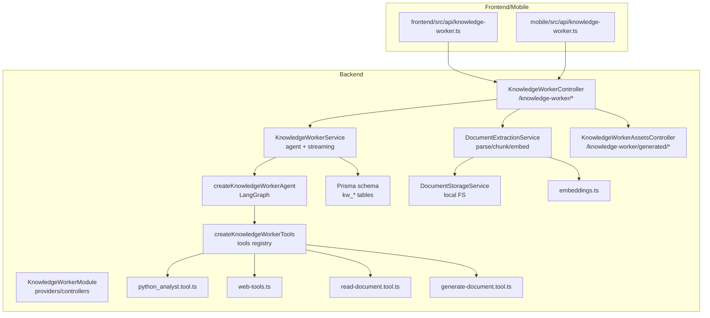
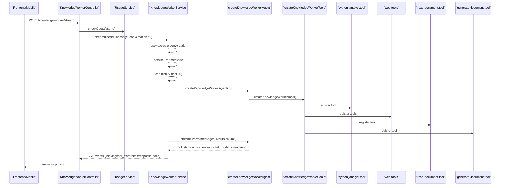
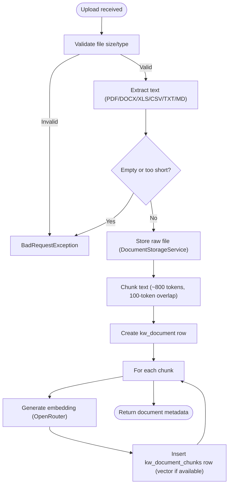
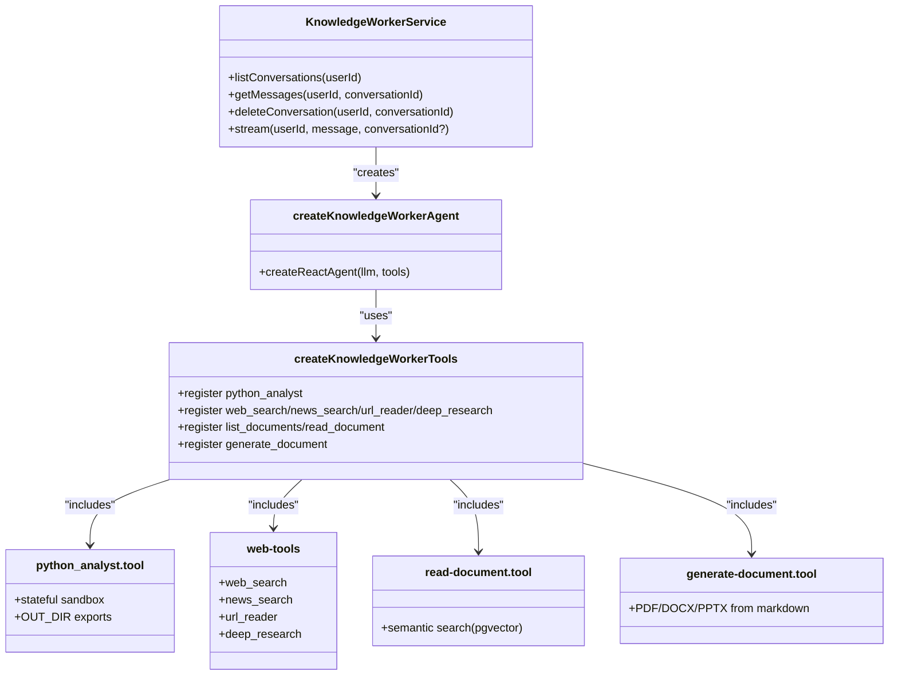
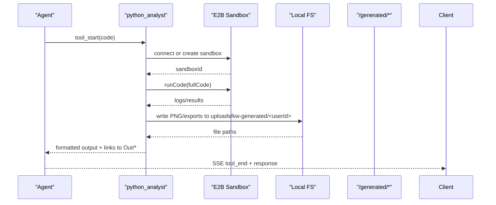
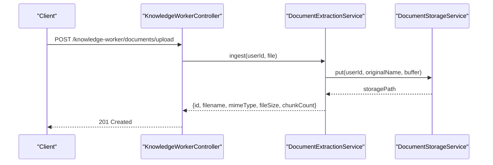
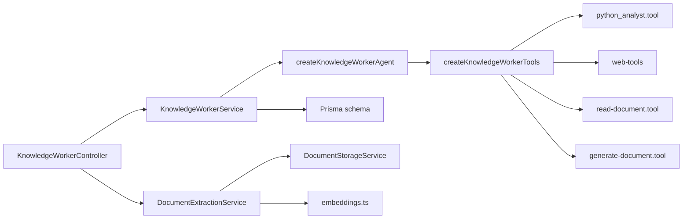

# Knowledge Worker

<cite>
**Referenced Files in This Document**
- [knowledge-worker.module.ts](file://backend/src/knowledge-worker/knowledge-worker.module.ts)
- [knowledge-worker.controller.ts](file://backend/src/knowledge-worker/knowledge-worker.controller.ts)
- [knowledge-worker.service.ts](file://backend/src/knowledge-worker/knowledge-worker.service.ts)
- [document-extraction.service.ts](file://backend/src/knowledge-worker/services/document-extraction.service.ts)
- [document-storage.service.ts](file://backend/src/knowledge-worker/services/document-storage.service.ts)
- [kw-agent.ts](file://backend/src/knowledge-worker/graph/kw-agent.ts)
- [kw-tools.ts](file://backend/src/knowledge-worker/graph/tools/kw-tools.ts)
- [python-analyst.tool.ts](file://backend/src/knowledge-worker/graph/tools/python-analyst.tool.ts)
- [web-tools.ts](file://backend/src/knowledge-worker/graph/tools/web-tools.ts)
- [read-document.tool.ts](file://backend/src/knowledge-worker/graph/tools/read-document.tool.ts)
- [generate-document.tool.ts](file://backend/src/knowledge-worker/graph/tools/generate-document.tool.ts)
- [embeddings.ts](file://backend/src/orchestration/graph/utils/embeddings.ts)
- [schema.prisma](file://backend/prisma/schema.prisma)
- [knowledge-worker.ts (frontend)](file://frontend/src/api/knowledge-worker.ts)
- [knowledge-worker.ts (mobile)](file://mobile/src/api/knowledge-worker.ts)
- [kw-stream.dto.ts](file://backend/src/knowledge-worker/dto/kw-stream.dto.ts)
</cite>

## Table of Contents
1. [Introduction](#introduction)
2. [Project Structure](#project-structure)
3. [Core Components](#core-components)
4. [Architecture Overview](#architecture-overview)
5. [Detailed Component Analysis](#detailed-component-analysis)
6. [Dependency Analysis](#dependency-analysis)
7. [Performance Considerations](#performance-considerations)
8. [Troubleshooting Guide](#troubleshooting-guide)
9. [Conclusion](#conclusion)
10. [Appendices](#appendices)

## Introduction
The Knowledge Worker enables premium subscribers to perform research, analysis, document understanding, and content creation through an AI agent equipped with specialized tools. It supports:
- Streaming conversations with structured SSE events
- Web search and URL reading
- Semantic retrieval over user-uploaded documents
- Data analysis via a stateful Python sandbox
- Generation of styled PDFs, DOCX, and PPTX documents
- Secure document upload, storage, and retrieval
- Conversation and document lifecycle management

## Project Structure
The Knowledge Worker spans backend NestJS modules, controllers, services, and LangGraph agents, with database models defined in Prisma and client-side APIs for web and mobile.

**Diagram sources**
- [knowledge-worker.module.ts:10-19](file://backend/src/knowledge-worker/knowledge-worker.module.ts#L10-L19)
- [knowledge-worker.controller.ts:35-130](file://backend/src/knowledge-worker/knowledge-worker.controller.ts#L35-L130)
- [knowledge-worker.controller.ts:139-219](file://backend/src/knowledge-worker/knowledge-worker.controller.ts#L139-L219)
- [knowledge-worker.service.ts:91-113](file://backend/src/knowledge-worker/knowledge-worker.service.ts#L91-L113)
- [kw-agent.ts:16-51](file://backend/src/knowledge-worker/graph/kw-agent.ts#L16-L51)
- [kw-tools.ts:15-41](file://backend/src/knowledge-worker/graph/tools/kw-tools.ts#L15-L41)
- [python-analyst.tool.ts:34-238](file://backend/src/knowledge-worker/graph/tools/python-analyst.tool.ts#L34-L238)
- [web-tools.ts:18-149](file://backend/src/knowledge-worker/graph/tools/web-tools.ts#L18-L149)
- [read-document.tool.ts:11-87](file://backend/src/knowledge-worker/graph/tools/read-document.tool.ts#L11-L87)
- [generate-document.tool.ts:39-85](file://backend/src/knowledge-worker/graph/tools/generate-document.tool.ts#L39-L85)
- [document-extraction.service.ts:27-38](file://backend/src/knowledge-worker/services/document-extraction.service.ts#L27-L38)
- [document-storage.service.ts:13-54](file://backend/src/knowledge-worker/services/document-storage.service.ts#L13-L54)
- [embeddings.ts:17-82](file://backend/src/orchestration/graph/utils/embeddings.ts#L17-L82)
- [schema.prisma:718-762](file://backend/prisma/schema.prisma#L718-L762)
- [knowledge-worker.ts (frontend):41-131](file://frontend/src/api/knowledge-worker.ts#L41-L131)
- [knowledge-worker.ts (mobile):97-153](file://mobile/src/api/knowledge-worker.ts#L97-L153)

**Section sources**
- [knowledge-worker.module.ts:1-20](file://backend/src/knowledge-worker/knowledge-worker.module.ts#L1-L20)
- [knowledge-worker.controller.ts:35-219](file://backend/src/knowledge-worker/knowledge-worker.controller.ts#L35-L219)
- [schema.prisma:718-762](file://backend/prisma/schema.prisma#L718-L762)

## Core Components
- KnowledgeWorkerController: Exposes endpoints for conversations, document management, and streaming. Applies JWT and Premium guards, enforces quotas, and streams SSE events.
- KnowledgeWorkerService: Orchestrates agent creation, manages conversation persistence, history injection, and SSE event emission.
- DocumentExtractionService: Validates, parses, chunks, embeds, and persists user documents; stores raw files and inserts vector chunks.
- DocumentStorageService: Provides a small abstraction for storing/retrieving files under user-scoped paths.
- createKnowledgeWorkerAgent: Creates a LangGraph React agent with a curated toolset bound to the current user and conversation.
- Tool suite: python_analyst (stateful E2B sandbox), web_search/news_search/url_reader/deep_research (Tavily), read_document (pgvector over user chunks), generate_document (PDF/DOCX/PPTX).
- Prisma models: kw_conversations, kw_messages, kw_documents, and raw SQL-managed kw_document_chunks with vector(1536).

**Section sources**
- [knowledge-worker.controller.ts:35-219](file://backend/src/knowledge-worker/knowledge-worker.controller.ts#L35-L219)
- [knowledge-worker.service.ts:91-344](file://backend/src/knowledge-worker/knowledge-worker.service.ts#L91-L344)
- [document-extraction.service.ts:27-239](file://backend/src/knowledge-worker/services/document-extraction.service.ts#L27-L239)
- [document-storage.service.ts:13-54](file://backend/src/knowledge-worker/services/document-storage.service.ts#L13-L54)
- [kw-agent.ts:16-51](file://backend/src/knowledge-worker/graph/kw-agent.ts#L16-L51)
- [kw-tools.ts:15-41](file://backend/src/knowledge-worker/graph/tools/kw-tools.ts#L15-L41)
- [schema.prisma:718-762](file://backend/prisma/schema.prisma#L718-L762)

## Architecture Overview
The Knowledge Worker integrates client streaming with a LangGraph agent and a set of specialized tools. The agent emits structured SSE events mirroring the core chat pipeline, enabling responsive UI updates.

**Diagram sources**
- [knowledge-worker.controller.ts:63-93](file://backend/src/knowledge-worker/knowledge-worker.controller.ts#L63-L93)
- [knowledge-worker.service.ts:164-343](file://backend/src/knowledge-worker/knowledge-worker.service.ts#L164-L343)
- [kw-agent.ts:16-51](file://backend/src/knowledge-worker/graph/kw-agent.ts#L16-L51)
- [kw-tools.ts:15-41](file://backend/src/knowledge-worker/graph/tools/kw-tools.ts#L15-L41)
- [python-analyst.tool.ts:34-238](file://backend/src/knowledge-worker/graph/tools/python-analyst.tool.ts#L34-L238)
- [web-tools.ts:18-149](file://backend/src/knowledge-worker/graph/tools/web-tools.ts#L18-L149)
- [read-document.tool.ts:11-87](file://backend/src/knowledge-worker/graph/tools/read-document.tool.ts#L11-L87)
- [generate-document.tool.ts:39-85](file://backend/src/knowledge-worker/graph/tools/generate-document.tool.ts#L39-L85)

## Detailed Component Analysis

### Document Processing Pipeline
End-to-end ingestion and preparation of user documents for semantic search:
- Validation: size limit, supported MIME types, and effective MIME resolution
- Extraction: PDF, DOCX, XLS/XLSX, CSV, TXT, MD via dedicated parsers
- Storage: raw file stored under user-scoped path
- Chunking: paragraph-aware segmentation with overlap (~800 tokens)
- Embedding: OpenRouter embeddings via embeddings utility with retries
- Persistence: document metadata and chunk rows with optional embeddings

**Diagram sources**
- [document-extraction.service.ts:41-111](file://backend/src/knowledge-worker/services/document-extraction.service.ts#L41-L111)
- [document-extraction.service.ts:163-192](file://backend/src/knowledge-worker/services/document-extraction.service.ts#L163-L192)
- [document-extraction.service.ts:198-238](file://backend/src/knowledge-worker/services/document-extraction.service.ts#L198-L238)
- [embeddings.ts:17-82](file://backend/src/orchestration/graph/utils/embeddings.ts#L17-L82)
- [schema.prisma:748-762](file://backend/prisma/schema.prisma#L748-L762)

**Section sources**
- [document-extraction.service.ts:27-239](file://backend/src/knowledge-worker/services/document-extraction.service.ts#L27-L239)
- [embeddings.ts:17-82](file://backend/src/orchestration/graph/utils/embeddings.ts#L17-L82)
- [schema.prisma:748-762](file://backend/prisma/schema.prisma#L748-L762)

### AI Assistant Functionality and Research Automation
- Agent creation: per-request agent with tools bound to userId, conversationId, and API keys
- Tool set:
  - python_analyst: stateful E2B sandbox with persistent variables and OUT_DIR exports
  - web_search/news_search/url_reader/deep_research: Tavily-powered search with AI summaries and citations
  - read_document: pgvector similarity search over user’s chunks
  - generate_document: styled PDF/DOCX/PPTX from markdown
- Streaming: emits structured SSE events for UI rendering

**Diagram sources**
- [knowledge-worker.service.ts:91-344](file://backend/src/knowledge-worker/knowledge-worker.service.ts#L91-L344)
- [kw-agent.ts:16-51](file://backend/src/knowledge-worker/graph/kw-agent.ts#L16-L51)
- [kw-tools.ts:15-41](file://backend/src/knowledge-worker/graph/tools/kw-tools.ts#L15-L41)
- [python-analyst.tool.ts:34-238](file://backend/src/knowledge-worker/graph/tools/python-analyst.tool.ts#L34-L238)
- [web-tools.ts:18-149](file://backend/src/knowledge-worker/graph/tools/web-tools.ts#L18-L149)
- [read-document.tool.ts:11-87](file://backend/src/knowledge-worker/graph/tools/read-document.tool.ts#L11-L87)
- [generate-document.tool.ts:39-85](file://backend/src/knowledge-worker/graph/tools/generate-document.tool.ts#L39-L85)

**Section sources**
- [knowledge-worker.service.ts:91-344](file://backend/src/knowledge-worker/knowledge-worker.service.ts#L91-L344)
- [kw-agent.ts:16-51](file://backend/src/knowledge-worker/graph/kw-agent.ts#L16-L51)
- [kw-tools.ts:15-41](file://backend/src/knowledge-worker/graph/tools/kw-tools.ts#L15-L41)
- [python-analyst.tool.ts:34-238](file://backend/src/knowledge-worker/graph/tools/python-analyst.tool.ts#L34-L238)
- [web-tools.ts:18-149](file://backend/src/knowledge-worker/graph/tools/web-tools.ts#L18-L149)
- [read-document.tool.ts:11-87](file://backend/src/knowledge-worker/graph/tools/read-document.tool.ts#L11-L87)
- [generate-document.tool.ts:39-85](file://backend/src/knowledge-worker/graph/tools/generate-document.tool.ts#L39-L85)

### Tool Execution Framework
- python_analyst:
  - Resumes or creates a stateful E2B sandbox per conversation
  - Preloads OUT_DIR for file exports
  - Captures stdout/stderr/results and publishes images and downloadable artifacts
- web-tools:
  - web_search/news_search: Tavily search with AI answer and cited sources
  - url_reader: fetch + parse or fallback to Tavily extract
  - deep_research: advanced multi-hop with deeper extracts
- read_document:
  - Generates query embedding and performs pgvector similarity search scoped to user
- generate_document:
  - Renders markdown to PDF/DOCX/PPTX with headings, lists, tables, and links

**Diagram sources**
- [python-analyst.tool.ts:40-216](file://backend/src/knowledge-worker/graph/tools/python-analyst.tool.ts#L40-L216)
- [knowledge-worker.controller.ts:150-153](file://backend/src/knowledge-worker/knowledge-worker.controller.ts#L150-L153)

**Section sources**
- [python-analyst.tool.ts:34-238](file://backend/src/knowledge-worker/graph/tools/python-analyst.tool.ts#L34-L238)
- [web-tools.ts:18-149](file://backend/src/knowledge-worker/graph/tools/web-tools.ts#L18-L149)
- [read-document.tool.ts:11-87](file://backend/src/knowledge-worker/graph/tools/read-document.tool.ts#L11-L87)
- [generate-document.tool.ts:39-85](file://backend/src/knowledge-worker/graph/tools/generate-document.tool.ts#L39-L85)

### Document Upload and Storage System
- Upload endpoint validates file size and type, delegates to DocumentExtractionService
- Stores raw file under user-scoped path; returns document metadata
- Download endpoint serves generated files via signed URLs or local streaming

**Diagram sources**
- [knowledge-worker.controller.ts:97-113](file://backend/src/knowledge-worker/knowledge-worker.controller.ts#L97-L113)
- [document-extraction.service.ts:41-111](file://backend/src/knowledge-worker/services/document-extraction.service.ts#L41-L111)
- [document-storage.service.ts:24-35](file://backend/src/knowledge-worker/services/document-storage.service.ts#L24-L35)

**Section sources**
- [knowledge-worker.controller.ts:97-123](file://backend/src/knowledge-worker/knowledge-worker.controller.ts#L97-L123)
- [document-extraction.service.ts:27-137](file://backend/src/knowledge-worker/services/document-extraction.service.ts#L27-L137)
- [document-storage.service.ts:13-54](file://backend/src/knowledge-worker/services/document-storage.service.ts#L13-L54)

### Vector Embedding Generation
- Uses OpenRouter embeddings endpoint with OpenAI text-embedding-3-small
- Implements exponential backoff retries for 429/5xx errors
- Truncates input to 8000 characters and returns 1536-dim vectors

**Section sources**
- [embeddings.ts:17-82](file://backend/src/orchestration/graph/utils/embeddings.ts#L17-L82)
- [document-extraction.service.ts:84-99](file://backend/src/knowledge-worker/services/document-extraction.service.ts#L84-L99)

### API Endpoints
- Conversations
  - GET /knowledge-worker/conversations
  - GET /knowledge-worker/conversations/:id/messages
  - DELETE /knowledge-worker/conversations/:id
- Streaming
  - POST /knowledge-worker/stream (SSE)
- Documents
  - POST /knowledge-worker/documents/upload
  - GET /knowledge-worker/documents
  - DELETE /knowledge-worker/documents/:id
- Generated Assets (public)
  - GET /knowledge-worker/generated/:filename

Client bindings:
- Frontend: knowledgeWorkerApi with SSE parsing and multipart uploads
- Mobile: XMLHttpRequest-based SSE streaming and FormData uploads

**Section sources**
- [knowledge-worker.controller.ts:48-219](file://backend/src/knowledge-worker/knowledge-worker.controller.ts#L48-L219)
- [kw-stream.dto.ts:3-12](file://backend/src/knowledge-worker/dto/kw-stream.dto.ts#L3-L12)
- [knowledge-worker.ts (frontend):41-131](file://frontend/src/api/knowledge-worker.ts#L41-L131)
- [knowledge-worker.ts (mobile):97-153](file://mobile/src/api/knowledge-worker.ts#L97-L153)

### Examples of Workflows

- Document analysis workflow
  - Upload document → ingestion pipeline (parse/chunk/embed) → user can refer to “my document” → read_document tool retrieves relevant chunks → python_analyst performs computations and optionally generates files → download links surfaced to user
- AI assistant interaction
  - Client sends message via SSE stream → service resolves/creates conversation → agent emits thinking/tool_start/token/response/done → client renders incremental UI updates
- Tool execution patterns
  - web_search/news_search for current facts
  - deep_research for multi-hop synthesis
  - url_reader for specific page content
  - generate_document for styled deliverables

[No sources needed since this section describes workflows conceptually]

## Dependency Analysis
- Controllers depend on services and guards for premium access
- Services depend on Prisma for persistence and LangGraph agent for orchestration
- Tools encapsulate external integrations (E2B, Tavily) behind unified interfaces
- Document pipeline depends on storage and embedding utilities

**Diagram sources**
- [knowledge-worker.controller.ts:35-130](file://backend/src/knowledge-worker/knowledge-worker.controller.ts#L35-L130)
- [knowledge-worker.service.ts:91-113](file://backend/src/knowledge-worker/knowledge-worker.service.ts#L91-L113)
- [kw-agent.ts:16-51](file://backend/src/knowledge-worker/graph/kw-agent.ts#L16-L51)
- [kw-tools.ts:15-41](file://backend/src/knowledge-worker/graph/tools/kw-tools.ts#L15-L41)
- [python-analyst.tool.ts:34-238](file://backend/src/knowledge-worker/graph/tools/python-analyst.tool.ts#L34-L238)
- [web-tools.ts:18-149](file://backend/src/knowledge-worker/graph/tools/web-tools.ts#L18-L149)
- [read-document.tool.ts:11-87](file://backend/src/knowledge-worker/graph/tools/read-document.tool.ts#L11-L87)
- [generate-document.tool.ts:39-85](file://backend/src/knowledge-worker/graph/tools/generate-document.tool.ts#L39-L85)
- [document-extraction.service.ts:27-38](file://backend/src/knowledge-worker/services/document-extraction.service.ts#L27-L38)
- [document-storage.service.ts:13-54](file://backend/src/knowledge-worker/services/document-storage.service.ts#L13-L54)
- [embeddings.ts:17-82](file://backend/src/orchestration/graph/utils/embeddings.ts#L17-L82)
- [schema.prisma:718-762](file://backend/prisma/schema.prisma#L718-L762)

**Section sources**
- [knowledge-worker.module.ts:10-19](file://backend/src/knowledge-worker/knowledge-worker.module.ts#L10-L19)
- [schema.prisma:718-762](file://backend/prisma/schema.prisma#L718-L762)

## Performance Considerations
- Streaming and SSE: Minimal buffering and immediate event emission reduce perceived latency
- Embedding retries: Backoff strategy prevents cascading failures on external API throttling
- Chunk sizing: ~800 tokens with 100-token overlap balances recall and cost
- File size limits: 25 MB upload cap controls ingestion resource usage
- Sandbox reuse: Persistent E2B sandbox per conversation reduces cold-start overhead
- Rate limiting: Controller-level throttle guard and usage quota checks prevent abuse
- Database: pgvector index on kw_document_chunks supports efficient similarity search

[No sources needed since this section provides general guidance]

## Troubleshooting Guide
- Missing environment variables:
  - E2B_API_KEY: python_analyst tool reports not configured
  - TAVILY_API_KEY: web tools report not configured
  - OPENROUTER_API_KEY: embeddings and agent model access
- Upload errors:
  - Unsupported type or empty content triggers BadRequestException
  - Storage path validation prevents path traversal
- Streaming issues:
  - Network interruptions handled by client-side SSE readers
  - Server-side error mapped to a single error event followed by done
- Generated assets:
  - Filename validation ensures UUID-based, unguessable names
  - Local fallback scans user directories for dev environments

**Section sources**
- [python-analyst.tool.ts:42-44](file://backend/src/knowledge-worker/graph/tools/python-analyst.tool.ts#L42-L44)
- [web-tools.ts:21-22](file://backend/src/knowledge-worker/graph/tools/web-tools.ts#L21-L22)
- [document-extraction.service.ts:52-62](file://backend/src/knowledge-worker/services/document-extraction.service.ts#L52-L62)
- [knowledge-worker.controller.ts:165-170](file://backend/src/knowledge-worker/knowledge-worker.controller.ts#L165-L170)
- [knowledge-worker.controller.ts:166-170](file://backend/src/knowledge-worker/knowledge-worker.controller.ts#L166-L170)
- [knowledge-worker.controller.ts:156-170](file://backend/src/knowledge-worker/knowledge-worker.controller.ts#L156-L170)
- [knowledge-worker.controller.ts:166-170](file://backend/src/knowledge-worker/knowledge-worker.controller.ts#L166-L170)
- [knowledge-worker.controller.ts:165-170](file://backend/src/knowledge-worker/knowledge-worker.controller.ts#L165-L170)
- [knowledge-worker.controller.ts:166-170](file://backend/src/knowledge-worker/knowledge-worker.controller.ts#L166-L170)
- [knowledge-worker.controller.ts:156-170](file://backend/src/knowledge-worker/knowledge-worker.controller.ts#L156-L170)
- [knowledge-worker.controller.ts:165-170](file://backend/src/knowledge-worker/knowledge-worker.controller.ts#L165-L170)
- [knowledge-worker.controller.ts:166-170](file://backend/src/knowledge-worker/knowledge-worker.controller.ts#L166-L170)
- [knowledge-worker.controller.ts:156-170](file://backend/src/knowledge-worker/knowledge-worker.controller.ts#L156-L170)
- [knowledge-worker.controller.ts:165-170](file://backend/src/knowledge-worker/knowledge-worker.controller.ts#L165-L170)
- [knowledge-worker.controller.ts:166-170](file://backend/src/knowledge-worker/knowledge-worker.controller.ts#L166-L170)
- [knowledge-worker.controller.ts:156-170](file://backend/src/knowledge-worker/knowledge-worker.controller.ts#L156-L170)
- [knowledge-worker.controller.ts:165-170](file://backend/src/knowledge-worker/knowledge-worker.controller.ts#L165-L170)
- [knowledge-worker.controller.ts:166-170](file://backend/src/knowledge-worker/knowledge-worker.controller.ts#L166-L170)
- [knowledge-worker.controller.ts:156-170](file://backend/src/knowledge-worker/knowledge-worker.controller.ts#L156-L170)
- [knowledge-worker.controller.ts:165-170](file://backend/src/knowledge-worker/knowledge-worker.controller.ts#L165-L170)
- [knowledge-worker.controller.ts:166-170](file://backend/src/knowledge-worker/knowledge-worker.controller.ts#L166-L170)
- [knowledge-worker.controller.ts:156-170](file://backend/src/knowledge-worker/knowledge-worker.controller.ts#L156-L170)
- [knowledge-worker.controller.ts:165-170](file://backend/src/knowledge-worker/knowledge-worker.controller.ts#L165-L170)
- [knowledge-worker.controller.ts:166-170](file://backend/src/knowledge-worker/knowledge-worker.controller.ts#L166-L170)
- [knowledge-worker.controller.ts:156-170](file://backend/src/knowledge-worker/knowledge-worker.controller.ts#L156-L170)
- [knowledge-worker.controller.ts:165-170](file://backend/src/knowledge-worker/knowledge-worker.controller.ts#L165-L170)
- [knowledge-worker.controller.ts](file://backend/src/knowledge-worker/knowledge-worker.controller.ts......)

## Conclusion
The Knowledge Worker provides a robust, modular system for premium users to research, analyze, and create content with an AI agent. Its toolset integrates secure document handling, stateful computation, and reliable external APIs, while the SSE streaming and quota enforcement ensure a responsive and sustainable user experience.

[No sources needed since this section summarizes without analyzing specific files]

## Appendices

### Database Schema Highlights
- kw_conversations: per-user conversations with optional E2B sandbox ID
- kw_messages: conversation messages including tool invocations
- kw_documents: user document metadata and storage path
- kw_document_chunks: vector-backed chunks for pgvector similarity search

**Section sources**
- [schema.prisma:718-762](file://backend/prisma/schema.prisma#L718-L762)