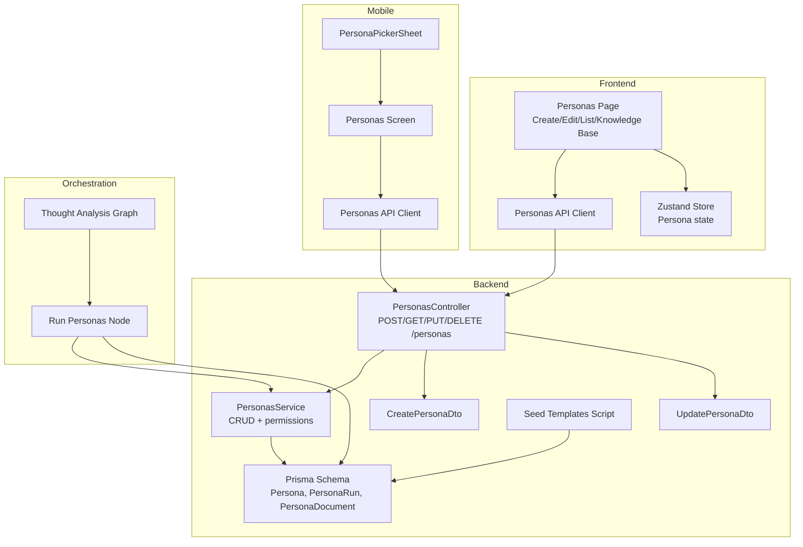
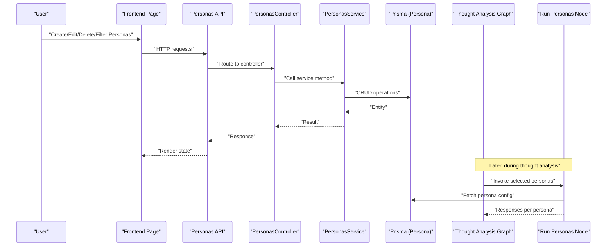
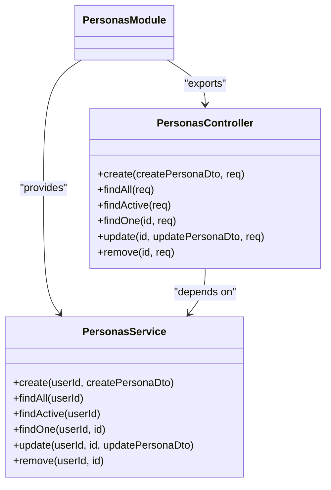
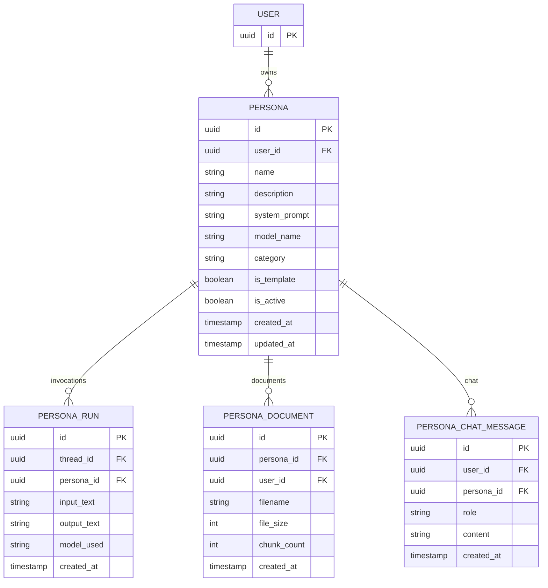
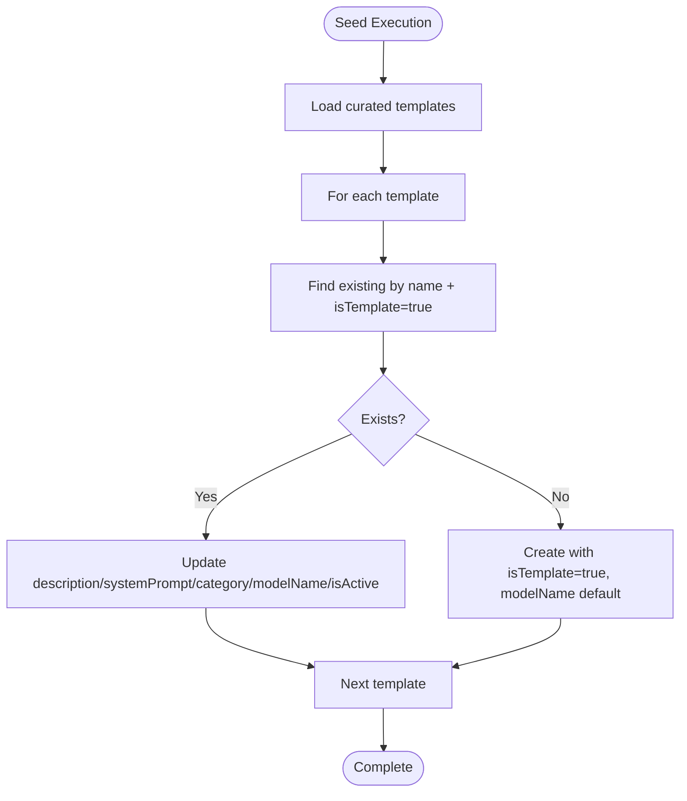
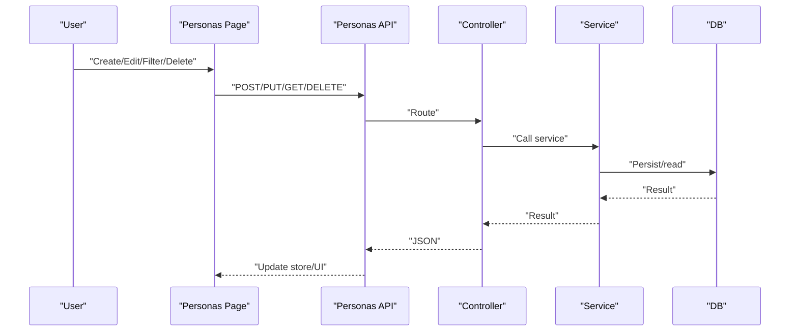
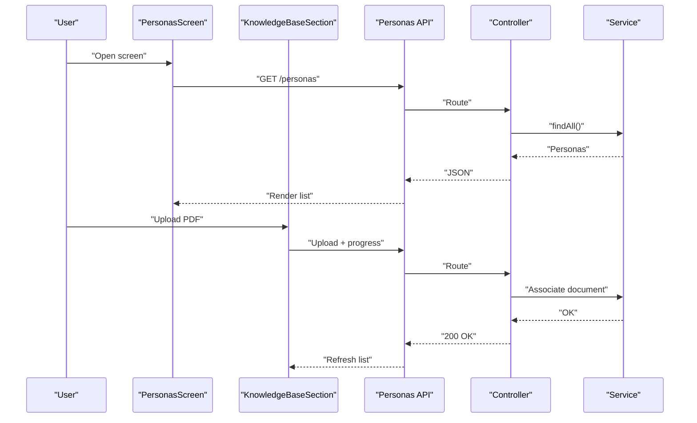
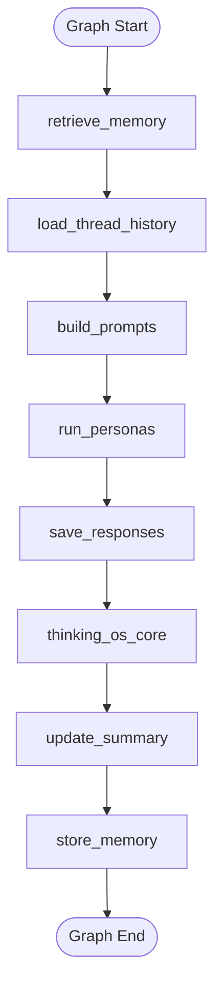
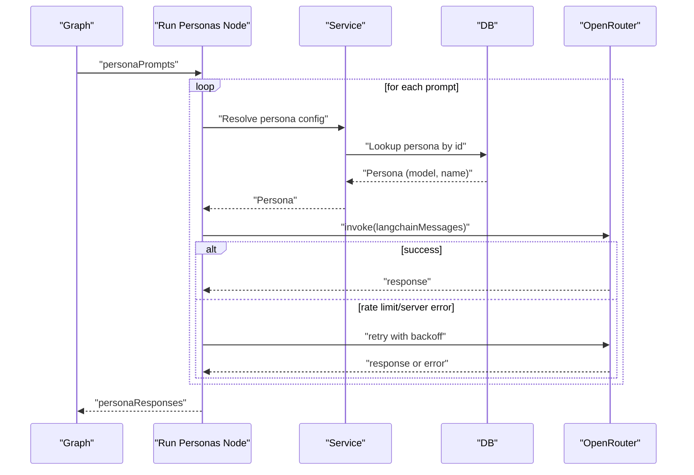
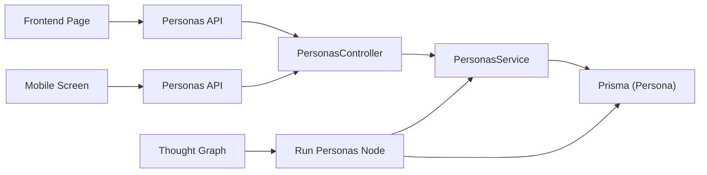

# Persona Management

<cite>
**Referenced Files in This Document**
- [personas.controller.ts](file://backend/src/personas/personas.controller.ts)
- [personas.service.ts](file://backend/src/personas/personas.service.ts)
- [personas.module.ts](file://backend/src/personas/personas.module.ts)
- [create-persona.dto.ts](file://backend/src/personas/dto/create-persona.dto.ts)
- [update-persona.dto.ts](file://backend/src/personas/dto/update-persona.dto.ts)
- [seed-persona-templates.ts](file://backend/scripts/seed-persona-templates.ts)
- [schema.prisma](file://backend/prisma/schema.prisma)
- [personas.ts](file://frontend/src/pages/Personas.tsx)
- [personaStore.ts](file://frontend/src/store/personaStore.ts)
- [personas.ts](file://frontend/src/api/personas.ts)
- [PersonasScreen.tsx](file://mobile/src/screens/PersonasScreen.tsx)
- [PersonaPickerSheet.tsx](file://mobile/src/components/PersonaPickerSheet.tsx)
- [personas.ts](file://mobile/src/api/personas.ts)
- [thought-analysis.graph.ts](file://backend/src/orchestration/graph/thought-analysis.graph.ts)
- [run-personas.node.ts](file://backend/src/orchestration/graph/nodes/run-personas.node.ts)
</cite>

## Table of Contents
1. [Introduction](#introduction)
2. [Project Structure](#project-structure)
3. [Core Components](#core-components)
4. [Architecture Overview](#architecture-overview)
5. [Detailed Component Analysis](#detailed-component-analysis)
6. [Dependency Analysis](#dependency-analysis)
7. [Performance Considerations](#performance-considerations)
8. [Troubleshooting Guide](#troubleshooting-guide)
9. [Conclusion](#conclusion)
10. [Appendices](#appendices)

## Introduction
This document explains the persona management system that enables users to create, customize, and manage multiple AI personas for different aspects of their lives. It covers the persona template library, customization options, lifecycle management, the persona selection interface, and how personas interact with the thought analysis system. It also documents the API endpoints for persona CRUD operations, the template seeding process, and persona performance optimization and resource management.

## Project Structure
The persona management system spans backend NestJS modules, frontend React/React Native pages, and a Prisma schema that defines the persona entity and related relationships.

**Diagram sources**
- [personas.controller.ts:17-55](file://backend/src/personas/personas.controller.ts#L17-L55)
- [personas.service.ts:10-103](file://backend/src/personas/personas.service.ts#L10-L103)
- [create-persona.dto.ts:3-21](file://backend/src/personas/dto/create-persona.dto.ts#L3-L21)
- [update-persona.dto.ts:3-27](file://backend/src/personas/dto/update-persona.dto.ts#L3-L27)
- [schema.prisma:108-128](file://backend/prisma/schema.prisma#L108-L128)
- [seed-persona-templates.ts:90-139](file://backend/scripts/seed-persona-templates.ts#L90-L139)
- [personas.ts:35-556](file://frontend/src/pages/Personas.tsx#L35-L556)
- [personaStore.ts:16-38](file://frontend/src/store/personaStore.ts#L16-L38)
- [personas.ts:19-48](file://frontend/src/api/personas.ts#L19-L48)
- [PersonasScreen.tsx:145-311](file://mobile/src/screens/PersonasScreen.tsx#L145-L311)
- [PersonaPickerSheet.tsx:38-159](file://mobile/src/components/PersonaPickerSheet.tsx#L38-L159)
- [personas.ts:33-62](file://mobile/src/api/personas.ts#L33-L62)
- [thought-analysis.graph.ts:29-67](file://backend/src/orchestration/graph/thought-analysis.graph.ts#L29-L67)
- [run-personas.node.ts:80-124](file://backend/src/orchestration/graph/nodes/run-personas.node.ts#L80-L124)

**Section sources**
- [personas.controller.ts:17-55](file://backend/src/personas/personas.controller.ts#L17-L55)
- [personas.service.ts:10-103](file://backend/src/personas/personas.service.ts#L10-L103)
- [schema.prisma:108-128](file://backend/prisma/schema.prisma#L108-L128)
- [seed-persona-templates.ts:90-139](file://backend/scripts/seed-persona-templates.ts#L90-L139)
- [personas.ts:35-556](file://frontend/src/pages/Personas.tsx#L35-L556)
- [personaStore.ts:16-38](file://frontend/src/store/personaStore.ts#L16-L38)
- [personas.ts:19-48](file://frontend/src/api/personas.ts#L19-L48)
- [PersonasScreen.tsx:145-311](file://mobile/src/screens/PersonasScreen.tsx#L145-L311)
- [PersonaPickerSheet.tsx:38-159](file://mobile/src/components/PersonaPickerSheet.tsx#L38-L159)
- [personas.ts:33-62](file://mobile/src/api/personas.ts#L33-L62)
- [thought-analysis.graph.ts:29-67](file://backend/src/orchestration/graph/thought-analysis.graph.ts#L29-L67)
- [run-personas.node.ts:80-124](file://backend/src/orchestration/graph/nodes/run-personas.node.ts#L80-L124)

## Core Components
- Backend module: exposes persona CRUD endpoints under /personas, guarded by JWT authentication, and enforces ownership and template restrictions.
- Service layer: implements create, list (all and active), read, update, and soft-delete (deactivate) with permission checks.
- DTOs: strongly-typed request bodies for creation and updates.
- Frontend pages: create, edit, list, filter, and associate knowledge base documents per persona.
- Mobile screens: similar UX with a bottom-sheet persona picker for multi-select.
- Orchestration: thought analysis graph invokes selected personas’ LLM calls with retry/fallback logic.

**Section sources**
- [personas.controller.ts:17-55](file://backend/src/personas/personas.controller.ts#L17-L55)
- [personas.service.ts:10-103](file://backend/src/personas/personas.service.ts#L10-L103)
- [create-persona.dto.ts:3-21](file://backend/src/personas/dto/create-persona.dto.ts#L3-L21)
- [update-persona.dto.ts:3-27](file://backend/src/personas/dto/update-persona.dto.ts#L3-L27)
- [personas.ts:35-556](file://frontend/src/pages/Personas.tsx#L35-L556)
- [PersonasScreen.tsx:145-311](file://mobile/src/screens/PersonasScreen.tsx#L145-L311)
- [thought-analysis.graph.ts:29-67](file://backend/src/orchestration/graph/thought-analysis.graph.ts#L29-L67)

## Architecture Overview
The persona lifecycle integrates user-facing UI with backend services and the thought analysis pipeline.

**Diagram sources**
- [personas.controller.ts:22-54](file://backend/src/personas/personas.controller.ts#L22-L54)
- [personas.service.ts:10-103](file://backend/src/personas/personas.service.ts#L10-L103)
- [schema.prisma:108-128](file://backend/prisma/schema.prisma#L108-L128)
- [personas.ts:61-131](file://frontend/src/pages/Personas.tsx#L61-L131)
- [personas.ts:19-48](file://frontend/src/api/personas.ts#L19-L48)
- [thought-analysis.graph.ts:29-67](file://backend/src/orchestration/graph/thought-analysis.graph.ts#L29-L67)
- [run-personas.node.ts:80-124](file://backend/src/orchestration/graph/nodes/run-personas.node.ts#L80-L124)

## Detailed Component Analysis

### Backend: Personas Module
- Controller: Exposes endpoints for create, list all, list active, read by id, update, and delete. Uses JWT guard and injects user id from request context.
- Service: Implements business logic with ownership checks and template protections; supports soft-deletion by toggling isActive.
- Module: Exports service/controller for dependency injection.

**Diagram sources**
- [personas.controller.ts:17-55](file://backend/src/personas/personas.controller.ts#L17-L55)
- [personas.service.ts:10-103](file://backend/src/personas/personas.service.ts#L10-L103)
- [personas.module.ts:5-10](file://backend/src/personas/personas.module.ts#L5-L10)

**Section sources**
- [personas.controller.ts:17-55](file://backend/src/personas/personas.controller.ts#L17-L55)
- [personas.service.ts:10-103](file://backend/src/personas/personas.service.ts#L10-L103)
- [personas.module.ts:5-10](file://backend/src/personas/personas.module.ts#L5-L10)

### DTOs: Validation and Shape
- CreatePersonaDto: name, description (optional), systemPrompt, modelName (optional), category (optional).
- UpdatePersonaDto: same fields as create plus optional isActive flag.

These DTOs define the shape of persona creation and updates and are validated by the controller.

**Section sources**
- [create-persona.dto.ts:3-21](file://backend/src/personas/dto/create-persona.dto.ts#L3-L21)
- [update-persona.dto.ts:3-27](file://backend/src/personas/dto/update-persona.dto.ts#L3-L27)

### Database Schema: Persona Entity and Relationships
- Persona model includes: id, userId (nullable for templates), name, description, systemPrompt, modelName, category, isTemplate, isActive, timestamps.
- Indexes and relations: isTemplate index; relations to User, PersonaRun, PersonaDocument, PersonaChatMessage.
- Related entities: PersonaRun (LLM invocation logs), PersonaDocument (documents associated with a persona), and PersonaChatMessage (chat history scoped to a persona).

**Diagram sources**
- [schema.prisma:108-128](file://backend/prisma/schema.prisma#L108-L128)
- [schema.prisma:144-157](file://backend/prisma/schema.prisma#L144-L157)
- [schema.prisma:318-346](file://backend/prisma/schema.prisma#L318-L346)
- [schema.prisma:501-514](file://backend/prisma/schema.prisma#L501-L514)

**Section sources**
- [schema.prisma:108-128](file://backend/prisma/schema.prisma#L108-L128)
- [schema.prisma:144-157](file://backend/prisma/schema.prisma#L144-L157)
- [schema.prisma:318-346](file://backend/prisma/schema.prisma#L318-L346)
- [schema.prisma:501-514](file://backend/prisma/schema.prisma#L501-L514)

### Persona Template System and Seeding
- Templates are curated persona definitions inserted with isTemplate=true and userId=null.
- The seed script upserts templates by name and category, ensuring idempotency and safe re-runs.
- Users see library templates alongside their own personas; templates cannot be edited or deleted.

**Diagram sources**
- [seed-persona-templates.ts:90-139](file://backend/scripts/seed-persona-templates.ts#L90-L139)

**Section sources**
- [seed-persona-templates.ts:90-139](file://backend/scripts/seed-persona-templates.ts#L90-L139)

### Frontend: Personas Page and Store
- Filtering: All, Mine, and categories.
- Forms: Create and Edit with name, description, model selection, and systemPrompt.
- Knowledge Base: Attach PDFs per persona; displays document metadata and progress.
- Store: Zustand manages persona list and individual updates/deletes.

**Diagram sources**
- [personas.ts:61-131](file://frontend/src/pages/Personas.tsx#L61-L131)
- [personas.ts:19-48](file://frontend/src/api/personas.ts#L19-L48)
- [personas.controller.ts:22-54](file://backend/src/personas/personas.controller.ts#L22-L54)
- [personas.service.ts:10-103](file://backend/src/personas/personas.service.ts#L10-L103)

**Section sources**
- [personas.ts:35-556](file://frontend/src/pages/Personas.tsx#L35-L556)
- [personaStore.ts:16-38](file://frontend/src/store/personaStore.ts#L16-L38)
- [personas.ts:19-48](file://frontend/src/api/personas.ts#L19-L48)

### Mobile: Personas Screen and Picker
- Filtering and create/edit modals mirror the web experience.
- PersonaPickerSheet: multi-select personas with avatar stacking and bottom-sheet UI.
- Knowledge Base integration: upload PDFs and list documents per persona.

**Diagram sources**
- [PersonasScreen.tsx:145-311](file://mobile/src/screens/PersonasScreen.tsx#L145-L311)
- [PersonaPickerSheet.tsx:38-159](file://mobile/src/components/PersonaPickerSheet.tsx#L38-L159)
- [personas.ts:33-62](file://mobile/src/api/personas.ts#L33-L62)
- [personas.controller.ts:22-54](file://backend/src/personas/personas.controller.ts#L22-L54)
- [personas.service.ts:10-103](file://backend/src/personas/personas.service.ts#L10-L103)

**Section sources**
- [PersonasScreen.tsx:145-311](file://mobile/src/screens/PersonasScreen.tsx#L145-L311)
- [PersonaPickerSheet.tsx:38-159](file://mobile/src/components/PersonaPickerSheet.tsx#L38-L159)
- [personas.ts:33-62](file://mobile/src/api/personas.ts#L33-L62)

### Orchestration: Persona Interaction with Thought System
- Thought analysis graph composes nodes: retrieve memory, load thread history, build prompts, run personas, save responses, thinking OS core, update summary, store memory.
- Run Personas node: iterates persona prompts, selects persona.modelName or default model, invokes LLM with retry and fallback models, aggregates responses.

**Diagram sources**
- [thought-analysis.graph.ts:29-67](file://backend/src/orchestration/graph/thought-analysis.graph.ts#L29-L67)

**Diagram sources**
- [run-personas.node.ts:80-124](file://backend/src/orchestration/graph/nodes/run-personas.node.ts#L80-L124)
- [personas.service.ts:10-103](file://backend/src/personas/personas.service.ts#L10-L103)
- [schema.prisma:108-128](file://backend/prisma/schema.prisma#L108-L128)

**Section sources**
- [thought-analysis.graph.ts:29-67](file://backend/src/orchestration/graph/thought-analysis.graph.ts#L29-L67)
- [run-personas.node.ts:80-124](file://backend/src/orchestration/graph/nodes/run-personas.node.ts#L80-L124)

## Dependency Analysis
- Controller depends on Service; Service depends on Prisma; DTOs validate inputs.
- Frontend and mobile depend on API clients; API clients route to backend controllers.
- Orchestration depends on Service to fetch persona configuration and on LLM providers for generation.

**Diagram sources**
- [personas.controller.ts:17-55](file://backend/src/personas/personas.controller.ts#L17-L55)
- [personas.service.ts:10-103](file://backend/src/personas/personas.service.ts#L10-L103)
- [schema.prisma:108-128](file://backend/prisma/schema.prisma#L108-L128)
- [personas.ts:19-48](file://frontend/src/api/personas.ts#L19-L48)
- [personas.ts:33-62](file://mobile/src/api/personas.ts#L33-L62)
- [run-personas.node.ts:80-124](file://backend/src/orchestration/graph/nodes/run-personas.node.ts#L80-L124)

**Section sources**
- [personas.controller.ts:17-55](file://backend/src/personas/personas.controller.ts#L17-L55)
- [personas.service.ts:10-103](file://backend/src/personas/personas.service.ts#L10-L103)
- [schema.prisma:108-128](file://backend/prisma/schema.prisma#L108-L128)
- [personas.ts:19-48](file://frontend/src/api/personas.ts#L19-L48)
- [personas.ts:33-62](file://mobile/src/api/personas.ts#L33-L62)
- [run-personas.node.ts:80-124](file://backend/src/orchestration/graph/nodes/run-personas.node.ts#L80-L124)

## Performance Considerations
- Retry and fallback models: The Run Personas node retries with exponential backoff and tries fallback models to mitigate rate limits and server errors.
- Soft deletion: Deleting a persona sets isActive=false to avoid costly cascading deletes while preserving analytics and logs.
- Indexing: isTemplate index on Persona accelerates queries that mix user-owned personas and library templates.
- Pagination and filtering: Frontends filter and paginate lists to reduce rendering overhead.
- Knowledge Base: Chunk counts and file sizes are tracked to estimate retrieval and embedding costs.

[No sources needed since this section provides general guidance]

## Troubleshooting Guide
- Not Found: Service throws NotFoundException when a persona does not exist.
- Forbidden: Editing or deleting a template or another user’s persona is forbidden; users must clone templates to customize.
- Rate Limit/Server Errors: Run Personas node logs warnings and falls back across models; responses include error placeholders when retries fail.
- UI Feedback: Frontend/mobile components surface toast/error messages for failures and loading states.

**Section sources**
- [personas.service.ts:56-103](file://backend/src/personas/personas.service.ts#L56-L103)
- [run-personas.node.ts:50-124](file://backend/src/orchestration/graph/nodes/run-personas.node.ts#L50-L124)
- [personas.ts:114-131](file://frontend/src/pages/Personas.tsx#L114-L131)
- [PersonasScreen.tsx:201-208](file://mobile/src/screens/PersonasScreen.tsx#L201-L208)

## Conclusion
The persona management system provides a robust foundation for users to curate specialized AI voices across domains of life. It combines a curated template library, flexible customization, strict ownership controls, and seamless integration with the thought analysis pipeline. The frontend and mobile interfaces offer intuitive creation, editing, selection, and knowledge base augmentation, while backend safeguards ensure reliability and performance.

## Appendices

### API Endpoints Summary
- POST /personas: Create a persona (requires JWT).
- GET /personas: List all personas (user-owned + templates).
- GET /personas/active: List active personas (user-owned + templates).
- GET /personas/:id: Get a persona by id (user-owned or template).
- PUT /personas/:id: Update a persona (user-owned only).
- DELETE /personas/:id: Soft-delete a persona (user-owned only).

**Section sources**
- [personas.controller.ts:22-54](file://backend/src/personas/personas.controller.ts#L22-L54)
- [personas.service.ts:25-103](file://backend/src/personas/personas.service.ts#L25-L103)

### Example Workflows

#### Creating a New Persona
- User fills the form (name, description, model, systemPrompt) in the frontend or mobile screen.
- API posts to /personas with CreatePersonaDto payload.
- Service persists the persona with default modelName and isActive=true.

**Section sources**
- [personas.ts:76-92](file://frontend/src/pages/Personas.tsx#L76-L92)
- [PersonasScreen.tsx:170-199](file://mobile/src/screens/PersonasScreen.tsx#L170-L199)
- [personas.ts:35-38](file://frontend/src/api/personas.ts#L35-L38)
- [personas.ts:49-52](file://mobile/src/api/personas.ts#L49-L52)
- [personas.service.ts:10-23](file://backend/src/personas/personas.service.ts#L10-L23)

#### Selecting Multiple Personas for Thought Analysis
- User opens the persona picker sheet, toggles desired personas, and proceeds to analyze thoughts.
- The graph resolves each persona’s model and invokes LLMs with retry logic.

**Section sources**
- [PersonaPickerSheet.tsx:38-159](file://mobile/src/components/PersonaPickerSheet.tsx#L38-L159)
- [run-personas.node.ts:80-124](file://backend/src/orchestration/graph/nodes/run-personas.node.ts#L80-L124)

#### Managing Knowledge Base Documents
- User attaches PDFs to a persona; documents are stored with chunk counts and sizes.
- Retrieval augments prompts with domain knowledge during analysis.

**Section sources**
- [personas.ts:155-216](file://frontend/src/pages/Personas.tsx#L155-L216)
- [PersonasScreen.tsx:47-143](file://mobile/src/screens/PersonasScreen.tsx#L47-L143)
- [schema.prisma:318-346](file://backend/prisma/schema.prisma#L318-L346)