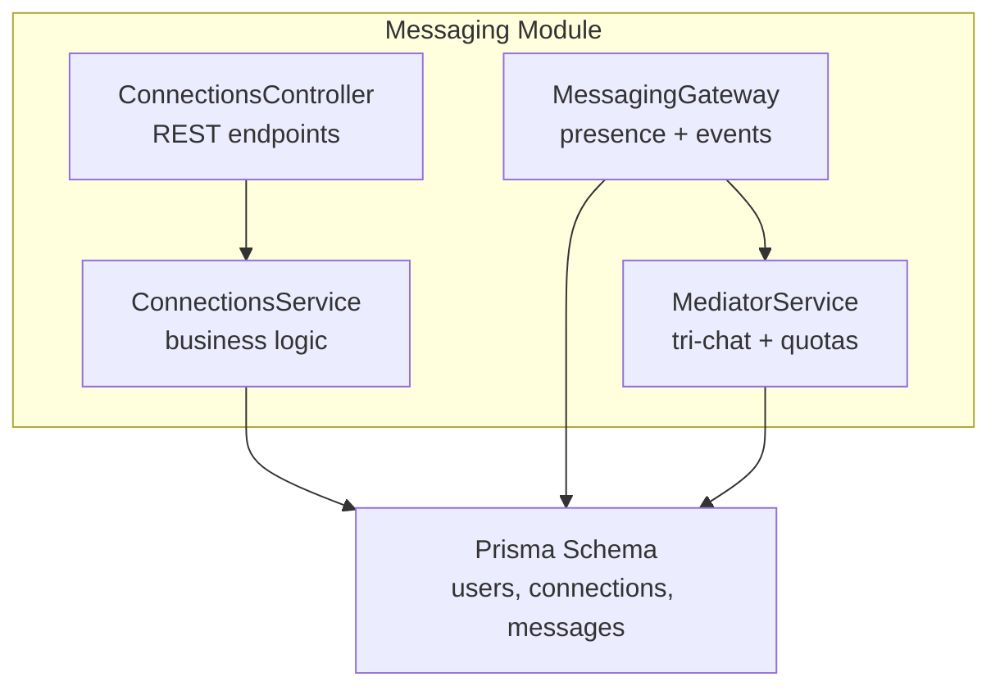
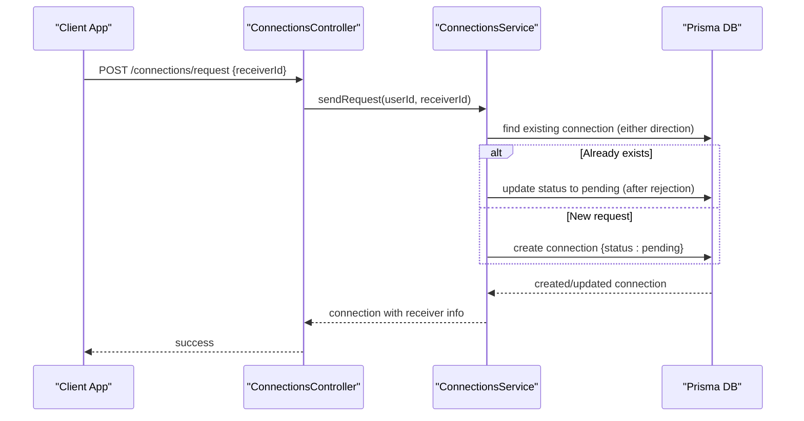
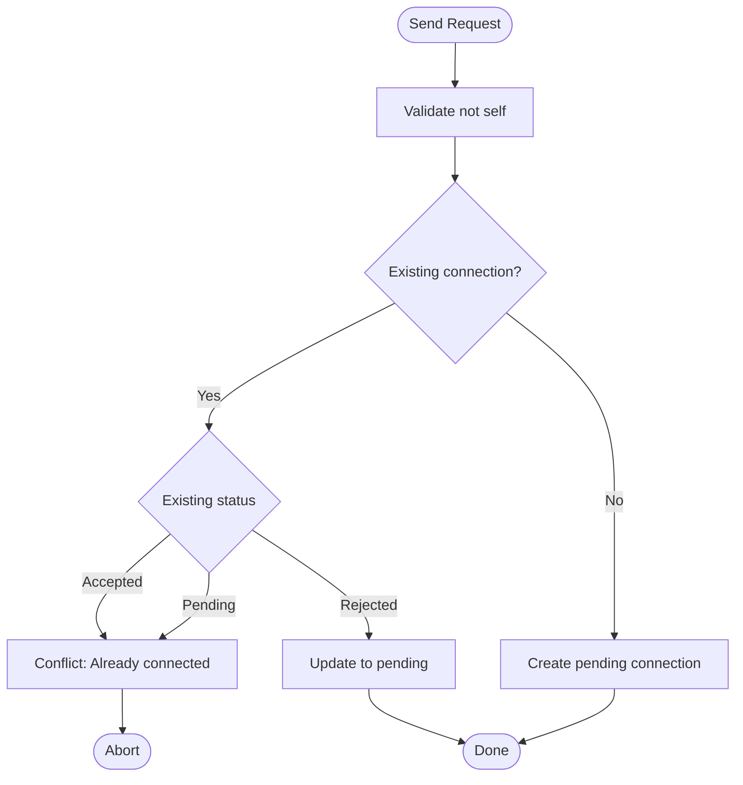
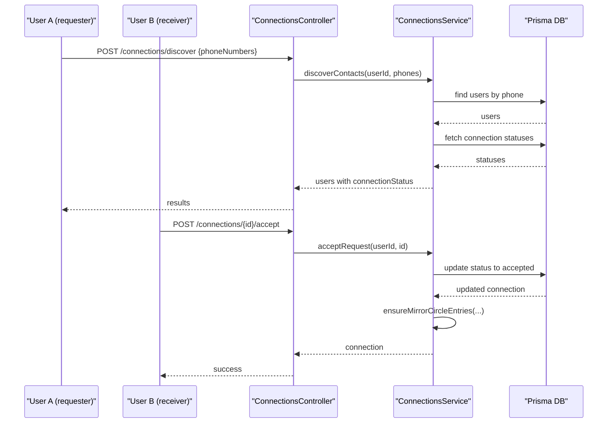
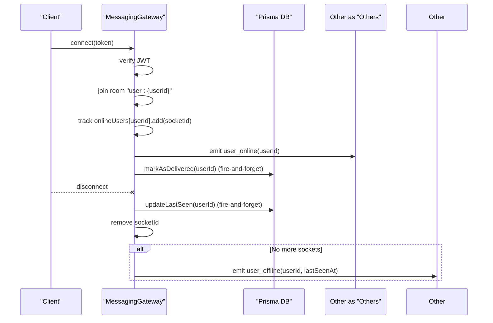
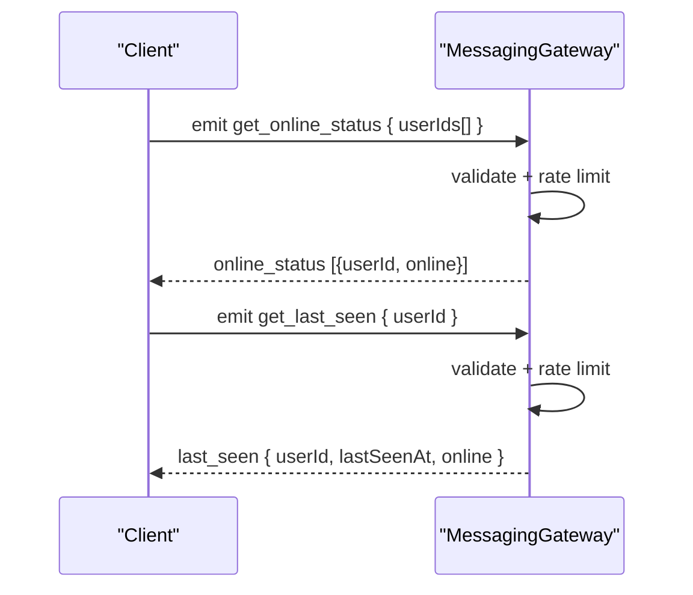
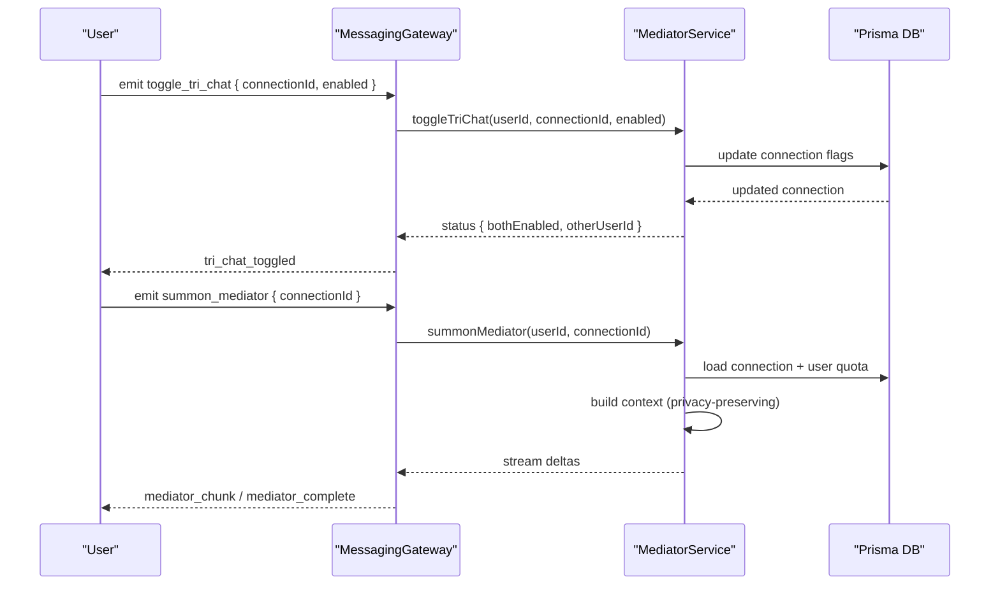
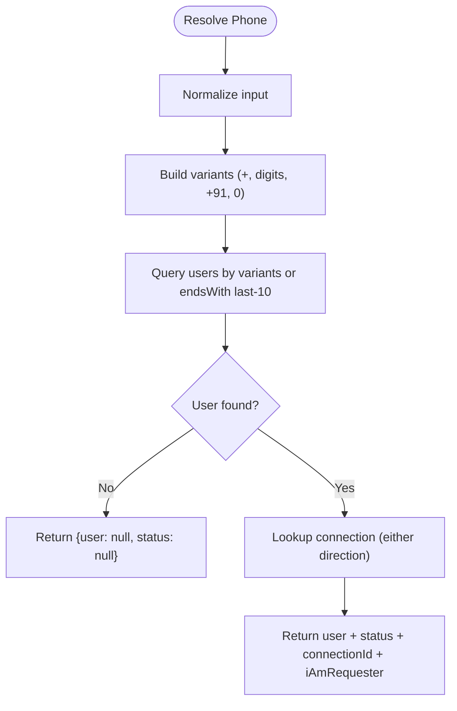
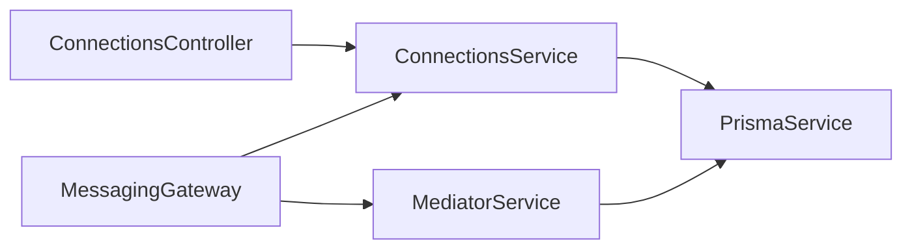

# Connection Management

<cite>
**Referenced Files in This Document**
- [connections.controller.ts](file://backend/src/messaging/connections.controller.ts)
- [connections.service.ts](file://backend/src/messaging/connections.service.ts)
- [messaging.gateway.ts](file://backend/src/messaging/messaging.gateway.ts)
- [mediator.service.ts](file://backend/src/messaging/mediator.service.ts)
- [schema.prisma](file://backend/prisma/schema.prisma)
- [send-request.dto.ts](file://backend/src/messaging/dto/send-request.dto.ts)
- [send-invite.dto.ts](file://backend/src/messaging/dto/send-invite.dto.ts)
- [conversation-settings.dto.ts](file://backend/src/messaging/dto/conversation-settings.dto.ts)
</cite>

## Table of Contents
1. [Introduction](#introduction)
2. [Project Structure](#project-structure)
3. [Core Components](#core-components)
4. [Architecture Overview](#architecture-overview)
5. [Detailed Component Analysis](#detailed-component-analysis)
6. [Dependency Analysis](#dependency-analysis)
7. [Performance Considerations](#performance-considerations)
8. [Troubleshooting Guide](#troubleshooting-guide)
9. [Conclusion](#conclusion)
10. [Appendices](#appendices)

## Introduction
This document describes the connection management system powering user relationships, connection requests, acceptance/rejection workflows, and connection state management. It also covers the connection room system, user presence tracking, online/offline status broadcasting, tri-chat (mediator) integration, and connection settings/preferences. Practical examples illustrate connection establishment, status updates, and disconnection handling, along with security, rate limiting, and privacy considerations for connection visibility.

## Project Structure
The connection management system spans three main backend modules:
- REST controller and service for connection lifecycle and discovery
- WebSocket gateway for real-time presence and messaging
- Mediator service for tri-chat features integrated with connections



**Diagram sources**
- [connections.controller.ts:19-114](file://backend/src/messaging/connections.controller.ts#L19-L114)
- [connections.service.ts:1-385](file://backend/src/messaging/connections.service.ts#L1-L385)
- [messaging.gateway.ts:62-180](file://backend/src/messaging/messaging.gateway.ts#L62-L180)
- [mediator.service.ts:132-280](file://backend/src/messaging/mediator.service.ts#L132-L280)
- [schema.prisma:516-549](file://backend/prisma/schema.prisma#L516-L549)

**Section sources**
- [connections.controller.ts:19-114](file://backend/src/messaging/connections.controller.ts#L19-L114)
- [connections.service.ts:1-385](file://backend/src/messaging/connections.service.ts#L1-L385)
- [messaging.gateway.ts:62-180](file://backend/src/messaging/messaging.gateway.ts#L62-L180)
- [mediator.service.ts:132-280](file://backend/src/messaging/mediator.service.ts#L132-L280)
- [schema.prisma:516-549](file://backend/prisma/schema.prisma#L516-L549)

## Core Components
- ConnectionsController: Exposes REST endpoints for searching users, sending and responding to connection requests, discovering contacts by phone, and managing connections.
- ConnectionsService: Implements request lifecycle, deduplication, mirror-circle creation, and retrieval of accepted connections and pending requests.
- MessagingGateway: Manages WebSocket connections, authenticates clients, tracks online presence, broadcasts user online/offline events, and enforces rate limits.
- MediatorService: Integrates tri-chat features with connections, including enabling/disabling tri-chat, toggling sessions, consuming monthly quotas, and privacy-preserving context building.

**Section sources**
- [connections.controller.ts:27-114](file://backend/src/messaging/connections.controller.ts#L27-L114)
- [connections.service.ts:13-385](file://backend/src/messaging/connections.service.ts#L13-L385)
- [messaging.gateway.ts:127-180](file://backend/src/messaging/messaging.gateway.ts#L127-L180)
- [mediator.service.ts:203-278](file://backend/src/messaging/mediator.service.ts#L203-L278)

## Architecture Overview
The system combines REST APIs for connection management with a WebSocket gateway for real-time presence and messaging. Connections are stored in the database with rich per-connection settings for tri-chat, muting, pinning, archiving, and one-sided chat history clearing.



**Diagram sources**
- [connections.controller.ts:52-55](file://backend/src/messaging/connections.controller.ts#L52-L55)
- [connections.service.ts:61-101](file://backend/src/messaging/connections.service.ts#L61-L101)
- [schema.prisma:516-549](file://backend/prisma/schema.prisma#L516-L549)

## Detailed Component Analysis

### Connection Request Workflows
- Sending a request validates self-connection rules, checks for existing connections in either direction, and either creates a new pending connection or re-opens a previously rejected one.
- Accepting a request requires the current user to be the receiver and the connection to be pending. Upon acceptance, mirror entries are created in each user’s Circle so both sides see the contact.
- Rejecting a request requires the current user to be the receiver and marks the connection as rejected.
- Removing a connection requires ownership by either party and deletes the record.



**Diagram sources**
- [connections.service.ts:61-101](file://backend/src/messaging/connections.service.ts#L61-L101)

**Section sources**
- [connections.service.ts:61-271](file://backend/src/messaging/connections.service.ts#L61-L271)
- [connections.controller.ts:52-75](file://backend/src/messaging/connections.controller.ts#L52-L75)

### Acceptance and Rejection Mechanisms
- Accept: Receiver-only operation; validates pending status and updates to accepted. Mirrors Circle entries for both users.
- Reject: Receiver-only operation; validates ownership and sets status to rejected.
- Removal: Owner-only operation; deletes the connection.



**Diagram sources**
- [connections.controller.ts:42-60](file://backend/src/messaging/connections.controller.ts#L42-L60)
- [connections.service.ts:122-145](file://backend/src/messaging/connections.service.ts#L122-L145)
- [connections.service.ts:151-207](file://backend/src/messaging/connections.service.ts#L151-L207)

**Section sources**
- [connections.service.ts:122-221](file://backend/src/messaging/connections.service.ts#L122-L221)
- [connections.controller.ts:62-75](file://backend/src/messaging/connections.controller.ts#L62-L75)

### Connection State Management
- Connection statuses: pending, accepted, rejected, blocked.
- Per-user flags: pinned, muted, archived.
- Tri-chat flags: enabled by requester and receiver; one-sided cleared timestamps and shared summary for continuity.
- Settings: pinned, mutedUntil, archived via ConversationSettingsDto.

```mermaid
erDiagram
CONNECTION {
uuid id PK
uuid requester_id FK
uuid receiver_id FK
enum status
boolean pinned_by_requester
boolean pinned_by_receiver
timestamptz muted_by_requester
timestamptz muted_by_receiver
boolean archived_by_requester
boolean archived_by_receiver
boolean tri_chat_enabled_by_requester
boolean tri_chat_enabled_by_receiver
timestamptz tri_chat_cleared_at_requester
timestamptz tri_chat_cleared_at_recipient
text tri_chat_cleared_summary
varchar mediator_name
timestamptz created_at
timestamptz updated_at
}
USER ||--o{ CONNECTION as sent
USER ||--o{ CONNECTION as received
```

**Diagram sources**
- [schema.prisma:516-549](file://backend/prisma/schema.prisma#L516-L549)

**Section sources**
- [schema.prisma:516-549](file://backend/prisma/schema.prisma#L516-L549)
- [conversation-settings.dto.ts:3-15](file://backend/src/messaging/dto/conversation-settings.dto.ts#L3-L15)

### Connection Room System and Presence Tracking
- WebSocket authentication: JWT verification; successful auth joins the user’s personal room “user:{userId}”.
- Online tracking: Map of userId -> Set(socketId); on disconnect, decrements and emits offline with lastSeenAt.
- Broadcasts: user_online upon connection; user_offline when last socket for a user disconnects.
- Privacy: Events scoped to user rooms; reactions broadcast only to sender/receiver rooms.



**Diagram sources**
- [messaging.gateway.ts:127-180](file://backend/src/messaging/messaging.gateway.ts#L127-L180)

**Section sources**
- [messaging.gateway.ts:68-180](file://backend/src/messaging/messaging.gateway.ts#L68-L180)

### Online/Offline Status Broadcasting
- Real-time status queries: get_online_status batches up to 500 user IDs; get_last_seen returns lastSeenAt and online flag.
- Rate-limited: sliding-window caps per user per event.



**Diagram sources**
- [messaging.gateway.ts:407-443](file://backend/src/messaging/messaging.gateway.ts#L407-L443)

**Section sources**
- [messaging.gateway.ts:407-443](file://backend/src/messaging/messaging.gateway.ts#L407-L443)

### Tri-Chat (Mediator) Integration with Connections
- Toggle tri-chat per connection; both parties must enable for mutual visibility.
- Monthly quota: free tier 10 turns/month; premium unlimited.
- Session management: active sessions auto-end after inactivity; one-sided clear history preserves continuity with a neutral summary.
- Privacy: mediator context excludes private Circle/ontology details; only permitted context blocks are included.



**Diagram sources**
- [messaging.gateway.ts:447-544](file://backend/src/messaging/messaging.gateway.ts#L447-L544)
- [mediator.service.ts:203-278](file://backend/src/messaging/mediator.service.ts#L203-L278)
- [mediator.service.ts:661-790](file://backend/src/messaging/mediator.service.ts#L661-L790)

**Section sources**
- [messaging.gateway.ts:447-544](file://backend/src/messaging/messaging.gateway.ts#L447-L544)
- [mediator.service.ts:203-278](file://backend/src/messaging/mediator.service.ts#L203-L278)
- [mediator.service.ts:661-790](file://backend/src/messaging/mediator.service.ts#L661-L790)

### Connection Discovery and Phone Resolution
- Discover contacts: normalize phone numbers and match against user phone numbers (excluding self).
- Resolve phone: supports multiple variants (+91, 91, 0 prefixes, last-10 digits) and returns user and connection status.



**Diagram sources**
- [connections.service.ts:279-331](file://backend/src/messaging/connections.service.ts#L279-L331)
- [connections.service.ts:337-383](file://backend/src/messaging/connections.service.ts#L337-L383)

**Section sources**
- [connections.service.ts:279-383](file://backend/src/messaging/connections.service.ts#L279-L383)

### Connection Settings and Preferences Management
- Conversation settings DTO supports pinned, mutedUntil, archived flags.
- Connection-level flags include pinned, muted, archived, tri-chat enablement, and one-sided cleared timestamps/summary.

**Section sources**
- [conversation-settings.dto.ts:3-15](file://backend/src/messaging/dto/conversation-settings.dto.ts#L3-L15)
- [schema.prisma:516-549](file://backend/prisma/schema.prisma#L516-L549)

## Dependency Analysis
- Controllers depend on Services for business logic.
- Services depend on Prisma for persistence.
- Gateway depends on JWT service and Mediator service for tri-chat.
- Mediator service depends on Prisma and external providers for summarization.



**Diagram sources**
- [connections.controller.ts:22-25](file://backend/src/messaging/connections.controller.ts#L22-L25)
- [connections.service.ts](file://backend/src/messaging/connections.service.ts#L8)
- [messaging.gateway.ts:74-79](file://backend/src/messaging/messaging.gateway.ts#L74-L79)
- [mediator.service.ts:139-143](file://backend/src/messaging/mediator.service.ts#L139-L143)

**Section sources**
- [connections.controller.ts:22-25](file://backend/src/messaging/connections.controller.ts#L22-L25)
- [connections.service.ts](file://backend/src/messaging/connections.service.ts#L8)
- [messaging.gateway.ts:74-79](file://backend/src/messaging/messaging.gateway.ts#L74-L79)
- [mediator.service.ts:139-143](file://backend/src/messaging/mediator.service.ts#L139-L143)

## Performance Considerations
- Batched lookups: ConnectionsService batches connection queries when enriching search results to minimize round-trips.
- Sliding-window rate limits: Prevents abuse across events like send_message, edit_message, toggle_reaction, mark_read, typing, and tri-chat operations.
- Cleanup timers: Gateway periodically removes stale rate-limit counters to bound memory growth.
- Context trimming: MediatorService trims transcripts to fit within soft caps and includes only permitted context blocks to reduce token usage.

**Section sources**
- [connections.service.ts:30-56](file://backend/src/messaging/connections.service.ts#L30-L56)
- [messaging.gateway.ts:80-87](file://backend/src/messaging/messaging.gateway.ts#L80-L87)
- [mediator.service.ts:636-650](file://backend/src/messaging/mediator.service.ts#L636-L650)

## Troubleshooting Guide
Common issues and mitigations:
- Authentication failures: Clients must supply a valid JWT; otherwise connections are closed.
- Rate limit exceeded: Clients receive message_error with code RATE_LIMIT; slow down or wait for the window to reset.
- Invalid payloads: message_error with INVALID_INPUT; ensure required fields and sizes are within limits.
- Not authorized: Accept/reject/remove require ownership; errors indicate connection not found.
- Disconnection handling: On disconnect, lastSeenAt is updated and offline events broadcast when the user becomes fully offline.

**Section sources**
- [messaging.gateway.ts:127-180](file://backend/src/messaging/messaging.gateway.ts#L127-L180)
- [messaging.gateway.ts:111-125](file://backend/src/messaging/messaging.gateway.ts#L111-L125)
- [connections.service.ts:122-145](file://backend/src/messaging/connections.service.ts#L122-L145)
- [connections.service.ts:262-271](file://backend/src/messaging/connections.service.ts#L262-L271)

## Conclusion
The connection management system provides a robust foundation for user relationships with secure request workflows, mirror-circle integration, and comprehensive presence tracking. Tri-chat features are tightly integrated with connection state and privacy-preserving context building. Strong rate limiting and cleanup mechanisms ensure performance and stability, while per-connection settings offer granular control over visibility and engagement.

## Appendices

### Practical Examples

- Establish a connection
  - Endpoint: POST /connections/request
  - DTO: receiverId (UUID)
  - Behavior: Validates self-connection, checks existing connections, creates or reopens pending
  - Example path: [connections.controller.ts:52-55](file://backend/src/messaging/connections.controller.ts#L52-L55), [connections.service.ts:61-101](file://backend/src/messaging/connections.service.ts#L61-L101)

- Accept a pending request
  - Endpoint: POST /connections/{id}/accept
  - Behavior: Receiver-only; updates status to accepted and mirrors Circle entries
  - Example path: [connections.controller.ts:62-65](file://backend/src/messaging/connections.controller.ts#L62-L65), [connections.service.ts:122-145](file://backend/src/messaging/connections.service.ts#L122-L145)

- Reject a pending request
  - Endpoint: POST /connections/{id}/reject
  - Behavior: Receiver-only; marks status as rejected
  - Example path: [connections.controller.ts:67-70](file://backend/src/messaging/connections.controller.ts#L67-L70), [connections.service.ts:212-221](file://backend/src/messaging/connections.service.ts#L212-L221)

- Remove a connection
  - Endpoint: DELETE /connections/{id}
  - Behavior: Owner-only deletion
  - Example path: [connections.controller.ts:72-75](file://backend/src/messaging/connections.controller.ts#L72-L75), [connections.service.ts:262-271](file://backend/src/messaging/connections.service.ts#L262-L271)

- Discover contacts by phone
  - Endpoint: POST /connections/discover
  - Behavior: Normalizes phone numbers and returns matching users with connection status
  - Example path: [connections.controller.ts:42-45](file://backend/src/messaging/connections.controller.ts#L42-L45), [connections.service.ts:337-383](file://backend/src/messaging/connections.service.ts#L337-L383)

- Resolve a single phone number
  - Endpoint: POST /connections/resolve-phone
  - Behavior: Supports multiple variants and returns user/connection info
  - Example path: [connections.controller.ts:47-50](file://backend/src/messaging/connections.controller.ts#L47-L50), [connections.service.ts:279-331](file://backend/src/messaging/connections.service.ts#L279-L331)

- Toggle tri-chat
  - Endpoint: POST /ws toggle_tri_chat
  - Behavior: Updates per-user flags; broadcasts tri_chat_toggled to both parties
  - Example path: [messaging.gateway.ts:447-480](file://backend/src/messaging/messaging.gateway.ts#L447-L480), [mediator.service.ts:203-221](file://backend/src/messaging/mediator.service.ts#L203-L221)

- Online status queries
  - Endpoint: POST /ws get_online_status / get_last_seen
  - Behavior: Rate-limited; returns online flags and lastSeenAt
  - Example path: [messaging.gateway.ts:407-443](file://backend/src/messaging/messaging.gateway.ts#L407-L443)

### Security, Rate Limiting, and Privacy

- Security
  - JWT authentication on WebSocket; unauthorized clients are disconnected.
  - Ownership checks for accept/reject/remove operations.
  - Strict validation of input sizes and shapes; invalid payloads rejected.

- Rate Limiting
  - Sliding-window caps per user per event (e.g., send_message, edit_message, toggle_reaction, mark_read, typing, tri-chat toggles).
  - Cleanup timer prevents unbounded growth of rate counters.

- Privacy
  - Presence broadcasts scoped to user rooms; reactions only broadcast to involved parties.
  - Mediator context excludes private Circle/ontology details; uses permitted context blocks only.

**Section sources**
- [messaging.gateway.ts:127-180](file://backend/src/messaging/messaging.gateway.ts#L127-L180)
- [messaging.gateway.ts:91-125](file://backend/src/messaging/messaging.gateway.ts#L91-L125)
- [mediator.service.ts:522-541](file://backend/src/messaging/mediator.service.ts#L522-L541)