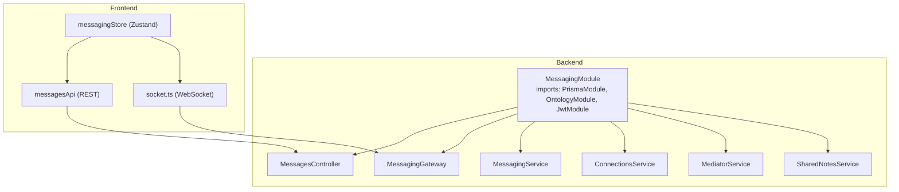
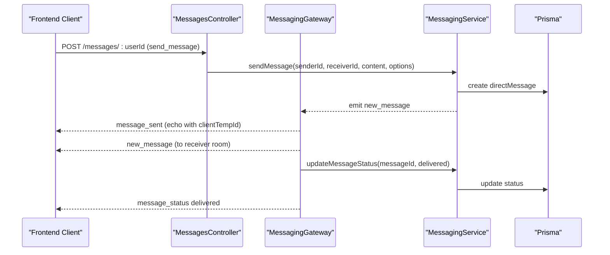
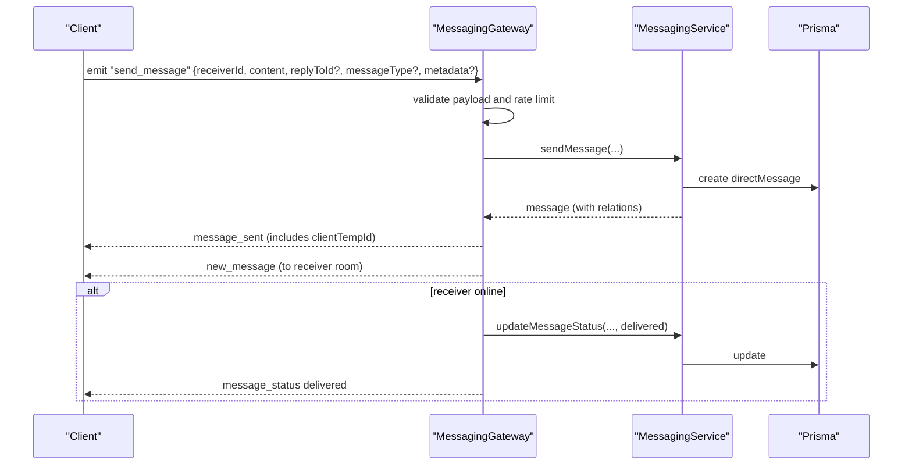
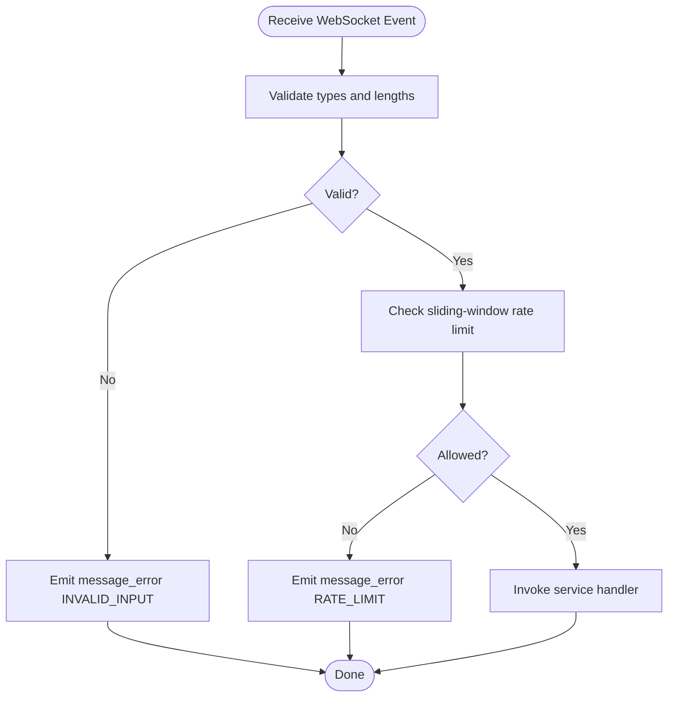
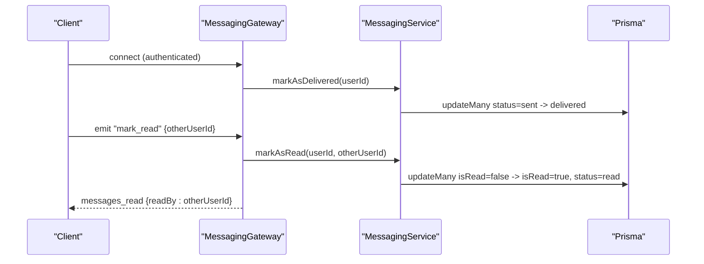
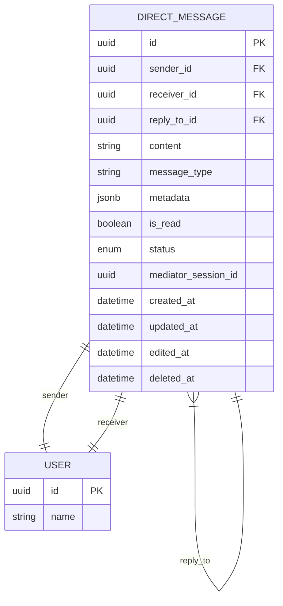
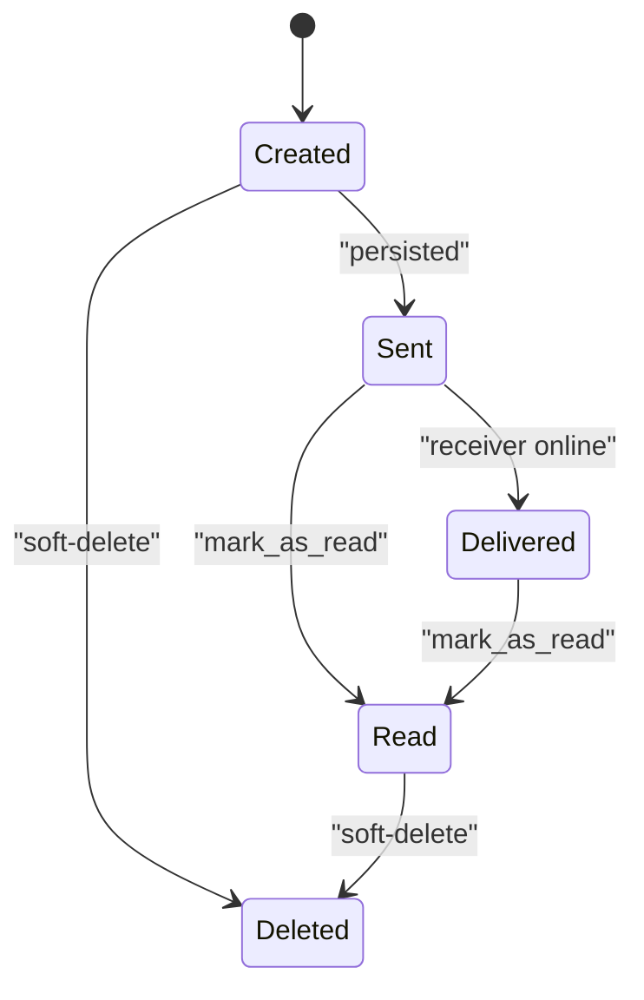
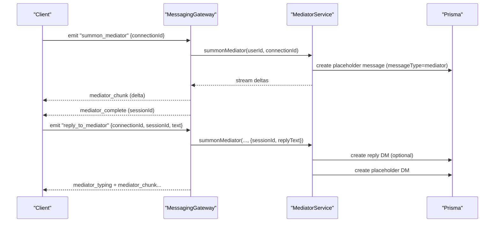
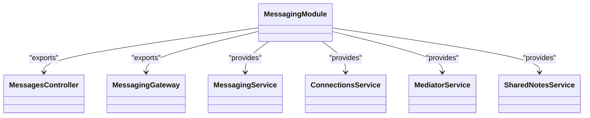

# Direct Messaging

<cite>
**Referenced Files in This Document**
- [messaging.module.ts](file://backend/src/messaging/messaging.module.ts)
- [messages.controller.ts](file://backend/src/messaging/messages.controller.ts)
- [messaging.service.ts](file://backend/src/messaging/messaging.service.ts)
- [messaging.gateway.ts](file://backend/src/messaging/messaging.gateway.ts)
- [connections.controller.ts](file://backend/src/messaging/connections.controller.ts)
- [connections.service.ts](file://backend/src/messaging/connections.service.ts)
- [mediator.service.ts](file://backend/src/messaging/mediator.service.ts)
- [shared-notes.service.ts](file://backend/src/messaging/shared-notes.service.ts)
- [messaging.ts](file://frontend/src/api/messaging.ts)
- [messagingStore.ts](file://frontend/src/store/messagingStore.ts)
- [socket.ts](file://frontend/src/api/socket.ts)
- [schema.prisma](file://backend/prisma/schema.prisma)
</cite>

## Table of Contents
1. [Introduction](#introduction)
2. [Project Structure](#project-structure)
3. [Core Components](#core-components)
4. [Architecture Overview](#architecture-overview)
5. [Detailed Component Analysis](#detailed-component-analysis)
6. [Dependency Analysis](#dependency-analysis)
7. [Performance Considerations](#performance-considerations)
8. [Troubleshooting Guide](#troubleshooting-guide)
9. [Conclusion](#conclusion)
10. [Appendices](#appendices)

## Introduction
This document describes the direct messaging system, focusing on the end-to-end message lifecycle: creation, validation, delivery, read tracking, reactions, threading with reply-to, metadata handling, tri-chat mediator features, and real-time delivery guarantees via WebSocket. It also documents WebSocket event formats, client-server communication patterns, and practical operation examples.

## Project Structure
The messaging subsystem is organized around NestJS modules and services:
- Messaging module wires dependencies and exposes REST and WebSocket endpoints for direct messaging and tri-chat mediator features.
- Messaging service encapsulates business logic for message CRUD, status updates, reactions, search, and conversation lists.
- Messaging gateway handles WebSocket authentication, rate limiting, input validation, and real-time event broadcasting.
- Connections service manages user discovery, connection requests, and acceptance.
- Mediator service powers tri-chat mediator sessions, streaming, and session management.
- Frontend APIs and stores coordinate REST and WebSocket interactions for UI rendering and real-time updates.

**Diagram sources**
- [messaging.module.ts:14-36](file://backend/src/messaging/messaging.module.ts#L14-L36)
- [messages.controller.ts:21-27](file://backend/src/messaging/messages.controller.ts#L21-L27)
- [messaging.gateway.ts:55-62](file://backend/src/messaging/messaging.gateway.ts#L55-L62)
- [messaging.service.ts:21-28](file://backend/src/messaging/messaging.service.ts#L21-L28)
- [connections.service.ts:6-8](file://backend/src/messaging/connections.service.ts#L6-L8)
- [mediator.service.ts:131-134](file://backend/src/messaging/mediator.service.ts#L131-L134)
- [shared-notes.service.ts:4-6](file://backend/src/messaging/shared-notes.service.ts#L4-L6)
- [messaging.ts:147-217](file://frontend/src/api/messaging.ts#L147-L217)
- [socket.ts:10-30](file://frontend/src/api/socket.ts#L10-L30)
- [messagingStore.ts:72-70](file://frontend/src/store/messagingStore.ts#L72-L70)

**Section sources**
- [messaging.module.ts:14-36](file://backend/src/messaging/messaging.module.ts#L14-L36)
- [messages.controller.ts:21-27](file://backend/src/messaging/messages.controller.ts#L21-L27)
- [messaging.gateway.ts:55-62](file://backend/src/messaging/messaging.gateway.ts#L55-L62)
- [messaging.service.ts:21-28](file://backend/src/messaging/messaging.service.ts#L21-L28)
- [connections.service.ts:6-8](file://backend/src/messaging/connections.service.ts#L6-L8)
- [mediator.service.ts:131-134](file://backend/src/messaging/mediator.service.ts#L131-L134)
- [shared-notes.service.ts:4-6](file://backend/src/messaging/shared-notes.service.ts#L4-L6)
- [messaging.ts:147-217](file://frontend/src/api/messaging.ts#L147-L217)
- [socket.ts:10-30](file://frontend/src/api/socket.ts#L10-L30)
- [messagingStore.ts:72-70](file://frontend/src/store/messagingStore.ts#L72-L70)

## Core Components
- MessagingService: Validates connections, persists messages, emits relational ontology events, logs bidirectional interactions, manages reactions, read status, and conversation queries.
- MessagingGateway: Authenticates WebSocket clients, enforces rate limits, validates payloads, streams mediator responses, and broadcasts real-time events scoped to participants.
- MediatorService: Manages tri-chat mediator toggles, session lifecycles, context building, streaming, and action cards.
- ConnectionsService: User discovery, connection requests, acceptance, and mirror-circle linkage.
- Frontend messaging API and Zustand store: REST endpoints for conversations and actions, and WebSocket handlers for real-time updates.

**Section sources**
- [messaging.service.ts:21-647](file://backend/src/messaging/messaging.service.ts#L21-L647)
- [messaging.gateway.ts:62-762](file://backend/src/messaging/messaging.gateway.ts#L62-L762)
- [mediator.service.ts:131-800](file://backend/src/messaging/mediator.service.ts#L131-L800)
- [connections.service.ts:6-385](file://backend/src/messaging/connections.service.ts#L6-L385)
- [messaging.ts:147-217](file://frontend/src/api/messaging.ts#L147-L217)
- [messagingStore.ts:72-412](file://frontend/src/store/messagingStore.ts#L72-L412)

## Architecture Overview
The system integrates REST and WebSocket:
- REST endpoints under /messages manage conversations, read status, reactions, settings, and tri-chat mediator operations.
- WebSocket (/ws) authenticates via JWT, scopes rooms by user, and streams real-time updates including messages, reactions, mediator chunks, and session events.

**Diagram sources**
- [messages.controller.ts:64-77](file://backend/src/messaging/messages.controller.ts#L64-L77)
- [messaging.gateway.ts:191-247](file://backend/src/messaging/messaging.gateway.ts#L191-L247)
- [messaging.service.ts:53-96](file://backend/src/messaging/messaging.service.ts#L53-L96)

## Detailed Component Analysis

### Message Sending Workflow
- Validation and rate limiting occur in the WebSocket handler before invoking MessagingService.
- MessagingService persists the message, emits relational events for auto-logging, and returns the enriched message with sender/receiver/replyTo/reactions included.
- Real-time delivery confirmation updates status to delivered when the receiver is online.

**Diagram sources**
- [messaging.gateway.ts:191-247](file://backend/src/messaging/messaging.gateway.ts#L191-L247)
- [messaging.service.ts:53-96](file://backend/src/messaging/messaging.service.ts#L53-L96)

**Section sources**
- [messaging.gateway.ts:191-247](file://backend/src/messaging/messaging.gateway.ts#L191-L247)
- [messaging.service.ts:53-96](file://backend/src/messaging/messaging.service.ts#L53-L96)

### Content Validation and Rate Limiting
- Payload validation enforces string length limits and presence checks for required fields.
- Sliding-window rate limits per event and per user prevent abuse.
- Rate limit enforcement returns structured errors to the client.

**Diagram sources**
- [messaging.gateway.ts:105-126](file://backend/src/messaging/messaging.gateway.ts#L105-L126)
- [messaging.gateway.ts:91-103](file://backend/src/messaging/messaging.gateway.ts#L91-L103)

**Section sources**
- [messaging.gateway.ts:105-126](file://backend/src/messaging/messaging.gateway.ts#L105-L126)
- [messaging.gateway.ts:91-103](file://backend/src/messaging/messaging.gateway.ts#L91-L103)

### Delivery Confirmation and Read Tracking
- On connect, pending messages to the user are marked delivered.
- When the receiver is online, delivery is confirmed immediately upon persistence.
- Read tracking supports per-conversation mark-as-read and global unread counts.

**Diagram sources**
- [messaging.gateway.ts:127-160](file://backend/src/messaging/messaging.gateway.ts#L127-L160)
- [messaging.gateway.ts:364-384](file://backend/src/messaging/messaging.gateway.ts#L364-L384)
- [messaging.service.ts:231-241](file://backend/src/messaging/messaging.service.ts#L231-L241)
- [messaging.service.ts:614-624](file://backend/src/messaging/messaging.service.ts#L614-L624)

**Section sources**
- [messaging.gateway.ts:127-160](file://backend/src/messaging/messaging.gateway.ts#L127-L160)
- [messaging.gateway.ts:364-384](file://backend/src/messaging/messaging.gateway.ts#L364-L384)
- [messaging.service.ts:231-241](file://backend/src/messaging/messaging.service.ts#L231-L241)
- [messaging.service.ts:614-624](file://backend/src/messaging/messaging.service.ts#L614-L624)

### Message Threading and Reply-To Functionality
- Messages can reference a parent via replyToId; the service includes replyTo metadata with sender name.
- Conversation retrieval filters by connection and optional per-user cleared timestamps for tri-chat continuity.

**Diagram sources**
- [schema.prisma](file://backend/prisma/schema.prisma)
- [messaging.service.ts:6-19](file://backend/src/messaging/messaging.service.ts#L6-L19)
- [messaging.service.ts:460-503](file://backend/src/messaging/messaging.service.ts#L460-L503)

**Section sources**
- [schema.prisma](file://backend/prisma/schema.prisma)
- [messaging.service.ts:6-19](file://backend/src/messaging/messaging.service.ts#L6-L19)
- [messaging.service.ts:460-503](file://backend/src/messaging/messaging.service.ts#L460-L503)

### Metadata Handling
- Messages support arbitrary JSON metadata for extended features (e.g., mediator placeholders).
- Metadata is stored and returned with message payloads.

**Section sources**
- [messaging.service.ts:64-75](file://backend/src/messaging/messaging.service.ts#L64-L75)
- [messaging.gateway.ts:200-201](file://backend/src/messaging/messaging.gateway.ts#L200-L201)

### Message Lifecycle: Creation → Delivery → Read → Deletion
- Creation: validate connection, persist message, emit relational events.
- Delivery: mark delivered on connect or when receiver is online.
- Read: mark as read per conversation and globally.
- Deletion: soft-delete with content cleared and deletedAt timestamp.

**Diagram sources**
- [messaging.service.ts:53-96](file://backend/src/messaging/messaging.service.ts#L53-L96)
- [messaging.service.ts:217-225](file://backend/src/messaging/messaging.service.ts#L217-L225)
- [messaging.service.ts:614-624](file://backend/src/messaging/messaging.service.ts#L614-L624)
- [messaging.service.ts:164-174](file://backend/src/messaging/messaging.service.ts#L164-L174)

**Section sources**
- [messaging.service.ts:53-96](file://backend/src/messaging/messaging.service.ts#L53-L96)
- [messaging.service.ts:217-225](file://backend/src/messaging/messaging.service.ts#L217-L225)
- [messaging.service.ts:614-624](file://backend/src/messaging/messaging.service.ts#L614-L624)
- [messaging.service.ts:164-174](file://backend/src/messaging/messaging.service.ts#L164-L174)

### Reactions and Read Status Tracking
- Reactions are upsert toggles scoped to conversation participants.
- Read status updates are applied per conversation and reflected in UI badges.

**Section sources**
- [messaging.service.ts:179-202](file://backend/src/messaging/messaging.service.ts#L179-L202)
- [messaging.gateway.ts:318-360](file://backend/src/messaging/messaging.gateway.ts#L318-L360)
- [messaging.service.ts:614-624](file://backend/src/messaging/messaging.service.ts#L614-L624)

### Tri-Chat Mediator: Session Management and Streaming
- Toggle mediator enablement per connection; status includes turns-left and active session.
- Summons create a placeholder mediator message and stream deltas to both parties.
- Sessions auto-end after idle timeout; replies persist user input tied to the session.

**Diagram sources**
- [messaging.gateway.ts:484-544](file://backend/src/messaging/messaging.gateway.ts#L484-L544)
- [messaging.gateway.ts:548-617](file://backend/src/messaging/messaging.gateway.ts#L548-L617)
- [mediator.service.ts:661-800](file://backend/src/messaging/mediator.service.ts#L661-L800)

**Section sources**
- [messaging.gateway.ts:484-544](file://backend/src/messaging/messaging.gateway.ts#L484-L544)
- [messaging.gateway.ts:548-617](file://backend/src/messaging/messaging.gateway.ts#L548-L617)
- [mediator.service.ts:661-800](file://backend/src/messaging/mediator.service.ts#L661-L800)

### WebSocket Event Types and Formats
Common events include:
- Outbound: new_message, message_sent, message_error, message_status, reaction_updated, messages_read, user_online, user_offline, mediator_chunk, mediator_complete, mediator_error, mediator_typing, tri_chat_toggled, mediator_session_ended, mediator_renamed, mediator_cancelled, chat_history_cleared, mediator_action_accepted.
- Inbound: send_message, edit_message, delete_message, toggle_reaction, mark_read, typing, get_online_status, get_last_seen, toggle_tri_chat, summon_mediator, reply_to_mediator, end_mediator_session, clear_chat_history, rename_mediator, accept_mediator_action.

**Section sources**
- [messaging.gateway.ts:191-762](file://backend/src/messaging/messaging.gateway.ts#L191-L762)

### Practical Examples of Message Operations
- Send a message: emit "send_message" with receiverId, content, optional replyToId, messageType, metadata; expect "message_sent" echo and "new_message" delivery.
- Edit a message: PUT /messages/{messageId}/edit; expect "message_edited" broadcast.
- Delete a message: DELETE /messages/{messageId}; expect "message_deleted" broadcast.
- Add reaction: POST /messages/{messageId}/reactions; expect "reaction_updated" in both rooms.
- Mark read: emit "mark_read"; expect "messages_read" to the other party.
- Tri-chat mediator: emit "summon_mediator" or "reply_to_mediator"; expect "mediator_chunk" streams and "mediator_complete".

**Section sources**
- [messaging.gateway.ts:191-384](file://backend/src/messaging/messaging.gateway.ts#L191-L384)
- [messages.controller.ts:64-112](file://backend/src/messaging/messages.controller.ts#L64-L112)
- [messaging.ts:163-170](file://frontend/src/api/messaging.ts#L163-L170)
- [messagingStore.ts:185-280](file://frontend/src/store/messagingStore.ts#L185-L280)

### Client-Server Communication Patterns
- REST: JWT-protected endpoints for conversations, reactions, settings, and mediator operations.
- WebSocket: Authenticated rooms per user; events scoped to participants; sliding-window rate limits; input sanitization and bounded payloads.

**Section sources**
- [messages.controller.ts:21-27](file://backend/src/messaging/messages.controller.ts#L21-L27)
- [messaging.gateway.ts:127-180](file://backend/src/messaging/messaging.gateway.ts#L127-L180)
- [socket.ts:10-30](file://frontend/src/api/socket.ts#L10-L30)

## Dependency Analysis

**Diagram sources**
- [messaging.module.ts:14-36](file://backend/src/messaging/messaging.module.ts#L14-L36)

**Section sources**
- [messaging.module.ts:14-36](file://backend/src/messaging/messaging.module.ts#L14-L36)

## Performance Considerations
- Conversation listing uses a single optimized query with DISTINCT ON and grouped unread counts to avoid O(N) queries.
- Pagination uses cursor-based pagination with reverse ordering to minimize overhead.
- Rate-limit counters are periodically cleaned to prevent unbounded growth.
- Mediator context is truncated to a maximum character limit to maintain performance.

**Section sources**
- [messaging.service.ts:514-609](file://backend/src/messaging/messaging.service.ts#L514-L609)
- [messaging.gateway.ts:80-87](file://backend/src/messaging/messaging.gateway.ts#L80-L87)
- [mediator.service.ts:636-650](file://backend/src/messaging/mediator.service.ts#L636-L650)

## Troubleshooting Guide
- Authentication failures: ensure JWT token is present and valid; gateway disconnects invalid sockets.
- Rate limit exceeded: slow down or wait; client receives structured error with code RATE_LIMIT.
- Invalid input: client receives message_error with INVALID_INPUT and details.
- Connection not accepted: ensure users are connected before messaging; validation throws forbidden.
- Mediator not configured: missing API key prevents mediator summoning.
- Read receipts: if not received, verify online status and that mark_read was emitted.

**Section sources**
- [messaging.gateway.ts:127-160](file://backend/src/messaging/messaging.gateway.ts#L127-L160)
- [messaging.gateway.ts:111-126](file://backend/src/messaging/messaging.gateway.ts#L111-L126)
- [messaging.service.ts:33-47](file://backend/src/messaging/messaging.service.ts#L33-L47)
- [mediator.service.ts:698-700](file://backend/src/messaging/mediator.service.ts#L698-L700)

## Conclusion
The direct messaging system combines robust validation, rate limiting, and real-time delivery guarantees with flexible threading, reactions, and tri-chat mediator capabilities. REST and WebSocket pathways complement each other to provide responsive, privacy-conscious chat experiences.

## Appendices

### Database Schema Highlights
- Users, DirectMessages, MessageReactions, Connections, SharedNotes, MediationSessions are central to messaging and mediator features.
- Message status transitions and read flags are tracked per message.
- Mediator sessions and actions are persisted alongside messages for continuity.

**Section sources**
- [schema.prisma](file://backend/prisma/schema.prisma)