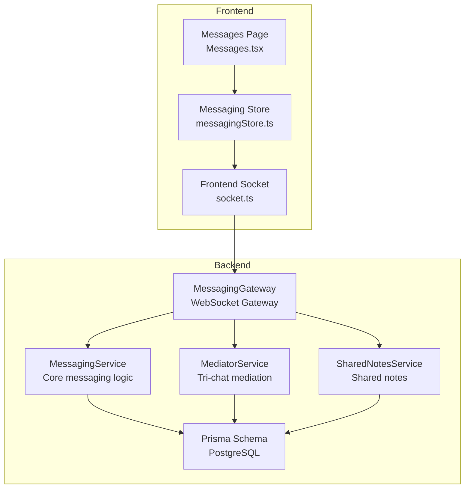
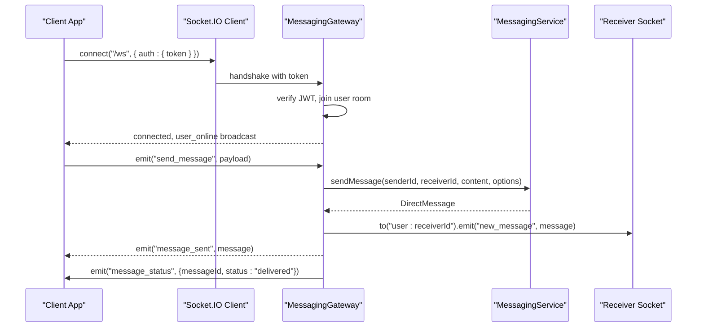
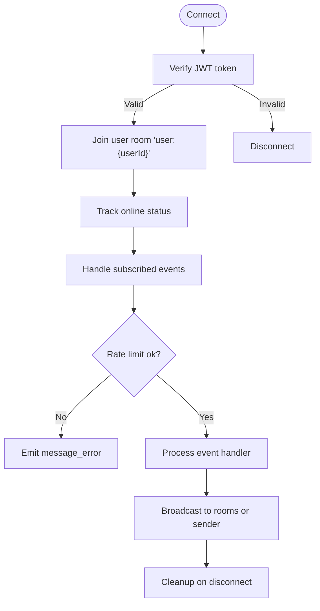
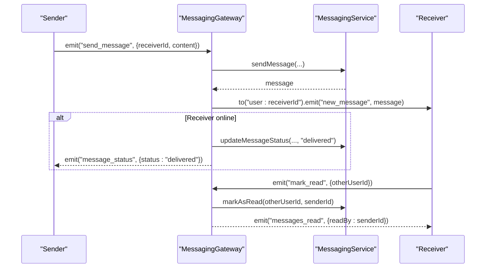
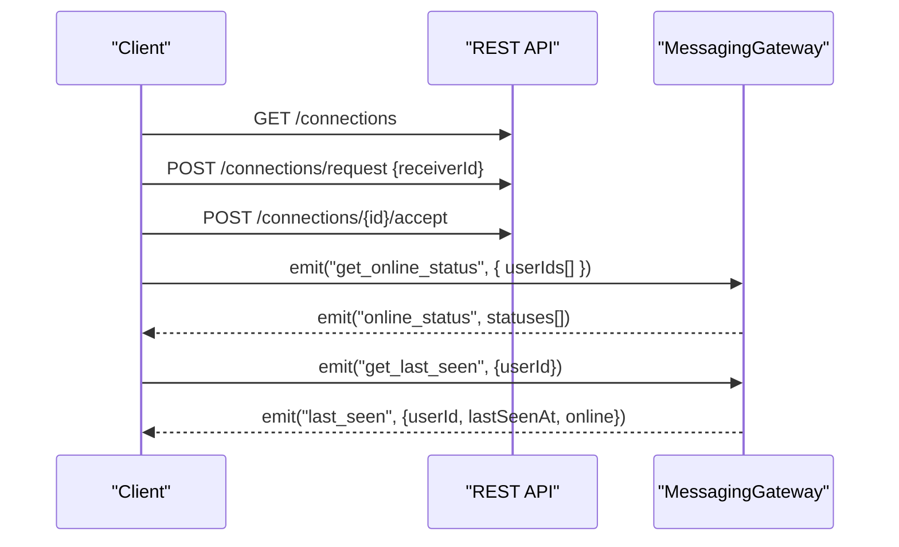
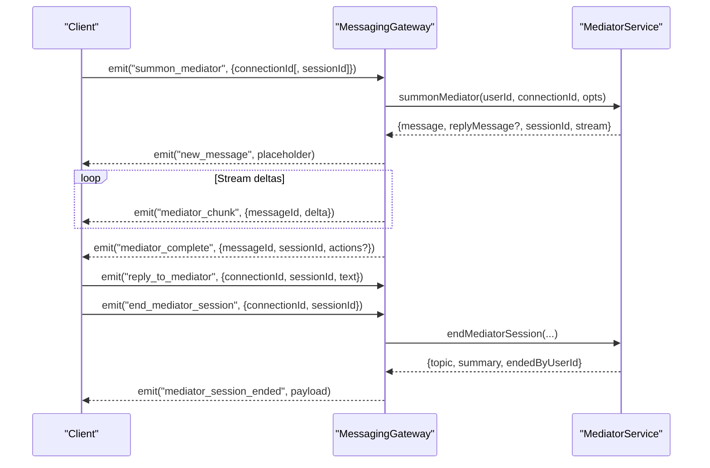
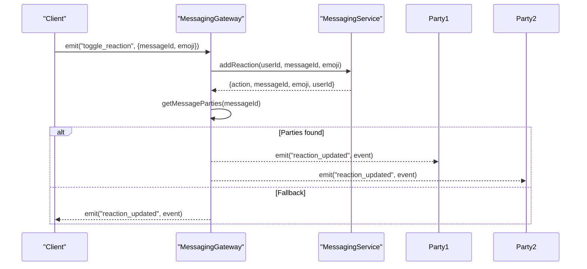
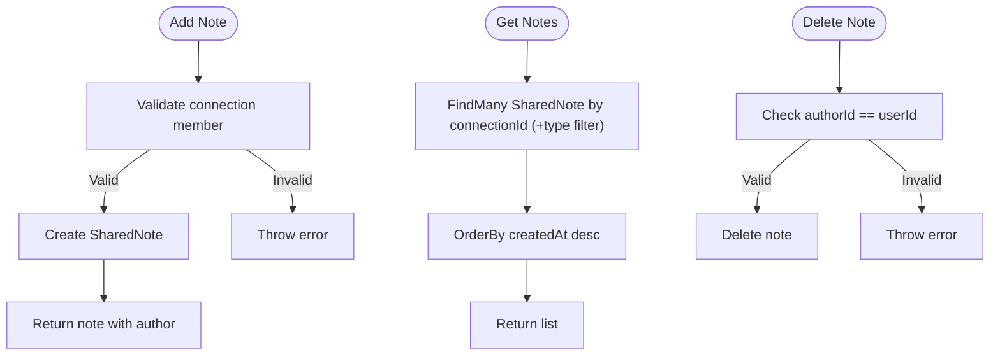
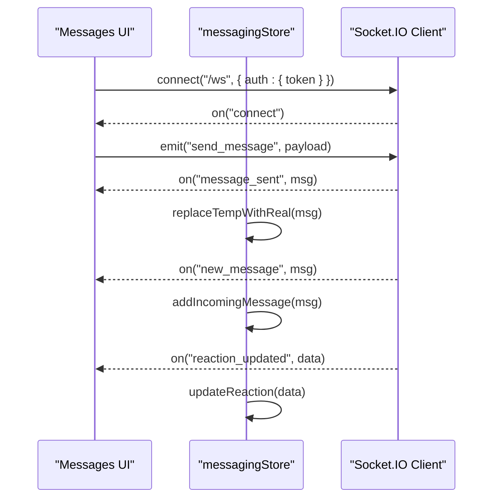
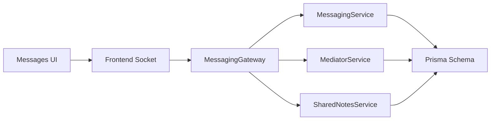

# Real-time Messaging

<cite>
**Referenced Files in This Document**
- [messaging.gateway.ts](file://backend/src/messaging/messaging.gateway.ts)
- [messaging.service.ts](file://backend/src/messaging/messaging.service.ts)
- [mediator.service.ts](file://backend/src/messaging/mediator.service.ts)
- [shared-notes.service.ts](file://backend/src/messaging/shared-notes.service.ts)
- [socket.ts](file://frontend/src/api/socket.ts)
- [messagingStore.ts](file://frontend/src/store/messagingStore.ts)
- [Messages.tsx](file://frontend/src/pages/Messages.tsx)
- [messaging.ts](file://frontend/src/api/messaging.ts)
- [schema.prisma](file://backend/prisma/schema.prisma)
</cite>

## Table of Contents
1. [Introduction](#introduction)
2. [Project Structure](#project-structure)
3. [Core Components](#core-components)
4. [Architecture Overview](#architecture-overview)
5. [Detailed Component Analysis](#detailed-component-analysis)
6. [Dependency Analysis](#dependency-analysis)
7. [Performance Considerations](#performance-considerations)
8. [Troubleshooting Guide](#troubleshooting-guide)
9. [Conclusion](#conclusion)

## Introduction
This document explains the real-time messaging system built with NestJS WebSockets and Socket.IO. It covers WebSocket-based communication, message threading, connection management, tri-chat mediation for multi-participant conversations, connection requests, message reactions, and shared notes. It also documents the WebSocket APIs, message formats, event types, and practical workflows for real-time collaboration, along with scalability and delivery guarantees.

## Project Structure
The messaging system spans backend and frontend:
- Backend: WebSocket gateway, messaging service, mediator service, shared notes service, and database schema.
- Frontend: Socket connection setup, event handlers, and UI integration.

**Diagram sources**
- [messaging.gateway.ts:62-180](file://backend/src/messaging/messaging.gateway.ts#L62-L180)
- [messaging.service.ts:22-96](file://backend/src/messaging/messaging.service.ts#L22-L96)
- [mediator.service.ts:132-278](file://backend/src/messaging/mediator.service.ts#L132-L278)
- [shared-notes.service.ts:5-67](file://backend/src/messaging/shared-notes.service.ts#L5-L67)
- [socket.ts:10-30](file://frontend/src/api/socket.ts#L10-L30)
- [messagingStore.ts:72-141](file://frontend/src/store/messagingStore.ts#L72-L141)
- [Messages.tsx:46-170](file://frontend/src/pages/Messages.tsx#L46-L170)
- [schema.prisma:516-637](file://backend/prisma/schema.prisma#L516-L637)

**Section sources**
- [messaging.gateway.ts:55-61](file://backend/src/messaging/messaging.gateway.ts#L55-L61)
- [socket.ts:10-30](file://frontend/src/api/socket.ts#L10-L30)

## Core Components
- MessagingGateway: WebSocket entry point handling authentication, rate limiting, connection lifecycle, and dispatching events to clients.
- MessagingService: CRUD operations for direct messages, reactions, read/delivered status, and conversation retrieval.
- MediatorService: Tri-chat mediation with streaming, session management, action cards, and privacy-preserving context building.
- SharedNotesService: Shared notes per connection with type filtering and relationship summary.
- Frontend Socket: Establishes WebSocket connection with JWT auth and transport selection.
- Messaging Store: Centralizes state for conversations, messages, tri-chat status, and mediator streams.
- Database Schema: Defines tables for users, connections, direct messages, reactions, mediation sessions, and shared notes.

**Section sources**
- [messaging.gateway.ts:62-180](file://backend/src/messaging/messaging.gateway.ts#L62-L180)
- [messaging.service.ts:22-96](file://backend/src/messaging/messaging.service.ts#L22-L96)
- [mediator.service.ts:132-278](file://backend/src/messaging/mediator.service.ts#L132-L278)
- [shared-notes.service.ts:5-67](file://backend/src/messaging/shared-notes.service.ts#L5-L67)
- [socket.ts:10-30](file://frontend/src/api/socket.ts#L10-L30)
- [messagingStore.ts:72-141](file://frontend/src/store/messagingStore.ts#L72-L141)
- [schema.prisma:516-637](file://backend/prisma/schema.prisma#L516-L637)

## Architecture Overview
The system uses a WebSocket namespace (/ws) with JWT authentication. Clients connect with a Bearer token or auth object. The gateway validates tokens, joins users into personal rooms, tracks online presence, enforces rate limits, and routes events to MessagingService and MediatorService.

**Diagram sources**
- [messaging.gateway.ts:127-247](file://backend/src/messaging/messaging.gateway.ts#L127-L247)
- [messaging.service.ts:53-96](file://backend/src/messaging/messaging.service.ts#L53-L96)
- [socket.ts:16-29](file://frontend/src/api/socket.ts#L16-L29)
- [Messages.tsx:49-58](file://frontend/src/pages/Messages.tsx#L49-L58)

## Detailed Component Analysis

### WebSocket Communication Infrastructure
- Authentication: Extracts token from handshake.auth or Authorization header, verifies with JWT secret, attaches userId to socket.
- Rooms: Joins each user into a personal room "user:{userId}" for targeted delivery.
- Presence: Tracks online users and emits user_online/user_offline events; updates lastSeenAt on disconnect.
- Rate Limiting: Sliding-window counters per user and event type; rejects excess with message_error.
- Validation: Strict input checks for string lengths and types before processing.

**Diagram sources**
- [messaging.gateway.ts:127-180](file://backend/src/messaging/messaging.gateway.ts#L127-L180)
- [messaging.gateway.ts:91-125](file://backend/src/messaging/messaging.gateway.ts#L91-L125)

**Section sources**
- [messaging.gateway.ts:127-180](file://backend/src/messaging/messaging.gateway.ts#L127-L180)
- [messaging.gateway.ts:91-125](file://backend/src/messaging/messaging.gateway.ts#L91-L125)

### Message Threading and Delivery Guarances
- Message lifecycle: sent -> delivered -> read with status updates and read receipts.
- Delivery: On connect, pending messages are marked delivered; if receiver is online, status is updated and message_status emitted.
- Read receipts: mark_read event updates read flags and notifies the other party.
- Replies: replyToId links messages to their parent; includes replyTo metadata in message includes.
- Pagination: cursor-based pagination with hasMore and nextCursor for efficient loading.

**Diagram sources**
- [messaging.gateway.ts:191-247](file://backend/src/messaging/messaging.gateway.ts#L191-L247)
- [messaging.gateway.ts:364-384](file://backend/src/messaging/messaging.gateway.ts#L364-L384)
- [messaging.service.ts:217-241](file://backend/src/messaging/messaging.service.ts#L217-L241)
- [messaging.service.ts:614-624](file://backend/src/messaging/messaging.service.ts#L614-L624)

**Section sources**
- [messaging.service.ts:456-503](file://backend/src/messaging/messaging.service.ts#L456-L503)
- [messaging.service.ts:614-624](file://backend/src/messaging/messaging.service.ts#L614-L624)

### Connection Management and Requests
- Connections: Enforce accepted connection before messaging; supports pin/mute/archive settings.
- Pending requests: REST endpoints for search, send, accept, reject, remove connections.
- Online status: Batch get_online_status with rate limit; returns per-user online state.
- Last seen: get_last_seen returns lastSeenAt and online flag.

**Diagram sources**
- [messaging.ts:107-145](file://frontend/src/api/messaging.ts#L107-L145)
- [messaging.gateway.ts:407-443](file://backend/src/messaging/messaging.gateway.ts#L407-L443)

**Section sources**
- [messaging.service.ts:267-291](file://backend/src/messaging/messaging.service.ts#L267-L291)
- [messaging.ts:107-145](file://frontend/src/api/messaging.ts#L107-L145)
- [messaging.gateway.ts:407-443](file://backend/src/messaging/messaging.gateway.ts#L407-L443)

### Tri-Chat Mediation System
- Toggle: Users independently enable/disable tri-chat; bothEnabled indicates mutual consent.
- Summon: Creates a placeholder mediator message, streams deltas, sanitizes output, persists final content, and emits mediator events.
- Sessions: Multi-turn sessions with idle timeout; end session generates topic and summary.
- Actions: Mediator suggests actions (ritual, task, tension, agreement); users accept to create downstream entities.
- Privacy: Context excludes private memory; mediator only references shared summary and recent conversation.

**Diagram sources**
- [messaging.gateway.ts:484-544](file://backend/src/messaging/messaging.gateway.ts#L484-L544)
- [messaging.gateway.ts:548-617](file://backend/src/messaging/messaging.gateway.ts#L548-L617)
- [messaging.gateway.ts:621-653](file://backend/src/messaging/messaging.gateway.ts#L621-L653)
- [mediator.service.ts:661-1008](file://backend/src/messaging/mediator.service.ts#L661-L1008)
- [mediator.service.ts:1043-1154](file://backend/src/messaging/mediator.service.ts#L1043-L1154)

**Section sources**
- [messaging.gateway.ts:447-480](file://backend/src/messaging/messaging.gateway.ts#L447-L480)
- [mediator.service.ts:203-278](file://backend/src/messaging/mediator.service.ts#L203-L278)
- [mediator.service.ts:661-1008](file://backend/src/messaging/mediator.service.ts#L661-L1008)
- [mediator.service.ts:1043-1154](file://backend/src/messaging/mediator.service.ts#L1043-L1154)

### Message Reactions
- Toggle reaction: Validates participation in conversation, upserts reaction, and broadcasts to both parties.
- UI updates: Optimistically adds/removes reactions; server echoes action to reconcile.

**Diagram sources**
- [messaging.gateway.ts:318-360](file://backend/src/messaging/messaging.gateway.ts#L318-L360)
- [messaging.service.ts:179-202](file://backend/src/messaging/messaging.service.ts#L179-L202)
- [messaging.service.ts:640-645](file://backend/src/messaging/messaging.service.ts#L640-L645)

**Section sources**
- [messaging.gateway.ts:318-360](file://backend/src/messaging/messaging.gateway.ts#L318-L360)
- [messaging.service.ts:179-202](file://backend/src/messaging/messaging.service.ts#L179-L202)

### Shared Notes Functionality
- Add note: Validates connection membership and authorship; returns note with author included.
- Get notes: Filters by optional noteType; ordered by createdAt desc.
- Delete note: Author-only deletion.
- Shared relationship: Aggregates shared notes, message count, and counts by type.

**Diagram sources**
- [shared-notes.service.ts:26-67](file://backend/src/messaging/shared-notes.service.ts#L26-L67)
- [shared-notes.service.ts:73-117](file://backend/src/messaging/shared-notes.service.ts#L73-L117)

**Section sources**
- [shared-notes.service.ts:26-67](file://backend/src/messaging/shared-notes.service.ts#L26-L67)
- [shared-notes.service.ts:73-117](file://backend/src/messaging/shared-notes.service.ts#L73-L117)

### Frontend Integration and Event Handling
- Socket setup: Connects to /ws with JWT auth and WebSocket/polling transports.
- Event listeners: Handles new_message, message_sent, message_status, messages_read, message_edited, message_deleted, reaction_updated, user_online/offline, and tri-chat mediator events.
- Optimistic UI: Adds temporary messages on send; replaces with real message on message_sent; updates read status and reactions.

**Diagram sources**
- [socket.ts:10-30](file://frontend/src/api/socket.ts#L10-L30)
- [Messages.tsx:49-135](file://frontend/src/pages/Messages.tsx#L49-L135)
- [messagingStore.ts:156-280](file://frontend/src/store/messagingStore.ts#L156-L280)

**Section sources**
- [socket.ts:10-30](file://frontend/src/api/socket.ts#L10-L30)
- [Messages.tsx:49-135](file://frontend/src/pages/Messages.tsx#L49-L135)
- [messagingStore.ts:156-280](file://frontend/src/store/messagingStore.ts#L156-L280)

## Dependency Analysis
- Gateway depends on MessagingService and MediatorService for business logic.
- Services depend on Prisma for persistence.
- Frontend depends on backend REST endpoints and WebSocket events.
- Database schema defines relationships among users, connections, messages, reactions, mediation sessions, and shared notes.

**Diagram sources**
- [messaging.gateway.ts:74-79](file://backend/src/messaging/messaging.gateway.ts#L74-L79)
- [messaging.service.ts:23-26](file://backend/src/messaging/messaging.service.ts#L23-L26)
- [mediator.service.ts:139-145](file://backend/src/messaging/mediator.service.ts#L139-L145)
- [shared-notes.service.ts](file://backend/src/messaging/shared-notes.service.ts#L6)
- [schema.prisma:516-637](file://backend/prisma/schema.prisma#L516-L637)
- [socket.ts:16-29](file://frontend/src/api/socket.ts#L16-L29)
- [Messages.tsx:49-135](file://frontend/src/pages/Messages.tsx#L49-L135)

**Section sources**
- [messaging.gateway.ts:74-79](file://backend/src/messaging/messaging.gateway.ts#L74-L79)
- [schema.prisma:516-637](file://backend/prisma/schema.prisma#L516-L637)

## Performance Considerations
- Rate limiting: Sliding-window counters per user and event prevent abuse; periodic cleanup prevents memory growth.
- Query optimization: MessagingService uses a single query with DISTINCT ON and groupBy to compute last messages and unread counts efficiently.
- Streaming: Mediator streams deltas to clients; sanitization and tool-call gating ensure only final replies are shown.
- Presence: Online tracking uses userId -> Set<socketId> for O(1) membership checks.
- Scalability: Namespace separation (/ws) and room-based broadcasting minimize unnecessary fan-out.

[No sources needed since this section provides general guidance]

## Troubleshooting Guide
- Connection fails: Verify token presence and validity; check CORS origins and JWT secret configuration.
- Rate limit exceeded: Client receives message_error with RATE_LIMIT code; reduce event frequency.
- Invalid payload: message_error with INVALID_INPUT code; validate payload shape and sizes against limits.
- Offline/last seen: Ensure lastSeenAt updates on disconnect; use get_last_seen for accurate timing.
- Mediator errors: mediator_error includes error code and messageId; mediator_cancelled removes empty placeholders.

**Section sources**
- [messaging.gateway.ts:111-125](file://backend/src/messaging/messaging.gateway.ts#L111-L125)
- [messaging.gateway.ts:428-443](file://backend/src/messaging/messaging.gateway.ts#L428-L443)
- [messaging.gateway.ts:524-543](file://backend/src/messaging/messaging.gateway.ts#L524-L543)

## Conclusion
The real-time messaging system integrates secure WebSocket communication, robust message threading, tri-chat mediation, and shared notes within a scalable architecture. The gateway handles authentication, presence, and rate limits; services encapsulate business logic; and the frontend provides responsive, optimistic UI updates synchronized via events. Privacy-preserving mediation and efficient database queries support smooth real-time collaboration at scale.