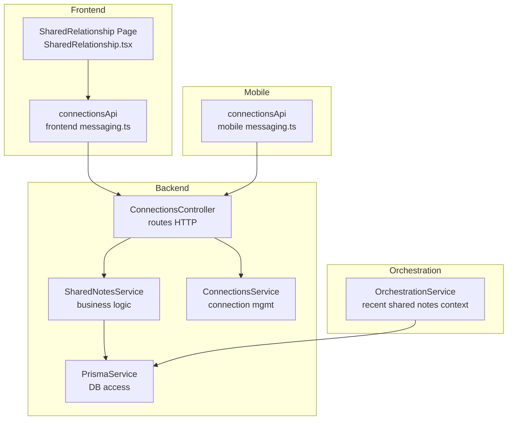
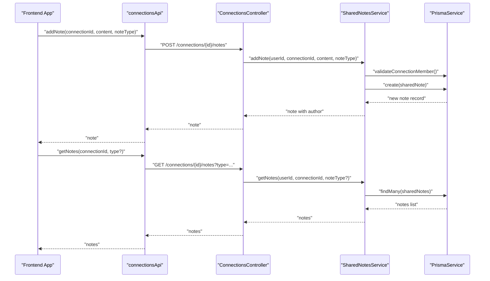
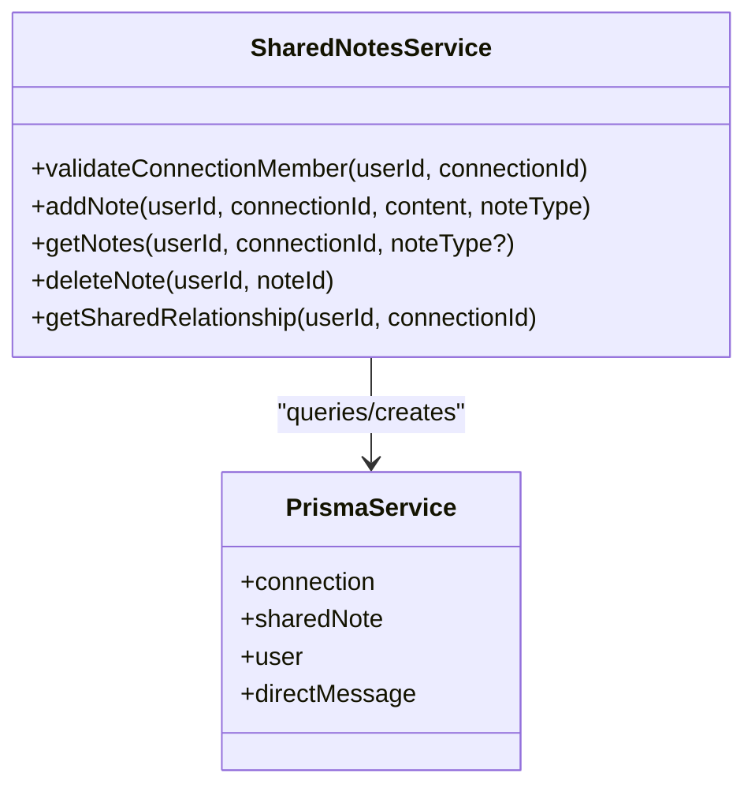
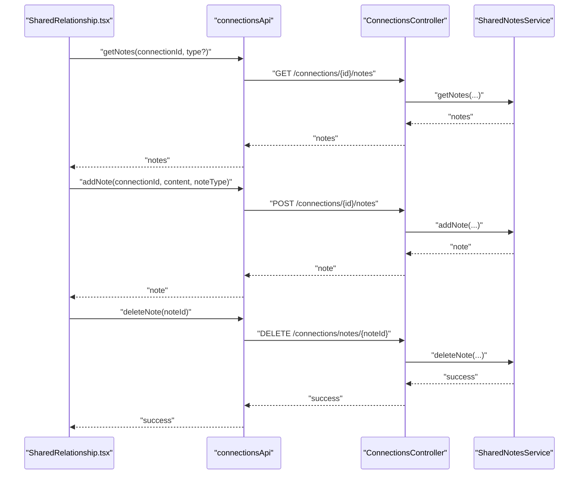
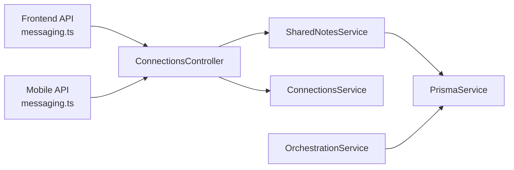
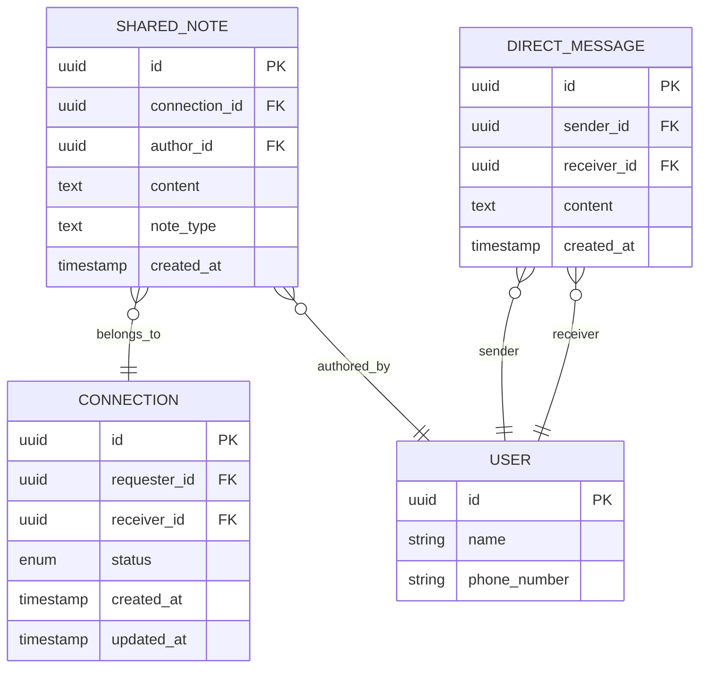

# Shared Notes

<cite>
**Referenced Files in This Document**
- [shared-notes.service.ts](file://backend/src/messaging/shared-notes.service.ts)
- [connections.controller.ts](file://backend/src/messaging/connections.controller.ts)
- [connections.service.ts](file://backend/src/messaging/connections.service.ts)
- [add-shared-note.dto.ts](file://backend/src/messaging/dto/add-shared-note.dto.ts)
- [messaging.ts (frontend)](file://frontend/src/api/messaging.ts)
- [messaging.ts (mobile)](file://mobile/src/api/messaging.ts)
- [SharedRelationship.tsx](file://frontend/src/pages/SharedRelationship.tsx)
- [Connections.tsx](file://frontend/src/pages/Connections.tsx)
- [orchestration.service.ts](file://backend/src/orchestration/orchestration.service.ts)
- [migration.sql (social messaging)](file://backend/prisma/migrations/20260422085110_add_social_messaging/migration.sql)
- [migration.sql (context embeddings)](file://backend/prisma/migrations/20260427085039_add_context_embeddings/migration.sql)
</cite>

## Table of Contents
1. [Introduction](#introduction)
2. [Project Structure](#project-structure)
3. [Core Components](#core-components)
4. [Architecture Overview](#architecture-overview)
5. [Detailed Component Analysis](#detailed-component-analysis)
6. [Dependency Analysis](#dependency-analysis)
7. [Performance Considerations](#performance-considerations)
8. [Troubleshooting Guide](#troubleshooting-guide)
9. [Conclusion](#conclusion)
10. [Appendices](#appendices)

## Introduction
This document explains the shared notes functionality within connections. It covers how notes are created, edited, and shared between connected users, how permissions and access control work, and how the system integrates with the messaging platform. It also documents the collaborative editing interface, versioning behavior, synchronization mechanisms, and security considerations. Practical examples illustrate typical workflows, and diagrams clarify the end-to-end flows.

## Project Structure
Shared notes live in the messaging domain and integrate with connections and messaging. The key pieces are:
- Backend controller and service for shared notes
- DTO validation for note creation
- Frontend and mobile APIs for CRUD operations
- A dedicated shared relationship view that aggregates notes and counts
- Orchestration integration to surface recent shared notes context

**Diagram sources**
- [connections.controller.ts:19-113](file://backend/src/messaging/connections.controller.ts#L19-L113)
- [shared-notes.service.ts:5-118](file://backend/src/messaging/shared-notes.service.ts#L5-L118)
- [connections.service.ts:7-384](file://backend/src/messaging/connections.service.ts#L7-L384)
- [messaging.ts (frontend):107-145](file://frontend/src/api/messaging.ts#L107-L145)
- [SharedRelationship.tsx:161-255](file://frontend/src/pages/SharedRelationship.tsx#L161-L255)
- [messaging.ts (mobile):108-152](file://mobile/src/api/messaging.ts#L108-L152)
- [orchestration.service.ts:479-507](file://backend/src/orchestration/orchestration.service.ts#L479-L507)

**Section sources**
- [connections.controller.ts:19-113](file://backend/src/messaging/connections.controller.ts#L19-L113)
- [shared-notes.service.ts:5-118](file://backend/src/messaging/shared-notes.service.ts#L5-L118)
- [connections.service.ts:7-384](file://backend/src/messaging/connections.service.ts#L7-L384)
- [messaging.ts (frontend):107-145](file://frontend/src/api/messaging.ts#L107-L145)
- [messaging.ts (mobile):108-152](file://mobile/src/api/messaging.ts#L108-L152)
- [SharedRelationship.tsx:161-255](file://frontend/src/pages/SharedRelationship.tsx#L161-L255)
- [orchestration.service.ts:479-507](file://backend/src/orchestration/orchestration.service.ts#L479-L507)

## Core Components
- SharedNotesService: Validates membership, persists notes, retrieves notes, deletes notes (author-only), and builds shared relationship summaries.
- ConnectionsController: Exposes HTTP endpoints for getting, adding, and deleting notes, plus the shared relationship view.
- AddSharedNoteDto: Validates content length and optional noteType during creation.
- Frontend/mobile connectionsApi: Provides typed wrappers around the shared notes endpoints.
- SharedRelationship Page: Renders notes, supports filtering by type, and allows adding/deleting notes.
- OrchestrationService: Aggregates recent shared notes across connections for broader context.

Key capabilities:
- Permission enforcement: Only members of an accepted connection can access notes; deletion requires authorship.
- Filtering: Notes can be filtered by noteType.
- Shared relationship view: Aggregates notes, counts, and message statistics for a connection.
- Integration: Recent shared notes are surfaced to orchestration for broader context.

**Section sources**
- [shared-notes.service.ts:11-118](file://backend/src/messaging/shared-notes.service.ts#L11-L118)
- [connections.controller.ts:77-112](file://backend/src/messaging/connections.controller.ts#L77-L112)
- [add-shared-note.dto.ts:3-11](file://backend/src/messaging/dto/add-shared-note.dto.ts#L3-L11)
- [messaging.ts (frontend):87-105](file://frontend/src/api/messaging.ts#L87-L105)
- [messaging.ts (mobile):88-106](file://mobile/src/api/messaging.ts#L88-L106)
- [SharedRelationship.tsx:82-255](file://frontend/src/pages/SharedRelationship.tsx#L82-L255)
- [orchestration.service.ts:479-507](file://backend/src/orchestration/orchestration.service.ts#L479-L507)

## Architecture Overview
End-to-end flow for shared note creation and retrieval:

**Diagram sources**
- [connections.controller.ts:79-105](file://backend/src/messaging/connections.controller.ts#L79-L105)
- [shared-notes.service.ts:26-55](file://backend/src/messaging/shared-notes.service.ts#L26-L55)
- [messaging.ts (frontend):132-144](file://frontend/src/api/messaging.ts#L132-L144)

## Detailed Component Analysis

### Shared Notes Service
Responsibilities:
- Validate that a user belongs to an accepted connection before allowing operations.
- Persist new notes with author and noteType.
- Retrieve notes with optional type filter, ordered by creation time.
- Author-only deletion of notes.
- Build a shared relationship summary including counts and partner info.

Access control highlights:
- Membership check enforces that only users part of an accepted connection can operate on its notes.
- Deletion is restricted to the note’s author.

**Diagram sources**
- [shared-notes.service.ts:11-118](file://backend/src/messaging/shared-notes.service.ts#L11-L118)

**Section sources**
- [shared-notes.service.ts:11-118](file://backend/src/messaging/shared-notes.service.ts#L11-L118)

### Connections Controller (Endpoints)
Exposes:
- GET /connections/:id/notes (with optional type query param)
- POST /connections/:id/notes
- DELETE /connections/notes/:noteId
- GET /connections/:id/shared (shared relationship view)

Security:
- All endpoints are protected by JWT guard.
- Operations delegate to SharedNotesService, which enforces membership and ownership.

**Section sources**
- [connections.controller.ts:77-112](file://backend/src/messaging/connections.controller.ts#L77-L112)

### DTO Validation
AddSharedNoteDto ensures:
- content is a non-empty string.
- noteType is optional and treated as a string.

**Section sources**
- [add-shared-note.dto.ts:3-11](file://backend/src/messaging/dto/add-shared-note.dto.ts#L3-L11)

### Frontend and Mobile Integration
- Typed interfaces for SharedNote and SharedRelationship.
- API wrappers for getNotes, addNote, deleteNote, and getSharedRelationship.
- SharedRelationship page renders notes, supports type filtering, and handles add/delete actions.

**Diagram sources**
- [messaging.ts (frontend):132-144](file://frontend/src/api/messaging.ts#L132-L144)
- [SharedRelationship.tsx:161-255](file://frontend/src/pages/SharedRelationship.tsx#L161-L255)
- [connections.controller.ts:79-105](file://backend/src/messaging/connections.controller.ts#L79-L105)
- [shared-notes.service.ts:26-67](file://backend/src/messaging/shared-notes.service.ts#L26-L67)

**Section sources**
- [messaging.ts (frontend):87-105](file://frontend/src/api/messaging.ts#L87-L105)
- [messaging.ts (mobile):88-106](file://mobile/src/api/messaging.ts#L88-L106)
- [SharedRelationship.tsx:82-255](file://frontend/src/pages/SharedRelationship.tsx#L82-L255)

### Collaborative Editing Interface
- The shared relationship page displays notes grouped by type and shows who authored each note and when it was created.
- Users can add new notes via a form with type selection and submit content.
- Deleting a note is supported only by the original author.

Note filtering:
- UI supports filtering by noteType to focus on specific categories (e.g., general, ritual_log, milestone, memory).

**Section sources**
- [SharedRelationship.tsx:82-255](file://frontend/src/pages/SharedRelationship.tsx#L82-L255)
- [messaging.ts (frontend):87-105](file://frontend/src/api/messaging.ts#L87-L105)

### Version History and Synchronization
Observed behavior:
- Notes are retrieved ordered by creation time, descending.
- There is no explicit edit endpoint for notes; deletions are supported for author-only.
- No embedded version history is exposed in the current API.

Implications:
- Real-time collaboration is not indicated for shared notes in the current implementation.
- Synchronization relies on periodic polling via getNotes and immediate UI refresh upon add/delete operations.

**Section sources**
- [shared-notes.service.ts:42-55](file://backend/src/messaging/shared-notes.service.ts#L42-L55)
- [connections.controller.ts:79-105](file://backend/src/messaging/connections.controller.ts#L79-L105)

### Attachment System and Messaging Integration
- Shared notes are standalone textual entries associated with a connection.
- There is no note attachment model in the current schema snapshot.
- The messaging module integrates with shared notes through:
  - Shared relationship view that also counts messages between users.
  - Orchestration service surfacing recent shared notes as contextual information.

**Section sources**
- [migration.sql (social messaging):25-52](file://backend/prisma/migrations/20260422085110_add_social_messaging/migration.sql#L25-L52)
- [migration.sql (context embeddings):31-70](file://backend/prisma/migrations/20260427085039_add_context_embeddings/migration.sql#L31-L70)
- [connections.controller.ts:109-112](file://backend/src/messaging/connections.controller.ts#L109-L112)
- [orchestration.service.ts:479-507](file://backend/src/orchestration/orchestration.service.ts#L479-L507)

### Practical Examples

- Create a shared note
  - Call addNote with connectionId, content, and optional noteType.
  - Example path: [messaging.ts (frontend):136-137](file://frontend/src/api/messaging.ts#L136-L137)

- Retrieve shared notes
  - Call getNotes with connectionId and optional type filter.
  - Example path: [messaging.ts (frontend):133-134](file://frontend/src/api/messaging.ts#L133-L134)

- Delete a shared note
  - Call deleteNote with noteId (author-only).
  - Example path: [messaging.ts (frontend):139-140](file://frontend/src/api/messaging.ts#L139-L140)

- Access the shared relationship view
  - Call getSharedRelationship with connectionId to see aggregated stats and notes.
  - Example path: [messaging.ts (frontend):143-144](file://frontend/src/api/messaging.ts#L143-L144)

**Section sources**
- [messaging.ts (frontend):132-144](file://frontend/src/api/messaging.ts#L132-L144)
- [messaging.ts (mobile):141-151](file://mobile/src/api/messaging.ts#L141-L151)

### Permission Handling and Security
- Membership validation: Only users part of an accepted connection can access notes.
- Ownership validation: Only the author can delete a note.
- Endpoint protection: All shared notes endpoints are guarded by JWT.

Data persistence:
- Notes are persisted with authorId, connectionId, content, and noteType.
- Embeddings for notes were present historically but are removed in later migrations.

**Section sources**
- [shared-notes.service.ts:11-21](file://backend/src/messaging/shared-notes.service.ts#L11-L21)
- [shared-notes.service.ts:60-67](file://backend/src/messaging/shared-notes.service.ts#L60-L67)
- [connections.controller.ts:19-25](file://backend/src/messaging/connections.controller.ts#L19-L25)
- [migration.sql (social messaging):25-52](file://backend/prisma/migrations/20260422085110_add_social_messaging/migration.sql#L25-L52)
- [migration.sql (context embeddings):31-70](file://backend/prisma/migrations/20260427085039_add_context_embeddings/migration.sql#L31-L70)

## Dependency Analysis
High-level dependencies:
- Frontend/mobile clients depend on typed APIs for shared notes.
- Controllers depend on SharedNotesService for business logic.
- SharedNotesService depends on PrismaService for database operations.
- ConnectionsController also coordinates with ConnectionsService for connection lifecycle.
- OrchestrationService queries shared notes to enrich context.

**Diagram sources**
- [connections.controller.ts:19-113](file://backend/src/messaging/connections.controller.ts#L19-L113)
- [shared-notes.service.ts:5-118](file://backend/src/messaging/shared-notes.service.ts#L5-L118)
- [connections.service.ts:7-384](file://backend/src/messaging/connections.service.ts#L7-L384)
- [messaging.ts (frontend):107-145](file://frontend/src/api/messaging.ts#L107-L145)
- [messaging.ts (mobile):108-152](file://mobile/src/api/messaging.ts#L108-L152)
- [orchestration.service.ts:479-507](file://backend/src/orchestration/orchestration.service.ts#L479-L507)

**Section sources**
- [connections.controller.ts:19-113](file://backend/src/messaging/connections.controller.ts#L19-L113)
- [shared-notes.service.ts:5-118](file://backend/src/messaging/shared-notes.service.ts#L5-L118)
- [connections.service.ts:7-384](file://backend/src/messaging/connections.service.ts#L7-L384)
- [messaging.ts (frontend):107-145](file://frontend/src/api/messaging.ts#L107-L145)
- [messaging.ts (mobile):108-152](file://mobile/src/api/messaging.ts#L108-L152)
- [orchestration.service.ts:479-507](file://backend/src/orchestration/orchestration.service.ts#L479-L507)

## Performance Considerations
- Queries are straightforward: membership checks, creation, retrieval with optional filters, and author validation for deletion.
- Ordering by createdAt desc ensures most recent notes appear first.
- Aggregation in getSharedRelationship uses a capped fetch and count; consider pagination for very large histories.
- Embeddings for notes were removed; avoid expensive vector operations for shared notes.

[No sources needed since this section provides general guidance]

## Troubleshooting Guide
Common issues and resolutions:
- Connection not found or not accepted
  - Symptom: 404/Forbidden when accessing notes.
  - Cause: User not a member or connection not accepted.
  - Resolution: Verify connection status and membership before operating on notes.

- Not authorized to delete note
  - Symptom: 403 when attempting to delete.
  - Cause: Caller is not the note’s author.
  - Resolution: Only the author can delete.

- Invalid noteType
  - Symptom: Validation errors on creation.
  - Cause: noteType must be a string; content must be non-empty.
  - Resolution: Ensure DTO compliance.

- No notes returned
  - Symptom: Empty list.
  - Cause: No notes for the connection or wrong type filter.
  - Resolution: Clear type filter or confirm note existence.

**Section sources**
- [shared-notes.service.ts:15-21](file://backend/src/messaging/shared-notes.service.ts#L15-L21)
- [shared-notes.service.ts:62-67](file://backend/src/messaging/shared-notes.service.ts#L62-L67)
- [add-shared-note.dto.ts:3-11](file://backend/src/messaging/dto/add-shared-note.dto.ts#L3-L11)

## Conclusion
Shared notes provide a simple, permission-aware mechanism for collaborators within accepted connections to capture and review shared insights. The current implementation focuses on basic CRUD operations, author-only deletion, and aggregation into a shared relationship view. While real-time collaborative editing is not present, the system’s design leaves room for future enhancements such as edit endpoints, version history, and synchronized editing surfaces.

[No sources needed since this section summarizes without analyzing specific files]

## Appendices

### Data Model Snapshot

**Diagram sources**
- [migration.sql (social messaging):25-52](file://backend/prisma/migrations/20260422085110_add_social_messaging/migration.sql#L25-L52)

### Real-Time Collaboration Patterns
- Current state: No WebSocket or real-time update hooks for shared notes.
- Recommended pattern (conceptual):
  - Emit noteCreated/noteDeleted events on the gateway.
  - Clients subscribe to connection-specific channels.
  - Apply optimistic updates and reconcile on server ack.

[No sources needed since this diagram shows conceptual workflow, not actual code structure]