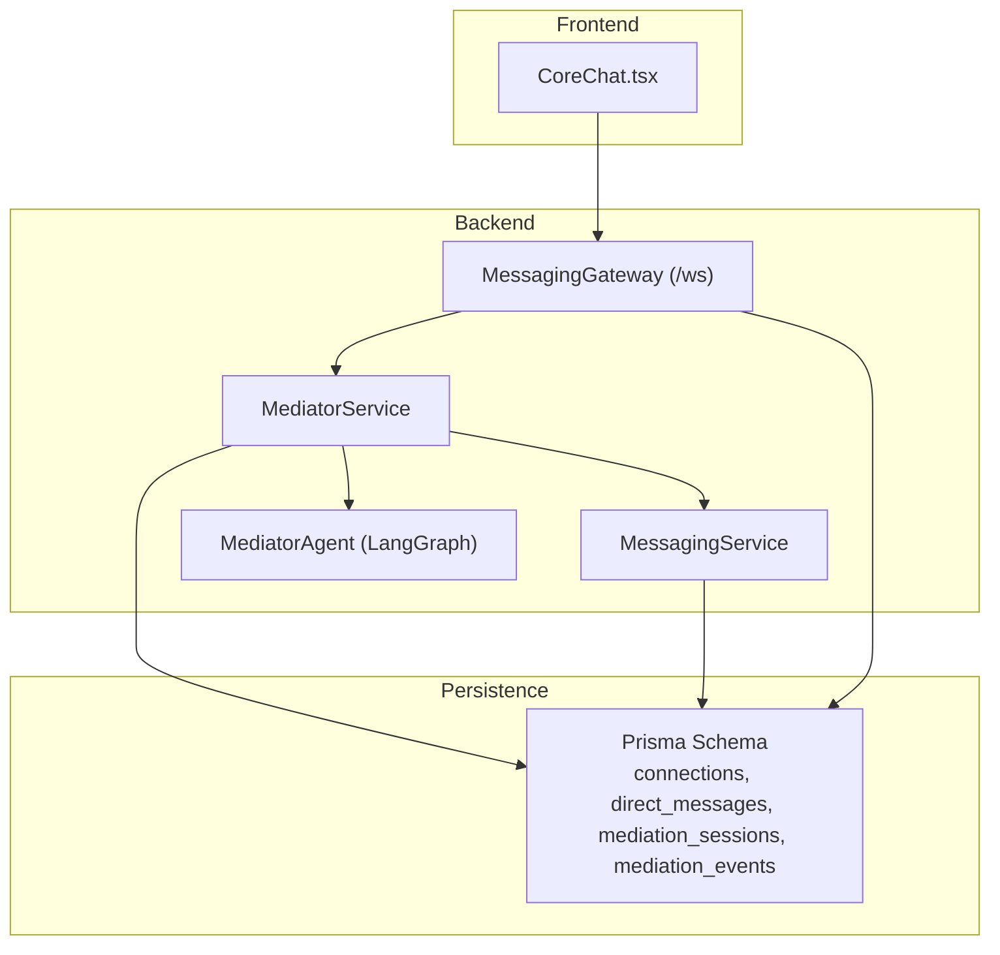
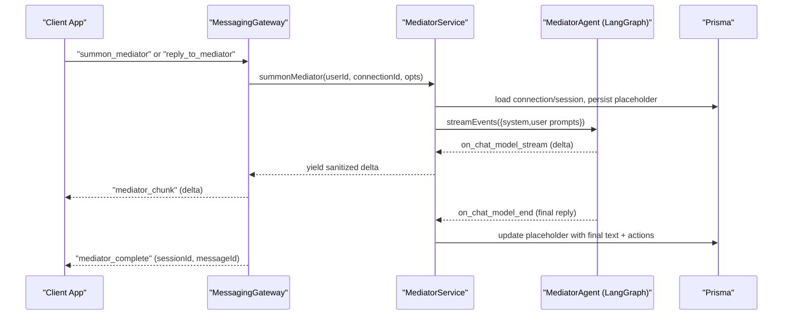
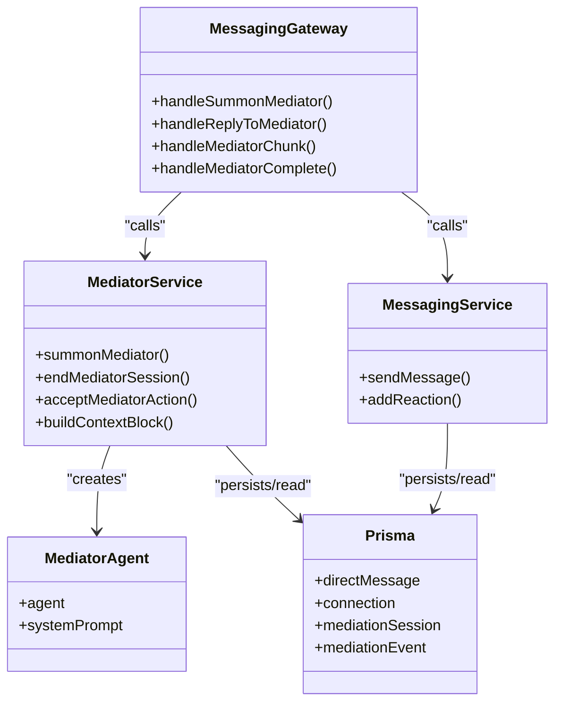
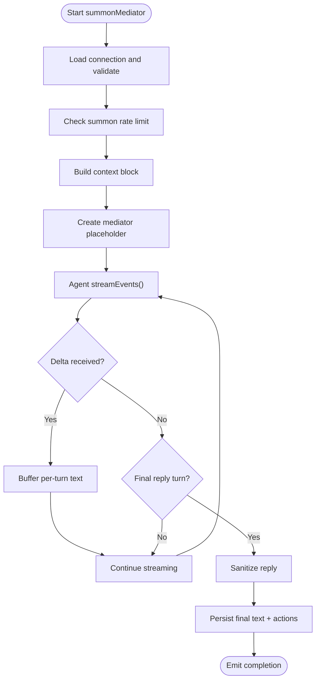

# Tri-Chat Mediation

<cite>
**Referenced Files in This Document**
- [mediator.service.ts](file://backend/src/messaging/mediator.service.ts)
- [mediator-agent.ts](file://backend/src/messaging/graph/mediator-agent.ts)
- [mediator-prompt.ts](file://backend/src/messaging/graph/mediator-prompt.ts)
- [mediator-action-tools.ts](file://backend/src/messaging/graph/tools/mediator-action-tools.ts)
- [analyze-moods.tool.ts](file://backend/src/messaging/graph/tools/analyze-moods.tool.ts)
- [messaging.gateway.ts](file://backend/src/messaging/messaging.gateway.ts)
- [messaging.service.ts](file://backend/src/messaging/messaging.service.ts)
- [20260430200000_add_tri_chat/migration.sql](file://backend/prisma/migrations/20260430200000_add_tri_chat/migration.sql)
- [20260430210000_mediator_v2/migration.sql](file://backend/prisma/migrations/20260430210000_mediator_v2/migration.sql)
- [20260501081526_add_mediator_name/migration.sql](file://backend/prisma/migrations/20260501081526_add_mediator_name/migration.sql)
- [20260501141000_tri_chat_default_on/migration.sql](file://backend/prisma/migrations/20260501141000_tri_chat_default_on/migration.sql)
- [20260510150000_add_session_recap_cache/migration.sql](file://backend/prisma/migrations/20260510150000_add_session_recap_cache/migration.sql)
- [20260510170000_add_life_dimensions/migration.sql](file://backend/prisma/migrations/20260510170000_add_life_dimensions/migration.sql)
- [20260510180000_add_sign_in_with_apple/migration.sql](file://backend/prisma/migrations/20260510180000_add_sign_in_with_apple/migration.sql)
- [20260510220000_add_llm_usage_and_token_quotas/migration.sql](file://backend/prisma/migrations/20260510220000_add_llm_usage_and_token_quotas/migration.sql)
- [CoreChat.tsx](file://frontend/src/pages/CoreChat.tsx)
</cite>

## Table of Contents
1. [Introduction](#introduction)
2. [Project Structure](#project-structure)
3. [Core Components](#core-components)
4. [Architecture Overview](#architecture-overview)
5. [Detailed Component Analysis](#detailed-component-analysis)
6. [Dependency Analysis](#dependency-analysis)
7. [Performance Considerations](#performance-considerations)
8. [Troubleshooting Guide](#troubleshooting-guide)
9. [Conclusion](#conclusion)
10. [Appendices](#appendices)

## Introduction
This document explains the tri-chat mediation system that enables a “third friend” mediator to observe and intervene in private two-person chats. The mediator is invoked by either participant, operates within a session lifecycle, and streams real-time deltas to both sides. It supports action cards (rituals, tasks, tensions, agreements), one-sided chat history clearing with continuity, and robust error recovery. The system is built with NestJS, Socket.IO, LangGraph ReAct agents, and Prisma ORM.

## Project Structure
The tri-chat mediation spans backend services, a WebSocket gateway, a LangGraph agent, and frontend integration:
- Backend services: mediator orchestration, messaging, and gateway
- Agent framework: ReAct agent with specialized tools
- Persistence: Prisma schema with tri-chat and mediator session tables
- Frontend: CoreChat page integrates mediator controls and streaming UI

**Diagram sources**
- [messaging.gateway.ts:62-761](file://backend/src/messaging/messaging.gateway.ts#L62-L761)
- [mediator.service.ts:132-1279](file://backend/src/messaging/mediator.service.ts#L132-L1279)
- [mediator-agent.ts:23-70](file://backend/src/messaging/graph/mediator-agent.ts#L23-L70)
- [messaging.service.ts:22-647](file://backend/src/messaging/messaging.service.ts#L22-L647)
- [20260430210000_mediator_v2/migration.sql:13-49](file://backend/prisma/migrations/20260430210000_mediator_v2/migration.sql#L13-L49)

**Section sources**
- [messaging.gateway.ts:62-761](file://backend/src/messaging/messaging.gateway.ts#L62-L761)
- [mediator.service.ts:132-1279](file://backend/src/messaging/mediator.service.ts#L132-L1279)
- [mediator-agent.ts:23-70](file://backend/src/messaging/graph/mediator-agent.ts#L23-L70)
- [messaging.service.ts:22-647](file://backend/src/messaging/messaging.service.ts#L22-L647)
- [20260430210000_mediator_v2/migration.sql:13-49](file://backend/prisma/migrations/20260430210000_mediator_v2/migration.sql#L13-L49)

## Core Components
- MediatorService orchestrates tri-chat toggles, session lifecycle, context building, streaming, and action card acceptance.
- MediatorAgent is a LangGraph ReAct agent with tools for mood analysis, web search, Wikipedia lookup, and action suggestions.
- MessagingGateway handles WebSocket events for tri-chat: summoning, replying, streaming deltas, ending sessions, renaming mediator, and accepting action cards.
- MessagingService manages standard messaging and relays relational events.

Key capabilities:
- Real-time streaming with delta chunks and completion handling
- Session management with idle timeouts and multi-turn continuity
- Privacy-preserving context: shared summaries, recent transcripts, and prior mediation history
- Action cards: suggested rituals, tasks, tension logs, and agreements
- One-sided chat history clearing with continuity summary

**Section sources**
- [mediator.service.ts:107-129](file://backend/src/messaging/mediator.service.ts#L107-L129)
- [mediator.service.ts:659-1008](file://backend/src/messaging/mediator.service.ts#L659-L1008)
- [mediator-agent.ts:23-70](file://backend/src/messaging/graph/mediator-agent.ts#L23-L70)
- [messaging.gateway.ts:482-760](file://backend/src/messaging/messaging.gateway.ts#L482-L760)
- [messaging.service.ts:22-96](file://backend/src/messaging/messaging.service.ts#L22-L96)

## Architecture Overview
The tri-chat mediator follows a request-response streaming flow over WebSockets:
1. Client emits a tri-chat event (summon, reply, end session, rename, accept action).
2. Gateway validates and rate-limits, then delegates to MediatorService.
3. MediatorService builds context, creates/validates session, and starts a ReAct agent stream.
4. Agent emits tool calls and text deltas; MediatorService buffers and sanitizes output.
5. Gateway streams deltas to both participants; completion events finalize the mediator message.

**Diagram sources**
- [messaging.gateway.ts:484-544](file://backend/src/messaging/messaging.gateway.ts#L484-L544)
- [mediator.service.ts:808-1000](file://backend/src/messaging/mediator.service.ts#L808-L1000)
- [mediator-agent.ts:66-69](file://backend/src/messaging/graph/mediator-agent.ts#L66-L69)

**Section sources**
- [messaging.gateway.ts:482-544](file://backend/src/messaging/messaging.gateway.ts#L482-L544)
- [mediator.service.ts:808-1000](file://backend/src/messaging/mediator.service.ts#L808-L1000)
- [mediator-agent.ts:66-69](file://backend/src/messaging/graph/mediator-agent.ts#L66-L69)

## Detailed Component Analysis

### MediatorService
Responsibilities:
- Toggle tri-chat per user/connection and compute status (including active session and turns left)
- Enforce rate limits and quotas (monthly free turns)
- Build privacy-preserving context blocks (earlier summary, recent transcript, current session, prior sessions)
- Summon or continue a session, persist placeholder mediator message, and stream deltas
- Sanitize final reply and persist action cards
- End sessions with topic and summary generation
- Accept action cards and create downstream entities (rituals, tasks, tensions, agreements)

Concurrency and safety:
- Per-connection summon timestamps tracked with periodic cleanup
- Session idle detection ends stale sessions
- Quota consumption is best-effort and does not block streaming

Streaming and sanitization:
- Buffers per-turn text until final reply turn
- Discards tool-calling turns; only final reply surfaces
- Post-processes output to remove leaked artifacts

Session lifecycle:
- Creates session on first summon or reuses active session
- Updates lastTurnAt on each turn
- Ends session after idle timeout or explicit end

Action card acceptance:
- Validates message ownership and mediator type
- Persists acceptance and records mediation events
- Creates downstream domain entities (rituals, tasks, tensions)

**Section sources**
- [mediator.service.ts:132-1279](file://backend/src/messaging/mediator.service.ts#L132-L1279)

### MediatorAgent (LangGraph ReAct)
Agent composition:
- LLM: OpenRouter model configured for the mediator
- Tools: analyze_moods (required first tool), wikipedia_lookup, web_search, mediator action tools
- System prompt: strict rules on tone mirroring, privacy boundaries, and output hygiene

Behavior:
- Enforces analyze_moods as the mandatory first tool call
- Limits action tools per turn and tool usage
- Emits structured tool calls; final reply is text-only

**Section sources**
- [mediator-agent.ts:23-70](file://backend/src/messaging/graph/mediator-agent.ts#L23-L70)
- [mediator-prompt.ts:10-173](file://backend/src/messaging/graph/mediator-prompt.ts#L10-L173)
- [mediator-action-tools.ts:15-114](file://backend/src/messaging/graph/tools/mediator-action-tools.ts#L15-L114)
- [analyze-moods.tool.ts:16-97](file://backend/src/messaging/graph/tools/analyze-moods.tool.ts#L16-L97)

### MessagingGateway (Tri-Chat Events)
WebSocket endpoints:
- toggle_tri_chat, clear_chat_history, rename_mediator, end_mediator_session
- summon_mediator, reply_to_mediator (real-time streaming)
- accept_mediator_action

Streaming protocol:
- Emits placeholders immediately
- Streams "mediator_chunk" events with delta text
- Emits "mediator_complete" on finish
- Emits "mediator_error" and "mediator_cancelled" on failure or empty bubbles

Rate limiting:
- Per-event sliding-window caps per user
- JWT authentication and per-user rooms

**Section sources**
- [messaging.gateway.ts:482-760](file://backend/src/messaging/messaging.gateway.ts#L482-L760)

### MessagingService (Supporting Messaging)
- Validates connections and prevents self-messages
- Emits relational ontology events for mediator-safe message routing
- Provides standard CRUD for messages and reactions

**Section sources**
- [messaging.service.ts:22-200](file://backend/src/messaging/messaging.service.ts#L22-L200)

### Database Schema (Tri-Chat and Sessions)
Key tables and columns:
- connections: tri_chat_enabled_by_requester, tri_chat_enabled_by_receiver, mediator_name
- direct_messages: mediator_session_id, mediator_actions
- mediation_sessions: id, connection_id, started_by_user_id, status, summary, topic, started_at, ended_at, last_turn_at
- mediation_events: session_id, event_type, payload, accepted_by

Migrations:
- Initial tri-chat flags and user quota fields
- Mediator v2: session table, event table, message indexing
- Subsequent migrations add features and indexes

**Section sources**
- [20260430200000_add_tri_chat/migration.sql:1-10](file://backend/prisma/migrations/20260430200000_add_tri_chat/migration.sql#L1-L10)
- [20260430210000_mediator_v2/migration.sql:13-49](file://backend/prisma/migrations/20260430210000_mediator_v2/migration.sql#L13-L49)
- [20260501081526_add_mediator_name/migration.sql:1-1](file://backend/prisma/migrations/20260501081526_add_mediator_name/migration.sql#L1-L1)
- [20260501141000_tri_chat_default_on/migration.sql:1-16](file://backend/prisma/migrations/20260501141000_tri_chat_default_on/migration.sql#L1-L16)
- [20260510150000_add_session_recap_cache/migration.sql:1-1](file://backend/prisma/migrations/20260510150000_add_session_recap_cache/migration.sql#L1-L1)
- [20260510170000_add_life_dimensions/migration.sql:1-1](file://backend/prisma/migrations/20260510170000_add_life_dimensions/migration.sql#L1-L1)
- [20260510180000_add_sign_in_with_apple/migration.sql:1-1](file://backend/prisma/migrations/20260510180000_add_sign_in_with_apple/migration.sql#L1-L1)
- [20260510220000_add_llm_usage_and_token_quotas/migration.sql:1-1](file://backend/prisma/migrations/20260510220000_add_llm_usage_and_token_quotas/migration.sql#L1-L1)

### Frontend Integration (CoreChat)
- Loads chat history and renders messages
- Streams mediator events and updates UI in real time
- Handles mediator placeholders, typing indicators, and completion

Note: The frontend CoreChat page focuses on orchestration; tri-chat mediator UI hooks are integrated into the messaging UI.

**Section sources**
- [CoreChat.tsx:1-200](file://frontend/src/pages/CoreChat.tsx#L1-L200)

## Dependency Analysis
High-level dependencies:
- MessagingGateway depends on MediatorService and MessagingService
- MediatorService depends on Prisma, OpenRouter/Tavily, and the LangGraph agent
- MediatorAgent depends on tools and system prompt builders
- Prisma schema underpins sessions, messages, and events

**Diagram sources**
- [messaging.gateway.ts:482-760](file://backend/src/messaging/messaging.gateway.ts#L482-L760)
- [mediator.service.ts:659-1008](file://backend/src/messaging/mediator.service.ts#L659-L1008)
- [mediator-agent.ts:23-70](file://backend/src/messaging/graph/mediator-agent.ts#L23-L70)
- [messaging.service.ts:22-200](file://backend/src/messaging/messaging.service.ts#L22-L200)
- [20260430210000_mediator_v2/migration.sql:13-49](file://backend/prisma/migrations/20260430210000_mediator_v2/migration.sql#L13-L49)

**Section sources**
- [messaging.gateway.ts:482-760](file://backend/src/messaging/messaging.gateway.ts#L482-L760)
- [mediator.service.ts:659-1008](file://backend/src/messaging/mediator.service.ts#L659-L1008)
- [mediator-agent.ts:23-70](file://backend/src/messaging/graph/mediator-agent.ts#L23-L70)
- [messaging.service.ts:22-200](file://backend/src/messaging/messaging.service.ts#L22-L200)
- [20260430210000_mediator_v2/migration.sql:13-49](file://backend/prisma/migrations/20260430210000_mediator_v2/migration.sql#L13-L49)

## Performance Considerations
- Streaming latency: minimize round-trips by yielding deltas as soon as they are sanitized
- Context sizing: capped transcript length; truncates when exceeding character limits
- Rate limiting: per-connection and per-user sliding windows reduce abuse
- Idle sessions: automatic end after extended inactivity to reclaim resources
- Sanitization cost: minimal overhead; applied only on final reply turns

[No sources needed since this section provides general guidance]

## Troubleshooting Guide
Common issues and remedies:
- Rate limit exceeded: throttle requests or increase allowance; verify sliding-window counters
- Empty mediator bubble: gateway emits cancellation events; client removes placeholder
- Quota exhausted: prompt premium upgrade or wait for next billing cycle
- Session not found: ensure correct connectionId and sessionId; verify active status
- Action card corruption: validate JSON payload and indices before acceptance
- Privacy boundary breaches: confirm system prompt enforcement and sanitizer logic

**Section sources**
- [messaging.gateway.ts:91-126](file://backend/src/messaging/messaging.gateway.ts#L91-L126)
- [mediator.service.ts:970-999](file://backend/src/messaging/mediator.service.ts#L970-L999)

## Conclusion
The tri-chat mediation system provides a secure, privacy-preserving, and real-time mediated conversation layer. Its LangGraph-powered ReAct agent enforces strict output hygiene, while the session and event model ensures continuity and traceability. The WebSocket gateway delivers responsive streaming to both participants, and the action card mechanism enables practical relationship scaffolding.

[No sources needed since this section summarizes without analyzing specific files]

## Appendices

### Practical Examples

- Tri-chat setup
  - Toggle tri-chat for both users in a connection
  - Verify status includes active session and turns left
  - Optionally rename the mediator per connection

- Summoning the mediator
  - Emit a summon event; gateway returns placeholder and starts streaming deltas
  - UI shows typing indicator and progressively renders text

- Replying within a session
  - Send a reply alongside a new mediator turn
  - Both the user’s reply and mediator placeholder appear immediately

- Ending a session
  - Request session end; gateway receives topic and summary
  - Persisted summary and topic are available for future recall

- Session termination
  - Idle sessions automatically end after a configured timeout
  - Explicit end writes summary and topic to the session record

- Action card acceptance
  - Accept a suggested ritual/task/tension/agreement
  - Downstream entities are created; event recorded for audit

**Section sources**
- [messaging.gateway.ts:447-480](file://backend/src/messaging/messaging.gateway.ts#L447-L480)
- [messaging.gateway.ts:484-544](file://backend/src/messaging/messaging.gateway.ts#L484-L544)
- [messaging.gateway.ts:548-617](file://backend/src/messaging/messaging.gateway.ts#L548-L617)
- [messaging.gateway.ts:621-653](file://backend/src/messaging/messaging.gateway.ts#L621-L653)
- [mediator.service.ts:1043-1154](file://backend/src/messaging/mediator.service.ts#L1043-L1154)
- [mediator.service.ts:1158-1277](file://backend/src/messaging/mediator.service.ts#L1158-L1277)

### Streaming Flow Details

**Diagram sources**
- [mediator.service.ts:808-930](file://backend/src/messaging/mediator.service.ts#L808-L930)