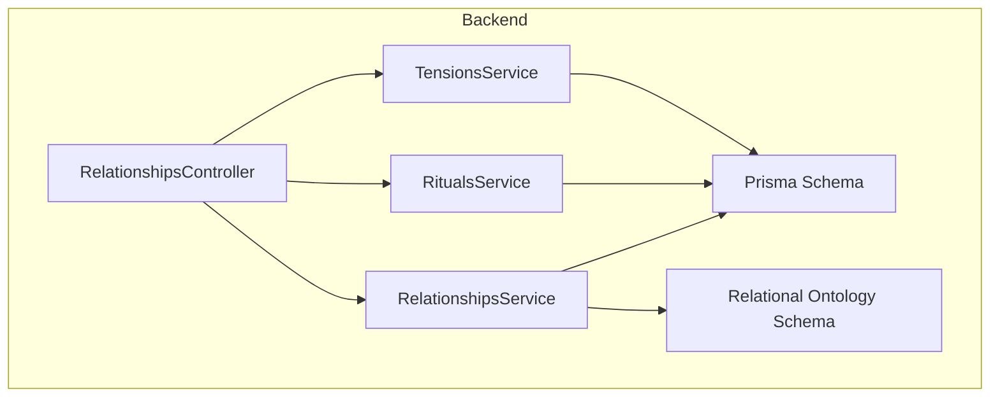
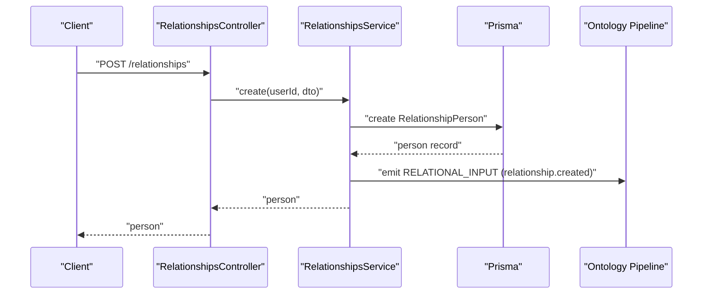
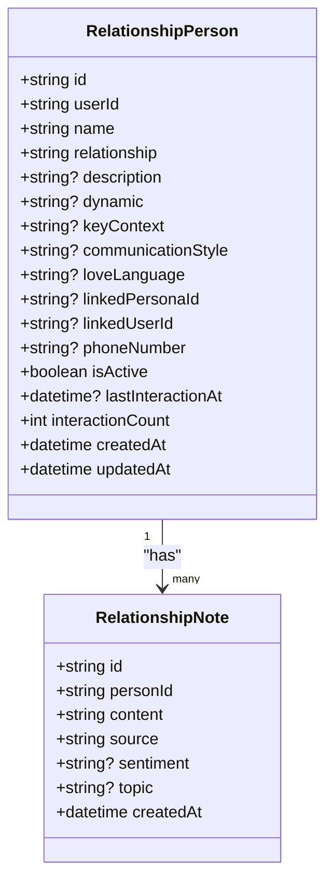
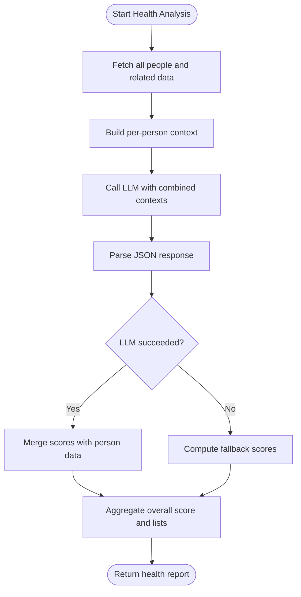
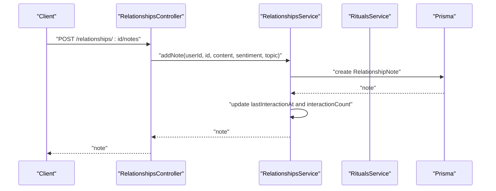
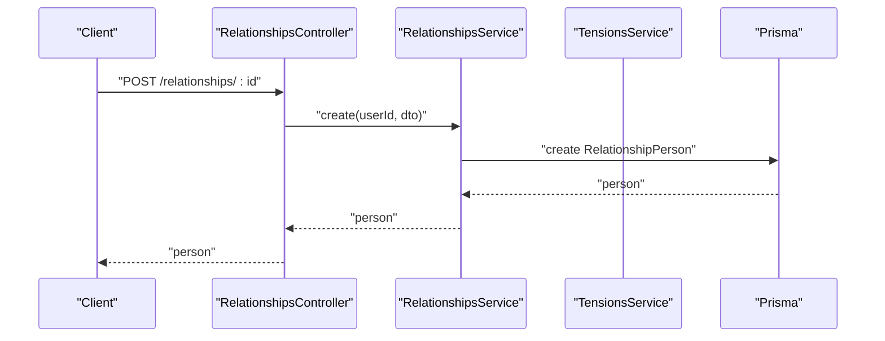
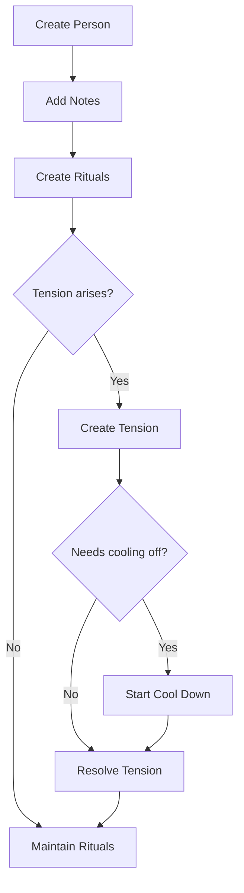
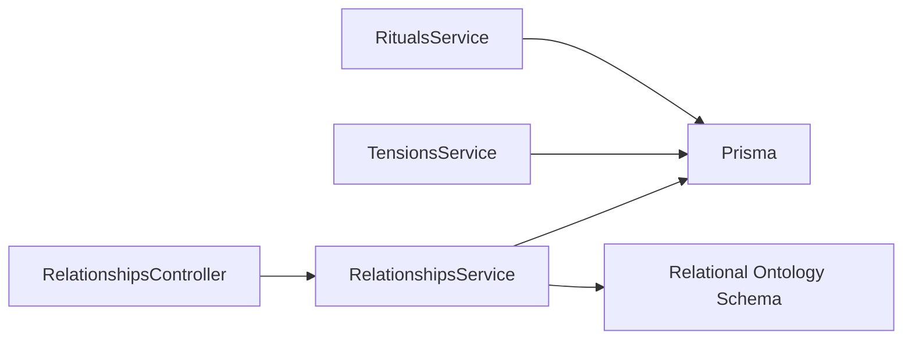

# Relationship Intelligence

<cite>
**Referenced Files in This Document**
- [relationships.controller.ts](file://backend/src/relationships/relationships.controller.ts)
- [relationships.service.ts](file://backend/src/relationships/relationships.service.ts)
- [rituals.service.ts](file://backend/src/rituals/rituals.service.ts)
- [tensions.service.ts](file://backend/src/tensions/tensions.service.ts)
- [schema.prisma](file://backend/prisma/schema.prisma)
- [relational.schema.ts](file://backend/src/ontology/schemas/relational.schema.ts)
- [core-chat-tools.ts](file://backend/src/orchestration/graph/tools/core-chat-tools.ts)
- [create-relationship.dto.ts](file://backend/src/relationships/dto/create-relationship.dto.ts)
- [create-ritual.dto.ts](file://backend/src/rituals/dto/create-ritual.dto.ts)
- [create-tension.dto.ts](file://backend/src/tensions/dto/create-tension.dto.ts)
- [add-relationship-note.dto.ts](file://backend/src/relationships/dto/add-relationship-note.dto.ts)
</cite>

## Table of Contents
1. [Introduction](#introduction)
2. [Project Structure](#project-structure)
3. [Core Components](#core-components)
4. [Architecture Overview](#architecture-overview)
5. [Detailed Component Analysis](#detailed-component-analysis)
6. [Dependency Analysis](#dependency-analysis)
7. [Performance Considerations](#performance-considerations)
8. [Troubleshooting Guide](#troubleshooting-guide)
9. [Conclusion](#conclusion)
10. [Appendices](#appendices)

## Introduction
This document explains the Relationship Intelligence system that helps users manage and optimize personal relationships through automated insights and recommendations. It covers:
- Relationship mapping: capturing who matters, how you relate, and key context
- Love language assessment: optional tagging to tailor connection approaches
- Relationship evolution tracking: ongoing health scoring and annual reviews
- Ritual scheduling: recurring meaningful actions to maintain bonds
- Tension management: conflict tracking, cooling-off, and resolution
- API endpoints for relationship management, ritual scheduling, and tension tracking
- Privacy considerations for sensitive relationship data

## Project Structure
The system is implemented as a NestJS backend with Prisma ORM and integrates with an ontology pipeline that synthesizes relational insights. Key modules:
- Relationships: CRUD for people in your circle, notes, health scoring, annual review, persona creation
- Rituals: create, track, and complete recurring connection practices
- Tensions: log conflicts, apply cooling-off, and mark resolution
- Ontology: relational schema and synthesis pipeline
- Prisma schema: defines the relational, ritual, and tension data models

**Diagram sources**
- [relationships.controller.ts:18-91](file://backend/src/relationships/relationships.controller.ts#L18-L91)
- [relationships.service.ts:10-19](file://backend/src/relationships/relationships.service.ts#L10-L19)
- [rituals.service.ts:7-14](file://backend/src/rituals/rituals.service.ts#L7-L14)
- [tensions.service.ts:7-14](file://backend/src/tensions/tensions.service.ts#L7-L14)
- [schema.prisma:401-499](file://backend/prisma/schema.prisma#L401-L499)
- [relational.schema.ts:1-24](file://backend/src/ontology/schemas/relational.schema.ts#L1-L24)

**Section sources**
- [relationships.controller.ts:18-91](file://backend/src/relationships/relationships.controller.ts#L18-L91)
- [relationships.service.ts:10-19](file://backend/src/relationships/relationships.service.ts#L10-L19)
- [rituals.service.ts:7-14](file://backend/src/rituals/rituals.service.ts#L7-L14)
- [tensions.service.ts:7-14](file://backend/src/tensions/tensions.service.ts#L7-L14)
- [schema.prisma:401-499](file://backend/prisma/schema.prisma#L401-L499)
- [relational.schema.ts:1-24](file://backend/src/ontology/schemas/relational.schema.ts#L1-L24)

## Core Components
- RelationshipPerson: Represents someone in your circle with attributes like name, relationship type, description, dynamic, key context, communication style, love language, and linkage to a 4Ever user or persona
- RelationshipNote: Logged interactions with sentiment and topics
- RelationshipRitual: Recurring meaningful actions with frequency and streak tracking
- TensionEntry: Conflicts with intensity, status (active, cooling_down, resolved), and resolution notes
- Health scoring: Automated analysis of relationship health across all people
- Annual review: Yearly summary of activity, neglected relationships, tension and ritual counts, and monthly trends

**Section sources**
- [schema.prisma:401-499](file://backend/prisma/schema.prisma#L401-L499)
- [relationships.service.ts:182-478](file://backend/src/relationships/relationships.service.ts#L182-L478)
- [relationships.service.ts:480-574](file://backend/src/relationships/relationships.service.ts#L480-L574)

## Architecture Overview
The system orchestrates data capture, event emission, and synthesis to produce relational insights. Controllers expose REST endpoints; Services encapsulate business logic and integrate with Prisma; Events feed the ontology pipeline; the LLM synthesizes health scores and recommendations.

**Diagram sources**
- [relationships.controller.ts:23-26](file://backend/src/relationships/relationships.controller.ts#L23-L26)
- [relationships.service.ts:27-49](file://backend/src/relationships/relationships.service.ts#L27-L49)
- [relational.schema.ts:7-22](file://backend/src/ontology/schemas/relational.schema.ts#L7-L22)

## Detailed Component Analysis

### Relationship Mapping System
- Purpose: Capture and maintain a living map of people in your circle with rich context
- Key capabilities:
  - Create/update/delete people in your circle
  - Add notes with sentiment and topics
  - Link a Circle person to a registered 4Ever user (authoritative)
  - Create a persona from a person for role-play conversations
  - Track last interaction and interaction count
- Data model: RelationshipPerson with optional love language and linkage fields

**Diagram sources**
- [schema.prisma:401-442](file://backend/prisma/schema.prisma#L401-L442)

**Section sources**
- [relationships.controller.ts:23-91](file://backend/src/relationships/relationships.controller.ts#L23-L91)
- [relationships.service.ts:27-138](file://backend/src/relationships/relationships.service.ts#L27-L138)
- [relationships.service.ts:140-180](file://backend/src/relationships/relationships.service.ts#L140-L180)
- [schema.prisma:401-442](file://backend/prisma/schema.prisma#L401-L442)

### Love Language Assessment
- Optional field on RelationshipPerson to capture preferred love language
- Used by the relational ontology to inform suggestions and synthesis
- Supports personalized recommendations for meaningful expressions

**Section sources**
- [schema.prisma:410-410](file://backend/prisma/schema.prisma#L410-L410)
- [relational.schema.ts:16-16](file://backend/src/ontology/schemas/relational.schema.ts#L16-L16)

### Relationship Evolution Tracking
- Health scoring: Single LLM call evaluates all relationships using recent messages, notes, and rituals
- Status rules: healthy, needs_attention, drifting
- Annual review: Year-over-year metrics including most active relationships, new additions, neglected relationships, tension and ritual counts, and monthly interaction trends

**Diagram sources**
- [relationships.service.ts:363-423](file://backend/src/relationships/relationships.service.ts#L363-L423)
- [relationships.service.ts:425-478](file://backend/src/relationships/relationships.service.ts#L425-L478)

**Section sources**
- [relationships.service.ts:182-478](file://backend/src/relationships/relationships.service.ts#L182-L478)
- [relationships.service.ts:480-574](file://backend/src/relationships/relationships.service.ts#L480-L574)

### Ritual Scheduling System
- Create rituals with title, frequency (daily, weekly, biweekly, monthly), optional person association, and weekly day-of-week
- Complete rituals to update lastDoneAt and streak; overdue detection drives motivation
- Overdue logic: thresholds vary by frequency; nextDue computed from lastDoneAt plus interval

**Diagram sources**
- [relationships.controller.ts:58-72](file://backend/src/relationships/relationships.controller.ts#L58-L72)
- [relationships.service.ts:140-180](file://backend/src/relationships/relationships.service.ts#L140-L180)

**Section sources**
- [rituals.service.ts:16-95](file://backend/src/rituals/rituals.service.ts#L16-L95)
- [rituals.service.ts:97-124](file://backend/src/rituals/rituals.service.ts#L97-L124)
- [schema.prisma:444-461](file://backend/prisma/schema.prisma#L444-L461)

### Tension Management System
- Create tension entries with title, description, optional person, intensity (1–10), and optional cooldown minutes
- Automatic status transitions: cooling_down -> active when cooldown expires
- Resolve tensions with optional resolution note; remove entries when needed
- Emits relational and emotional events for downstream synthesis

**Diagram sources**
- [relationships.controller.ts:23-26](file://backend/src/relationships/relationships.controller.ts#L23-L26)
- [relationships.service.ts:27-49](file://backend/src/relationships/relationships.service.ts#L27-L49)

**Section sources**
- [tensions.service.ts:32-78](file://backend/src/tensions/tensions.service.ts#L32-L78)
- [tensions.service.ts:80-114](file://backend/src/tensions/tensions.service.ts#L80-L114)
- [schema.prisma:481-499](file://backend/prisma/schema.prisma#L481-L499)

### API Endpoints

- Relationships
  - POST /relationships
    - Body: CreateRelationshipDto
    - Response: RelationshipPerson
  - GET /relationships
    - Response: Array of RelationshipPerson
  - GET /relationships/health
    - Response: Health report with scores, statuses, and recent activity
  - GET /relationships/annual-review
    - Response: Annual review metrics
  - GET /relationships/:id
    - Response: RelationshipPerson with recent notes
  - PUT /relationships/:id
    - Body: UpdateRelationshipDto
    - Response: RelationshipPerson
  - DELETE /relationships/:id
    - Response: { success: true }
  - POST /relationships/:id/notes
    - Body: AddRelationshipNoteDto
    - Response: RelationshipNote
  - POST /relationships/:id/create-persona
    - Response: { persona, alreadyExists }
  - POST /relationships/:id/link-user
    - Body: { linkedUserId: string | null }
    - Response: RelationshipPerson

- Rituals
  - POST /rituals
    - Body: CreateRitualDto
    - Response: RelationshipRitual with computed isOverdue and nextDue
  - GET /rituals
    - Response: Array of RelationshipRitual with computed isOverdue and nextDue
  - POST /rituals/:id/complete
    - Response: RelationshipRitual with updated streak and lastDoneAt
  - DELETE /rituals/:id
    - Response: { success: true }

- Tensions
  - POST /tensions
    - Body: CreateTensionDto
    - Response: TensionEntry
  - GET /tensions
    - Response: Array of TensionEntry (auto-updates cooling_down to active if expired)
  - POST /tensions/:id/start-cool-down
    - Body: { minutes: number }
    - Response: TensionEntry
  - POST /tensions/:id/resolve
    - Body: { resolution?: string }
    - Response: TensionEntry
  - DELETE /tensions/:id
    - Response: { success: true }

**Section sources**
- [relationships.controller.ts:23-91](file://backend/src/relationships/relationships.controller.ts#L23-L91)
- [rituals.service.ts:16-95](file://backend/src/rituals/rituals.service.ts#L16-L95)
- [tensions.service.ts:32-124](file://backend/src/tensions/tensions.service.ts#L32-L124)
- [create-relationship.dto.ts:3-47](file://backend/src/relationships/dto/create-relationship.dto.ts#L3-L47)
- [add-relationship-note.dto.ts:3-15](file://backend/src/relationships/dto/add-relationship-note.dto.ts#L3-L15)
- [create-ritual.dto.ts:3-17](file://backend/src/rituals/dto/create-ritual.dto.ts#L3-L17)
- [create-tension.dto.ts:3-25](file://backend/src/tensions/dto/create-tension.dto.ts#L3-L25)

### Practical Workflows

- Relationship Setup
  - Create a person in your circle with name, relationship type, and optional description/dynamic/keyContext/communicationStyle/loveLanguage
  - Optionally link to a 4Ever user or create a persona for role-play conversations
  - Add initial notes with sentiment and topics to seed the system

- Ritual Creation
  - Define a ritual title and frequency; optionally associate with a person and set weekly day-of-week
  - The system computes overdue status and nextDue dates

- Tension Resolution
  - Log a tension with title, description, and optional person/intensity/cooldown
  - Apply a cooling-off period if needed
  - Resolve the tension with a resolution note when the issue is addressed

[No sources needed since this diagram shows conceptual workflow, not actual code structure]

## Dependency Analysis
- Controllers depend on Services for business logic
- Services depend on Prisma for persistence
- Services emit events consumed by the ontology pipeline
- The relational schema defines the structure for synthesis and recommendations

**Diagram sources**
- [relationships.controller.ts:18-91](file://backend/src/relationships/relationships.controller.ts#L18-L91)
- [relationships.service.ts:10-19](file://backend/src/relationships/relationships.service.ts#L10-L19)
- [rituals.service.ts:7-14](file://backend/src/rituals/rituals.service.ts#L7-L14)
- [tensions.service.ts:7-14](file://backend/src/tensions/tensions.service.ts#L7-L14)
- [relational.schema.ts:1-24](file://backend/src/ontology/schemas/relational.schema.ts#L1-L24)

**Section sources**
- [relationships.controller.ts:18-91](file://backend/src/relationships/relationships.controller.ts#L18-L91)
- [relationships.service.ts:10-19](file://backend/src/relationships/relationships.service.ts#L10-L19)
- [rituals.service.ts:7-14](file://backend/src/rituals/rituals.service.ts#L7-L14)
- [tensions.service.ts:7-14](file://backend/src/tensions/tensions.service.ts#L7-L14)
- [relational.schema.ts:1-24](file://backend/src/ontology/schemas/relational.schema.ts#L1-L24)

## Performance Considerations
- Batch queries: The health report batches related data (notes, rituals, DMs) to minimize N+1 queries
- Overdue computation: Local helpers compute overdue and nextDue without extra DB roundtrips
- Event-driven synthesis: Emitting events decouples relationship updates from downstream synthesis
- LLM fallback: Health scoring falls back to a deterministic formula if LLM is unavailable

[No sources needed since this section provides general guidance]

## Troubleshooting Guide
- Relationship not found errors: Occur when accessing or updating non-existent people; ensure correct userId and personId
- Linked user validation: Cannot link a person to yourself; verify linkedUserId is distinct from the requesting user
- Ritual completion resets streak: Completing a ritual on time increments streak; otherwise, streak resets to 1
- Tension cooldown: Status auto-updates from cooling_down to active when the timer expires
- LLM failures: Health scoring falls back to a simple formula based on interaction recency and frequency

**Section sources**
- [relationships.service.ts:75-101](file://backend/src/relationships/relationships.service.ts#L75-L101)
- [relationships.service.ts:117-138](file://backend/src/relationships/relationships.service.ts#L117-L138)
- [rituals.service.ts:54-82](file://backend/src/rituals/rituals.service.ts#L54-L82)
- [tensions.service.ts:80-94](file://backend/src/tensions/tensions.service.ts#L80-L94)
- [relationships.service.ts:388-423](file://backend/src/relationships/relationships.service.ts#L388-L423)

## Conclusion
The Relationship Intelligence system provides a comprehensive foundation for managing relationships through structured mapping, automated insights, ritual maintenance, and tension resolution. Its modular design, event-driven synthesis, and robust APIs enable personalized recommendations while preserving user privacy and performance.

## Appendices

### Privacy Considerations
- Data minimization: Collect only what is necessary for relationship insights (name, relationship type, optional description/dynamic/keyContext/communicationStyle/loveLanguage)
- Consent and opt-ins: Respect user preferences for relationship health reporting and data usage
- Access controls: All endpoints require JWT authentication; services validate ownership of resources
- Deletion and export: Users can request data deletion and exports per privacy policy requirements

[No sources needed since this section provides general guidance]