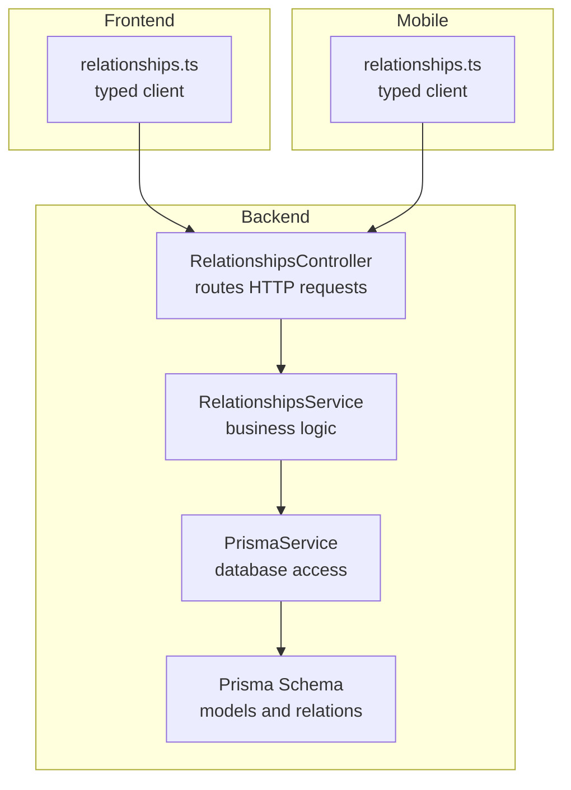
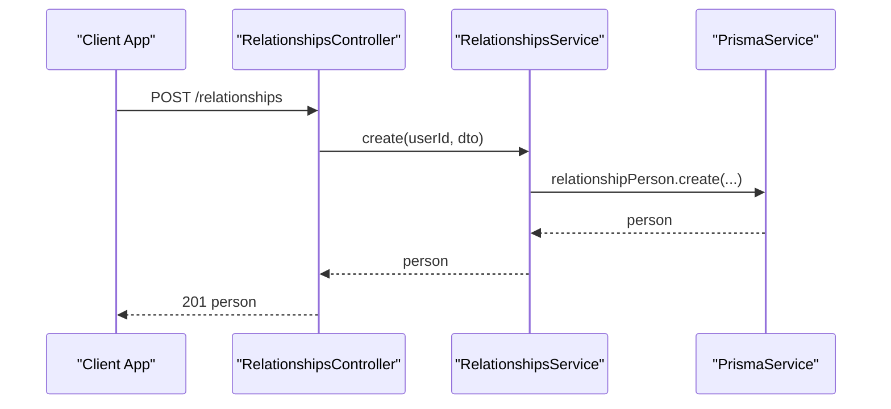
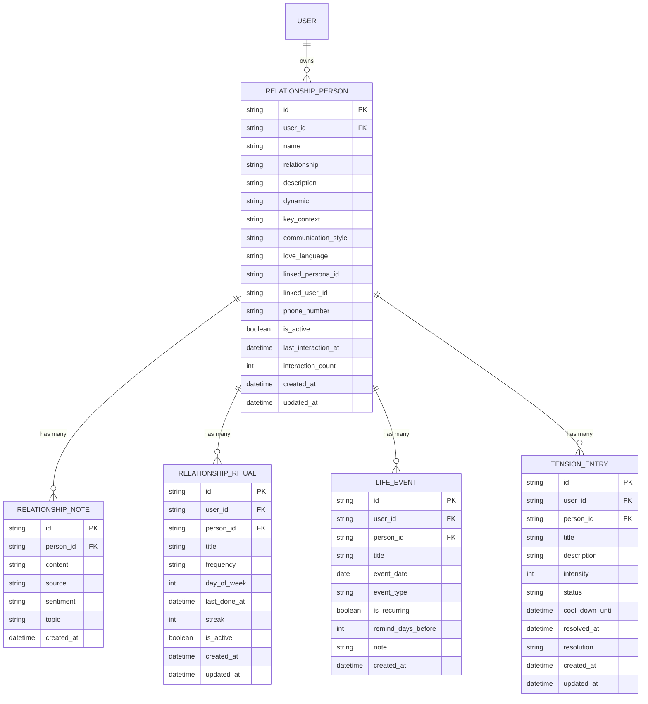
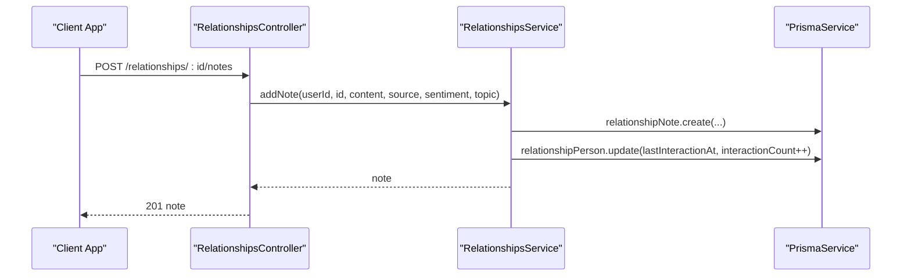
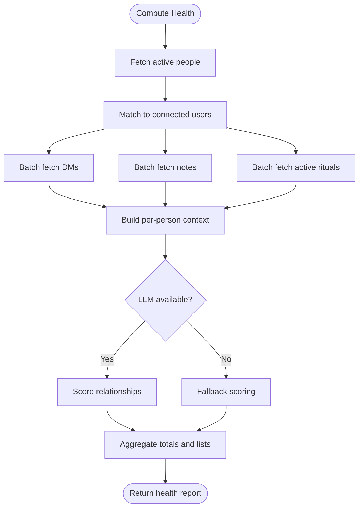
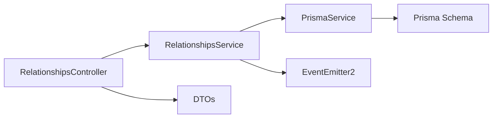

# Relationship Management

<cite>
**Referenced Files in This Document**
- [relationships.controller.ts](file://backend/src/relationships/relationships.controller.ts)
- [relationships.service.ts](file://backend/src/relationships/relationships.service.ts)
- [relationships.module.ts](file://backend/src/relationships/relationships.module.ts)
- [create-relationship.dto.ts](file://backend/src/relationships/dto/create-relationship.dto.ts)
- [update-relationship.dto.ts](file://backend/src/relationships/dto/update-relationship.dto.ts)
- [add-relationship-note.dto.ts](file://backend/src/relationships/dto/add-relationship-note.dto.ts)
- [schema.prisma](file://backend/prisma/schema.prisma)
- [migration.sql](file://backend/prisma/migrations/20260422080027_add_love_language/migration.sql)
- [relationships.ts (frontend)](file://frontend/src/api/relationships.ts)
- [relationships.ts (mobile)](file://mobile/src/api/relationships.ts)
</cite>

## Table of Contents
1. [Introduction](#introduction)
2. [Project Structure](#project-structure)
3. [Core Components](#core-components)
4. [Architecture Overview](#architecture-overview)
5. [Detailed Component Analysis](#detailed-component-analysis)
6. [Dependency Analysis](#dependency-analysis)
7. [Performance Considerations](#performance-considerations)
8. [Troubleshooting Guide](#troubleshooting-guide)
9. [Conclusion](#conclusion)
10. [Appendices](#appendices)

## Introduction
This document describes the Relationship Management system in the 4Ever platform. It covers how users create, track, and manage personal relationships, the underlying entity model, the integration of the love language assessment, relationship notes for insights and memories, and the API endpoints for CRUD operations, notes, analytics, and persona linking. Privacy and data protection measures are addressed alongside operational controls.

## Project Structure
The relationship management feature is implemented as a NestJS module with a dedicated controller and service, backed by Prisma ORM and a PostgreSQL database. DTOs define validated request shapes. Frontend and mobile clients expose typed APIs mirroring the backend endpoints.

**Diagram sources**
- [relationships.controller.ts:18-91](file://backend/src/relationships/relationships.controller.ts#L18-L91)
- [relationships.service.ts:10-19](file://backend/src/relationships/relationships.service.ts#L10-L19)
- [schema.prisma:401-442](file://backend/prisma/schema.prisma#L401-L442)
- [relationships.ts (frontend):94-147](file://frontend/src/api/relationships.ts#L94-L147)
- [relationships.ts (mobile):78-118](file://mobile/src/api/relationships.ts#L78-L118)

**Section sources**
- [relationships.controller.ts:18-91](file://backend/src/relationships/relationships.controller.ts#L18-L91)
- [relationships.service.ts:10-19](file://backend/src/relationships/relationships.service.ts#L10-L19)
- [relationships.module.ts:7-12](file://backend/src/relationships/relationships.module.ts#L7-L12)
- [schema.prisma:401-442](file://backend/prisma/schema.prisma#L401-L442)

## Core Components
- RelationshipsController: Exposes REST endpoints for relationship CRUD, notes, persona creation, and analytics.
- RelationshipsService: Implements core logic including persistence, health scoring, annual review, persona linkage, and event emission.
- DTOs: Validate and constrain inputs for create, update, and notes.
- Prisma Models: Define the relationship entity, notes, and related aggregates.
- Frontend/Mobile Clients: Typed wrappers around the backend endpoints.

Key capabilities:
- Create and manage person-to-person relationships with metadata (description, dynamic, key context, communication style, love language).
- Track interactions via notes with sentiment/topic tagging.
- Compute relationship health and annual insights.
- Link a Circle person to a registered user and optionally create a persona from a person.

**Section sources**
- [relationships.controller.ts:23-90](file://backend/src/relationships/relationships.controller.ts#L23-L90)
- [relationships.service.ts:27-180](file://backend/src/relationships/relationships.service.ts#L27-L180)
- [create-relationship.dto.ts:3-47](file://backend/src/relationships/dto/create-relationship.dto.ts#L3-L47)
- [update-relationship.dto.ts:3-42](file://backend/src/relationships/dto/update-relationship.dto.ts#L3-L42)
- [add-relationship-note.dto.ts:3-14](file://backend/src/relationships/dto/add-relationship-note.dto.ts#L3-L14)
- [schema.prisma:401-442](file://backend/prisma/schema.prisma#L401-L442)

## Architecture Overview
The system follows a layered architecture:
- HTTP layer: Controller receives requests and delegates to the service.
- Application layer: Service orchestrates Prisma queries, emits events, and performs analytics.
- Persistence layer: Prisma models map to PostgreSQL tables with indexes and relations.
- Client layer: Frontend and mobile call the REST endpoints with typed interfaces.

**Diagram sources**
- [relationships.controller.ts:23-26](file://backend/src/relationships/relationships.controller.ts#L23-L26)
- [relationships.service.ts:27-49](file://backend/src/relationships/relationships.service.ts#L27-L49)
- [schema.prisma:401-427](file://backend/prisma/schema.prisma#L401-L427)

## Detailed Component Analysis

### Entity Model: RelationshipPerson and RelationshipNote
The relationship entity captures person-to-person connections and metadata. Love language is stored as a text field. Notes capture insights with optional sentiment and topics.

**Diagram sources**
- [schema.prisma:401-499](file://backend/prisma/schema.prisma#L401-L499)

**Section sources**
- [schema.prisma:401-442](file://backend/prisma/schema.prisma#L401-L442)
- [migration.sql:1-2](file://backend/prisma/migrations/20260422080027_add_love_language/migration.sql#L1-L2)

### Love Language Assessment Integration
Love language is modeled as a text field on the relationship entity. The assessment itself is not implemented in the provided code; however, the field is present in the schema and DTOs, enabling future integration. When captured, it enriches relationship metadata and can influence persona creation and insights.

- Field presence: [schema.prisma](file://backend/prisma/schema.prisma#L410)
- DTO inclusion: [create-relationship.dto.ts:34-37](file://backend/src/relationships/dto/create-relationship.dto.ts#L34-L37), [update-relationship.dto.ts:31-37](file://backend/src/relationships/dto/update-relationship.dto.ts#L31-L37)

**Section sources**
- [schema.prisma](file://backend/prisma/schema.prisma#L410)
- [create-relationship.dto.ts:34-37](file://backend/src/relationships/dto/create-relationship.dto.ts#L34-L37)
- [update-relationship.dto.ts:31-37](file://backend/src/relationships/dto/update-relationship.dto.ts#L31-L37)

### Relationship Notes Functionality
Notes capture insights and memories with optional sentiment and topic. Adding a note updates interaction metrics and emits an event for downstream synthesis.

**Diagram sources**
- [relationships.controller.ts:58-72](file://backend/src/relationships/relationships.controller.ts#L58-L72)
- [relationships.service.ts:140-180](file://backend/src/relationships/relationships.service.ts#L140-L180)

**Section sources**
- [relationships.controller.ts:58-72](file://backend/src/relationships/relationships.controller.ts#L58-L72)
- [relationships.service.ts:140-180](file://backend/src/relationships/relationships.service.ts#L140-L180)
- [add-relationship-note.dto.ts:3-14](file://backend/src/relationships/dto/add-relationship-note.dto.ts#L3-L14)

### Relationship Analytics: Health and Annual Review
The service computes relationship health by aggregating messages, notes, and rituals, optionally using an LLM for scoring. Annual reviews summarize activity, sentiment, and trends.

**Diagram sources**
- [relationships.service.ts:182-478](file://backend/src/relationships/relationships.service.ts#L182-L478)

**Section sources**
- [relationships.service.ts:182-478](file://backend/src/relationships/relationships.service.ts#L182-L478)

### Practical Workflows

- Create a relationship
  - Endpoint: POST /relationships
  - Required fields: name, relationship
  - Optional fields: description, dynamic, keyContext, communicationStyle, loveLanguage, linkedUserId, phoneNumber
  - Example request path: [create-relationship.dto.ts:3-47](file://backend/src/relationships/dto/create-relationship.dto.ts#L3-L47)
  - Implementation: [relationships.controller.ts:23-26](file://backend/src/relationships/relationships.controller.ts#L23-L26), [relationships.service.ts:27-49](file://backend/src/relationships/relationships.service.ts#L27-L49)

- Update relationship metadata
  - Endpoint: PUT /relationships/:id
  - Fields: name, relationship, description, dynamic, keyContext, communicationStyle, loveLanguage, phoneNumber
  - Example request path: [update-relationship.dto.ts:3-42](file://backend/src/relationships/dto/update-relationship.dto.ts#L3-L42)
  - Implementation: [relationships.controller.ts:48-51](file://backend/src/relationships/relationships.controller.ts#L48-L51), [relationships.service.ts:75-101](file://backend/src/relationships/relationships.service.ts#L75-L101)

- Add a relationship note
  - Endpoint: POST /relationships/:id/notes
  - Fields: content (required), sentiment (optional), topic (optional)
  - Implementation: [relationships.controller.ts:58-72](file://backend/src/relationships/relationships.controller.ts#L58-L72), [relationships.service.ts:140-180](file://backend/src/relationships/relationships.service.ts#L140-L180)

- Create a persona from a person
  - Endpoint: POST /relationships/:id/create-persona
  - Behavior: Builds a persona from relationship metadata and links it back
  - Implementation: [relationships.controller.ts:74-77](file://backend/src/relationships/relationships.controller.ts#L74-L77), [relationships.service.ts:576-638](file://backend/src/relationships/relationships.service.ts#L576-L638)

- Link a Circle person to a registered user
  - Endpoint: POST /relationships/:id/link-user
  - Behavior: Authoritative link; pass null to clear
  - Implementation: [relationships.controller.ts:79-90](file://backend/src/relationships/relationships.controller.ts#L79-L90), [relationships.service.ts:117-138](file://backend/src/relationships/relationships.service.ts#L117-L138)

**Section sources**
- [relationships.controller.ts:23-90](file://backend/src/relationships/relationships.controller.ts#L23-L90)
- [relationships.service.ts:27-138](file://backend/src/relationships/relationships.service.ts#L27-L138)
- [create-relationship.dto.ts:3-47](file://backend/src/relationships/dto/create-relationship.dto.ts#L3-L47)
- [update-relationship.dto.ts:3-42](file://backend/src/relationships/dto/update-relationship.dto.ts#L3-L42)
- [add-relationship-note.dto.ts:3-14](file://backend/src/relationships/dto/add-relationship-note.dto.ts#L3-L14)

### API Endpoints Summary

- GET /relationships
  - Purpose: List all active relationships for the user
  - Returns: Array of RelationshipPerson
  - Implementation: [relationships.controller.ts:28-31](file://backend/src/relationships/relationships.controller.ts#L28-L31), [relationships.service.ts:51-59](file://backend/src/relationships/relationships.service.ts#L51-L59)

- GET /relationships/:id
  - Purpose: Retrieve a single relationship with recent notes
  - Returns: RelationshipPerson with notes
  - Implementation: [relationships.controller.ts:43-46](file://backend/src/relationships/relationships.controller.ts#L43-L46), [relationships.service.ts:61-73](file://backend/src/relationships/relationships.service.ts#L61-L73)

- POST /relationships
  - Purpose: Create a new relationship
  - Body: CreateRelationshipData
  - Returns: RelationshipPerson
  - Implementation: [relationships.controller.ts:23-26](file://backend/src/relationships/relationships.controller.ts#L23-L26), [relationships.service.ts:27-49](file://backend/src/relationships/relationships.service.ts#L27-L49)

- PUT /relationships/:id
  - Purpose: Update relationship metadata
  - Body: Partial CreateRelationshipData
  - Returns: RelationshipPerson
  - Implementation: [relationships.controller.ts:48-51](file://backend/src/relationships/relationships.controller.ts#L48-L51), [relationships.service.ts:75-101](file://backend/src/relationships/relationships.service.ts#L75-L101)

- DELETE /relationships/:id
  - Purpose: Remove a relationship
  - Returns: { success: true }
  - Implementation: [relationships.controller.ts:53-56](file://backend/src/relationships/relationships.controller.ts#L53-L56), [relationships.service.ts:103-111](file://backend/src/relationships/relationships.service.ts#L103-L111)

- POST /relationships/:id/notes
  - Purpose: Add a relationship note
  - Body: { content, sentiment?, topic? }
  - Returns: RelationshipNote
  - Implementation: [relationships.controller.ts:58-72](file://backend/src/relationships/relationships.controller.ts#L58-L72), [relationships.service.ts:140-180](file://backend/src/relationships/relationships.service.ts#L140-L180)

- POST /relationships/:id/create-persona
  - Purpose: Create a persona from a person
  - Returns: { persona, alreadyExists }
  - Implementation: [relationships.controller.ts:74-77](file://backend/src/relationships/relationships.controller.ts#L74-L77), [relationships.service.ts:576-638](file://backend/src/relationships/relationships.service.ts#L576-L638)

- POST /relationships/:id/link-user
  - Purpose: Link/unlink a Circle person to a registered user
  - Body: { linkedUserId: string | null }
  - Returns: RelationshipPerson
  - Implementation: [relationships.controller.ts:79-90](file://backend/src/relationships/relationships.controller.ts#L79-L90), [relationships.service.ts:117-138](file://backend/src/relationships/relationships.service.ts#L117-L138)

- GET /relationships/health
  - Purpose: Compute relationship health and recent activity
  - Returns: RelationshipHealthData
  - Implementation: [relationships.controller.ts:33-41](file://backend/src/relationships/relationships.controller.ts#L33-L41), [relationships.service.ts:182-478](file://backend/src/relationships/relationships.service.ts#L182-L478)

- GET /relationships/annual-review
  - Purpose: Annual insights and trends
  - Returns: AnnualReviewData
  - Implementation: [relationships.controller.ts:38-41](file://backend/src/relationships/relationships.controller.ts#L38-L41), [relationships.service.ts:480-574](file://backend/src/relationships/relationships.service.ts#L480-L574)

Frontend and mobile clients mirror these endpoints with typed interfaces.

**Section sources**
- [relationships.controller.ts:23-90](file://backend/src/relationships/relationships.controller.ts#L23-L90)
- [relationships.service.ts:182-638](file://backend/src/relationships/relationships.service.ts#L182-L638)
- [relationships.ts (frontend):94-147](file://frontend/src/api/relationships.ts#L94-L147)
- [relationships.ts (mobile):78-118](file://mobile/src/api/relationships.ts#L78-L118)

## Dependency Analysis
- Controller depends on RelationshipsService and JWT guard for authentication.
- Service depends on PrismaService for data access and EventEmitter2 for emitting relational events.
- DTOs enforce validation for create/update/notes operations.
- Prisma schema defines foreign keys and indexes for efficient queries.

**Diagram sources**
- [relationships.controller.ts:12-21](file://backend/src/relationships/relationships.controller.ts#L12-L21)
- [relationships.service.ts:15-19](file://backend/src/relationships/relationships.service.ts#L15-L19)
- [schema.prisma:401-442](file://backend/prisma/schema.prisma#L401-L442)

**Section sources**
- [relationships.controller.ts:12-21](file://backend/src/relationships/relationships.controller.ts#L12-L21)
- [relationships.service.ts:15-19](file://backend/src/relationships/relationships.service.ts#L15-L19)
- [schema.prisma:401-442](file://backend/prisma/schema.prisma#L401-L442)

## Performance Considerations
- Batch fetching: The health computation batches DMs, notes, and rituals to minimize N+1 queries.
- Indexing: Composite indexes on personId+createdAt and user relations optimize lookups.
- Event-driven synthesis: Emitted relational events trigger downstream insights without blocking user requests.
- LLM fallback: Health scoring falls back to deterministic formulas if LLM is unavailable.

[No sources needed since this section provides general guidance]

## Troubleshooting Guide
Common issues and resolutions:
- Not Found errors: Operations on non-existent relationships throw NotFoundException; verify personId and ownership.
  - References: [relationships.service.ts:71-71](file://backend/src/relationships/relationships.service.ts#L71-L71), [relationships.service.ts:107-107](file://backend/src/relationships/relationships.service.ts#L107-L107), [relationships.service.ts:151-151](file://backend/src/relationships/relationships.service.ts#L151-L151)
- Validation failures: DTOs enforce length and presence constraints; ensure payloads conform to Create/Update/Note DTOs.
  - References: [create-relationship.dto.ts:3-47](file://backend/src/relationships/dto/create-relationship.dto.ts#L3-L47), [update-relationship.dto.ts:3-42](file://backend/src/relationships/dto/update-relationship.dto.ts#L3-L42), [add-relationship-note.dto.ts:3-14](file://backend/src/relationships/dto/add-relationship-note.dto.ts#L3-L14)
- Linking conflicts: Cannot link a person to themselves; ensure linkedUserId differs from the requesting user.
  - References: [relationships.service.ts:129-131](file://backend/src/relationships/relationships.service.ts#L129-L131)

**Section sources**
- [relationships.service.ts:71-71](file://backend/src/relationships/relationships.service.ts#L71-L71)
- [relationships.service.ts:107-107](file://backend/src/relationships/relationships.service.ts#L107-L107)
- [relationships.service.ts:151-151](file://backend/src/relationships/relationships.service.ts#L151-L151)
- [relationships.service.ts:129-131](file://backend/src/relationships/relationships.service.ts#L129-L131)
- [create-relationship.dto.ts:3-47](file://backend/src/relationships/dto/create-relationship.dto.ts#L3-L47)
- [update-relationship.dto.ts:3-42](file://backend/src/relationships/dto/update-relationship.dto.ts#L3-L42)
- [add-relationship-note.dto.ts:3-14](file://backend/src/relationships/dto/add-relationship-note.dto.ts#L3-L14)

## Conclusion
The Relationship Management system provides a robust foundation for creating, tracking, and analyzing personal connections. It supports metadata-rich relationships, sentiment-aware notes, optional persona creation, and comprehensive analytics. Love language is modeled for future assessment integration. The design emphasizes performance, validation, and extensibility.

[No sources needed since this section summarizes without analyzing specific files]

## Appendices

### Privacy and Data Protection Measures
- Authentication: All relationship endpoints require JWT authentication via a guard.
  - Reference: [relationships.controller.ts:12-19](file://backend/src/relationships/relationships.controller.ts#L12-L19)
- Ownership scoping: Queries filter by userId to prevent cross-user access.
  - References: [relationships.service.ts:51-59](file://backend/src/relationships/relationships.service.ts#L51-L59), [relationships.service.ts:61-73](file://backend/src/relationships/relationships.service.ts#L61-L73), [relationships.service.ts:103-111](file://backend/src/relationships/relationships.service.ts#L103-L111)
- Data minimization: Notes include only necessary fields (content, sentiment, topic) with defaults and optional fields.
  - References: [schema.prisma:429-442](file://backend/prisma/schema.prisma#L429-L442), [add-relationship-note.dto.ts:3-14](file://backend/src/relationships/dto/add-relationship-note.dto.ts#L3-L14)
- Consent and privacy controls: The platform maintains consent records and privacy-related flags at the user level.
  - Reference: [schema.prisma:35-35](file://backend/prisma/schema.prisma#L35-L35), [schema.prisma:71-71](file://backend/prisma/schema.prisma#L71-L71)

**Section sources**
- [relationships.controller.ts:12-19](file://backend/src/relationships/relationships.controller.ts#L12-L19)
- [relationships.service.ts:51-111](file://backend/src/relationships/relationships.service.ts#L51-L111)
- [schema.prisma:35-35](file://backend/prisma/schema.prisma#L35-L35)
- [schema.prisma:71-71](file://backend/prisma/schema.prisma#L71-L71)