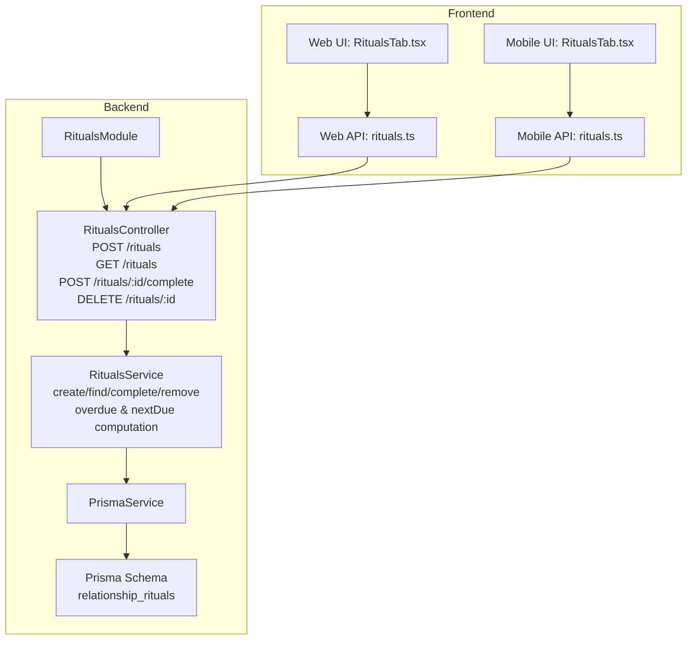
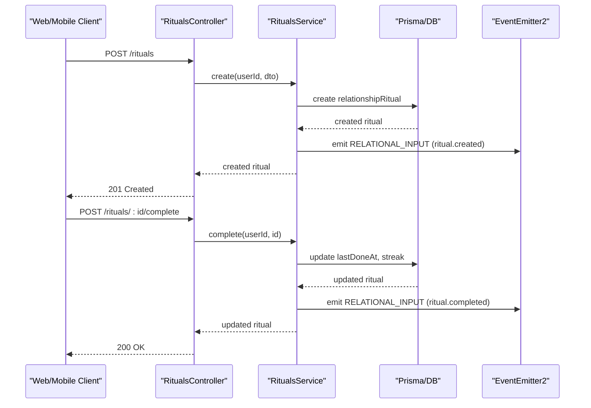
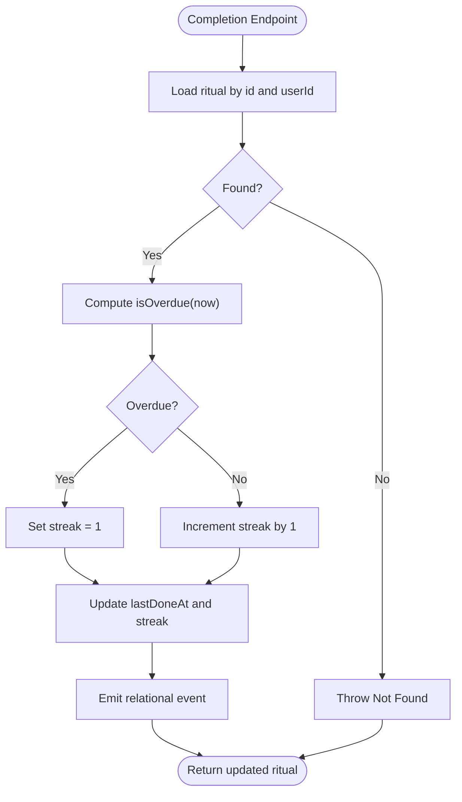
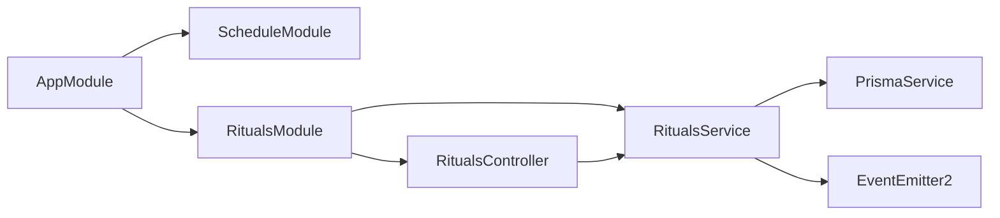
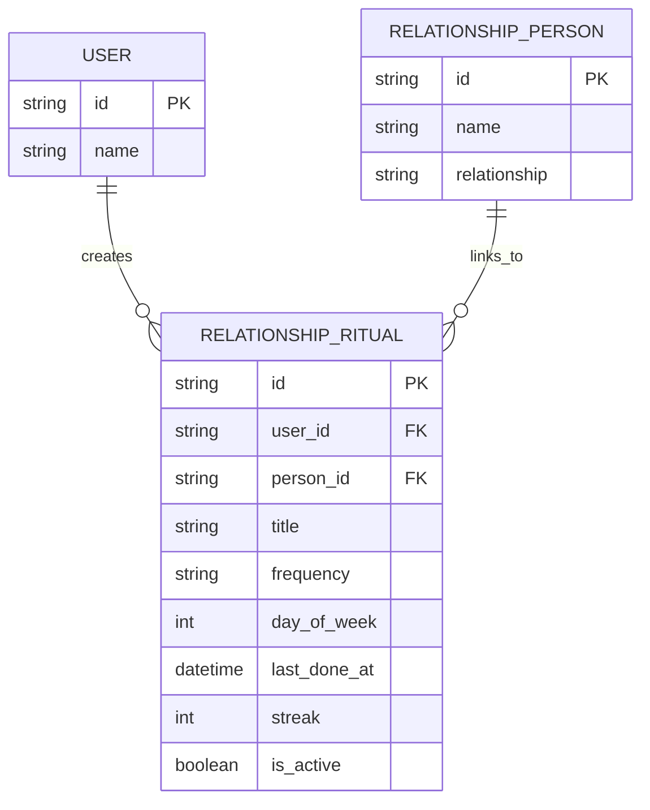

# Ritual Scheduling

<cite>
**Referenced Files in This Document**
- [rituals.controller.ts](file://backend/src/rituals/rituals.controller.ts)
- [rituals.service.ts](file://backend/src/rituals/rituals.service.ts)
- [rituals.module.ts](file://backend/src/rituals/rituals.module.ts)
- [create-ritual.dto.ts](file://backend/src/rituals/dto/create-ritual.dto.ts)
- [schema.prisma](file://backend/prisma/schema.prisma)
- [20260422073952_add_rituals_and_life_events/migration.sql](file://backend/prisma/migrations/20260422073952_add_rituals_and_life_events/migration.sql)
- [RitualsTab.tsx (Web)](file://frontend/src/pages/circle/RitualsTab.tsx)
- [RitualsTab.tsx (Mobile)](file://mobile/src/screens/RitualsTab.tsx)
- [rituals.ts (Web API)](file://frontend/src/api/rituals.ts)
- [rituals.ts (Mobile API)](file://mobile/src/api/rituals.ts)
- [app.module.ts](file://backend/src/app.module.ts)
- [relational.synthesizer.ts](file://backend/src/ontology/synthesizers/relational.synthesizer.ts)
- [mediator-action-tools.ts](file://backend/src/messaging/graph/tools/mediator-action-tools.ts)
- [core-chat-tools.ts](file://backend/src/orchestration/graph/tools/core-chat-tools.ts)
- [orchestration.service.ts](file://backend/src/orchestration/orchestration.service.ts)
</cite>

## Table of Contents
1. [Introduction](#introduction)
2. [Project Structure](#project-structure)
3. [Core Components](#core-components)
4. [Architecture Overview](#architecture-overview)
5. [Detailed Component Analysis](#detailed-component-analysis)
6. [Dependency Analysis](#dependency-analysis)
7. [Performance Considerations](#performance-considerations)
8. [Troubleshooting Guide](#troubleshooting-guide)
9. [Conclusion](#conclusion)
10. [Appendices](#appendices)

## Introduction
This document explains the ritual scheduling system that helps users create and maintain meaningful connection rituals with their relationships. It covers the entity model, scheduling logic, reminders, completion tracking, and history. It also documents the available API endpoints, customization options, and automation features that integrate with the broader platform.

## Project Structure
The ritual system spans backend NestJS modules, Prisma ORM, and frontend UIs for web and mobile. The backend exposes REST endpoints guarded by JWT authentication, persists data via Prisma, and computes scheduling metrics. The frontend surfaces the ritual list, completion controls, and creation forms.

**Diagram sources**
- [rituals.controller.ts:15-39](file://backend/src/rituals/rituals.controller.ts#L15-L39)
- [rituals.service.ts:16-95](file://backend/src/rituals/rituals.service.ts#L16-L95)
- [rituals.module.ts:6-12](file://backend/src/rituals/rituals.module.ts#L6-L12)
- [schema.prisma:444-461](file://backend/prisma/schema.prisma#L444-L461)
- [RitualsTab.tsx (Web):20-189](file://frontend/src/pages/circle/RitualsTab.tsx#L20-L189)
- [RitualsTab.tsx (Mobile):19-152](file://mobile/src/screens/RitualsTab.tsx#L19-L152)
- [rituals.ts (Web API):27-46](file://frontend/src/api/rituals.ts#L27-L46)
- [rituals.ts (Mobile API):15-31](file://mobile/src/api/rituals.ts#L15-L31)

**Section sources**
- [rituals.controller.ts:15-39](file://backend/src/rituals/rituals.controller.ts#L15-L39)
- [rituals.service.ts:16-95](file://backend/src/rituals/rituals.service.ts#L16-L95)
- [rituals.module.ts:6-12](file://backend/src/rituals/rituals.module.ts#L6-L12)
- [schema.prisma:444-461](file://backend/prisma/schema.prisma#L444-L461)
- [RitualsTab.tsx (Web):20-189](file://frontend/src/pages/circle/RitualsTab.tsx#L20-L189)
- [RitualsTab.tsx (Mobile):19-152](file://mobile/src/screens/RitualsTab.tsx#L19-L152)
- [rituals.ts (Web API):27-46](file://frontend/src/api/rituals.ts#L27-L46)
- [rituals.ts (Mobile API):15-31](file://mobile/src/api/rituals.ts#L15-L31)

## Core Components
- Entity model: relationship_rituals with fields for title, frequency, optional person linkage, streak, last completion, and active flag.
- DTO: CreateRitualDto validates title, frequency, optional personId, and optional dayOfWeek.
- Service: orchestrates persistence, overdue checks, nextDue calculation, and emits relational events.
- Controller: exposes endpoints for creation, listing, completion, and deletion.
- Frontend: renders lists, handles creation/modification, and triggers completion.

Key scheduling logic:
- Overdue thresholds and nextDue dates are computed based on frequency and lastDoneAt.
- Completion resets or increments streak depending on whether the ritual was overdue.

**Section sources**
- [schema.prisma:444-461](file://backend/prisma/schema.prisma#L444-L461)
- [create-ritual.dto.ts:3-17](file://backend/src/rituals/dto/create-ritual.dto.ts#L3-L17)
- [rituals.service.ts:97-124](file://backend/src/rituals/rituals.service.ts#L97-L124)
- [rituals.controller.ts:20-38](file://backend/src/rituals/rituals.controller.ts#L20-L38)
- [RitualsTab.tsx (Web):24-55](file://frontend/src/pages/circle/RitualsTab.tsx#L24-L55)
- [RitualsTab.tsx (Mobile):36-57](file://mobile/src/screens/RitualsTab.tsx#L36-L57)

## Architecture Overview
The ritual system integrates tightly with the relationships module and the relational ontology. On creation and completion, relational events are emitted to feed downstream synthesis and insights.

**Diagram sources**
- [rituals.controller.ts:20-33](file://backend/src/rituals/rituals.controller.ts#L20-L33)
- [rituals.service.ts:16-36](file://backend/src/rituals/rituals.service.ts#L16-L36)
- [relational.synthesizer.ts:127-127](file://backend/src/ontology/synthesizers/relational.synthesizer.ts#L127-L127)

**Section sources**
- [rituals.controller.ts:20-33](file://backend/src/rituals/rituals.controller.ts#L20-L33)
- [rituals.service.ts:16-36](file://backend/src/rituals/rituals.service.ts#L16-L36)
- [relational.synthesizer.ts:127-127](file://backend/src/ontology/synthesizers/relational.synthesizer.ts#L127-L127)

## Detailed Component Analysis

### Backend: RitualsController
- Guards requests with JWT.
- Endpoints:
  - POST /rituals: create a ritual.
  - GET /rituals: list active rituals for the user.
  - POST /rituals/:id/complete: mark a ritual as completed.
  - DELETE /rituals/:id: deactivate a ritual.

**Section sources**
- [rituals.controller.ts:15-39](file://backend/src/rituals/rituals.controller.ts#L15-L39)

### Backend: RitualsService
- Persistence: creates and updates relationship_rituals, includes person relation for display.
- Computation:
  - isOverdue: determines overdue based on lastDoneAt and configured thresholds per frequency.
  - getNextDue: calculates next due date from lastDoneAt plus interval based on frequency.
- Completion logic:
  - If overdue, reset streak to 1.
  - Otherwise, increment streak.
- Event emission:
  - Emits relational events on creation and completion for downstream synthesis.

**Section sources**
- [rituals.service.ts:16-95](file://backend/src/rituals/rituals.service.ts#L16-L95)
- [rituals.service.ts:97-124](file://backend/src/rituals/rituals.service.ts#L97-L124)

### Backend: DTO and Prisma Model
- DTO enforces:
  - title: string
  - frequency: one of daily, weekly, biweekly, monthly
  - personId: optional
  - dayOfWeek: optional number for weekly cadence
- Prisma model:
  - Fields: id, userId, personId, title, frequency, dayOfWeek, lastDoneAt, streak, isActive, timestamps.
  - Relationships: belongs to User; optionally belongs to RelationshipPerson.

**Section sources**
- [create-ritual.dto.ts:3-17](file://backend/src/rituals/dto/create-ritual.dto.ts#L3-L17)
- [schema.prisma:444-461](file://backend/prisma/schema.prisma#L444-L461)
- [20260422073952_add_rituals_and_life_events/migration.sql:1-45](file://backend/prisma/migrations/20260422073952_add_rituals_and_life_events/migration.sql#L1-L45)

### Frontend: Web and Mobile UIs
- Both UIs present:
  - Create ritual form with title, frequency, optional person selection.
  - List of rituals with frequency, optional person badge, streak, overdue status, and nextDue date.
  - Actions: mark complete, remove.
- Web UI additionally computes isOverdue and nextDue client-side for display.

**Section sources**
- [RitualsTab.tsx (Web):20-189](file://frontend/src/pages/circle/RitualsTab.tsx#L20-L189)
- [RitualsTab.tsx (Mobile):19-152](file://mobile/src/screens/RitualsTab.tsx#L19-L152)

### API Endpoints
- POST /rituals
  - Body: CreateRitualData { title, frequency, personId?, dayOfWeek? }
  - Response: Ritual
- GET /rituals
  - Response: Ritual[]
- POST /rituals/:id/complete
  - Response: Ritual
- DELETE /rituals/:id
  - Response: { success: true }

**Section sources**
- [rituals.controller.ts:20-38](file://backend/src/rituals/rituals.controller.ts#L20-L38)
- [rituals.ts (Web API):27-46](file://frontend/src/api/rituals.ts#L27-L46)
- [rituals.ts (Mobile API):15-31](file://mobile/src/api/rituals.ts#L15-L31)

### Scheduling Logic and Frequency Settings
- Frequencies supported: daily, weekly, biweekly, monthly.
- Overdue thresholds:
  - daily: 1.5 days
  - weekly: 8 days
  - biweekly: 15 days
  - monthly: 32 days
- Next due calculation:
  - Adds 1, 7, 14 days or 1 month respectively to lastDoneAt.
- Optional weekly day-of-week: stored as 0–6 for Sun–Sat.

**Diagram sources**
- [rituals.service.ts:54-82](file://backend/src/rituals/rituals.service.ts#L54-L82)
- [rituals.service.ts:97-124](file://backend/src/rituals/rituals.service.ts#L97-L124)

**Section sources**
- [rituals.service.ts:97-124](file://backend/src/rituals/rituals.service.ts#L97-L124)

### Reminders, Completion Tracking, and History
- Reminders:
  - The system computes overdue status and nextDue date to drive UI reminders and synthesis prompts.
- Completion tracking:
  - Streak is maintained per ritual; resets on overdue completion.
- History:
  - lastDoneAt captures completion timestamps; used for overdue and nextDue calculations.

**Section sources**
- [rituals.service.ts:45-52](file://backend/src/rituals/rituals.service.ts#L45-L52)
- [rituals.service.ts:97-124](file://backend/src/rituals/rituals.service.ts#L97-L124)

### Categories and Relationship Health Contributions
- Supported categories:
  - Daily: quick touchpoints.
  - Weekly: structured check-ins.
  - Biweekly: mid-cycle reinforcement.
  - Monthly: deeper reflection and celebration.
- Relationship health:
  - Rituals feed relational signals and synthesis, contributing to weekly dimension signals and insights.

**Section sources**
- [mediator-action-tools.ts:22-35](file://backend/src/messaging/graph/tools/mediator-action-tools.ts#L22-L35)
- [core-chat-tools.ts:1173-1176](file://backend/src/orchestration/graph/tools/core-chat-tools.ts#L1173-L1176)
- [relational.synthesizer.ts:127-127](file://backend/src/ontology/synthesizers/relational.synthesizer.ts#L127-L127)

### Practical Examples
- Weekly check-in ritual:
  - Create ritual with frequency weekly and optional person.
  - The system tracks streak and overdue status; UI highlights overdue and nextDue.
- Monthly celebration ritual:
  - Create ritual with frequency monthly.
  - Use relational synthesis to surface insights and suggestions around milestones.
- Annual milestone celebration:
  - Combine life events and rituals to mark and reflect on yearly milestones; synthesis can summarize progress.

**Section sources**
- [RitualsTab.tsx (Web):137-166](file://frontend/src/pages/circle/RitualsTab.tsx#L137-L166)
- [RitualsTab.tsx (Mobile):61-89](file://mobile/src/screens/RitualsTab.tsx#L61-L89)
- [relational.synthesizer.ts:127-127](file://backend/src/ontology/synthesizers/relational.synthesizer.ts#L127-L127)

### API Analytics and Automation Features
- Analytics:
  - Relational synthesis includes ritual streaks and last completion dates to inform insights.
- Automation:
  - Mediator can propose recurring rituals based on cadence keywords.
  - Orchestration tools can mark rituals complete and compute streaks during conversations.

**Section sources**
- [relational.synthesizer.ts:127-127](file://backend/src/ontology/synthesizers/relational.synthesizer.ts#L127-L127)
- [mediator-action-tools.ts:22-35](file://backend/src/messaging/graph/tools/mediator-action-tools.ts#L22-L35)
- [core-chat-tools.ts:1173-1176](file://backend/src/orchestration/graph/tools/core-chat-tools.ts#L1173-L1176)
- [core-chat-tools.ts:2015-2023](file://backend/src/orchestration/graph/tools/core-chat-tools.ts#L2015-L2023)
- [orchestration.service.ts:360-360](file://backend/src/orchestration/orchestration.service.ts#L360-L360)

## Dependency Analysis
- Module wiring:
  - RitualsModule imports PrismaModule and registers controller and service.
  - AppModule initializes ScheduleModule for cron-based features.
- Controller depends on service; service depends on PrismaService and EventEmitter2.
- DTO validates inputs; Prisma schema defines persistence.

**Diagram sources**
- [app.module.ts:127-127](file://backend/src/app.module.ts#L127-L127)
- [rituals.module.ts:6-12](file://backend/src/rituals/rituals.module.ts#L6-L12)

**Section sources**
- [app.module.ts:127-127](file://backend/src/app.module.ts#L127-L127)
- [rituals.module.ts:6-12](file://backend/src/rituals/rituals.module.ts#L6-L12)

## Performance Considerations
- Overdue and nextDue computations are O(n) per list fetch; keep lists paginated or filtered where appropriate.
- Streak updates are O(1) writes; ensure minimal concurrent completions to avoid race conditions.
- Consider adding database indexes on userId, frequency, and lastDoneAt for optimized queries.

## Troubleshooting Guide
- 404 Not Found on completion/removal:
  - Occurs when the ritual does not belong to the requesting user.
- Overdue resets streak unexpectedly:
  - Verify lastDoneAt and thresholds align with expectations; confirm completion flow sets lastDoneAt to now.
- Missing relational synthesis signals:
  - Ensure relational events are emitted on creation and completion.

**Section sources**
- [rituals.service.ts:54-95](file://backend/src/rituals/rituals.service.ts#L54-L95)
- [rituals.service.ts:27-34](file://backend/src/rituals/rituals.service.ts#L27-L34)
- [rituals.service.ts:73-81](file://backend/src/rituals/rituals.service.ts#L73-L81)

## Conclusion
The ritual scheduling system provides a robust foundation for building consistent connection habits. With flexible frequencies, overdue-aware scheduling, streak tracking, and relational synthesis integration, users can sustain meaningful relationships over time. The modular backend and cross-platform frontend enable seamless creation, maintenance, and reflection on rituals.

## Appendices

### Data Model Overview

**Diagram sources**
- [schema.prisma:12-74](file://backend/prisma/schema.prisma#L12-L74)
- [schema.prisma:401-427](file://backend/prisma/schema.prisma#L401-L427)
- [schema.prisma:444-461](file://backend/prisma/schema.prisma#L444-L461)