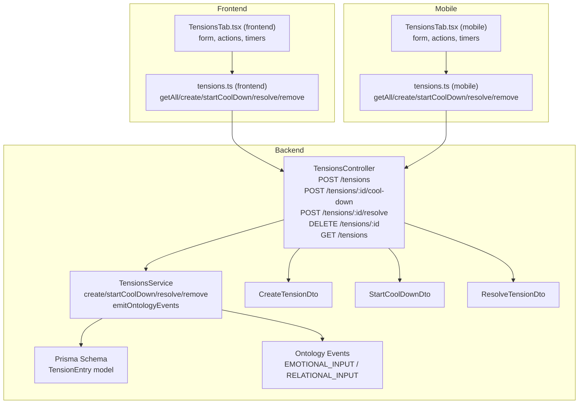
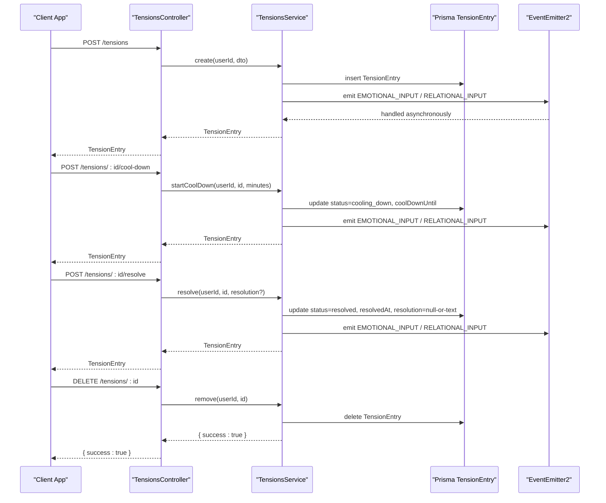
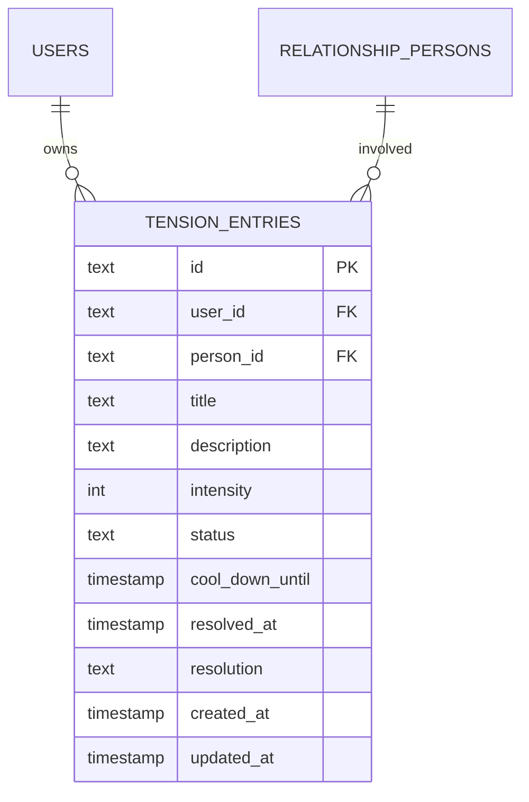
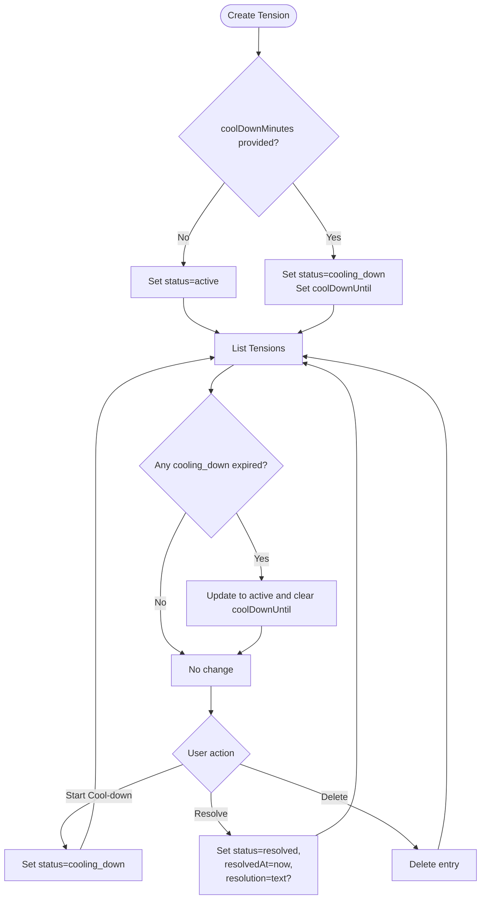
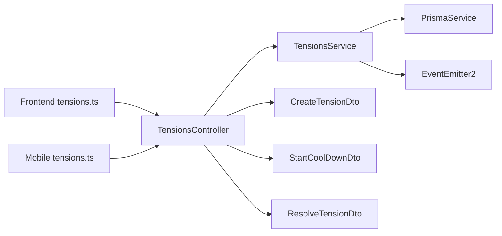

# Tension Resolution

<cite>
**Referenced Files in This Document**
- [tensions.controller.ts](file://backend/src/tensions/tensions.controller.ts)
- [tensions.service.ts](file://backend/src/tensions/tensions.service.ts)
- [create-tension.dto.ts](file://backend/src/tensions/dto/create-tension.dto.ts)
- [start-cool-down.dto.ts](file://backend/src/tensions/dto/start-cool-down.dto.ts)
- [resolve-tension.dto.ts](file://backend/src/tensions/dto/resolve-tension.dto.ts)
- [schema.prisma](file://backend/prisma/schema.prisma)
- [migration.sql](file://backend/prisma/migrations/20260422075259_add_tension_entries/migration.sql)
- [events.ts](file://backend/src/ontology/events.ts)
- [tensions.ts (frontend)](file://frontend/src/api/tensions.ts)
- [TensionsTab.tsx (frontend)](file://frontend/src/pages/circle/TensionsTab.tsx)
- [tensions.ts (mobile)](file://mobile/src/api/tensions.ts)
- [TensionsTab.tsx (mobile)](file://mobile/src/screens/TensionsTab.tsx)
</cite>

## Table of Contents
1. [Introduction](#introduction)
2. [Project Structure](#project-structure)
3. [Core Components](#core-components)
4. [Architecture Overview](#architecture-overview)
5. [Detailed Component Analysis](#detailed-component-analysis)
6. [Dependency Analysis](#dependency-analysis)
7. [Performance Considerations](#performance-considerations)
8. [Troubleshooting Guide](#troubleshooting-guide)
9. [Conclusion](#conclusion)
10. [Appendices](#appendices)

## Introduction
This document explains the Tension Resolution system that helps users identify, track, and resolve interpersonal conflicts in a structured, psychologically safe way. It covers the tension lifecycle from detection through resolution, including optional cool-down periods and reconnection phases. It documents the tension entity model, escalation and de-escalation mechanisms, and the API endpoints used to manage tensions. Practical examples illustrate creating tension records, starting cool-down periods, and marking tensions as resolved. Psychological safety and support resources are integrated into the workflow to encourage reflection and healing.

## Project Structure
The Tension Resolution system spans backend NestJS controllers and services, DTOs, Prisma database models, and frontend/mobile clients.

**Diagram sources**
- [tensions.controller.ts:17-54](file://backend/src/tensions/tensions.controller.ts#L17-L54)
- [tensions.service.ts:32-124](file://backend/src/tensions/tensions.service.ts#L32-L124)
- [create-tension.dto.ts:3-25](file://backend/src/tensions/dto/create-tension.dto.ts#L3-L25)
- [start-cool-down.dto.ts:3-7](file://backend/src/tensions/dto/start-cool-down.dto.ts#L3-L7)
- [resolve-tension.dto.ts:3-7](file://backend/src/tensions/dto/resolve-tension.dto.ts#L3-L7)
- [schema.prisma:481-499](file://backend/prisma/schema.prisma#L481-L499)
- [events.ts:6-10](file://backend/src/ontology/events.ts#L6-L10)
- [tensions.ts (frontend):27-51](file://frontend/src/api/tensions.ts#L27-L51)
- [TensionsTab.tsx (frontend):25-68](file://frontend/src/pages/circle/TensionsTab.tsx#L25-L68)
- [tensions.ts (mobile):16-36](file://mobile/src/api/tensions.ts#L16-L36)
- [TensionsTab.tsx (mobile):47-80](file://mobile/src/screens/TensionsTab.tsx#L47-L80)

**Section sources**
- [tensions.controller.ts:17-54](file://backend/src/tensions/tensions.controller.ts#L17-L54)
- [tensions.service.ts:32-124](file://backend/src/tensions/tensions.service.ts#L32-L124)
- [schema.prisma:481-499](file://backend/prisma/schema.prisma#L481-L499)
- [tensions.ts (frontend):27-51](file://frontend/src/api/tensions.ts#L27-L51)
- [TensionsTab.tsx (frontend):25-68](file://frontend/src/pages/circle/TensionsTab.tsx#L25-L68)
- [tensions.ts (mobile):16-36](file://mobile/src/api/tensions.ts#L16-L36)
- [TensionsTab.tsx (mobile):47-80](file://mobile/src/screens/TensionsTab.tsx#L47-L80)

## Core Components
- TensionsController: Exposes REST endpoints for creating, listing, starting cool-down, resolving, and deleting tension entries. Uses JWT guard for authentication.
- TensionsService: Implements business logic for persistence, status transitions, and emitting relational/emotional ontology events.
- DTOs: Validate and constrain inputs for creating, cooling down, and resolving tensions.
- Prisma Model: Defines the TensionEntry entity with fields for title, description, intensity, status, cool-down timer, resolution metadata, and timestamps.
- Frontend and Mobile Clients: Provide UI surfaces and API bindings to log tensions, apply cool-down timers, mark resolutions, and delete entries.

**Section sources**
- [tensions.controller.ts:22-53](file://backend/src/tensions/tensions.controller.ts#L22-L53)
- [tensions.service.ts:32-124](file://backend/src/tensions/tensions.service.ts#L32-L124)
- [create-tension.dto.ts:3-25](file://backend/src/tensions/dto/create-tension.dto.ts#L3-L25)
- [start-cool-down.dto.ts:3-7](file://backend/src/tensions/dto/start-cool-down.dto.ts#L3-L7)
- [resolve-tension.dto.ts:3-7](file://backend/src/tensions/dto/resolve-tension.dto.ts#L3-L7)
- [schema.prisma:481-499](file://backend/prisma/schema.prisma#L481-L499)

## Architecture Overview
The system integrates tightly with the Ontology subsystem to emit emotional and relational signals when tensions are created, cooled down, or resolved. This enables downstream synthesis and insights generation.

**Diagram sources**
- [tensions.controller.ts:22-53](file://backend/src/tensions/tensions.controller.ts#L22-L53)
- [tensions.service.ts:32-124](file://backend/src/tensions/tensions.service.ts#L32-L124)
- [events.ts:6-10](file://backend/src/ontology/events.ts#L6-L10)

## Detailed Component Analysis

### Tension Entity Model
The TensionEntry model captures the core attributes of a tension record and supports the full lifecycle.

- Fields:
  - id: Unique identifier
  - user_id: Foreign key to User
  - person_id: Optional foreign key to RelationshipPerson
  - title: Short description
  - description: Free-form narrative
  - intensity: Integer from 1–10
  - status: Enum-like values: active, cooling_down, resolved
  - cool_down_until: Timestamp when cool-down ends
  - resolved_at: Timestamp when resolved
  - resolution: Optional resolution summary
  - created_at / updated_at: Audit timestamps

- Validation and defaults:
  - Intensity constrained to 1–10
  - Status defaults to active
  - coolDownMinutes optional; if provided, initial status is cooling_down

**Diagram sources**
- [schema.prisma:481-499](file://backend/prisma/schema.prisma#L481-L499)
- [migration.sql:1-24](file://backend/prisma/migrations/20260422075259_add_tension_entries/migration.sql#L1-L24)

**Section sources**
- [schema.prisma:481-499](file://backend/prisma/schema.prisma#L481-L499)
- [migration.sql:1-24](file://backend/prisma/migrations/20260422075259_add_tension_entries/migration.sql#L1-L24)
- [tensions.service.ts:32-51](file://backend/src/tensions/tensions.service.ts#L32-L51)

### Tension Lifecycle and Status Transitions
- Creation:
  - If coolDownMinutes is provided, status becomes cooling_down with coolDownUntil set.
  - Otherwise, status remains active.
- Listing:
  - findAll returns all entries for a user, ordered by newest first.
  - Automatically updates any cooling_down entries whose coolDownUntil has passed to active.
- Cool-down:
  - startCoolDown sets status=cooling_down and coolDownUntil=now+minutes.
- Resolution:
  - resolve sets status=resolved, resolvedAt=now, and optionally stores resolution text.
- Deletion:
  - remove deletes the entry.

**Diagram sources**
- [tensions.service.ts:32-78](file://backend/src/tensions/tensions.service.ts#L32-L78)
- [tensions.service.ts:80-114](file://backend/src/tensions/tensions.service.ts#L80-L114)

**Section sources**
- [tensions.service.ts:32-114](file://backend/src/tensions/tensions.service.ts#L32-L114)

### API Endpoints
- POST /tensions
  - Purpose: Create a new tension entry
  - Auth: Required (JWT)
  - Body: CreateTensionDto (title, description, personId?, intensity?, coolDownMinutes?)
  - Response: TensionEntry
- GET /tensions
  - Purpose: List all tension entries for the authenticated user
  - Auth: Required (JWT)
  - Response: TensionEntry[]
- POST /tensions/:id/cool-down
  - Purpose: Start a cool-down period
  - Auth: Required (JWT)
  - Body: StartCoolDownDto (minutes)
  - Response: TensionEntry
- POST /tensions/:id/resolve
  - Purpose: Mark a tension as resolved
  - Auth: Required (JWT)
  - Body: ResolveTensionDto (resolution?)
  - Response: TensionEntry
- DELETE /tensions/:id
  - Purpose: Remove a tension entry
  - Auth: Required (JWT)
  - Response: { success: true }

Client bindings (frontend and mobile):
- Frontend: tensions.ts exposes getAll, create, startCoolDown, resolve, remove
- Mobile: tensions.ts exposes the same operations

**Section sources**
- [tensions.controller.ts:22-53](file://backend/src/tensions/tensions.controller.ts#L22-L53)
- [tensions.ts (frontend):27-51](file://frontend/src/api/tensions.ts#L27-L51)
- [tensions.ts (mobile):16-36](file://mobile/src/api/tensions.ts#L16-L36)

### DTOs and Validation
- CreateTensionDto
  - title: string (required)
  - description: string (required)
  - personId: string (optional)
  - intensity: integer 1–10 (optional, default 5)
  - coolDownMinutes: integer 1–120 (optional)
- StartCoolDownDto
  - minutes: integer ≥ 1
- ResolveTensionDto
  - resolution: string (optional)

These DTOs ensure inputs are validated before persistence.

**Section sources**
- [create-tension.dto.ts:3-25](file://backend/src/tensions/dto/create-tension.dto.ts#L3-L25)
- [start-cool-down.dto.ts:3-7](file://backend/src/tensions/dto/start-cool-down.dto.ts#L3-L7)
- [resolve-tension.dto.ts:3-7](file://backend/src/tensions/dto/resolve-tension.dto.ts#L3-L7)

### Psychological Safety and Support Resources
- Cool-down timers: Encourage taking time before reacting, reducing impulsive responses.
- Intensity slider: Prompts users to rate and reflect on emotional intensity.
- Resolution summaries: Provide a place to capture insights and agreements.
- Visual indicators: Color-coded statuses (active, cooling_down, resolved) and remaining cool-down time help users track progress.
- Optional person association: Allows users to connect tensions to specific relationships, supporting relational insights.

**Section sources**
- [TensionsTab.tsx (frontend):107-151](file://frontend/src/pages/circle/TensionsTab.tsx#L107-L151)
- [TensionsTab.tsx (mobile):193-239](file://mobile/src/screens/TensionsTab.tsx#L193-L239)

## Dependency Analysis
- Controllers depend on Services for business logic.
- Services depend on Prisma for persistence and EventEmitter2 for emitting ontology events.
- DTOs validate controller inputs.
- Frontend and mobile clients depend on the backend endpoints.

**Diagram sources**
- [tensions.controller.ts:17-54](file://backend/src/tensions/tensions.controller.ts#L17-L54)
- [tensions.service.ts:11-14](file://backend/src/tensions/tensions.service.ts#L11-L14)
- [tensions.ts (frontend):27-51](file://frontend/src/api/tensions.ts#L27-L51)
- [tensions.ts (mobile):16-36](file://mobile/src/api/tensions.ts#L16-L36)

**Section sources**
- [tensions.controller.ts:17-54](file://backend/src/tensions/tensions.controller.ts#L17-L54)
- [tensions.service.ts:11-14](file://backend/src/tensions/tensions.service.ts#L11-L14)

## Performance Considerations
- findAll auto-updates expired cooling_down entries in-memory and batches DB updates; ensure minimal churn by avoiding frequent polling.
- Emitting ontology events is fire-and-forget; keep payloads small to reduce overhead.
- Use pagination or client-side caching for long lists of tensions.

## Troubleshooting Guide
Common issues and remedies:
- Not Found Errors
  - Cause: Attempting to start cool-down or resolve a tension that does not belong to the authenticated user.
  - Remedy: Verify ownership and ID correctness.
- Validation Failures
  - Cause: Invalid intensity range or missing required fields.
  - Remedy: Ensure intensity is 1–10 and required fields are present.
- Cool-down Timer Not Updating
  - Cause: coolDownUntil has passed but client did not refresh; service auto-updates on findAll.
  - Remedy: Trigger a refresh or navigate away and back to reload.

**Section sources**
- [tensions.service.ts:80-124](file://backend/src/tensions/tensions.service.ts#L80-L124)

## Conclusion
The Tension Resolution system provides a robust, psychologically safe framework for identifying and managing interpersonal conflicts. By combining explicit cool-down mechanics, structured resolution summaries, and integration with the broader Ontology system, it supports reflective processing and relational growth. The clear API surface and client integrations enable consistent experiences across platforms.

## Appendices

### Practical Examples

- Creating a tension record
  - Endpoint: POST /tensions
  - Example payload:
    - title: "Workload imbalance"
    - description: "Feeling overwhelmed by deadlines"
    - intensity: 7
    - coolDownMinutes: 30
  - Expected outcome: TensionEntry with status=cooling_down and coolDownUntil set

- Starting a cool-down period
  - Endpoint: POST /tensions/:id/cool-down
  - Example payload:
    - minutes: 60
  - Expected outcome: TensionEntry with status=cooling_down and updated coolDownUntil

- Resolving a tension
  - Endpoint: POST /tensions/:id/resolve
  - Example payload:
    - resolution: "Agreed on new schedule and clearer handoffs"
  - Expected outcome: TensionEntry with status=resolved, resolvedAt set, and resolution stored

- Deleting a tension
  - Endpoint: DELETE /tensions/:id
  - Expected outcome: { success: true }

**Section sources**
- [tensions.controller.ts:22-53](file://backend/src/tensions/tensions.controller.ts#L22-L53)
- [tensions.ts (frontend):27-51](file://frontend/src/api/tensions.ts#L27-L51)
- [tensions.ts (mobile):16-36](file://mobile/src/api/tensions.ts#L16-L36)