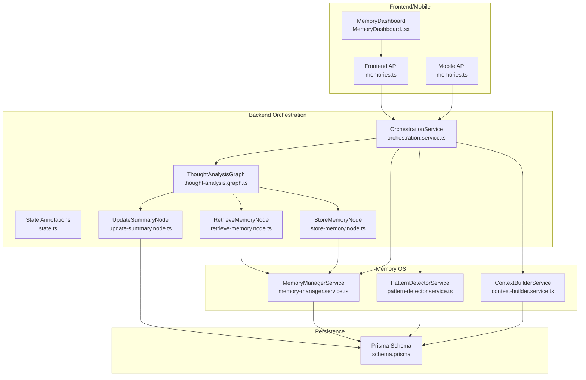
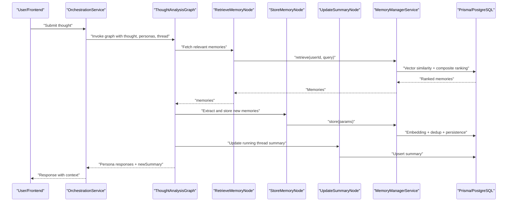
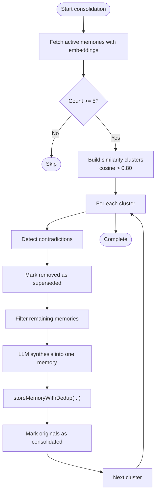
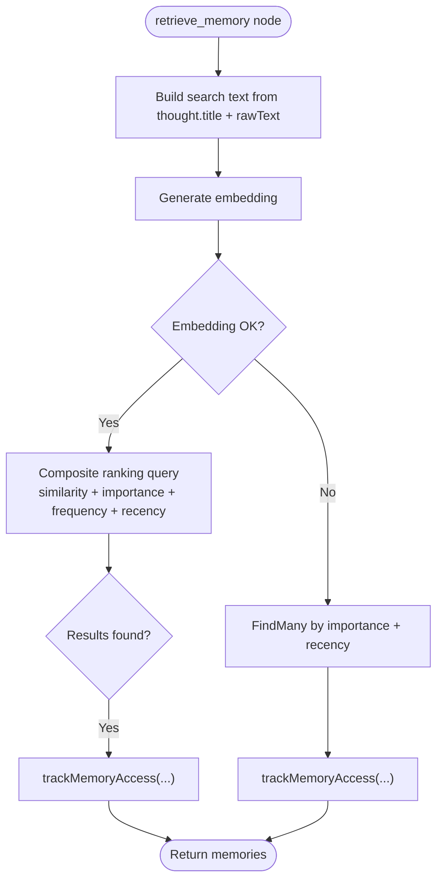
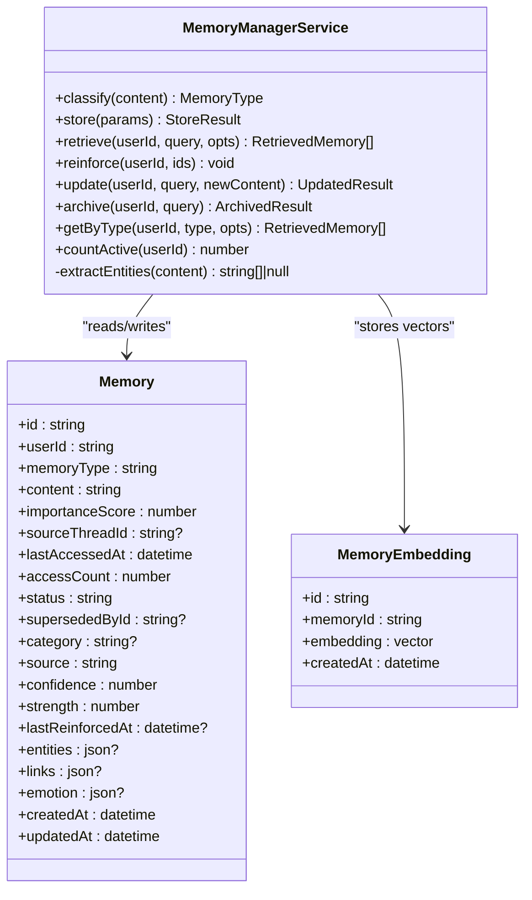
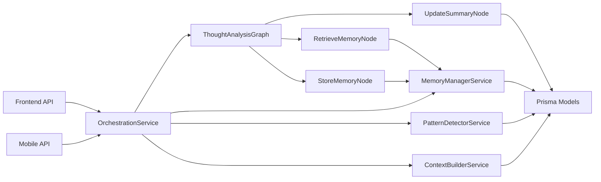

# Memory Consolidation & Retrieval

<cite>
**Referenced Files in This Document**
- [memory-consolidation.service.ts](file://backend/src/orchestration/memory-consolidation.service.ts)
- [retrieve-memory.node.ts](file://backend/src/orchestration/graph/nodes/retrieve-memory.node.ts)
- [store-memory.node.ts](file://backend/src/orchestration/graph/nodes/store-memory.node.ts)
- [update-summary.node.ts](file://backend/src/orchestration/graph/nodes/update-summary.node.ts)
- [thought-analysis.graph.ts](file://backend/src/orchestration/graph/thought-analysis.graph.ts)
- [state.ts](file://backend/src/orchestration/graph/state.ts)
- [memory-manager.service.ts](file://backend/src/memory-os/memory-manager.service.ts)
- [pattern-detector.service.ts](file://backend/src/memory-os/pattern-detector.service.ts)
- [context-builder.service.ts](file://backend/src/memory-os/context-builder.service.ts)
- [schema.prisma](file://backend/prisma/schema.prisma)
- [orchestration.service.ts](file://backend/src/orchestration/orchestration.service.ts)
- [memories.ts](file://frontend/src/api/memories.ts)
- [memories.ts](file://mobile/src/api/memories.ts)
- [MemoryDashboard.tsx](file://frontend/src/pages/MemoryDashboard.tsx)
</cite>

## Table of Contents
1. [Introduction](#introduction)
2. [Project Structure](#project-structure)
3. [Core Components](#core-components)
4. [Architecture Overview](#architecture-overview)
5. [Detailed Component Analysis](#detailed-component-analysis)
6. [Dependency Analysis](#dependency-analysis)
7. [Performance Considerations](#performance-considerations)
8. [Troubleshooting Guide](#troubleshooting-guide)
9. [Conclusion](#conclusion)

## Introduction
This document explains the memory consolidation and retrieval mechanisms that transform raw thoughts into structured, searchable knowledge. It covers consolidation algorithms, memory categorization, temporal organization, retrieval strategies, context preservation, cross-reference linking, and the memory lifecycle from capture to long-term storage and intelligent recall. It also details integration with persona orchestration and the semantic search system.

## Project Structure
The memory system spans backend orchestration, a dedicated Memory OS module, and frontend/mobile APIs:
- Backend orchestration orchestrates thought analysis, memory retrieval, and storage.
- Memory OS provides classification, storage, retrieval, reinforcement, updates, archiving, and pattern detection.
- Frontend and mobile expose memory listing, search, consolidation, and statistics.

**Diagram sources**
- [memories.ts:45-91](file://frontend/src/api/memories.ts#L45-L91)
- [memories.ts:45-91](file://mobile/src/api/memories.ts#L45-L91)
- [MemoryDashboard.tsx:104-126](file://frontend/src/pages/MemoryDashboard.tsx#L104-L126)
- [orchestration.service.ts:2703-2736](file://backend/src/orchestration/orchestration.service.ts#L2703-L2736)
- [thought-analysis.graph.ts:29-68](file://backend/src/orchestration/graph/thought-analysis.graph.ts#L29-L68)
- [state.ts:88-177](file://backend/src/orchestration/graph/state.ts#L88-L177)
- [retrieve-memory.node.ts:11-72](file://backend/src/orchestration/graph/nodes/retrieve-memory.node.ts#L11-L72)
- [store-memory.node.ts:14-111](file://backend/src/orchestration/graph/nodes/store-memory.node.ts#L14-L111)
- [update-summary.node.ts:10-93](file://backend/src/orchestration/graph/nodes/update-summary.node.ts#L10-L93)
- [memory-manager.service.ts:67-525](file://backend/src/memory-os/memory-manager.service.ts#L67-L525)
- [pattern-detector.service.ts:15-286](file://backend/src/memory-os/pattern-detector.service.ts#L15-L286)
- [context-builder.service.ts:23-568](file://backend/src/memory-os/context-builder.service.ts#L23-L568)
- [schema.prisma:179-243](file://backend/prisma/schema.prisma#L179-L243)

**Section sources**
- [memories.ts:45-91](file://frontend/src/api/memories.ts#L45-L91)
- [memories.ts:45-91](file://mobile/src/api/memories.ts#L45-L91)
- [MemoryDashboard.tsx:104-126](file://frontend/src/pages/MemoryDashboard.tsx#L104-L126)
- [orchestration.service.ts:2703-2736](file://backend/src/orchestration/orchestration.service.ts#L2703-L2736)
- [thought-analysis.graph.ts:29-68](file://backend/src/orchestration/graph/thought-analysis.graph.ts#L29-L68)
- [state.ts:88-177](file://backend/src/orchestration/graph/state.ts#L88-L177)
- [retrieve-memory.node.ts:11-72](file://backend/src/orchestration/graph/nodes/retrieve-memory.node.ts#L11-L72)
- [store-memory.node.ts:14-111](file://backend/src/orchestration/graph/nodes/store-memory.node.ts#L14-L111)
- [update-summary.node.ts:10-93](file://backend/src/orchestration/graph/nodes/update-summary.node.ts#L10-L93)
- [memory-manager.service.ts:67-525](file://backend/src/memory-os/memory-manager.service.ts#L67-L525)
- [pattern-detector.service.ts:15-286](file://backend/src/memory-os/pattern-detector.service.ts#L15-L286)
- [context-builder.service.ts:23-568](file://backend/src/memory-os/context-builder.service.ts#L23-L568)
- [schema.prisma:179-243](file://backend/prisma/schema.prisma#L179-L243)

## Core Components
- Memory Consolidation Service: Periodic consolidation of semantically similar memories, contradiction detection, and synthesis.
- Retrieve Memory Node: Semantic vector search with composite ranking and importance/frequency/recency weighting.
- Store Memory Node: Extraction of key facts from thought analysis and storage with deduplication and embeddings.
- Memory Manager Service: Unified write/read path for Memory OS with classification, deduplication, entity extraction, embedding, retrieval, reinforcement, updates, archiving, and type-based fetching.
- Pattern Detector Service: Behavioral pattern discovery and staleness deactivation.
- Context Builder Service: Structured context assembly for persona orchestration using memory, patterns, and contextual layers.
- Prisma Schema: Vector embeddings, memory types, statuses, and pattern storage.

**Section sources**
- [memory-consolidation.service.ts:18-309](file://backend/src/orchestration/memory-consolidation.service.ts#L18-L309)
- [retrieve-memory.node.ts:11-72](file://backend/src/orchestration/graph/nodes/retrieve-memory.node.ts#L11-L72)
- [store-memory.node.ts:14-111](file://backend/src/orchestration/graph/nodes/store-memory.node.ts#L14-L111)
- [memory-manager.service.ts:67-525](file://backend/src/memory-os/memory-manager.service.ts#L67-L525)
- [pattern-detector.service.ts:15-286](file://backend/src/memory-os/pattern-detector.service.ts#L15-L286)
- [context-builder.service.ts:23-568](file://backend/src/memory-os/context-builder.service.ts#L23-L568)
- [schema.prisma:179-243](file://backend/prisma/schema.prisma#L179-L243)

## Architecture Overview
The system integrates persona orchestration with Memory OS:
- Thought analysis graph drives retrieval, persona runs, saving, summarization, and memory storage.
- Memory Manager centralizes storage and retrieval with embeddings and composite ranking.
- Pattern Detector augments memory with behavioral patterns.
- Context Builder composes persona prompts with always-inject and contextual layers.

**Diagram sources**
- [thought-analysis.graph.ts:29-68](file://backend/src/orchestration/graph/thought-analysis.graph.ts#L29-L68)
- [retrieve-memory.node.ts:11-72](file://backend/src/orchestration/graph/nodes/retrieve-memory.node.ts#L11-L72)
- [store-memory.node.ts:14-111](file://backend/src/orchestration/graph/nodes/store-memory.node.ts#L14-L111)
- [update-summary.node.ts:10-93](file://backend/src/orchestration/graph/nodes/update-summary.node.ts#L10-L93)
- [memory-manager.service.ts:261-336](file://backend/src/memory-os/memory-manager.service.ts#L261-L336)
- [orchestration.service.ts:2703-2736](file://backend/src/orchestration/orchestration.service.ts#L2703-L2736)

## Detailed Component Analysis

### Memory Consolidation Service
- Purpose: Periodically merge semantically similar memories and resolve contradictions to prevent bloat and maintain coherence.
- Workflow:
  - Fetch active memories with embeddings ordered by creation time.
  - Build similarity clusters using cosine similarity threshold.
  - Detect contradictions within clusters and mark removed memories as superseded.
  - Synthesize remaining cluster into a consolidated memory using LLM.
  - Store consolidated memory with deduplication and mark originals as consolidated.
  - Trigger consolidation every N memories.

**Diagram sources**
- [memory-consolidation.service.ts:42-130](file://backend/src/orchestration/memory-consolidation.service.ts#L42-L130)
- [memory-consolidation.service.ts:137-182](file://backend/src/orchestration/memory-consolidation.service.ts#L137-L182)
- [memory-consolidation.service.ts:188-242](file://backend/src/orchestration/memory-consolidation.service.ts#L188-L242)
- [memory-consolidation.service.ts:247-288](file://backend/src/orchestration/memory-consolidation.service.ts#L247-L288)

**Section sources**
- [memory-consolidation.service.ts:18-309](file://backend/src/orchestration/memory-consolidation.service.ts#L18-L309)

### Retrieve Memory Node
- Purpose: Retrieve relevant long-term memories using semantic vector similarity with composite ranking and fallback to importance-based retrieval.
- Ranking factors:
  - Similarity (0.6 weight)
  - Importance score (0.2 weight)
  - Frequency (access_count/10 capped at 1.0, 0.1 weight)
  - Recency (last_accessed_at within 30 days, 0.1 weight)
- Access tracking fire-and-forget to reinforce memory strength/confidence.

**Diagram sources**
- [retrieve-memory.node.ts:15-72](file://backend/src/orchestration/graph/nodes/retrieve-memory.node.ts#L15-L72)

**Section sources**
- [retrieve-memory.node.ts:11-72](file://backend/src/orchestration/graph/nodes/retrieve-memory.node.ts#L11-L72)

### Store Memory Node
- Purpose: Extract key facts from thought analysis and store them as long-term memories.
- Context enrichment includes thought title/type, user context, mood/energy, completion patterns, and persona responses.
- LLM extracts 1–3 concise facts; fallback stores a basic memory if extraction fails.
- Deduplication and embedding handled by Memory Manager.

**Section sources**
- [store-memory.node.ts:14-111](file://backend/src/orchestration/graph/nodes/store-memory.node.ts#L14-L111)

### Memory Manager Service
- Classification: LLM-based classification into memory types (episodic, semantic, procedural, goal, reflection, relationship, identity, skill, episode, collective).
- Storage: Embedding generation, deduplication (cosine > 0.92), entity extraction, and persistence.
- Retrieval: Composite ranking with weights for similarity, strength, confidence, importance, and recency; supports filtering by type and exclusion lists.
- Reinforcement: On retrieval, strength and confidence are bumped with decay controls.
- Updates: Content updates with re-embedding and entity refresh.
- Archiving: Soft-deletion of memories by status change.
- Type-based fetch: Always-inject layers for goals, identity, and patterns.

**Diagram sources**
- [memory-manager.service.ts:67-525](file://backend/src/memory-os/memory-manager.service.ts#L67-L525)
- [schema.prisma:179-222](file://backend/prisma/schema.prisma#L179-L222)

**Section sources**
- [memory-manager.service.ts:67-525](file://backend/src/memory-os/memory-manager.service.ts#L67-L525)
- [schema.prisma:179-222](file://backend/prisma/schema.prisma#L179-L222)

### Pattern Detector Service
- Purpose: Discover recurring behavioral patterns from recent memories and maintain confidence over time.
- Triggers: Every N new memories.
- Detection: LLM identifies patterns with supporting evidence indices; duplicates merged if text similarity > threshold.
- Staleness: Patterns deactivated if no supporting evidence in last M days.

**Section sources**
- [pattern-detector.service.ts:15-286](file://backend/src/memory-os/pattern-detector.service.ts#L15-L286)

### Context Builder Service
- Purpose: Assemble persona prompts with always-inject layers (goals, identity, patterns, user profile) and contextual layers (memories, relationship, planner, messaging, etc.) based on message scope.
- Always injects session summaries and available personas for continuity and selection.

**Section sources**
- [context-builder.service.ts:23-568](file://backend/src/memory-os/context-builder.service.ts#L23-L568)

### Thought Analysis Graph and State
- Graph flow: retrieve_memory → load_thread_history → build_prompts → run_personas → save_responses → thinking_os_core → update_summary → store_memory.
- State carries thought, personas, thread, user context, intermediate memories, thread messages, persona prompts/responses, summaries, and flags.

**Section sources**
- [thought-analysis.graph.ts:15-68](file://backend/src/orchestration/graph/thought-analysis.graph.ts#L15-L68)
- [state.ts:88-177](file://backend/src/orchestration/graph/state.ts#L88-L177)

### Semantic Search Integration
- Orchestration service exposes semantic search endpoint using vector similarity and composite ranking.
- Frontend/mobile APIs provide listing, search, consolidation, and stats.

**Section sources**
- [orchestration.service.ts:2703-2736](file://backend/src/orchestration/orchestration.service.ts#L2703-L2736)
- [memories.ts:45-91](file://frontend/src/api/memories.ts#L45-L91)
- [memories.ts:45-91](file://mobile/src/api/memories.ts#L45-L91)

## Dependency Analysis
- Orchestration depends on:
  - Thought analysis graph for memory retrieval and storage.
  - Memory Manager for classification, embedding, deduplication, and retrieval.
  - Pattern Detector for behavioral patterns.
  - Context Builder for persona prompt construction.
- Memory Manager depends on:
  - Prisma models for memories, memory embeddings, and memory patterns.
  - Embedding generation utilities.
- Frontend/mobile depend on orchestration endpoints for memory operations.

**Diagram sources**
- [orchestration.service.ts:2703-2736](file://backend/src/orchestration/orchestration.service.ts#L2703-L2736)
- [thought-analysis.graph.ts:29-68](file://backend/src/orchestration/graph/thought-analysis.graph.ts#L29-L68)
- [retrieve-memory.node.ts:11-72](file://backend/src/orchestration/graph/nodes/retrieve-memory.node.ts#L11-L72)
- [store-memory.node.ts:14-111](file://backend/src/orchestration/graph/nodes/store-memory.node.ts#L14-L111)
- [update-summary.node.ts:10-93](file://backend/src/orchestration/graph/nodes/update-summary.node.ts#L10-L93)
- [memory-manager.service.ts:67-525](file://backend/src/memory-os/memory-manager.service.ts#L67-L525)
- [pattern-detector.service.ts:15-286](file://backend/src/memory-os/pattern-detector.service.ts#L15-L286)
- [context-builder.service.ts:23-568](file://backend/src/memory-os/context-builder.service.ts#L23-L568)
- [schema.prisma:179-243](file://backend/prisma/schema.prisma#L179-L243)
- [memories.ts:45-91](file://frontend/src/api/memories.ts#L45-L91)
- [memories.ts:45-91](file://mobile/src/api/memories.ts#L45-L91)

**Section sources**
- [orchestration.service.ts:2703-2736](file://backend/src/orchestration/orchestration.service.ts#L2703-L2736)
- [thought-analysis.graph.ts:29-68](file://backend/src/orchestration/graph/thought-analysis.graph.ts#L29-L68)
- [retrieve-memory.node.ts:11-72](file://backend/src/orchestration/graph/nodes/retrieve-memory.node.ts#L11-L72)
- [store-memory.node.ts:14-111](file://backend/src/orchestration/graph/nodes/store-memory.node.ts#L14-L111)
- [update-summary.node.ts:10-93](file://backend/src/orchestration/graph/nodes/update-summary.node.ts#L10-L93)
- [memory-manager.service.ts:67-525](file://backend/src/memory-os/memory-manager.service.ts#L67-L525)
- [pattern-detector.service.ts:15-286](file://backend/src/memory-os/pattern-detector.service.ts#L15-L286)
- [context-builder.service.ts:23-568](file://backend/src/memory-os/context-builder.service.ts#L23-L568)
- [schema.prisma:179-243](file://backend/prisma/schema.prisma#L179-L243)
- [memories.ts:45-91](file://frontend/src/api/memories.ts#L45-L91)
- [memories.ts:45-91](file://mobile/src/api/memories.ts#L45-L91)

## Performance Considerations
- Vector similarity queries leverage PostgreSQL vector extension with index-friendly distance ordering.
- Composite ranking balances semantic relevance with strength/confidence/importance/recency to avoid cold-start bias.
- Deduplication thresholds (similarity > 0.92 for embeddings) reduce redundant storage.
- Fire-and-forget access tracking minimizes latency while reinforcing memory strength.
- Pattern detection triggers are tuned to balance discovery freshness and cost (every N memories).
- Frontend/mobile APIs limit result sizes and provide pagination-friendly endpoints.

[No sources needed since this section provides general guidance]

## Troubleshooting Guide
Common issues and resolutions:
- Embedding failures:
  - Symptom: Retrieval falls back to importance-based; consolidation/storage may skip embedding-dependent steps.
  - Resolution: Verify OpenRouter API key/model configuration; retry operations.
- Duplicate memory storage:
  - Symptom: Stored=false with reason "duplicate" or "merged".
  - Resolution: Content similarity exceeds threshold; update content or adjust importance.
- Memory not retrieved:
  - Symptom: Empty results despite relevant content.
  - Resolution: Improve query phrasing; ensure embeddings were generated; verify memory status is active.
- Pattern detection errors:
  - Symptom: Pattern discovery fails silently.
  - Resolution: Inspect LLM call logs; ensure sufficient recent memories; verify thresholds.
- Frontend/mobile API errors:
  - Symptom: Consolidation or search requests fail.
  - Resolution: Check network connectivity; confirm endpoint availability; review error toast feedback.

**Section sources**
- [memory-manager.service.ts:240-252](file://backend/src/memory-os/memory-manager.service.ts#L240-L252)
- [memory-consolidation.service.ts:238-241](file://backend/src/orchestration/memory-consolidation.service.ts#L238-L241)
- [pattern-detector.service.ts:163-166](file://backend/src/memory-os/pattern-detector.service.ts#L163-L166)
- [memories.ts:76-79](file://frontend/src/api/memories.ts#L76-L79)
- [memories.ts:76-79](file://mobile/src/api/memories.ts#L76-L79)

## Conclusion
The memory system combines semantic search, composite ranking, classification, deduplication, and behavioral pattern detection to create a robust, coherent knowledge base. The thought analysis graph integrates retrieval and storage into persona orchestration, while the Memory OS provides a unified, extensible foundation for memory lifecycle management. Together, these components enable intelligent recall, context preservation, and scalable knowledge growth.