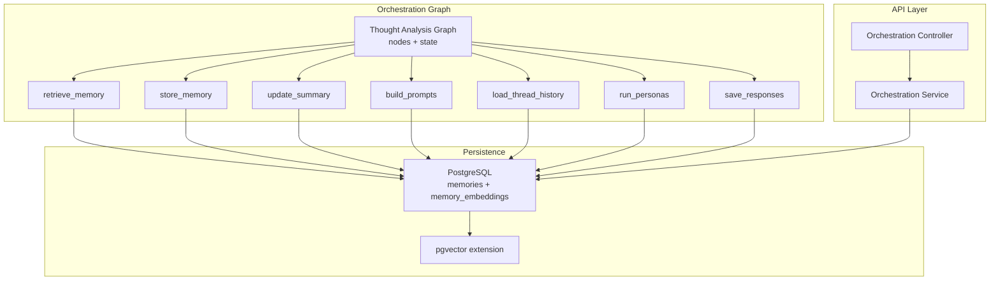
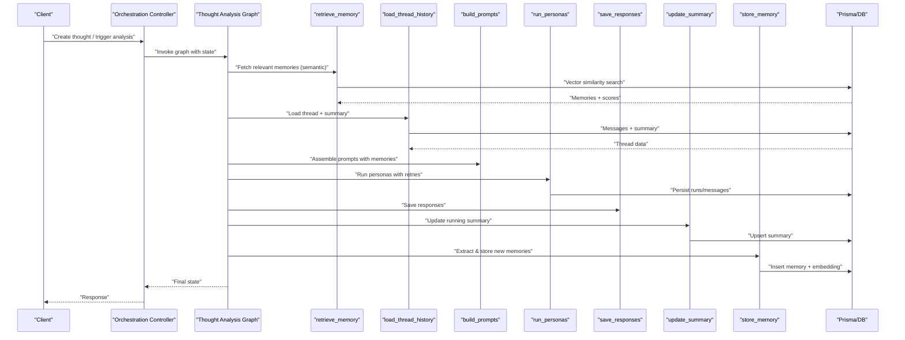
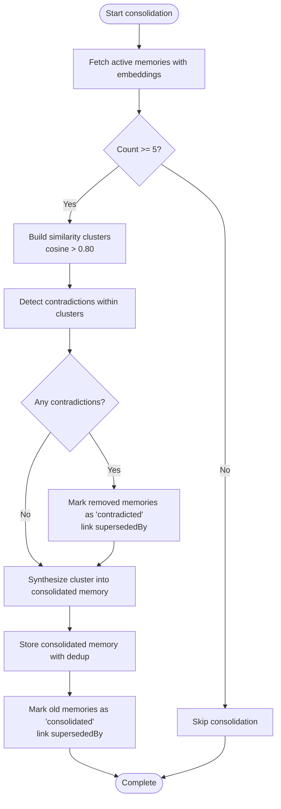
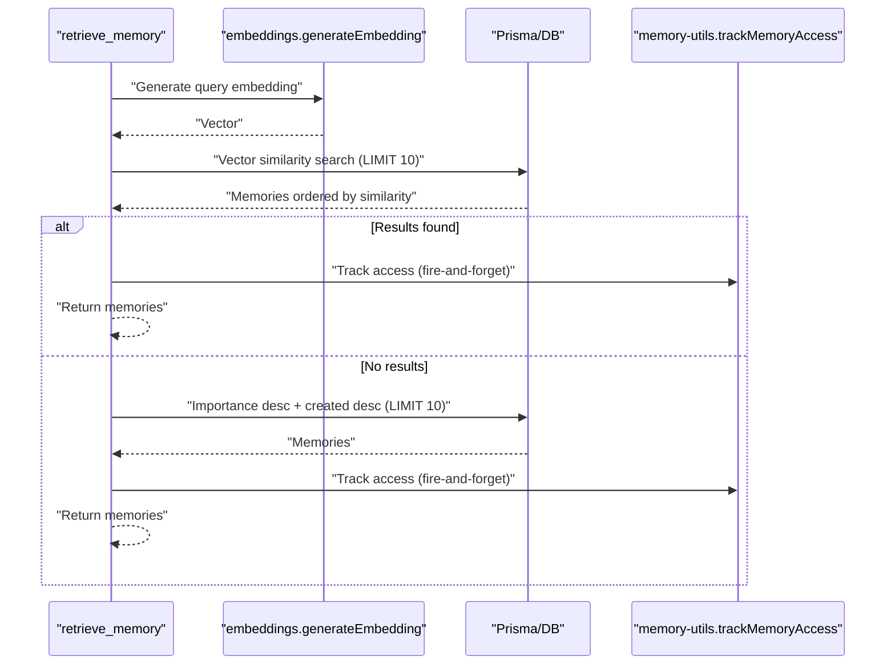
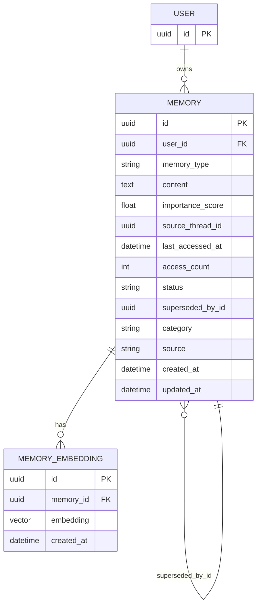
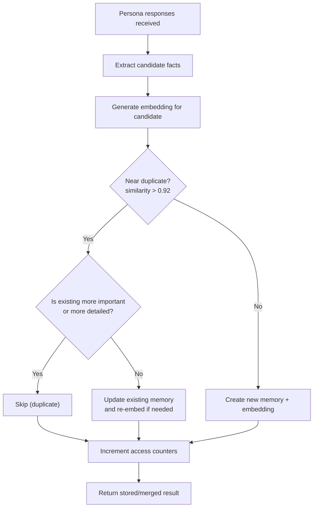
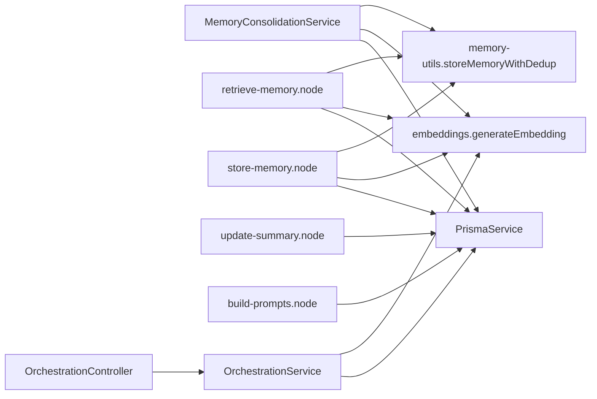

# Memory Consolidation & Retrieval

<cite>
**Referenced Files in This Document**
- [memory-consolidation.service.ts](file://backend/src/orchestration/memory-consolidation.service.ts)
- [retrieve-memory.node.ts](file://backend/src/orchestration/graph/nodes/retrieve-memory.node.ts)
- [store-memory.node.ts](file://backend/src/orchestration/graph/nodes/store-memory.node.ts)
- [update-summary.node.ts](file://backend/src/orchestration/graph/nodes/update-summary.node.ts)
- [build-prompts.node.ts](file://backend/src/orchestration/graph/nodes/build-prompts.node.ts)
- [load-thread-history.node.ts](file://backend/src/orchestration/graph/nodes/load-thread-history.node.ts)
- [run-personas.node.ts](file://backend/src/orchestration/graph/nodes/run-personas.node.ts)
- [save-responses.node.ts](file://backend/src/orchestration/graph/nodes/save-responses.node.ts)
- [embeddings.ts](file://backend/src/orchestration/graph/utils/embeddings.ts)
- [memory-utils.ts](file://backend/src/orchestration/graph/utils/memory-utils.ts)
- [thought-analysis.graph.ts](file://backend/src/orchestration/graph/thought-analysis.graph.ts)
- [state.ts](file://backend/src/orchestration/graph/state.ts)
- [schema.prisma](file://backend/prisma/schema.prisma)
- [orchestration.controller.ts](file://backend/src/orchestration/orchestration.controller.ts)
- [orchestration.service.ts](file://backend/src/orchestration/orchestration.service.ts)
- [memories.ts (frontend)](file://frontend/src/api/memories.ts)
- [memories.ts (mobile)](file://mobile/src/api/memories.ts)
</cite>

## Table of Contents
1. [Introduction](#introduction)
2. [Project Structure](#project-structure)
3. [Core Components](#core-components)
4. [Architecture Overview](#architecture-overview)
5. [Detailed Component Analysis](#detailed-component-analysis)
6. [Dependency Analysis](#dependency-analysis)
7. [Performance Considerations](#performance-considerations)
8. [Troubleshooting Guide](#troubleshooting-guide)
9. [Conclusion](#conclusion)
10. [Appendices](#appendices)

## Introduction
This document explains the memory consolidation and retrieval mechanisms that transform raw thoughts into structured, searchable knowledge. It covers consolidation algorithms, memory categorization, temporal organization, retrieval strategies, context preservation, cross-reference linking, and the full memory lifecycle from capture to long-term storage and intelligent recall. It also details integration with persona orchestration and the semantic search system.

## Project Structure
The memory system spans the orchestration graph, persistence layer, and API surface:
- Orchestration graph orchestrates thought analysis, memory retrieval, and storage.
- Persistence uses PostgreSQL with pgvector embeddings for semantic search.
- API endpoints expose memory listing, search, stats, and consolidation triggers.

**Diagram sources**
- [thought-analysis.graph.ts:29-67](file://backend/src/orchestration/graph/thought-analysis.graph.ts#L29-L67)
- [retrieve-memory.node.ts:11-71](file://backend/src/orchestration/graph/nodes/retrieve-memory.node.ts#L11-L71)
- [store-memory.node.ts:14-111](file://backend/src/orchestration/graph/nodes/store-memory.node.ts#L14-L111)
- [update-summary.node.ts:10-93](file://backend/src/orchestration/graph/nodes/update-summary.node.ts#L10-L93)
- [build-prompts.node.ts:72-175](file://backend/src/orchestration/graph/nodes/build-prompts.node.ts#L72-L175)
- [load-thread-history.node.ts:9-28](file://backend/src/orchestration/graph/nodes/load-thread-history.node.ts#L9-L28)
- [run-personas.node.ts:80-125](file://backend/src/orchestration/graph/nodes/run-personas.node.ts#L80-L125)
- [save-responses.node.ts:12-41](file://backend/src/orchestration/graph/nodes/save-responses.node.ts#L12-L41)
- [schema.prisma:170-202](file://backend/prisma/schema.prisma#L170-L202)

**Section sources**
- [thought-analysis.graph.ts:15-67](file://backend/src/orchestration/graph/thought-analysis.graph.ts#L15-L67)
- [schema.prisma:1-10](file://backend/prisma/schema.prisma#L1-10)

## Core Components
- Memory Consolidation Service: Periodically clusters similar memories, detects contradictions, synthesizes consolidated statements, and marks old memories as superseded.
- Retrieve Memory Node: Performs semantic vector search and falls back to importance/time ordering.
- Store Memory Node: Extracts key facts from thought analysis and stores them with deduplication and embeddings.
- Update Summary Node: Maintains a concise running summary to reduce context size.
- Build Prompts Node: Assembles rich persona prompts with memories, thread history, and contextual layers.
- Embeddings Utilities: Generates vector embeddings with retry/backoff and integrates with OpenRouter.
- Memory Utils: Deduplicates incoming memories, tracks access, and logs profile changes.
- Orchestration Controller/Service: Exposes memory listing, search, stats, and consolidation endpoints.

**Section sources**
- [memory-consolidation.service.ts:15-127](file://backend/src/orchestration/memory-consolidation.service.ts#L15-L127)
- [retrieve-memory.node.ts:11-71](file://backend/src/orchestration/graph/nodes/retrieve-memory.node.ts#L11-L71)
- [store-memory.node.ts:14-111](file://backend/src/orchestration/graph/nodes/store-memory.node.ts#L14-L111)
- [update-summary.node.ts:10-93](file://backend/src/orchestration/graph/nodes/update-summary.node.ts#L10-L93)
- [build-prompts.node.ts:72-175](file://backend/src/orchestration/graph/nodes/build-prompts.node.ts#L72-L175)
- [embeddings.ts:17-82](file://backend/src/orchestration/graph/utils/embeddings.ts#L17-L82)
- [memory-utils.ts:32-159](file://backend/src/orchestration/graph/utils/memory-utils.ts#L32-L159)
- [orchestration.controller.ts:275-330](file://backend/src/orchestration/orchestration.controller.ts#L275-L330)
- [orchestration.service.ts:2685-2718](file://backend/src/orchestration/orchestration.service.ts#L2685-L2718)

## Architecture Overview
The memory lifecycle is orchestrated by a linear LangGraph pipeline that retrieves relevant memories, builds persona prompts enriched with memories and thread history, runs personas, persists outputs, updates summaries, and stores new memories. Consolidation runs periodically to prune redundancy and maintain coherence.

**Diagram sources**
- [thought-analysis.graph.ts:29-67](file://backend/src/orchestration/graph/thought-analysis.graph.ts#L29-L67)
- [retrieve-memory.node.ts:15-71](file://backend/src/orchestration/graph/nodes/retrieve-memory.node.ts#L15-L71)
- [load-thread-history.node.ts:10-26](file://backend/src/orchestration/graph/nodes/load-thread-history.node.ts#L10-L26)
- [build-prompts.node.ts:72-175](file://backend/src/orchestration/graph/nodes/build-prompts.node.ts#L72-L175)
- [run-personas.node.ts:80-125](file://backend/src/orchestration/graph/nodes/run-personas.node.ts#L80-L125)
- [save-responses.node.ts:12-41](file://backend/src/orchestration/graph/nodes/save-responses.node.ts#L12-L41)
- [update-summary.node.ts:10-93](file://backend/src/orchestration/graph/nodes/update-summary.node.ts#L10-L93)
- [store-memory.node.ts:14-111](file://backend/src/orchestration/graph/nodes/store-memory.node.ts#L14-L111)

## Detailed Component Analysis

### Memory Consolidation Engine
The consolidation engine clusters active memories by semantic similarity, detects contradictions, synthesizes coherent statements, and replaces redundant memories while preserving important distinctions.

**Diagram sources**
- [memory-consolidation.service.ts:35-127](file://backend/src/orchestration/memory-consolidation.service.ts#L35-L127)
- [memory-consolidation.service.ts:185-239](file://backend/src/orchestration/memory-consolidation.service.ts#L185-L239)
- [memory-consolidation.service.ts:244-285](file://backend/src/orchestration/memory-consolidation.service.ts#L244-L285)

Key behaviors:
- Similarity threshold: cosine > 0.80 for clustering; deduplication threshold: similarity > 0.92.
- Contradiction detection uses an LLM to decide which memory to keep and which to remove.
- Synthesis produces concise, comprehensive statements and selects the dominant memory type.
- Old memories are marked as consolidated and linked to the new consolidated memory.

**Section sources**
- [memory-consolidation.service.ts:15-127](file://backend/src/orchestration/memory-consolidation.service.ts#L15-L127)
- [memory-consolidation.service.ts:185-239](file://backend/src/orchestration/memory-consolidation.service.ts#L185-L239)
- [memory-consolidation.service.ts:244-285](file://backend/src/orchestration/memory-consolidation.service.ts#L244-L285)
- [memory-utils.ts:32-159](file://backend/src/orchestration/graph/utils/memory-utils.ts#L32-L159)

### Retrieval Strategies and Temporal Organization
Retrieval prioritizes semantic similarity using vector embeddings, with a robust fallback to importance/time ordering. Memories are presented with timestamps and relative time labels to preserve temporal context.

**Diagram sources**
- [retrieve-memory.node.ts:15-71](file://backend/src/orchestration/graph/nodes/retrieve-memory.node.ts#L15-L71)
- [embeddings.ts:17-82](file://backend/src/orchestration/graph/utils/embeddings.ts#L17-L82)
- [memory-utils.ts:164-174](file://backend/src/orchestration/graph/utils/memory-utils.ts#L164-L174)

Temporal organization:
- Memories include createdAt for absolute date labeling.
- Relative time strings ("minutes/hours/days/weeks/months ago") help users track recency.

**Section sources**
- [retrieve-memory.node.ts:11-71](file://backend/src/orchestration/graph/nodes/retrieve-memory.node.ts#L11-L71)
- [build-prompts.node.ts:134-145](file://backend/src/orchestration/graph/nodes/build-prompts.node.ts#L134-L145)

### Memory Categorization and Cross-Reference Linking
- Categories: user-defined tags enable grouping and filtering.
- Cross-references: consolidated and contradicted memories link to their superseding or contradictory counterparts via foreign keys.
- Sources: thought, core_chat, persona_reply, manual distinguish provenance.

**Diagram sources**
- [schema.prisma:170-202](file://backend/prisma/schema.prisma#L170-L202)

**Section sources**
- [schema.prisma:170-202](file://backend/prisma/schema.prisma#L170-L202)
- [memory-consolidation.service.ts:73-111](file://backend/src/orchestration/memory-consolidation.service.ts#L73-L111)

### Context Preservation and Prompt Construction
The build_prompts node composes persona-specific prompts by layering:
- Universal user context (name, age, goals, values, etc.).
- Calendar/schedule context.
- Mood/energy context.
- RAG chunks from persona knowledge base.
- Task completion patterns.
- Pending action items.
- Previous discussion summary.
- Relevant memories with timestamps.
- Recent thread messages with timestamps.
- Current thought with date and type.

This ensures each persona response benefits from rich, time-aware context.

**Section sources**
- [build-prompts.node.ts:72-175](file://backend/src/orchestration/graph/nodes/build-prompts.node.ts#L72-L175)
- [state.ts:88-177](file://backend/src/orchestration/graph/state.ts#L88-L177)

### Memory Lifecycle: Capture to Long-Term Storage
New memories are extracted from thought analysis and stored with deduplication and embeddings. Access counts and timestamps are maintained for relevance and analytics.

**Diagram sources**
- [store-memory.node.ts:50-106](file://backend/src/orchestration/graph/nodes/store-memory.node.ts#L50-L106)
- [memory-utils.ts:32-159](file://backend/src/orchestration/graph/utils/memory-utils.ts#L32-L159)
- [embeddings.ts:17-82](file://backend/src/orchestration/graph/utils/embeddings.ts#L17-L82)

**Section sources**
- [store-memory.node.ts:14-111](file://backend/src/orchestration/graph/nodes/store-memory.node.ts#L14-L111)
- [memory-utils.ts:32-159](file://backend/src/orchestration/graph/utils/memory-utils.ts#L32-L159)

### Semantic Search Integration
The orchestration service performs semantic search by generating an embedding for the query and using PostgreSQL/pgvector to compute nearest neighbors. Results include similarity scores and metadata for ranking.

**Section sources**
- [orchestration.service.ts:2685-2718](file://backend/src/orchestration/orchestration.service.ts#L2685-L2718)
- [embeddings.ts:17-82](file://backend/src/orchestration/graph/utils/embeddings.ts#L17-L82)

### API Surface for Memory Management
Client-facing APIs expose:
- List memories with filters (status, type, source).
- Search memories via semantic vector similarity.
- Get memory statistics.
- Create/update/delete memories.
- Trigger consolidation.

**Section sources**
- [orchestration.controller.ts:275-330](file://backend/src/orchestration/orchestration.controller.ts#L275-L330)
- [memories.ts (frontend):56-91](file://frontend/src/api/memories.ts#L56-L91)
- [memories.ts (mobile):56-91](file://mobile/src/api/memories.ts#L56-L91)

## Dependency Analysis
The memory system exhibits clear separation of concerns:
- Graph nodes depend on Prisma for persistence and on utilities for embeddings and deduplication.
- The consolidation service orchestrates clustering, contradiction detection, and synthesis.
- The controller/service layer exposes semantic search and CRUD operations.
- The schema defines the memory model and embedding association.

**Diagram sources**
- [memory-consolidation.service.ts:21-27](file://backend/src/orchestration/memory-consolidation.service.ts#L21-L27)
- [retrieve-memory.node.ts:11-14](file://backend/src/orchestration/graph/nodes/retrieve-memory.node.ts#L11-L14)
- [store-memory.node.ts:14-17](file://backend/src/orchestration/graph/nodes/store-memory.node.ts#L14-L17)
- [update-summary.node.ts:10-13](file://backend/src/orchestration/graph/nodes/update-summary.node.ts#L10-L13)
- [build-prompts.node.ts:72](file://backend/src/orchestration/graph/nodes/build-prompts.node.ts#L72)
- [orchestration.service.ts:2685-2689](file://backend/src/orchestration/orchestration.service.ts#L2685-L2689)
- [orchestration.controller.ts:275-330](file://backend/src/orchestration/orchestration.controller.ts#L275-L330)

**Section sources**
- [memory-consolidation.service.ts:15-127](file://backend/src/orchestration/memory-consolidation.service.ts#L15-L127)
- [retrieve-memory.node.ts:11-71](file://backend/src/orchestration/graph/nodes/retrieve-memory.node.ts#L11-L71)
- [store-memory.node.ts:14-111](file://backend/src/orchestration/graph/nodes/store-memory.node.ts#L14-L111)
- [update-summary.node.ts:10-93](file://backend/src/orchestration/graph/nodes/update-summary.node.ts#L10-L93)
- [build-prompts.node.ts:72-175](file://backend/src/orchestration/graph/nodes/build-prompts.node.ts#L72-L175)
- [orchestration.service.ts:2685-2718](file://backend/src/orchestration/orchestration.service.ts#L2685-L2718)
- [orchestration.controller.ts:275-330](file://backend/src/orchestration/orchestration.controller.ts#L275-L330)

## Performance Considerations
- Vector similarity search leverages PostgreSQL/pgvector with a vector index; limit results to reduce latency.
- Embedding generation uses retries with exponential backoff; batching requests can improve throughput.
- Deduplication thresholds balance noise reduction against over-aggressive merging.
- Access tracking is fire-and-forget to avoid blocking the graph execution.
- Summaries reduce prompt sizes, lowering token usage and latency.

[No sources needed since this section provides general guidance]

## Troubleshooting Guide
Common issues and mitigations:
- Embedding generation failures: The system retries with exponential backoff and falls back to storing without embeddings. Monitor logs for repeated failures.
- Semantic search failures: The retrieval node falls back to importance/time ordering; verify embeddings exist and are populated.
- Memory duplication: Deduplication checks similarity > 0.92; if duplicates persist, adjust thresholds or review content preprocessing.
- Access tracking failures: Track calls are fire-and-forget; failures are logged but do not block execution.
- Persona model failures: Run personas includes retry logic and fallback models; if all models fail, responses include an error message.

**Section sources**
- [embeddings.ts:17-82](file://backend/src/orchestration/graph/utils/embeddings.ts#L17-L82)
- [retrieve-memory.node.ts:51-53](file://backend/src/orchestration/graph/nodes/retrieve-memory.node.ts#L51-L53)
- [memory-utils.ts:164-174](file://backend/src/orchestration/graph/utils/memory-utils.ts#L164-L174)
- [run-personas.node.ts:25-72](file://backend/src/orchestration/graph/nodes/run-personas.node.ts#L25-L72)

## Conclusion
The memory system combines semantic vector search, robust deduplication, periodic consolidation, and rich context construction to form a coherent, searchable knowledge base. The orchestration graph coordinates retrieval, prompting, persona execution, and storage, while the persistence layer supports efficient similarity search and temporal organization. Together, these components enable intelligent recall and long-term understanding grounded in the user’s evolving narrative.

## Appendices

### Retrieval Pattern Examples
- Semantic search: Query embedding computed and compared to stored embeddings; top-k results ranked by similarity.
- Fallback retrieval: Importance score and recency used to order memories when embeddings are unavailable.
- Prompt enrichment: Memories are timestamped and grouped by type to aid reasoning and synthesis.

**Section sources**
- [orchestration.service.ts:2685-2718](file://backend/src/orchestration/orchestration.service.ts#L2685-L2718)
- [retrieve-memory.node.ts:15-71](file://backend/src/orchestration/graph/nodes/retrieve-memory.node.ts#L15-L71)
- [build-prompts.node.ts:134-145](file://backend/src/orchestration/graph/nodes/build-prompts.node.ts#L134-L145)

### Search Optimization Tips
- Keep queries concise; embeddings are generated from truncated text.
- Use categories and statuses to filter results.
- Leverage summaries to reduce context size and improve response quality.

**Section sources**
- [embeddings.ts:23-26](file://backend/src/orchestration/graph/utils/embeddings.ts#L23-L26)
- [orchestration.controller.ts:275-330](file://backend/src/orchestration/orchestration.controller.ts#L275-L330)