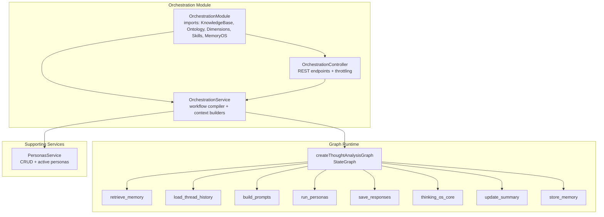
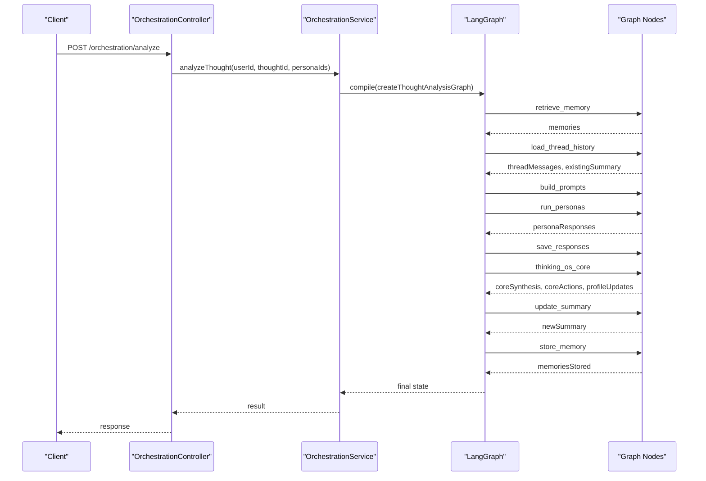
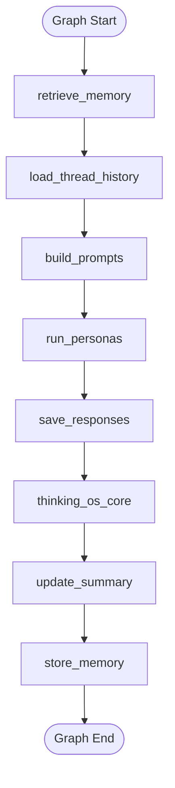
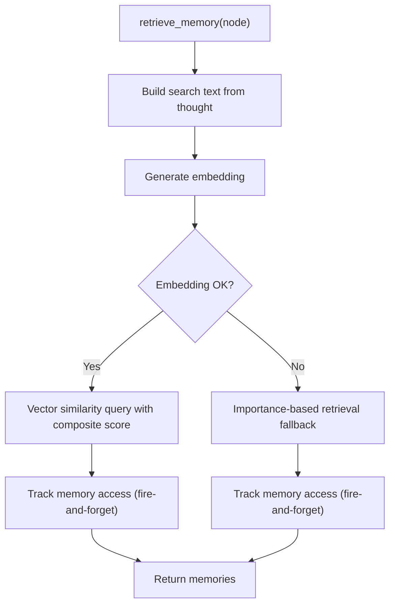
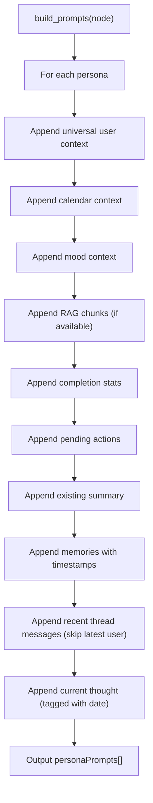
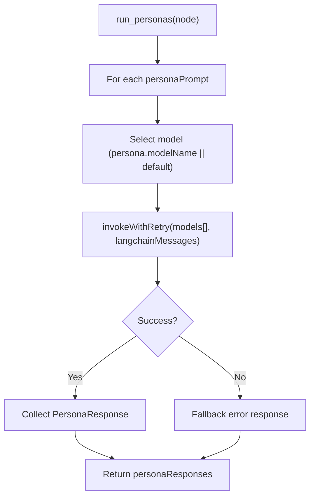
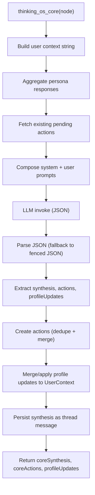
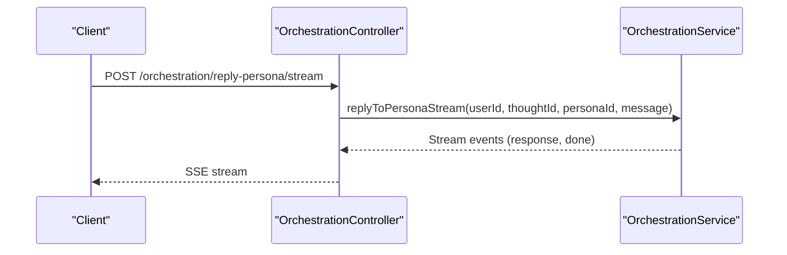
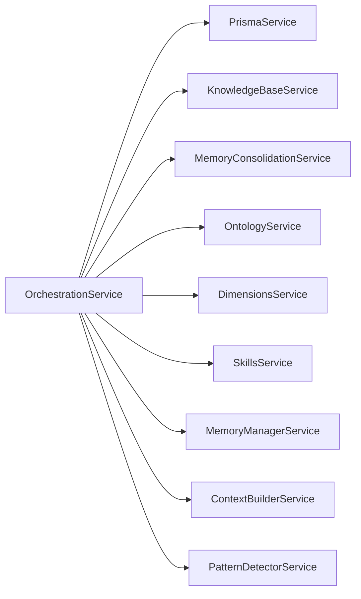

# Persona Orchestration Engine

<cite>
**Referenced Files in This Document**
- [orchestration.module.ts](file://backend/src/orchestration/orchestration.module.ts)
- [orchestration.service.ts](file://backend/src/orchestration/orchestration.service.ts)
- [thought-analysis.graph.ts](file://backend/src/orchestration/graph/thought-analysis.graph.ts)
- [state.ts](file://backend/src/orchestration/graph/state.ts)
- [retrieve-memory.node.ts](file://backend/src/orchestration/graph/nodes/retrieve-memory.node.ts)
- [load-thread-history.node.ts](file://backend/src/orchestration/graph/nodes/load-thread-history.node.ts)
- [build-prompts.node.ts](file://backend/src/orchestration/graph/nodes/build-prompts.node.ts)
- [run-personas.node.ts](file://backend/src/orchestration/graph/nodes/run-personas.node.ts)
- [save-responses.node.ts](file://backend/src/orchestration/graph/nodes/save-responses.node.ts)
- [thinking-os-core.node.ts](file://backend/src/orchestration/graph/nodes/thinking-os-core.node.ts)
- [update-summary.node.ts](file://backend/src/orchestration/graph/nodes/update-summary.node.ts)
- [store-memory.node.ts](file://backend/src/orchestration/graph/nodes/store-memory.node.ts)
- [personas.service.ts](file://backend/src/personas/personas.service.ts)
- [orchestration.controller.ts](file://backend/src/orchestration/orchestration.controller.ts)
</cite>

## Table of Contents
1. [Introduction](#introduction)
2. [Project Structure](#project-structure)
3. [Core Components](#core-components)
4. [Architecture Overview](#architecture-overview)
5. [Detailed Component Analysis](#detailed-component-analysis)
6. [Dependency Analysis](#dependency-analysis)
7. [Performance Considerations](#performance-considerations)
8. [Troubleshooting Guide](#troubleshooting-guide)
9. [Conclusion](#conclusion)

## Introduction
The Persona Orchestration Engine coordinates multiple AI personalities (personas) to analyze thoughts, manage conversations, and consolidate insights into durable memory. It implements an agent-based architecture powered by a LangGraph workflow that orchestrates persona reasoning, synthesis, and memory management. The system integrates with knowledge bases, user context, planner data, and relationship insights to deliver personalized, multi-perspective guidance while maintaining conversation continuity and long-term memory growth.

## Project Structure
The orchestration module is organized around a LangGraph-based workflow with specialized nodes for memory retrieval, thread loading, prompt building, persona inference, response persistence, synthesis, summary updates, and memory storage. Supporting services provide persona lifecycle management, controller endpoints for streaming and batch interactions, and memory consolidation.

**Diagram sources**
- [orchestration.module.ts:11-17](file://backend/src/orchestration/orchestration.module.ts#L11-L17)
- [thought-analysis.graph.ts:29-67](file://backend/src/orchestration/graph/thought-analysis.graph.ts#L29-L67)
- [orchestration.controller.ts:17-24](file://backend/src/orchestration/orchestration.controller.ts#L17-L24)

**Section sources**
- [orchestration.module.ts:1-18](file://backend/src/orchestration/orchestration.module.ts#L1-L18)
- [orchestration.controller.ts:17-369](file://backend/src/orchestration/orchestration.controller.ts#L17-L369)

## Core Components
- OrchestrationService: Compiles the LangGraph on startup, builds contextual prompts for personas, manages Core Chat synthesis, and coordinates memory consolidation.
- Thought Analysis Graph: A linear StateGraph pipeline that retrieves memories, loads thread history, constructs persona prompts, executes personas, saves responses, synthesizes insights, updates summaries, and stores new memories.
- Persona Management: PersonasService handles creation, activation, updates, and deletion of user-defined personas, exposing both personal and template personas.
- Controller Endpoints: Provide batch and streaming APIs for persona replies, Core Chat, voice transcription/synthesis, and memory management.

**Section sources**
- [orchestration.service.ts:24-77](file://backend/src/orchestration/orchestration.service.ts#L24-L77)
- [thought-analysis.graph.ts:15-67](file://backend/src/orchestration/graph/thought-analysis.graph.ts#L15-L67)
- [personas.service.ts:6-105](file://backend/src/personas/personas.service.ts#L6-L105)
- [orchestration.controller.ts:26-369](file://backend/src/orchestration/orchestration.controller.ts#L26-L369)

## Architecture Overview
The engine follows an agent-based design:
- Input thought and selected personas drive a deterministic graph traversal.
- Each persona receives a tailored prompt enriched with user context, memory, planner, mood, and relationship data.
- After persona responses are persisted, a Core synthesis agent curates actions, synthesizes agreement/disagreement, and updates user profile.
- Long-term memory is extracted and stored, while a running thread summary reduces future prompt sizes.

**Diagram sources**
- [orchestration.controller.ts:26-39](file://backend/src/orchestration/orchestration.controller.ts#L26-L39)
- [orchestration.service.ts:49-77](file://backend/src/orchestration/orchestration.service.ts#L49-L77)
- [thought-analysis.graph.ts:29-67](file://backend/src/orchestration/graph/thought-analysis.graph.ts#L29-L67)

## Detailed Component Analysis

### Thought Analysis Graph and State Management
The graph defines a linear pipeline with explicit state annotations for inputs, intermediates, and outputs. State fields include user context, persona prompts/responses, thread messages, summaries, and memory operations.

**Diagram sources**
- [thought-analysis.graph.ts:45-64](file://backend/src/orchestration/graph/thought-analysis.graph.ts#L45-L64)
- [state.ts:88-174](file://backend/src/orchestration/graph/state.ts#L88-L174)

**Section sources**
- [thought-analysis.graph.ts:15-67](file://backend/src/orchestration/graph/thought-analysis.graph.ts#L15-L67)
- [state.ts:1-177](file://backend/src/orchestration/graph/state.ts#L1-L177)

### Memory Retrieval Node
Retrieves relevant long-term memories using semantic vector similarity with a composite scoring formula, falling back to importance-based retrieval if embeddings fail. Access counts are tracked asynchronously.

**Diagram sources**
- [retrieve-memory.node.ts:11-71](file://backend/src/orchestration/graph/nodes/retrieve-memory.node.ts#L11-L71)

**Section sources**
- [retrieve-memory.node.ts:1-72](file://backend/src/orchestration/graph/nodes/retrieve-memory.node.ts#L1-L72)

### Thread History Loader
Loads all messages for continuity and fetches an existing thread summary to reduce prompt size.

**Section sources**
- [load-thread-history.node.ts:1-28](file://backend/src/orchestration/graph/nodes/load-thread-history.node.ts#L1-L28)

### Prompt Builder
Constructs persona-specific prompts by combining:
- Universal user context (name, role, goals, values, etc.)
- Calendar and planner context
- Mood and energy context
- Knowledge base chunks (RAG)
- Task completion patterns
- Pending actions
- Existing thread summary
- Relevant memories with timestamps
- Recent thread messages (excluding the latest user message)
- Current thought as the final user message with date tagging

**Diagram sources**
- [build-prompts.node.ts:72-174](file://backend/src/orchestration/graph/nodes/build-prompts.node.ts#L72-L174)

**Section sources**
- [build-prompts.node.ts:1-175](file://backend/src/orchestration/graph/nodes/build-prompts.node.ts#L1-L175)

### Persona Execution and Retry Logic
Each persona prompt is executed against its configured model or a default model. Retry logic attempts multiple models with exponential backoff for rate-limit and server errors.

**Diagram sources**
- [run-personas.node.ts:80-124](file://backend/src/orchestration/graph/nodes/run-personas.node.ts#L80-L124)

**Section sources**
- [run-personas.node.ts:1-125](file://backend/src/orchestration/graph/nodes/run-personas.node.ts#L1-L125)

### Response Persistence
Persists persona runs and messages to the database, enabling history retrieval and synthesis.

**Section sources**
- [save-responses.node.ts:1-41](file://backend/src/orchestration/graph/nodes/save-responses.node.ts#L1-L41)

### Core Synthesis Agent
After responses are saved, the Core agent:
- Curates overlapping suggestions into 2–5 distinct actions
- Produces a concise synthesis highlighting agreement, disagreement, and key takeaway
- Updates user profile fields when new information is revealed

**Diagram sources**
- [thinking-os-core.node.ts:22-247](file://backend/src/orchestration/graph/nodes/thinking-os-core.node.ts#L22-L247)

**Section sources**
- [thinking-os-core.node.ts:1-248](file://backend/src/orchestration/graph/nodes/thinking-os-core.node.ts#L1-L248)

### Summary Update
Generates a concise running summary of the thread to reduce future prompt sizes and improve efficiency.

**Section sources**
- [update-summary.node.ts:1-93](file://backend/src/orchestration/graph/nodes/update-summary.node.ts#L1-L93)

### Memory Consolidation
Extracts 1–3 key facts from the conversation and stores them as durable memories with deduplication and importance weighting.

**Section sources**
- [store-memory.node.ts:1-111](file://backend/src/orchestration/graph/nodes/store-memory.node.ts#L1-L111)

### Persona Lifecycle Management
PersonasService supports:
- Creating user-defined personas with system prompts and model preferences
- Listing active personas (user’s own + templates)
- Updating and soft-deleting personas (templates cannot be modified)

**Section sources**
- [personas.service.ts:6-105](file://backend/src/personas/personas.service.ts#L6-L105)

### Conversation Flow Management
The controller exposes endpoints for:
- Batch thought analysis with multiple personas
- Single persona replies (streaming and non-streaming)
- Quick chat and Core Chat (streaming and non-streaming)
- Voice transcription and speech synthesis
- Persona-direct chat with history and clearing
- Memory listing, search, stats, creation, updates, and deletion
- Memory consolidation and session summaries

**Diagram sources**
- [orchestration.controller.ts:58-94](file://backend/src/orchestration/orchestration.controller.ts#L58-L94)

**Section sources**
- [orchestration.controller.ts:26-369](file://backend/src/orchestration/orchestration.controller.ts#L26-L369)

## Dependency Analysis
The orchestration module composes multiple domain services and the LangGraph runtime. Dependencies include:
- PrismaService for persistence
- KnowledgeBaseService for RAG
- MemoryConsolidationService for memory lifecycle
- OntologyService, DimensionsService, SkillsService for enriched context
- Memory Manager and Context Builder for advanced memory orchestration

**Diagram sources**
- [orchestration.service.ts:33-44](file://backend/src/orchestration/orchestration.service.ts#L33-L44)
- [orchestration.module.ts:11-16](file://backend/src/orchestration/orchestration.module.ts#L11-L16)

**Section sources**
- [orchestration.module.ts:1-18](file://backend/src/orchestration/orchestration.module.ts#L1-L18)
- [orchestration.service.ts:1-44](file://backend/src/orchestration/orchestration.service.ts#L1-L44)

## Performance Considerations
- Streaming endpoints use Server-Sent Events to progressively deliver persona responses and Core synthesis, reducing perceived latency.
- Retry and fallback logic for LLM calls improves reliability under rate limits and transient failures.
- Semantic memory retrieval uses vector similarity with composite scoring; importance-based fallback ensures robustness.
- Running summaries and persisted persona runs enable efficient context reuse across sessions.
- Throttling guards protect resource consumption at both IP and user levels.

[No sources needed since this section provides general guidance]

## Troubleshooting Guide
Common issues and mitigations:
- Missing or invalid OpenRouter API key: The service logs warnings during initialization and persona inference will fail without a valid key.
- Rate limiting and server errors: invokeWithRetry implements exponential backoff across multiple models to mitigate transient failures.
- Memory retrieval failures: Vector similarity queries fall back to importance-based retrieval; access counts are tracked regardless.
- Core synthesis parsing errors: The Core node extracts JSON from fenced content if needed; otherwise returns empty outputs gracefully.
- Persona editing restrictions: Template personas cannot be edited or deleted; users must create their own copies.

**Section sources**
- [orchestration.service.ts:49-77](file://backend/src/orchestration/orchestration.service.ts#L49-L77)
- [run-personas.node.ts:25-72](file://backend/src/orchestration/graph/nodes/run-personas.node.ts#L25-L72)
- [retrieve-memory.node.ts:51-53](file://backend/src/orchestration/graph/nodes/retrieve-memory.node.ts#L51-L53)
- [thinking-os-core.node.ts:126-138](file://backend/src/orchestration/graph/nodes/thinking-os-core.node.ts#L126-L138)
- [personas.service.ts:70-96](file://backend/src/personas/personas.service.ts#L70-L96)

## Conclusion
The Persona Orchestration Engine delivers a scalable, multi-agent system for thought analysis and conversation synthesis. Its LangGraph-based workflow ensures predictable, extensible processing of persona interactions, while integrated memory and context systems foster continuous learning and personalized guidance. The modular design, robust error handling, and streaming capabilities provide a solid foundation for evolving AI-driven introspection and decision-making experiences.