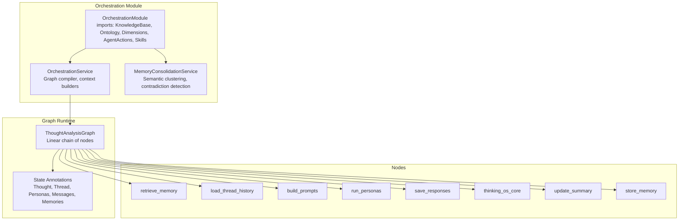
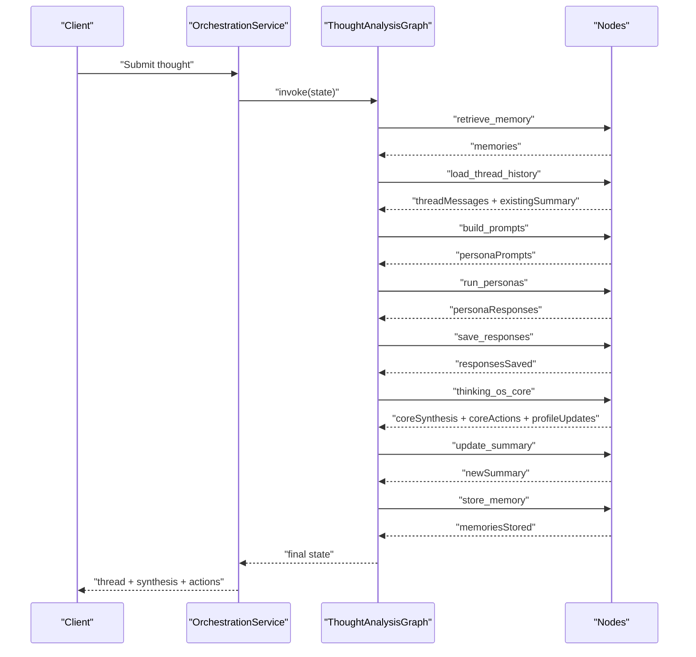
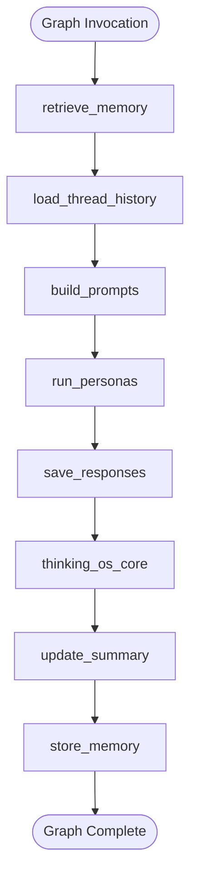
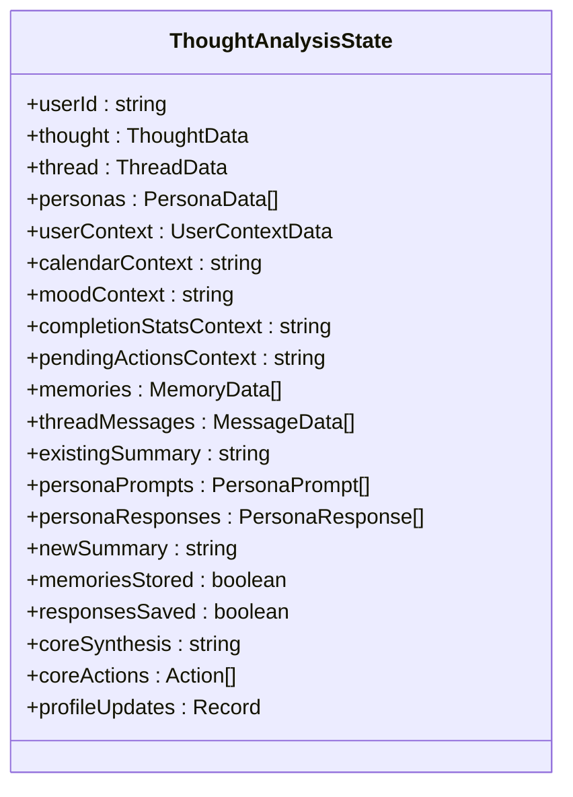
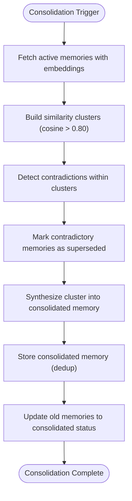
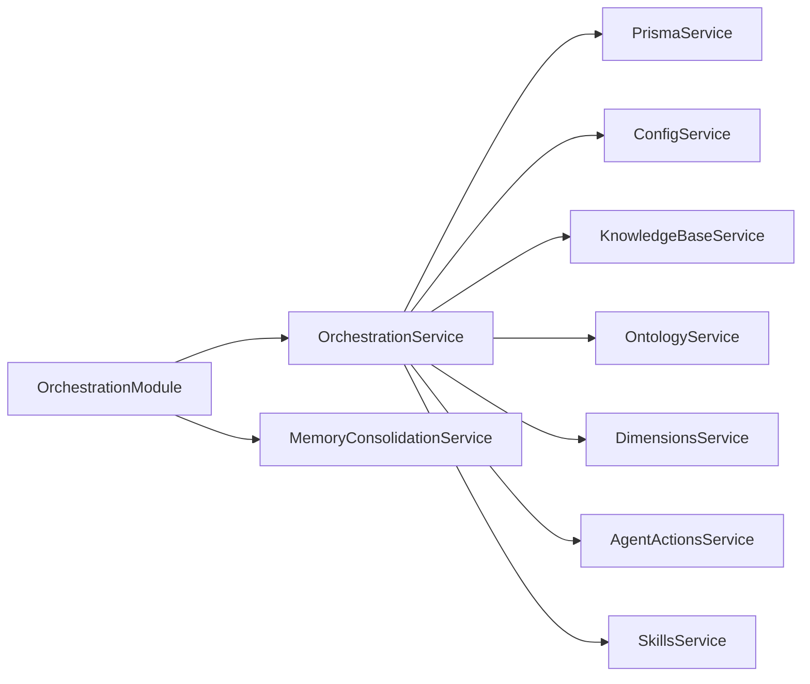

# Persona Orchestration Engine

<cite>
**Referenced Files in This Document**
- [orchestration.module.ts](file://backend/src/orchestration/orchestration.module.ts)
- [orchestration.service.ts](file://backend/src/orchestration/orchestration.service.ts)
- [thought-analysis.graph.ts](file://backend/src/orchestration/graph/thought-analysis.graph.ts)
- [state.ts](file://backend/src/orchestration/graph/state.ts)
- [retrieve-memory.node.ts](file://backend/src/orchestration/graph/nodes/retrieve-memory.node.ts)
- [load-thread-history.node.ts](file://backend/src/orchestration/graph/nodes/load-thread-history.node.ts)
- [build-prompts.node.ts](file://backend/src/orchestration/graph/nodes/build-prompts.node.ts)
- [run-personas.node.ts](file://backend/src/orchestration/graph/nodes/run-personas.node.ts)
- [save-responses.node.ts](file://backend/src/orchestration/graph/nodes/save-responses.node.ts)
- [thinking-os-core.node.ts](file://backend/src/orchestration/graph/nodes/thinking-os-core.node.ts)
- [update-summary.node.ts](file://backend/src/orchestration/graph/nodes/update-summary.node.ts)
- [store-memory.node.ts](file://backend/src/orchestration/graph/nodes/store-memory.node.ts)
- [memory-consolidation.service.ts](file://backend/src/orchestration/memory-consolidation.service.ts)
</cite>

## Table of Contents
1. [Introduction](#introduction)
2. [Project Structure](#project-structure)
3. [Core Components](#core-components)
4. [Architecture Overview](#architecture-overview)
5. [Detailed Component Analysis](#detailed-component-analysis)
6. [Dependency Analysis](#dependency-analysis)
7. [Performance Considerations](#performance-considerations)
8. [Troubleshooting Guide](#troubleshooting-guide)
9. [Conclusion](#conclusion)

## Introduction
This document describes the persona orchestration engine that coordinates multiple AI personalities to analyze thoughts and facilitate conversations. The system uses a LangGraph-based orchestration pipeline to manage persona selection, conversation flow, state transitions, and memory consolidation. It integrates with the thoughts system to maintain coherent, evolving insights while enabling flexible persona customization and conversation history management.

## Project Structure
The orchestration engine resides in the backend under the orchestration module. It composes a thought analysis graph from modular nodes, manages state, and coordinates with services for memory, knowledge base, and user context.

**Diagram sources**
- [orchestration.module.ts:11-17](file://backend/src/orchestration/orchestration.module.ts#L11-L17)
- [thought-analysis.graph.ts:29-67](file://backend/src/orchestration/graph/thought-analysis.graph.ts#L29-L67)
- [state.ts:88-174](file://backend/src/orchestration/graph/state.ts#L88-L174)

**Section sources**
- [orchestration.module.ts:1-18](file://backend/src/orchestration/orchestration.module.ts#L1-L18)
- [orchestration.service.ts:24-74](file://backend/src/orchestration/orchestration.service.ts#L24-L74)

## Core Components
- OrchestrationService: Compiles the LangGraph on startup, builds contextual prompts for personas and Core Chat, orchestrates graph execution, and manages persona context injection.
- Thought Analysis Graph: A linear pipeline of nodes that retrieves memories, loads thread history, builds persona prompts, executes personas, saves responses, synthesizes a Core summary, and consolidates memories.
- State Management: Strongly typed annotations define inputs, intermediate, and outputs flowing through the graph.
- Memory Consolidation Service: Periodically clusters and merges semantically similar memories, detects contradictions, and maintains a coherent long-term memory base.

**Section sources**
- [orchestration.service.ts:24-74](file://backend/src/orchestration/orchestration.service.ts#L24-L74)
- [thought-analysis.graph.ts:15-67](file://backend/src/orchestration/graph/thought-analysis.graph.ts#L15-L67)
- [state.ts:88-174](file://backend/src/orchestration/graph/state.ts#L88-L174)
- [memory-consolidation.service.ts:15-27](file://backend/src/orchestration/memory-consolidation.service.ts#L15-L27)

## Architecture Overview
The engine follows an agent-based architecture:
- Graph-driven orchestration: Nodes encapsulate discrete steps (memory retrieval, prompt building, persona execution, synthesis, memory storage).
- Persona coordination: Multiple personas operate independently, each with customizable system prompts and models, producing diverse perspectives.
- Core synthesis: A meta-agent aggregates persona outputs, curates actions, and updates user context.
- Memory lifecycle: Long-term memories are extracted, stored, and periodically consolidated to prevent bloat and resolve contradictions.

**Diagram sources**
- [thought-analysis.graph.ts:29-67](file://backend/src/orchestration/graph/thought-analysis.graph.ts#L29-L67)
- [retrieve-memory.node.ts:15-70](file://backend/src/orchestration/graph/nodes/retrieve-memory.node.ts#L15-L70)
- [load-thread-history.node.ts:9-26](file://backend/src/orchestration/graph/nodes/load-thread-history.node.ts#L9-L26)
- [build-prompts.node.ts:72-174](file://backend/src/orchestration/graph/nodes/build-prompts.node.ts#L72-L174)
- [run-personas.node.ts:80-124](file://backend/src/orchestration/graph/nodes/run-personas.node.ts#L80-L124)
- [save-responses.node.ts:12-40](file://backend/src/orchestration/graph/nodes/save-responses.node.ts#L12-L40)
- [thinking-os-core.node.ts:22-247](file://backend/src/orchestration/graph/nodes/thinking-os-core.node.ts#L22-L247)
- [update-summary.node.ts:10-92](file://backend/src/orchestration/graph/nodes/update-summary.node.ts#L10-L92)
- [store-memory.node.ts:14-110](file://backend/src/orchestration/graph/nodes/store-memory.node.ts#L14-L110)

## Detailed Component Analysis

### Thought Analysis Graph
The graph defines a fixed linear pipeline:
- retrieve_memory: Semantic vector search for relevant memories with fallback importance-based retrieval.
- load_thread_history: Loads prior messages and existing thread summary.
- build_prompts: Assembles persona-specific prompts with user context, calendars, mood, completion stats, pending actions, memory, and recent thread history.
- run_personas: Executes each persona with retry logic and fallback models.
- save_responses: Persists persona runs and messages.
- thinking_os_core: Aggregates persona responses, curates actions, synthesizes insights, and updates user context.
- update_summary: Generates a concise running summary of the thread.
- store_memory: Extracts and stores new long-term memories.

**Diagram sources**
- [thought-analysis.graph.ts:46-64](file://backend/src/orchestration/graph/thought-analysis.graph.ts#L46-L64)

**Section sources**
- [thought-analysis.graph.ts:15-67](file://backend/src/orchestration/graph/thought-analysis.graph.ts#L15-L67)

### State Management
The state defines typed annotations for:
- Inputs: userId, thought, thread, personas, userContext, calendarContext, moodContext, completionStatsContext, pendingActionsContext.
- Intermediates: memories, threadMessages, existingSummary, personaPrompts, personaResponses, newSummary, memoriesStored, responsesSaved.
- Outputs: coreSynthesis, coreActions, profileUpdates.

**Diagram sources**
- [state.ts:88-174](file://backend/src/orchestration/graph/state.ts#L88-L174)

**Section sources**
- [state.ts:64-174](file://backend/src/orchestration/graph/state.ts#L64-L174)

### Persona Selection Criteria
- Personas are loaded per user and include both personal personas and shared template personas.
- Each persona has a system prompt and optional model override.
- The graph iterates over selected personas, constructing tailored prompts and invoking LLMs with robust retry and fallback logic.

**Section sources**
- [orchestration.service.ts:770-779](file://backend/src/orchestration/orchestration.service.ts#L770-L779)
- [build-prompts.node.ts:72-174](file://backend/src/orchestration/graph/nodes/build-prompts.node.ts#L72-L174)
- [run-personas.node.ts:80-124](file://backend/src/orchestration/graph/nodes/run-personas.node.ts#L80-L124)

### Conversation Flow Management
- Thread continuity: The loader node fetches prior messages and existing summary to minimize prompt size and maintain coherence.
- Prompt construction: The builder node assembles persona prompts with layered context (user profile, schedule, mood, completion patterns, pending actions, memory, thread history, and the current thought).
- Response persistence: The saver node records persona runs and assistant messages; the Core node adds a synthesis message.
- Summary maintenance: The updater node creates or updates a running summary after each cycle.

**Section sources**
- [load-thread-history.node.ts:9-26](file://backend/src/orchestration/graph/nodes/load-thread-history.node.ts#L9-L26)
- [build-prompts.node.ts:72-174](file://backend/src/orchestration/graph/nodes/build-prompts.node.ts#L72-L174)
- [save-responses.node.ts:12-40](file://backend/src/orchestration/graph/nodes/save-responses.node.ts#L12-L40)
- [thinking-os-core.node.ts:22-247](file://backend/src/orchestration/graph/nodes/thinking-os-core.node.ts#L22-L247)
- [update-summary.node.ts:10-92](file://backend/src/orchestration/graph/nodes/update-summary.node.ts#L10-L92)

### Core Chat Agent Functionality
- The service constructs a broader context for Core Chat, including user profile, memories, planner stats, relationships, events, connections, messages, shared notes, session summaries, and available personas.
- Context classification scopes planner, life review, memory recall, and messaging domains to optimize relevance.
- The Core Chat context is injected into the system prompt for unified reasoning.

**Section sources**
- [orchestration.service.ts:660-764](file://backend/src/orchestration/orchestration.service.ts#L660-L764)

### Persona Customization Options
- Each persona includes a system prompt and optional model override.
- Knowledge base RAG chunks can be injected into persona prompts for domain-specific guidance.
- Calendar, mood, completion patterns, and pending actions are dynamically appended to persona prompts.

**Section sources**
- [build-prompts.node.ts:72-117](file://backend/src/orchestration/graph/nodes/build-prompts.node.ts#L72-L117)
- [state.ts:21-28](file://backend/src/orchestration/graph/state.ts#L21-L28)

### Conversation History Management
- Messages are persisted per thread with timestamps and persona attribution.
- A running summary is maintained and reused to reduce context size.
- The loader node ensures continuity by including recent messages and the existing summary.

**Section sources**
- [save-responses.node.ts:12-40](file://backend/src/orchestration/graph/nodes/save-responses.node.ts#L12-L40)
- [update-summary.node.ts:10-92](file://backend/src/orchestration/graph/nodes/update-summary.node.ts#L10-L92)
- [load-thread-history.node.ts:9-26](file://backend/src/orchestration/graph/nodes/load-thread-history.node.ts#L9-L26)

### Memory Consolidation Workflows
- Semantic clustering identifies similar memories using cosine similarity.
- Contradictions are detected and resolved by marking older memories as superseded.
- High-quality clusters are synthesized into consolidated memories with preserved importance and memory type.

**Diagram sources**
- [memory-consolidation.service.ts:29-127](file://backend/src/orchestration/memory-consolidation.service.ts#L29-L127)

**Section sources**
- [memory-consolidation.service.ts:15-305](file://backend/src/orchestration/memory-consolidation.service.ts#L15-L305)

### Persona Switching Mechanisms
- The graph iterates through the provided personas list, generating persona-specific prompts and executing them sequentially.
- Each persona’s model override is respected; otherwise, the default model is used.
- Retry logic and fallback models ensure robust execution across persona invocations.

**Section sources**
- [run-personas.node.ts:80-124](file://backend/src/orchestration/graph/nodes/run-personas.node.ts#L80-L124)
- [state.ts:93-93](file://backend/src/orchestration/graph/state.ts#L93-L93)

### Examples of Persona Interactions and Conversation Threads
- Persona interactions: Each persona responds independently to the same thought, producing distinct perspectives captured in personaPrompts and personaResponses.
- Conversation threads: Messages are stored with roles and timestamps; a running summary is maintained to guide subsequent iterations.
- AI personality behaviors: Personality-specific system prompts and optional RAG knowledge influence tone, depth, and domain expertise.

**Section sources**
- [build-prompts.node.ts:72-174](file://backend/src/orchestration/graph/nodes/build-prompts.node.ts#L72-L174)
- [run-personas.node.ts:80-124](file://backend/src/orchestration/graph/nodes/run-personas.node.ts#L80-L124)
- [save-responses.node.ts:12-40](file://backend/src/orchestration/graph/nodes/save-responses.node.ts#L12-L40)
- [update-summary.node.ts:10-92](file://backend/src/orchestration/graph/nodes/update-summary.node.ts#L10-L92)

## Dependency Analysis
The orchestration module imports supporting modules and exposes services for orchestration and memory consolidation. The OrchestrationService depends on Prisma, configuration, knowledge base, memory consolidation, ontology, dimensions, agent actions, and skills.

**Diagram sources**
- [orchestration.module.ts:11-17](file://backend/src/orchestration/orchestration.module.ts#L11-L17)
- [orchestration.service.ts:32-41](file://backend/src/orchestration/orchestration.service.ts#L32-L41)

**Section sources**
- [orchestration.module.ts:11-17](file://backend/src/orchestration/orchestration.module.ts#L11-L17)
- [orchestration.service.ts:32-41](file://backend/src/orchestration/orchestration.service.ts#L32-L41)

## Performance Considerations
- Embedding-based memory retrieval uses composite scoring (similarity, importance, access frequency, recency) with a fallback to importance-based retrieval.
- Persona execution employs exponential backoff retries and fallback models to mitigate rate limits and server errors.
- Summary generation and memory extraction use conservative token limits to balance quality and cost.
- Memory consolidation runs periodically to prevent prompt bloat and maintain coherence.

[No sources needed since this section provides general guidance]

## Troubleshooting Guide
- API keys: Missing or invalid OpenRouter API key prevents persona responses; warnings are logged during initialization.
- Rate limits and server errors: The run_personas node implements retry with exponential backoff and fallback models.
- Memory retrieval failures: Semantic search falls back to importance-based retrieval; access counts are tracked for analytics.
- Summary and memory extraction failures: Graceful fallbacks create minimal summaries and basic memories.

**Section sources**
- [orchestration.service.ts:56-61](file://backend/src/orchestration/orchestration.service.ts#L56-L61)
- [run-personas.node.ts:25-72](file://backend/src/orchestration/graph/nodes/run-personas.node.ts#L25-L72)
- [retrieve-memory.node.ts:51-70](file://backend/src/orchestration/graph/nodes/retrieve-memory.node.ts#L51-L70)
- [update-summary.node.ts:72-91](file://backend/src/orchestration/graph/nodes/update-summary.node.ts#L72-L91)
- [store-memory.node.ts:94-110](file://backend/src/orchestration/graph/nodes/store-memory.node.ts#L94-L110)

## Conclusion
The persona orchestration engine provides a scalable, modular framework for coordinating multiple AI personalities around thought analysis and conversation. Its graph-based design, robust retry mechanisms, and integrated memory consolidation ensure reliable, coherent, and evolving insights. The system balances flexibility (customizable personas and RAG) with performance (semantic retrieval, summarization, and consolidation) to support deep, iterative reflection.