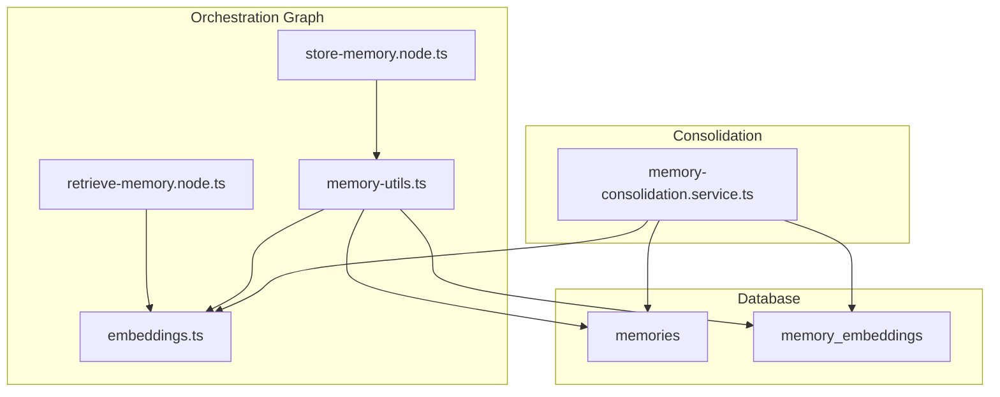
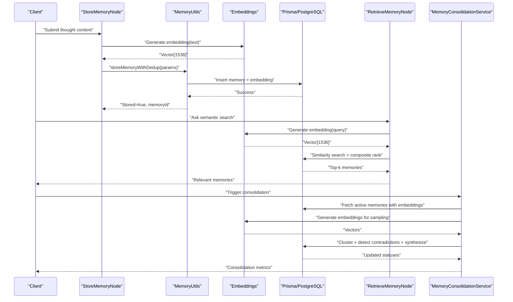
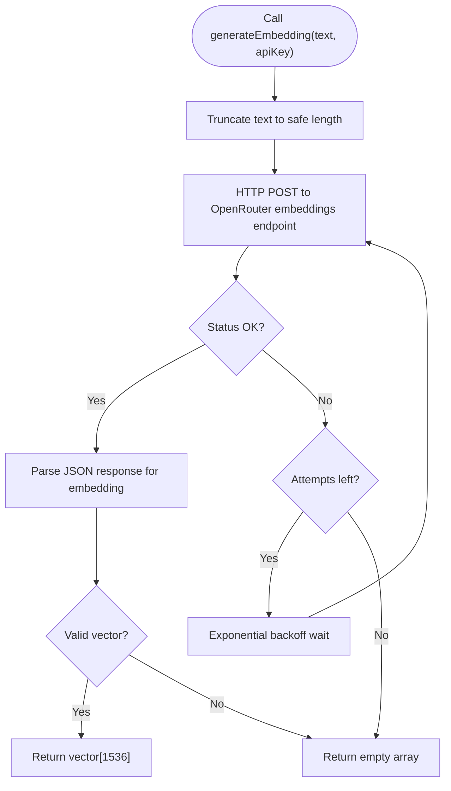
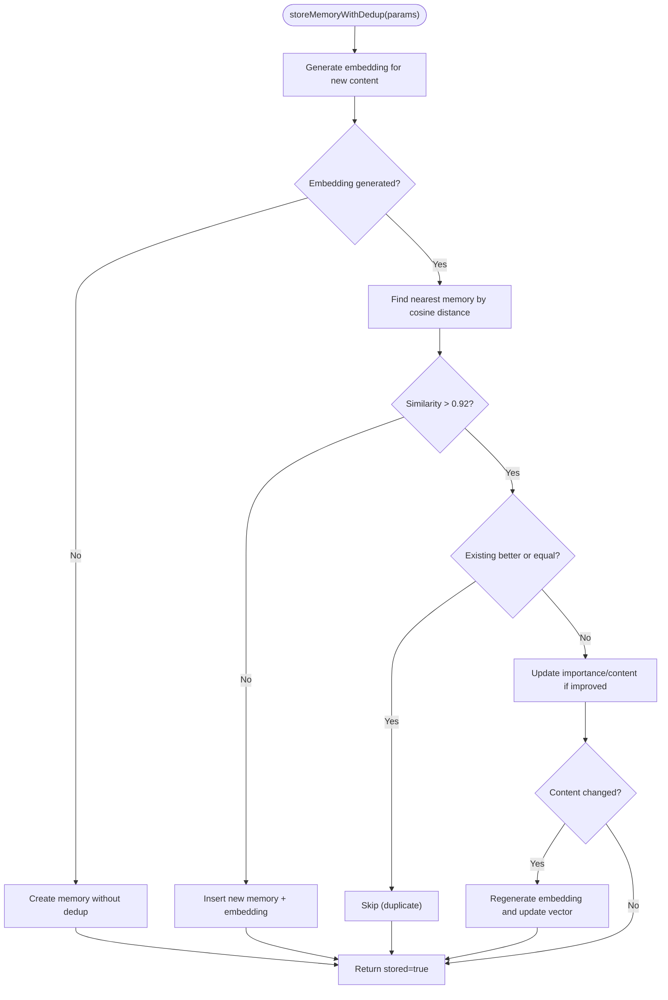
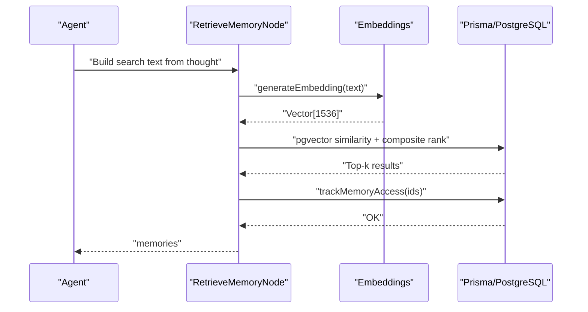
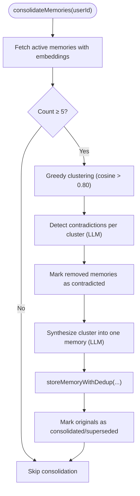
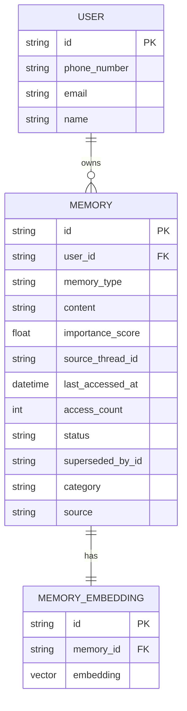
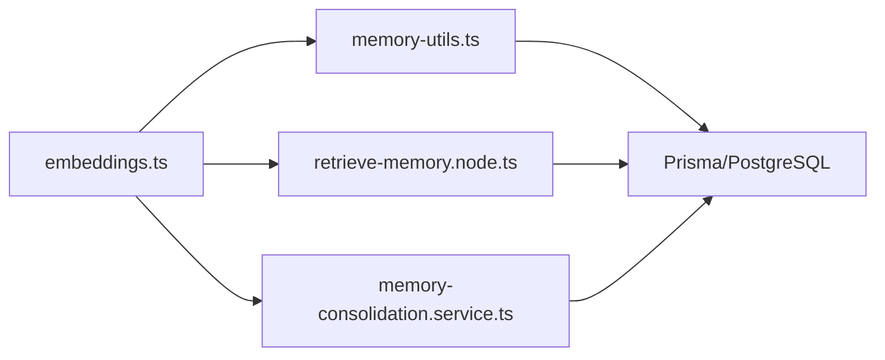

# Semantic Memory System

<cite>
**Referenced Files in This Document**
- [schema.prisma](file://backend/prisma/schema.prisma)
- [20260415143041_semantic_memory_search/migration.sql](file://backend/prisma/migrations/20260415143041_semantic_memory_search/migration.sql)
- [20260425120506_add_memory_lifecycle/migration.sql](file://backend/prisma/migrations/20260425120506_add_memory_lifecycle/migration.sql)
- [embeddings.ts](file://backend/src/orchestration/graph/utils/embeddings.ts)
- [memory-utils.ts](file://backend/src/orchestration/graph/utils/memory-utils.ts)
- [retrieve-memory.node.ts](file://backend/src/orchestration/graph/nodes/retrieve-memory.node.ts)
- [store-memory.node.ts](file://backend/src/orchestration/graph/nodes/store-memory.node.ts)
- [memory-consolidation.service.ts](file://backend/src/orchestration/memory-consolidation.service.ts)
- [state.ts](file://backend/src/orchestration/graph/state.ts)
- [core-chat-tools.ts](file://backend/src/orchestration/graph/tools/core-chat-tools.ts)
</cite>

## Table of Contents
1. [Introduction](#introduction)
2. [Project Structure](#project-structure)
3. [Core Components](#core-components)
4. [Architecture Overview](#architecture-overview)
5. [Detailed Component Analysis](#detailed-component-analysis)
6. [Dependency Analysis](#dependency-analysis)
7. [Performance Considerations](#performance-considerations)
8. [Troubleshooting Guide](#troubleshooting-guide)
9. [Conclusion](#conclusion)
10. [Appendices](#appendices)

## Introduction
This document explains the semantic memory system that powers intelligent recall and search through vector embeddings. It covers embedding generation, similarity search, memory indexing, pgvector integration, consolidation workflows, content chunking, and relevance scoring. It also documents the database schema, indexing strategies, and query optimization techniques used to achieve efficient semantic search and memory lifecycle management.

## Project Structure
The semantic memory system spans:
- Database schema and migrations for memory storage and embeddings
- Orchestration graph nodes for storing and retrieving memories
- Utilities for generating embeddings and deduplicating memories
- A consolidation service for clustering, contradiction detection, and synthesis
- State definitions for orchestrating memory-aware workflows

**Diagram sources**
- [schema.prisma](file://backend/prisma/schema.prisma)
- [embeddings.ts](file://backend/src/orchestration/graph/utils/embeddings.ts)
- [memory-utils.ts](file://backend/src/orchestration/graph/utils/memory-utils.ts)
- [retrieve-memory.node.ts](file://backend/src/orchestration/graph/nodes/retrieve-memory.node.ts)
- [store-memory.node.ts](file://backend/src/orchestration/graph/nodes/store-memory.node.ts)
- [memory-consolidation.service.ts](file://backend/src/orchestration/memory-consolidation.service.ts)

**Section sources**
- [schema.prisma](file://backend/prisma/schema.prisma)
- [20260415143041_semantic_memory_search/migration.sql](file://backend/prisma/migrations/20260415143041_semantic_memory_search/migration.sql)
- [20260425120506_add_memory_lifecycle/migration.sql](file://backend/prisma/migrations/20260425120506_add_memory_lifecycle/migration.sql)
- [embeddings.ts](file://backend/src/orchestration/graph/utils/embeddings.ts)
- [memory-utils.ts](file://backend/src/orchestration/graph/utils/memory-utils.ts)
- [retrieve-memory.node.ts](file://backend/src/orchestration/graph/nodes/retrieve-memory.node.ts)
- [store-memory.node.ts](file://backend/src/orchestration/graph/nodes/store-memory.node.ts)
- [memory-consolidation.service.ts](file://backend/src/orchestration/memory-consolidation.service.ts)
- [state.ts](file://backend/src/orchestration/graph/state.ts)

## Core Components
- Embedding generation: Uses OpenRouter’s text-embedding-3-small model to produce 1536-dimensional vectors with retry/backoff logic.
- Memory storage with deduplication: Creates memories and embeddings, then detects near-duplicates via cosine similarity threshold and merges updates.
- Retrieval with composite ranking: Performs vector similarity search and ranks by similarity, importance, access frequency, and recency.
- Consolidation engine: Clusters similar memories, resolves contradictions, synthesizes clusters, and marks originals as consolidated.
- Schema and indexes: pgvector extension with vector(1536), memory lifecycle fields, and targeted indexes for performance.

**Section sources**
- [embeddings.ts](file://backend/src/orchestration/graph/utils/embeddings.ts)
- [memory-utils.ts](file://backend/src/orchestration/graph/utils/memory-utils.ts)
- [retrieve-memory.node.ts](file://backend/src/orchestration/graph/nodes/retrieve-memory.node.ts)
- [memory-consolidation.service.ts](file://backend/src/orchestration/memory-consolidation.service.ts)
- [schema.prisma](file://backend/prisma/schema.prisma)
- [20260415143041_semantic_memory_search/migration.sql](file://backend/prisma/migrations/20260415143041_semantic_memory_search/migration.sql)
- [20260425120506_add_memory_lifecycle/migration.sql](file://backend/prisma/migrations/20260425120506_add_memory_lifecycle/migration.sql)

## Architecture Overview
The semantic memory pipeline integrates embedding generation, storage, retrieval, and consolidation:

**Diagram sources**
- [store-memory.node.ts](file://backend/src/orchestration/graph/nodes/store-memory.node.ts)
- [memory-utils.ts](file://backend/src/orchestration/graph/utils/memory-utils.ts)
- [embeddings.ts](file://backend/src/orchestration/graph/utils/embeddings.ts)
- [retrieve-memory.node.ts](file://backend/src/orchestration/graph/nodes/retrieve-memory.node.ts)
- [memory-consolidation.service.ts](file://backend/src/orchestration/memory-consolidation.service.ts)

## Detailed Component Analysis

### Embedding Generation
- Model: text-embedding-3-small via OpenRouter
- Dimensions: 1536
- Retry/backoff: Exponential backoff on 429/5xx errors up to 3 attempts
- Input truncation: Limits input length to avoid exceeding provider limits
- Output: Numeric array representing the embedding vector

**Diagram sources**
- [embeddings.ts](file://backend/src/orchestration/graph/utils/embeddings.ts)

**Section sources**
- [embeddings.ts](file://backend/src/orchestration/graph/utils/embeddings.ts)

### Memory Storage and Deduplication
- Dedup threshold: cosine similarity > 0.92
- Composite update policy:
  - If existing memory has higher importance or equal importance with greater content length → skip
  - Else update importance/content and regenerate embedding if content changed
- Insertion: Create memory record, then insert corresponding embedding into memory_embeddings

**Diagram sources**
- [memory-utils.ts](file://backend/src/orchestration/graph/utils/memory-utils.ts)

**Section sources**
- [memory-utils.ts](file://backend/src/orchestration/graph/utils/memory-utils.ts)

### Semantic Retrieval and Ranking
- Query embedding: Generated from combined thought title and raw text
- Similarity: Cosine distance via pgvector operator; similarity = 1 - (u <-> v)
- Composite ranking formula:
  - 0.6 × similarity
  - 0.2 × importance_score
  - 0.1 × min(access_count / 10, 1)
  - 0.1 × max(1 − age_in_days / 30days, 0)
- Fallback: If embedding fails, order by importance_score desc, createdAt desc
- Access tracking: Fire-and-forget increment of access_count and last_accessed_at

**Diagram sources**
- [retrieve-memory.node.ts](file://backend/src/orchestration/graph/nodes/retrieve-memory.node.ts)
- [embeddings.ts](file://backend/src/orchestration/graph/utils/embeddings.ts)

**Section sources**
- [retrieve-memory.node.ts](file://backend/src/orchestration/graph/nodes/retrieve-memory.node.ts)
- [memory-utils.ts](file://backend/src/orchestration/graph/utils/memory-utils.ts)

### Memory Consolidation Workflow
- Trigger: After every 10th active memory, or on demand
- Steps:
  1. Fetch active memories with embeddings
  2. Build clusters using cosine similarity > 0.80 (greedy)
  3. Detect contradictions within clusters using an LLM
  4. Synthesize each qualifying cluster into a single memory
  5. Store synthesized memory with dedup, mark originals as consolidated or contradicted

**Diagram sources**
- [memory-consolidation.service.ts](file://backend/src/orchestration/memory-consolidation.service.ts)
- [memory-utils.ts](file://backend/src/orchestration/graph/utils/memory-utils.ts)

**Section sources**
- [memory-consolidation.service.ts](file://backend/src/orchestration/memory-consolidation.service.ts)

### Content Chunking and Embeddings (Knowledge Worker)
- Document chunks are stored with vector(1536) columns managed via raw SQL in migrations
- Embeddings are generated similarly (text-embedding-3-small) and inserted via raw SQL
- This enables scalable vector search over large documents

**Section sources**
- [schema.prisma](file://backend/prisma/schema.prisma)
- [20260415143041_semantic_memory_search/migration.sql](file://backend/prisma/migrations/20260415143041_semantic_memory_search/migration.sql)

### Database Schema and Indexing Strategies
- Models involved:
  - memories: core memory records with lifecycle fields (status, access_count, last_accessed_at, category, source)
  - memory_embeddings: one-to-one embeddings for memories
- pgvector integration:
  - Extension enabled
  - Column type: vector(1536)
- Lifecycle and search-related indexes:
  - memories(user_id, status)
  - Additional indexes for performance on related tables

**Diagram sources**
- [schema.prisma](file://backend/prisma/schema.prisma)
- [20260425120506_add_memory_lifecycle/migration.sql](file://backend/prisma/migrations/20260425120506_add_memory_lifecycle/migration.sql)

**Section sources**
- [schema.prisma](file://backend/prisma/schema.prisma)
- [20260415143041_semantic_memory_search/migration.sql](file://backend/prisma/migrations/20260415143041_semantic_memory_search/migration.sql)
- [20260425120506_add_memory_lifecycle/migration.sql](file://backend/prisma/migrations/20260425120506_add_memory_lifecycle/migration.sql)

## Dependency Analysis
- Embedding generation depends on OpenRouter API and network reliability; retry/backoff mitigates transient failures.
- Memory storage depends on embedding availability; if unavailable, insertion proceeds without vector.
- Retrieval depends on pgvector similarity and composite ranking; fallback ensures usability when embeddings fail.
- Consolidation depends on embeddings for clustering and LLMs for contradiction detection and synthesis.

**Diagram sources**
- [embeddings.ts](file://backend/src/orchestration/graph/utils/embeddings.ts)
- [memory-utils.ts](file://backend/src/orchestration/graph/utils/memory-utils.ts)
- [retrieve-memory.node.ts](file://backend/src/orchestration/graph/nodes/retrieve-memory.node.ts)
- [memory-consolidation.service.ts](file://backend/src/orchestration/memory-consolidation.service.ts)

**Section sources**
- [embeddings.ts](file://backend/src/orchestration/graph/utils/embeddings.ts)
- [memory-utils.ts](file://backend/src/orchestration/graph/utils/memory-utils.ts)
- [retrieve-memory.node.ts](file://backend/src/orchestration/graph/nodes/retrieve-memory.node.ts)
- [memory-consolidation.service.ts](file://backend/src/orchestration/memory-consolidation.service.ts)

## Performance Considerations
- Vector dimension: 1536 provides strong semantic fidelity with acceptable compute cost.
- Indexing: memories(user_id, status) supports fast filtering of active memories; consider adding vector index hints if supported by your Postgres/pgvector version.
- Query optimization:
  - Limit similarity search results (e.g., top 10–20) to reduce downstream processing.
  - Composite ranking weights can be tuned to emphasize recency or importance depending on use case.
- Embedding caching: Reuse embeddings for repeated queries where feasible.
- Batch operations: Consolidation batches LLM calls and DB writes; ensure rate limits are respected.

[No sources needed since this section provides general guidance]

## Troubleshooting Guide
- Embedding generation failures:
  - Symptoms: Empty vectors returned, retries exhausted.
  - Actions: Verify OPENROUTER_API_KEY, check network connectivity, confirm model availability.
- Retrieval fallback:
  - Symptom: Embedding failure leads to importance-based ordering.
  - Behavior: Expected fallback; ensure logs capture warnings.
- Deduplication not merging:
  - Cause: Similarity below 0.92 or importance/content thresholds not met.
  - Action: Adjust thresholds or improve content specificity.
- Consolidation not triggering:
  - Cause: Fewer than 5 active memories or modulo trigger not met.
  - Action: Manually invoke consolidation or lower thresholds.

**Section sources**
- [embeddings.ts](file://backend/src/orchestration/graph/utils/embeddings.ts)
- [retrieve-memory.node.ts](file://backend/src/orchestration/graph/nodes/retrieve-memory.node.ts)
- [memory-utils.ts](file://backend/src/orchestration/graph/utils/memory-utils.ts)
- [memory-consolidation.service.ts](file://backend/src/orchestration/memory-consolidation.service.ts)

## Conclusion
The semantic memory system combines robust embedding generation, pgvector-powered similarity search, and lifecycle-aware storage to enable intelligent recall. The consolidation engine prevents memory bloat and maintains coherence by clustering similar memories, detecting contradictions, and synthesizing concise summaries. With composite ranking and targeted indexes, the system balances relevance, recency, and importance for practical user experiences.

[No sources needed since this section summarizes without analyzing specific files]

## Appendices

### Example Workflows and Patterns
- Semantic search query pattern:
  - Combine thought title and raw text, truncate to safe length, generate embedding, run pgvector similarity with composite ranking, optionally track access.
- Memory retrieval patterns:
  - Primary: vector similarity + composite rank; Fallback: importance + recency.
- Embedding management:
  - Generate on creation/update; regenerate when content improves; store in memory_embeddings with vector(1536).

**Section sources**
- [retrieve-memory.node.ts](file://backend/src/orchestration/graph/nodes/retrieve-memory.node.ts)
- [memory-utils.ts](file://backend/src/orchestration/graph/utils/memory-utils.ts)
- [embeddings.ts](file://backend/src/orchestration/graph/utils/embeddings.ts)

### Additional Semantic Search Integration Point
- Core chat tools also implement vector similarity search with composite ranking and configurable result limits.

**Section sources**
- [core-chat-tools.ts](file://backend/src/orchestration/graph/tools/core-chat-tools.ts)