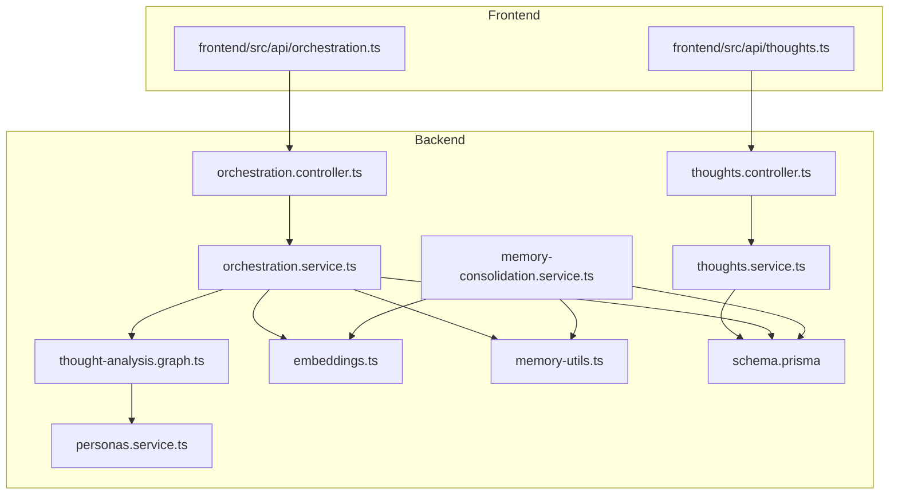
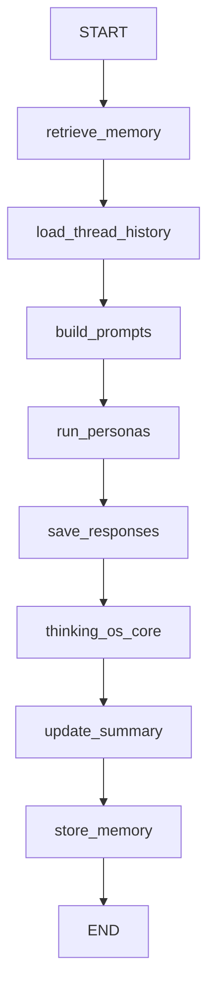
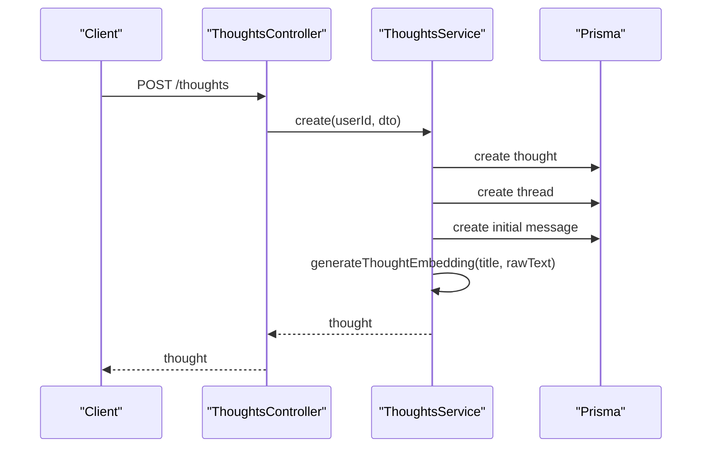
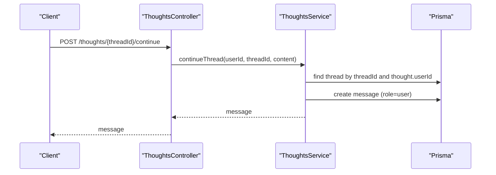
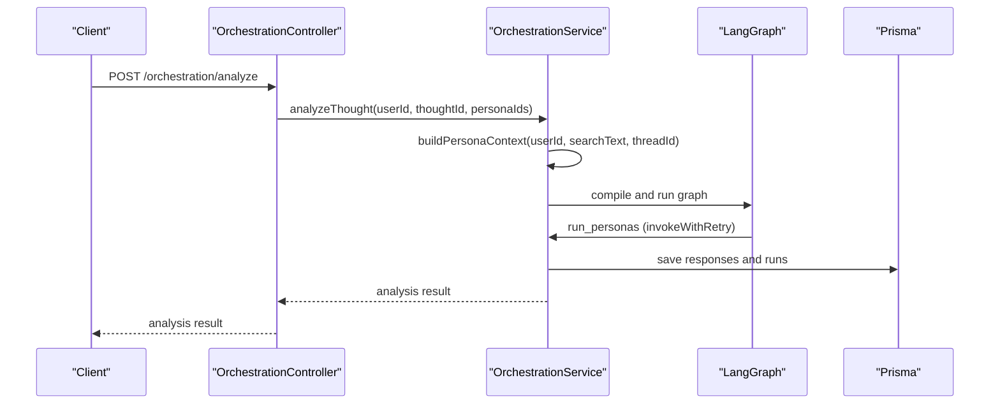
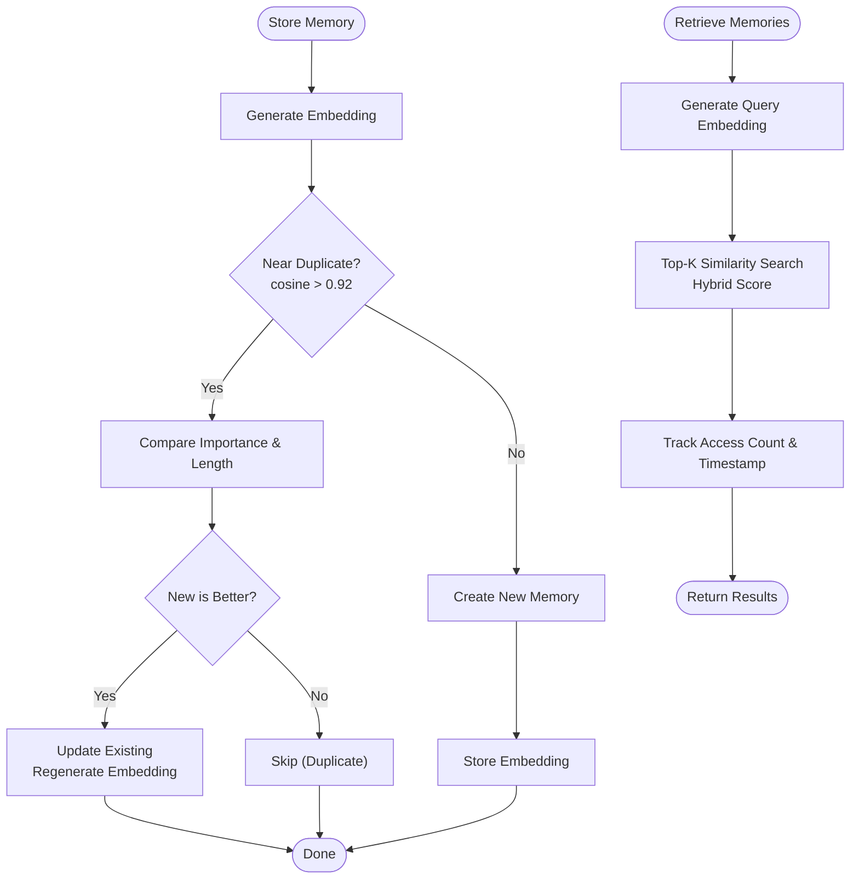
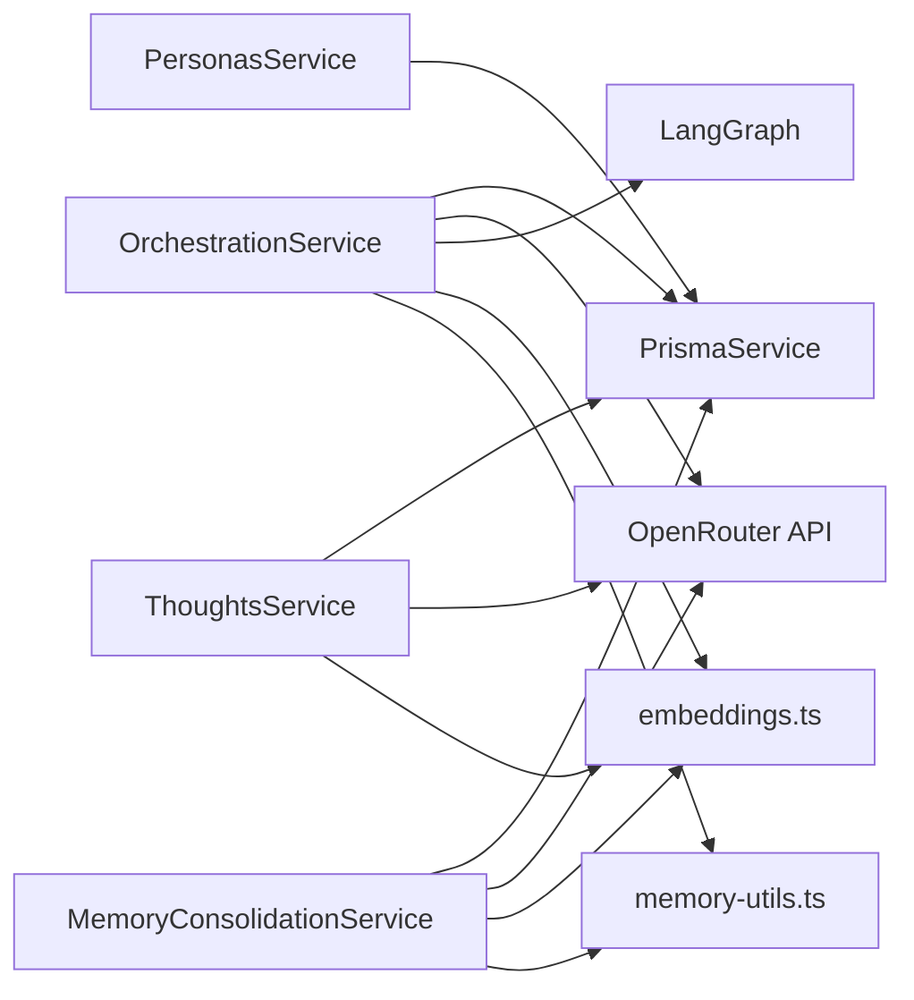

# Thought & Memory System

<cite>
**Referenced Files in This Document**
- [thoughts.controller.ts](file://backend/src/thoughts/thoughts.controller.ts)
- [thoughts.service.ts](file://backend/src/thoughts/thoughts.service.ts)
- [orchestration.controller.ts](file://backend/src/orchestration/orchestration.controller.ts)
- [orchestration.service.ts](file://backend/src/orchestration/orchestration.service.ts)
- [memory-consolidation.service.ts](file://backend/src/orchestration/memory-consolidation.service.ts)
- [thought-analysis.graph.ts](file://backend/src/orchestration/graph/thought-analysis.graph.ts)
- [embeddings.ts](file://backend/src/orchestration/graph/utils/embeddings.ts)
- [memory-utils.ts](file://backend/src/orchestration/graph/utils/memory-utils.ts)
- [schema.prisma](file://backend/prisma/schema.prisma)
- [personas.service.ts](file://backend/src/personas/personas.service.ts)
- [run-personas.node.ts](file://backend/src/orchestration/graph/nodes/run-personas.node.ts)
- [thoughts.ts (frontend)](file://frontend/src/api/thoughts.ts)
- [orchestration.ts (frontend)](file://frontend/src/api/orchestration.ts)
</cite>

## Table of Contents
1. [Introduction](#introduction)
2. [Project Structure](#project-structure)
3. [Core Components](#core-components)
4. [Architecture Overview](#architecture-overview)
5. [Detailed Component Analysis](#detailed-component-analysis)
6. [Dependency Analysis](#dependency-analysis)
7. [Performance Considerations](#performance-considerations)
8. [Troubleshooting Guide](#troubleshooting-guide)
9. [Conclusion](#conclusion)
10. [Appendices](#appendices)

## Introduction
This document explains the thought and memory system of 4Ever, focusing on how the platform captures, processes, and manages user thoughts through AI-powered persona orchestration. It covers the thought creation workflow, thread management, semantic memory consolidation, the persona orchestration engine, and the semantic memory system with vector embeddings for intelligent recall and search. Practical examples illustrate thought creation, persona interaction, and memory retrieval. The document also lists the API endpoints for thought management, thread continuation, and memory operations, and addresses performance considerations for large-scale memory storage and retrieval.

## Project Structure
The thought and memory system spans backend NestJS modules, a LangGraph-based orchestration pipeline, and frontend APIs:
- Backend modules: thoughts, orchestration, personas, knowledge base, and persistence via Prisma.
- Orchestration pipeline: a linear graph that retrieves memories, loads thread history, builds prompts, runs personas, saves responses, updates summaries, and stores new memories.
- Frontend APIs: typed clients for thoughts and orchestration endpoints.

**Diagram sources**
- [thoughts.controller.ts:1-69](file://backend/src/thoughts/thoughts.controller.ts#L1-L69)
- [thoughts.service.ts:1-189](file://backend/src/thoughts/thoughts.service.ts#L1-L189)
- [orchestration.controller.ts:1-369](file://backend/src/orchestration/orchestration.controller.ts#L1-L369)
- [orchestration.service.ts:1-800](file://backend/src/orchestration/orchestration.service.ts#L1-L800)
- [memory-consolidation.service.ts:1-306](file://backend/src/orchestration/memory-consolidation.service.ts#L1-L306)
- [thought-analysis.graph.ts:1-68](file://backend/src/orchestration/graph/thought-analysis.graph.ts#L1-L68)
- [embeddings.ts:1-85](file://backend/src/orchestration/graph/utils/embeddings.ts#L1-L85)
- [memory-utils.ts:1-195](file://backend/src/orchestration/graph/utils/memory-utils.ts#L1-L195)
- [schema.prisma:1-200](file://backend/prisma/schema.prisma#L1-L200)
- [personas.service.ts:1-105](file://backend/src/personas/personas.service.ts#L1-L105)

**Section sources**
- [thoughts.controller.ts:1-69](file://backend/src/thoughts/thoughts.controller.ts#L1-L69)
- [orchestration.controller.ts:1-369](file://backend/src/orchestration/orchestration.controller.ts#L1-L369)
- [schema.prisma:1-200](file://backend/prisma/schema.prisma#L1-L200)

## Core Components
- Thought capture and threading: create thoughts, initialize threads, and append follow-up messages.
- Persona orchestration engine: builds persona-specific prompts, invokes LLMs with retries and fallbacks, and persists outputs.
- Semantic memory system: generates vector embeddings, deduplicates and consolidates memories, and retrieves relevant memories via vector similarity.
- Context enrichment: aggregates user context, calendar, mood, completion stats, pending actions, relationships, events, connections, messages, and shared notes.
- Frontend APIs: typed clients for creating thoughts, continuing threads, and interacting with the orchestration engine.

**Section sources**
- [thoughts.service.ts:22-81](file://backend/src/thoughts/thoughts.service.ts#L22-L81)
- [orchestration.service.ts:567-764](file://backend/src/orchestration/orchestration.service.ts#L567-L764)
- [memory-consolidation.service.ts:29-127](file://backend/src/orchestration/memory-consolidation.service.ts#L29-L127)
- [embeddings.ts:12-82](file://backend/src/orchestration/graph/utils/embeddings.ts#L12-L82)
- [memory-utils.ts:23-159](file://backend/src/orchestration/graph/utils/memory-utils.ts#L23-L159)
- [personas.service.ts:25-46](file://backend/src/personas/personas.service.ts#L25-L46)
- [thoughts.ts (frontend):17-48](file://frontend/src/api/thoughts.ts#L17-L48)
- [orchestration.ts (frontend):9-237](file://frontend/src/api/orchestration.ts#L9-L237)

## Architecture Overview
The orchestration pipeline is a LangGraph that orchestrates persona analysis and memory management in a linear sequence. It retrieves relevant memories, loads thread history, builds persona prompts, runs personas, saves responses, updates summaries, and stores new memories.

**Diagram sources**
- [thought-analysis.graph.ts:15-67](file://backend/src/orchestration/graph/thought-analysis.graph.ts#L15-L67)

**Section sources**
- [thought-analysis.graph.ts:15-67](file://backend/src/orchestration/graph/thought-analysis.graph.ts#L15-L67)
- [orchestration.service.ts:63-74](file://backend/src/orchestration/orchestration.service.ts#L63-L74)

## Detailed Component Analysis

### Thought Creation Workflow
- Endpoint: POST /thoughts
- Behavior:
  - Create a thought record with title, raw text, and type.
  - Initialize a thought thread and add the first user message.
  - Fire an event for ontology integration.
  - Asynchronously generate a thought embedding for clustering and recurring topic detection.

**Diagram sources**
- [thoughts.controller.ts:23-26](file://backend/src/thoughts/thoughts.controller.ts#L23-L26)
- [thoughts.service.ts:22-60](file://backend/src/thoughts/thoughts.service.ts#L22-L60)

**Section sources**
- [thoughts.controller.ts:23-26](file://backend/src/thoughts/thoughts.controller.ts#L23-L26)
- [thoughts.service.ts:22-81](file://backend/src/thoughts/thoughts.service.ts#L22-L81)

### Thread Management
- Endpoint: POST /thoughts/{threadId}/continue
- Behavior:
  - Validates thread ownership by user.
  - Appends a new user message to the thread.

**Diagram sources**
- [thoughts.controller.ts:60-67](file://backend/src/thoughts/thoughts.controller.ts#L60-L67)
- [thoughts.service.ts:166-187](file://backend/src/thoughts/thoughts.service.ts#L166-L187)

**Section sources**
- [thoughts.controller.ts:60-67](file://backend/src/thoughts/thoughts.controller.ts#L60-L67)
- [thoughts.service.ts:166-187](file://backend/src/thoughts/thoughts.service.ts#L166-L187)

### Persona Orchestration Engine
- Endpoint: POST /orchestration/analyze
- Behavior:
  - Builds persona context (user profile, calendar, mood, completion stats, pending actions, memories).
  - Constructs persona-specific prompts and invokes LLMs with retry logic and fallback models.
  - Persists persona responses and runs.

**Diagram sources**
- [orchestration.controller.ts:26-39](file://backend/src/orchestration/orchestration.controller.ts#L26-L39)
- [orchestration.service.ts:567-606](file://backend/src/orchestration/orchestration.service.ts#L567-L606)
- [run-personas.node.ts:25-72](file://backend/src/orchestration/graph/nodes/run-personas.node.ts#L25-L72)
- [thought-analysis.graph.ts:29-67](file://backend/src/orchestration/graph/thought-analysis.graph.ts#L29-L67)

**Section sources**
- [orchestration.controller.ts:26-39](file://backend/src/orchestration/orchestration.controller.ts#L26-L39)
- [orchestration.service.ts:567-606](file://backend/src/orchestration/orchestration.service.ts#L567-L606)
- [run-personas.node.ts:25-124](file://backend/src/orchestration/graph/nodes/run-personas.node.ts#L25-L124)

### Semantic Memory System and Retrieval
- Vector embeddings:
  - Embedding generation uses OpenRouter’s text-embedding-3-small model with retry logic.
  - Embeddings are stored in a PostgreSQL vector column.
- Memory retrieval:
  - Embedding similarity search with hybrid scoring (semantic + importance + recency + access frequency).
  - Tracks memory access counts and last accessed timestamps.
- Deduplication:
  - Before storing, compares cosine similarity against existing memories; merges or skips based on importance and content length.
- Consolidation:
  - Periodically clusters similar memories, detects contradictions, synthesizes summaries, and marks originals as consolidated.

**Diagram sources**
- [embeddings.ts:12-82](file://backend/src/orchestration/graph/utils/embeddings.ts#L12-L82)
- [memory-utils.ts:23-159](file://backend/src/orchestration/graph/utils/memory-utils.ts#L23-L159)
- [memory-consolidation.service.ts:29-127](file://backend/src/orchestration/memory-consolidation.service.ts#L29-L127)

**Section sources**
- [embeddings.ts:12-82](file://backend/src/orchestration/graph/utils/embeddings.ts#L12-L82)
- [memory-utils.ts:23-159](file://backend/src/orchestration/graph/utils/memory-utils.ts#L23-L159)
- [memory-consolidation.service.ts:29-127](file://backend/src/orchestration/memory-consolidation.service.ts#L29-L127)

### Practical Examples
- Creating a thought:
  - Client calls POST /thoughts with title, rawText, and optional thoughtType.
  - Backend creates the thought, initializes a thread, adds the first message, and asynchronously generates a thought embedding.
- Interacting with a persona:
  - Client calls POST /orchestration/reply-persona with thoughtId, personaId, and message.
  - Backend constructs persona context, builds prompts, invokes LLMs with retries/fallbacks, and returns the persona’s response.
- Memory retrieval:
  - Client calls GET /orchestration/memories/search?q=query&limit=N.
  - Backend computes a query embedding, performs vector similarity search with hybrid scoring, tracks access, and returns relevant memories.

**Section sources**
- [thoughts.ts (frontend):30-33](file://frontend/src/api/thoughts.ts#L30-L33)
- [orchestration.ts (frontend):18-29](file://frontend/src/api/orchestration.ts#L18-L29)
- [orchestration.controller.ts:293-304](file://backend/src/orchestration/orchestration.controller.ts#L293-L304)
- [orchestration.service.ts:512-565](file://backend/src/orchestration/orchestration.service.ts#L512-L565)

## Dependency Analysis
- Orchestration depends on:
  - Prisma for persistence.
  - OpenRouter for embeddings and LLM calls.
  - Knowledge Base and Ontology services for context augmentation.
  - LangGraph for the thought analysis pipeline.
- Memory subsystem depends on:
  - Embedding utilities and memory utilities for deduplication and storage.
  - PostgreSQL vector extension for similarity search.

**Diagram sources**
- [orchestration.service.ts:32-41](file://backend/src/orchestration/orchestration.service.ts#L32-L41)
- [memory-consolidation.service.ts:21-27](file://backend/src/orchestration/memory-consolidation.service.ts#L21-L27)
- [thoughts.service.ts:14-20](file://backend/src/thoughts/thoughts.service.ts#L14-L20)
- [personas.service.ts:1-10](file://backend/src/personas/personas.service.ts#L1-L10)

**Section sources**
- [orchestration.service.ts:32-41](file://backend/src/orchestration/orchestration.service.ts#L32-L41)
- [memory-consolidation.service.ts:21-27](file://backend/src/orchestration/memory-consolidation.service.ts#L21-L27)
- [thoughts.service.ts:14-20](file://backend/src/thoughts/thoughts.service.ts#L14-L20)
- [personas.service.ts:1-10](file://backend/src/personas/personas.service.ts#L1-L10)

## Performance Considerations
- Embedding generation:
  - Uses retries with exponential backoff for rate limits and server errors.
  - Limits input length and uses a fixed embedding model for consistency.
- Memory storage:
  - Deduplication prevents redundant embeddings and reduces storage overhead.
  - Consolidation periodically merges similar memories and resolves contradictions to reduce bloat.
- Retrieval:
  - Vector similarity search with hybrid scoring balances semantic closeness, importance, recency, and access frequency.
  - Access tracking helps prioritize frequently used memories.
- Streaming:
  - SSE endpoints for persona and core chat enable responsive UI updates and tool activity indicators.
- Scalability:
  - PostgreSQL vector extension supports efficient similarity queries.
  - Pagination and cursors for history and memory listing prevent large payloads.

[No sources needed since this section provides general guidance]

## Troubleshooting Guide
- Embedding failures:
  - Embedding generation handles 429 and 5xx errors with retries; if all attempts fail, the system logs and proceeds without embeddings.
- LLM invocation failures:
  - Persona invocation retries with exponential backoff and fallback models; if all models fail, the system returns an error response indicating failure.
- Memory storage errors:
  - If deduplication fails, the system falls back to direct creation and logs the error.
- Quota enforcement:
  - Orchestration endpoints check quotas before processing heavy LLM operations to avoid exceeding configured limits.

**Section sources**
- [embeddings.ts:21-81](file://backend/src/orchestration/graph/utils/embeddings.ts#L21-L81)
- [run-personas.node.ts:34-72](file://backend/src/orchestration/graph/nodes/run-personas.node.ts#L34-L72)
- [memory-utils.ts:138-158](file://backend/src/orchestration/graph/utils/memory-utils.ts#L138-L158)
- [orchestration.controller.ts:33-38](file://backend/src/orchestration/orchestration.controller.ts#L33-L38)

## Conclusion
4Ever’s thought and memory system integrates structured thought capture with an AI-powered persona orchestration engine and a semantic memory layer powered by vector embeddings. The system supports robust memory consolidation, intelligent recall, and scalable retrieval, while providing frontend APIs for seamless user interaction. The modular architecture enables extensibility, performance tuning, and reliable operation under varying loads.

[No sources needed since this section summarizes without analyzing specific files]

## Appendices

### API Endpoints Summary
- Thoughts
  - POST /thoughts: Create a thought and initialize a thread.
  - GET /thoughts: List thoughts with pagination.
  - GET /thoughts/:id: Retrieve a thought with threads and runs.
  - PUT /thoughts/:id: Update a thought.
  - DELETE /thoughts/:id: Delete a thought.
  - POST /thoughts/:threadId/continue: Continue a thread with a new message.
- Orchestration
  - POST /orchestration/analyze: Analyze a thought with selected personas.
  - POST /orchestration/reply-persona: Get a persona’s response to a message.
  - POST /orchestration/reply-persona/stream: Stream persona response events.
  - POST /orchestration/quick-chat: Quick chat with a persona.
  - POST /orchestration/core-chat: Core chat with integrated context.
  - POST /orchestration/core-chat/stream: Stream core chat events.
  - GET /orchestration/core-chat/history: Retrieve core chat history.
  - DELETE /orchestration/core-chat/history: Clear core chat history.
  - POST /orchestration/core-chat/new-session: Start a new core chat session.
  - POST /orchestration/persona-chat/stream: Stream persona direct chat.
  - GET /orchestration/persona-chat/:personaId/history: Retrieve persona chat history.
  - DELETE /orchestration/persona-chat/:personaId/history: Clear persona chat history.
  - GET /orchestration/memories: List memories with filters.
  - GET /orchestration/memories/search: Search memories by text.
  - GET /orchestration/memories/stats: Get memory statistics.
  - POST /orchestration/memories: Create a memory.
  - PUT /orchestration/memories/:id: Update a memory.
  - DELETE /orchestration/memories/:id: Delete a memory.
  - POST /orchestration/memories/consolidate: Trigger memory consolidation.

**Section sources**
- [thoughts.controller.ts:23-67](file://backend/src/thoughts/thoughts.controller.ts#L23-L67)
- [orchestration.controller.ts:26-367](file://backend/src/orchestration/orchestration.controller.ts#L26-L367)
- [thoughts.ts (frontend):17-48](file://frontend/src/api/thoughts.ts#L17-L48)
- [orchestration.ts (frontend):9-237](file://frontend/src/api/orchestration.ts#L9-L237)

### Data Model Highlights
- Thought: title, rawText, thoughtType, status, embedding.
- ThoughtThread: links messages and persona runs, maintains a running summary.
- Message: role, content, optional persona attribution.
- Persona: name, description, systemPrompt, modelName, category, isTemplate, isActive.
- Memory: content, memoryType, importanceScore, sourceThreadId, source, status, category, accessCount, lastAccessedAt, embedding.
- MemoryEmbedding: vector representation of memory content.

**Section sources**
- [schema.prisma:76-200](file://backend/prisma/schema.prisma#L76-L200)