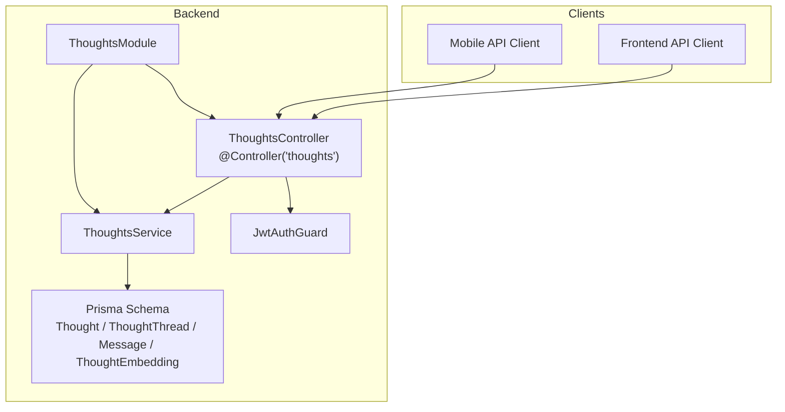
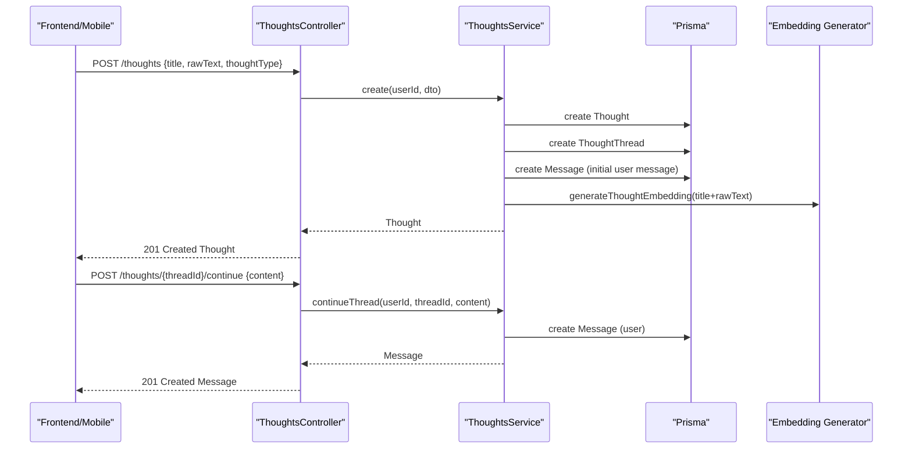
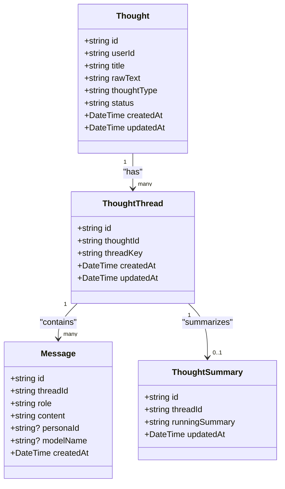
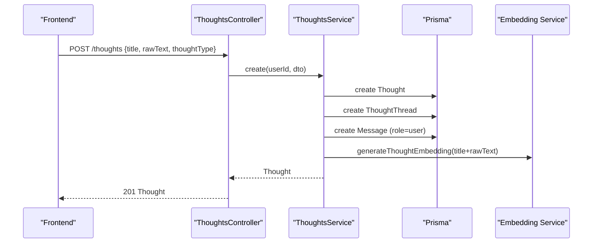
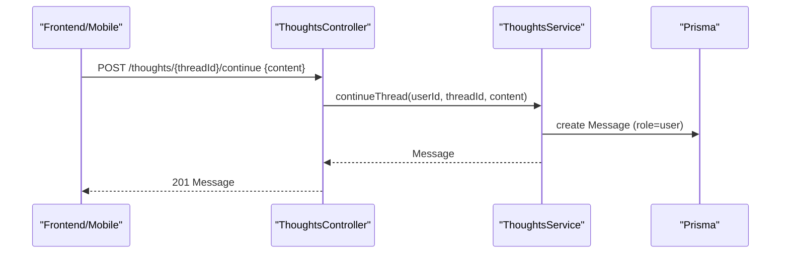
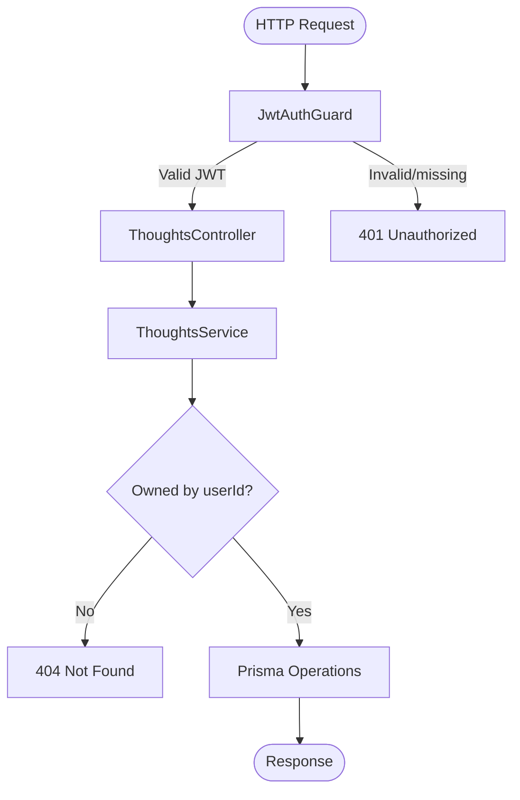
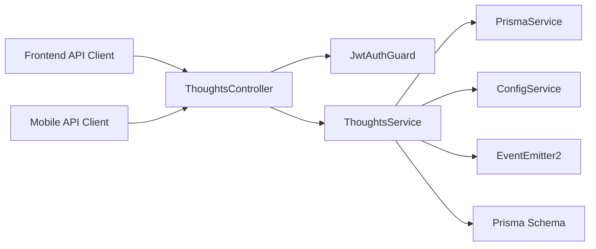

# Thought Management

<cite>
**Referenced Files in This Document**
- [thoughts.controller.ts](file://backend/src/thoughts/thoughts.controller.ts)
- [thoughts.service.ts](file://backend/src/thoughts/thoughts.service.ts)
- [thoughts.module.ts](file://backend/src/thoughts/thoughts.module.ts)
- [create-thought.dto.ts](file://backend/src/thoughts/dto/create-thought.dto.ts)
- [update-thought.dto.ts](file://backend/src/thoughts/dto/update-thought.dto.ts)
- [jwt-auth.guard.ts](file://backend/src/auth/jwt-auth.guard.ts)
- [app.module.ts](file://backend/src/app.module.ts)
- [schema.prisma](file://backend/prisma/schema.prisma)
- [thoughts.ts (frontend)](file://frontend/src/api/thoughts.ts)
- [NewThought.tsx (frontend)](file://frontend/src/pages/NewThought.tsx)
- [thoughts.ts (mobile)](file://mobile/src/api/thoughts.ts)
- [NewThoughtScreen.tsx (mobile)](file://mobile/src/screens/NewThoughtScreen.tsx)
- [thoughtStore.ts (frontend)](file://frontend/src/store/thoughtStore.ts)
- [orchestration.service.ts](file://backend/src/orchestration/orchestration.service.ts)
- [thought-analysis.graph.ts](file://backend/src/orchestration/graph/thought-analysis.graph.ts)
- [memory-consolidation.service.ts](file://backend/src/orchestration/memory-consolidation.service.ts)
</cite>

## Table of Contents
1. [Introduction](#introduction)
2. [Project Structure](#project-structure)
3. [Core Components](#core-components)
4. [Architecture Overview](#architecture-overview)
5. [Detailed Component Analysis](#detailed-component-analysis)
6. [Dependency Analysis](#dependency-analysis)
7. [Performance Considerations](#performance-considerations)
8. [Troubleshooting Guide](#troubleshooting-guide)
9. [Conclusion](#conclusion)
10. [Appendices](#appendices)

## Introduction
This document describes the thought management component of 4Ever’s thought and memory system. It covers the complete thought lifecycle from creation to deletion, including REST API endpoints for CRUD operations, thread management, content validation, JWT authentication and authorization, DTO structures, error handling, response formats, and performance considerations for indexing and retrieval.

## Project Structure
The thought management feature spans backend NestJS modules, DTOs, Prisma schema, and frontend/mobile clients:
- Backend: controller, service, DTOs, and module registration
- Persistence: Prisma models for Thought, ThoughtThread, Message, ThoughtSummary, ThoughtEmbedding
- Frontend and Mobile: API clients and UI flows for creating and continuing thoughts
- Orchestration: optional persona-driven analysis and memory consolidation

**Diagram sources**
- [thoughts.controller.ts:18-68](file://backend/src/thoughts/thoughts.controller.ts#L18-L68)
- [thoughts.service.ts:10-20](file://backend/src/thoughts/thoughts.service.ts#L10-L20)
- [jwt-auth.guard.ts:1-6](file://backend/src/auth/jwt-auth.guard.ts#L1-L6)
- [thoughts.module.ts:1-11](file://backend/src/thoughts/thoughts.module.ts#L1-L11)
- [schema.prisma:76-106](file://backend/prisma/schema.prisma#L76-L106)

**Section sources**
- [thoughts.controller.ts:1-69](file://backend/src/thoughts/thoughts.controller.ts#L1-L69)
- [thoughts.service.ts:1-189](file://backend/src/thoughts/thoughts.service.ts#L1-L189)
- [thoughts.module.ts:1-11](file://backend/src/thoughts/thoughts.module.ts#L1-L11)
- [jwt-auth.guard.ts:1-6](file://backend/src/auth/jwt-auth.guard.ts#L1-L6)
- [app.module.ts:1-172](file://backend/src/app.module.ts#L1-L172)
- [schema.prisma:76-106](file://backend/prisma/schema.prisma#L76-L106)

## Core Components
- REST API surface:
  - POST /thoughts: create a thought and initialize a thread with an initial user message
  - GET /thoughts: list thoughts with pagination
  - GET /thoughts/:id: retrieve a thought with associated threads, messages, runs, and summaries
  - PUT /thoughts/:id: update thought fields
  - DELETE /thoughts/:id: delete a thought
  - POST /thoughts/:threadId/continue: append a user message to an existing thread
- Authentication: all endpoints are protected by JWT guard
- Authorization: requests are scoped to the authenticated user ID
- Validation: DTOs enforce minimal content requirements
- Persistence: Prisma models manage Thought, ThoughtThread, Message, ThoughtSummary, ThoughtEmbedding
- Embeddings: thought embeddings are generated asynchronously for clustering and topic detection

**Section sources**
- [thoughts.controller.ts:23-67](file://backend/src/thoughts/thoughts.controller.ts#L23-L67)
- [jwt-auth.guard.ts:1-6](file://backend/src/auth/jwt-auth.guard.ts#L1-L6)
- [create-thought.dto.ts:1-16](file://backend/src/thoughts/dto/create-thought.dto.ts#L1-L16)
- [update-thought.dto.ts:1-20](file://backend/src/thoughts/dto/update-thought.dto.ts#L1-L20)
- [schema.prisma:76-106](file://backend/prisma/schema.prisma#L76-L106)
- [thoughts.service.ts:22-81](file://backend/src/thoughts/thoughts.service.ts#L22-L81)

## Architecture Overview
The thought lifecycle integrates client interactions, backend controllers/services, persistence, and optional orchestration.

**Diagram sources**
- [thoughts.controller.ts:23-67](file://backend/src/thoughts/thoughts.controller.ts#L23-L67)
- [thoughts.service.ts:22-81](file://backend/src/thoughts/thoughts.service.ts#L22-L81)
- [schema.prisma:76-106](file://backend/prisma/schema.prisma#L76-L106)

## Detailed Component Analysis

### REST API Endpoints and Workflows
- POST /thoughts
  - Purpose: create a new thought and initialize a thread with the first message
  - Request body: CreateThoughtDto
  - Response: Thought
  - Behavior: creates Thought, creates ThoughtThread, inserts initial Message, triggers embedding generation, emits an ontology event
- GET /thoughts
  - Purpose: list thoughts for the authenticated user
  - Query params: take (default 20, capped at 100), skip
  - Response: paginated structure with items, total, hasMore
- GET /thoughts/:id
  - Purpose: retrieve a single thought with nested threads, messages, runs, and summaries
  - Response: Thought with include relations
  - Not found: throws NotFoundException
- PUT /thoughts/:id
  - Purpose: update thought fields
  - Request body: UpdateThoughtDto
  - Behavior: validates ownership, updates fields
- DELETE /thoughts/:id
  - Purpose: delete a thought
  - Behavior: validates ownership, deletes thought
- POST /thoughts/:threadId/continue
  - Purpose: continue an existing thread with a new user message
  - Request body: { content }
  - Behavior: validates thread ownership, creates Message

Authorization and authentication:
- All endpoints are guarded by JwtAuthGuard
- The authenticated user ID is passed from the JWT payload to the service layer

Validation:
- CreateThoughtDto enforces non-empty title and rawText; thoughtType is optional
- UpdateThoughtDto allows partial updates for title, rawText, thoughtType, status

Response formats:
- GET /thoughts returns either an array (legacy) or a paginated object (items, total, hasMore)
- Other endpoints return the created/updated resource

**Section sources**
- [thoughts.controller.ts:23-67](file://backend/src/thoughts/thoughts.controller.ts#L23-L67)
- [create-thought.dto.ts:1-16](file://backend/src/thoughts/dto/create-thought.dto.ts#L1-L16)
- [update-thought.dto.ts:1-20](file://backend/src/thoughts/dto/update-thought.dto.ts#L1-L20)
- [thoughts.service.ts:83-102](file://backend/src/thoughts/thoughts.service.ts#L83-L102)
- [thoughts.service.ts:104-130](file://backend/src/thoughts/thoughts.service.ts#L104-L130)
- [thoughts.service.ts:132-150](file://backend/src/thoughts/thoughts.service.ts#L132-L150)
- [thoughts.service.ts:152-164](file://backend/src/thoughts/thoughts.service.ts#L152-L164)
- [thoughts.service.ts:166-187](file://backend/src/thoughts/thoughts.service.ts#L166-L187)

### DTO Structures
- CreateThoughtDto
  - title: string (min length 1)
  - rawText: string (min length 1)
  - thoughtType: string (optional)
- UpdateThoughtDto
  - title: string (optional)
  - rawText: string (optional)
  - thoughtType: string (optional)
  - status: string (optional)

These DTOs are validated automatically by NestJS class-validator decorators and used in controller handlers.

**Section sources**
- [create-thought.dto.ts:1-16](file://backend/src/thoughts/dto/create-thought.dto.ts#L1-L16)
- [update-thought.dto.ts:1-20](file://backend/src/thoughts/dto/update-thought.dto.ts#L1-L20)

### Thread Management
- Each thought has a dedicated ThoughtThread with a unique threadKey
- Initial Message is inserted upon thought creation
- Subsequent user contributions are appended via POST /thoughts/:threadId/continue
- Retrieval includes nested threads, messages ordered chronologically, persona runs, and summaries

**Diagram sources**
- [schema.prisma:76-106](file://backend/prisma/schema.prisma#L76-L106)
- [schema.prisma:130-142](file://backend/prisma/schema.prisma#L130-L142)
- [schema.prisma:159-168](file://backend/prisma/schema.prisma#L159-L168)

**Section sources**
- [thoughts.service.ts:33-48](file://backend/src/thoughts/thoughts.service.ts#L33-L48)
- [thoughts.service.ts:166-187](file://backend/src/thoughts/thoughts.service.ts#L166-L187)
- [schema.prisma:76-106](file://backend/prisma/schema.prisma#L76-L106)

### Thought Creation Workflow
- Client sends POST /thoughts with CreateThoughtDto
- Controller delegates to ThoughtsService.create
- Service persists Thought, creates ThoughtThread, inserts initial Message
- Asynchronously generates embedding and emits an ontology event
- Controller returns the created Thought

**Diagram sources**
- [thoughts.controller.ts:23-26](file://backend/src/thoughts/thoughts.controller.ts#L23-L26)
- [thoughts.service.ts:22-60](file://backend/src/thoughts/thoughts.service.ts#L22-L60)

**Section sources**
- [thoughts.controller.ts:23-26](file://backend/src/thoughts/thoughts.controller.ts#L23-L26)
- [thoughts.service.ts:22-60](file://backend/src/thoughts/thoughts.service.ts#L22-L60)

### Thread Continuation
- Client sends POST /thoughts/:threadId/continue with { content }
- Controller validates thread ownership and delegates to ThoughtsService.continueThread
- Service inserts a new Message with role=user and returns it

**Diagram sources**
- [thoughts.controller.ts:60-67](file://backend/src/thoughts/thoughts.controller.ts#L60-L67)
- [thoughts.service.ts:166-187](file://backend/src/thoughts/thoughts.service.ts#L166-L187)

**Section sources**
- [thoughts.controller.ts:60-67](file://backend/src/thoughts/thoughts.controller.ts#L60-L67)
- [thoughts.service.ts:166-187](file://backend/src/thoughts/thoughts.service.ts#L166-L187)

### Content Validation and Error Handling
- Validation:
  - CreateThoughtDto requires non-empty title and rawText; thoughtType is optional
  - UpdateThoughtDto allows partial updates; all fields are optional
- Error handling:
  - NotFound errors are thrown when attempting to access or modify thoughts/threads not owned by the user
  - Clients receive appropriate HTTP status codes (e.g., 404 Not Found)

**Section sources**
- [create-thought.dto.ts:1-16](file://backend/src/thoughts/dto/create-thought.dto.ts#L1-L16)
- [update-thought.dto.ts:1-20](file://backend/src/thoughts/dto/update-thought.dto.ts#L1-L20)
- [thoughts.service.ts:125-127](file://backend/src/thoughts/thoughts.service.ts#L125-L127)
- [thoughts.service.ts:157-159](file://backend/src/thoughts/thoughts.service.ts#L157-L159)

### JWT Authentication and Authorization Patterns
- Guard: JwtAuthGuard is applied at the controller level for all endpoints
- Scope: Service methods accept userId from the request context and enforce ownership checks before mutating data
- Global setup: APP_GUARD includes ThrottlerGuard; JWT guard ensures authenticated requests

**Diagram sources**
- [jwt-auth.guard.ts:1-6](file://backend/src/auth/jwt-auth.guard.ts#L1-L6)
- [thoughts.controller.ts:18-21](file://backend/src/thoughts/thoughts.controller.ts#L18-L21)
- [thoughts.service.ts:132-150](file://backend/src/thoughts/thoughts.service.ts#L132-L150)

**Section sources**
- [jwt-auth.guard.ts:1-6](file://backend/src/auth/jwt-auth.guard.ts#L1-L6)
- [app.module.ts:164-169](file://backend/src/app.module.ts#L164-L169)
- [thoughts.controller.ts:18-21](file://backend/src/thoughts/thoughts.controller.ts#L18-L21)
- [thoughts.service.ts:132-150](file://backend/src/thoughts/thoughts.service.ts#L132-L150)

### Practical Examples
- Create a thought
  - Endpoint: POST /thoughts
  - Payload: { title, rawText, thoughtType? }
  - Expected response: the created Thought
- Continue a thread
  - Endpoint: POST /thoughts/:threadId/continue
  - Payload: { content }
  - Expected response: the created Message
- Retrieve a thought with threads
  - Endpoint: GET /thoughts/:id
  - Expected response: Thought with nested threads, messages, runs, and summaries
- List thoughts
  - Endpoint: GET /thoughts?take=&skip=
  - Expected response: items, total, hasMore

Frontend and mobile clients expose these APIs:
- Frontend: thoughtsApi.create, thoughtsApi.continueThread, etc.
- Mobile: thoughtsApi.create, thoughtsApi.continueThread, etc.

**Section sources**
- [thoughts.ts (frontend):17-48](file://frontend/src/api/thoughts.ts#L17-L48)
- [thoughts.ts (mobile):54-84](file://mobile/src/api/thoughts.ts#L54-L84)
- [NewThought.tsx (frontend):78-102](file://frontend/src/pages/NewThought.tsx#L78-L102)
- [NewThoughtScreen.tsx (mobile):44-67](file://mobile/src/screens/NewThoughtScreen.tsx#L44-L67)

### Optional Orchestration and Memory Integration
- After creation, the system can trigger persona analysis via orchestration, which:
  - Loads thread history and memory
  - Builds prompts and runs personas
  - Saves responses, updates summaries, and stores new memories
- Thought embeddings enable clustering and recurring topic detection
- Memory consolidation periodically merges similar memories and resolves contradictions

**Section sources**
- [thoughts.service.ts:53-57](file://backend/src/thoughts/thoughts.service.ts#L53-L57)
- [thoughts.service.ts:66-81](file://backend/src/thoughts/thoughts.service.ts#L66-L81)
- [orchestration.service.ts:24-74](file://backend/src/orchestration/orchestration.service.ts#L24-L74)
- [thought-analysis.graph.ts:15-28](file://backend/src/orchestration/graph/thought-analysis.graph.ts#L15-L28)
- [memory-consolidation.service.ts:29-127](file://backend/src/orchestration/memory-consolidation.service.ts#L29-L127)

## Dependency Analysis
- Controller depends on JwtAuthGuard and ThoughtsService
- ThoughtsService depends on PrismaService, ConfigService, EventEmitter2, and embedding utilities
- Module exports ThoughtsService for use by other modules
- Frontend and mobile clients depend on the REST endpoints

**Diagram sources**
- [thoughts.controller.ts:1-16](file://backend/src/thoughts/thoughts.controller.ts#L1-L16)
- [jwt-auth.guard.ts:1-6](file://backend/src/auth/jwt-auth.guard.ts#L1-L6)
- [thoughts.service.ts:14-20](file://backend/src/thoughts/thoughts.service.ts#L14-L20)
- [schema.prisma:76-106](file://backend/prisma/schema.prisma#L76-L106)

**Section sources**
- [thoughts.controller.ts:1-16](file://backend/src/thoughts/thoughts.controller.ts#L1-L16)
- [thoughts.service.ts:14-20](file://backend/src/thoughts/thoughts.service.ts#L14-L20)
- [thoughts.module.ts:1-11](file://backend/src/thoughts/thoughts.module.ts#L1-L11)

## Performance Considerations
- Embedding generation is asynchronous and offloads to avoid blocking thought creation
- Pagination caps page size to reduce payload sizes (take ≤ 100)
- Thought retrieval includes counts and nested relations; consider selective includes in high-volume scenarios
- Thought embeddings are stored with a vector extension to enable similarity queries for recurring topic detection
- Consider adding database indexes on frequently queried fields (e.g., userId, createdAt) as needed

**Section sources**
- [thoughts.service.ts:66-81](file://backend/src/thoughts/thoughts.service.ts#L66-L81)
- [thoughts.service.ts:83-102](file://backend/src/thoughts/thoughts.service.ts#L83-L102)
- [schema.prisma:218-227](file://backend/prisma/schema.prisma#L218-L227)

## Troubleshooting Guide
- 401 Unauthorized: Ensure a valid JWT is included in the Authorization header
- 404 Not Found: Occurs when accessing thoughts or threads not owned by the authenticated user
- Validation errors: Verify CreateThoughtDto and UpdateThoughtDto fields meet minimum length requirements
- Embedding failures: Check OPENROUTER_API_KEY configuration; embedding generation is best-effort and logged

**Section sources**
- [jwt-auth.guard.ts:1-6](file://backend/src/auth/jwt-auth.guard.ts#L1-L6)
- [thoughts.service.ts:125-127](file://backend/src/thoughts/thoughts.service.ts#L125-L127)
- [thoughts.service.ts:157-159](file://backend/src/thoughts/thoughts.service.ts#L157-L159)
- [create-thought.dto.ts:1-16](file://backend/src/thoughts/dto/create-thought.dto.ts#L1-L16)
- [update-thought.dto.ts:1-20](file://backend/src/thoughts/dto/update-thought.dto.ts#L1-L20)

## Conclusion
The thought management component provides a robust, secure, and extensible foundation for capturing, organizing, and evolving thoughts. It enforces strong authentication and authorization, offers flexible validation, and integrates with orchestration and memory systems for deeper insights and consolidation.

## Appendices

### API Reference Summary
- POST /thoughts
  - Body: CreateThoughtDto
  - Response: Thought
- GET /thoughts
  - Query: take, skip
  - Response: items[], total, hasMore
- GET /thoughts/:id
  - Response: Thought with threads/messages/runs/summaries
- PUT /thoughts/:id
  - Body: UpdateThoughtDto
  - Response: Thought
- DELETE /thoughts/:id
  - Response: Deletion confirmation
- POST /thoughts/:threadId/continue
  - Body: { content }
  - Response: Message

**Section sources**
- [thoughts.controller.ts:23-67](file://backend/src/thoughts/thoughts.controller.ts#L23-L67)
- [thoughts.ts (frontend):17-48](file://frontend/src/api/thoughts.ts#L17-L48)
- [thoughts.ts (mobile):54-84](file://mobile/src/api/thoughts.ts#L54-L84)