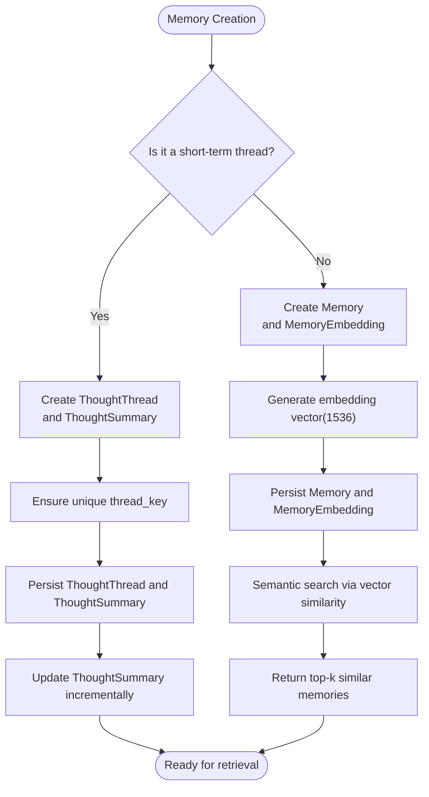
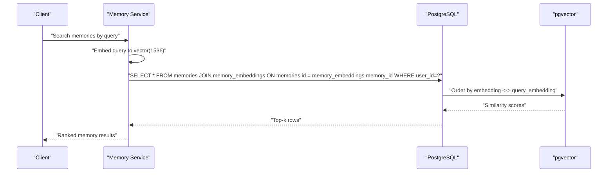
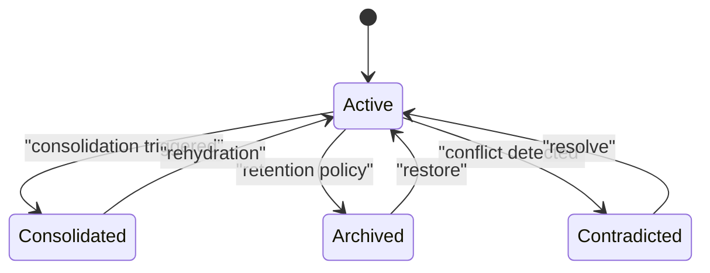

# Database Design

<cite>
**Referenced Files in This Document**
- [schema.prisma](file://backend/prisma/schema.prisma)
- [init migration](file://backend/prisma/migrations/20260415125859_init/migration.sql)
- [semantic_memory_search migration](file://backend/prisma/migrations/20260415143041_semantic_memory_search/migration.sql)
- [add_user_context migration](file://backend/prisma/migrations/20260415151222_add_user_context/migration.sql)
- [add_insights_and_thought_embeddings migration](file://backend/prisma/migrations/20260415171832_add_insights_and_thought_embeddings/migration.sql)
- [add_day_planner migration](file://backend/prisma/migrations/20260415175017_add_day_planner/migration.sql)
- [add_life_dimensions_features migration](file://backend/prisma/migrations/20260415184323_add_life_dimensions_features/migration.sql)
- [add_relationship_circle migration](file://backend/prisma/migrations/20260419180329_add_relationship_circle/migration.sql)
- [add_relationship_evolution migration](file://backend/prisma/migrations/20260419191045_add_relationship_evolution/migration.sql)
- [add_rituals_and_life_events migration](file://backend/prisma/migrations/20260422073952_add_rituals_and_life_events/migration.sql)
- [add_tension_entries migration](file://backend/prisma/migrations/20260422075259_add_tension_entries/migration.sql)
- [add_love_language migration](file://backend/prisma/migrations/20260422080027_add_love_language/migration.sql)
- [add_persona_chat_messages migration](file://backend/prisma/migrations/20260422083121_add_persona_chat_messages/migration.sql)
- [add_social_messaging migration](file://backend/prisma/migrations/20260422085110_add_social_messaging/migration.sql)
- [add_performance_indexes migration](file://backend/prisma/migrations/20260422213232_add_performance_indexes/migration.sql)
- [add_core_chat_session_start migration](file://backend/prisma/migrations/20260425082634_add_core_chat_session_start/migration.sql)
- [add_memory_lifecycle migration](file://backend/prisma/migrations/20260425120506_add_memory_lifecycle/migration.sql)
- [add_whatsapp_messaging_features migration](file://backend/prisma/migrations/20260425182209_add_whatsapp_messaging_features/migration.sql)
- [phone_otp_auth migration](file://backend/prisma/migrations/20260425194007_phone_otp_auth/migration.sql)
- [add_ontology migration](file://backend/prisma/migrations/20260426120000_add_ontology/migration.sql)
- [add_context_embeddings migration](file://backend/prisma/migrations/20260427085039_add_context_embeddings/migration.sql)
- [add_user_avatar migration](file://backend/prisma/migrations/20260429080622_add_user_avatar/migration.sql)
- [add_kw_documents migration](file://backend/prisma/migrations/20260429080622_add_kw_documents/migration.sql)
- [add_subscription_tier migration](file://backend/prisma/migrations/20260430000000_add_subscription_tier/migration.sql)
- [add_kw_tables migration](file://backend/prisma/migrations/20260430000100_add_kw_tables/migration.sql)
- [add_relationship_person_linked_user migration](file://backend/prisma/migrations/20260430000100_add_relationship_person_linked_user/migration.sql)
- [add_relationship_person_phone migration](file://backend/prisma/migrations/20260430105802_add_relationship_person_phone/migration.sql)
- [add_tri_chat migration](file://backend/prisma/migrations/20260430200000_add_tri_chat/migration.sql)
- [mediator_v2 migration](file://backend/prisma/migrations/20260430210000_mediator_v2/migration.sql)
- [clear_history_one_sided migration](file://backend/prisma/migrations/20260501070733_clear_history_one_sided/migration.sql)
- [add_mediator_name migration](file://backend/prisma/migrations/20260501081526_add_mediator_name/migration.sql)
- [tri_chat_default_on migration](file://backend/prisma/migrations/20260501141000_tri_chat_default_on/migration.sql)
- [add_user_timezone migration](file://backend/prisma/migrations/20260510120000_add_user_timezone/migration.sql)
- [add_session_recap_cache migration](file://backend/prisma/migrations/20260510150000_add_session_recap_cache/migration.sql)
- [add_consent_and_export_delete migration](file://backend/prisma/migrations/20260510160032_add_consent_and_export_delete/migration.sql)
- [add_life_dimensions migration](file://backend/prisma/migrations/20260510170000_add_life_dimensions/migration.sql)
- [add_sign_in_with_apple migration](file://backend/prisma/migrations/20260510180000_add_sign_in_with_apple/migration.sql)
- [add_llm_usage_and_token_quotas migration](file://backend/prisma/migrations/20260510220000_add_llm_usage_and_token_quotas/migration.sql)
</cite>

## Table of Contents
1. [Introduction](#introduction)
2. [Project Structure](#project-structure)
3. [Core Components](#core-components)
4. [Architecture Overview](#architecture-overview)
5. [Detailed Component Analysis](#detailed-component-analysis)
6. [Dependency Analysis](#dependency-analysis)
7. [Performance Considerations](#performance-considerations)
8. [Troubleshooting Guide](#troubleshooting-guide)
9. [Conclusion](#conclusion)
10. [Appendices](#appendices)

## Introduction
This document describes the 4Ever database schema and data model, focusing on the entities Users, Thoughts, Personas, Memories, Relationships, and related subsystems. It explains entity relationships, field definitions, data types, primary and foreign keys, indexes, and constraints. It also documents the two-layer memory architecture (short-term thread summaries and long-term pgvector-embedded memories), semantic search capabilities, data lifecycle management, migration history, and operational considerations such as indexing, caching, and quotas.

## Project Structure
The schema is defined in Prisma and evolves through PostgreSQL migrations. The Prisma schema defines models and relations; migrations define the canonical database DDL and indexes. The vector extension is enabled for pgvector-based similarity search.

```mermaid
graph TB
subgraph "Prisma Schema"
PRISMA["schema.prisma"]
end
subgraph "Migrations"
M_INIT["20260415125859_init"]
M_MEM["20260415143041_semantic_memory_search"]
M_CTX["20260415151222_add_user_context"]
M_THOUGHT_E["20260415171832_add_insights_and_thought_embeddings"]
M_PLANNER["20260415175017_add_day_planner"]
M_DIM["20260415184323_add_life_dimensions_features"]
M_REL_CIRCLE["20260419180329_add_relationship_circle"]
M_REL_EVOL["20260419191045_add_relationship_evolution"]
M_RIT_LIFE["20260422073952_add_rituals_and_life_events"]
M_TENSION["20260422075259_add_tension_entries"]
M_LOVE["20260422080027_add_love_language"]
M_PCHAT["20260422083121_add_persona_chat_messages"]
M_SOCIAL["20260422085110_add_social_messaging"]
M_IDX["20260422213232_add_performance_indexes"]
M_CORE_START["20260425082634_add_core_chat_session_start"]
M_MEM_LIFECYCLE["20260425120506_add_memory_lifecycle"]
M_OT["20260426120000_add_ontology"]
M_CTX_E["20260427085039_add_context_embeddings"]
M_AVATAR["20260429080622_add_user_avatar"]
M_KW_DOCS["20260429080622_add_kw_documents"]
M_SUB["20260430000000_add_subscription_tier"]
M_KW_TBL["20260430000100_add_kw_tables"]
M_REL_LINK_USER["20260430000100_add_relationship_person_linked_user"]
M_REL_PHONE["20260430105802_add_relationship_person_phone"]
M_TRI["20260430200000_add_tri_chat"]
M_MEDIATOR["20260430210000_mediator_v2"]
M_CLEAR["20260501070733_clear_history_one_sided"]
M_MNAME["20260501081526_add_mediator_name"]
M_TRI_DEF["20260501141000_tri_chat_default_on"]
M_TZ["20260510120000_add_user_timezone"]
M_RECAP["20260510150000_add_session_recap_cache"]
M_CONSENT["20260510160032_add_consent_and_export_delete"]
M_DIM2["20260510170000_add_life_dimensions"]
M_APPLE["20260510180000_add_sign_in_with_apple"]
M_QUOTA["20260510220000_add_llm_usage_and_token_quotas"]
end
PRISMA --> M_INIT
PRISMA --> M_MEM
PRISMA --> M_CTX
PRISMA --> M_THOUGHT_E
PRISMA --> M_PLANNER
PRISMA --> M_DIM
PRISMA --> M_REL_CIRCLE
PRISMA --> M_REL_EVOL
PRISMA --> M_RIT_LIFE
PRISMA --> M_TENSION
PRISMA --> M_LOVE
PRISMA --> M_PCHAT
PRISMA --> M_SOCIAL
PRISMA --> M_IDX
PRISMA --> M_CORE_START
PRISMA --> M_MEM_LIFECYCLE
PRISMA --> M_OT
PRISMA --> M_CTX_E
PRISMA --> M_AVATAR
PRISMA --> M_KW_DOCS
PRISMA --> M_SUB
PRISMA --> M_KW_TBL
PRISMA --> M_REL_LINK_USER
PRISMA --> M_REL_PHONE
PRISMA --> M_TRI
PRISMA --> M_MEDIATOR
PRISMA --> M_CLEAR
PRISMA --> M_MNAME
PRISMA --> M_TRI_DEF
PRISMA --> M_TZ
PRISMA --> M_RECAP
PRISMA --> M_CONSENT
PRISMA --> M_DIM2
PRISMA --> M_APPLE
PRISMA --> M_QUOTA
```

**Diagram sources**
- [schema.prisma](file://backend/prisma/schema.prisma)
- [init migration](file://backend/prisma/migrations/20260415125859_init/migration.sql)
- [semantic_memory_search migration](file://backend/prisma/migrations/20260415143041_semantic_memory_search/migration.sql)
- [add_user_context migration](file://backend/prisma/migrations/20260415151222_add_user_context/migration.sql)
- [add_insights_and_thought_embeddings migration](file://backend/prisma/migrations/20260415171832_add_insights_and_thought_embeddings/migration.sql)
- [add_day_planner migration](file://backend/prisma/migrations/20260415175017_add_day_planner/migration.sql)
- [add_life_dimensions_features migration](file://backend/prisma/migrations/20260415184323_add_life_dimensions_features/migration.sql)
- [add_relationship_circle migration](file://backend/prisma/migrations/20260419180329_add_relationship_circle/migration.sql)
- [add_relationship_evolution migration](file://backend/prisma/migrations/20260419191045_add_relationship_evolution/migration.sql)
- [add_rituals_and_life_events migration](file://backend/prisma/migrations/20260422073952_add_rituals_and_life_events/migration.sql)
- [add_tension_entries migration](file://backend/prisma/migrations/20260422075259_add_tension_entries/migration.sql)
- [add_love_language migration](file://backend/prisma/migrations/20260422080027_add_love_language/migration.sql)
- [add_persona_chat_messages migration](file://backend/prisma/migrations/20260422083121_add_persona_chat_messages/migration.sql)
- [add_social_messaging migration](file://backend/prisma/migrations/20260422085110_add_social_messaging/migration.sql)
- [add_performance_indexes migration](file://backend/prisma/migrations/20260422213232_add_performance_indexes/migration.sql)
- [add_core_chat_session_start migration](file://backend/prisma/migrations/20260425082634_add_core_chat_session_start/migration.sql)
- [add_memory_lifecycle migration](file://backend/prisma/migrations/20260425120506_add_memory_lifecycle/migration.sql)
- [add_ontology migration](file://backend/prisma/migrations/20260426120000_add_ontology/migration.sql)
- [add_context_embeddings migration](file://backend/prisma/migrations/20260427085039_add_context_embeddings/migration.sql)
- [add_user_avatar migration](file://backend/prisma/migrations/20260429080622_add_user_avatar/migration.sql)
- [add_kw_documents migration](file://backend/prisma/migrations/20260429080622_add_kw_documents/migration.sql)
- [add_subscription_tier migration](file://backend/prisma/migrations/20260430000000_add_subscription_tier/migration.sql)
- [add_kw_tables migration](file://backend/prisma/migrations/20260430000100_add_kw_tables/migration.sql)
- [add_relationship_person_linked_user migration](file://backend/prisma/migrations/20260430000100_add_relationship_person_linked_user/migration.sql)
- [add_relationship_person_phone migration](file://backend/prisma/migrations/20260430105802_add_relationship_person_phone/migration.sql)
- [add_tri_chat migration](file://backend/prisma/migrations/20260430200000_add_tri_chat/migration.sql)
- [mediator_v2 migration](file://backend/prisma/migrations/20260430210000_mediator_v2/migration.sql)
- [clear_history_one_sided migration](file://backend/prisma/migrations/20260501070733_clear_history_one_sided/migration.sql)
- [add_mediator_name migration](file://backend/prisma/migrations/20260501081526_add_mediator_name/migration.sql)
- [tri_chat_default_on migration](file://backend/prisma/migrations/20260501141000_tri_chat_default_on/migration.sql)
- [add_user_timezone migration](file://backend/prisma/migrations/20260510120000_add_user_timezone/migration.sql)
- [add_session_recap_cache migration](file://backend/prisma/migrations/20260510150000_add_session_recap_cache/migration.sql)
- [add_consent_and_export_delete migration](file://backend/prisma/migrations/20260510160032_add_consent_and_export_delete/migration.sql)
- [add_life_dimensions migration](file://backend/prisma/migrations/20260510170000_add_life_dimensions/migration.sql)
- [add_sign_in_with_apple migration](file://backend/prisma/migrations/20260510180000_add_sign_in_with_apple/migration.sql)
- [add_llm_usage_and_token_quotas migration](file://backend/prisma/migrations/20260510220000_add_llm_usage_and_token_quotas/migration.sql)

**Section sources**
- [schema.prisma](file://backend/prisma/schema.prisma)
- [init migration](file://backend/prisma/migrations/20260415125859_init/migration.sql)

## Core Components
This section outlines the principal entities and their attributes, with emphasis on primary keys, foreign keys, and indexes. It also highlights the two-layer memory architecture and semantic search.

- Users
  - Primary key: id
  - Notable fields: phone number, Apple user ID, email, name, avatar URL, subscription tier, tri-chat usage, relationship health opt-in, last seen at, and consent records.
  - Relations: owns Thoughts, Personas, Memories, UserContext, InsightReports, DayPlans, DailyCheckIns, ActionItems, PersonaDocuments, CoreChatMessages, Relationships, Rituals, LifeEvents, Tensions, PersonaChatMessages, Connections (sent/received), DirectMessages (sent/received), SharedNotes authored, MessageReactions, CoreChatSummaries, ProfileChangeLogs, KwConversations, KwDocuments, DimensionRatings, DimensionSignals, LlmUsage, TokenQuota.
  - Indexes: none declared in Prisma; presence of indexes depends on migrations.

- Thoughts
  - Primary key: id
  - Foreign key: user_id → users.id (Cascade)
  - Embedding: ThoughtEmbedding (one-to-one)
  - Relations: belongs to User, has ThoughtThreads, ThoughtEmbedding.

- ThoughtThreads
  - Primary key: id
  - Unique: thread_key
  - Foreign key: thought_id → thoughts.id (Cascade)
  - Relations: belongs to Thought, has Messages, PersonaRuns, ThoughtSummary.

- Persona
  - Primary key: id
  - Optional foreign key: user_id → users.id (Cascade)
  - Relations: belongs to User, has PersonaRuns, PersonaDocuments, PersonaChatMessages.
  - Index: isTemplate.

- Messages
  - Primary key: id
  - Foreign key: thread_id → thought_threads.id (Cascade)
  - Relations: belongs to ThoughtThread.

- PersonaRuns
  - Primary key: id
  - Foreign keys: thread_id → thought_threads.id (Cascade), persona_id → personas.id (Cascade)
  - Relations: belongs to ThoughtThread, Persona.

- ThoughtSummary
  - Primary key: id
  - Unique: thread_id
  - Foreign key: thread_id → thought_threads.id (Cascade)
  - Relations: belongs to ThoughtThread.

- Memories
  - Primary key: id
  - Foreign key: user_id → users.id (Cascade)
  - Lifecycle fields: status, supersededById, accessCount, lastAccessedAt, category, source
  - Relations: belongs to User, has MemoryEmbedding.
  - Indexes: user_id + status.

- MemoryEmbedding
  - Primary key: id
  - Unique: memory_id
  - Vector type: vector(1536)
  - Foreign key: memory_id → memories.id (Cascade)
  - Relations: belongs to Memory.

- ThoughtEmbedding
  - Primary key: id
  - Unique: thought_id
  - Vector type: vector(1536)
  - Foreign key: thought_id → thoughts.id (Cascade)
  - Relations: belongs to Thought.

- DayPlan
  - Primary key: id
  - Unique: (user_id, date)
  - Foreign key: user_id → users.id (Cascade)
  - Relations: belongs to User, has PlanTasks.

- PlanTask
  - Primary key: id
  - Foreign key: plan_id → day_plans.id (Cascade)
  - Relations: belongs to DayPlan.

- DailyCheckIn
  - Primary key: id
  - Unique: (user_id, date)
  - Foreign key: user_id → users.id (Cascade)
  - Relations: belongs to User.

- ActionItem
  - Primary key: id
  - Foreign key: user_id → users.id (Cascade)
  - Indexes: user_id + status.

- UserContext
  - Primary key: id
  - Unique: user_id
  - Foreign key: user_id → users.id (Cascade)
  - Relations: belongs to User.

- PersonaDocument
  - Primary key: id
  - Foreign keys: persona_id → personas.id (Cascade), user_id → users.id (Cascade)
  - Relations: belongs to Persona, User, has DocumentChunks.

- DocumentChunk
  - Primary key: id
  - Foreign key: document_id → persona_documents.id (Cascade)
  - Vector type: vector(1536)
  - Relations: belongs to PersonaDocument.

- CoreChatMessage
  - Primary key: id
  - Foreign key: user_id → users.id (Cascade)
  - Indexes: user_id + createdAt.

- DimensionRating
  - Primary key: id
  - Unique: (user_id, dimension, source, weekStart)
  - Indexes: user_id + weekStart.

- DimensionSignal
  - Primary key: id
  - Indexes: user_id + weekStart, user_id + dimension + createdAt.

- RelationshipPerson
  - Primary key: id
  - Relations: belongs to User, has RelationshipNotes, RelationshipRituals, LifeEvents, TensionEntries.

- RelationshipNote
  - Primary key: id
  - Indexes: person_id + createdAt.

- RelationshipRitual
  - Primary key: id
  - Optional foreign key: person_id → relationship_persons.id (SetNull)
  - Relations: belongs to User, optionally to RelationshipPerson.

- LifeEvent
  - Primary key: id
  - Optional foreign key: person_id → relationship_persons.id (SetNull)
  - Relations: belongs to User, optionally to RelationshipPerson.

- TensionEntry
  - Primary key: id
  - Optional foreign key: person_id → relationship_persons.id (SetNull)
  - Relations: belongs to User, optionally to RelationshipPerson.

- PersonaChatMessage
  - Primary key: id
  - Foreign keys: user_id → users.id (Cascade), persona_id → personas.id (Cascade)
  - Indexes: user_id + persona_id + createdAt.

- Connection
  - Primary key: id
  - Unique: (requester_id, receiver_id)
  - Foreign keys: requester_id → users.id (Cascade), receiver_id → users.id (Cascade)
  - Relations: belongs to User (sent/received), has MediationSessions.

- DirectMessage
  - Primary key: id
  - Foreign keys: sender_id → users.id (Cascade), receiver_id → users.id (Cascade)
  - Optional foreign key: replyToId → direct_messages.id (SetNull)
  - Relations: belongs to User (sent/received), has MessageReactions, replies.
  - Indexes: sender_id + receiver_id + createdAt, replyToId, mediatorSessionId.

- MediationSession
  - Primary key: id
  - Foreign key: connection_id → connections.id (Cascade)
  - Relations: belongs to Connection, has MediationEvents.
  - Indexes: connection_id + startedAt.

- MediationEvent
  - Primary key: id
  - Foreign key: session_id → mediation_sessions.id (Cascade)
  - Relations: belongs to MediationSession.
  - Indexes: session_id.

- MessageReaction
  - Primary key: id
  - Unique: (message_id, user_id, emoji)
  - Foreign keys: message_id → direct_messages.id (Cascade), user_id → users.id (Cascade)
  - Relations: belongs to DirectMessage, User.

- SharedNote
  - Primary key: id
  - Foreign key: author_id → users.id (Cascade)
  - Relations: belongs to User.

- CoreChatSummary
  - Primary key: id
  - Indexes: user_id + createdAt.
  - Relations: belongs to User.

- ProfileChangeLog
  - Primary key: id
  - Indexes: user_id + createdAt.
  - Relations: belongs to User.

- OntologyEvent
  - Primary key: id
  - Indexes: user_id + domain + processed, user_id + createdAt.
  - Relations: belongs to User.

- OntologySnapshot
  - Primary key: id
  - Unique: (user_id, domain, scopeId).
  - Indexes: user_id + domain.
  - Relations: belongs to User.

- OtpCode
  - Primary key: id
  - Indexes: phone_number + code.
  - Relations: belongs to no entity.

- KwConversation
  - Primary key: id
  - Foreign key: user_id → users.id (Cascade)
  - Relations: belongs to User, has KwMessages.
  - Indexes: user_id + createdAt(desc).

- KwMessage
  - Primary key: id
  - Foreign key: conversation_id → kw_conversations.id (Cascade)
  - Relations: belongs to KwConversation.
  - Indexes: conversation_id + createdAt.

- KwDocument
  - Primary key: id
  - Foreign key: user_id → users.id (Cascade)
  - Relations: belongs to User.
  - Indexes: user_id + createdAt(desc).

- LlmUsage
  - Primary key: id
  - Indexes: user_id + createdAt, user_id + endpoint + createdAt, createdAt.
  - Relations: belongs to User.

- Consent
  - Primary key: id
  - Unique: (user_id, kind, version).
  - Indexes: user_id + kind.
  - Relations: belongs to User.

- TokenQuota
  - Primary key: id
  - Unique: user_id.
  - Foreign key: user_id → users.id (Cascade)
  - Relations: belongs to User.

**Section sources**
- [schema.prisma](file://backend/prisma/schema.prisma)
- [semantic_memory_search migration](file://backend/prisma/migrations/20260415143041_semantic_memory_search/migration.sql)
- [add_memory_lifecycle migration](file://backend/prisma/migrations/20260425120506_add_memory_lifecycle/migration.sql)
- [add_performance_indexes migration](file://backend/prisma/migrations/20260422213232_add_performance_indexes/migration.sql)

## Architecture Overview
The database follows a layered design:
- Short-term memory: ThoughtThreads with ThoughtSummary captures ongoing conversations.
- Long-term memory: Memories with MemoryEmbedding enable semantic search via pgvector.
- Social and relationship features: Connections, DirectMessages, RelationshipPersons, Rituals, LifeEvents, Tensions.
- Context and planning: UserContext, DayPlans, PlanTasks, DailyCheckIns, ActionItems.
- Analytics and governance: InsightReports, OntologyEvents/Snapshots, Consent, LlmUsage, TokenQuota.

```mermaid
erDiagram
USERS ||--o{ THOUGHTS : "owns"
THOUGHTS ||--o{ THOUGHT_THREADS : "contains"
THOUGHT_THREADS ||--o{ MESSAGES : "has"
THOUGHT_THREADS ||--|| THOUGHT_SUMMARY : "summarizes"
THOUGHTS ||--|| THOUGHT_EMBEDDING : "embeds"
USERS ||--o{ MEMORIES : "owns"
MEMORIES ||--|| MEMORY_EMBEDDING : "embeds"
USERS ||--o{ PERSONAS : "owns"
PERSONAS ||--o{ PERSONA_RUNS : "executes"
PERSONAS ||--o{ PERSONA_CHAT_MESSAGES : "participates"
USERS ||--o{ DAY_PLANS : "plans"
DAY_PLANS ||--o{ PLAN_TASKS : "contains"
USERS ||--o{ DAILY_CHECK_INS : "rates"
USERS ||--o{ ACTION_ITEMS : "owns"
USERS ||--|| USER_CONTEXT : "has"
USERS ||--o{ RELATIONSHIP_PERSONS : "knows"
RELATIONSHIP_PERSONS ||--o{ RELATIONSHIP_NOTES : "noted"
RELATIONSHIP_PERSONS ||--o{ RELATIONSHIP_RITUALS : "rituals"
RELATIONSHIP_PERSONS ||--o{ LIFE_EVENTS : "events"
RELATIONSHIP_PERSONS ||--o{ TENSION_ENTRIES : "tensions"
USERS ||--o{ DIRECT_MESSAGES : "sends/receives"
USERS ||--o{ CONNECTIONS : "requests/accepts"
CONNECTIONS ||--o{ MEDIATION_SESSIONS : "hosts"
MEDIATION_SESSIONS ||--o{ MEDIATION_EVENTS : "records"
USERS ||--o{ CORE_CHAT_MESSAGES : "participates"
USERS ||--o{ CORE_CHAT_SUMMARIES : "summarizes"
USERS ||--o{ PROFILE_CHANGE_LOGS : "logs"
USERS ||--o{ ONTOLOGY_EVENTS : "emits"
USERS ||--o{ ONTOLOGY_SNAPSHOTS : "stores"
USERS ||--o{ CONSENTS : "agrees"
USERS ||--|| TOKEN_QUOTAS : "has"
USERS ||--o{ KW_CONVERSATIONS : "uses"
KW_CONVERSATIONS ||--o{ KW_MESSAGES : "contains"
USERS ||--o{ KW_DOCUMENTS : "uploads"
```

**Diagram sources**
- [schema.prisma](file://backend/prisma/schema.prisma)

## Detailed Component Analysis

### Two-Layer Memory Architecture
- Short-term thread summaries
  - ThoughtThreads capture conversation sessions; ThoughtSummary maintains a running summary per thread.
  - Retrieval uses thread_key and thread-scoped summaries for continuity.
- Long-term pgvector-embedded memories
  - Memories store content with importance scores and lifecycle metadata.
  - MemoryEmbedding stores vector(1536) embeddings enabling similarity search.
  - ThoughtEmbedding mirrors the same pattern for thoughts.

**Diagram sources**
- [schema.prisma](file://backend/prisma/schema.prisma)
- [semantic_memory_search migration](file://backend/prisma/migrations/20260415143041_semantic_memory_search/migration.sql)
- [add_insights_and_thought_embeddings migration](file://backend/prisma/migrations/20260415171832_add_insights_and_thought_embeddings/migration.sql)
- [add_memory_lifecycle migration](file://backend/prisma/migrations/20260425120506_add_memory_lifecycle/migration.sql)

**Section sources**
- [schema.prisma](file://backend/prisma/schema.prisma)
- [semantic_memory_search migration](file://backend/prisma/migrations/20260415143041_semantic_memory_search/migration.sql)
- [add_insights_and_thought_embeddings migration](file://backend/prisma/migrations/20260415171832_add_insights_and_thought_embeddings/migration.sql)
- [add_memory_lifecycle migration](file://backend/prisma/migrations/20260425120506_add_memory_lifecycle/migration.sql)

### Semantic Search and Indexing Strategy
- Vector extension
  - pgvector extension is installed and used for embeddings.
- Embeddings
  - MemoryEmbedding.embedding and DocumentChunk.embedding are vector(1536).
- Indexing
  - Core indexes for performance include:
    - memories(user_id, status)
    - core_chat_summaries(user_id, created_at)
    - profile_change_logs(user_id, created_at)
    - persona_chat_messages(user_id, persona_id, created_at)
    - direct_messages(sender_id, receiver_id, created_at)
    - direct_messages(reply_to_id)
    - direct_messages(mediator_session_id)
    - mediation_sessions(connection_id, started_at)
    - mediation_events(session_id)
    - dimension_ratings(user_id, week_start)
    - dimension_signals(user_id, week_start)
    - dimension_signals(user_id, dimension, created_at)
    - llm_usage(user_id, created_at)
    - llm_usage(user_id, endpoint, created_at)
    - llm_usage(created_at)
    - kw_conversations(user_id, created_at(desc))
    - kw_messages(conversation_id, created_at)
    - kw_documents(user_id, created_at(desc))

**Diagram sources**
- [semantic_memory_search migration](file://backend/prisma/migrations/20260415143041_semantic_memory_search/migration.sql)
- [add_performance_indexes migration](file://backend/prisma/migrations/20260422213232_add_performance_indexes/migration.sql)

**Section sources**
- [semantic_memory_search migration](file://backend/prisma/migrations/20260415143041_semantic_memory_search/migration.sql)
- [add_performance_indexes migration](file://backend/prisma/migrations/20260422213232_add_performance_indexes/migration.sql)

### Data Validation Rules and Constraints
- Uniqueness
  - Users: phone_number, apple_user_id (nullable), email (initially present in early migration).
  - ThoughtThreads: thread_key unique.
  - ThoughtSummary: thread_id unique.
  - MemoryEmbedding: memory_id unique.
  - ThoughtEmbedding: thought_id unique.
  - UserContext: user_id unique.
  - DayPlans: (user_id, date) unique.
  - DailyCheckIns: (user_id, date) unique.
  - Connections: (requester_id, receiver_id) unique.
  - MessageReaction: (message_id, user_id, emoji) unique.
  - Consent: (user_id, kind, version) unique.
  - TokenQuota: user_id unique.
  - OntologySnapshot: (user_id, domain, scopeId) unique.
- Defaults
  - Many fields carry explicit defaults (e.g., Thought.status, Memory.source/status, Connection.status, Persona.isTemplate/isActive, etc.).
- Referential integrity
  - Cascading deletes on parent-child relations (e.g., deleting a User cascades to owned Thoughts/Memories).
  - SetNull on optional child relations (e.g., LifeEvent.person_id).
- Data types
  - UUID primary keys via Prisma default(uuid()).
  - vector(1536) for embeddings.
  - Date vs DateTime depending on domain (e.g., DailyCheckIn.date, Dimension ratings weekStart).

**Section sources**
- [init migration](file://backend/prisma/migrations/20260415125859_init/migration.sql)
- [schema.prisma](file://backend/prisma/schema.prisma)

### Data Access Patterns
- Conversation threads
  - Retrieve ThoughtThread by thread_key; fetch Messages ordered by createdAt; maintain ThoughtSummary incrementally.
- Memory retrieval
  - Filter Memories by user_id and status; rank by vector similarity to a query embedding; optionally filter by category/source.
- Social messaging
  - List DirectMessages between two users; paginate by createdAt; handle reply chains via replyToId.
- Planning and dimensions
  - Fetch DayPlan for a user/date; list PlanTasks sorted by sort_order; compute weekly DimensionRatings and signals.
- Governance and quotas
  - Consent records per user/kind/version; enforce token quotas per user/monthly window.

**Section sources**
- [schema.prisma](file://backend/prisma/schema.prisma)
- [add_social_messaging migration](file://backend/prisma/migrations/20260422085110_add_social_messaging/migration.sql)
- [add_day_planner migration](file://backend/prisma/migrations/20260415175017_add_day_planner/migration.sql)
- [add_life_dimensions_features migration](file://backend/prisma/migrations/20260415184323_add_life_dimensions_features/migration.sql)
- [add_llm_usage_and_token_quotas migration](file://backend/prisma/migrations/20260510220000_add_llm_usage_and_token_quotas/migration.sql)

### Caching Considerations
- Session recap cache
  - UserContext includes lastSessionRecap and lastSessionRecapFor to avoid recomputation of session summaries.
- One-sided chat clearing
  - Connection tracks triChatClearedAtRequester and triChatClearedAtRecipient; triChatClearedSummary caches a concise recap for mediator continuity after a one-sided clear.
- Core chat summaries
  - CoreChatSummary aggregates session-level summaries with counts and key topics for dashboard and analytics.

**Section sources**
- [add_session_recap_cache migration](file://backend/prisma/migrations/20260510150000_add_session_recap_cache/migration.sql)
- [clear_history_one_sided migration](file://backend/prisma/migrations/20260501070733_clear_history_one_sided/migration.sql)
- [add_core_chat_session_start migration](file://backend/prisma/migrations/20260425082634_add_core_chat_session_start/migration.sql)

### Data Lifecycle Management
- Memory lifecycle
  - Status lifecycle: active → consolidated/archived/contradicted; supersededById links superseding memories; accessCount and lastAccessedAt track usage.
  - Category/source tagging enables filtering and routing; retention and archival governed by service logic.
- Consolidation
  - Memory consolidation service merges low-signal memories into higher-level summaries; updates status and links via supersededById.
- Export and deletion
  - Consent-driven export/delete pathways ensure compliance with privacy requirements.

**Diagram sources**
- [add_memory_lifecycle migration](file://backend/prisma/migrations/20260425120506_add_memory_lifecycle/migration.sql)

**Section sources**
- [add_memory_lifecycle migration](file://backend/prisma/migrations/20260425120506_add_memory_lifecycle/migration.sql)
- [add_consent_and_export_delete migration](file://backend/prisma/migrations/20260510160032_add_consent_and_export_delete/migration.sql)

### Migration Management and Version Control
- Migrations are stored under backend/prisma/migrations with timestamped folders and migration.sql files.
- Each migration adds tables, alters columns, creates indexes, and enforces foreign keys.
- The vector extension is introduced early to support embeddings.
- Recent migrations add tri-chat, mediator v2, consent, quotas, and other features.

**Diagram sources**
- [init migration](file://backend/prisma/migrations/20260415125859_init/migration.sql)
- [semantic_memory_search migration](file://backend/prisma/migrations/20260415143041_semantic_memory_search/migration.sql)
- [add_user_context migration](file://backend/prisma/migrations/20260415151222_add_user_context/migration.sql)
- [add_insights_and_thought_embeddings migration](file://backend/prisma/migrations/20260415171832_add_insights_and_thought_embeddings/migration.sql)
- [add_day_planner migration](file://backend/prisma/migrations/20260415175017_add_day_planner/migration.sql)
- [add_life_dimensions_features migration](file://backend/prisma/migrations/20260415184323_add_life_dimensions_features/migration.sql)
- [add_relationship_circle migration](file://backend/prisma/migrations/20260419180329_add_relationship_circle/migration.sql)
- [add_relationship_evolution migration](file://backend/prisma/migrations/20260419191045_add_relationship_evolution/migration.sql)
- [add_rituals_and_life_events migration](file://backend/prisma/migrations/20260422073952_add_rituals_and_life_events/migration.sql)
- [add_tension_entries migration](file://backend/prisma/migrations/20260422075259_add_tension_entries/migration.sql)
- [add_love_language migration](file://backend/prisma/migrations/20260422080027_add_love_language/migration.sql)
- [add_persona_chat_messages migration](file://backend/prisma/migrations/20260422083121_add_persona_chat_messages/migration.sql)
- [add_social_messaging migration](file://backend/prisma/migrations/20260422085110_add_social_messaging/migration.sql)
- [add_performance_indexes migration](file://backend/prisma/migrations/20260422213232_add_performance_indexes/migration.sql)
- [add_core_chat_session_start migration](file://backend/prisma/migrations/20260425082634_add_core_chat_session_start/migration.sql)
- [add_memory_lifecycle migration](file://backend/prisma/migrations/20260425120506_add_memory_lifecycle/migration.sql)
- [add_ontology migration](file://backend/prisma/migrations/20260426120000_add_ontology/migration.sql)
- [add_context_embeddings migration](file://backend/prisma/migrations/20260427085039_add_context_embeddings/migration.sql)
- [add_user_avatar migration](file://backend/prisma/migrations/20260429080622_add_user_avatar/migration.sql)
- [add_kw_documents migration](file://backend/prisma/migrations/20260429080622_add_kw_documents/migration.sql)
- [add_subscription_tier migration](file://backend/prisma/migrations/20260430000000_add_subscription_tier/migration.sql)
- [add_kw_tables migration](file://backend/prisma/migrations/20260430000100_add_kw_tables/migration.sql)
- [add_relationship_person_linked_user migration](file://backend/prisma/migrations/20260430000100_add_relationship_person_linked_user/migration.sql)
- [add_relationship_person_phone migration](file://backend/prisma/migrations/20260430105802_add_relationship_person_phone/migration.sql)
- [add_tri_chat migration](file://backend/prisma/migrations/20260430200000_add_tri_chat/migration.sql)
- [mediator_v2 migration](file://backend/prisma/migrations/20260430210000_mediator_v2/migration.sql)
- [clear_history_one_sided migration](file://backend/prisma/migrations/20260501070733_clear_history_one_sided/migration.sql)
- [add_mediator_name migration](file://backend/prisma/migrations/20260501081526_add_mediator_name/migration.sql)
- [tri_chat_default_on migration](file://backend/prisma/migrations/20260501141000_tri_chat_default_on/migration.sql)
- [add_user_timezone migration](file://backend/prisma/migrations/20260510120000_add_user_timezone/migration.sql)
- [add_session_recap_cache migration](file://backend/prisma/migrations/20260510150000_add_session_recap_cache/migration.sql)
- [add_consent_and_export_delete migration](file://backend/prisma/migrations/20260510160032_add_consent_and_export_delete/migration.sql)
- [add_life_dimensions migration](file://backend/prisma/migrations/20260510170000_add_life_dimensions/migration.sql)
- [add_sign_in_with_apple migration](file://backend/prisma/migrations/20260510180000_add_sign_in_with_apple/migration.sql)
- [add_llm_usage_and_token_quotas migration](file://backend/prisma/migrations/20260510220000_add_llm_usage_and_token_quotas/migration.sql)

**Section sources**
- [schema.prisma](file://backend/prisma/schema.prisma)

### Data Security, Privacy, and Access Control
- Authentication identifiers
  - Users may authenticate via phone OTP and/or Apple sign-in; Apple user ID is a stable, unique identifier.
- Consent framework
  - Consent records track acceptance of privacy policy, terms of service, AI disclosure, and age confirmation per version.
- Data minimization and deletion
  - Export and delete pathways tied to Consent ensure user-controlled data lifecycle.
- Access control
  - All relations are scoped to user_id; service layers enforce ownership and visibility rules.
- Privacy-compliant indexes
  - No PII is indexed directly; sensitive fields are not part of public indexes.

**Section sources**
- [add_sign_in_with_apple migration](file://backend/prisma/migrations/20260510180000_add_sign_in_with_apple/migration.sql)
- [add_consent_and_export_delete migration](file://backend/prisma/migrations/20260510160032_add_consent_and_export_delete/migration.sql)
- [schema.prisma](file://backend/prisma/schema.prisma)

## Dependency Analysis
The schema exhibits strong referential integrity enforced by foreign keys. The following diagram highlights key dependencies among major entities.

```mermaid
graph TB
Users["Users"] --> Thoughts["Thoughts"]
Thoughts --> Threads["ThoughtThreads"]
Threads --> Messages["Messages"]
Threads --> Summaries["ThoughtSummaries"]
Users --> Memories["Memories"]
Memories --> MemEmb["MemoryEmbeddings"]
Users --> Personas["Personas"]
Personas --> Runs["PersonaRuns"]
Users --> Plans["DayPlans"]
Plans --> Tasks["PlanTasks"]
Users --> CheckIns["DailyCheckIns"]
Users --> Actions["ActionItems"]
Users --> Context["UserContext"]
Users --> RelPersons["RelationshipPersons"]
RelPersons --> Notes["RelationshipNotes"]
RelPersons --> Rituals["RelationshipRituals"]
RelPersons --> Events["LifeEvents"]
RelPersons --> Tensions["TensionEntries"]
Users --> Conns["Connections"]
Conns --> Dms["DirectMessages"]
Dms --> Reactions["MessageReactions"]
Users --> CoreMsgs["CoreChatMessages"]
Users --> CoreSummaries["CoreChatSummaries"]
Users --> ProfileLogs["ProfileChangeLogs"]
Users --> OntEvents["OntologyEvents"]
Users --> OntSnapshots["OntologySnapshots"]
Users --> Consents["Consents"]
Users --> TokenQuotas["TokenQuotas"]
Users --> KWC["KwConversations"]
KWC --> KWM["KwMessages"]
Users --> KWD["KwDocuments"]
```

**Diagram sources**
- [schema.prisma](file://backend/prisma/schema.prisma)

**Section sources**
- [schema.prisma](file://backend/prisma/schema.prisma)

## Performance Considerations
- Vector similarity
  - Ensure pgvector is properly configured and tuned; consider ivfflat or hnsw indexes for large-scale similarity search.
- Index coverage
  - Leverage existing composite indexes for frequent queries (e.g., user-scoped lists, time-series slices).
- Pagination
  - Use cursor-based pagination on createdAt for large timelines (e.g., DirectMessages, CoreChatMessages, LlmUsage).
- Caching
  - Cache frequently accessed summaries (session recap, dimension trends) to reduce DB load.
- Quotas and monitoring
  - Enforce token quotas per user and monitor LlmUsage to prevent abuse.

[No sources needed since this section provides general guidance]

## Troubleshooting Guide
- Missing vector extension
  - Symptom: errors when inserting embeddings.
  - Resolution: ensure CREATE EXTENSION IF NOT EXISTS "vector" is executed and the database supports the extension.
- Embedding mismatch
  - Symptom: similarity queries return unexpected results.
  - Resolution: verify embedding dimension matches vector(1536) and normalization strategy.
- Index missing
  - Symptom: slow queries on user-scoped lists.
  - Resolution: confirm relevant indexes exist (e.g., memories_user_id_status, direct_messages_user_composite).
- Orphaned records
  - Symptom: foreign key constraint failures during cleanup.
  - Resolution: rely on CASCADE deletes; verify cascade paths in Prisma relations.

**Section sources**
- [semantic_memory_search migration](file://backend/prisma/migrations/20260415143041_semantic_memory_search/migration.sql)
- [add_performance_indexes migration](file://backend/prisma/migrations/20260422213232_add_performance_indexes/migration.sql)

## Conclusion
The 4Ever database schema integrates conversational memory, semantic search, social features, planning, and governance into a cohesive system. The two-layer memory architecture balances short-term thread continuity with long-term semantic recall. Strong referential integrity, thoughtful indexing, and a robust consent and quota framework support scalability, compliance, and performance.

[No sources needed since this section summarizes without analyzing specific files]

## Appendices

### Sample Data Structures
- Users
  - Fields: id, phone_number, apple_user_id, email, name, avatar_url, created_at, updated_at, subscription_tier, subscription_expires_at, tri_chat_turns_used_month, tri_chat_period_start, relationship_health_opt_in, last_seen_at.
- Thoughts
  - Fields: id, user_id, title, raw_text, thought_type, status, created_at, updated_at.
- ThoughtThreads
  - Fields: id, thought_id, thread_key, created_at, updated_at.
- Persona
  - Fields: id, user_id, name, description, system_prompt, model_name, category, is_template, is_active, created_at, updated_at.
- Messages
  - Fields: id, thread_id, role, content, persona_id, model_name, created_at.
- PersonaRuns
  - Fields: id, thread_id, persona_id, input_text, output_text, model_used, created_at.
- ThoughtSummary
  - Fields: id, thread_id, running_summary, updated_at.
- Memories
  - Fields: id, user_id, memory_type, content, importance_score, source_thread_id, last_accessed_at, access_count, status, superseded_by_id, category, source, created_at, updated_at.
- MemoryEmbedding
  - Fields: id, memory_id, embedding, created_at.
- ThoughtEmbedding
  - Fields: id, thought_id, embedding, created_at.
- DayPlan
  - Fields: id, user_id, date, created_at, updated_at.
- PlanTask
  - Fields: id, plan_id, time_slot, task, insight, status, completed_at, sort_order, created_at.
- DailyCheckIn
  - Fields: id, user_id, date, mood, energy, note, created_at, updated_at.
- ActionItem
  - Fields: id, user_id, thread_id, persona_id, content, dimension, status, due_date, created_at.
- UserContext
  - Fields: id, user_id, display_name, age, location, role, background, current_projects, goals, situation, values, pending_decisions, freeform_context, timezone, core_chat_session_start, last_session_recap, last_session_recap_for, created_at, updated_at.
- PersonaDocument
  - Fields: id, persona_id, user_id, filename, file_size, chunk_count, created_at.
- DocumentChunk
  - Fields: id, document_id, persona_id, content, chunk_index, embedding, created_at.
- CoreChatMessage
  - Fields: id, user_id, role, content, created_at.
- DimensionRating
  - Fields: id, user_id, dimension, score, source, note, week_start, created_at.
- DimensionSignal
  - Fields: id, user_id, dimension, valence, source, source_id, summary, week_start, created_at.
- RelationshipPerson
  - Fields: id, user_id, name, relationship, description, dynamic, key_context, communication_style, love_language, linked_persona_id, linked_user_id, phone_number, isActive, last_interaction_at, interaction_count, created_at, updated_at.
- RelationshipNote
  - Fields: id, person_id, content, source, sentiment, topic, created_at.
- RelationshipRitual
  - Fields: id, user_id, person_id, title, frequency, day_of_week, last_done_at, streak, isActive, created_at, updated_at.
- LifeEvent
  - Fields: id, user_id, person_id, title, event_date, event_type, is_recurring, remind_days_before, note, created_at.
- TensionEntry
  - Fields: id, user_id, person_id, title, description, intensity, status, cool_down_until, resolved_at, resolution, created_at, updated_at.
- PersonaChatMessage
  - Fields: id, user_id, persona_id, role, content, created_at.
- Connection
  - Fields: id, requester_id, receiver_id, status, pinned_by_requester, pinned_by_receiver, muted_by_requester, muted_by_receiver, archived_by_requester, archived_by_receiver, tri_chat_enabled_by_requester, tri_chat_enabled_by_receiver, tri_chat_cleared_at_requester, tri_chat_cleared_at_recipient, tri_chat_cleared_summary, mediator_name, created_at, updated_at.
- DirectMessage
  - Fields: id, sender_id, receiver_id, content, is_read, status, reply_to_id, edited_at, deleted_at, message_type, metadata, mediator_session_id, mediator_actions, created_at.
- MediationSession
  - Fields: id, connection_id, started_by_user_id, style, status, summary, topic, started_at, ended_at, last_turn_at.
- MediationEvent
  - Fields: id, session_id, event_type, payload, accepted_by, created_at.
- MessageReaction
  - Fields: id, message_id, user_id, emoji, created_at.
- SharedNote
  - Fields: id, connection_id, author_id, content, note_type, created_at.
- CoreChatSummary
  - Fields: id, user_id, session_start, session_end, summary, message_count, key_topics, created_at.
- ProfileChangeLog
  - Fields: id, user_id, field, old_value, new_value, source, created_at.
- OntologyEvent
  - Fields: id, user_id, domain, event_type, scope_id, payload, processed, created_at.
- OntologySnapshot
  - Fields: id, user_id, domain, scope_id, version, data, confidence, synthesized_at, source_event_ids.
- OtpCode
  - Fields: id, phone_number, code, expires_at, attempts, verified, created_at.
- KwConversation
  - Fields: id, user_id, title, e2b_sandbox_id, created_at, updated_at.
- KwMessage
  - Fields: id, conversation_id, role, content, tool_name, tool_calls, created_at.
- KwDocument
  - Fields: id, user_id, filename, mime_type, file_size, chunk_count, storage_path, created_at.
- LlmUsage
  - Fields: id, user_id, endpoint, provider, model, prompt_tokens, completion_tokens, total_tokens, estimated_cost_usd, success, error_code, latency_ms, created_at.
- Consent
  - Fields: id, user_id, kind, version, accepted_at, ip_address, user_agent.
- TokenQuota
  - Fields: id, user_id, monthly_token_cap, tokens_used_period, period_start, last_reset_at, hard_locked, created_at, updated_at.

**Section sources**
- [schema.prisma](file://backend/prisma/schema.prisma)