# Deployment & Operations

<cite>
**Referenced Files in This Document**
- [backend/Dockerfile](file://backend/Dockerfile)
- [frontend/Dockerfile](file://frontend/Dockerfile)
- [docker-compose.yml](file://docker-compose.yml)
- [docker-compose.override.yml](file://docker-compose.override.yml)
- [backend/fly.toml](file://backend/fly.toml)
- [backend/railway.json](file://backend/railway.json)
- [backend/package.json](file://backend/package.json)
- [frontend/package.json](file://frontend/package.json)
- [backend/prisma/schema.prisma](file://backend/prisma/schema.prisma)
- [backend/check-db.sql](file://backend/check-db.sql)
- [backend/src/main.ts](file://backend/src/main.ts)
- [backend/src/app.module.ts](file://backend/src/app.module.ts)
- [backend/src/health/health.controller.ts](file://backend/src/health/health.controller.ts)
- [backend/src/sentry.ts](file://backend/src/sentry.ts)
</cite>

## Table of Contents
1. [Introduction](#introduction)
2. [Project Structure](#project-structure)
3. [Core Components](#core-components)
4. [Architecture Overview](#architecture-overview)
5. [Detailed Component Analysis](#detailed-component-analysis)
6. [Dependency Analysis](#dependency-analysis)
7. [Performance Considerations](#performance-considerations)
8. [Troubleshooting Guide](#troubleshooting-guide)
9. [Conclusion](#conclusion)
10. [Appendices](#appendices)

## Introduction
This document provides comprehensive deployment and operations guidance for 4Ever. It covers containerization strategies using Docker with multi-stage builds, infrastructure setup for PostgreSQL with pgvector, load balancing and SSL/TLS configuration, deployment platforms (Fly.io and Railway), environment-specific settings and secrets management, persistent data strategies, monitoring and logging, backup and recovery, scaling and performance tuning, and operational runbooks for updates, rollbacks, and incident response.

## Project Structure
The repository includes:
- Backend API (NestJS) with Prisma ORM and pgvector-enabled PostgreSQL schema
- Frontend (Vite/React) served by Nginx in a separate container
- Docker Compose for local development and testing
- Platform-specific deployment manifests for Fly.io and Railway
- Health endpoints and structured logging with Pino and error tracking with Sentry

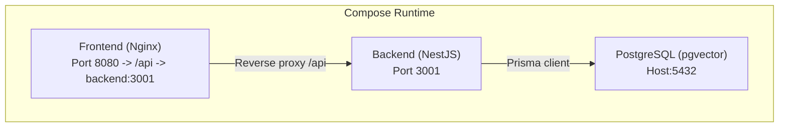

**Diagram sources**
- [docker-compose.yml:1-68](file://docker-compose.yml#L1-L68)
- [frontend/Dockerfile:23-56](file://frontend/Dockerfile#L23-L56)
- [backend/Dockerfile:75-78](file://backend/Dockerfile#L75-L78)

**Section sources**
- [docker-compose.yml:1-68](file://docker-compose.yml#L1-L68)
- [backend/Dockerfile:1-83](file://backend/Dockerfile#L1-L83)
- [frontend/Dockerfile:1-63](file://frontend/Dockerfile#L1-L63)

## Core Components
- Backend API
  - Multi-stage Docker build with pinned Node.js runtime, non-root user, and minimal production image
  - Health endpoints for liveness and readiness
  - Structured logging with Pino and redaction
  - Error tracking with Sentry
  - Environment-driven configuration and CORS policy
- Frontend
  - Static build served by Nginx unprivileged image with SPA fallback and reverse proxy to backend
- Database
  - PostgreSQL with pgvector extension for vector similarity
  - Prisma schema defines vector columns and indexes
- Orchestration
  - Docker Compose for local dev
  - Fly.io and Railway platform manifests for production

**Section sources**
- [backend/Dockerfile:1-83](file://backend/Dockerfile#L1-L83)
- [backend/src/main.ts:1-143](file://backend/src/main.ts#L1-L143)
- [backend/src/app.module.ts:1-172](file://backend/src/app.module.ts#L1-L172)
- [backend/src/health/health.controller.ts:1-121](file://backend/src/health/health.controller.ts#L1-L121)
- [backend/prisma/schema.prisma:1-838](file://backend/prisma/schema.prisma#L1-L838)
- [frontend/Dockerfile:1-63](file://frontend/Dockerfile#L1-L63)

## Architecture Overview
The system comprises three primary containers orchestrated by Docker Compose:
- PostgreSQL with pgvector extension for vector embeddings
- Backend API exposing REST and WebSocket endpoints with health checks
- Frontend Nginx proxying API requests to the backend and serving static assets

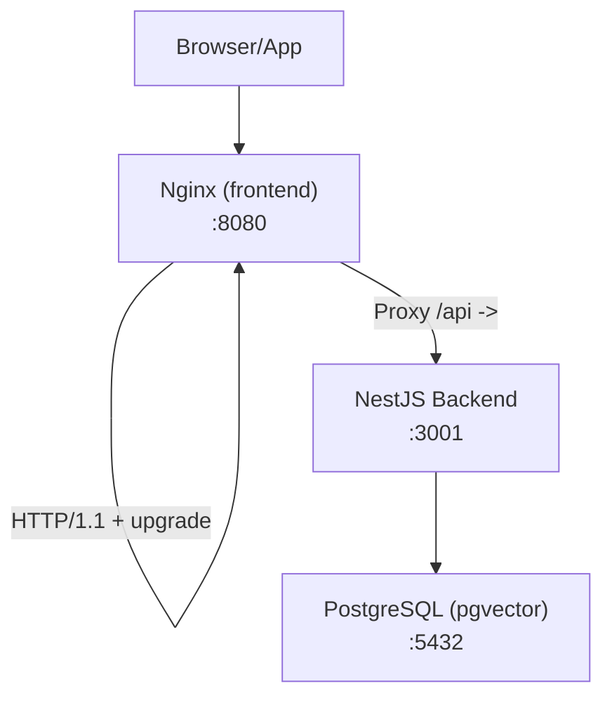

**Diagram sources**
- [docker-compose.yml:19-63](file://docker-compose.yml#L19-L63)
- [frontend/Dockerfile:42-55](file://frontend/Dockerfile#L42-L55)
- [backend/Dockerfile:75-78](file://backend/Dockerfile#L75-L78)

## Detailed Component Analysis

### Backend Containerization (Multi-stage Docker)
- Build stages:
  - deps: cache-friendly dependency installation
  - build: TypeScript compilation and Prisma client generation
  - runtime: minimal production image with non-root user, dumb-init, and health checks
- Security hardening:
  - Pinned Node.js Alpine base image
  - Non-root uid/gid
  - Production-only dependency install
  - Health checks probe /api/livez and /api/readyz
- Entrypoint uses dumb-init to forward signals for graceful shutdown

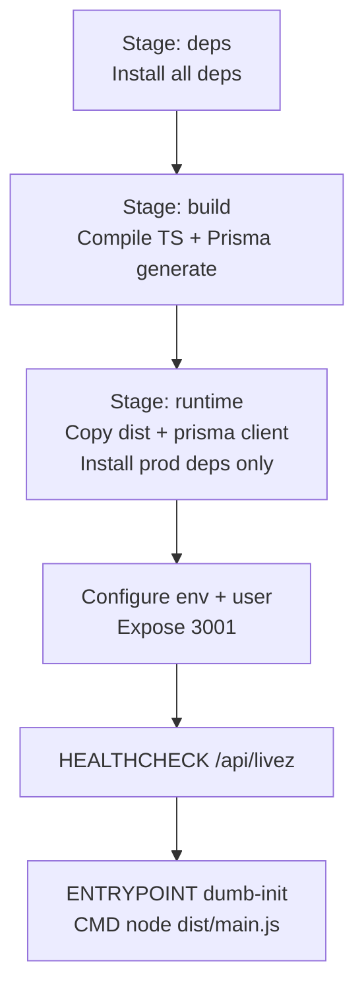

**Diagram sources**
- [backend/Dockerfile:22-83](file://backend/Dockerfile#L22-L83)

**Section sources**
- [backend/Dockerfile:1-83](file://backend/Dockerfile#L1-L83)

### Frontend Containerization (Nginx Unprivileged)
- Multi-stage build:
  - builder stage compiles the Vite app
  - runtime stage serves static assets via nginxinc/nginx-unprivileged
- Reverse proxy:
  - Routes /api to backend:3001
  - Enables WebSocket upgrades and long timeouts for streaming
- Health check probes / on :8080

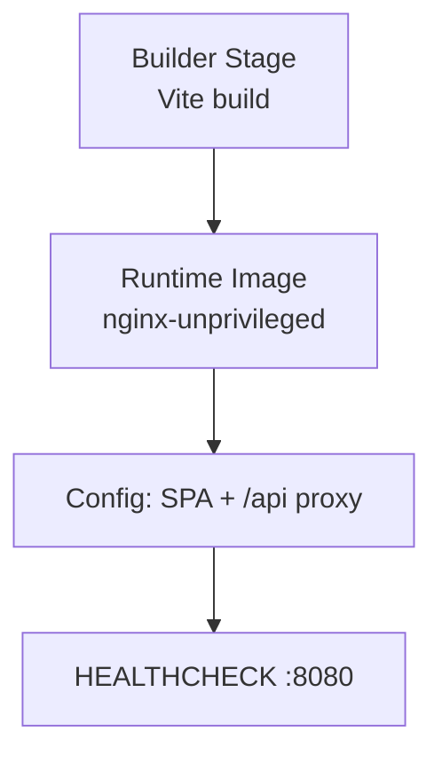

**Diagram sources**
- [frontend/Dockerfile:6-63](file://frontend/Dockerfile#L6-L63)

**Section sources**
- [frontend/Dockerfile:1-63](file://frontend/Dockerfile#L1-L63)

### Database Setup (PostgreSQL with pgvector)
- Image: ankane/pgvector:latest
- Volumes: named volume for persistence
- Health check: pg_isready with configured credentials
- Schema: vector extension enabled; Prisma models define vector columns and indexes

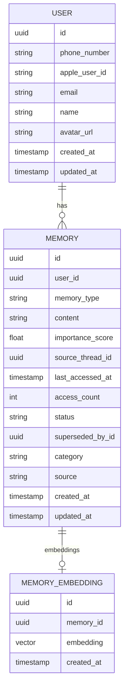

**Diagram sources**
- [backend/prisma/schema.prisma:1-838](file://backend/prisma/schema.prisma#L1-L838)

**Section sources**
- [docker-compose.yml:2-17](file://docker-compose.yml#L2-L17)
- [backend/prisma/schema.prisma:1-838](file://backend/prisma/schema.prisma#L1-L838)
- [backend/check-db.sql:1-8](file://backend/check-db.sql#L1-L8)

### Load Balancing and SSL/TLS
- Backend exposes HTTPS enforcement in Fly.io configuration
- Readiness probe ensures degraded instances are removed from load balancers
- Frontend Nginx reverse proxy handles WebSocket upgrades and long polling for streaming

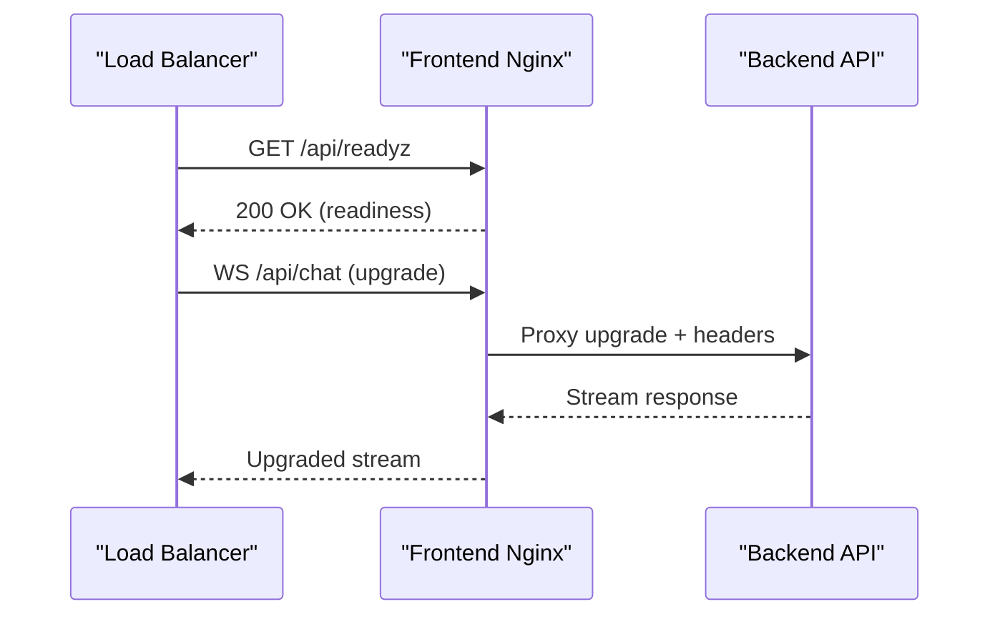

**Diagram sources**
- [backend/fly.toml:32-54](file://backend/fly.toml#L32-L54)
- [frontend/Dockerfile:42-55](file://frontend/Dockerfile#L42-L55)
- [backend/src/health/health.controller.ts:52-106](file://backend/src/health/health.controller.ts#L52-L106)

**Section sources**
- [backend/fly.toml:1-70](file://backend/fly.toml#L1-L70)
- [frontend/Dockerfile:1-63](file://frontend/Dockerfile#L1-L63)
- [backend/src/health/health.controller.ts:1-121](file://backend/src/health/health.controller.ts#L1-L121)

### Deployment Platforms

#### Fly.io
- App configuration:
  - Uses Dockerfile in backend/
  - Internal port 3001
  - Force HTTPS, auto-stop machines, minimum 1 machine running
  - Rolling deployment strategy
- Health checks:
  - /api/livez and /api/readyz with intervals and timeouts
- Secrets:
  - Store DATABASE_URL, JWT_SECRET, API keys, CORS_ORIGINS via fly secrets
- Notes:
  - Uploads directory is not persistent; migrate to S3/R2 for production

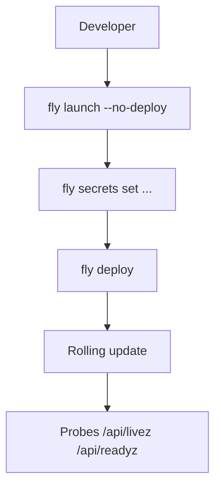

**Diagram sources**
- [backend/fly.toml:1-70](file://backend/fly.toml#L1-L70)

**Section sources**
- [backend/fly.toml:1-70](file://backend/fly.toml#L1-L70)

#### Railway
- Build:
  - DOCKERFILE path to backend/Dockerfile
- Deploy:
  - Start command runs Prisma migrations then starts the app
  - Health check path /api/livez with timeout
  - Restart policy on failure

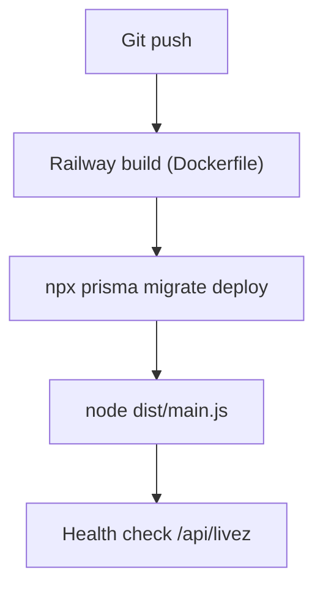

**Diagram sources**
- [backend/railway.json:1-15](file://backend/railway.json#L1-L15)

**Section sources**
- [backend/railway.json:1-15](file://backend/railway.json#L1-L15)

### Environment Configuration and Secrets Management
- Backend:
  - Required: DATABASE_URL, JWT_SECRET, OPENROUTER_API_KEY
  - Optional: Twilio, Tavily, E2B, Admin secret, CORS_ORIGINS, TTS model
  - CORS_ORIGINS enforced in production
- Frontend:
  - Built statically; runtime configuration is handled by backend
- Compose:
  - Development override sets NODE_ENV=development and bind-mounts source for hot reload
- Sentry:
  - Initialized early; redacts sensitive fields from events and logs

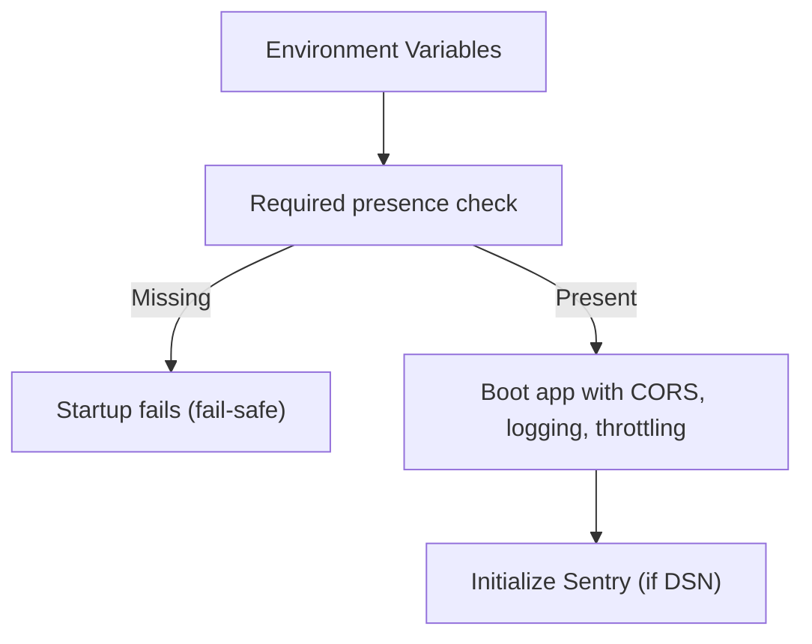

**Diagram sources**
- [backend/src/health/health.controller.ts:70-87](file://backend/src/health/health.controller.ts#L70-L87)
- [backend/src/main.ts:68-80](file://backend/src/main.ts#L68-L80)
- [backend/src/sentry.ts:14-50](file://backend/src/sentry.ts#L14-L50)

**Section sources**
- [docker-compose.yml:24-40](file://docker-compose.yml#L24-L40)
- [docker-compose.override.yml:21-29](file://docker-compose.override.yml#L21-L29)
- [backend/src/health/health.controller.ts:70-87](file://backend/src/health/health.controller.ts#L70-L87)
- [backend/src/main.ts:68-80](file://backend/src/main.ts#L68-L80)
- [backend/src/sentry.ts:14-50](file://backend/src/sentry.ts#L14-L50)

### Persistent Data and Volume Mounting
- PostgreSQL:
  - Named volume mounted at /var/lib/postgresql/data
- Backend uploads:
  - Named volume mounted at /app/uploads
  - In Fly, uploads are not persistent by default; migrate to S3/R2
- Recommendations:
  - Use managed object storage for avatars and KW documents
  - Back up the Postgres volume regularly

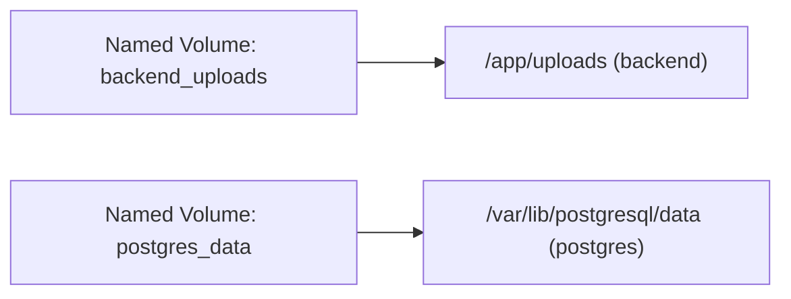

**Diagram sources**
- [docker-compose.yml:48-51](file://docker-compose.yml#L48-L51)
- [docker-compose.yml:11-12](file://docker-compose.yml#L11-L12)
- [backend/fly.toml:16-17](file://backend/fly.toml#L16-L17)

**Section sources**
- [docker-compose.yml:48-51](file://docker-compose.yml#L48-L51)
- [docker-compose.yml:11-12](file://docker-compose.yml#L11-L12)
- [backend/fly.toml:16-17](file://backend/fly.toml#L16-L17)

### Monitoring and Logging
- Logging:
  - Pino structured logging with redaction of sensitive fields
  - Request correlation ids, lean serializers, auto-logging with exceptions
- Health endpoints:
  - /api/livez (liveness), /api/readyz (readiness), legacy /api/health
- Error tracking:
  - Sentry initialization with beforeSend redaction
- Observability:
  - Probes configured on Fly.io and Railway
  - Consider adding application metrics and log aggregation in front of containers

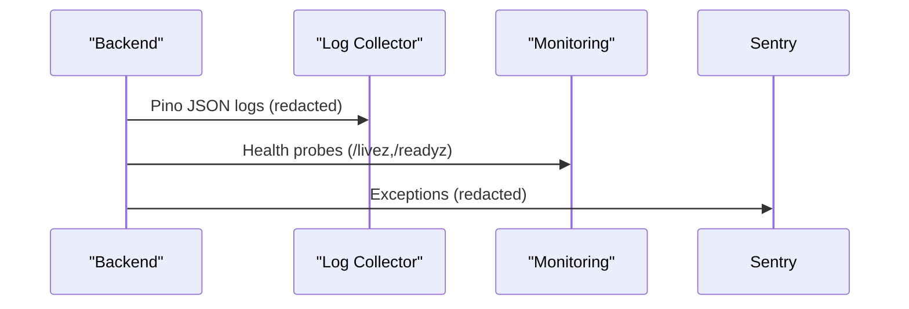

**Diagram sources**
- [backend/src/app.module.ts:48-124](file://backend/src/app.module.ts#L48-L124)
- [backend/src/health/health.controller.ts:27-106](file://backend/src/health/health.controller.ts#L27-L106)
- [backend/src/sentry.ts:14-50](file://backend/src/sentry.ts#L14-L50)

**Section sources**
- [backend/src/app.module.ts:1-172](file://backend/src/app.module.ts#L1-L172)
- [backend/src/health/health.controller.ts:1-121](file://backend/src/health/health.controller.ts#L1-L121)
- [backend/src/sentry.ts:1-57](file://backend/src/sentry.ts#L1-L57)

### Backup and Recovery Procedures
- Database backup:
  - Use pg_dump to export schema and data; schedule periodic backups to secure storage
- Application data:
  - For uploads, ensure migration to S3/R2; maintain versioned buckets
- Recovery:
  - Restore Postgres from latest backup; re-run Prisma migrations; restart backend
- Disaster recovery:
  - Maintain backups offsite; test restore procedures quarterly

[No sources needed since this section provides general guidance]

### Scaling and Performance Tuning
- Horizontal scaling:
  - Stateless backend scales horizontally; LLM streaming is I/O bound
  - Consider Redis for shared rate-limit state across instances
- Resource sizing:
  - Start with 1 shared-cpu-1x VM with 1 GB RAM on Fly.io; monitor p95 latency
- Network and proxies:
  - Enable HTTPS at the edge; configure long timeouts for streaming endpoints
- Cost optimization:
  - Right-size VMs based on observed CPU and memory utilization
  - Consolidate services and reduce idle capacity during off-peak hours

[No sources needed since this section provides general guidance]

### Operational Runbooks

#### Routine Updates (Rolling Deploy)
- Prepare:
  - Tag and push images; verify migrations succeed locally
- Deploy:
  - Fly: fly deploy
  - Railway: push to main branch; platform builds and runs release_command
- Validate:
  - Observe /api/livez and /api/readyz; confirm no 5xx errors

**Section sources**
- [backend/fly.toml:67-70](file://backend/fly.toml#L67-L70)
- [backend/railway.json:7-13](file://backend/railway.json#L7-L13)

#### Rollbacks
- Immediate rollback:
  - Re-deploy previous working image/tag
- If DB migrations were applied:
  - Use Prisma to revert migrations to the prior version
- Communication:
  - Notify stakeholders; monitor metrics and logs post-rollback

[No sources needed since this section provides general guidance]

#### Incident Response
- Symptoms:
  - 503 readiness failures, elevated error rates, slow latencies
- Steps:
  - Check /api/readyz for failing checks (DB, config)
  - Review Pino logs for correlation ids; filter by error level
  - Verify Sentry for recent exceptions
  - Scale up temporarily; investigate root cause
- Postmortem:
  - Document findings, remediation steps, and preventive measures

**Section sources**
- [backend/src/health/health.controller.ts:52-106](file://backend/src/health/health.controller.ts#L52-L106)
- [backend/src/app.module.ts:111-123](file://backend/src/app.module.ts#L111-L123)
- [backend/src/sentry.ts:14-50](file://backend/src/sentry.ts#L14-L50)

## Dependency Analysis
- Backend depends on:
  - Prisma client and database connectivity
  - Optional external services (OpenRouter, Twilio, Tavily, E2B)
  - Sentry for error reporting
- Frontend depends on:
  - Backend API for all data and features
- Compose ties services together with health checks and dependency ordering

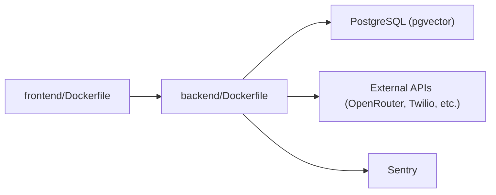

**Diagram sources**
- [frontend/Dockerfile:1-63](file://frontend/Dockerfile#L1-L63)
- [backend/Dockerfile:1-83](file://backend/Dockerfile#L1-L83)
- [backend/package.json:27-72](file://backend/package.json#L27-L72)

**Section sources**
- [backend/package.json:1-96](file://backend/package.json#L1-L96)
- [frontend/package.json:1-35](file://frontend/package.json#L1-L35)
- [docker-compose.yml:19-63](file://docker-compose.yml#L19-L63)

## Performance Considerations
- Containerization:
  - Multi-stage builds minimize attack surface and image size
  - Non-root users and dumb-init improve stability and security
- Database:
  - Use pgvector indexes and queries efficiently; monitor vector similarity performance
- API:
  - Compression disabled for SSE streams; body size limits mitigate abuse
  - Rate limiting via @Throttle guards
- Observability:
  - Health probes inform load balancers; Sentry captures errors

[No sources needed since this section provides general guidance]

## Troubleshooting Guide
- Startup fails with CORS error:
  - Ensure CORS_ORIGINS is set in production
- Readiness probe fails:
  - Check DATABASE_URL and JWT_SECRET; verify DB connectivity and migrations
- Sentry not capturing errors:
  - Verify SENTRY_DSN is set; check beforeSend redaction logic
- Uploads not visible:
  - In production, serve uploads via authenticated routes or signed URLs; migrate to S3/R2

**Section sources**
- [backend/src/main.ts:68-80](file://backend/src/main.ts#L68-L80)
- [backend/src/health/health.controller.ts:70-87](file://backend/src/health/health.controller.ts#L70-L87)
- [backend/src/sentry.ts:14-50](file://backend/src/sentry.ts#L14-L50)
- [backend/fly.toml:16-17](file://backend/fly.toml#L16-L17)

## Conclusion
This guide consolidates 4Ever’s deployment and operations practices across containerization, infrastructure, platform deployments, observability, and runbooks. By following the outlined strategies—multi-stage Docker builds, robust health checks, secure secrets management, scalable platform configurations, and disciplined monitoring—you can operate 4Ever reliably and cost-effectively.

## Appendices

### Appendix A: Local Development with Docker Compose
- Start all services: docker compose up
- Development overrides:
  - NODE_ENV=development
  - Bind-mounts for hot reload
  - Backend command uses start:dev

**Section sources**
- [docker-compose.yml:1-68](file://docker-compose.yml#L1-L68)
- [docker-compose.override.yml:1-33](file://docker-compose.override.yml#L1-L33)

### Appendix B: Health Endpoint Definitions
- /api/livez: liveness probe (process-level)
- /api/readyz: readiness probe (DB + required config)
- /api/health: legacy compatibility

**Section sources**
- [backend/src/health/health.controller.ts:27-119](file://backend/src/health/health.controller.ts#L27-L119)