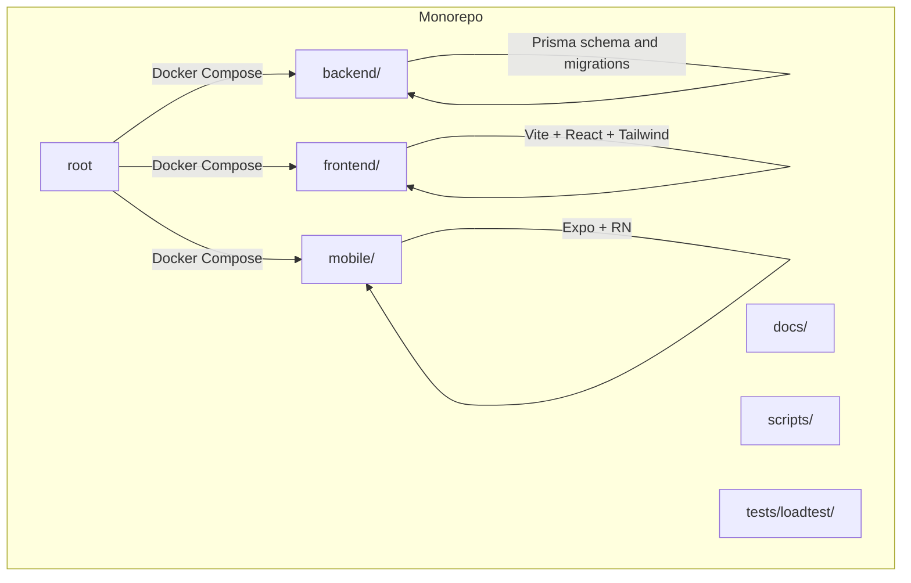
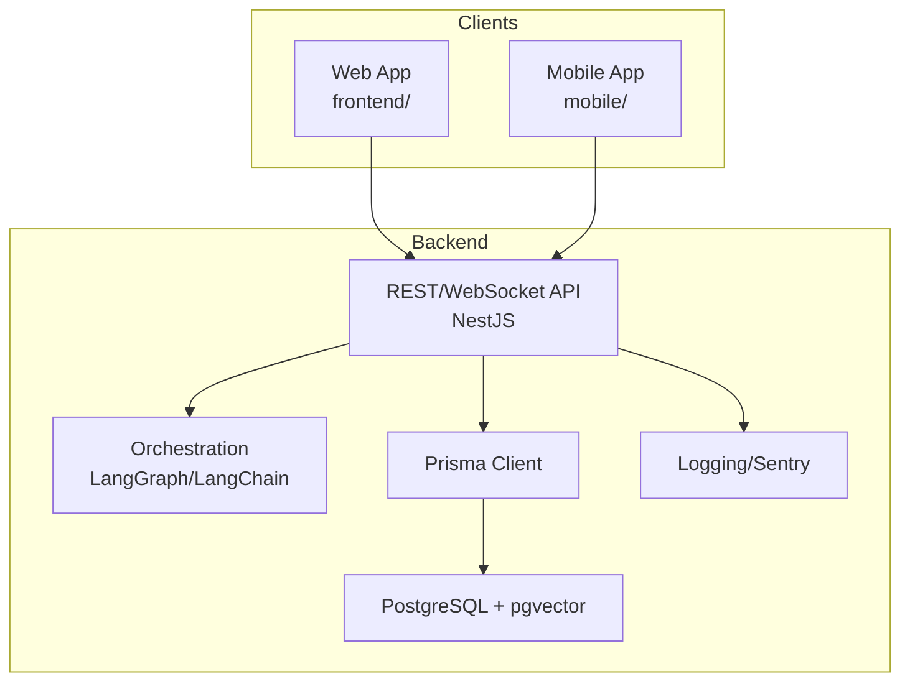
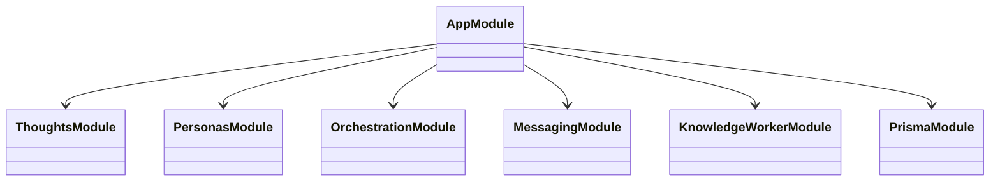
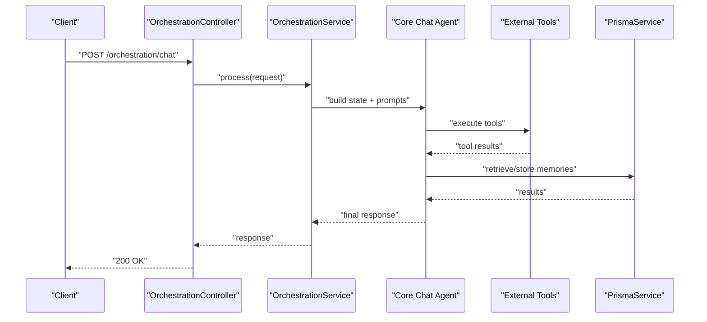
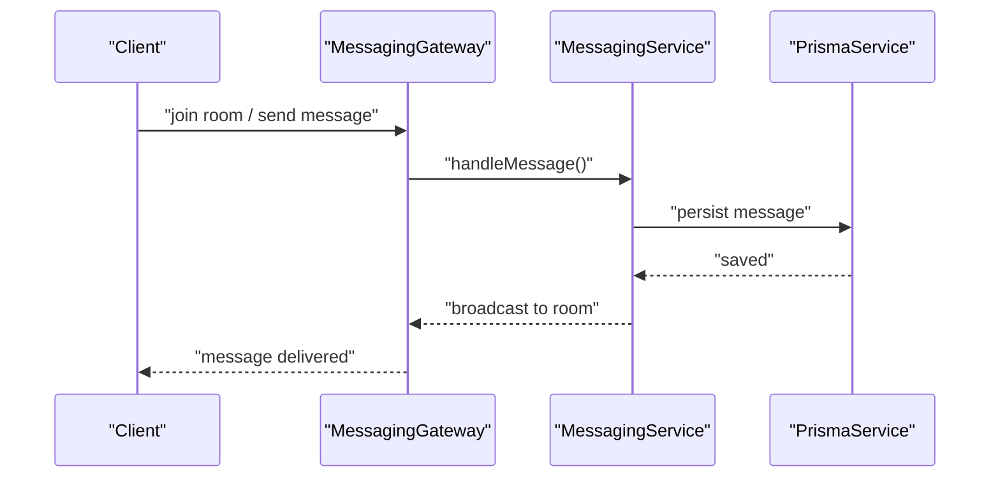
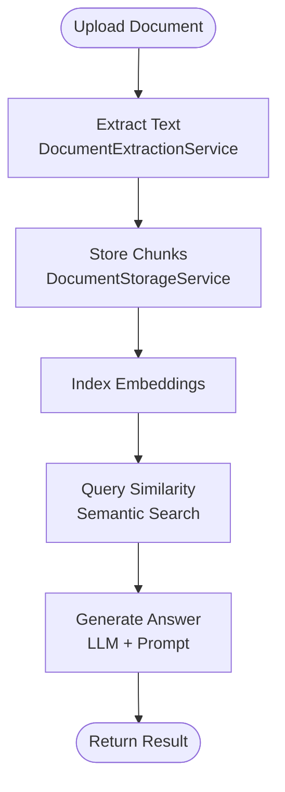
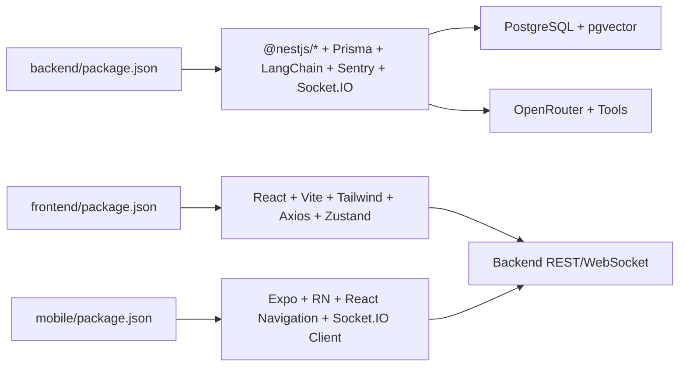

# Development Guide

<cite>
**Referenced Files in This Document**
- [README.md](file://README.md)
- [package.json](file://package.json)
- [backend/package.json](file://backend/package.json)
- [frontend/package.json](file://frontend/package.json)
- [mobile/package.json](file://mobile/package.json)
- [backend/tsconfig.json](file://backend/tsconfig.json)
- [frontend/tsconfig.json](file://frontend/tsconfig.json)
- [mobile/tsconfig.json](file://mobile/tsconfig.json)
- [backend/jest.config.js](file://backend/jest.config.js)
- [backend/nest-cli.json](file://backend/nest-cli.json)
- [frontend/vite.config.ts](file://frontend/vite.config.ts)
- [frontend/tailwind.config.js](file://frontend/tailwind.config.js)
- [backend/prisma.config.ts](file://backend/prisma.config.ts)
- [backend/Dockerfile](file://backend/Dockerfile)
- [docker-compose.yml](file://docker-compose.yml)
- [backend/fly.toml](file://backend/fly.toml)
- [backend/railway.json](file://backend/railway.json)
- [backend/check-db.sql](file://backend/check-db.sql)
- [backend/scripts/clean-leaked-prefixes.js](file://backend/scripts/clean-leaked-prefixes.js)
- [backend/scripts/ontology-backfill.ts](file://backend/scripts/ontology-backfill.ts)
- [backend/scripts/peek-session.js](file://backend/scripts/peek-session.js)
- [backend/scripts/seed-persona-templates.ts](file://backend/scripts/seed-persona-templates.ts)
- [backend/src/main.ts](file://backend/src/main.ts)
- [backend/src/app.module.ts](file://backend/src/app.module.ts)
- [backend/src/sentry.ts](file://backend/src/sentry.ts)
- [backend/src/common/sentry-exception.filter.ts](file://backend/src/common/sentry-exception.filter.ts)
- [backend/src/auth/auth.module.ts](file://backend/src/auth/auth.module.ts)
- [backend/src/auth/auth.service.ts](file://backend/src/auth/auth.service.ts)
- [backend/src/users/users.module.ts](file://backend/src/users/users.module.ts)
- [backend/src/users/users.service.ts](file://backend/src/users/users.service.ts)
- [backend/src/orchestration/orchestration.module.ts](file://backend/src/orchestration/orchestration.module.ts)
- [backend/src/orchestration/orchestration.service.ts](file://backend/src/orchestration/orchestration.service.ts)
- [backend/src/messaging/messaging.module.ts](file://backend/src/messaging/messaging.module.ts)
- [backend/src/messaging/messaging.service.ts](file://backend/src/messaging/messaging.service.ts)
- [backend/src/knowledge-worker/knowledge-worker.module.ts](file://backend/src/knowledge-worker/knowledge-worker.module.ts)
- [backend/src/knowledge-worker/knowledge-worker.service.ts](file://backend/src/knowledge-worker/knowledge-worker.service.ts)
- [backend/src/health/health.module.ts](file://backend/src/health/health.module.ts)
- [backend/src/health/health.controller.ts](file://backend/src/health/health.controller.ts)
- [backend/src/admin/admin.module.ts](file://backend/src/admin/admin.module.ts)
- [backend/src/admin/admin.controller.ts](file://backend/src/admin/admin.controller.ts)
- [backend/src/admin/admin-secret.guard.ts](file://backend/src/admin/admin-secret.guard.ts)
- [backend/src/consent/consent.module.ts](file://backend/src/consent/consent.module.ts)
- [backend/src/consent/consent.service.ts](file://backend/src/consent/consent.service.ts)
- [backend/src/dimensions/dimensions.module.ts](file://backend/src/dimensions/dimensions.module.ts)
- [backend/src/dimensions/dimensions.service.ts](file://backend/src/dimensions/dimensions.service.ts)
- [backend/src/insights/insights.module.ts](file://backend/src/insights/insights.module.ts)
- [backend/src/insights/insights.service.ts](file://backend/src/insights/insights.service.ts)
- [backend/src/knowledge-base/knowledge-base.module.ts](file://backend/src/knowledge-base/knowledge-base.module.ts)
- [backend/src/knowledge-base/knowledge-base.service.ts](file://backend/src/knowledge-base/knowledge-base.service.ts)
- [backend/src/life-events/life-events.module.ts](file://backend/src/life-events/life-events.module.ts)
- [backend/src/life-events/life-events.service.ts](file://backend/src/life-events/life-events.service.ts)
- [backend/src/planner/planner.module.ts](file://backend/src/planner/planner.module.ts)
- [backend/src/planner/planner.service.ts](file://backend/src/planner/planner.service.ts)
- [backend/src/reflections/reflections.module.ts](file://backend/src/reflections/reflections.module.ts)
- [backend/src/reflections/reflections.service.ts](file://backend/src/reflections/reflections.service.ts)
- [backend/src/relationships/relationships.module.ts](file://backend/src/relationships/relationships.module.ts)
- [backend/src/relationships/relationships.service.ts](file://backend/src/relationships/relationships.service.ts)
- [backend/src/rituals/rituals.module.ts](file://backend/src/rituals/rituals.module.ts)
- [backend/src/rituals/rituals.service.ts](file://backend/src/rituals/rituals.service.ts)
- [backend/src/tensions/tensions.module.ts](file://backend/src/tensions/tensions.module.ts)
- [backend/src/tensions/tensions.service.ts](file://backend/src/tensions/tensions.service.ts)
- [backend/src/thoughts/thoughts.module.ts](file://backend/src/thoughts/thoughts.module.ts)
- [backend/src/thoughts/thoughts.service.ts](file://backend/src/thoughts/thoughts.service.ts)
- [backend/src/actions/actions.module.ts](file://backend/src/actions/actions.module.ts)
- [backend/src/actions/actions.service.ts](file://backend/src/actions/actions.service.ts)
- [backend/src/checkin/checkin.module.ts](file://backend/src/checkin/checkin.module.ts)
- [backend/src/checkin/checkin.service.ts](file://backend/src/checkin/checkin.service.ts)
- [backend/src/personas/personas.module.ts](file://backend/src/personas/personas.module.ts)
- [backend/src/personas/personas.service.ts](file://backend/src/personas/personas.service.ts)
- [backend/src/prisma/prisma.module.ts](file://backend/src/prisma/prisma.module.ts)
- [backend/src/prisma/prisma.service.ts](file://backend/src/prisma/prisma.service.ts)
- [backend/src/skills/skills.module.ts](file://backend/src/skills/skills.module.ts)
- [backend/src/skills/skills.service.ts](file://backend/src/skills/skills.service.ts)
- [backend/src/support/support.module.ts](file://backend/src/support/support.module.ts)
- [backend/src/support/support.controller.ts](file://backend/src/support/support.controller.ts)
- [backend/src/usage/usage.module.ts](file://backend/src/usage/usage.module.ts)
- [backend/src/usage/usage.service.ts](file://backend/src/usage/usage.service.ts)
- [frontend/src/main.tsx](file://frontend/src/main.tsx)
- [frontend/src/App.tsx](file://frontend/src/App.tsx)
- [frontend/src/index.css](file://frontend/src/index.css)
- [frontend/src/api/client.ts](file://frontend/src/api/client.ts)
- [frontend/src/pages/Dashboard.tsx](file://frontend/src/pages/Dashboard.tsx)
- [frontend/src/store/authStore.ts](file://frontend/src/store/authStore.ts)
- [frontend/src/components/Layout.tsx](file://frontend/src/components/Layout.tsx)
- [mobile/App.tsx](file://mobile/App.tsx)
- [mobile/src/api/client.ts](file://mobile/src/api/client.ts)
- [mobile/src/constants/config.ts](file://mobile/src/constants/config.ts)
- [mobile/src/navigation/AppNavigator.tsx](file://mobile/src/navigation/AppNavigator.tsx)
- [mobile/src/screens/DashboardScreen.tsx](file://mobile/src/screens/DashboardScreen.tsx)
- [mobile/src/store/authStore.ts](file://mobile/src/store/authStore.ts)
- [mobile/eas.json](file://mobile/eas.json)
- [mobile/app.json](file://mobile/app.json)
- [mobile/tsconfig.json](file://mobile/tsconfig.json)
- [tests/loadtest/smoke.js](file://tests/loadtest/smoke.js)
- [scripts/scan-secrets.js](file://scripts/scan-secrets.js)
</cite>

## Table of Contents
1. [Introduction](#introduction)
2. [Project Structure](#project-structure)
3. [Core Components](#core-components)
4. [Architecture Overview](#architecture-overview)
5. [Detailed Component Analysis](#detailed-component-analysis)
6. [Dependency Analysis](#dependency-analysis)
7. [Performance Considerations](#performance-considerations)
8. [Troubleshooting Guide](#troubleshooting-guide)
9. [Contribution Guidelines](#contribution-guidelines)
10. [Release Management](#release-management)
11. [Development Tools and IDE Configurations](#development-tools-and-ide-configurations)
12. [Debugging and Profiling](#debugging-and-profiling)
13. [Extending Features and Maintaining Compatibility](#extending-features-and-maintaining-compatibility)
14. [Conclusion](#conclusion)

## Introduction
This guide provides comprehensive development standards and workflows for contributing to 4Ever. It covers code quality (TypeScript, ESLint, Prettier), commit conventions, branch strategies, local setup, testing, pull requests, project structure conventions, architectural guidelines, contribution processes, release management, tools and IDE configs, debugging, performance profiling, and extension practices while preserving backward compatibility.

## Project Structure
4Ever is a monorepo organized by platform:
- backend: NestJS API with Prisma ORM, AI orchestration, and domain modules
- frontend: React SPA with Vite, Tailwind CSS, and Zustand stores
- mobile: Expo/RN app with native navigation and stores
- docs: Legal and policy documents
- scripts: Repo-wide automation helpers
- tests/loadtest: Load testing harness
- Root: Shared repo metadata and top-level scripts

**Diagram sources**
- [README.md:128-162](file://README.md#L128-L162)
- [docker-compose.yml](file://docker-compose.yml)

**Section sources**
- [README.md:128-162](file://README.md#L128-L162)
- [backend/package.json:1-96](file://backend/package.json#L1-L96)
- [frontend/package.json:1-35](file://frontend/package.json#L1-L35)
- [mobile/package.json:1-52](file://mobile/package.json#L1-L52)

## Core Components
- Backend (NestJS)
  - Modules: auth, users, thoughts, personas, orchestration, relationships, rituals, life-events, tensions, planner, checkin, insights, reflections, knowledge-base, messaging, admin, consent, dimensions, health, skills, support, usage, prisma
  - Services: domain services implement business logic; Prisma service provides typed database access
  - Orchestration: LangGraph/LangChain agents coordinate persona and system tools
- Frontend (React + Vite)
  - Pages: 16+ route-based pages
  - Stores: Zustand for global state (auth, messaging, persona, subscription, thought)
  - API: Typed clients per domain
- Mobile (Expo + RN)
  - Screens: 20+ screens mirroring core flows
  - Stores: Zustand for auth, messaging, persona, subscription, thought, voice
  - Navigation: Native stack navigator

Key conventions:
- Feature-based module organization in backend
- Domain-driven DTOs and services
- Strict typing via TypeScript across platforms
- Centralized asset bundling and proxying in frontend
- Consistent naming: PascalCase for components, kebab-case for routes, camelCase for hooks/stores

**Section sources**
- [README.md:128-162](file://README.md#L128-L162)
- [backend/src/app.module.ts](file://backend/src/app.module.ts)
- [frontend/src/pages/Dashboard.tsx](file://frontend/src/pages/Dashboard.tsx)
- [mobile/src/screens/DashboardScreen.tsx](file://mobile/src/screens/DashboardScreen.tsx)

## Architecture Overview
High-level runtime architecture:
- Frontend and Mobile communicate with Backend via REST/WebSocket
- Backend orchestrates AI agents and interacts with PostgreSQL + pgvector via Prisma
- Sentry captures errors; Health endpoint exposes readiness
- Docker Compose runs Postgres, Backend, and Frontend

**Diagram sources**
- [README.md:25-34](file://README.md#L25-L34)
- [backend/src/sentry.ts](file://backend/src/sentry.ts)
- [backend/src/health/health.controller.ts](file://backend/src/health/health.controller.ts)
- [backend/src/prisma/prisma.service.ts](file://backend/src/prisma/prisma.service.ts)

## Detailed Component Analysis

### Backend Module Organization
Backend follows a modular, domain-driven layout. Each domain (e.g., thoughts, personas, orchestration) encapsulates:
- controller: HTTP endpoints
- service: business logic
- module: DI wiring
- dto: request/response validation
- optional: gateway/service for real-time features

**Diagram sources**
- [backend/src/app.module.ts](file://backend/src/app.module.ts)
- [backend/src/thoughts/thoughts.module.ts](file://backend/src/thoughts/thoughts.module.ts)
- [backend/src/personas/personas.module.ts](file://backend/src/personas/personas.module.ts)
- [backend/src/orchestration/orchestration.module.ts](file://backend/src/orchestration/orchestration.module.ts)
- [backend/src/messaging/messaging.module.ts](file://backend/src/messaging/messaging.module.ts)
- [backend/src/knowledge-worker/knowledge-worker.module.ts](file://backend/src/knowledge-worker/knowledge-worker.module.ts)
- [backend/src/prisma/prisma.module.ts](file://backend/src/prisma/prisma.module.ts)

**Section sources**
- [backend/src/app.module.ts](file://backend/src/app.module.ts)
- [backend/src/thoughts/thoughts.module.ts](file://backend/src/thoughts/thoughts.module.ts)
- [backend/src/personas/personas.module.ts](file://backend/src/personas/personas.module.ts)
- [backend/src/orchestration/orchestration.module.ts](file://backend/src/orchestration/orchestration.module.ts)
- [backend/src/messaging/messaging.module.ts](file://backend/src/messaging/messaging.module.ts)
- [backend/src/knowledge-worker/knowledge-worker.module.ts](file://backend/src/knowledge-worker/knowledge-worker.module.ts)
- [backend/src/prisma/prisma.module.ts](file://backend/src/prisma/prisma.module.ts)

### Orchestration Flow (Core Chat)
The orchestration pipeline coordinates persona and system tools to produce contextual responses.

**Diagram sources**
- [backend/src/orchestration/orchestration.controller.ts](file://backend/src/orchestration/orchestration.controller.ts)
- [backend/src/orchestration/orchestration.service.ts](file://backend/src/orchestration/orchestration.service.ts)
- [backend/src/orchestration/graph/core-chat-agent.ts](file://backend/src/orchestration/graph/core-chat-agent.ts)
- [backend/src/orchestration/graph/thought-analysis.graph.ts](file://backend/src/orchestration/graph/thought-analysis.graph.ts)
- [backend/src/prisma/prisma.service.ts](file://backend/src/prisma/prisma.service.ts)

**Section sources**
- [backend/src/orchestration/orchestration.controller.ts](file://backend/src/orchestration/orchestration.controller.ts)
- [backend/src/orchestration/orchestration.service.ts](file://backend/src/orchestration/orchestration.service.ts)
- [backend/src/orchestration/graph/core-chat-agent.ts](file://backend/src/orchestration/graph/core-chat-agent.ts)
- [backend/src/orchestration/graph/thought-analysis.graph.ts](file://backend/src/orchestration/graph/thought-analysis.graph.ts)
- [backend/src/prisma/prisma.service.ts](file://backend/src/prisma/prisma.service.ts)

### Messaging Real-Time Updates
Real-time messaging uses Socket.IO with a dedicated gateway and service.

**Diagram sources**
- [backend/src/messaging/messaging.gateway.ts](file://backend/src/messaging/messaging.gateway.ts)
- [backend/src/messaging/messaging.service.ts](file://backend/src/messaging/messaging.service.ts)
- [backend/src/prisma/prisma.service.ts](file://backend/src/prisma/prisma.service.ts)

**Section sources**
- [backend/src/messaging/messaging.gateway.ts](file://backend/src/messaging/messaging.gateway.ts)
- [backend/src/messaging/messaging.service.ts](file://backend/src/messaging/messaging.service.ts)
- [backend/src/prisma/prisma.service.ts](file://backend/src/prisma/prisma.service.ts)

### Knowledge Worker Pipeline
Knowledge worker handles document ingestion and retrieval-augmented generation.

**Diagram sources**
- [backend/src/knowledge-worker/knowledge-worker.service.ts](file://backend/src/knowledge-worker/knowledge-worker.service.ts)
- [backend/src/knowledge-worker/services/document-extraction.service.ts](file://backend/src/knowledge-worker/services/document-extraction.service.ts)
- [backend/src/knowledge-worker/services/document-storage.service.ts](file://backend/src/knowledge-worker/services/document-storage.service.ts)

**Section sources**
- [backend/src/knowledge-worker/knowledge-worker.service.ts](file://backend/src/knowledge-worker/knowledge-worker.service.ts)
- [backend/src/knowledge-worker/services/document-extraction.service.ts](file://backend/src/knowledge-worker/services/document-extraction.service.ts)
- [backend/src/knowledge-worker/services/document-storage.service.ts](file://backend/src/knowledge-worker/services/document-storage.service.ts)

## Dependency Analysis
- Backend dependencies include NestJS, Prisma, LangChain/LangGraph, Sentry, Socket.IO, helmet, compression, and various tool integrations.
- Frontend depends on React, Vite, Tailwind, Axios, Socket.IO Client, Zustand, and related type packages.
- Mobile uses Expo, React Navigation, Socket.IO Client, Zustand, and Tailwind via nativewind.

**Diagram sources**
- [backend/package.json:1-96](file://backend/package.json#L1-L96)
- [frontend/package.json:1-35](file://frontend/package.json#L1-L35)
- [mobile/package.json:1-52](file://mobile/package.json#L1-L52)

**Section sources**
- [backend/package.json:1-96](file://backend/package.json#L1-L96)
- [frontend/package.json:1-35](file://frontend/package.json#L1-L35)
- [mobile/package.json:1-52](file://mobile/package.json#L1-L52)

## Performance Considerations
- Use database indexes and vector indexes as seen in migrations to optimize queries.
- Prefer streaming responses for long-running operations (e.g., knowledge worker).
- Cache frequently accessed data where appropriate.
- Monitor LLM token usage and quotas.
- Profile CPU/memory in development and production environments.

[No sources needed since this section provides general guidance]

## Troubleshooting Guide
Common areas to inspect:
- Health checks: Use the health endpoint to verify service readiness.
- Database connectivity: Verify connection string and migrations.
- Logging and error capture: Sentry integration and pino logger.
- Authentication: JWT guard and strategies.
- Real-time: Socket.IO gateway and messaging service.

**Section sources**
- [backend/src/health/health.controller.ts](file://backend/src/health/health.controller.ts)
- [backend/src/sentry.ts](file://backend/src/sentry.ts)
- [backend/src/common/sentry-exception.filter.ts](file://backend/src/common/sentry-exception.filter.ts)
- [backend/src/auth/jwt-auth.guard.ts](file://backend/src/auth/jwt-auth.guard.ts)
- [backend/src/messaging/messaging.gateway.ts](file://backend/src/messaging/messaging.gateway.ts)

## Contribution Guidelines
- Issue reporting
  - Provide environment details, steps to reproduce, expected vs actual behavior, and logs.
- Feature requests
  - Describe user story, acceptance criteria, and impact on existing features.
- Branch naming
  - Use: feature/<issue>-short-description, fix/<issue>-short-fix, chore/<description>, docs/<area>
- Commit messages
  - Type: feat, fix, docs, style, refactor, perf, test, build, ci, chore, revert
  - Example: feat(auth): add JWT refresh token flow
- Pull requests
  - Link related issues, include screenshots/videos for UI changes, run tests locally, keep diffs focused, and request review from maintainers.

[No sources needed since this section provides general guidance]

## Release Management
- Versioning
  - Follow semantic versioning; increment major for breaking changes, minor for features, patch for fixes.
- Changelog
  - Maintain a changelog summarizing changes grouped by type (Added, Changed, Fixed, Removed).
- Deployment
  - Backend supports containerization and cloud providers; use Docker Compose for local stacks and provider-specific configs for production.
- Rollback
  - Keep previous images/tags; rollback by redeploying prior tag.

**Section sources**
- [backend/Dockerfile](file://backend/Dockerfile)
- [docker-compose.yml](file://docker-compose.yml)
- [backend/fly.toml](file://backend/fly.toml)
- [backend/railway.json](file://backend/railway.json)

## Development Tools and IDE Configurations
- TypeScript
  - Backend: strict decorators, emit metadata, ES2021 target, path aliases
  - Frontend: strict, noEmit, JSX transform, path aliases
  - Mobile: extends Expo TS base
- ESLint and Prettier
  - Configure ESLint and Prettier in your editor; integrate with save hooks to auto-format and lint.
- IDE
  - VS Code recommended with extensions for TypeScript, Tailwind, Prettier, and ESLint.
- Pre-commit
  - Run linters and formatters before committing; consider pre-commit hooks.

**Section sources**
- [backend/tsconfig.json:1-27](file://backend/tsconfig.json#L1-L27)
- [frontend/tsconfig.json:1-26](file://frontend/tsconfig.json#L1-L26)
- [mobile/tsconfig.json:1-7](file://mobile/tsconfig.json#L1-L7)

## Debugging and Profiling
- Backend
  - Use debug script to attach inspector; run Jest with coverage; enable Sentry for error capture.
  - Use scripts for session inspection and data cleanup.
- Frontend
  - Use Vite dev server; enable React DevTools; inspect network tab for API calls.
- Mobile
  - Use Expo dev client; enable Flipper; inspect logs and network traffic.
- Profiling
  - Use browser profiling tools; Node profiler for backend; React DevTools profiler for frontend.

**Section sources**
- [backend/package.json:8-25](file://backend/package.json#L8-L25)
- [backend/scripts/peek-session.js](file://backend/scripts/peek-session.js)
- [backend/scripts/clean-leaked-prefixes.js](file://backend/scripts/clean-leaked-prefixes.js)
- [frontend/vite.config.ts:1-22](file://frontend/vite.config.ts#L1-L22)

## Extending Features and Maintaining Compatibility
- Backend
  - Add new domain modules following existing patterns: controller, service, module, dto.
  - Introduce new DTOs for validation; keep services pure and testable.
  - Migrate database changes via Prisma migrations; preserve backward compatibility where possible.
- Frontend
  - Add new pages under src/pages; create/use existing stores; export typed API clients.
- Mobile
  - Add new screens under src/screens; reuse stores and API clients.
- Backward compatibility
  - Avoid removing fields/APIs without deprecation; introduce new endpoints for breaking changes.
  - Provide migration paths and clear deprecation notices.

**Section sources**
- [backend/src/thoughts/thoughts.module.ts](file://backend/src/thoughts/thoughts.module.ts)
- [backend/src/thoughts/thoughts.service.ts](file://backend/src/thoughts/thoughts.service.ts)
- [frontend/src/pages/Dashboard.tsx](file://frontend/src/pages/Dashboard.tsx)
- [mobile/src/screens/DashboardScreen.tsx](file://mobile/src/screens/DashboardScreen.tsx)

## Code Standards and Tooling

### TypeScript Configuration
- Backend
  - Target ES2021, decorator metadata enabled, path alias @/*
- Frontend
  - Strict mode, JSX transform, path alias @/*
- Mobile
  - Extends Expo TS base with strict flag

**Section sources**
- [backend/tsconfig.json:1-27](file://backend/tsconfig.json#L1-L27)
- [frontend/tsconfig.json:1-26](file://frontend/tsconfig.json#L1-L26)
- [mobile/tsconfig.json:1-7](file://mobile/tsconfig.json#L1-L7)

### ESLint and Prettier
- Configure ESLint and Prettier in your editor; integrate with save hooks.
- Enforce consistent formatting and style across all platforms.

[No sources needed since this section provides general guidance]

### Commit Message Conventions
- Types: feat, fix, docs, style, refactor, perf, test, build, ci, chore, revert
- Example: feat(auth): add JWT refresh token flow

[No sources needed since this section provides general guidance]

### Branch Naming Strategies
- feature/<issue>-short-description
- fix/<issue>-short-fix
- chore/<description>
- docs/<area>

[No sources needed since this section provides general guidance]

### Local Setup
- Prerequisites: Node.js 20+, Docker Desktop, API keys
- Steps:
  - Install dependencies in backend and frontend
  - Copy and configure .env
  - Start Postgres with Docker
  - Run Prisma migrations
  - Start backend in watch mode
  - Start frontend dev server
  - Open http://localhost:5173

**Section sources**
- [README.md:35-87](file://README.md#L35-L87)

### Testing Procedures
- Backend
  - Unit tests: Jest with ts-jest preset
  - E2E tests: separate Jest config
  - Coverage: run coverage command
- Frontend
  - Use React testing utilities; mock API clients
- Mobile
  - Use Expo test runner; mock network and storage

**Section sources**
- [backend/jest.config.js:1-13](file://backend/jest.config.js#L1-L13)
- [backend/package.json:16-20](file://backend/package.json#L16-L20)

### Pull Request Process
- Link related issues
- Include screenshots/videos for UI changes
- Run tests locally
- Keep diffs focused
- Request review from maintainers

[No sources needed since this section provides general guidance]

### Project Structure Conventions
- Backend
  - Feature-based modules with controller/service/module/dto
  - Path alias @/src
- Frontend
  - src/pages for route components, src/store for state, src/api for typed clients
- Mobile
  - src/screens for views, src/store for state, src/api for typed clients

**Section sources**
- [backend/nest-cli.json:1-15](file://backend/nest-cli.json#L1-L15)
- [frontend/vite.config.ts:1-22](file://frontend/vite.config.ts#L1-L22)
- [mobile/tsconfig.json:1-7](file://mobile/tsconfig.json#L1-L7)

### Architectural Guidelines
- Domain-driven design in backend
- Centralized DTO validation
- Clear separation of concerns between controllers, services, and gateways
- Use Prisma for type-safe database operations
- Leverage LangGraph/LangChain for agent orchestration

**Section sources**
- [backend/src/app.module.ts](file://backend/src/app.module.ts)
- [backend/src/prisma/prisma.service.ts](file://backend/src/prisma/prisma.service.ts)
- [backend/src/orchestration/orchestration.service.ts](file://backend/src/orchestration/orchestration.service.ts)

### Release Management
- Versioning: semantic versioning
- Changelog: summarize changes by type
- Deployment: Docker Compose and provider configs

**Section sources**
- [backend/Dockerfile](file://backend/Dockerfile)
- [docker-compose.yml](file://docker-compose.yml)
- [backend/fly.toml](file://backend/fly.toml)
- [backend/railway.json](file://backend/railway.json)

### Development Tools and IDE Configurations
- TypeScript configs per platform
- Editor integration for ESLint/Prettier
- Pre-commit hooks recommended

**Section sources**
- [backend/tsconfig.json:1-27](file://backend/tsconfig.json#L1-L27)
- [frontend/tsconfig.json:1-26](file://frontend/tsconfig.json#L1-L26)
- [mobile/tsconfig.json:1-7](file://mobile/tsconfig.json#L1-L7)

### Debugging and Profiling
- Backend: debug script, Sentry, Jest coverage
- Frontend: Vite dev server, React DevTools
- Mobile: Expo dev client, Flipper

**Section sources**
- [backend/package.json:13-19](file://backend/package.json#L13-L19)
- [frontend/vite.config.ts:1-22](file://frontend/vite.config.ts#L1-L22)

### Extending Features and Maintaining Compatibility
- Follow existing module patterns
- Preserve backward compatibility; deprecate carefully
- Use Prisma migrations for schema changes

**Section sources**
- [backend/src/thoughts/thoughts.module.ts](file://backend/src/thoughts/thoughts.module.ts)
- [backend/src/thoughts/thoughts.service.ts](file://backend/src/thoughts/thoughts.service.ts)
- [backend/prisma.config.ts:1-15](file://backend/prisma.config.ts#L1-L15)

## Conclusion
This guide consolidates development standards, workflows, and architectural practices for contributing to 4Ever. By adhering to the outlined conventions—TypeScript configuration, testing, PR processes, module organization, and release practices—you can efficiently extend features while maintaining code quality and backward compatibility across the monorepo.