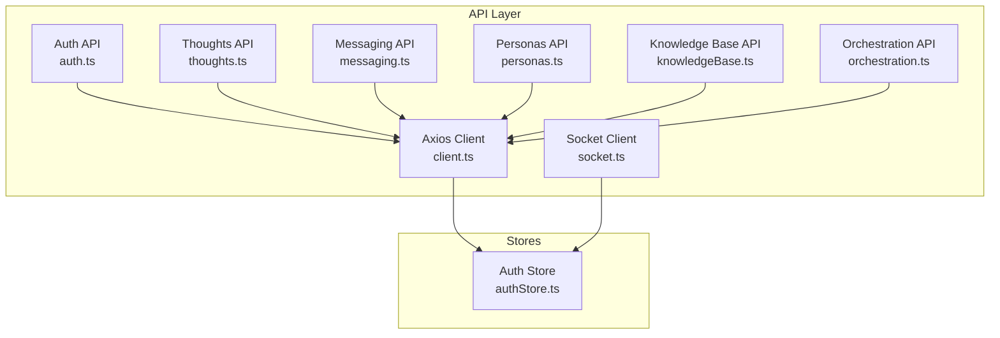
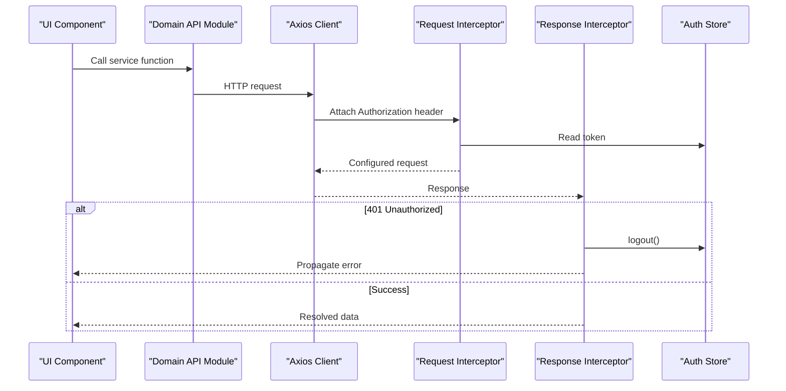
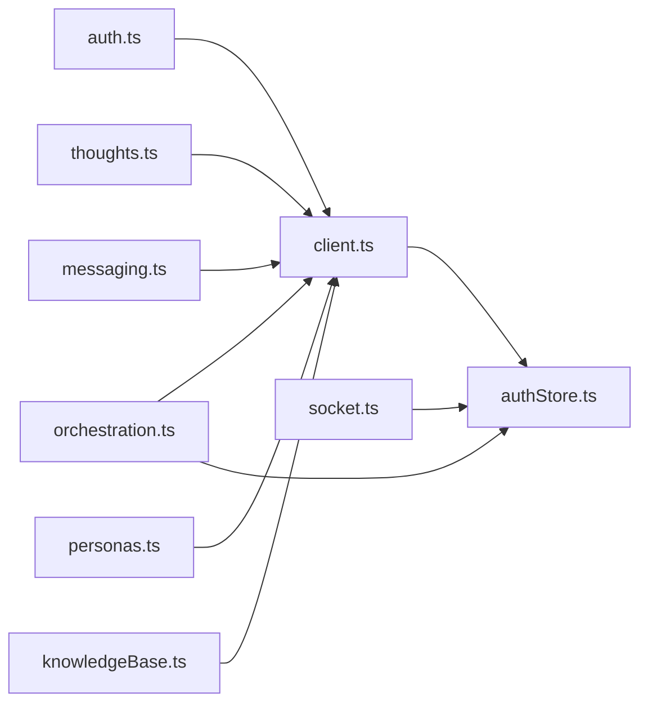
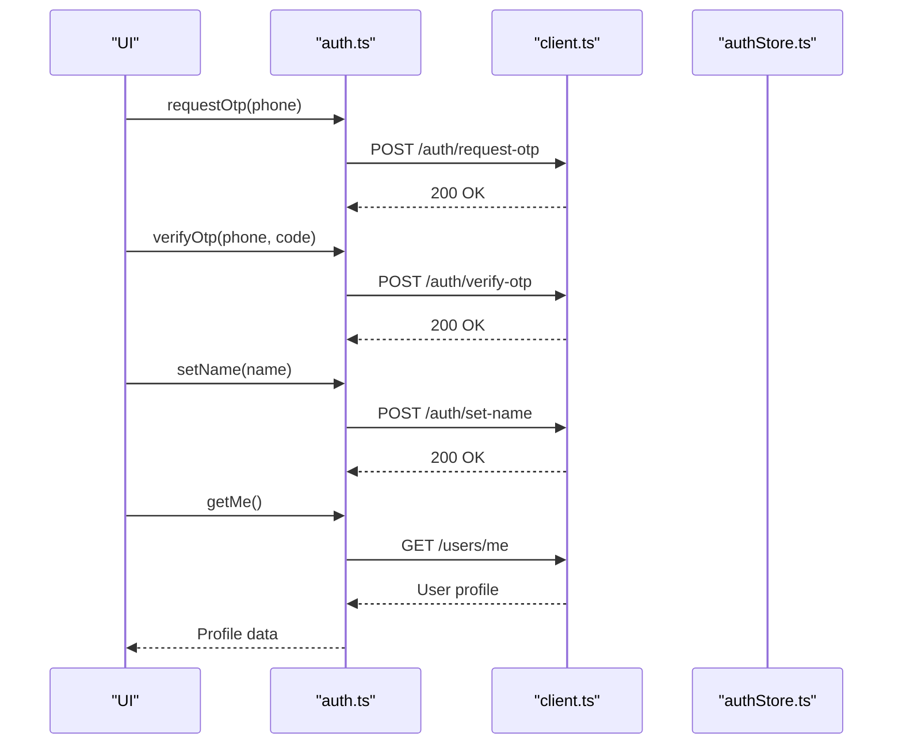

# API Client & Services

<cite>
**Referenced Files in This Document**
- [client.ts](file://frontend/src/api/client.ts)
- [auth.ts](file://frontend/src/api/auth.ts)
- [authStore.ts](file://frontend/src/store/authStore.ts)
- [socket.ts](file://frontend/src/api/socket.ts)
- [thoughts.ts](file://frontend/src/api/thoughts.ts)
- [messaging.ts](file://frontend/src/api/messaging.ts)
- [personas.ts](file://frontend/src/api/personas.ts)
- [knowledgeBase.ts](file://frontend/src/api/knowledgeBase.ts)
- [orchestration.ts](file://frontend/src/api/orchestration.ts)
- [actions.ts](file://frontend/src/api/actions.ts)
- [checkin.ts](file://frontend/src/api/checkin.ts)
- [insights.ts](file://frontend/src/api/insights.ts)
- [planner.ts](file://frontend/src/api/planner.ts)
- [reflections.ts](file://frontend/src/api/reflections.ts)
- [relationships.ts](file://frontend/src/api/relationships.ts)
- [rituals.ts](file://frontend/src/api/rituals.ts)
- [tensions.ts](file://frontend/src/api/tensions.ts)
- [userContext.ts](file://frontend/src/api/userContext.ts)
</cite>

## Table of Contents
1. [Introduction](#introduction)
2. [Project Structure](#project-structure)
3. [Core Components](#core-components)
4. [Architecture Overview](#architecture-overview)
5. [Detailed Component Analysis](#detailed-component-analysis)
6. [Dependency Analysis](#dependency-analysis)
7. [Performance Considerations](#performance-considerations)
8. [Troubleshooting Guide](#troubleshooting-guide)
9. [Conclusion](#conclusion)
10. [Appendices](#appendices)

## Introduction
This document describes the frontend API client architecture and service layer used by the 4Ever application. It focuses on:
- Centralized API client configuration and authentication token injection
- Authentication flow and token lifecycle
- Error handling strategies and unauthorized session recovery
- Service modules for auth, thoughts/memory, messaging, personas, socket/WebSocket connections, and knowledge base
- Request/response patterns, data transformation, and pagination support
- Retry mechanisms, caching strategies, and loading state management
- Endpoint specifications, parameter validation, and response type safety via TypeScript interfaces

## Project Structure
The frontend API layer is organized around a single Axios client with interceptors and a set of domain-specific API modules. Each module exports typed DTOs and functions that encapsulate HTTP requests to backend endpoints. A Zustand store manages authentication state and persistence.

**Diagram sources**
- [client.ts:1-30](file://frontend/src/api/client.ts#L1-L30)
- [auth.ts:1-37](file://frontend/src/api/auth.ts#L1-L37)
- [thoughts.ts:1-49](file://frontend/src/api/thoughts.ts#L1-L49)
- [messaging.ts:1-237](file://frontend/src/api/messaging.ts#L1-L237)
- [personas.ts:1-49](file://frontend/src/api/personas.ts#L1-L49)
- [knowledgeBase.ts:1-48](file://frontend/src/api/knowledgeBase.ts#L1-L48)
- [orchestration.ts:1-238](file://frontend/src/api/orchestration.ts#L1-L238)
- [socket.ts:1-38](file://frontend/src/api/socket.ts#L1-L38)
- [authStore.ts:1-32](file://frontend/src/store/authStore.ts#L1-L32)

**Section sources**
- [client.ts:1-30](file://frontend/src/api/client.ts#L1-L30)
- [authStore.ts:1-32](file://frontend/src/store/authStore.ts#L1-L32)

## Core Components
- Centralized API client with base URL and JSON header
- Request interceptor injects Bearer token from auth store
- Response interceptor handles 401 Unauthorized by triggering logout
- Domain APIs expose typed functions returning strongly-typed data
- Socket client connects with JWT token and supports reconnect/disconnect

Key behaviors:
- Token propagation: Every request includes Authorization header when present
- Unauthorized session cleanup: 401 triggers logout and clears persisted auth state
- Streaming endpoints: Dedicated SSE handlers for orchestration chat streams
- File uploads: FormData-based upload with progress callbacks

**Section sources**
- [client.ts:4-27](file://frontend/src/api/client.ts#L4-L27)
- [authStore.ts:18-31](file://frontend/src/store/authStore.ts#L18-L31)

## Architecture Overview
The API client architecture separates concerns into:
- Transport layer: Axios client with interceptors
- Domain services: Feature-specific modules exposing typed APIs
- Authentication store: Persistent state for token and user identity
- Real-time layer: Socket.IO client for WebSocket connections

**Diagram sources**
- [client.ts:11-27](file://frontend/src/api/client.ts#L11-L27)
- [authStore.ts:18-31](file://frontend/src/store/authStore.ts#L18-L31)

## Detailed Component Analysis

### Centralized API Client
- Base URL configured to "/api"
- JSON content-type header applied globally
- Request interceptor reads token from auth store and attaches Authorization header
- Response interceptor detects 401 and invokes logout to invalidate session

Operational notes:
- No built-in retry mechanism; rely on application-level retry policies
- No explicit cache headers; caching should be handled per-domain API
- No timeout defaults; consider adding timeouts for long-running requests

**Section sources**
- [client.ts:4-27](file://frontend/src/api/client.ts#L4-L27)

### Authentication Service
Endpoints and responsibilities:
- OTP request and verification for phone-based login
- Set user name after registration
- Fetch current user profile

Data contracts:
- RequestOtpData: phone number
- VerifyOtpData: phone number and code
- SetNameData: name

Behavior:
- Uses centralized client; no custom retry or exponential backoff
- Returns raw response data; callers should handle optional fields

**Section sources**
- [auth.ts:16-36](file://frontend/src/api/auth.ts#L16-L36)

### Thoughts and Memory Service
Capabilities:
- List, fetch by ID, create, update, delete thoughts
- Continue thread with additional content
- Supports both legacy array and paginated response formats

Data contracts:
- CreateThoughtData: title, rawText, optional thoughtType
- UpdateThoughtData: optional fields including status

Patterns:
- Robust response parsing to normalize returned items
- Strongly typed Thought interface consumed by thoughtStore

**Section sources**
- [thoughts.ts:17-48](file://frontend/src/api/thoughts.ts#L17-L48)

### Messaging Service
Scope:
- Connection management: search, pending requests, send/accept/reject/remove
- Shared notes CRUD
- Conversations: preview, fetch messages with cursor-based pagination, unread counts
- Message operations: edit, delete, add reaction, search
- Conversation settings: pin, mute, archive
- Last seen tracking
- Tri-chat mediator: status, toggle, summon, session lifecycle
- Persona mediator: reply, end session, clear history, rename

Data contracts:
- Rich set of interfaces for users, connections, messages, reactions, shared notes, tri-chat status/results
- Pagination envelope support for conversations/messages

Behavior:
- Cursor-based pagination for message retrieval
- Typed mediator action cards and tri-chat toggles
- Explicit deprecation of mediator style selection (prompt-driven personality)

**Section sources**
- [messaging.ts:107-217](file://frontend/src/api/messaging.ts#L107-L217)

### Personas Service
Capabilities:
- List all personas, active personas, fetch by ID
- Create, update, delete personas
- Strong typing for persona creation/update payloads

**Section sources**
- [personas.ts:19-48](file://frontend/src/api/personas.ts#L19-L48)

### Socket Service (WebSocket)
Responsibilities:
- Connect/disconnect WebSocket with auth token
- Reuse existing connection if already connected
- Emit connect/disconnect logs

Constraints:
- Requires valid token; returns null if absent
- Uses polling and websocket transports

**Section sources**
- [socket.ts:10-37](file://frontend/src/api/socket.ts#L10-L37)

### Knowledge Base Service
Capabilities:
- Upload documents per persona with progress callback
- List persona documents
- Delete documents

Implementation:
- FormData upload with multipart/form-data header
- Progress calculation using onUploadProgress

**Section sources**
- [knowledgeBase.ts:11-47](file://frontend/src/api/knowledgeBase.ts#L11-L47)

### Orchestration Service (Streaming & History)
Capabilities:
- Analyze thought with selected personas
- Reply to persona with immediate response or streaming SSE
- Quick chat and core chat with streaming SSE
- Manage core chat history (list, clear, new session)
- Persona direct chat streaming and history management

Streaming details:
- Uses fetch with ReadableStream
- Parses SSE events (event:, data:) and dispatches typed events
- Requires Bearer token for authenticated streams
- Handles partial line buffering and JSON parsing errors gracefully

Pagination:
- Core chat history supports both legacy array and paginated envelopes

**Section sources**
- [orchestration.ts:9-176](file://frontend/src/api/orchestration.ts#L9-L176)
- [orchestration.ts:180-236](file://frontend/src/api/orchestration.ts#L180-L236)

### Additional Services (for completeness)
These services follow similar patterns: typed DTOs, axios-based HTTP calls, and strong return types.

- Actions: manage action items, update status, link to planner
- Check-in: daily mood/energy logging with recent history
- Insights: statistics, recurring topics, evolution reports, weekly insights, life dimensions, relationship health
- Planner: daily plans, task insights, planned dates, completion stats
- Reflections: evening and weekly reflection retrieval
- Relationships: annual review, health metrics, CRUD, notes, persona creation, user linking
- Rituals: create, complete, remove
- Tensions: create, start cool down, resolve, remove
- User Context: get/update user context and opt-in preferences

**Section sources**
- [actions.ts:18-34](file://frontend/src/api/actions.ts#L18-L34)
- [checkin.ts:11-26](file://frontend/src/api/checkin.ts#L11-L26)
- [insights.ts:86-121](file://frontend/src/api/insights.ts#L86-L121)
- [planner.ts:40-70](file://frontend/src/api/planner.ts#L40-L70)
- [reflections.ts:25-34](file://frontend/src/api/reflections.ts#L25-L34)
- [relationships.ts:94-147](file://frontend/src/api/relationships.ts#L94-L147)
- [rituals.ts:27-46](file://frontend/src/api/rituals.ts#L27-L46)
- [tensions.ts:27-51](file://frontend/src/api/tensions.ts#L27-L51)
- [userContext.ts:18-33](file://frontend/src/api/userContext.ts#L18-L33)

## Dependency Analysis
The API modules depend on the central client and share the auth store. Socket service depends on the auth store for token-based authentication.

**Diagram sources**
- [client.ts:1-30](file://frontend/src/api/client.ts#L1-L30)
- [auth.ts:1-37](file://frontend/src/api/auth.ts#L1-L37)
- [thoughts.ts:1-49](file://frontend/src/api/thoughts.ts#L1-L49)
- [messaging.ts:1-237](file://frontend/src/api/messaging.ts#L1-L237)
- [personas.ts:1-49](file://frontend/src/api/personas.ts#L1-L49)
- [knowledgeBase.ts:1-48](file://frontend/src/api/knowledgeBase.ts#L1-L48)
- [orchestration.ts:1-238](file://frontend/src/api/orchestration.ts#L1-L238)
- [socket.ts:1-38](file://frontend/src/api/socket.ts#L1-L38)
- [authStore.ts:1-32](file://frontend/src/store/authStore.ts#L1-L32)

**Section sources**
- [client.ts:1-30](file://frontend/src/api/client.ts#L1-L30)
- [authStore.ts:1-32](file://frontend/src/store/authStore.ts#L1-L32)

## Performance Considerations
- Streaming: SSE-based orchestration endpoints avoid polling but require careful buffer handling and JSON parsing error tolerance
- Pagination: Messaging and orchestration support cursor-based pagination; ensure consumers handle hasMore and nextCursor appropriately
- Uploads: Knowledge base upload supports progress callbacks; consider debouncing UI updates to reduce render pressure
- Caching: No built-in caching in API modules; consider implementing per-module caches keyed by request signature
- Retries: No automatic retry; implement application-level retry with exponential backoff for transient failures
- Timeouts: Add request timeouts for long-running endpoints to prevent hanging UIs

[No sources needed since this section provides general guidance]

## Troubleshooting Guide
Common issues and resolutions:
- 401 Unauthorized
  - Symptom: Requests fail with 401
  - Cause: Expired or missing token
  - Resolution: Response interceptor triggers logout; re-authenticate and retry
- Streaming parse errors
  - Symptom: SSE parsing warnings during orchestration streams
  - Cause: Malformed or partial lines in stream
  - Resolution: Buffering and partial-line handling mitigate most cases; ensure server emits valid SSE
- Pagination inconsistencies
  - Symptom: Unexpected empty results or duplicates
  - Cause: Incorrect cursor usage
  - Resolution: Always pass nextCursor for subsequent pages; treat legacy arrays as non-paginated
- Socket connection failures
  - Symptom: Cannot connect to WebSocket
  - Cause: Missing token or server-side auth mismatch
  - Resolution: Ensure token exists in store before connecting; verify server accepts token

**Section sources**
- [client.ts:19-27](file://frontend/src/api/client.ts#L19-L27)
- [orchestration.ts:64-78](file://frontend/src/api/orchestration.ts#L64-L78)
- [socket.ts:10-30](file://frontend/src/api/socket.ts#L10-L30)

## Conclusion
The frontend API layer provides a cohesive, typed, and extensible foundation for interacting with the backend. The centralized client and interceptors simplify cross-cutting concerns like authentication and error handling. Domain APIs encapsulate feature-specific logic with strong TypeScript contracts. For production readiness, consider adding retry/backoff, request timeouts, and per-module caching strategies.

[No sources needed since this section summarizes without analyzing specific files]

## Appendices

### Authentication Flow Integration

**Diagram sources**
- [auth.ts:16-36](file://frontend/src/api/auth.ts#L16-L36)
- [client.ts:11-17](file://frontend/src/api/client.ts#L11-L17)
- [authStore.ts:18-31](file://frontend/src/store/authStore.ts#L18-L31)

### Request/Response Patterns and Type Safety
- All domain APIs return strongly typed data derived from their respective interfaces
- Many endpoints support both legacy arrays and paginated envelopes; normalization occurs in the API module
- Streaming endpoints return events parsed from SSE; consumers receive typed payloads

Examples of patterns:
- GET with params: messaging conversations and search endpoints
- POST with JSON body: auth, thoughts, personas, knowledge base
- POST with FormData: knowledge base upload
- PATCH/PUT for updates: planner tasks, user context, action status

**Section sources**
- [messaging.ts:147-177](file://frontend/src/api/messaging.ts#L147-L177)
- [thoughts.ts:17-48](file://frontend/src/api/thoughts.ts#L17-L48)
- [personas.ts:19-48](file://frontend/src/api/personas.ts#L19-L48)
- [knowledgeBase.ts:11-47](file://frontend/src/api/knowledgeBase.ts#L11-L47)
- [planner.ts:40-70](file://frontend/src/api/planner.ts#L40-L70)
- [userContext.ts:18-33](file://frontend/src/api/userContext.ts#L18-L33)

### Error Boundary Handling
- Centralized 401 handling invalidates session and prevents silent failures
- Streaming functions throw on non-OK responses; callers should wrap with try/catch and surface user-friendly messages
- SSE parsing errors are logged and ignored to keep streams resilient

Recommendations:
- Wrap API calls in error boundaries or global error handlers
- Provide user feedback for network failures and auth errors
- Implement retry prompts for transient failures

**Section sources**
- [client.ts:19-27](file://frontend/src/api/client.ts#L19-L27)
- [orchestration.ts:48-49](file://frontend/src/api/orchestration.ts#L48-L49)
- [orchestration.ts:114-116](file://frontend/src/api/orchestration.ts#L114-L116)

### Loading State Management
- No built-in loading state in API modules
- Suggested pattern: track loading booleans in UI components or stores; set before invoking API calls and reset on completion or error

[No sources needed since this section provides general guidance]