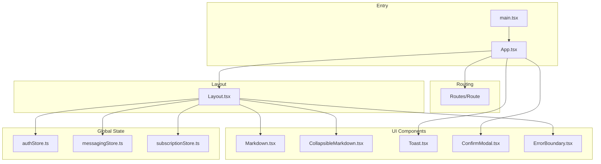
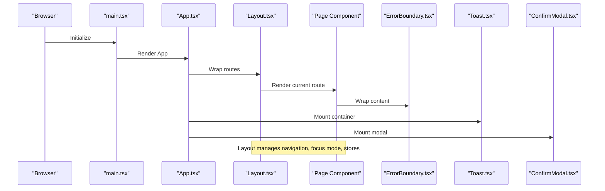
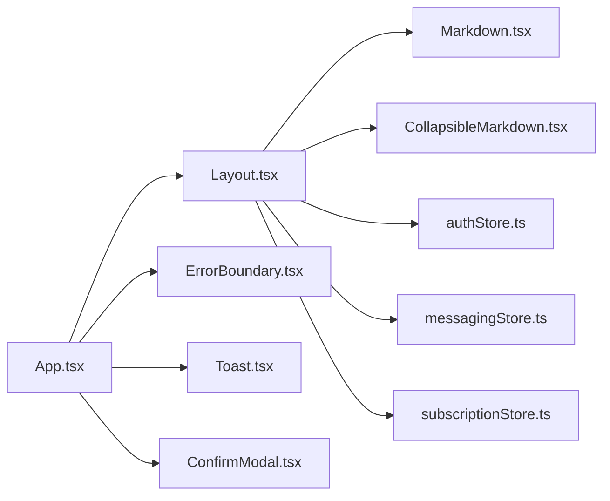

# Component Library

<cite>
**Referenced Files in This Document**
- [Layout.tsx](file://frontend/src/components/Layout.tsx)
- [Markdown.tsx](file://frontend/src/components/Markdown.tsx)
- [CollapsibleMarkdown.tsx](file://frontend/src/components/CollapsibleMarkdown.tsx)
- [Toast.tsx](file://frontend/src/components/Toast.tsx)
- [ErrorBoundary.tsx](file://frontend/src/components/ErrorBoundary.tsx)
- [ConfirmModal.tsx](file://frontend/src/components/ConfirmModal.tsx)
- [App.tsx](file://frontend/src/App.tsx)
- [main.tsx](file://frontend/src/main.tsx)
- [authStore.ts](file://frontend/src/store/authStore.ts)
- [messagingStore.ts](file://frontend/src/store/messagingStore.ts)
- [subscriptionStore.ts](file://frontend/src/store/subscriptionStore.ts)
- [tailwind.config.js](file://frontend/tailwind.config.js)
- [index.css](file://frontend/src/index.css)
</cite>

## Table of Contents
1. [Introduction](#introduction)
2. [Project Structure](#project-structure)
3. [Core Components](#core-components)
4. [Architecture Overview](#architecture-overview)
5. [Detailed Component Analysis](#detailed-component-analysis)
6. [Dependency Analysis](#dependency-analysis)
7. [Performance Considerations](#performance-considerations)
8. [Troubleshooting Guide](#troubleshooting-guide)
9. [Conclusion](#conclusion)
10. [Appendices](#appendices)

## Introduction
This document describes the React component library used in the frontend application. It focuses on reusable UI components that form the application’s layout, content rendering, notifications, error handling, and confirmation flows. The documentation covers component APIs, styling patterns, integration with global state via Zustand stores, accessibility and responsiveness, and best practices for extension and maintenance.

## Project Structure
The component library resides under the frontend application and integrates with routing, global state, and styling systems. The main entry wires routing, layout, and global UI containers (toasts and modals). Components are organized by responsibility and reused across pages.

**Diagram sources**
- [main.tsx:1-14](file://frontend/src/main.tsx#L1-L14)
- [App.tsx:1-70](file://frontend/src/App.tsx#L1-L70)
- [Layout.tsx:1-436](file://frontend/src/components/Layout.tsx#L1-L436)
- [Markdown.tsx:1-94](file://frontend/src/components/Markdown.tsx#L1-L94)
- [CollapsibleMarkdown.tsx:1-87](file://frontend/src/components/CollapsibleMarkdown.tsx#L1-L87)
- [Toast.tsx:1-110](file://frontend/src/components/Toast.tsx#L1-L110)
- [ConfirmModal.tsx:1-134](file://frontend/src/components/ConfirmModal.tsx#L1-L134)
- [ErrorBoundary.tsx:1-60](file://frontend/src/components/ErrorBoundary.tsx#L1-L60)
- [authStore.ts:1-32](file://frontend/src/store/authStore.ts#L1-L32)
- [messagingStore.ts:1-412](file://frontend/src/store/messagingStore.ts#L1-L412)
- [subscriptionStore.ts:1-46](file://frontend/src/store/subscriptionStore.ts#L1-L46)

**Section sources**
- [main.tsx:1-14](file://frontend/src/main.tsx#L1-L14)
- [App.tsx:1-70](file://frontend/src/App.tsx#L1-L70)

## Core Components
- Layout: Provides navigation, focus mode, and integration with global state and sockets.
- Markdown: Renders Markdown with GFM and custom component styling.
- CollapsibleMarkdown: Splits Markdown into sections and allows collapsing/expanding.
- Toast: Global notification system with typed variants and auto-dismiss.
- ErrorBoundary: Graceful degradation on component errors.
- ConfirmModal: Global confirmation dialog with promise-based API.

**Section sources**
- [Layout.tsx:40-436](file://frontend/src/components/Layout.tsx#L40-L436)
- [Markdown.tsx:4-94](file://frontend/src/components/Markdown.tsx#L4-L94)
- [CollapsibleMarkdown.tsx:5-87](file://frontend/src/components/CollapsibleMarkdown.tsx#L5-L87)
- [Toast.tsx:5-110](file://frontend/src/components/Toast.tsx#L5-L110)
- [ErrorBoundary.tsx:4-60](file://frontend/src/components/ErrorBoundary.tsx#L4-L60)
- [ConfirmModal.tsx:5-134](file://frontend/src/components/ConfirmModal.tsx#L5-L134)

## Architecture Overview
The application initializes routing and mounts the layout and global UI containers. The Layout composes navigation, focus mode, and integrates with stores for auth, messaging, and subscriptions. Markdown and CollapsibleMarkdown are used for content rendering. Toast and ConfirmModal are rendered once globally and accessed via helper APIs. ErrorBoundary wraps page content to prevent app crashes.

**Diagram sources**
- [main.tsx:1-14](file://frontend/src/main.tsx#L1-L14)
- [App.tsx:25-67](file://frontend/src/App.tsx#L25-L67)
- [Layout.tsx:49-436](file://frontend/src/components/Layout.tsx#L49-L436)
- [ErrorBoundary.tsx:13-59](file://frontend/src/components/ErrorBoundary.tsx#L13-L59)
- [Toast.tsx:98-110](file://frontend/src/components/Toast.tsx#L98-L110)
- [ConfirmModal.tsx:41-134](file://frontend/src/components/ConfirmModal.tsx#L41-L134)

## Detailed Component Analysis

### Layout
Responsibilities:
- Navigation sidebar with icons and active-state indicators.
- Mobile-friendly hamburger menu and overlay.
- Focus Mode: quick capture panel and optional AI chat sidebar.
- Socket connection and periodic unread count updates.
- Integration with auth, messaging, and subscription stores.
- Uses Markdown and CollapsibleMarkdown for content.

Key props:
- children: ReactNode for page content.

State and effects:
- Manages sidebar open/collapse state and persistence in localStorage.
- Tracks focus mode, chat input, messages, persona selection, and quick capture state.
- Subscribes to auth, messaging, and subscription stores for UI state.

Interactions:
- Logout triggers auth store and navigates to login.
- Focus Mode toggles a compact interface with optional chat panel.
- Integrates with orchestration API for quick chat and thoughts API for quick capture.

Accessibility and responsiveness:
- Uses semantic links and buttons with clear labels.
- Responsive breakpoints for desktop vs mobile layouts.
- Focus management for keyboard navigation in modals.

Styling patterns:
- Tailwind utilities for spacing, colors, shadows, and animations.
- Uses primary color palette and custom animations.

Integration with global state:
- Auth store for user identity and logout.
- Messaging store for unread counts and socket-driven updates.
- Subscription store for feature gating and UI hints.

**Section sources**
- [Layout.tsx:40-436](file://frontend/src/components/Layout.tsx#L40-L436)
- [Layout.tsx:77-84](file://frontend/src/components/Layout.tsx#L77-L84)
- [Layout.tsx:96-131](file://frontend/src/components/Layout.tsx#L96-L131)
- [Layout.tsx:138-154](file://frontend/src/components/Layout.tsx#L138-L154)
- [Layout.tsx:157-287](file://frontend/src/components/Layout.tsx#L157-L287)
- [Layout.tsx:289-435](file://frontend/src/components/Layout.tsx#L289-L435)

### Markdown
Responsibilities:
- Renders Markdown with GitHub Flavored Markdown (GFM).
- Applies consistent typography and code block styling.

Props:
- content: string Markdown content.
- className?: string for additional styling.

Rendering:
- Uses react-markdown with remarkGfm plugin.
- Overrides components for headings, paragraphs, lists, blockquotes, code blocks, links, thematic breaks, and tables.

Accessibility:
- Semantic HTML for headings and lists.
- Inline code styled for readability.

Customization:
- Accepts className to extend default prose styles.

**Section sources**
- [Markdown.tsx:4-94](file://frontend/src/components/Markdown.tsx#L4-L94)

### CollapsibleMarkdown
Responsibilities:
- Parses Markdown into a preamble and sections based on headings.
- Renders sections with expand/collapse controls.
- Falls back to regular Markdown when sections are insufficient.

Props:
- content: string Markdown content.
- className?: string additional styling.
- defaultCollapsed?: boolean whether sections start collapsed.

Algorithm:
- Splits content into preamble and sections using heading markers (#, ##, ###).
- Renders each section with a button that toggles visibility.
- Uses Markdown to render section bodies.

Accessibility:
- Buttons use aria-acceptable semantics with icons indicating state.
- Smooth transitions for appearance/disappearance.

**Section sources**
- [CollapsibleMarkdown.tsx:5-87](file://frontend/src/components/CollapsibleMarkdown.tsx#L5-L87)
- [CollapsibleMarkdown.tsx:18-38](file://frontend/src/components/CollapsibleMarkdown.tsx#L18-L38)
- [CollapsibleMarkdown.tsx:40-68](file://frontend/src/components/CollapsibleMarkdown.tsx#L40-L68)

### Toast
Responsibilities:
- Global notification system with four severity types.
- Auto-dismiss with configurable durations.
- Dismissible by user action.

API:
- toast.success(title, message?)
- toast.error(title, message?)
- toast.warning(title, message?)
- toast.info(title, message?)

Store:
- Zustand store maintains a queue of toasts with add/remove operations.
- Each toast has a random ID, type, title, optional message, and duration.

Rendering:
- ToastContainer renders all active toasts in a fixed position.
- Individual toasts animate in/out and auto-dismiss after duration.

Error handling:
- Errors are surfaced via the error toast helper with a default long duration.

**Section sources**
- [Toast.tsx:5-110](file://frontend/src/components/Toast.tsx#L5-L110)
- [Toast.tsx:22-30](file://frontend/src/components/Toast.tsx#L22-L30)
- [Toast.tsx:32-42](file://frontend/src/components/Toast.tsx#L32-L42)
- [Toast.tsx:44-96](file://frontend/src/components/Toast.tsx#L44-L96)
- [Toast.tsx:98-110](file://frontend/src/components/Toast.tsx#L98-L110)

### ErrorBoundary
Responsibilities:
- Catches JavaScript errors inside child components.
- Displays a friendly error screen with retry action.
- Logs error details to the console.

Behavior:
- On error, shows an error UI with optional message preview.
- Retry resets the boundary to normal rendering.

Usage:
- Wrap page content to avoid full-app crashes.

**Section sources**
- [ErrorBoundary.tsx:4-60](file://frontend/src/components/ErrorBoundary.tsx#L4-L60)
- [ErrorBoundary.tsx:13-29](file://frontend/src/components/ErrorBoundary.tsx#L13-L29)
- [ErrorBoundary.tsx:31-58](file://frontend/src/components/ErrorBoundary.tsx#L31-L58)

### ConfirmModal
Responsibilities:
- Global confirmation dialog with three variants (danger, warning, default).
- Promise-based API for synchronous confirmation flows.

API:
- confirm({ title, message, confirmLabel?, cancelLabel?, variant? }): Promise<boolean>
- Uses a Zustand store to manage open state, options, and resolution callback.

Rendering:
- Fixed overlay and animated modal with variant-specific colors.
- Focus management sets focus on cancel button when opened.

Keyboard handling:
- ESC key closes the modal with a negative result.

**Section sources**
- [ConfirmModal.tsx:5-134](file://frontend/src/components/ConfirmModal.tsx#L5-L134)
- [ConfirmModal.tsx:22-35](file://frontend/src/components/ConfirmModal.tsx#L22-L35)
- [ConfirmModal.tsx:41-134](file://frontend/src/components/ConfirmModal.tsx#L41-L134)

## Dependency Analysis
Component relationships and data flows:
- App mounts Layout, ErrorBoundary, ToastContainer, and ConfirmModal.
- Layout depends on auth, messaging, and subscription stores; renders Markdown and CollapsibleMarkdown.
- Toast and ConfirmModal are singletons rendered by App and accessed via helper APIs.
- ErrorBoundary wraps page content to isolate rendering failures.

**Diagram sources**
- [App.tsx:25-67](file://frontend/src/App.tsx#L25-L67)
- [Layout.tsx:49-436](file://frontend/src/components/Layout.tsx#L49-L436)
- [Markdown.tsx:1-94](file://frontend/src/components/Markdown.tsx#L1-L94)
- [CollapsibleMarkdown.tsx:1-87](file://frontend/src/components/CollapsibleMarkdown.tsx#L1-L87)
- [authStore.ts:1-32](file://frontend/src/store/authStore.ts#L1-L32)
- [messagingStore.ts:1-412](file://frontend/src/store/messagingStore.ts#L1-L412)
- [subscriptionStore.ts:1-46](file://frontend/src/store/subscriptionStore.ts#L1-L46)

**Section sources**
- [App.tsx:25-67](file://frontend/src/App.tsx#L25-L67)
- [Layout.tsx:49-436](file://frontend/src/components/Layout.tsx#L49-L436)

## Performance Considerations
- Minimal re-renders: Layout uses local state for UI toggles and persists sidebar collapse to localStorage to avoid unnecessary computations.
- Efficient Markdown rendering: CollapsibleMarkdown splits content into sections; when sections are few, it falls back to direct Markdown rendering to avoid overhead.
- Toast lifecycle: Automatic dismissal and exit animations reduce DOM churn by removing toasts after transitions.
- ConfirmModal: Single instance with controlled open/close via store prevents multiple listeners and redundant mounts.
- Lazy focus-mode rendering: Focus mode UI is only mounted when enabled, reducing baseline DOM size.
- Debounced unread updates: Periodic polling for unread counts balances freshness with network usage.

[No sources needed since this section provides general guidance]

## Troubleshooting Guide
Common issues and resolutions:
- Toast not appearing:
  - Ensure ToastContainer is rendered by App.
  - Verify helper usage: toast.success/info/warning/error.
- ConfirmModal not closing:
  - Call confirm() and await the returned Promise; ensure the modal is visible and user clicks confirm or cancel.
- Layout navigation not updating:
  - Check active path logic and ensure Link paths match routes.
- Focus Mode chat not responding:
  - Confirm persona selection and that orchestration API calls succeed; verify error fallback behavior.
- ErrorBoundary not catching errors:
  - Wrap page content with ErrorBoundary; ensure child components throw errors during render.

**Section sources**
- [App.tsx:21-23](file://frontend/src/App.tsx#L21-L23)
- [Toast.tsx:32-42](file://frontend/src/components/Toast.tsx#L32-L42)
- [ConfirmModal.tsx:38-39](file://frontend/src/components/ConfirmModal.tsx#L38-L39)
- [Layout.tsx:138-154](file://frontend/src/components/Layout.tsx#L138-L154)
- [Layout.tsx:96-111](file://frontend/src/components/Layout.tsx#L96-L111)
- [ErrorBoundary.tsx:19-25](file://frontend/src/components/ErrorBoundary.tsx#L19-L25)

## Conclusion
The component library provides a cohesive, accessible, and responsive foundation for the application. Layout orchestrates navigation and focus modes while integrating with global state. Markdown and CollapsibleMarkdown deliver readable content experiences. Toast and ConfirmModal offer consistent user feedback and interaction patterns. ErrorBoundary ensures graceful degradation. Together, these components enable scalable UI development with clear separation of concerns.

[No sources needed since this section summarizes without analyzing specific files]

## Appendices

### Accessibility Considerations
- Focus management: ConfirmModal sets focus to cancel button on open; Layout buttons use accessible roles.
- Keyboard navigation: ConfirmModal supports ESC key; Layout buttons are keyboard operable.
- Semantic markup: Markdown overrides ensure headings, lists, and tables render semantically.
- Color contrast: Tailwind primary palette and explicit bg/text classes maintain sufficient contrast.

**Section sources**
- [ConfirmModal.tsx:46-55](file://frontend/src/components/ConfirmModal.tsx#L46-L55)
- [Layout.tsx:380-401](file://frontend/src/components/Layout.tsx#L380-L401)
- [Markdown.tsx:14-87](file://frontend/src/components/Markdown.tsx#L14-L87)

### Responsive Design Patterns
- Breakpoints: Layout adapts sidebar width and collapses icons on small screens.
- Mobile header: Hamburger menu toggles sidebar overlay.
- Toast placement: Fixed positioning remains usable across viewport sizes.
- ConfirmModal: Centered modal with max-width scales to smaller screens.

**Section sources**
- [Layout.tsx:292-321](file://frontend/src/components/Layout.tsx#L292-L321)
- [Layout.tsx:414-432](file://frontend/src/components/Layout.tsx#L414-L432)
- [ConfirmModal.tsx:87-131](file://frontend/src/components/ConfirmModal.tsx#L87-L131)

### Styling System
- Tailwind configuration extends primary colors and defines custom animations.
- Base styles define reusable utilities for buttons, inputs, cards, and animations.
- Components compose Tailwind classes consistently for typography, spacing, and interactivity.

**Section sources**
- [tailwind.config.js:1-37](file://frontend/tailwind.config.js#L1-L37)
- [index.css:11-31](file://frontend/src/index.css#L11-L31)
- [index.css:33-102](file://frontend/src/index.css#L33-L102)

### Global State Integration
- Auth store: Provides authentication state and logout.
- Messaging store: Centralizes connections, conversations, unread counts, and tri-chat state.
- Subscription store: Loads and exposes subscription tier and activity for feature gating.

**Section sources**
- [authStore.ts:18-31](file://frontend/src/store/authStore.ts#L18-L31)
- [messagingStore.ts:72-122](file://frontend/src/store/messagingStore.ts#L72-L122)
- [subscriptionStore.ts:15-45](file://frontend/src/store/subscriptionStore.ts#L15-L45)

### Usage Guidelines and Best Practices
- Prefer helper APIs for Toast and ConfirmModal to avoid prop-drilling.
- Wrap page content with ErrorBoundary to prevent cascading failures.
- Use CollapsibleMarkdown for long-form content with hierarchical sections.
- Keep Layout focused on navigation and global UI; delegate page-specific logic to pages.
- Extend Markdown overrides sparingly to maintain consistency.

[No sources needed since this section provides general guidance]