# Frontend Architecture

<cite>
**Referenced Files in This Document**
- [main.tsx](file://frontend/src/main.tsx)
- [App.tsx](file://frontend/src/App.tsx)
- [Layout.tsx](file://frontend/src/components/Layout.tsx)
- [ErrorBoundary.tsx](file://frontend/src/components/ErrorBoundary.tsx)
- [Toast.tsx](file://frontend/src/components/Toast.tsx)
- [Markdown.tsx](file://frontend/src/components/Markdown.tsx)
- [CollapsibleMarkdown.tsx](file://frontend/src/components/CollapsibleMarkdown.tsx)
- [authStore.ts](file://frontend/src/store/authStore.ts)
- [thoughtStore.ts](file://frontend/src/store/thoughtStore.ts)
- [client.ts](file://frontend/src/api/client.ts)
- [socket.ts](file://frontend/src/api/socket.ts)
- [Dashboard.tsx](file://frontend/src/pages/Dashboard.tsx)
- [vite.config.ts](file://frontend/vite.config.ts)
- [package.json](file://frontend/package.json)
- [tailwind.config.js](file://frontend/tailwind.config.js)
</cite>

## Table of Contents
1. [Introduction](#introduction)
2. [Project Structure](#project-structure)
3. [Core Components](#core-components)
4. [Architecture Overview](#architecture-overview)
5. [Detailed Component Analysis](#detailed-component-analysis)
6. [Dependency Analysis](#dependency-analysis)
7. [Performance Considerations](#performance-considerations)
8. [Troubleshooting Guide](#troubleshooting-guide)
9. [Conclusion](#conclusion)
10. [Appendices](#appendices)

## Introduction
This document describes the React web frontend architecture for the 4Ever application. It covers the component hierarchy, state management with Zustand stores, routing with React Router, reusable UI components (Layout, Markdown rendering, Toast notifications, ErrorBoundary), the page-based architecture with more than 16 pages, the API client with typed endpoints and authentication handling, styling with Tailwind CSS and theme extensions, component composition patterns, Socket.IO integration for real-time updates, performance optimization and build configuration with Vite, and guidelines for extending the frontend consistently.

## Project Structure
The frontend is organized around a clear separation of concerns:
- Entry point initializes React, React Router, and mounts the app.
- App defines routes and renders either the Login page or the authenticated Layout with nested pages.
- Components provide reusable UI building blocks (Layout, Markdown, Toast, ErrorBoundary).
- Pages implement domain-specific views (Dashboard, Forms, Modals, Specialized Views).
- Stores manage global state with Zustand.
- API module encapsulates HTTP client and WebSocket connections.
- Build and styling are configured via Vite, Tailwind CSS, and PostCSS.

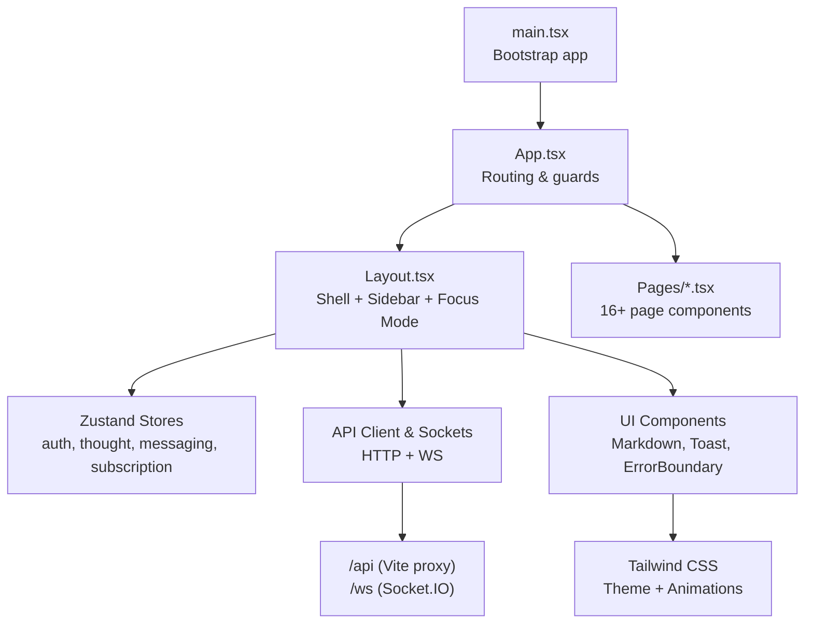

**Diagram sources**
- [main.tsx:1-14](file://frontend/src/main.tsx#L1-L14)
- [App.tsx:1-70](file://frontend/src/App.tsx#L1-L70)
- [Layout.tsx:1-436](file://frontend/src/components/Layout.tsx#L1-L436)
- [vite.config.ts:1-22](file://frontend/vite.config.ts#L1-L22)

**Section sources**
- [main.tsx:1-14](file://frontend/src/main.tsx#L1-L14)
- [App.tsx:1-70](file://frontend/src/App.tsx#L1-L70)
- [vite.config.ts:1-22](file://frontend/vite.config.ts#L1-L22)

## Core Components
- Routing and Guards: App.tsx defines public and protected routes and conditionally renders Login or the authenticated Layout based on authentication state from Zustand.
- Layout Shell: Layout.tsx provides a responsive shell with collapsible sidebar, mobile menu, focus mode, quick capture, AI chat panel, Socket.IO connection, and subscription state.
- Reusable UI:
  - Markdown.tsx renders GitHub-flavored Markdown with custom component mapping.
  - CollapsibleMarkdown.tsx parses and collapses Markdown sections for long documents.
  - Toast.tsx implements a toast notification system with Zustand store and container.
  - ErrorBoundary.tsx wraps page content to gracefully handle runtime errors.
- State Management: authStore.ts persists authentication state; thoughtStore.ts manages thought lists and current selection; messaging and subscription stores are integrated in Layout.
- API Layer: client.ts centralizes Axios configuration, auth headers, and 401 handling; socket.ts manages Socket.IO connection lifecycle.
- Styling: Tailwind CSS with theme extension for primary palette, keyframes, and animations.

**Section sources**
- [App.tsx:1-70](file://frontend/src/App.tsx#L1-L70)
- [Layout.tsx:1-436](file://frontend/src/components/Layout.tsx#L1-L436)
- [Markdown.tsx:1-94](file://frontend/src/components/Markdown.tsx#L1-L94)
- [CollapsibleMarkdown.tsx:1-87](file://frontend/src/components/CollapsibleMarkdown.tsx#L1-L87)
- [Toast.tsx:1-110](file://frontend/src/components/Toast.tsx#L1-L110)
- [ErrorBoundary.tsx:1-60](file://frontend/src/components/ErrorBoundary.tsx#L1-L60)
- [authStore.ts:1-32](file://frontend/src/store/authStore.ts#L1-L32)
- [thoughtStore.ts:1-79](file://frontend/src/store/thoughtStore.ts#L1-L79)
- [client.ts:1-30](file://frontend/src/api/client.ts#L1-L30)
- [socket.ts:1-38](file://frontend/src/api/socket.ts#L1-L38)
- [tailwind.config.js:1-37](file://frontend/tailwind.config.js#L1-L37)

## Architecture Overview
The frontend follows a layered architecture:
- Presentation Layer: App, Layout, and Page components.
- State Layer: Zustand stores for auth, thoughts, messaging, subscriptions.
- Services Layer: API client (Axios) and Socket.IO client.
- Infrastructure Layer: Vite dev server and build pipeline, Tailwind CSS.

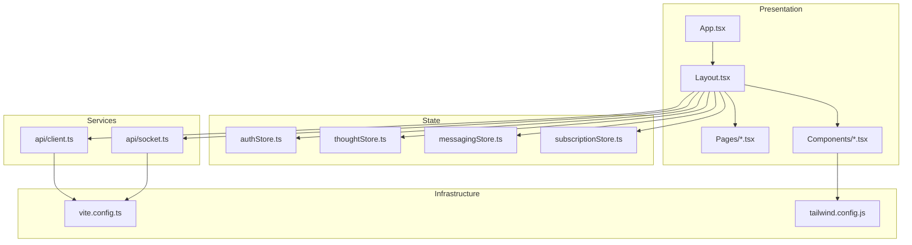

**Diagram sources**
- [App.tsx:1-70](file://frontend/src/App.tsx#L1-L70)
- [Layout.tsx:1-436](file://frontend/src/components/Layout.tsx#L1-L436)
- [authStore.ts:1-32](file://frontend/src/store/authStore.ts#L1-L32)
- [thoughtStore.ts:1-79](file://frontend/src/store/thoughtStore.ts#L1-L79)
- [client.ts:1-30](file://frontend/src/api/client.ts#L1-L30)
- [socket.ts:1-38](file://frontend/src/api/socket.ts#L1-L38)
- [vite.config.ts:1-22](file://frontend/vite.config.ts#L1-L22)
- [tailwind.config.js:1-37](file://frontend/tailwind.config.js#L1-L37)

## Detailed Component Analysis

### Routing and Authentication Flow
The routing pattern uses React Router v6 with route guards:
- Unauthenticated users see Login.
- Authenticated users see Layout wrapping the page routes.
- Authentication state is persisted via Zustand with localStorage.

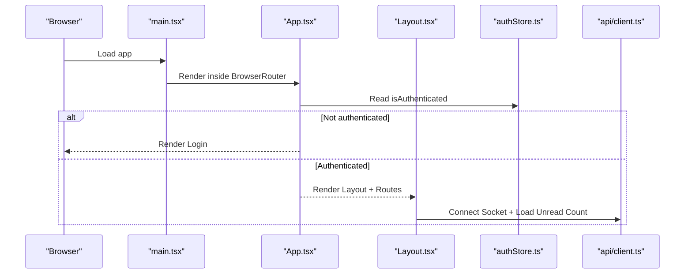

**Diagram sources**
- [main.tsx:1-14](file://frontend/src/main.tsx#L1-L14)
- [App.tsx:1-70](file://frontend/src/App.tsx#L1-L70)
- [Layout.tsx:1-436](file://frontend/src/components/Layout.tsx#L1-L436)
- [authStore.ts:1-32](file://frontend/src/store/authStore.ts#L1-L32)
- [client.ts:1-30](file://frontend/src/api/client.ts#L1-L30)

**Section sources**
- [App.tsx:1-70](file://frontend/src/App.tsx#L1-L70)
- [authStore.ts:1-32](file://frontend/src/store/authStore.ts#L1-L32)

### Layout Shell and Focus Mode
Layout.tsx orchestrates:
- Responsive sidebar with collapsible state persisted to localStorage.
- Navigation items mapped from route paths.
- Focus Mode: Quick capture form and AI chat panel powered by orchestration API.
- Real-time integration via Socket.IO with periodic unread count polling.
- Subscription state loading and user info display.

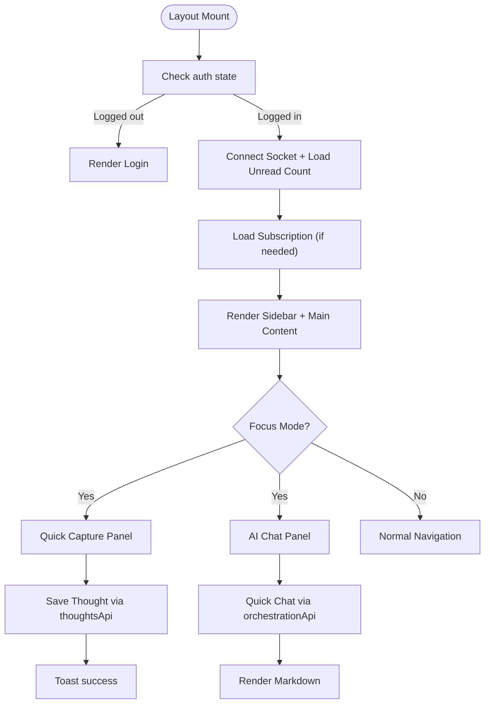

**Diagram sources**
- [Layout.tsx:1-436](file://frontend/src/components/Layout.tsx#L1-L436)
- [socket.ts:1-38](file://frontend/src/api/socket.ts#L1-L38)
- [client.ts:1-30](file://frontend/src/api/client.ts#L1-L30)

**Section sources**
- [Layout.tsx:1-436](file://frontend/src/components/Layout.tsx#L1-L436)

### Toast Notification System
Toast.tsx implements a centralized notification system:
- Zustand store maintains a queue of toasts with auto-dismiss and manual close.
- ToastContainer renders toasts in the top-right corner with exit animations.
- Helper functions provide convenience methods for success/error/warning/info.

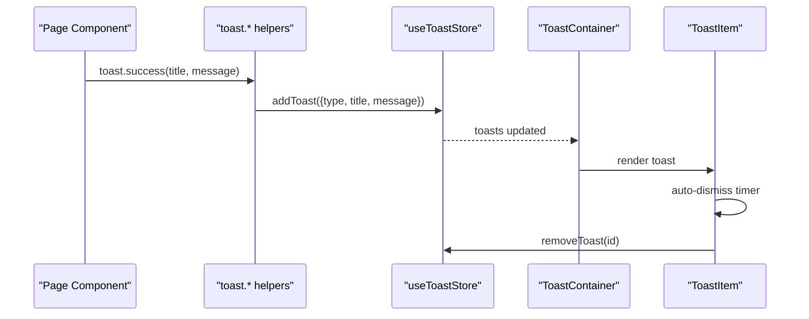

**Diagram sources**
- [Toast.tsx:1-110](file://frontend/src/components/Toast.tsx#L1-L110)

**Section sources**
- [Toast.tsx:1-110](file://frontend/src/components/Toast.tsx#L1-L110)

### Markdown Rendering and Collapsible Sections
Markdown.tsx and CollapsibleMarkdown.tsx provide:
- GitHub-flavored Markdown rendering with custom component mapping for headings, lists, tables, code blocks, links, and blockquotes.
- CollapsibleMarkdown.tsx splits content into preamble and collapsible sections, enabling efficient reading of long documents.

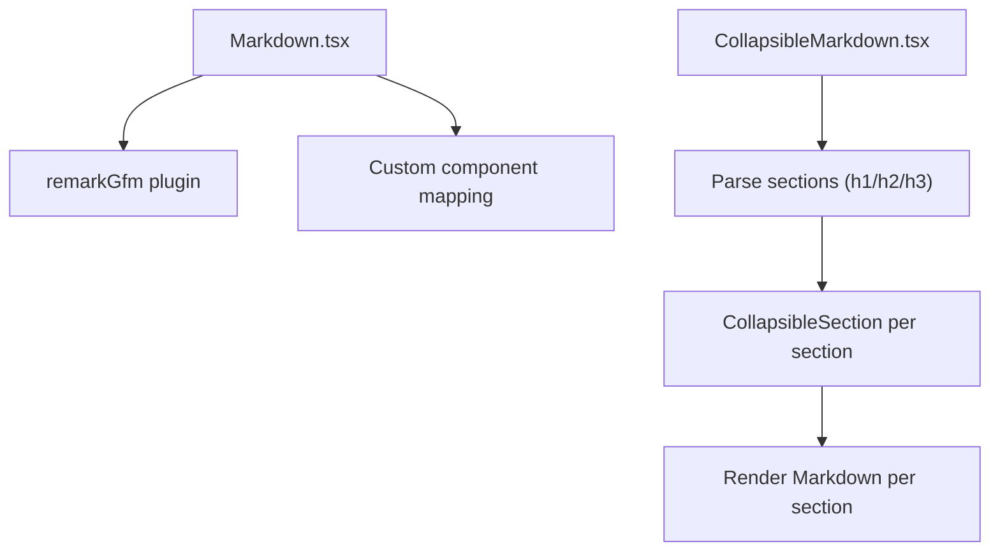

**Diagram sources**
- [Markdown.tsx:1-94](file://frontend/src/components/Markdown.tsx#L1-L94)
- [CollapsibleMarkdown.tsx:1-87](file://frontend/src/components/CollapsibleMarkdown.tsx#L1-L87)

**Section sources**
- [Markdown.tsx:1-94](file://frontend/src/components/Markdown.tsx#L1-L94)
- [CollapsibleMarkdown.tsx:1-87](file://frontend/src/components/CollapsibleMarkdown.tsx#L1-L87)

### Error Boundary
ErrorBoundary.tsx provides a fallback UI when page components throw errors:
- Captures errors via getDerivedStateFromError.
- Renders a friendly message with a retry button and logs error details.

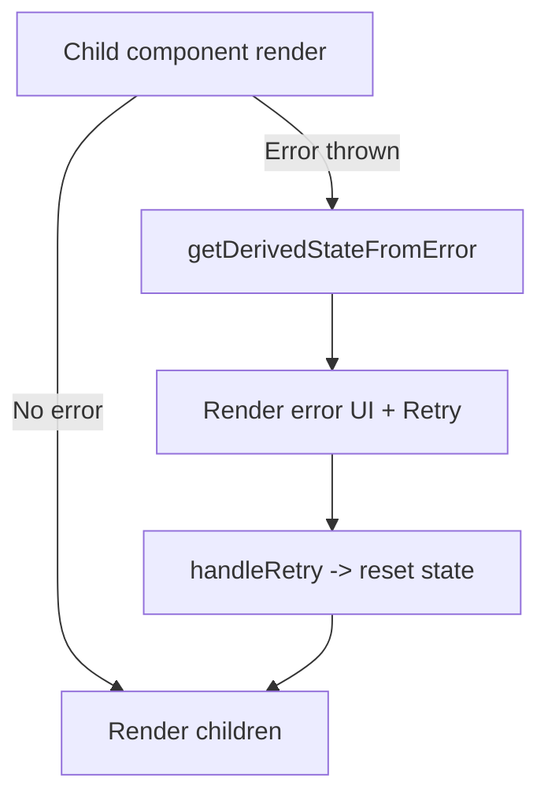

**Diagram sources**
- [ErrorBoundary.tsx:1-60](file://frontend/src/components/ErrorBoundary.tsx#L1-L60)

**Section sources**
- [ErrorBoundary.tsx:1-60](file://frontend/src/components/ErrorBoundary.tsx#L1-L60)

### API Client and Authentication Handling
client.ts configures Axios:
- Base URL for API requests.
- Authorization header injection from authStore.
- Global 401 handler to log out and prevent further unauthorized requests.

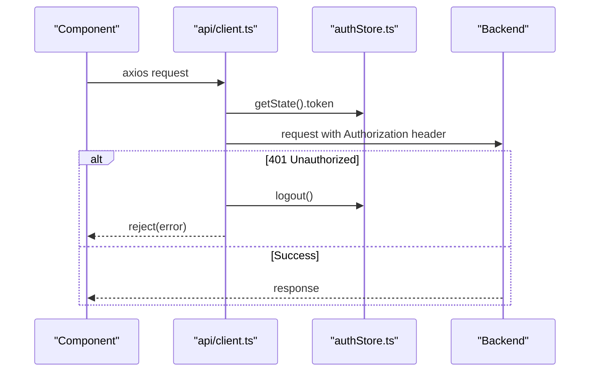

**Diagram sources**
- [client.ts:1-30](file://frontend/src/api/client.ts#L1-L30)
- [authStore.ts:1-32](file://frontend/src/store/authStore.ts#L1-L32)

**Section sources**
- [client.ts:1-30](file://frontend/src/api/client.ts#L1-L30)
- [authStore.ts:1-32](file://frontend/src/store/authStore.ts#L1-L32)

### Socket.IO Integration
socket.ts manages real-time connectivity:
- Establishes connection with JWT token via authStore.
- Emits connect/disconnect logs.
- Provides getSocket and disconnectSocket for cleanup.

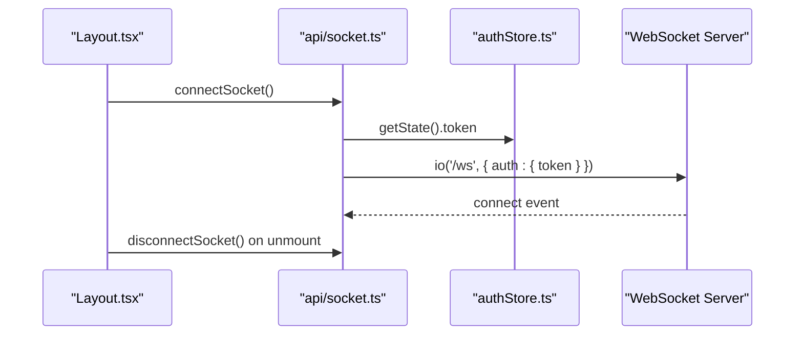

**Diagram sources**
- [Layout.tsx:1-436](file://frontend/src/components/Layout.tsx#L1-L436)
- [socket.ts:1-38](file://frontend/src/api/socket.ts#L1-L38)

**Section sources**
- [socket.ts:1-38](file://frontend/src/api/socket.ts#L1-L38)
- [Layout.tsx:1-436](file://frontend/src/components/Layout.tsx#L1-L436)

### Page-Based Architecture
The pages directory contains more than 16 page components, including:
- Dashboards: Dashboard.tsx aggregates multiple widgets and loads data from multiple APIs.
- Forms: NewThought.tsx and others implement creation/editing flows.
- Modals: ConfirmModal.tsx and page-specific modals (e.g., PersonaChatModal.tsx).
- Specialized Views: CoreChat.tsx, KnowledgeWorker.tsx, MyCircle.tsx, Messages.tsx, etc.

Dashboard.tsx demonstrates:
- Parallel data fetching using Promise.all.
- Local filtering and pagination-like toggles.
- Integration with ConfirmModal and Toast for destructive actions.
- Thought CRUD via thoughtsApi and thoughtStore updates.

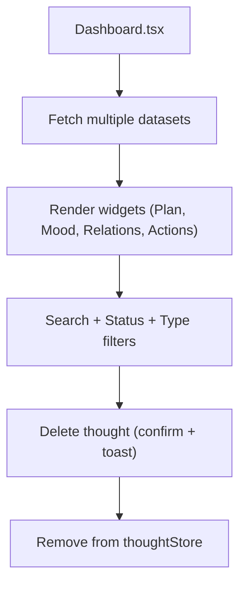

**Diagram sources**
- [Dashboard.tsx:1-794](file://frontend/src/pages/Dashboard.tsx#L1-L794)
- [thoughtStore.ts:1-79](file://frontend/src/store/thoughtStore.ts#L1-L79)

**Section sources**
- [Dashboard.tsx:1-794](file://frontend/src/pages/Dashboard.tsx#L1-L794)
- [thoughtStore.ts:1-79](file://frontend/src/store/thoughtStore.ts#L1-L79)

## Dependency Analysis
External dependencies and integrations:
- React + React Router DOM for routing.
- Axios for HTTP requests.
- Socket.IO Client for real-time features.
- React Markdown + remark-gfm for Markdown rendering.
- Tailwind CSS + PostCSS + autoprefixer for styling.
- Zustand for state management.
- Vite for development and build.

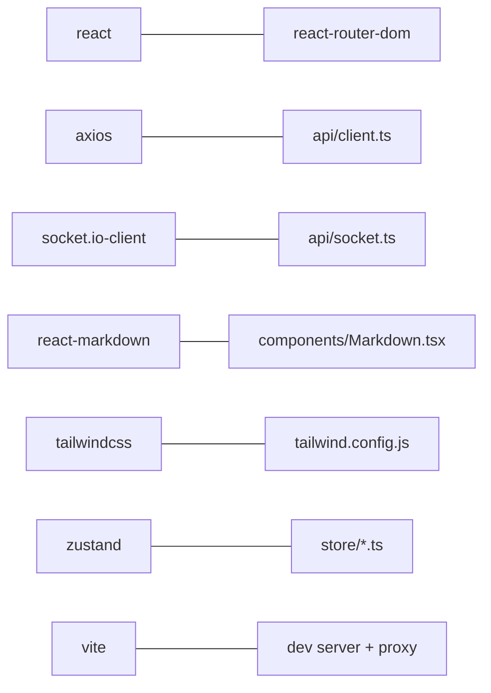

**Diagram sources**
- [package.json:1-35](file://frontend/package.json#L1-L35)
- [client.ts:1-30](file://frontend/src/api/client.ts#L1-L30)
- [socket.ts:1-38](file://frontend/src/api/socket.ts#L1-L38)
- [Markdown.tsx:1-94](file://frontend/src/components/Markdown.tsx#L1-L94)
- [tailwind.config.js:1-37](file://frontend/tailwind.config.js#L1-L37)
- [vite.config.ts:1-22](file://frontend/vite.config.ts#L1-L22)

**Section sources**
- [package.json:1-35](file://frontend/package.json#L1-L35)
- [vite.config.ts:1-22](file://frontend/vite.config.ts#L1-L22)

## Performance Considerations
- Code Splitting: Use React.lazy and Suspense for heavy pages to reduce initial bundle size.
- Efficient Lists: Virtualize long lists (e.g., thought list) to limit DOM nodes.
- Memoization: Use useMemo/useCallback for derived data and callbacks in frequently re-rendered components.
- Debounced Inputs: Debounce search/filter inputs to avoid excessive re-renders.
- Conditional Rendering: Hide expensive panels until needed (e.g., AI chat panel).
- Image Optimization: Lazy-load images and use appropriate sizes/resolution.
- Network Efficiency: Batch API calls where possible; cache where safe; cancel requests on unmount.
- Bundle Analysis: Regularly inspect bundle composition with Vite’s analyzer plugin.

## Troubleshooting Guide
Common issues and resolutions:
- Authentication Errors:
  - Symptom: Requests fail with 401.
  - Cause: Missing/expired token.
  - Resolution: Verify authStore token and ensure interceptor sets Authorization header; confirm logout clears state.
- Socket Disconnections:
  - Symptom: Real-time features unavailable.
  - Cause: No token or network issues.
  - Resolution: Ensure connectSocket is called after login; verify token presence; check server-side auth.
- Toast Not Showing:
  - Symptom: No notifications appear.
  - Cause: ToastContainer not rendered or store misconfigured.
  - Resolution: Confirm ToastContainer is mounted once in App; ensure useToastStore is initialized.
- Markdown Rendering Issues:
  - Symptom: Tables/lists not styled or links open in same tab.
  - Cause: Component mapping missing or anchor target not set.
  - Resolution: Verify component overrides in Markdown.tsx; ensure external links open in new tabs.
- Layout Sidebar State:
  - Symptom: Sidebar not collapsing or state lost on reload.
  - Cause: localStorage access blocked or initial state mismatch.
  - Resolution: Check localStorage availability; ensure defaultCollapsed hydration logic works.

**Section sources**
- [client.ts:1-30](file://frontend/src/api/client.ts#L1-L30)
- [socket.ts:1-38](file://frontend/src/api/socket.ts#L1-L38)
- [Toast.tsx:1-110](file://frontend/src/components/Toast.tsx#L1-L110)
- [Markdown.tsx:1-94](file://frontend/src/components/Markdown.tsx#L1-L94)
- [Layout.tsx:1-436](file://frontend/src/components/Layout.tsx#L1-L436)

## Conclusion
The frontend employs a clean, modular architecture with clear separation between presentation, state, services, and infrastructure. Zustand simplifies state management, React Router enables robust routing with guards, and reusable UI components promote consistency. The API client and Socket.IO integration provide reliable data access and real-time capabilities. Tailwind CSS with theme extensions ensures a cohesive design system. Following the guidelines below will help maintain quality and scalability as new features are added.

## Appendices

### Styling Patterns and Theme Management
- Tailwind configuration extends primary color palette, adds custom keyframes (fadeIn), and registers animations for subtle transitions.
- Utility-first classes are used across components; prose utilities style Markdown-rendered content.
- Animation utilities (e.g., fade-in) enhance micro-interactions.

**Section sources**
- [tailwind.config.js:1-37](file://frontend/tailwind.config.js#L1-L37)
- [Markdown.tsx:1-94](file://frontend/src/components/Markdown.tsx#L1-L94)

### Build Configuration with Vite
- React plugin enabled for fast HMR.
- Path alias @ resolves to src for concise imports.
- Proxy configured for /api to backend server.
- Dev server runs on port 3000.

**Section sources**
- [vite.config.ts:1-22](file://frontend/vite.config.ts#L1-L22)

### Guidelines for Extending the Frontend
- Component Composition:
  - Prefer small, single-responsibility components.
  - Pass data down via props; lift state up when shared across siblings.
  - Use render props or children-as-function patterns where appropriate.
- Prop Drilling:
  - Minimize deep prop chains; use context sparingly.
  - For cross-cutting concerns, rely on Zustand stores instead of prop drilling.
- Adding a New Page:
  - Create a new file under pages/.
  - Add a route in App.tsx.
  - Integrate with Layout navigation if applicable.
  - Wire up API clients and stores as needed.
- Adding a New UI Component:
  - Place under components/.
  - Keep presentational vs. container logic separate.
  - Export a default component and any helper hooks/stores.
  - Add to Storybook or create a simple demo page.
- State Management:
  - Use Zustand for local/global state; persist only what is necessary.
  - Keep store slices focused and namespaced.
- API Integration:
  - Centralize HTTP logic in api/*.ts.
  - Handle auth headers and 401 globally.
  - Wrap WebSocket logic in api/socket.ts.
- Real-Time Updates:
  - Initialize sockets in Layout and disconnect on unmount.
  - Poll selectively (e.g., unread counts) to reduce load.
- Performance:
  - Lazy-load heavy pages and components.
  - Memoize expensive computations and callbacks.
  - Optimize rendering of large lists.