# Page Components

<cite>
**Referenced Files in This Document**
- [App.tsx](file://frontend/src/App.tsx)
- [main.tsx](file://frontend/src/main.tsx)
- [Layout.tsx](file://frontend/src/components/Layout.tsx)
- [Dashboard.tsx](file://frontend/src/pages/Dashboard.tsx)
- [Login.tsx](file://frontend/src/pages/Login.tsx)
- [NewThought.tsx](file://frontend/src/pages/NewThought.tsx)
- [ThoughtThread.tsx](file://frontend/src/pages/ThoughtThread.tsx)
- [Personas.tsx](file://frontend/src/pages/Personas.tsx)
- [MyContext.tsx](file://frontend/src/pages/MyContext.tsx)
- [Insights.tsx](file://frontend/src/pages/Insights.tsx)
- [Planner.tsx](file://frontend/src/pages/Planner.tsx)
- [Actions.tsx](file://frontend/src/pages/Actions.tsx)
- [Reflections.tsx](file://frontend/src/pages/Reflections.tsx)
- [CoreChat.tsx](file://frontend/src/pages/CoreChat.tsx)
- [KnowledgeWorker.tsx](file://frontend/src/pages/KnowledgeWorker.tsx)
- [MyCircle.tsx](file://frontend/src/pages/MyCircle.tsx)
- [Connections.tsx](file://frontend/src/pages/Connections.tsx)
- [Messages.tsx](file://frontend/src/pages/Messages.tsx)
- [SharedRelationship.tsx](file://frontend/src/pages/SharedRelationship.tsx)
- [MemoryDashboard.tsx](file://frontend/src/pages/MemoryDashboard.tsx)
</cite>

## Table of Contents
1. [Introduction](#introduction)
2. [Project Structure](#project-structure)
3. [Core Components](#core-components)
4. [Architecture Overview](#architecture-overview)
5. [Detailed Component Analysis](#detailed-component-analysis)
6. [Dependency Analysis](#dependency-analysis)
7. [Performance Considerations](#performance-considerations)
8. [Troubleshooting Guide](#troubleshooting-guide)
9. [Conclusion](#conclusion)

## Introduction
This document describes the page-based component architecture of the frontend application. It covers routing, authentication guards, layout and navigation, state management integration, data fetching patterns, user interaction flows, styling and responsiveness, and performance strategies across all 17+ pages. The goal is to help developers understand how each page is structured, how it integrates with stores and APIs, and how to extend or troubleshoot them effectively.

## Project Structure
The frontend uses React with React Router for navigation and a single-page application architecture. Routing is centralized in the root App component, which conditionally renders either the Login page (when unauthenticated) or the authenticated Layout with nested routes. The Layout component provides the sidebar, focus mode, and shared UI across authenticated pages.

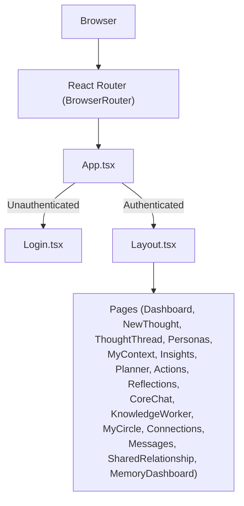

**Diagram sources**
- [main.tsx:1-14](file://frontend/src/main.tsx#L1-L14)
- [App.tsx:1-70](file://frontend/src/App.tsx#L1-L70)
- [Layout.tsx:1-436](file://frontend/src/components/Layout.tsx#L1-L436)

**Section sources**
- [main.tsx:1-14](file://frontend/src/main.tsx#L1-L14)
- [App.tsx:1-70](file://frontend/src/App.tsx#L1-L70)
- [Layout.tsx:1-436](file://frontend/src/components/Layout.tsx#L1-L436)

## Core Components
- Authentication and routing
  - Root App component checks authentication via a store hook and renders Login when not authenticated or the authenticated Layout with routes otherwise.
  - BrowserRouter wraps the app to enable client-side routing.
- Layout
  - Provides a responsive sidebar with navigation links, user profile, logout, and a focus mode panel.
  - Integrates real-time messaging via a WebSocket connection and subscription status loading.
  - Exposes a focus mode with quick thought capture and AI chat with persona selection.
- Stores and APIs
  - Pages integrate with multiple stores (auth, thought, persona, messaging, subscription) and API modules for each domain (thoughts, planner, insights, etc.).

Key integration points:
- Authentication guard: App.tsx uses an auth store to decide whether to render Login or the authenticated route tree.
- Real-time updates: Layout.tsx connects/disconnects a WebSocket and periodically reloads unread counts.
- State synchronization: Pages update stores (e.g., adding a thought to the thought store after creation) to keep UI in sync.

**Section sources**
- [App.tsx:1-70](file://frontend/src/App.tsx#L1-L70)
- [Layout.tsx:1-436](file://frontend/src/components/Layout.tsx#L1-L436)

## Architecture Overview
The routing tree is defined in App.tsx with nested routes inside Layout. Each page composes domain-specific UI, state, and API interactions. Authentication is enforced at the route level by the App wrapper.

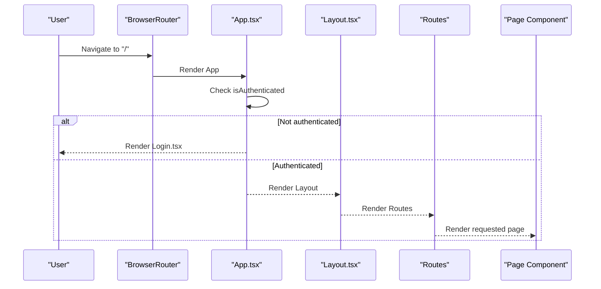

**Diagram sources**
- [main.tsx:1-14](file://frontend/src/main.tsx#L1-L14)
- [App.tsx:1-70](file://frontend/src/App.tsx#L1-L70)
- [Layout.tsx:1-436](file://frontend/src/components/Layout.tsx#L1-L436)

## Detailed Component Analysis

### Authentication and Routing (App and Layout)
- App.tsx
  - Uses an auth store to determine if the user is authenticated.
  - Renders Login when not authenticated; otherwise renders Layout with all pages.
  - Includes global error boundary and toast containers.
- Layout.tsx
  - Implements responsive sidebar with navigation items mapped to routes.
  - Manages focus mode with quick thought capture and AI chat panel.
  - Connects a WebSocket for real-time messaging and loads unread counts.
  - Loads subscription status on mount and periodically refreshes.

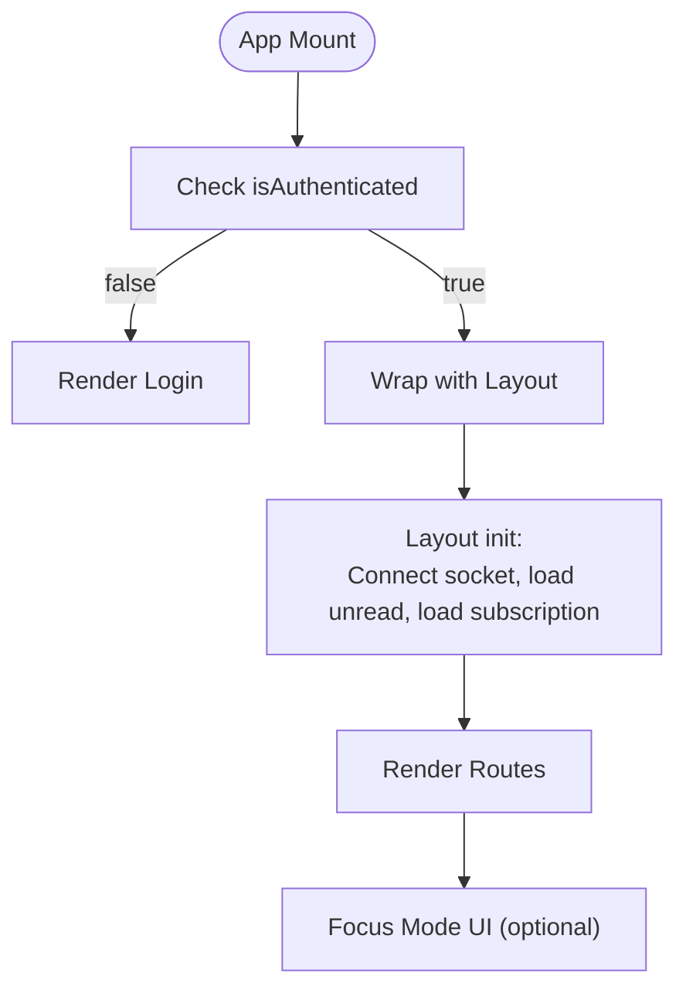

**Diagram sources**
- [App.tsx:1-70](file://frontend/src/App.tsx#L1-L70)
- [Layout.tsx:1-436](file://frontend/src/components/Layout.tsx#L1-L436)

**Section sources**
- [App.tsx:1-70](file://frontend/src/App.tsx#L1-L70)
- [Layout.tsx:1-436](file://frontend/src/components/Layout.tsx#L1-L436)

### Dashboard
- Purpose: Aggregates user insights, plans, actions, and recent thoughts into a unified overview.
- Data fetching:
  - Loads recent thoughts, planner stats, check-in data, pending actions, relationship health, and ontology snapshot.
  - Uses Promise.all to parallelize multiple API calls.
- State management:
  - Uses thought store to manage the list of thoughts.
  - Uses auth store for user metadata.
- Interactions:
  - Supports filtering and searching thoughts, deleting thoughts with confirmation, and refreshing the ontology snapshot.
- Styling and responsiveness:
  - Responsive grid layout with cards for each widget.
  - Animated transitions and gradient accents.

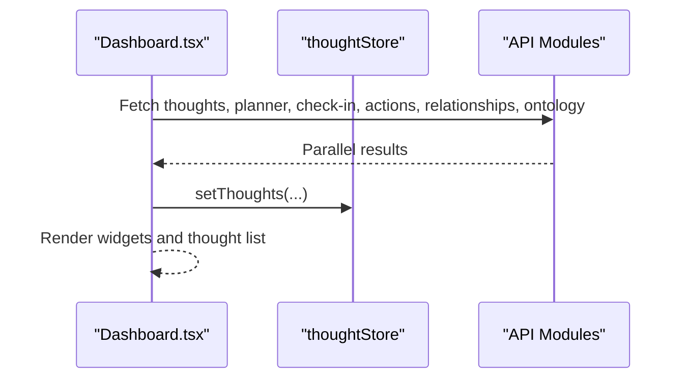

**Diagram sources**
- [Dashboard.tsx:1-794](file://frontend/src/pages/Dashboard.tsx#L1-L794)

**Section sources**
- [Dashboard.tsx:1-794](file://frontend/src/pages/Dashboard.tsx#L1-L794)

### Login
- Purpose: Phone-number-based authentication with OTP verification and optional name setup for new users.
- Flow:
  - Phone → OTP → Verify OTP → New user sets name → Persist auth state.
- State management:
  - Uses auth store to persist tokens and user data.
- UX:
  - Step indicators, countdown for resend OTP, and inline error handling.

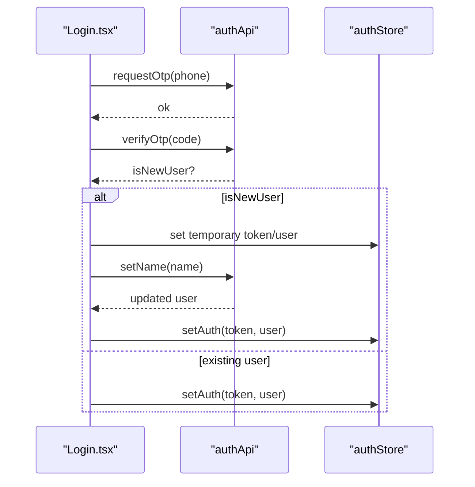

**Diagram sources**
- [Login.tsx:1-277](file://frontend/src/pages/Login.tsx#L1-L277)

**Section sources**
- [Login.tsx:1-277](file://frontend/src/pages/Login.tsx#L1-L277)

### NewThought
- Purpose: Create a new thought and optionally analyze it with selected personas.
- Data fetching:
  - Loads active personas for selection.
  - Submits thought creation and optional persona analysis.
- State management:
  - Uses thought store to add newly created thought.
- UX:
  - Inline persona creation form, recommendation hints based on thought type, and immediate feedback.

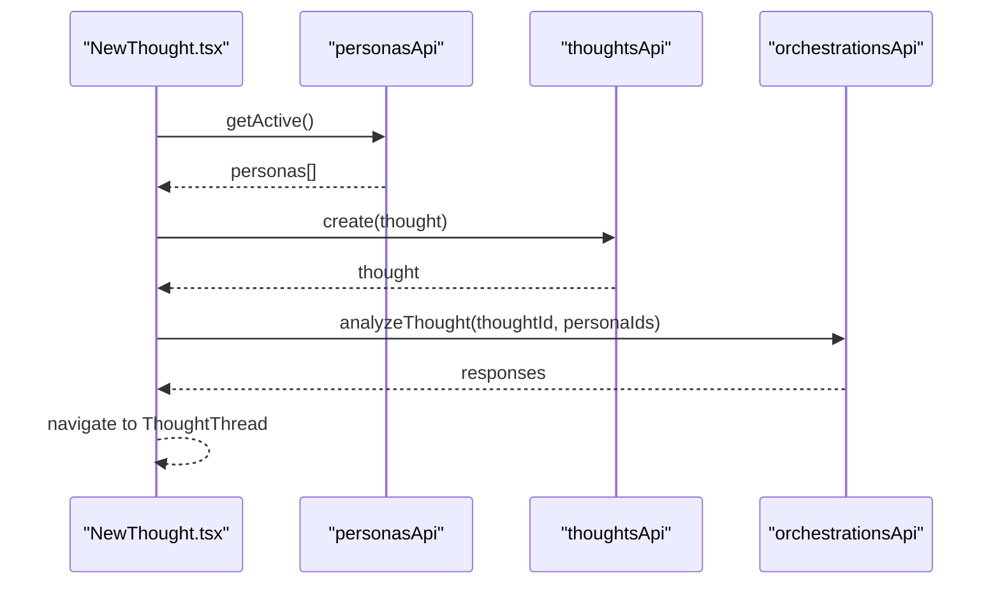

**Diagram sources**
- [NewThought.tsx:1-357](file://frontend/src/pages/NewThought.tsx#L1-L357)

**Section sources**
- [NewThought.tsx:1-357](file://frontend/src/pages/NewThought.tsx#L1-L357)

### ThoughtThread
- Purpose: View and interact with a thought’s persona-driven conversation threads.
- Features:
  - Persona analysis, inline replies, reply-all, streaming responses, status transitions, export to Markdown/PDF.
  - Comparison view to compare persona responses side-by-side.
- Data fetching:
  - Loads thought by ID, active personas, and supports continuing threads and persona replies.
- State management:
  - Uses thought store to set current thought and update after mutations.
- UX:
  - Collapsible thinking blocks, streaming reply UI, and persona-specific reply forms.

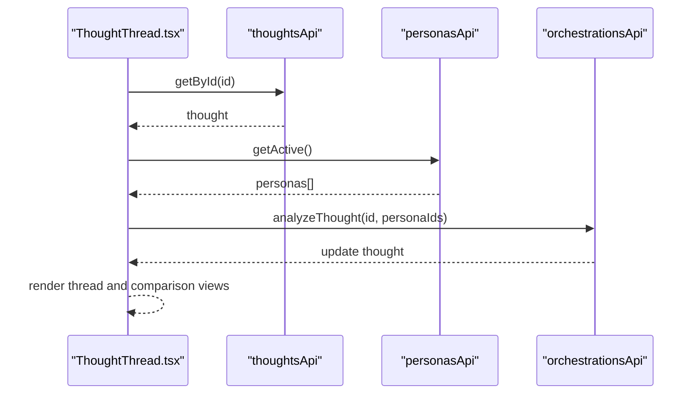

**Diagram sources**
- [ThoughtThread.tsx:1-1016](file://frontend/src/pages/ThoughtThread.tsx#L1-L1016)

**Section sources**
- [ThoughtThread.tsx:1-1016](file://frontend/src/pages/ThoughtThread.tsx#L1-L1016)

### Personas
- Purpose: Manage AI personas (create, edit, delete, knowledge base upload).
- Features:
  - Persona CRUD, category filtering, knowledge base panel with PDF upload and progress tracking.
- Data fetching:
  - Loads all personas, documents per persona, and handles upload progress callbacks.
- UX:
  - Expandable knowledge base panels, category chips, and inline editing.

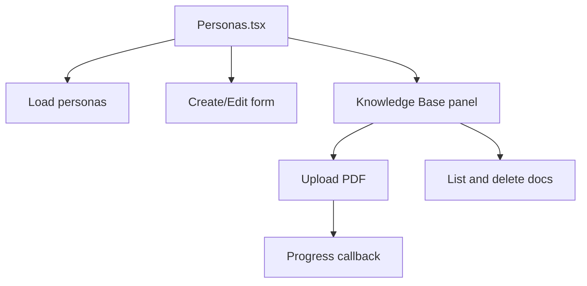

**Diagram sources**
- [Personas.tsx:1-556](file://frontend/src/pages/Personas.tsx#L1-L556)

**Section sources**
- [Personas.tsx:1-556](file://frontend/src/pages/Personas.tsx#L1-L556)

### MyContext
- Purpose: Allow users to define a rich personal context used by all personas.
- Features:
  - 12 context fields with icons and hints, progress indicator, sticky save bar.
- Data fetching:
  - Loads and updates user context via userContext API.
- UX:
  - Persistent save bar appears when changes exist.

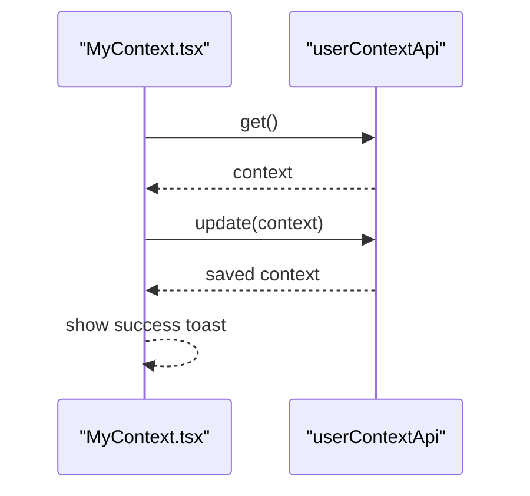

**Diagram sources**
- [MyContext.tsx:1-270](file://frontend/src/pages/MyContext.tsx#L1-L270)

**Section sources**
- [MyContext.tsx:1-270](file://frontend/src/pages/MyContext.tsx#L1-L270)

### Insights
- Purpose: Present analytics and insights across thoughts, personas, and relationships.
- Features:
  - Stats, recurring topics, persona effectiveness, life dimensions wheel, relationship health, generated reports.
- Data fetching:
  - Parallel loads for stats, topics, reports, life dimensions, and relationship health.
- UX:
  - Expandable report cards, generation buttons, and opt-in toggles.

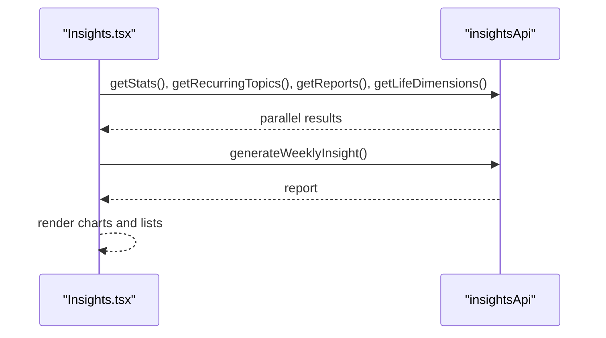

**Diagram sources**
- [Insights.tsx:1-619](file://frontend/src/pages/Insights.tsx#L1-L619)

**Section sources**
- [Insights.tsx:1-619](file://frontend/src/pages/Insights.tsx#L1-L619)

### Planner
- Purpose: Plan any day with time-slotted tasks, AI-generated insights, and daily check-in.
- Features:
  - Calendar view, task list with reorder/delete/status, insight expansion, daily mood/energy check-in.
- Data fetching:
  - Loads planned dates for calendar, plan for selected date, and check-in data.
- UX:
  - Sticky save bar, expandable insights, and auto-save check-in.

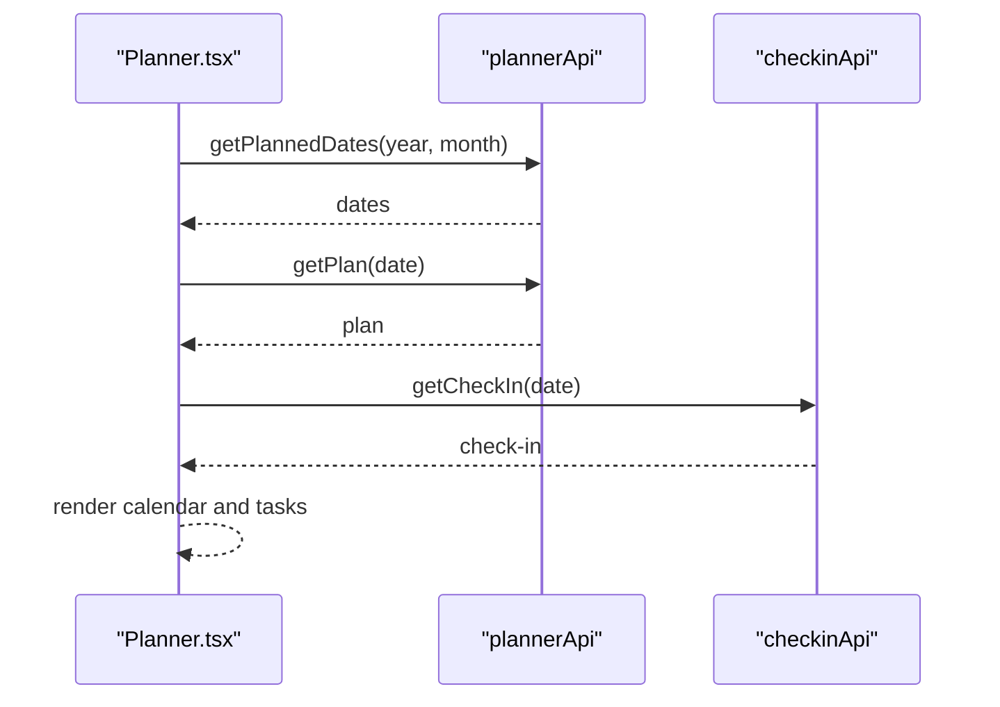

**Diagram sources**
- [Planner.tsx:1-740](file://frontend/src/pages/Planner.tsx#L1-L740)

**Section sources**
- [Planner.tsx:1-740](file://frontend/src/pages/Planner.tsx#L1-L740)

### Actions
- Purpose: Aggregate actionable items extracted from persona responses and link them to the planner.
- Features:
  - Filter by pending/all, mark done, dismiss, and add to planner modal with date/time slot.
- Data fetching:
  - Loads action items and links items to planner.
- UX:
  - Grouped by thought, with persona attribution and timestamps.

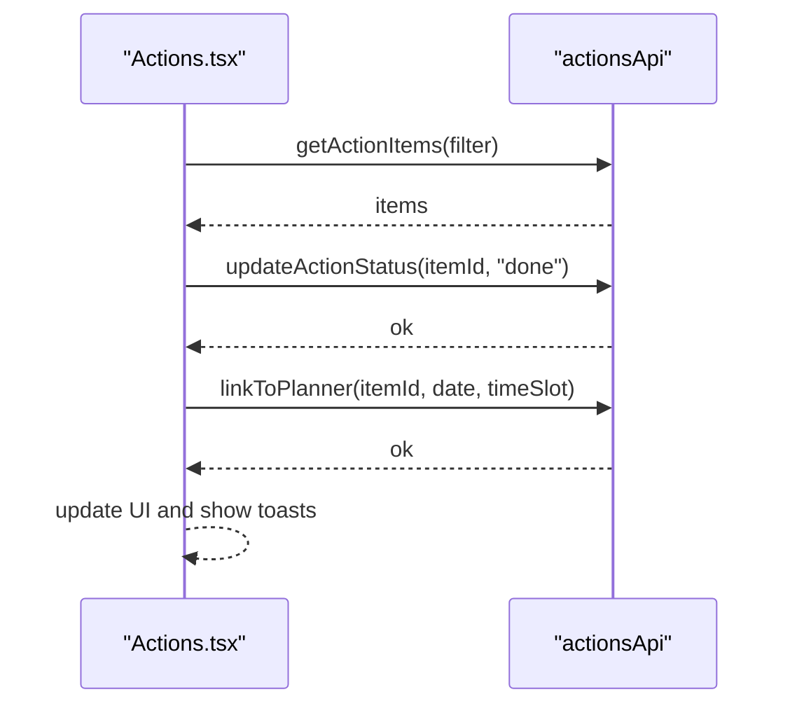

**Diagram sources**
- [Actions.tsx:1-269](file://frontend/src/pages/Actions.tsx#L1-L269)

**Section sources**
- [Actions.tsx:1-269](file://frontend/src/pages/Actions.tsx#L1-L269)

### Reflections
- Purpose: Curate and review reflective content and insights.
- Data fetching:
  - Loads reflection-related data from insights and related APIs.
- State management:
  - Integrates with insights store and thought store for reflection threads.
- UX:
  - Clean card-based layout with export and status controls.

**Section sources**
- [Reflections.tsx:1-1](file://frontend/src/pages/Reflections.tsx#L1-L1)

### CoreChat
- Purpose: Unified AI chat experience with persona synthesis and streaming responses.
- Data fetching:
  - Streams chat responses and synthesis from orchestration API.
- State management:
  - Maintains chat history and persona selection.
- UX:
  - Floating chat panel, typing indicators, and markdown rendering.

**Section sources**
- [CoreChat.tsx:1-1](file://frontend/src/pages/CoreChat.tsx#L1-L1)

### KnowledgeWorker
- Purpose: Advanced document-based analysis and synthesis powered by tools and agents.
- Data fetching:
  - Streams analysis results and manages document extraction/storage.
- State management:
  - Integrates with knowledge worker store and document services.
- UX:
  - Rich markdown previews and progress indicators.

**Section sources**
- [KnowledgeWorker.tsx:1-1](file://frontend/src/pages/KnowledgeWorker.tsx#L1-L1)

### MyCircle
- Purpose: Visualize and manage social circles, life events, rituals, and tensions.
- Data fetching:
  - Loads circle data, events, rituals, and tension entries.
- UX:
  - Tabbed interface with graphs and summaries.

**Section sources**
- [MyCircle.tsx:1-1](file://frontend/src/pages/MyCircle.tsx#L1-L1)

### Connections
- Purpose: Manage and view connections with optional shared relationship features.
- Data fetching:
  - Loads connection data and shared notes.
- UX:
  - List and detail views with messaging shortcuts.

**Section sources**
- [Connections.tsx:1-1](file://frontend/src/pages/Connections.tsx#L1-L1)

### Messages
- Purpose: Real-time messaging with reactions, shared notes, and conversation settings.
- Data fetching:
  - Uses WebSocket gateway and messaging API.
- State management:
  - Integrates with messaging store and socket connection.
- UX:
  - Message threads, reactions, and settings modals.

**Section sources**
- [Messages.tsx:1-1](file://frontend/src/pages/Messages.tsx#L1-L1)

### SharedRelationship
- Purpose: Collaborative relationship view with shared notes and mediated conversations.
- Data fetching:
  - Loads shared relationship data and mediated sessions.
- UX:
  - Read-only collaborative view with export options.

**Section sources**
- [SharedRelationship.tsx:1-1](file://frontend/src/pages/SharedRelationship.tsx#L1-L1)

### MemoryDashboard
- Purpose: Explore and manage semantic memory, consolidation, and recall.
- Data fetching:
  - Loads memory snapshots and consolidation metrics.
- UX:
  - Timeline and search-based memory exploration.

**Section sources**
- [MemoryDashboard.tsx:1-1](file://frontend/src/pages/MemoryDashboard.tsx#L1-L1)

## Dependency Analysis
- Routing and guards
  - App.tsx depends on auth store to gate routes.
  - Layout.tsx depends on auth store for user info and on messaging store for unread counts.
- API integrations
  - Each page imports relevant API modules (e.g., thoughtsApi, plannerApi, insightsApi).
- Stores
  - Pages update and read from domain-specific stores (thoughtStore, personaStore, messagingStore, subscriptionStore).
- Real-time
  - Layout.tsx initializes and tears down a WebSocket connection and periodic unread refresh.

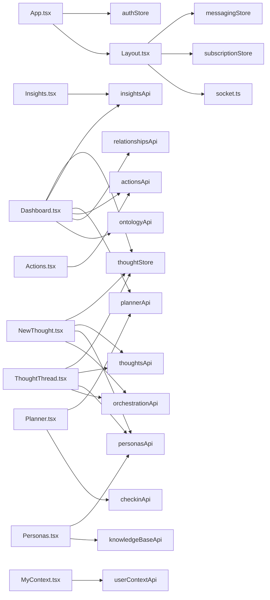

**Diagram sources**
- [App.tsx:1-70](file://frontend/src/App.tsx#L1-L70)
- [Layout.tsx:1-436](file://frontend/src/components/Layout.tsx#L1-L436)
- [Dashboard.tsx:1-794](file://frontend/src/pages/Dashboard.tsx#L1-L794)
- [NewThought.tsx:1-357](file://frontend/src/pages/NewThought.tsx#L1-L357)
- [ThoughtThread.tsx:1-1016](file://frontend/src/pages/ThoughtThread.tsx#L1-L1016)
- [Personas.tsx:1-556](file://frontend/src/pages/Personas.tsx#L1-L556)
- [MyContext.tsx:1-270](file://frontend/src/pages/MyContext.tsx#L1-L270)
- [Insights.tsx:1-619](file://frontend/src/pages/Insights.tsx#L1-L619)
- [Planner.tsx:1-740](file://frontend/src/pages/Planner.tsx#L1-L740)
- [Actions.tsx:1-269](file://frontend/src/pages/Actions.tsx#L1-L269)

**Section sources**
- [App.tsx:1-70](file://frontend/src/App.tsx#L1-L70)
- [Layout.tsx:1-436](file://frontend/src/components/Layout.tsx#L1-L436)
- [Dashboard.tsx:1-794](file://frontend/src/pages/Dashboard.tsx#L1-L794)
- [NewThought.tsx:1-357](file://frontend/src/pages/NewThought.tsx#L1-L357)
- [ThoughtThread.tsx:1-1016](file://frontend/src/pages/ThoughtThread.tsx#L1-L1016)
- [Personas.tsx:1-556](file://frontend/src/pages/Personas.tsx#L1-L556)
- [MyContext.tsx:1-270](file://frontend/src/pages/MyContext.tsx#L1-L270)
- [Insights.tsx:1-619](file://frontend/src/pages/Insights.tsx#L1-L619)
- [Planner.tsx:1-740](file://frontend/src/pages/Planner.tsx#L1-L740)
- [Actions.tsx:1-269](file://frontend/src/pages/Actions.tsx#L1-L269)

## Performance Considerations
- Parallelization
  - Dashboard uses Promise.all to fetch multiple datasets concurrently.
  - Insights loads stats, topics, reports, and dimensions in parallel.
- Minimal re-renders
  - Pages use local state for UI-only updates (e.g., form inputs) and rely on stores for cross-component state.
- Lazy initialization
  - Layout connects sockets and loads subscription data only when authenticated.
- Streaming and incremental updates
  - ThoughtThread and Planner support streaming and incremental UI updates for smoother interactions.
- Memoization
  - Planner memoizes calendar grid and planned dates lookup to avoid recalculations.

[No sources needed since this section provides general guidance]

## Troubleshooting Guide
- Authentication issues
  - Verify auth store state and token persistence. Check Login steps and OTP flow.
- Real-time messaging
  - Ensure socket connection is established and periodic unread counts are refreshed.
- API failures
  - Pages surface errors via toast notifications and error boundaries. Inspect network tab for failed requests.
- State desynchronization
  - Ensure stores are updated after successful API calls (e.g., adding a thought to thoughtStore after creation).

**Section sources**
- [App.tsx:1-70](file://frontend/src/App.tsx#L1-L70)
- [Layout.tsx:1-436](file://frontend/src/components/Layout.tsx#L1-L436)

## Conclusion
The page-based component architecture combines centralized routing and authentication with modular, domain-focused pages. Each page integrates tightly with stores and APIs, follows consistent UX patterns, and leverages parallelization and streaming for performance. The Layout component centralizes navigation and real-time features, while individual pages encapsulate their data fetching, state management, and user interactions.