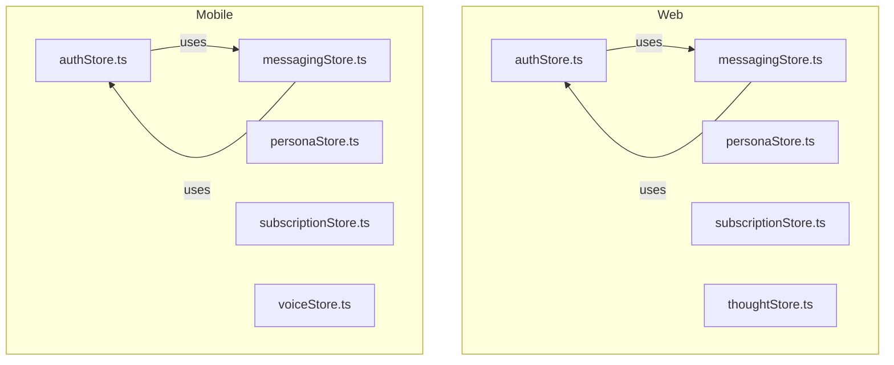
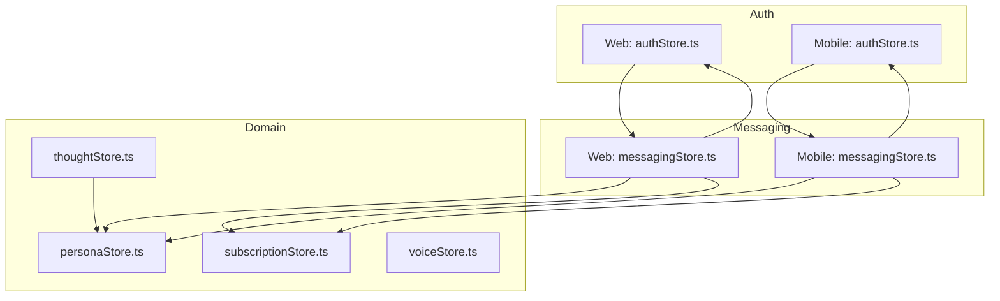
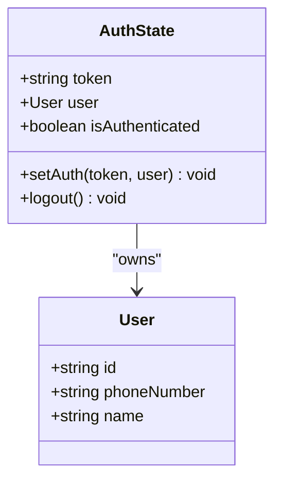
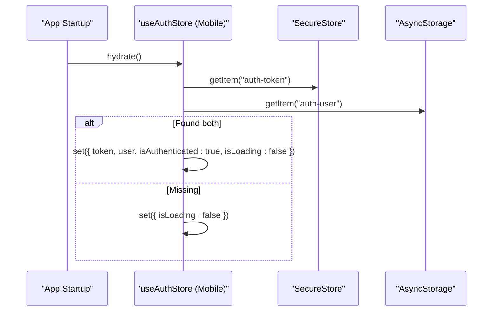
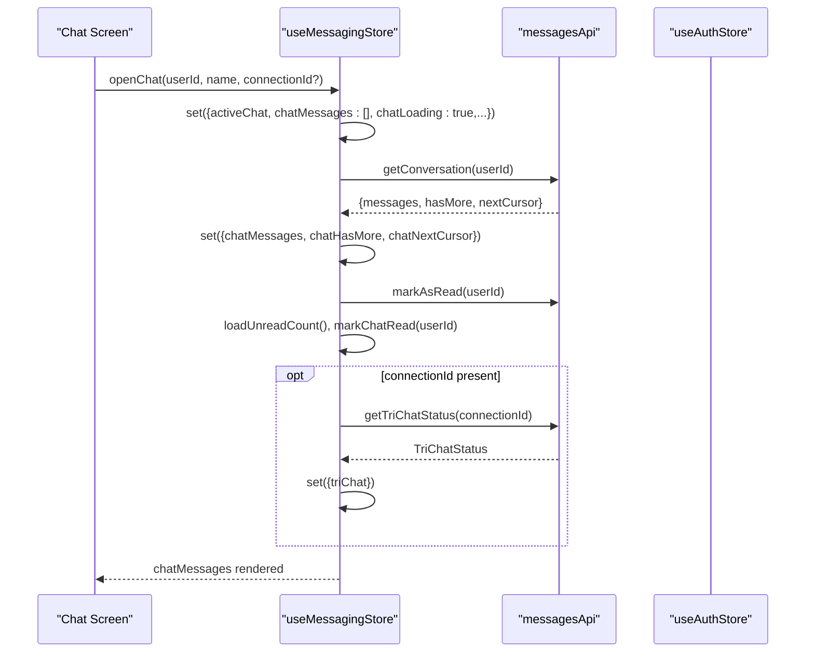
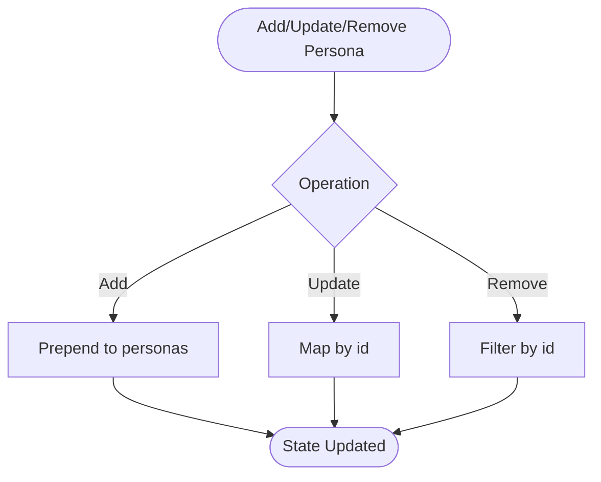
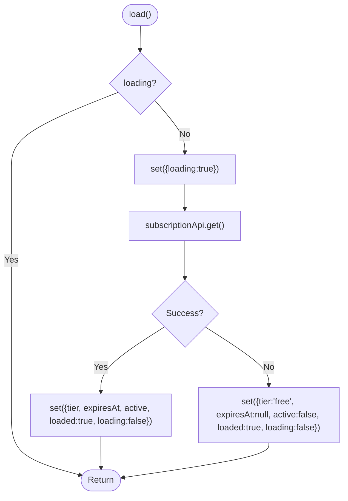
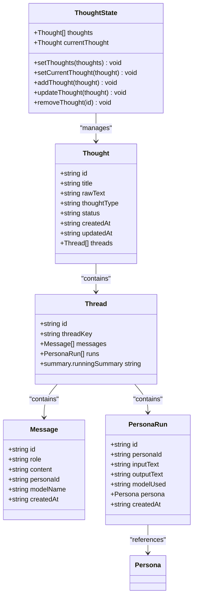
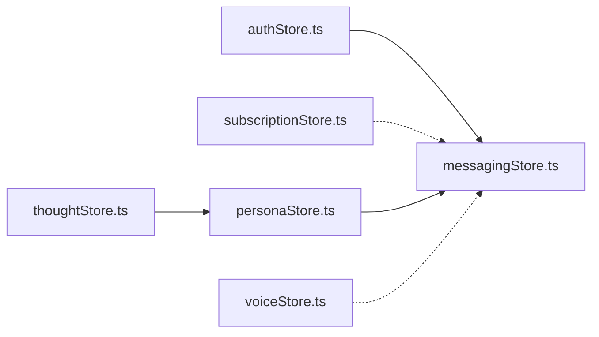

# State Management

<cite>
**Referenced Files in This Document**
- [authStore.ts](file://frontend/src/store/authStore.ts)
- [messagingStore.ts](file://frontend/src/store/messagingStore.ts)
- [personaStore.ts](file://frontend/src/store/personaStore.ts)
- [subscriptionStore.ts](file://frontend/src/store/subscriptionStore.ts)
- [thoughtStore.ts](file://frontend/src/store/thoughtStore.ts)
- [authStore.ts](file://mobile/src/store/authStore.ts)
- [messagingStore.ts](file://mobile/src/store/messagingStore.ts)
- [personaStore.ts](file://mobile/src/store/personaStore.ts)
- [subscriptionStore.ts](file://mobile/src/store/subscriptionStore.ts)
- [voiceStore.ts](file://mobile/src/store/voiceStore.ts)
</cite>

## Table of Contents
1. [Introduction](#introduction)
2. [Project Structure](#project-structure)
3. [Core Components](#core-components)
4. [Architecture Overview](#architecture-overview)
5. [Detailed Component Analysis](#detailed-component-analysis)
6. [Dependency Analysis](#dependency-analysis)
7. [Performance Considerations](#performance-considerations)
8. [Troubleshooting Guide](#troubleshooting-guide)
9. [Conclusion](#conclusion)
10. [Appendices](#appendices)

## Introduction
This document explains the Zustand-based state management architecture used across the frontend and mobile applications. It focuses on five primary stores:
- authStore: Authentication state and lifecycle
- messagingStore: Real-time chat, connections, conversations, and tri-chat mediator
- personaStore: AI persona catalog and lifecycle
- subscriptionStore: Premium tier and billing state
- thoughtStore: Thought records, threads, and persona runs
- voiceStore: Audio processing state (mobile)

It covers store structure, action patterns, selectors, subscriptions, integration with components, async operations, cross-component sharing, hydration/persistence, and backend synchronization.

## Project Structure
The state management is organized per platform:
- Web: frontend/src/store/*
- Mobile: mobile/src/store/*

Each store is a single-file Zustand slice exporting a named hook useXStore. Stores commonly depend on API modules under frontend/src/api/* or mobile/src/api/*.

**Diagram sources**
- [authStore.ts:1-32](file://frontend/src/store/authStore.ts#L1-L32)
- [messagingStore.ts:1-412](file://frontend/src/store/messagingStore.ts#L1-L412)
- [personaStore.ts:1-39](file://frontend/src/store/personaStore.ts#L1-L39)
- [subscriptionStore.ts:1-46](file://frontend/src/store/subscriptionStore.ts#L1-L46)
- [thoughtStore.ts:1-79](file://frontend/src/store/thoughtStore.ts#L1-L79)
- [authStore.ts:1-75](file://mobile/src/store/authStore.ts#L1-L75)
- [messagingStore.ts:1-373](file://mobile/src/store/messagingStore.ts#L1-L373)
- [personaStore.ts:1-23](file://mobile/src/store/personaStore.ts#L1-L23)
- [subscriptionStore.ts:1-45](file://mobile/src/store/subscriptionStore.ts#L1-L45)
- [voiceStore.ts](file://mobile/src/store/voiceStore.ts)

**Section sources**
- [authStore.ts:1-32](file://frontend/src/store/authStore.ts#L1-L32)
- [messagingStore.ts:1-412](file://frontend/src/store/messagingStore.ts#L1-L412)
- [personaStore.ts:1-39](file://frontend/src/store/personaStore.ts#L1-L39)
- [subscriptionStore.ts:1-46](file://frontend/src/store/subscriptionStore.ts#L1-L46)
- [thoughtStore.ts:1-79](file://frontend/src/store/thoughtStore.ts#L1-L79)
- [authStore.ts:1-75](file://mobile/src/store/authStore.ts#L1-L75)
- [messagingStore.ts:1-373](file://mobile/src/store/messagingStore.ts#L1-L373)
- [personaStore.ts:1-23](file://mobile/src/store/personaStore.ts#L1-L23)
- [subscriptionStore.ts:1-45](file://mobile/src/store/subscriptionStore.ts#L1-L45)
- [voiceStore.ts](file://mobile/src/store/voiceStore.ts)

## Core Components
- authStore
  - Purpose: Holds JWT token, user profile, and authentication status; exposes setAuth, logout, and hydration helpers.
  - Persistence: Web uses Zustand persist middleware; Mobile persists via SecureStore and AsyncStorage and registers a logout callback.
  - Selectors: Access via useAuthStore.getState() for imperative reads in stores (e.g., messagingStore).
- messagingStore
  - Purpose: Manages connections, conversations, active chat, messages, unread counts, reply/edit states, and tri-chat mediator streams.
  - Async: Loads connections/conversations/unreads; fetches paginated messages; updates read status; integrates with tri-chat sessions.
  - Cross-store: Reads authStore for user identity; updates subscriptionStore indirectly via API responses.
- personaStore
  - Purpose: CRUD for personas (templates vs. user-defined).
  - Sync: Typically populated from backend APIs; used by messagingStore tri-chat and thoughtStore personaRuns.
- subscriptionStore
  - Purpose: Tracks tier, expiry, activity, and loading state; loads from backend and resets on logout.
- thoughtStore
  - Purpose: Manages thoughts, threads, messages, and persona runs; supports add/update/remove and current selection.
- voiceStore (mobile)
  - Purpose: Manages audio recording, streaming, and transcription state for voice-enabled features.

**Section sources**
- [authStore.ts:1-32](file://frontend/src/store/authStore.ts#L1-L32)
- [messagingStore.ts:1-412](file://frontend/src/store/messagingStore.ts#L1-L412)
- [personaStore.ts:1-39](file://frontend/src/store/personaStore.ts#L1-L39)
- [subscriptionStore.ts:1-46](file://frontend/src/store/subscriptionStore.ts#L1-L46)
- [thoughtStore.ts:1-79](file://frontend/src/store/thoughtStore.ts#L1-L79)
- [authStore.ts:1-75](file://mobile/src/store/authStore.ts#L1-L75)
- [messagingStore.ts:1-373](file://mobile/src/store/messagingStore.ts#L1-L373)
- [personaStore.ts:1-23](file://mobile/src/store/personaStore.ts#L1-L23)
- [subscriptionStore.ts:1-45](file://mobile/src/store/subscriptionStore.ts#L1-L45)
- [voiceStore.ts](file://mobile/src/store/voiceStore.ts)

## Architecture Overview
Zustand slices encapsulate domain-specific state and actions. Stores communicate implicitly via shared API modules and explicitly via imperative reads of other stores’ state. Hydration and persistence are handled per platform.

**Diagram sources**
- [authStore.ts:1-32](file://frontend/src/store/authStore.ts#L1-L32)
- [messagingStore.ts:1-412](file://frontend/src/store/messagingStore.ts#L1-L412)
- [personaStore.ts:1-39](file://frontend/src/store/personaStore.ts#L1-L39)
- [subscriptionStore.ts:1-46](file://frontend/src/store/subscriptionStore.ts#L1-L46)
- [thoughtStore.ts:1-79](file://frontend/src/store/thoughtStore.ts#L1-L79)
- [authStore.ts:1-75](file://mobile/src/store/authStore.ts#L1-L75)
- [messagingStore.ts:1-373](file://mobile/src/store/messagingStore.ts#L1-L373)
- [personaStore.ts:1-23](file://mobile/src/store/personaStore.ts#L1-L23)
- [subscriptionStore.ts:1-45](file://mobile/src/store/subscriptionStore.ts#L1-L45)
- [voiceStore.ts](file://mobile/src/store/voiceStore.ts)

## Detailed Component Analysis

### authStore (Web)
- State shape: token, user, isAuthenticated.
- Actions: setAuth, logout.
- Persistence: Zustand persist middleware with a storage name.
- Integration: messagingStore reads authStore’s user id to decide whether to include self-authored mediator placeholders.

**Diagram sources**
- [authStore.ts:4-16](file://frontend/src/store/authStore.ts#L4-L16)

**Section sources**
- [authStore.ts:1-32](file://frontend/src/store/authStore.ts#L1-L32)
- [messagingStore.ts:156-183](file://frontend/src/store/messagingStore.ts#L156-L183)

### authStore (Mobile)
- State shape: token, user, isAuthenticated, isLoading.
- Actions: setAuth, updateUser, logout, setLoading, hydrate.
- Persistence: SecureStore for token, AsyncStorage for user; hydrated on app start; logout triggers API client cleanup.
- Integration: messagingStore reads authStore’s user id for active chat filtering.

**Diagram sources**
- [authStore.ts:56-70](file://mobile/src/store/authStore.ts#L56-L70)

**Section sources**
- [authStore.ts:1-75](file://mobile/src/store/authStore.ts#L1-L75)
- [messagingStore.ts:135-158](file://mobile/src/store/messagingStore.ts#L135-L158)

### messagingStore (Web)
- State: connections, pendingRequests, conversations, activeChat, chatMessages, unread counters, triChat, mediator streaming id.
- Actions: loadConnections, loadPendingRequests, loadConversations, loadUnreadCount, openChat, loadMoreMessages, addIncomingMessage, addSentMessage, replaceTempWithReal, markChatRead, closeChat, and extensive tri-chat actions.
- Async pattern: set loading flags, call API, update state, refresh unread totals.
- Cross-store usage: reads authStore for user id to compute belongsToActiveChat.

**Diagram sources**
- [messagingStore.ts:124-141](file://frontend/src/store/messagingStore.ts#L124-L141)

**Section sources**
- [messagingStore.ts:1-412](file://frontend/src/store/messagingStore.ts#L1-L412)

### messagingStore (Mobile)
- State and actions mirror the web store, with identical tri-chat and message lifecycle handling.
- Differences: Uses mobile API modules and AsyncStorage for hydration; still reads authStore for user id.

**Section sources**
- [messagingStore.ts:1-373](file://mobile/src/store/messagingStore.ts#L1-L373)

### personaStore (Web)
- State: personas array.
- Actions: setPersonas, addPersona, updatePersona, removePersona.

**Diagram sources**
- [personaStore.ts:24-38](file://frontend/src/store/personaStore.ts#L24-L38)

**Section sources**
- [personaStore.ts:1-39](file://frontend/src/store/personaStore.ts#L1-L39)

### personaStore (Mobile)
- State and actions mirror the web store.

**Section sources**
- [personaStore.ts:1-23](file://mobile/src/store/personaStore.ts#L1-L23)

### subscriptionStore (Web)
- State: tier, expiresAt, active, loaded, loading.
- Actions: load (async), set, reset.
- Behavior: deduplicates concurrent loads; on failure, falls back to free tier.

**Diagram sources**
- [subscriptionStore.ts:22-38](file://frontend/src/store/subscriptionStore.ts#L22-L38)

**Section sources**
- [subscriptionStore.ts:1-46](file://frontend/src/store/subscriptionStore.ts#L1-L46)

### subscriptionStore (Mobile)
- State and actions mirror the web store.

**Section sources**
- [subscriptionStore.ts:1-45](file://mobile/src/store/subscriptionStore.ts#L1-L45)

### thoughtStore (Web)
- State: thoughts array, currentThought.
- Actions: setThoughts, setCurrentThought, addThought, updateThought, removeThought.

**Diagram sources**
- [thoughtStore.ts:3-50](file://frontend/src/store/thoughtStore.ts#L3-L50)

**Section sources**
- [thoughtStore.ts:1-79](file://frontend/src/store/thoughtStore.ts#L1-L79)

### voiceStore (Mobile)
- Purpose: Manages audio recording, streaming, and transcription state for voice-enabled features.
- Typical fields: recording status, audio buffer, transcription progress, error state.
- Integration: Often paired with messagingStore for voice-to-text in chats.

**Section sources**
- [voiceStore.ts](file://mobile/src/store/voiceStore.ts)

## Dependency Analysis
- Cross-store dependencies
  - messagingStore depends on authStore for user identity to filter active chats and include self-authored mediator placeholders.
  - subscriptionStore is used by messagingStore indirectly via API responses and UI gating.
- API boundaries
  - All stores delegate network calls to API modules under frontend/src/api/* or mobile/src/api/*.
- Persistence and hydration
  - Web authStore uses Zustand persist; Mobile authStore persists tokens and user profiles via SecureStore and AsyncStorage and hydrates on startup.

**Diagram sources**
- [authStore.ts:1-32](file://frontend/src/store/authStore.ts#L1-L32)
- [messagingStore.ts:1-412](file://frontend/src/store/messagingStore.ts#L1-L412)
- [personaStore.ts:1-39](file://frontend/src/store/personaStore.ts#L1-L39)
- [subscriptionStore.ts:1-46](file://frontend/src/store/subscriptionStore.ts#L1-L46)
- [thoughtStore.ts:1-79](file://frontend/src/store/thoughtStore.ts#L1-L79)
- [voiceStore.ts](file://mobile/src/store/voiceStore.ts)

**Section sources**
- [messagingStore.ts:156-183](file://frontend/src/store/messagingStore.ts#L156-L183)
- [authStore.ts:56-70](file://mobile/src/store/authStore.ts#L56-L70)

## Performance Considerations
- Minimize re-renders
  - Split state into smaller slices; avoid forcing components to subscribe to unrelated parts of messagingStore.
  - Use shallow equality checks; prefer primitive fields in selectors.
- Efficient updates
  - Use functional set updates to prevent unnecessary renders (e.g., map/filter patterns).
- Pagination and caching
  - Keep cursors and hasMore flags to avoid re-fetching; merge arrays carefully to preserve order.
- Debounce and dedupe
  - Deduplicate incoming messages by id; avoid replacing temp messages twice.
- Asynchronous flows
  - Guard against concurrent loads (already implemented in subscriptionStore); surface loading flags to UI.
- Persistence
  - Persist only essential fields; avoid serializing large payloads; hydrate lazily on app start.

## Troubleshooting Guide
- Authentication issues
  - Verify token and user hydration on startup; ensure logout clears secure storage and cached token.
  - Confirm that API client logout callback invokes authStore.logout.
- Chat not updating
  - Ensure addIncomingMessage filters by activeChat and sender/receiver ids; confirm markAsRead is called after opening chat.
  - Check replaceTempWithReal logic for both tempId and fallback content+receiver match.
- Tri-chat mediator not visible
  - Confirm loadTriChatStatus is invoked when connectionId is present; verify mediator streaming id transitions.
- Unread counters incorrect
  - Ensure loadUnreadCount is called after markAsRead and on incoming messages from others.
- Subscription state stale
  - On API errors, subscriptionStore falls back to free; verify UI handles loaded flag.

**Section sources**
- [authStore.ts:47-70](file://mobile/src/store/authStore.ts#L47-L70)
- [messagingStore.ts:156-183](file://frontend/src/store/messagingStore.ts#L156-L183)
- [subscriptionStore.ts:34-36](file://frontend/src/store/subscriptionStore.ts#L34-L36)

## Conclusion
The Zustand stores provide a modular, pragmatic foundation for state management across platforms. By keeping stores focused on domains, delegating to API modules, and implementing robust hydration and async patterns, the system scales to real-time chat, persona management, subscription gating, thought records, and voice features. Following the best practices here will help maintain performance, correctness, and developer productivity.

## Appendices
- Best practices
  - Keep state flat where possible; normalize nested entities if needed.
  - Use selectors for derived data; memoize expensive computations.
  - Centralize side effects in stores; expose pure reducers only when safe.
  - Instrument state changes for debugging; log before/after snapshots during async flows.
  - Version persistence keys when migrating schemas; provide migrations on hydrate.