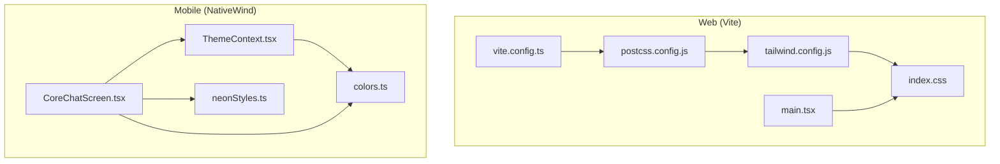
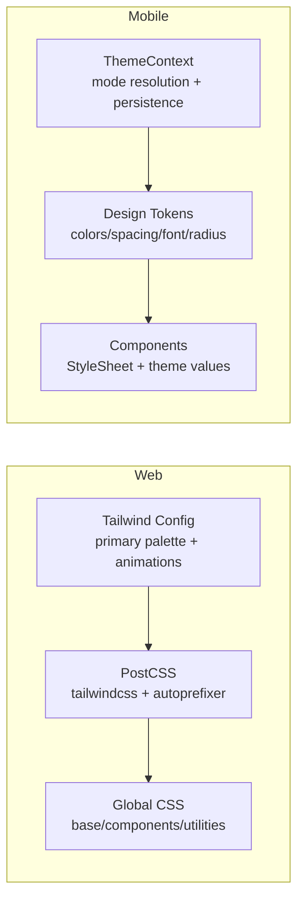
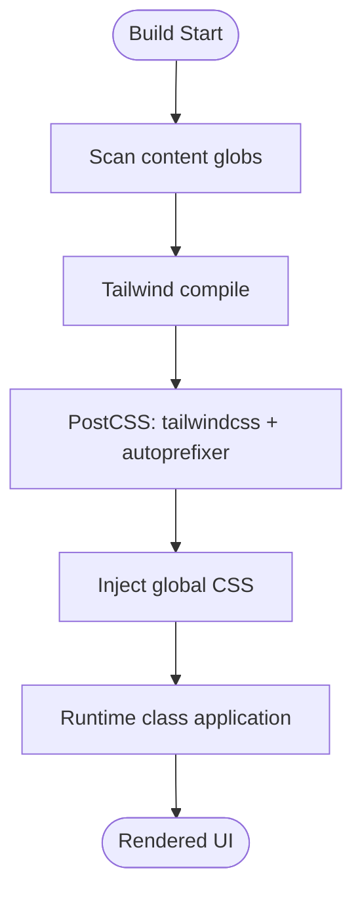
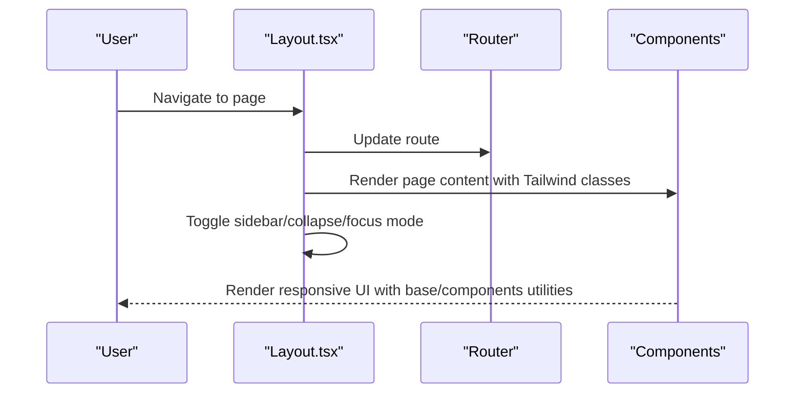
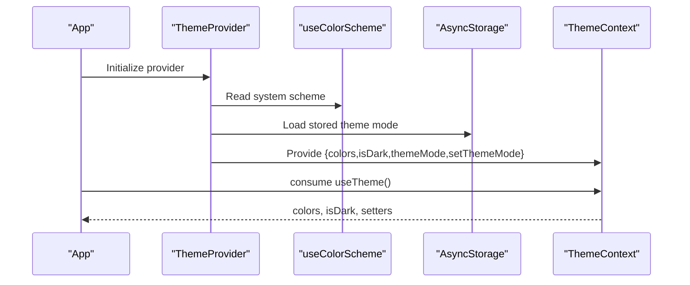
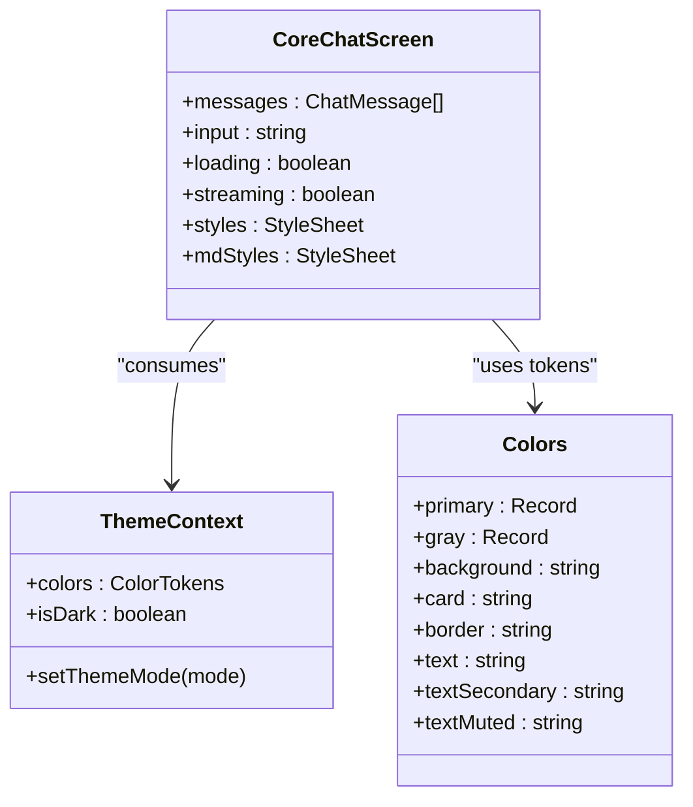
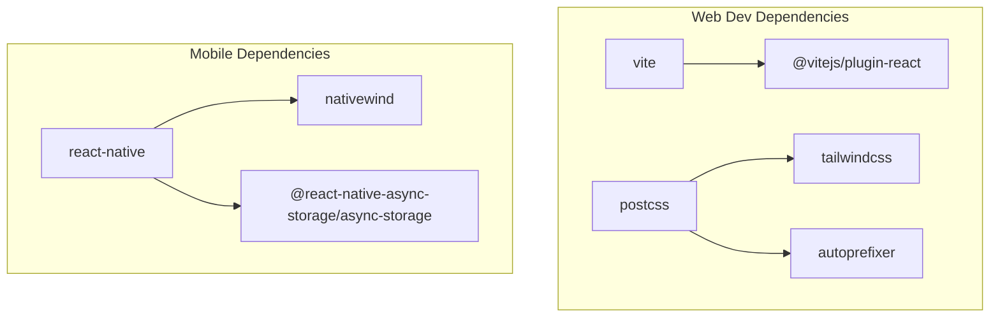

# Styling & Theming

<cite>
**Referenced Files in This Document**
- [tailwind.config.js](file://frontend/tailwind.config.js)
- [postcss.config.js](file://frontend/postcss.config.js)
- [index.css](file://frontend/src/index.css)
- [vite.config.ts](file://frontend/vite.config.ts)
- [package.json](file://frontend/package.json)
- [colors.ts](file://mobile/src/constants/colors.ts)
- [neonStyles.ts](file://mobile/src/constants/neonStyles.ts)
- [ThemeContext.tsx](file://mobile/src/contexts/ThemeContext.tsx)
- [CoreChatScreen.tsx](file://mobile/src/screens/CoreChatScreen.tsx)
- [Layout.tsx](file://frontend/src/components/Layout.tsx)
- [main.tsx](file://frontend/src/main.tsx)
</cite>

## Table of Contents
1. [Introduction](#introduction)
2. [Project Structure](#project-structure)
3. [Core Components](#core-components)
4. [Architecture Overview](#architecture-overview)
5. [Detailed Component Analysis](#detailed-component-analysis)
6. [Dependency Analysis](#dependency-analysis)
7. [Performance Considerations](#performance-considerations)
8. [Troubleshooting Guide](#troubleshooting-guide)
9. [Conclusion](#conclusion)

## Introduction
This document describes the styling and theming system across the web (Vite/Tailwind) and mobile (React Native with NativeWind) applications. It covers Tailwind CSS configuration, custom CSS architecture, responsive design patterns, color schemes, typography and spacing conventions, component styling approaches, dark/light theme implementation, theme switching mechanisms, and performance optimizations. Accessibility, cross-browser compatibility, and mobile-first strategies are addressed conceptually alongside code-level references.

## Project Structure
The styling system is split between two platforms:
- Web (Vite + Tailwind + PostCSS): Tailwind configuration extends a primary color palette and animations; custom base/components/utilities are defined in a global stylesheet. Build pipeline integrates Tailwind and autoprefixing.
- Mobile (React Native + NativeWind): Uses a design token system for colors, spacing, and typography; a theme context manages light/dark modes persisted locally; components apply styles via React Native StyleSheet with theme-aware values.

**Diagram sources**
- [vite.config.ts:1-22](file://frontend/vite.config.ts#L1-L22)
- [postcss.config.js:1-7](file://frontend/postcss.config.js#L1-L7)
- [tailwind.config.js:1-37](file://frontend/tailwind.config.js#L1-L37)
- [index.css:1-102](file://frontend/src/index.css#L1-102)
- [main.tsx:1-14](file://frontend/src/main.tsx#L1-L14)
- [ThemeContext.tsx:1-61](file://mobile/src/contexts/ThemeContext.tsx#L1-L61)
- [colors.ts:1-142](file://mobile/src/constants/colors.ts#L1-L142)
- [neonStyles.ts:1-38](file://mobile/src/constants/neonStyles.ts#L1-L38)
- [CoreChatScreen.tsx:1-1052](file://mobile/src/screens/CoreChatScreen.tsx#L1-L1052)

**Section sources**
- [vite.config.ts:1-22](file://frontend/vite.config.ts#L1-L22)
- [postcss.config.js:1-7](file://frontend/postcss.config.js#L1-L7)
- [tailwind.config.js:1-37](file://frontend/tailwind.config.js#L1-L37)
- [index.css:1-102](file://frontend/src/index.css#L1-102)
- [main.tsx:1-14](file://frontend/src/main.tsx#L1-L14)
- [ThemeContext.tsx:1-61](file://mobile/src/contexts/ThemeContext.tsx#L1-L61)
- [colors.ts:1-142](file://mobile/src/constants/colors.ts#L1-L142)
- [neonStyles.ts:1-38](file://mobile/src/constants/neonStyles.ts#L1-L38)
- [CoreChatScreen.tsx:1-1052](file://mobile/src/screens/CoreChatScreen.tsx#L1-L1052)

## Core Components
- Tailwind configuration extends a primary color palette and defines keyframe animations for micro-interactions. Content scanning targets HTML and TS/JS sources.
- Global stylesheet defines base, components, and utility layers, including reusable button, card, input, textarea classes and a set of custom animations.
- PostCSS pipeline applies Tailwind directives and autoprefixing.
- Mobile design tokens define light/dark palettes, spacing, font sizes, and border radii. A theme context resolves theme mode (system/light/dark), persists preferences, and exposes theme-aware values to components.
- Core chat screen demonstrates theme-driven styles, gradients, and component composition.

**Section sources**
- [tailwind.config.js:1-37](file://frontend/tailwind.config.js#L1-L37)
- [index.css:1-102](file://frontend/src/index.css#L1-102)
- [postcss.config.js:1-7](file://frontend/postcss.config.js#L1-L7)
- [colors.ts:1-142](file://mobile/src/constants/colors.ts#L1-L142)
- [ThemeContext.tsx:1-61](file://mobile/src/contexts/ThemeContext.tsx#L1-L61)
- [CoreChatScreen.tsx:1-1052](file://mobile/src/screens/CoreChatScreen.tsx#L1-L1052)

## Architecture Overview
The styling architecture separates concerns:
- Web: declarative utility-first CSS via Tailwind with custom component classes and animations.
- Mobile: explicit design tokens and a theme provider supplying runtime theme values to components.

**Diagram sources**
- [tailwind.config.js:1-37](file://frontend/tailwind.config.js#L1-L37)
- [postcss.config.js:1-7](file://frontend/postcss.config.js#L1-L7)
- [index.css:1-102](file://frontend/src/index.css#L1-102)
- [ThemeContext.tsx:1-61](file://mobile/src/contexts/ThemeContext.tsx#L1-L61)
- [colors.ts:1-142](file://mobile/src/constants/colors.ts#L1-L142)

## Detailed Component Analysis

### Web: Tailwind Configuration and Custom CSS
- Tailwind content scanning includes HTML and TS/JS sources to purge unused styles.
- Extends a primary color scale aligned with the mobile palette and adds micro-animation utilities for subtle transitions.
- Global stylesheet:
  - Base layer sets default body background and text colors.
  - Components layer defines reusable classes for buttons, cards, inputs, and textareas.
  - Utilities layer defines custom animations and effects (fade-in, scale-in, slide-up, float, shimmer, stagger delays) and glass-like backdrop filters.
- PostCSS pipeline ensures Tailwind directives are processed and vendor prefixes are applied.

**Diagram sources**
- [tailwind.config.js:1-37](file://frontend/tailwind.config.js#L1-L37)
- [postcss.config.js:1-7](file://frontend/postcss.config.js#L1-L7)
- [index.css:1-102](file://frontend/src/index.css#L1-102)

**Section sources**
- [tailwind.config.js:1-37](file://frontend/tailwind.config.js#L1-L37)
- [index.css:1-102](file://frontend/src/index.css#L1-102)
- [postcss.config.js:1-7](file://frontend/postcss.config.js#L1-L7)

### Web: Layout Component Styling Patterns
- Uses Tailwind utilities for layout scaffolding, responsive breakpoints, and interactive states.
- Applies component classes (buttons, inputs, textareas) consistently across pages.
- Implements responsive sidebar behavior with mobile overlays and collapsible navigation.

**Diagram sources**
- [Layout.tsx:1-436](file://frontend/src/components/Layout.tsx#L1-L436)

**Section sources**
- [Layout.tsx:1-436](file://frontend/src/components/Layout.tsx#L1-L436)

### Mobile: Theme Provider and Design Tokens
- ThemeContext:
  - Resolves theme mode from system preference or user selection.
  - Persists mode to storage and exposes colors, isDark flag, and setter.
  - Memoizes derived values to minimize re-renders.
- Design tokens:
  - LightColors and DarkColors mirror the web’s primary palette and adjust grays and accents for contrast.
  - Spacing, font sizes, and border radius scales provide consistent sizing across components.
- Neon styles:
  - Helpers are present but intentionally return empty styles to keep UI neutral outside of Core Chat.

**Diagram sources**
- [ThemeContext.tsx:1-61](file://mobile/src/contexts/ThemeContext.tsx#L1-L61)

**Section sources**
- [ThemeContext.tsx:1-61](file://mobile/src/contexts/ThemeContext.tsx#L1-L61)
- [colors.ts:1-142](file://mobile/src/constants/colors.ts#L1-L142)
- [neonStyles.ts:1-38](file://mobile/src/constants/neonStyles.ts#L1-L38)

### Mobile: Core Chat Screen Styling Approach
- Uses StyleSheet.create with theme-aware tokens for consistent visuals.
- Leverages gradients for branding and visual emphasis.
- Applies theme colors to backgrounds, borders, text, and interactive states.
- Demonstrates dynamic styles based on theme mode and component state.

**Diagram sources**
- [CoreChatScreen.tsx:1-1052](file://mobile/src/screens/CoreChatScreen.tsx#L1-L1052)
- [ThemeContext.tsx:1-61](file://mobile/src/contexts/ThemeContext.tsx#L1-L61)
- [colors.ts:1-142](file://mobile/src/constants/colors.ts#L1-L142)

**Section sources**
- [CoreChatScreen.tsx:1-1052](file://mobile/src/screens/CoreChatScreen.tsx#L1-L1052)
- [ThemeContext.tsx:1-61](file://mobile/src/contexts/ThemeContext.tsx#L1-L61)
- [colors.ts:1-142](file://mobile/src/constants/colors.ts#L1-L142)

## Dependency Analysis
- Web build dependencies include Tailwind CSS, PostCSS, and autoprefixer. Vite resolves aliases and proxies API requests during development.
- Mobile relies on NativeWind for Tailwind support in React Native and persists theme preferences with AsyncStorage.

**Diagram sources**
- [package.json:1-35](file://frontend/package.json#L1-L35)
- [package.json:1-52](file://mobile/package.json#L1-L52)

**Section sources**
- [package.json:1-35](file://frontend/package.json#L1-L35)
- [package.json:1-52](file://mobile/package.json#L1-L52)

## Performance Considerations
- Web
  - Tailwind’s content scanning and purging reduce bundle size by removing unused styles.
  - Use utility classes judiciously; prefer component classes for repeated patterns to avoid duplication.
  - Keep animations lightweight (opacity/transform) and limit staggering to essential elements.
- Mobile
  - Memoize styles created inside render with StyleSheet.create to avoid recreation on each render.
  - Prefer theme-aware tokens over inline magic numbers for maintainability and performance.
  - Avoid excessive nested views in chat lists; use FlatList efficiently with keyExtractor and minimal re-renders.

[No sources needed since this section provides general guidance]

## Troubleshooting Guide
- Web
  - If custom animations or component classes do not appear, verify Tailwind directives are present in the global stylesheet and PostCSS is configured.
  - Ensure content globs in Tailwind config include all relevant source files.
- Mobile
  - If theme changes do not persist, confirm AsyncStorage is available and the key matches the provider’s storage key.
  - If styles flicker on initial render, guard rendering until the stored preference is loaded in the provider.

**Section sources**
- [tailwind.config.js:1-37](file://frontend/tailwind.config.js#L1-L37)
- [postcss.config.js:1-7](file://frontend/postcss.config.js#L1-L7)
- [ThemeContext.tsx:1-61](file://mobile/src/contexts/ThemeContext.tsx#L1-L61)

## Conclusion
The styling system blends utility-first Tailwind on the web with explicit design tokens and a theme provider on mobile. Consistent color palettes, spacing, and typography scales are enforced across platforms. Responsive patterns leverage Tailwind’s breakpoints and mobile-specific layouts. Theme switching is robust on both platforms, with persistence and system preference awareness. Following the outlined patterns and performance tips will help maintain a cohesive, accessible, and efficient UI.