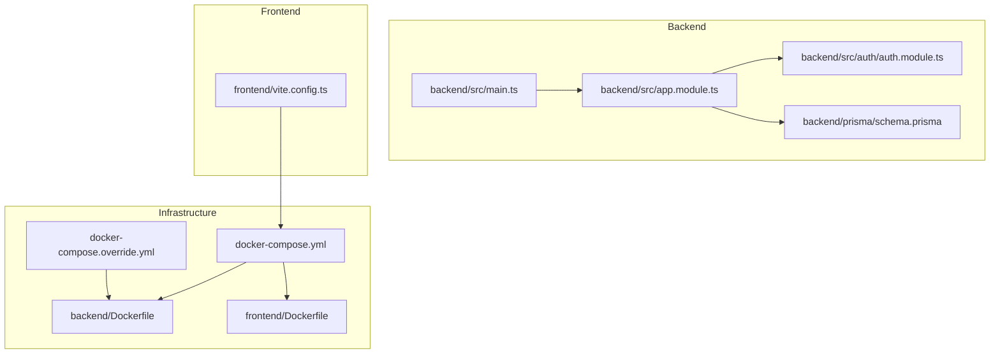
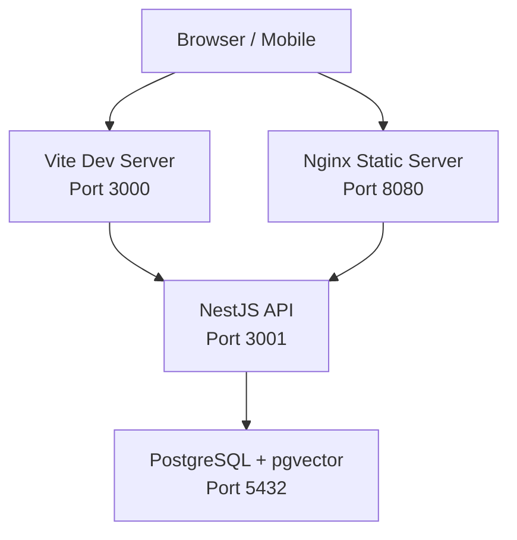

# Getting Started

<cite>
**Referenced Files in This Document**
- [README.md](file://README.md)
- [docker-compose.yml](file://docker-compose.yml)
- [docker-compose.override.yml](file://docker-compose.override.yml)
- [backend/Dockerfile](file://backend/Dockerfile)
- [frontend/Dockerfile](file://frontend/Dockerfile)
- [backend/package.json](file://backend/package.json)
- [frontend/package.json](file://frontend/package.json)
- [backend/src/main.ts](file://backend/src/main.ts)
- [backend/src/app.module.ts](file://backend/src/app.module.ts)
- [backend/src/auth/auth.module.ts](file://backend/src/auth/auth.module.ts)
- [backend/prisma/schema.prisma](file://backend/prisma/schema.prisma)
- [backend/prisma.config.ts](file://backend/prisma.config.ts)
- [frontend/vite.config.ts](file://frontend/vite.config.ts)
</cite>

## Table of Contents
1. [Introduction](#introduction)
2. [Project Structure](#project-structure)
3. [Prerequisites](#prerequisites)
4. [Local Development Setup](#local-development-setup)
5. [Docker Deployment](#docker-deployment)
6. [Environment Variables](#environment-variables)
7. [Step-by-Step Example](#step-by-step-example)
8. [Architecture Overview](#architecture-overview)
9. [Common Issues and Troubleshooting](#common-issues-and-troubleshooting)
10. [Performance Considerations](#performance-considerations)
11. [Conclusion](#conclusion)

## Introduction
4Ever is a personal AI workspace that combines multi-persona thought analysis, relationship intelligence, and life management with durable memory. It features a NestJS backend, a React frontend, PostgreSQL with pgvector for semantic memory, and integrates OpenRouter for AI orchestration. Optional services like Tavily enable web search capabilities.

## Project Structure
The repository is organized into three main parts:
- backend: NestJS API with Prisma ORM, AI orchestration, and all business logic
- frontend: React SPA served via Vite in development and Nginx in production
- docker-compose: Full-stack orchestration with PostgreSQL, backend, and frontend

**Diagram sources**
- [docker-compose.yml:1-68](file://docker-compose.yml#L1-L68)
- [docker-compose.override.yml:1-33](file://docker-compose.override.yml#L1-L33)
- [backend/Dockerfile:1-83](file://backend/Dockerfile#L1-L83)
- [frontend/Dockerfile:1-63](file://frontend/Dockerfile#L1-L63)
- [backend/src/main.ts:1-143](file://backend/src/main.ts#L1-L143)
- [backend/src/app.module.ts:1-172](file://backend/src/app.module.ts#L1-L172)
- [backend/src/auth/auth.module.ts:1-40](file://backend/src/auth/auth.module.ts#L1-L40)
- [backend/prisma/schema.prisma:1-10](file://backend/prisma/schema.prisma#L1-L10)
- [frontend/vite.config.ts:1-22](file://frontend/vite.config.ts#L1-L22)

**Section sources**
- [README.md:128-162](file://README.md#L128-L162)
- [docker-compose.yml:1-68](file://docker-compose.yml#L1-L68)
- [backend/src/main.ts:1-143](file://backend/src/main.ts#L1-L143)
- [backend/src/app.module.ts:1-172](file://backend/src/app.module.ts#L1-L172)

## Prerequisites
Ensure you have the following installed:
- Node.js 20+ (required for local development)
- Docker Desktop (required for PostgreSQL with pgvector)
- OpenRouter API key (required for AI responses)
- Tavily API key (optional, for web search tool)

These requirements are documented in the project’s quick start guide and environment variable section.

**Section sources**
- [README.md:37-42](file://README.md#L37-L42)
- [README.md:101-126](file://README.md#L101-L126)

## Local Development Setup
Follow these steps to run the project locally:

1. Clone and install dependencies
   - Backend: navigate to backend and install dependencies
   - Frontend: navigate to frontend and install dependencies

2. Configure environment
   - Copy the example environment file to .env and add your API keys

3. Start PostgreSQL with Docker
   - Bring up the Postgres service with pgvector

4. Run database migrations
   - Apply Prisma migrations to initialize the schema

5. Start the backend
   - Launch the NestJS API in development mode

6. Start the frontend
   - Launch the React app in development mode

7. Open the app
   - Access the frontend at the configured port

These steps are derived from the project’s quick start instructions.

**Section sources**
- [README.md:44-86](file://README.md#L44-L86)

## Docker Deployment
To run the entire stack with Docker:

- Use docker-compose to start PostgreSQL, backend, and frontend
- The stack exposes:
  - PostgreSQL with pgvector on port 5432
  - Backend API on port 3001
  - Frontend on port 3000

This approach is ideal for local testing and staging environments.

**Section sources**
- [README.md:88-99](file://README.md#L88-L99)
- [docker-compose.yml:1-68](file://docker-compose.yml#L1-L68)

## Environment Variables
Create a .env file in the root directory and configure the following variables:

- Database
  - POSTGRES_USER: PostgreSQL user
  - POSTGRES_PASSWORD: PostgreSQL password
  - POSTGRES_DB: Database name
  - DATABASE_URL: Full connection string for Prisma

- JWT
  - JWT_SECRET: Strong secret key for signing tokens
  - JWT_EXPIRATION: Token expiration (e.g., 7d)

- OpenRouter (required)
  - OPENROUTER_API_KEY: API key for OpenRouter
  - OPENROUTER_DEFAULT_MODEL: Default model used by personas

- Tavily (optional)
  - TAVILY_API_KEY: API key for web search tool

- Server
  - PORT: Backend port (default 3001)
  - NODE_ENV: Environment mode (development or production)

Notes:
- The backend enforces strict validation for JWT_SECRET and CORS_ORIGINS in production.
- The Docker Compose file passes optional environment variables through to the backend container.

**Section sources**
- [README.md:101-126](file://README.md#L101-L126)
- [backend/src/auth/auth.module.ts:14-32](file://backend/src/auth/auth.module.ts#L14-L32)
- [backend/src/main.ts:68-79](file://backend/src/main.ts#L68-L79)
- [docker-compose.yml:24-40](file://docker-compose.yml#L24-L40)

## Step-by-Step Example
Here is a practical walkthrough from cloning to a successful first run:

1. Clone the repository
   - Use your preferred Git client to clone the repository

2. Install dependencies
   - Backend: npm install
   - Frontend: npm install

3. Prepare environment
   - Copy .env.example to .env
   - Add your OpenRouter API key and optional Tavily key

4. Start the database
   - docker-compose up -d postgres

5. Initialize the database
   - Run Prisma migrations in the backend directory

6. Launch the backend
   - Start the NestJS API in development mode

7. Launch the frontend
   - Start the React app in development mode

8. Verify
   - Open the frontend in your browser and confirm it connects to the backend

This example follows the documented quick start procedure.

**Section sources**
- [README.md:44-86](file://README.md#L44-L86)
- [docker-compose.yml:63-66](file://docker-compose.yml#L63-L66)

## Architecture Overview
The system consists of:
- Frontend (React SPA) served by Vite in development and Nginx in production
- Backend (NestJS) with Prisma ORM, JWT authentication, and AI orchestration
- Database (PostgreSQL with pgvector) for structured data and semantic memory
- Optional integrations (OpenRouter, Tavily) for AI and web search

**Diagram sources**
- [frontend/vite.config.ts:12-21](file://frontend/vite.config.ts#L12-L21)
- [frontend/Dockerfile:23-56](file://frontend/Dockerfile#L23-L56)
- [backend/Dockerfile:49-52](file://backend/Dockerfile#L49-L52)
- [docker-compose.yml:9-17](file://docker-compose.yml#L9-L17)

**Section sources**
- [README.md:25-33](file://README.md#L25-L33)
- [frontend/vite.config.ts:1-22](file://frontend/vite.config.ts#L1-L22)
- [frontend/Dockerfile:1-63](file://frontend/Dockerfile#L1-L63)
- [backend/Dockerfile:1-83](file://backend/Dockerfile#L1-L83)
- [docker-compose.yml:1-68](file://docker-compose.yml#L1-L68)

## Common Issues and Troubleshooting
Network connectivity
- Ensure PostgreSQL is healthy before running migrations
- Verify the backend can connect to the database using DATABASE_URL

Port conflicts
- Change PORT in .env if port 3001 is in use
- Adjust frontend port in Vite config if port 3000 is taken

Dependency resolution
- Use Node.js 20+ as required by the project
- Confirm Docker Desktop is running for local database provisioning

JWT and CORS
- Set JWT_SECRET to a strong random value; the backend validates length and presence
- In production, set CORS_ORIGINS explicitly; otherwise, startup will fail

Database initialization
- After starting PostgreSQL, run Prisma migrations in the backend directory
- Confirm Prisma schema matches the database extension configuration

Optional services
- Without TAVILY_API_KEY, web search tools will be unavailable
- OPENROUTER_API_KEY is mandatory for AI features

**Section sources**
- [backend/src/auth/auth.module.ts:14-32](file://backend/src/auth/auth.module.ts#L14-L32)
- [backend/src/main.ts:68-79](file://backend/src/main.ts#L68-L79)
- [backend/src/main.ts:124-125](file://backend/src/main.ts#L124-L125)
- [docker-compose.yml:13-17](file://docker-compose.yml#L13-L17)
- [backend/prisma/schema.prisma:6-10](file://backend/prisma/schema.prisma#L6-L10)
- [backend/prisma.config.ts:11-14](file://backend/prisma.config.ts#L11-L14)

## Performance Considerations
- Use Docker Compose for consistent resource allocation and service discovery
- Keep JWT_SECRET and other secrets out of logs by leveraging the built-in redaction
- Monitor database performance with pgvector indexes and appropriate queries
- Enable production logging and health checks for reliable scaling

[No sources needed since this section provides general guidance]

## Conclusion
You now have the essential steps to set up 4Ever locally or via Docker, configure environment variables, and troubleshoot common issues. Start with the prerequisites, follow the quick start instructions, and leverage the environment variables and Docker Compose configuration for a smooth developer experience.

[No sources needed since this section summarizes without analyzing specific files]