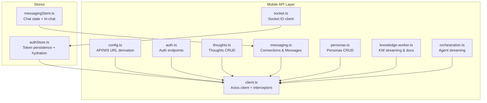
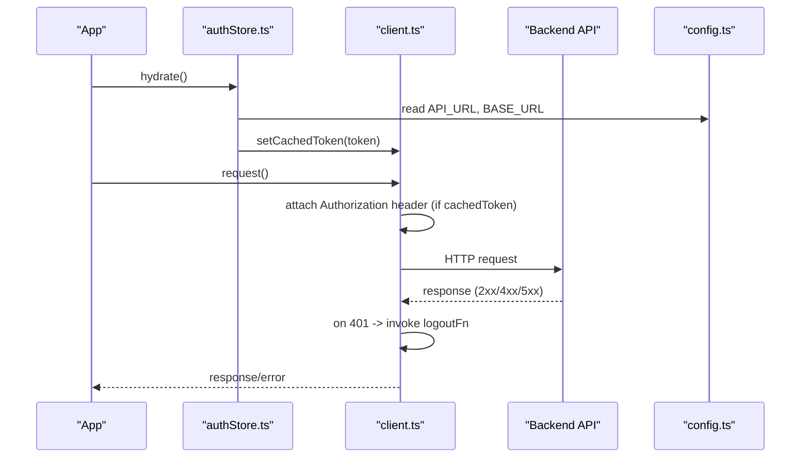
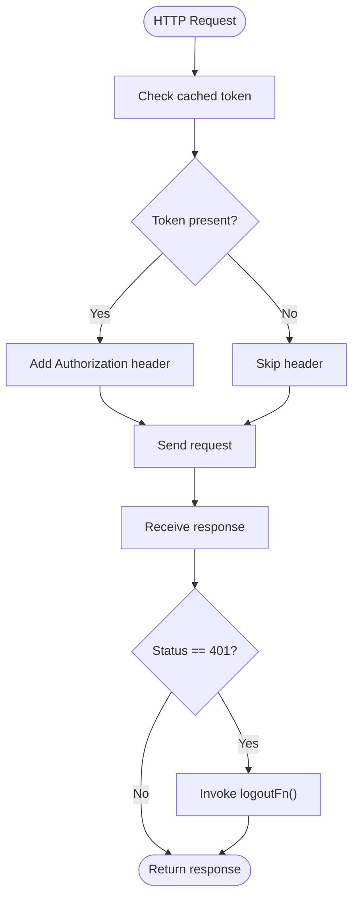
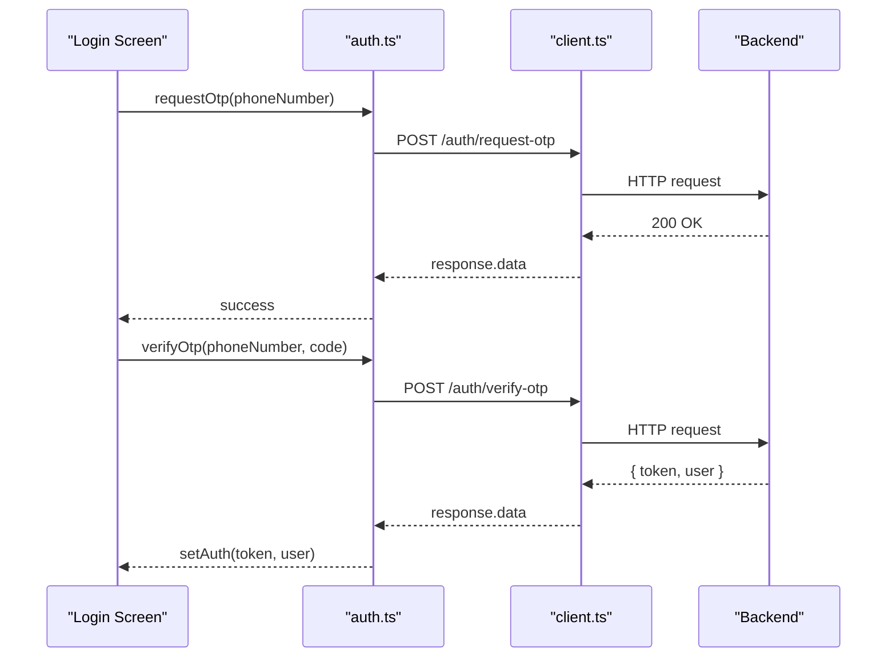
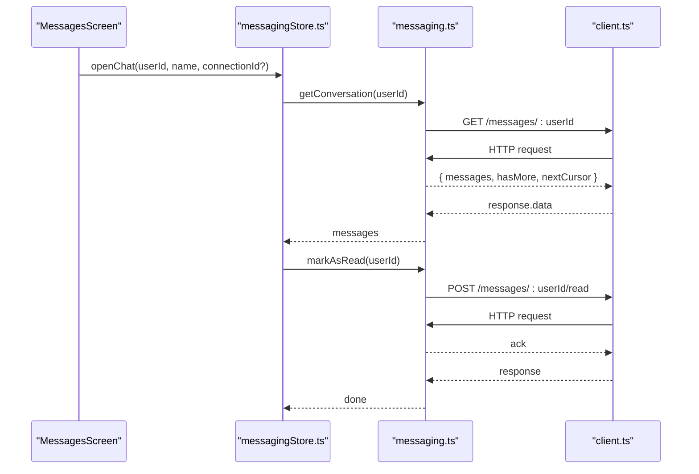
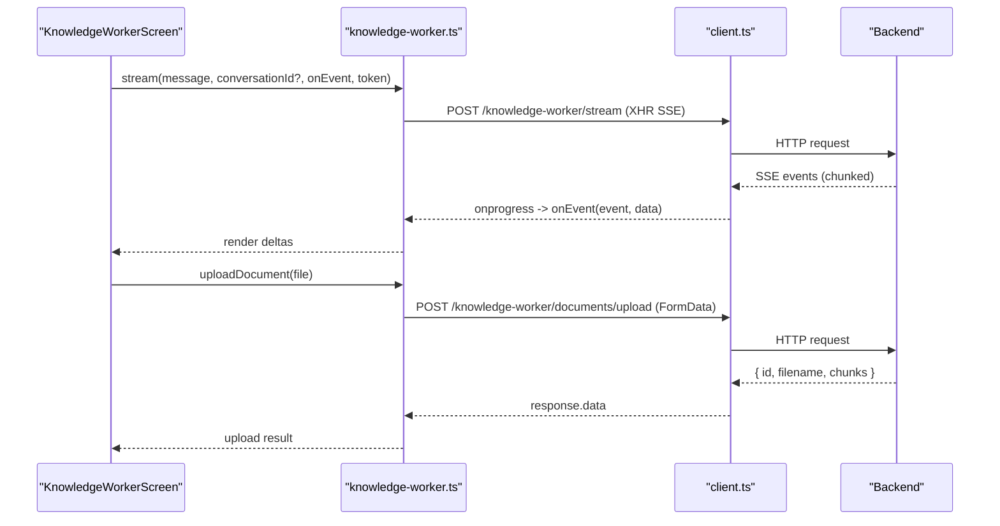
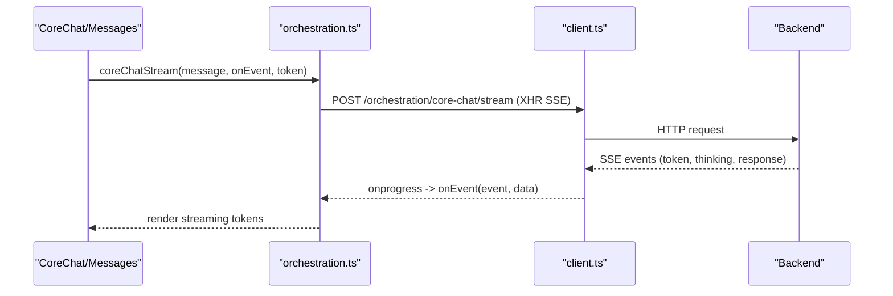
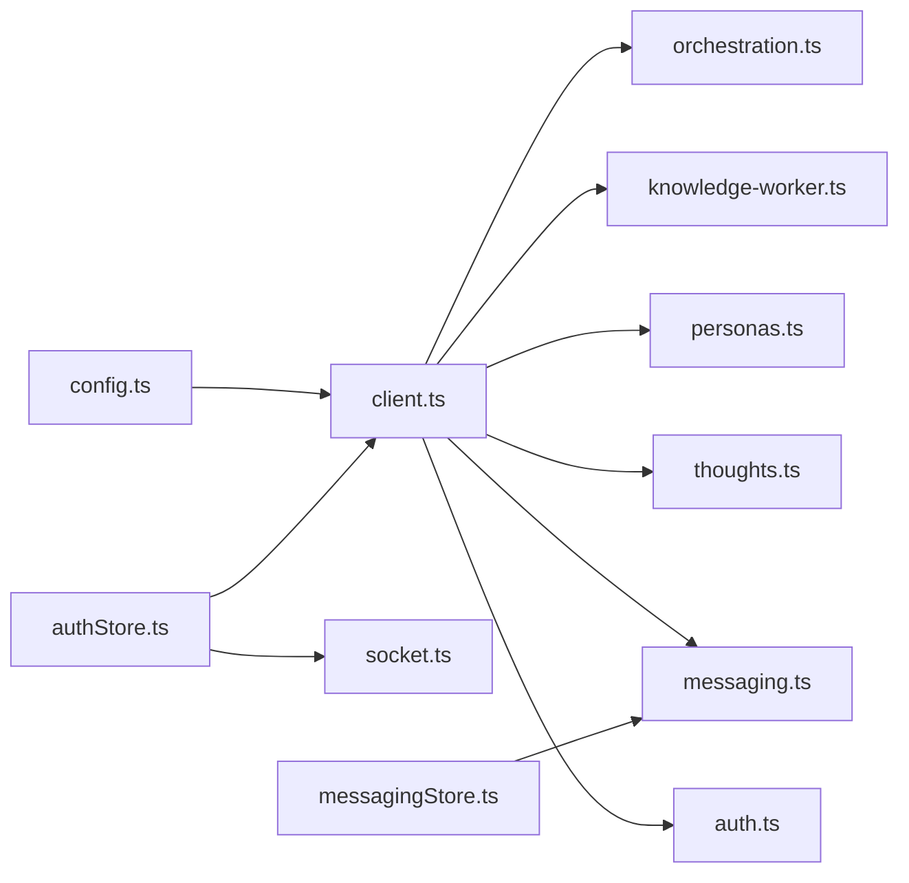

# API Integration

<cite>
**Referenced Files in This Document**
- [client.ts](file://mobile/src/api/client.ts)
- [auth.ts](file://mobile/src/api/auth.ts)
- [socket.ts](file://mobile/src/api/socket.ts)
- [config.ts](file://mobile/src/constants/config.ts)
- [thoughts.ts](file://mobile/src/api/thoughts.ts)
- [messaging.ts](file://mobile/src/api/messaging.ts)
- [personas.ts](file://mobile/src/api/personas.ts)
- [knowledge-worker.ts](file://mobile/src/api/knowledge-worker.ts)
- [orchestration.ts](file://mobile/src/api/orchestration.ts)
- [authStore.ts](file://mobile/src/store/authStore.ts)
- [messagingStore.ts](file://mobile/src/store/messagingStore.ts)
</cite>

## Table of Contents
1. [Introduction](#introduction)
2. [Project Structure](#project-structure)
3. [Core Components](#core-components)
4. [Architecture Overview](#architecture-overview)
5. [Detailed Component Analysis](#detailed-component-analysis)
6. [Dependency Analysis](#dependency-analysis)
7. [Performance Considerations](#performance-considerations)
8. [Troubleshooting Guide](#troubleshooting-guide)
9. [Conclusion](#conclusion)
10. [Appendices](#appendices)

## Introduction
This document describes the mobile API integration layer, covering REST client configuration, authentication token lifecycle, error handling, and real-time messaging via Socket.IO. It also documents endpoint categorization across auth, thoughts, messaging, personas, and knowledge worker services, along with request/response patterns, data transformation, caching strategies, offline handling, retry mechanisms, and mobile-specific considerations such as background synchronization, push notifications, and bandwidth optimization.

## Project Structure
The mobile API integration is organized around:
- A shared REST client with interceptors and token caching
- Feature-specific API modules grouped by domain
- Stores for state hydration and real-time updates
- Configuration utilities for dynamic base URLs and WebSocket origins



**Diagram sources**
- [client.ts:1-57](file://mobile/src/api/client.ts#L1-L57)
- [config.ts:1-85](file://mobile/src/constants/config.ts#L1-L85)
- [auth.ts:1-112](file://mobile/src/api/auth.ts#L1-L112)
- [thoughts.ts:1-85](file://mobile/src/api/thoughts.ts#L1-L85)
- [messaging.ts:1-243](file://mobile/src/api/messaging.ts#L1-L243)
- [personas.ts:1-63](file://mobile/src/api/personas.ts#L1-L63)
- [knowledge-worker.ts:1-154](file://mobile/src/api/knowledge-worker.ts#L1-L154)
- [orchestration.ts:1-216](file://mobile/src/api/orchestration.ts#L1-L216)
- [socket.ts:1-37](file://mobile/src/api/socket.ts#L1-L37)
- [authStore.ts:1-75](file://mobile/src/store/authStore.ts#L1-L75)
- [messagingStore.ts:1-373](file://mobile/src/store/messagingStore.ts#L1-L373)

**Section sources**
- [client.ts:1-57](file://mobile/src/api/client.ts#L1-L57)
- [config.ts:1-85](file://mobile/src/constants/config.ts#L1-L85)
- [authStore.ts:1-75](file://mobile/src/store/authStore.ts#L1-L75)
- [messagingStore.ts:1-373](file://mobile/src/store/messagingStore.ts#L1-L373)

## Core Components
- REST Client
  - Centralized Axios instance with base URL derived from configuration
  - Request interceptor injects Authorization header from cached token
  - Response interceptor handles 401 by invoking logout callback
  - Utility to resolve avatar image URLs consistently
- Authentication Store
  - Persists token and user profile using secure storage and async storage
  - Hydrates state on app launch and invalidates token on 401
- Real-Time Messaging
  - Socket.IO client initialized with auth token and transport preferences
  - Connect/disconnect helpers and lifecycle hooks

Key responsibilities:
- Token management: caching, persistence, and automatic injection
- Endpoint routing: centralized under feature modules
- Streaming: SSE via XMLHttpRequest for orchestration and knowledge worker
- Real-time events: Socket.IO for live chat updates

**Section sources**
- [client.ts:18-42](file://mobile/src/api/client.ts#L18-L42)
- [authStore.ts:26-71](file://mobile/src/store/authStore.ts#L26-L71)
- [socket.ts:10-36](file://mobile/src/api/socket.ts#L10-L36)

## Architecture Overview
The integration layer composes a REST client with domain-specific APIs and stores. Configuration ensures API and WebSocket origins remain aligned. Authentication state drives request authorization and global error handling.



**Diagram sources**
- [authStore.ts:56-70](file://mobile/src/store/authStore.ts#L56-L70)
- [client.ts:24-40](file://mobile/src/api/client.ts#L24-L40)
- [config.ts:36-84](file://mobile/src/constants/config.ts#L36-L84)

## Detailed Component Analysis

### REST Client and Token Management
- Token caching
  - Maintains an in-memory cached token to avoid frequent secure storage reads
  - Exposed setter to synchronize with persisted token
- Interceptors
  - Request: conditionally adds Authorization header
  - Response: detects 401 and triggers logout via registered function
- Avatar URL resolution
  - Normalizes server-provided avatar paths to absolute URLs



**Diagram sources**
- [client.ts:24-40](file://mobile/src/api/client.ts#L24-L40)

**Section sources**
- [client.ts:18-42](file://mobile/src/api/client.ts#L18-L42)
- [authStore.ts:32-52](file://mobile/src/store/authStore.ts#L32-L52)

### Authentication API
Endpoints:
- OTP request and verification
- Set user name
- Fetch/update profile
- Avatar upload/delete
- Data export and GDPR-compliant account deletion
- Apple sign-in exchange

Data transfer:
- Requests use JSON bodies
- Avatar upload uses multipart/form-data with dynamic MIME detection
- Export returns streamed JSON payload



**Diagram sources**
- [auth.ts:24-48](file://mobile/src/api/auth.ts#L24-L48)
- [client.ts:24-30](file://mobile/src/api/client.ts#L24-L30)

**Section sources**
- [auth.ts:24-112](file://mobile/src/api/auth.ts#L24-L112)

### Thoughts API
Capabilities:
- List, get by ID, create, update, delete thoughts
- Continue thread continuation
- Robust response parsing supporting both array and paginated envelope

Data models:
- Thought, Thread, Message, PersonaRun with nested relations

**Section sources**
- [thoughts.ts:54-85](file://mobile/src/api/thoughts.ts#L54-L85)

### Messaging API
Capabilities:
- Connections: search, list, pending, send/accept/reject/remove, invite, resolve phone
- Messages: list conversations, fetch conversation with pagination, mark read, unread count, edit/delete, add reaction, search, update conversation settings
- Tri-chat mediator: status, toggle, summon, reply to session, end session, clear history, rename mediator, accept mediator actions

Data models:
- ConnectionItem, SearchResult, PendingRequest, DirectMessage, ConversationPreview, SharedNote, SharedRelationship, MediatorActionCard
- TriChatStatus and TriChatToggleResult for tri-chat state



**Diagram sources**
- [messagingStore.ts:107-120](file://mobile/src/store/messagingStore.ts#L107-L120)
- [messaging.ts:154-182](file://mobile/src/api/messaging.ts#L154-L182)

**Section sources**
- [messaging.ts:108-243](file://mobile/src/api/messaging.ts#L108-L243)
- [messagingStore.ts:59-373](file://mobile/src/store/messagingStore.ts#L59-L373)

### Personas API
Capabilities:
- List all, list active, get by ID, create, update, delete

Data models:
- Persona with metadata and activation flag

**Section sources**
- [personas.ts:33-63](file://mobile/src/api/personas.ts#L33-L63)

### Knowledge Worker API
Capabilities:
- List and fetch conversation messages
- Delete conversation
- Stream agent responses via SSE using XMLHttpRequest
- Manage documents: list, delete, upload with timeout



**Diagram sources**
- [knowledge-worker.ts:112-154](file://mobile/src/api/knowledge-worker.ts#L112-L154)
- [client.ts:24-30](file://mobile/src/api/client.ts#L24-L30)

**Section sources**
- [knowledge-worker.ts:97-154](file://mobile/src/api/knowledge-worker.ts#L97-L154)

### Orchestration API (Agent Streaming)
Capabilities:
- Analyze thought with selected personas
- Reply to persona or via core chat
- Stream agent responses via SSE using XMLHttpRequest
- Manage core chat sessions and histories
- Persona direct chat streaming and history



**Diagram sources**
- [orchestration.ts:146-158](file://mobile/src/api/orchestration.ts#L146-L158)
- [client.ts:24-30](file://mobile/src/api/client.ts#L24-L30)

**Section sources**
- [orchestration.ts:92-216](file://mobile/src/api/orchestration.ts#L92-L216)

### Socket.IO Integration
- Connection management
  - Establishes WebSocket connection with auth token
  - Supports both websocket and polling transports
  - Logs connect/disconnect events
- Disconnection
  - Explicit disconnect and cleanup of singleton socket instance

```mermaid
sequenceDiagram
participant App as "App"
participant Store as "authStore.ts"
participant SIO as "socket.ts"
App->>Store : on auth success
Store->>SIO : connectSocket(token)
SIO->>SIO : io(WS_URL, { auth : { token }, transports })
SIO-->>App : socket instance (connected)
App->>SIO : disconnectSocket()
SIO->>SIO : socket.disconnect(); socket = null
```

**Diagram sources**
- [socket.ts:10-36](file://mobile/src/api/socket.ts#L10-L36)
- [authStore.ts:32-37](file://mobile/src/store/authStore.ts#L32-L37)

**Section sources**
- [socket.ts:1-37](file://mobile/src/api/socket.ts#L1-L37)

### Configuration and Base URLs
- API URL resolution
  - Environment variable preferred
  - Dev auto-detection for Expo Go, Android emulator, iOS simulator
  - Production builds require explicit API URL; otherwise throws
- Origin derivation
  - Base URL excludes the /api suffix
  - WebSocket URL mirrors scheme and host, replacing http/https with ws/wss

**Section sources**
- [config.ts:36-84](file://mobile/src/constants/config.ts#L36-L84)

## Dependency Analysis
- Cohesion
  - Each feature module encapsulates related endpoints and DTOs
- Coupling
  - All HTTP calls depend on the shared client and configuration
  - Stores depend on feature APIs for data operations
  - Socket.IO depends on authentication store for token availability
- External dependencies
  - Axios for REST
  - Socket.IO client for real-time
  - Expo SecureStore and AsyncStorage for token/user persistence



**Diagram sources**
- [config.ts:36-84](file://mobile/src/constants/config.ts#L36-L84)
- [client.ts:1-57](file://mobile/src/api/client.ts#L1-L57)
- [authStore.ts:1-75](file://mobile/src/store/authStore.ts#L1-L75)
- [socket.ts:1-37](file://mobile/src/api/socket.ts#L1-L37)
- [messagingStore.ts:1-373](file://mobile/src/store/messagingStore.ts#L1-L373)

**Section sources**
- [client.ts:1-57](file://mobile/src/api/client.ts#L1-L57)
- [authStore.ts:1-75](file://mobile/src/store/authStore.ts#L1-L75)
- [socket.ts:1-37](file://mobile/src/api/socket.ts#L1-L37)
- [messagingStore.ts:1-373](file://mobile/src/store/messagingStore.ts#L1-L373)

## Performance Considerations
- Token caching
  - Reduces secure storage reads per request
- Streaming
  - SSE via XMLHttpRequest avoids large buffering and supports incremental rendering
- Transport selection
  - Socket.IO uses both websocket and polling to maximize connectivity
- Pagination
  - Messaging endpoints support cursored retrieval to limit payload sizes
- Image handling
  - Avatar URL normalization prevents redundant concatenation and ensures correct asset paths

[No sources needed since this section provides general guidance]

## Troubleshooting Guide
Common issues and remedies:
- 401 Unauthorized
  - Symptom: Global logout invoked after request interception
  - Resolution: Re-authenticate and rehydrate token; ensure token is cached and persisted
  - References:
    - [client.ts:32-40](file://mobile/src/api/client.ts#L32-L40)
    - [authStore.ts:47-52](file://mobile/src/store/authStore.ts#L47-L52)
- Missing API URL in production
  - Symptom: App fails to start with explicit error
  - Resolution: Set EXPO_PUBLIC_API_URL at build time
  - References:
    - [config.ts:43-52](file://mobile/src/constants/config.ts#L43-L52)
- WebSocket connection failures
  - Symptom: No connect/disconnect logs or real-time updates
  - Resolution: Verify token availability, network connectivity, and transport support
  - References:
    - [socket.ts:10-29](file://mobile/src/api/socket.ts#L10-L29)
- SSE timeouts
  - Symptom: Streams abort unexpectedly
  - Resolution: Increase timeouts for long-running tasks; handle partial buffers on completion
  - References:
    - [orchestration.ts:77-82](file://mobile/src/api/orchestration.ts#L77-L82)
    - [knowledge-worker.ts:89-95](file://mobile/src/api/knowledge-worker.ts#L89-L95)

**Section sources**
- [client.ts:32-40](file://mobile/src/api/client.ts#L32-L40)
- [authStore.ts:47-52](file://mobile/src/store/authStore.ts#L47-L52)
- [config.ts:43-52](file://mobile/src/constants/config.ts#L43-L52)
- [socket.ts:10-29](file://mobile/src/api/socket.ts#L10-L29)
- [orchestration.ts:77-82](file://mobile/src/api/orchestration.ts#L77-L82)
- [knowledge-worker.ts:89-95](file://mobile/src/api/knowledge-worker.ts#L89-L95)

## Conclusion
The mobile API integration layer centralizes HTTP and WebSocket communications, enforces secure token handling, and provides robust streaming for agent interactions. Feature-specific modules encapsulate endpoint semantics, while stores manage state transitions and real-time updates. Configuration utilities ensure consistent base and WebSocket origins across environments.

[No sources needed since this section summarizes without analyzing specific files]

## Appendices

### Endpoint Categorization and Patterns
- Auth
  - OTP, name setting, profile update, avatar upload/delete, export, Apple sign-in, account deletion
  - References:
    - [auth.ts:24-112](file://mobile/src/api/auth.ts#L24-L112)
- Thoughts
  - CRUD and thread continuation
  - References:
    - [thoughts.ts:54-85](file://mobile/src/api/thoughts.ts#L54-L85)
- Messaging
  - Connections, messages, tri-chat mediator, search, reactions, notes
  - References:
    - [messaging.ts:108-243](file://mobile/src/api/messaging.ts#L108-L243)
- Personas
  - CRUD and active listing
  - References:
    - [personas.ts:33-63](file://mobile/src/api/personas.ts#L33-L63)
- Knowledge Worker
  - Conversations, messages, streaming, document management
  - References:
    - [knowledge-worker.ts:97-154](file://mobile/src/api/knowledge-worker.ts#L97-L154)
- Orchestration
  - Agent replies, streaming, core chat, persona chat, history management
  - References:
    - [orchestration.ts:92-216](file://mobile/src/api/orchestration.ts#L92-L216)

### Offline Handling, Retry, and Network Recovery
- Token invalidation on 401
  - Ensures subsequent requests fail fast until re-authenticated
  - References:
    - [client.ts:32-40](file://mobile/src/api/client.ts#L32-L40)
- SSE/XHR timeouts
  - Long-running tasks set extended timeouts; errors surfaced for UI feedback
  - References:
    - [orchestration.ts:77-82](file://mobile/src/api/orchestration.ts#L77-L82)
    - [knowledge-worker.ts:89-95](file://mobile/src/api/knowledge-worker.ts#L89-L95)
- Cursor-based pagination
  - Limits payload sizes and enables incremental loading
  - References:
    - [messaging.ts:158-161](file://mobile/src/api/messaging.ts#L158-L161)

### Mobile-Specific Considerations
- Background sync
  - Not implemented in the reviewed modules; consider scheduling periodic syncs for offline-capable flows
- Push notifications
  - Not implemented in the reviewed modules; integrate platform notification APIs for out-of-app updates
- Bandwidth optimization
  - Use cursor-based pagination, SSE streaming, and minimal JSON payloads
  - References:
    - [messaging.ts:158-161](file://mobile/src/api/messaging.ts#L158-L161)
    - [orchestration.ts:13-83](file://mobile/src/api/orchestration.ts#L13-L83)