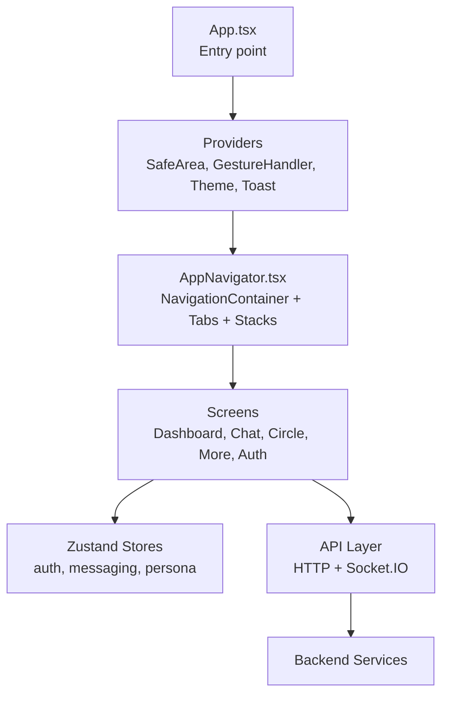
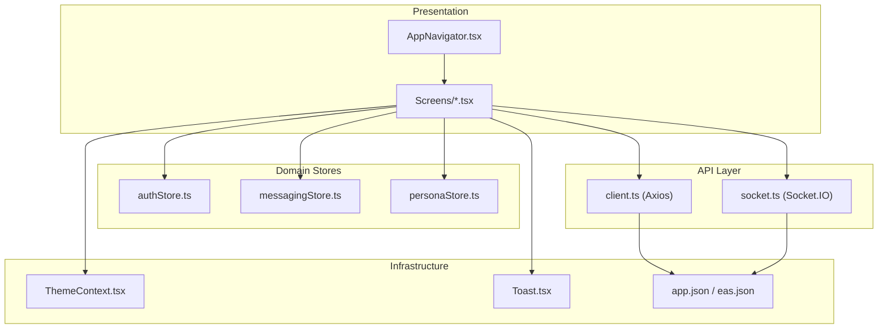
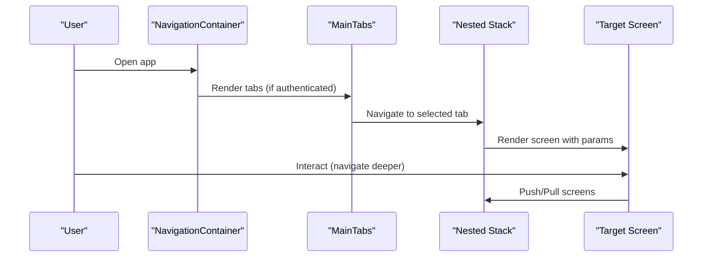
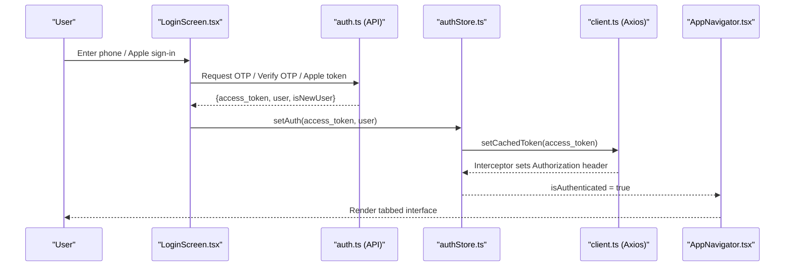
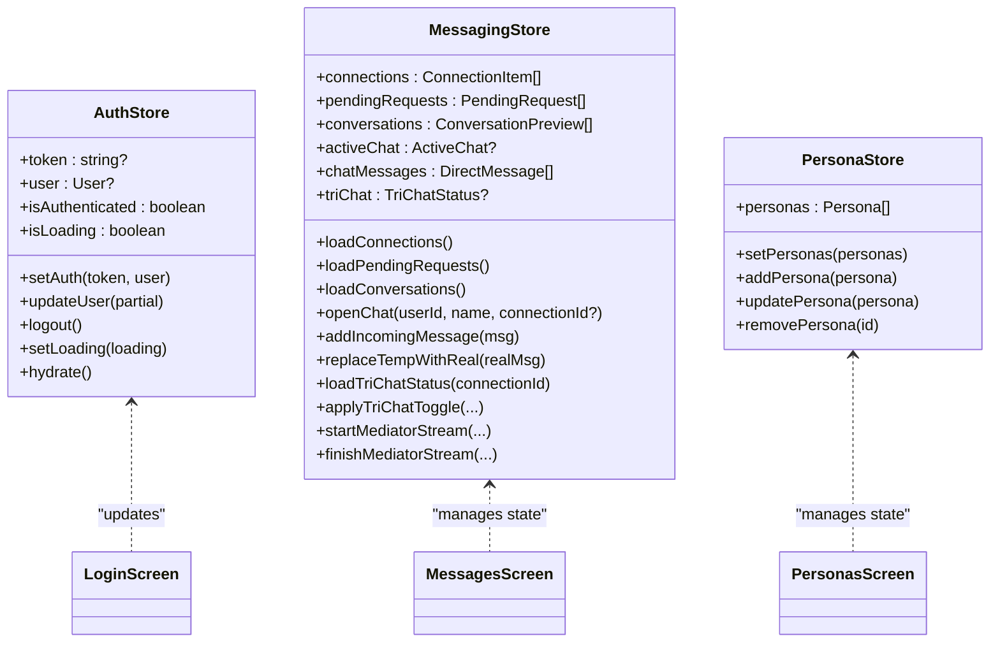
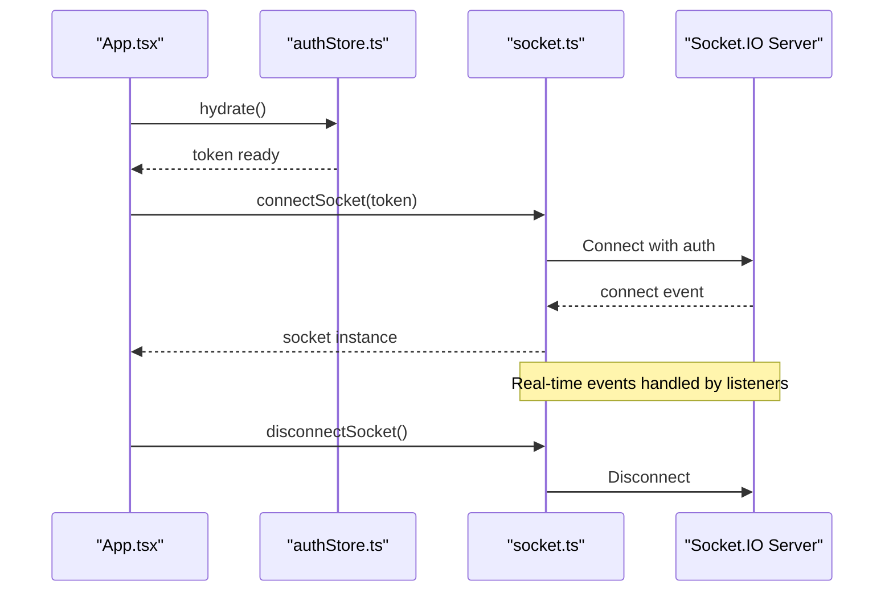
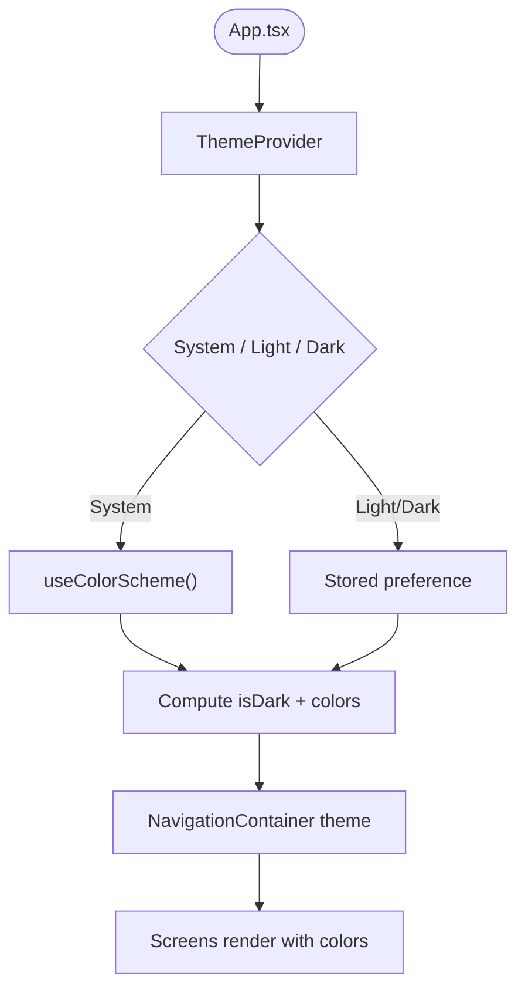
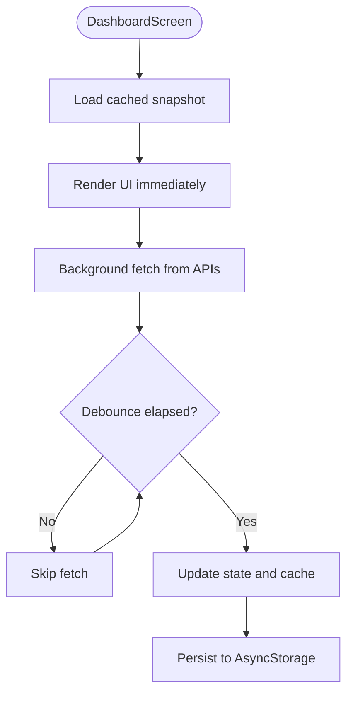
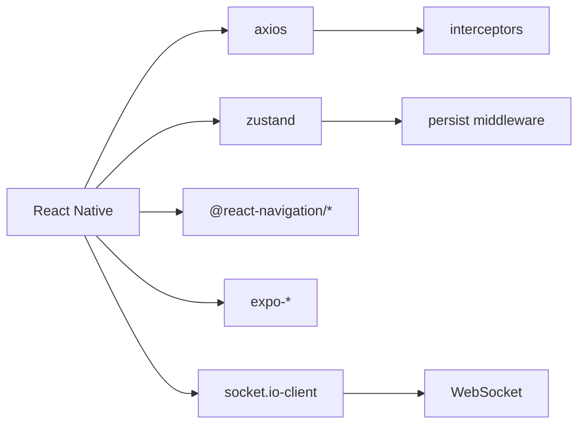

# Mobile Application

<cite>
**Referenced Files in This Document**
- [App.tsx](file://mobile/App.tsx)
- [app.json](file://mobile/app.json)
- [eas.json](file://mobile/eas.json)
- [package.json](file://mobile/package.json)
- [AppNavigator.tsx](file://mobile/src/navigation/AppNavigator.tsx)
- [authStore.ts](file://mobile/src/store/authStore.ts)
- [messagingStore.ts](file://mobile/src/store/messagingStore.ts)
- [personaStore.ts](file://mobile/src/store/personaStore.ts)
- [ThemeContext.tsx](file://mobile/src/contexts/ThemeContext.tsx)
- [colors.ts](file://mobile/src/constants/colors.ts)
- [DashboardScreen.tsx](file://mobile/src/screens/DashboardScreen.tsx)
- [LoginScreen.tsx](file://mobile/src/screens/LoginScreen.tsx)
- [socket.ts](file://mobile/src/api/socket.ts)
- [client.ts](file://mobile/src/api/client.ts)
- [Toast.tsx](file://mobile/src/components/Toast.tsx)
</cite>

## Table of Contents
1. [Introduction](#introduction)
2. [Project Structure](#project-structure)
3. [Core Components](#core-components)
4. [Architecture Overview](#architecture-overview)
5. [Detailed Component Analysis](#detailed-component-analysis)
6. [Dependency Analysis](#dependency-analysis)
7. [Performance Considerations](#performance-considerations)
8. [Troubleshooting Guide](#troubleshooting-guide)
9. [Conclusion](#conclusion)
10. [Appendices](#appendices)

## Introduction
This document describes the React Native mobile application built with Expo. It covers the cross-platform architecture, navigation patterns, state management with Zustand, authentication flows, real-time communication via Socket.IO, and build/deployment configuration with EAS Build. It also documents mobile-specific optimizations, platform considerations for iOS and Android, and guidelines for extending functionality while maintaining consistency with the web application.

## Project Structure
The mobile application is organized around a clear separation of concerns:
- Entry point initializes providers and navigation.
- Navigation is composed of bottom tabs and nested stacks for different functional areas.
- Stores encapsulate domain-specific state using Zustand.
- APIs integrate with backend services and manage authentication tokens and real-time sockets.
- UI components and themes provide a cohesive design system.

**Diagram sources**
- [App.tsx:1-38](file://mobile/App.tsx#L1-L38)
- [AppNavigator.tsx:1-282](file://mobile/src/navigation/AppNavigator.tsx#L1-L282)

**Section sources**
- [App.tsx:1-38](file://mobile/App.tsx#L1-L38)
- [package.json:1-52](file://mobile/package.json#L1-L52)

## Core Components
- Navigation: Bottom-tabbed interface with five stacks (Home, Chat, Thought, Circle, More). Authentication gating routes users to a dedicated stack until logged in.
- State Management: Zustand stores for authentication, messaging, personas, and subscriptions. Stores persist sensitive tokens securely and cache user data locally.
- Real-time: Socket.IO client initialized with bearer tokens and transport fallbacks.
- Theming: Theme provider supporting system, light, and dark modes with persisted preferences.
- UI: Touch-friendly layouts, safe area handling, and animated toast notifications.

**Section sources**
- [AppNavigator.tsx:175-253](file://mobile/src/navigation/AppNavigator.tsx#L175-L253)
- [authStore.ts:1-75](file://mobile/src/store/authStore.ts#L1-L75)
- [messagingStore.ts:1-373](file://mobile/src/store/messagingStore.ts#L1-L373)
- [socket.ts:1-37](file://mobile/src/api/socket.ts#L1-L37)
- [ThemeContext.tsx:1-61](file://mobile/src/contexts/ThemeContext.tsx#L1-L61)
- [Toast.tsx:1-80](file://mobile/src/components/Toast.tsx#L1-L80)

## Architecture Overview
The app follows a layered architecture:
- Presentation Layer: Screens and navigators.
- Domain Stores: Zustand stores for auth, messaging, personas, and subscriptions.
- API Layer: Axios client with interceptors, token caching, and Socket.IO client.
- Infrastructure: Expo runtime, permissions, and platform integrations.

**Diagram sources**
- [AppNavigator.tsx:1-282](file://mobile/src/navigation/AppNavigator.tsx#L1-L282)
- [authStore.ts:1-75](file://mobile/src/store/authStore.ts#L1-L75)
- [messagingStore.ts:1-373](file://mobile/src/store/messagingStore.ts#L1-L373)
- [personaStore.ts:1-23](file://mobile/src/store/personaStore.ts#L1-L23)
- [client.ts:1-57](file://mobile/src/api/client.ts#L1-L57)
- [socket.ts:1-37](file://mobile/src/api/socket.ts#L1-L37)
- [ThemeContext.tsx:1-61](file://mobile/src/contexts/ThemeContext.tsx#L1-L61)
- [Toast.tsx:1-80](file://mobile/src/components/Toast.tsx#L1-L80)
- [app.json:1-96](file://mobile/app.json#L1-L96)
- [eas.json:1-73](file://mobile/eas.json#L1-L73)

## Detailed Component Analysis

### Navigation System
The navigation system uses React Navigation with:
- A central NavigationContainer applying theme-aware colors.
- Five bottom tabs: Home, Chat, Thought, Circle, More.
- Nested stacks per tab for deep linking and contextual navigation.
- Badge indicators for unread messages and pending requests in the Circle tab.
- Auth gating: Unauthenticated users see Login only; authenticated users see the tabbed interface.

**Diagram sources**
- [AppNavigator.tsx:255-281](file://mobile/src/navigation/AppNavigator.tsx#L255-L281)
- [AppNavigator.tsx:175-253](file://mobile/src/navigation/AppNavigator.tsx#L175-L253)

**Section sources**
- [AppNavigator.tsx:1-282](file://mobile/src/navigation/AppNavigator.tsx#L1-L282)

### Authentication Flow
Authentication is handled via:
- Phone-based OTP and optional Apple ID sign-in on iOS.
- Secure storage for tokens and user data.
- Token caching to minimize secure store reads.
- Automatic logout on 401 responses.

**Diagram sources**
- [LoginScreen.tsx:1-200](file://mobile/src/screens/LoginScreen.tsx#L1-L200)
- [authStore.ts:26-71](file://mobile/src/store/authStore.ts#L26-L71)
- [client.ts:24-40](file://mobile/src/api/client.ts#L24-L40)
- [AppNavigator.tsx:255-281](file://mobile/src/navigation/AppNavigator.tsx#L255-L281)

**Section sources**
- [LoginScreen.tsx:1-200](file://mobile/src/screens/LoginScreen.tsx#L1-L200)
- [authStore.ts:1-75](file://mobile/src/store/authStore.ts#L1-L75)
- [client.ts:1-57](file://mobile/src/api/client.ts#L1-L57)

### State Management with Zustand
- Auth store persists tokens securely and hydrates on app start.
- Messaging store manages connections, conversations, active chats, tri-chat mediator state, and real-time updates.
- Persona store maintains persona lists and CRUD operations.
- Stores are integrated with screens via hooks and used by navigation and API layers.

**Diagram sources**
- [authStore.ts:14-71](file://mobile/src/store/authStore.ts#L14-L71)
- [messagingStore.ts:6-57](file://mobile/src/store/messagingStore.ts#L6-L57)
- [personaStore.ts:4-22](file://mobile/src/store/personaStore.ts#L4-L22)

**Section sources**
- [authStore.ts:1-75](file://mobile/src/store/authStore.ts#L1-L75)
- [messagingStore.ts:1-373](file://mobile/src/store/messagingStore.ts#L1-L373)
- [personaStore.ts:1-23](file://mobile/src/store/personaStore.ts#L1-L23)

### Real-time Communication with Socket.IO
- Socket initialization with bearer token and transport fallbacks.
- Connection lifecycle logging for diagnostics.
- Disconnection handling to reset socket state.

**Diagram sources**
- [App.tsx:13-15](file://mobile/App.tsx#L13-L15)
- [authStore.ts:56-70](file://mobile/src/store/authStore.ts#L56-L70)
- [socket.ts:10-29](file://mobile/src/api/socket.ts#L10-L29)

**Section sources**
- [socket.ts:1-37](file://mobile/src/api/socket.ts#L1-L37)
- [client.ts:18-40](file://mobile/src/api/client.ts#L18-L40)

### Theming and UI Consistency
- Theme provider supports system, light, and dark modes with persisted preferences.
- Color tokens align with the web app’s design system.
- Safe area and gesture handler roots ensure proper layout and interactions.

**Diagram sources**
- [ThemeContext.tsx:24-56](file://mobile/src/contexts/ThemeContext.tsx#L24-L56)
- [colors.ts:1-142](file://mobile/src/constants/colors.ts#L1-L142)
- [AppNavigator.tsx:260-266](file://mobile/src/navigation/AppNavigator.tsx#L260-L266)

**Section sources**
- [ThemeContext.tsx:1-61](file://mobile/src/contexts/ThemeContext.tsx#L1-L61)
- [colors.ts:1-142](file://mobile/src/constants/colors.ts#L1-L142)
- [App.tsx:1-38](file://mobile/App.tsx#L1-L38)

### Offline Capability Considerations
- Dashboard employs a cache-first strategy with AsyncStorage for instantaneous rendering and background refresh.
- Debouncing prevents excessive network calls during rapid focus changes.
- Stale-while-revalidate pattern ensures responsiveness and data freshness.

**Diagram sources**
- [DashboardScreen.tsx:87-115](file://mobile/src/screens/DashboardScreen.tsx#L87-L115)
- [DashboardScreen.tsx:117-162](file://mobile/src/screens/DashboardScreen.tsx#L117-L162)

**Section sources**
- [DashboardScreen.tsx:1-200](file://mobile/src/screens/DashboardScreen.tsx#L1-L200)

### Device-Specific Integrations
- Permissions and Info.plist entries for camera, microphone, photos, contacts, and location policies are declared in app.json.
- Plugins enable Apple authentication, image picker, contacts, audio, and secure store.
- Android edge-to-edge and permission controls are configured.

**Section sources**
- [app.json:20-60](file://mobile/app.json#L20-L60)
- [app.json:65-88](file://mobile/app.json#L65-L88)

### Build and Deployment with EAS
- EAS configurations define development, preview, and production channels with environment-specific API URLs.
- Auto-incremented build numbers and remote versioning for production.
- Submission profiles for iOS (Apple ID/team/app IDs) and Android (service account key path, track, release status).

**Section sources**
- [eas.json:7-56](file://mobile/eas.json#L7-L56)
- [eas.json:58-71](file://mobile/eas.json#L58-L71)

## Dependency Analysis
External libraries and their roles:
- Navigation: @react-navigation/native, @react-navigation/bottom-tabs, @react-navigation/native-stack.
- UI: react-native-safe-area-context, react-native-gesture-handler, react-native-screens, react-native-svg, react-native-markdown-display, react-native-reanimated.
- Networking: axios, socket.io-client.
- State: zustand with persistence middleware.
- Platform: expo, expo-constants, expo-secure-store, expo-apple-authentication, expo-image-picker, expo-contacts, expo-audio.

**Diagram sources**
- [package.json:11-44](file://mobile/package.json#L11-L44)

**Section sources**
- [package.json:1-52](file://mobile/package.json#L1-L52)

## Performance Considerations
- Token caching avoids frequent secure store reads; interceptor applies Authorization headers efficiently.
- Debounced background refresh and cache-first rendering improve perceived performance.
- Tab badge polling is throttled to reduce network overhead.
- Animations leverage native driver for smooth UI transitions.
- Prefer lazy-loading heavy components and images; use SVG for scalable graphics.

## Troubleshooting Guide
- Authentication failures: Check token hydration and logout interceptor behavior.
- Network errors: Inspect axios interceptors and cached token state.
- Socket connectivity: Verify token presence and connection logs; ensure transport fallbacks are active.
- Notifications: Configure platform-specific push integrations and submission profiles.
- Build issues: Validate EAS environment variables and channel settings.

**Section sources**
- [client.ts:18-40](file://mobile/src/api/client.ts#L18-L40)
- [authStore.ts:56-70](file://mobile/src/store/authStore.ts#L56-L70)
- [socket.ts:10-29](file://mobile/src/api/socket.ts#L10-L29)
- [eas.json:58-71](file://mobile/eas.json#L58-L71)

## Conclusion
The mobile application leverages React Native and Expo to deliver a cohesive, cross-platform experience aligned with the web application. Navigation is intuitive with five primary tabs, state is centralized using Zustand stores, and real-time capabilities are powered by Socket.IO. The app incorporates platform-specific integrations, robust authentication, and performance-conscious patterns such as caching and debounced refresh. EAS Build streamlines development, preview, and production workflows, enabling efficient releases across iOS and Android.

## Appendices
- Extensibility guidelines:
  - Add new screens under appropriate stacks in AppNavigator.tsx.
  - Introduce new Zustand stores for domain features; persist sensitive data securely.
  - Extend API modules for backend integration; reuse axios client and interceptors.
  - Maintain design consistency by consuming ThemeContext and color tokens.
  - Test platform-specific features with Expo plugins and app.json configurations.