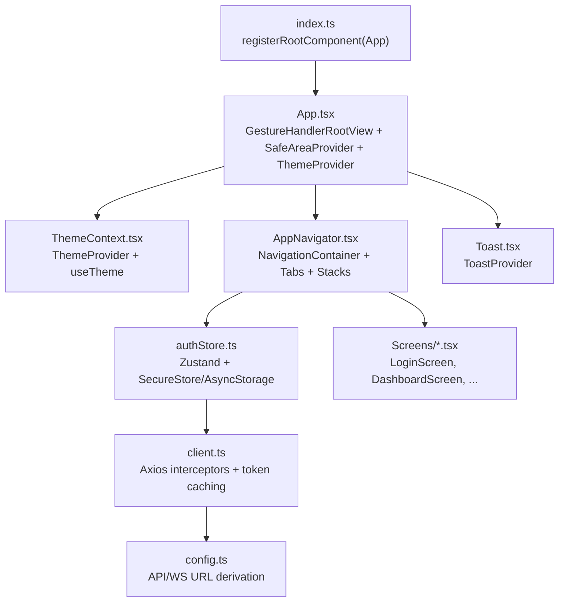
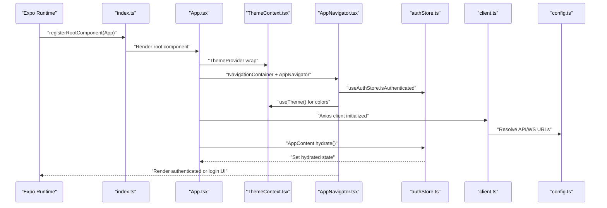
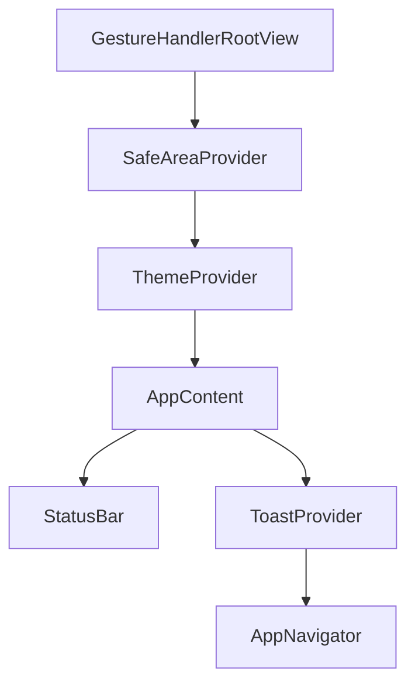
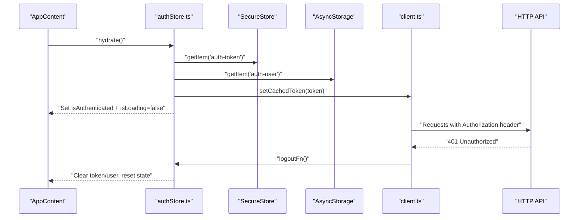
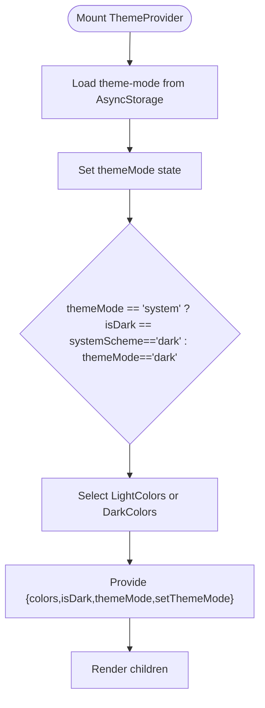
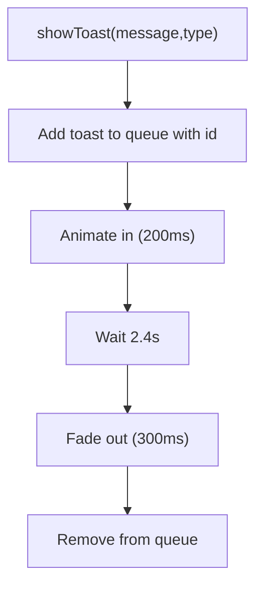
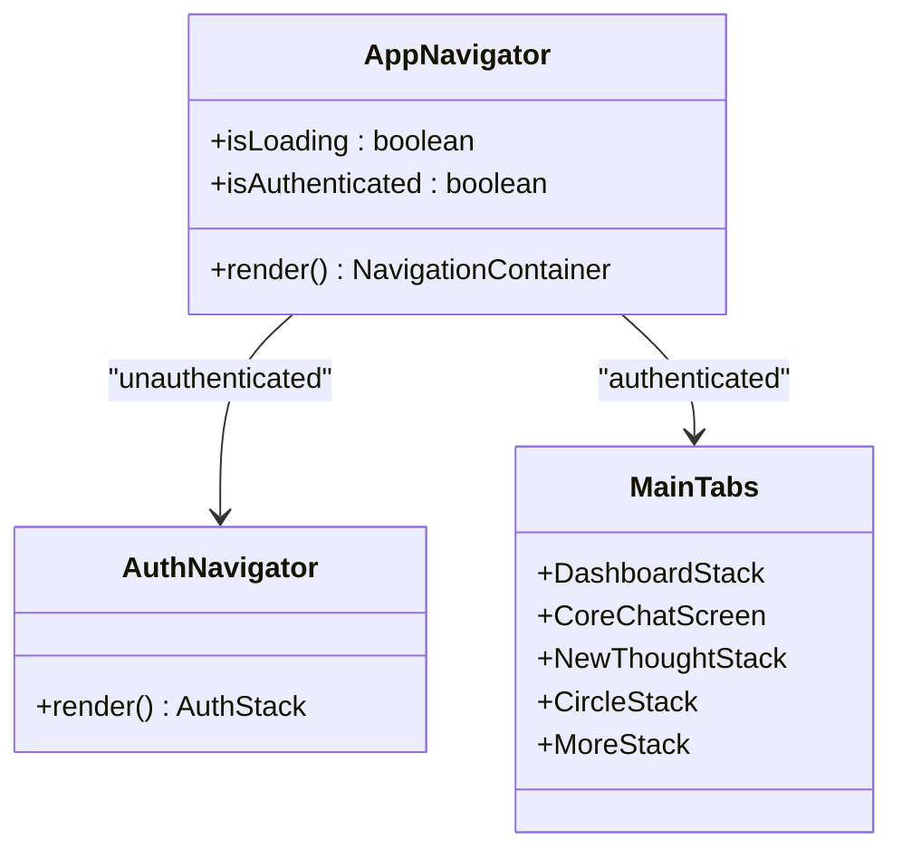
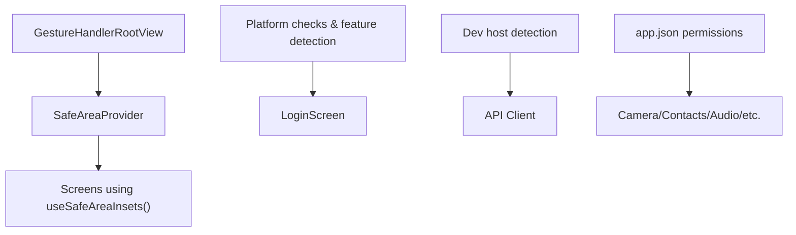
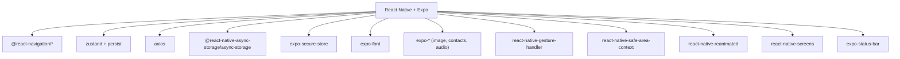

# Mobile Architecture

<cite>
**Referenced Files in This Document**
- [App.tsx](file://mobile/App.tsx)
- [index.ts](file://mobile/index.ts)
- [ThemeContext.tsx](file://mobile/src/contexts/ThemeContext.tsx)
- [authStore.ts](file://mobile/src/store/authStore.ts)
- [AppNavigator.tsx](file://mobile/src/navigation/AppNavigator.tsx)
- [Toast.tsx](file://mobile/src/components/Toast.tsx)
- [colors.ts](file://mobile/src/constants/colors.ts)
- [config.ts](file://mobile/src/constants/config.ts)
- [client.ts](file://mobile/src/api/client.ts)
- [LoginScreen.tsx](file://mobile/src/screens/LoginScreen.tsx)
- [DashboardScreen.tsx](file://mobile/src/screens/DashboardScreen.tsx)
- [app.json](file://mobile/app.json)
- [package.json](file://mobile/package.json)
</cite>

## Table of Contents
1. [Introduction](#introduction)
2. [Project Structure](#project-structure)
3. [Core Components](#core-components)
4. [Architecture Overview](#architecture-overview)
5. [Detailed Component Analysis](#detailed-component-analysis)
6. [Dependency Analysis](#dependency-analysis)
7. [Performance Considerations](#performance-considerations)
8. [Troubleshooting Guide](#troubleshooting-guide)
9. [Conclusion](#conclusion)

## Introduction
This document describes the React Native mobile application architecture for the 4Ever project. It focuses on the root component composition with SafeAreaProvider, GestureHandlerRootView, and ThemeProvider integration; the authentication hydration lifecycle; theme management; and the global toast provider. It also explains mobile-specific architectural decisions such as gesture handling, safe area management, and cross-platform compatibility layers, and contrasts them with the web application architecture.

## Project Structure
The mobile app is organized around a small set of foundational modules:
- Root entrypoint registers the Expo app and mounts the root component tree.
- Root component composes providers for theme, gestures, safe areas, navigation, and toasts.
- Navigation orchestrates stacks and tabs, driven by authentication and theme state.
- Stores manage authentication state and persistence.
- API client centralizes HTTP and WebSocket endpoints with automatic token injection and 401 handling.
- Screens implement platform-aware UI and UX, leveraging safe areas and platform permissions.

**Diagram sources**
- [index.ts:1-9](file://mobile/index.ts#L1-L9)
- [App.tsx:27-37](file://mobile/App.tsx#L27-L37)
- [ThemeContext.tsx:24-56](file://mobile/src/contexts/ThemeContext.tsx#L24-L56)
- [AppNavigator.tsx:255-281](file://mobile/src/navigation/AppNavigator.tsx#L255-L281)
- [Toast.tsx:21-46](file://mobile/src/components/Toast.tsx#L21-L46)
- [authStore.ts:26-71](file://mobile/src/store/authStore.ts#L26-L71)
- [client.ts:5-42](file://mobile/src/api/client.ts#L5-L42)
- [config.ts:36-84](file://mobile/src/constants/config.ts#L36-L84)

**Section sources**
- [index.ts:1-9](file://mobile/index.ts#L1-L9)
- [App.tsx:1-38](file://mobile/App.tsx#L1-L38)
- [package.json:1-52](file://mobile/package.json#L1-L52)

## Core Components
- Root component and providers:
  - Gesture handling is enabled via GestureHandlerRootView wrapping the entire app.
  - Safe area boundaries are managed by SafeAreaProvider to prevent content occlusion.
  - ThemeProvider supplies theme tokens and mode selection to all screens.
  - ToastProvider offers a global toast notification surface.
- Authentication hydration:
  - The AppContent component triggers hydration on mount, reading secure token storage and persisted user data.
  - The auth store persists tokens securely and user data in AsyncStorage, and caches tokens in memory to minimize IO overhead.
- Navigation:
  - NavigationContainer applies theme-aware colors derived from the theme context.
  - Bottom tabs and nested stacks compose the main app layout; authentication gates the navigator.
- API and configuration:
  - Axios client injects Authorization headers automatically and logs out on 401 responses.
  - API and WebSocket URLs are resolved from environment variables or dev-time host detection.

**Section sources**
- [App.tsx:10-25](file://mobile/App.tsx#L10-L25)
- [authStore.ts:26-71](file://mobile/src/store/authStore.ts#L26-L71)
- [AppNavigator.tsx:255-281](file://mobile/src/navigation/AppNavigator.tsx#L255-L281)
- [client.ts:12-40](file://mobile/src/api/client.ts#L12-L40)
- [config.ts:36-84](file://mobile/src/constants/config.ts#L36-L84)

## Architecture Overview
The mobile architecture emphasizes:
- Provider-first composition at the root for theme, gestures, safe areas, and toasts.
- Zustand stores for state with persistence via AsyncStorage and SecureStore.
- React Navigation for declarative routing with theme-aware UI.
- Axios interceptors for centralized auth and error handling.
- Platform-aware UI using safe areas, platform-specific permissions, and native components.

**Diagram sources**
- [index.ts:1-9](file://mobile/index.ts#L1-L9)
- [App.tsx:27-37](file://mobile/App.tsx#L27-L37)
- [ThemeContext.tsx:24-56](file://mobile/src/contexts/ThemeContext.tsx#L24-L56)
- [AppNavigator.tsx:255-281](file://mobile/src/navigation/AppNavigator.tsx#L255-L281)
- [authStore.ts:56-70](file://mobile/src/store/authStore.ts#L56-L70)
- [client.ts:5-42](file://mobile/src/api/client.ts#L5-L42)
- [config.ts:36-84](file://mobile/src/constants/config.ts#L36-L84)

## Detailed Component Analysis

### Root Component Composition
The root component composes:
- GestureHandlerRootView: Required for gesture-based animations and interactions.
- SafeAreaProvider: Ensures content respects device-safe areas (notch, home indicator).
- ThemeProvider: Supplies theme tokens and theme mode to the app.
- AppContent: Triggers authentication hydration and renders the toast provider and navigator.

**Diagram sources**
- [App.tsx:27-37](file://mobile/App.tsx#L27-L37)
- [App.tsx:10-25](file://mobile/App.tsx#L10-L25)

**Section sources**
- [App.tsx:1-38](file://mobile/App.tsx#L1-L38)

### Authentication Hydration Lifecycle
The hydration process:
- On mount, AppContent calls the auth store’s hydrate method.
- The store reads a secure token and persisted user data, sets the token cache, and updates state.
- The API client’s interceptor reads the cached token for subsequent requests.
- A logout function registered with the API client handles 401 responses by clearing state.

**Diagram sources**
- [App.tsx:13-15](file://mobile/App.tsx#L13-L15)
- [authStore.ts:56-70](file://mobile/src/store/authStore.ts#L56-L70)
- [client.ts:18-40](file://mobile/src/api/client.ts#L18-L40)

**Section sources**
- [authStore.ts:26-71](file://mobile/src/store/authStore.ts#L26-L71)
- [client.ts:12-40](file://mobile/src/api/client.ts#L12-L40)

### Theme Management System
ThemeContext provides:
- Theme mode persistence and retrieval via AsyncStorage.
- Dynamic theme mode selection based on system preference or user choice.
- Derived color tokens for light/dark modes and a hook for consuming theme values.
- Guard rendering until preferences are loaded to avoid flicker.

**Diagram sources**
- [ThemeContext.tsx:24-56](file://mobile/src/contexts/ThemeContext.tsx#L24-L56)

**Section sources**
- [ThemeContext.tsx:1-61](file://mobile/src/contexts/ThemeContext.tsx#L1-L61)
- [colors.ts:1-142](file://mobile/src/constants/colors.ts#L1-L142)

### Global Toast Provider
ToastProvider:
- Exposes a global show function for imperative toast notifications.
- Maintains an internal queue with animated fade-in/fade-out behavior.
- Applies theme-aware colors and positions toasts at the top of the screen.

**Diagram sources**
- [Toast.tsx:17-46](file://mobile/src/components/Toast.tsx#L17-L46)

**Section sources**
- [Toast.tsx:1-80](file://mobile/src/components/Toast.tsx#L1-L80)

### Navigation and Screen Hierarchy
AppNavigator:
- Uses React Navigation with theme-aware colors merged into default/dark themes.
- Renders AuthNavigator for unauthenticated users and MainTabs for authenticated users.
- MainTabs include Dashboard, Core Chat, New Thought, Circle, and More stacks.
- LoginScreen demonstrates platform-aware authentication (Apple on iOS) and step-based flows.

**Diagram sources**
- [AppNavigator.tsx:255-281](file://mobile/src/navigation/AppNavigator.tsx#L255-L281)
- [LoginScreen.tsx:16-383](file://mobile/src/screens/LoginScreen.tsx#L16-L383)

**Section sources**
- [AppNavigator.tsx:1-282](file://mobile/src/navigation/AppNavigator.tsx#L1-L282)
- [LoginScreen.tsx:1-383](file://mobile/src/screens/LoginScreen.tsx#L1-L383)

### Mobile-Specific Architectural Decisions
- Gesture handling:
  - GestureHandlerRootView wraps the app to enable gesture-based animations and interactions.
- Safe area management:
  - SafeAreaProvider ensures UI respects device-specific safe areas.
  - Screens like DashboardScreen use useSafeAreaInsets to apply top padding.
- Cross-platform compatibility:
  - Platform checks and feature detection (e.g., Apple Authentication availability on iOS).
  - Permissions declared in app.json for iOS and Android.
  - API URL resolution adapts to Expo Go, Android emulator, and iOS simulator during development.

**Diagram sources**
- [App.tsx:27-37](file://mobile/App.tsx#L27-L37)
- [DashboardScreen.tsx:71](file://mobile/src/screens/DashboardScreen.tsx#L71)
- [LoginScreen.tsx:35-43](file://mobile/src/screens/LoginScreen.tsx#L35-L43)
- [app.json:20-60](file://mobile/app.json#L20-L60)
- [config.ts:36-64](file://mobile/src/constants/config.ts#L36-L64)

**Section sources**
- [DashboardScreen.tsx:67-71](file://mobile/src/screens/DashboardScreen.tsx#L67-L71)
- [LoginScreen.tsx:35-43](file://mobile/src/screens/LoginScreen.tsx#L35-L43)
- [app.json:1-96](file://mobile/app.json#L1-L96)
- [config.ts:36-64](file://mobile/src/constants/config.ts#L36-L64)

### Differences from Web Application Architecture
- Providers at root:
  - Mobile uses GestureHandlerRootView and SafeAreaProvider at the root; web typically does not require these.
- Navigation:
  - Mobile uses @react-navigation/native with bottom tabs and native stack navigators; web often uses react-router with browser history.
- Authentication:
  - Mobile hydrates from SecureStore and AsyncStorage; web typically uses localStorage/sessionStorage or cookies.
- Theming:
  - Mobile derives theme from system preference and AsyncStorage; web commonly uses CSS custom properties or styled-components with media queries.
- API and deployment:
  - Mobile resolves API/WS URLs with environment variables and dev-time host detection; web typically uses environment variables exposed by the bundler.

[No sources needed since this section summarizes differences conceptually]

## Dependency Analysis
The mobile app’s key dependencies and their roles:
- Expo ecosystem for runtime, permissions, and platform APIs.
- React Navigation for declarative routing and themed UI.
- Zustand for lightweight state management with persistence.
- Axios for HTTP requests with interceptors.
- Native modules for secure storage, image picking, contacts, audio, and fonts.

**Diagram sources**
- [package.json:11-44](file://mobile/package.json#L11-L44)

**Section sources**
- [package.json:1-52](file://mobile/package.json#L1-L52)

## Performance Considerations
- Token caching:
  - The API client caches tokens to reduce frequent SecureStore reads.
- Debounced data loading:
  - DashboardScreen uses a debounced fetch pattern with cached snapshots to minimize network usage and improve perceived performance.
- Animated toasts:
  - Native driver animations for smooth toast transitions.
- Safe area and layout:
  - Using insets avoids expensive layout recalculations and prevents clipping.

[No sources needed since this section provides general guidance]

## Troubleshooting Guide
- Authentication hydration fails silently:
  - Verify AsyncStorage keys and SecureStore token presence; ensure hydrate is invoked on mount.
- 401 responses:
  - Confirm the logout function is registered and that the interceptor clears state on unauthorized responses.
- API URL misconfiguration:
  - Ensure EXPO_PUBLIC_API_URL is set for production builds; dev auto-detection only applies in development.
- Platform-specific features:
  - Apple Authentication is iOS-only; detect availability before rendering the button.
- Safe area issues:
  - Ensure SafeAreaProvider is present at the root and screens use useSafeAreaInsets for dynamic padding.

**Section sources**
- [authStore.ts:56-70](file://mobile/src/store/authStore.ts#L56-L70)
- [client.ts:12-40](file://mobile/src/api/client.ts#L12-L40)
- [config.ts:36-64](file://mobile/src/constants/config.ts#L36-L64)
- [LoginScreen.tsx:35-43](file://mobile/src/screens/LoginScreen.tsx#L35-L43)
- [DashboardScreen.tsx:71](file://mobile/src/screens/DashboardScreen.tsx#L71)

## Conclusion
The mobile architecture centers on a provider-first root component, robust authentication hydration with secure storage, theme-aware navigation, and a global toast system. Mobile-specific decisions—gesture handling, safe area management, and platform-aware features—are integrated early to ensure a cohesive and performant user experience. These patterns provide a strong foundation for maintaining consistency across platforms while leveraging native capabilities effectively.