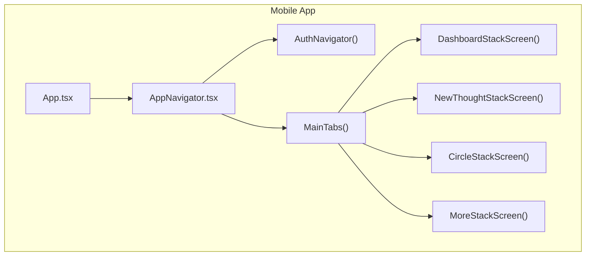
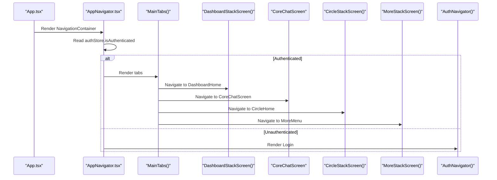
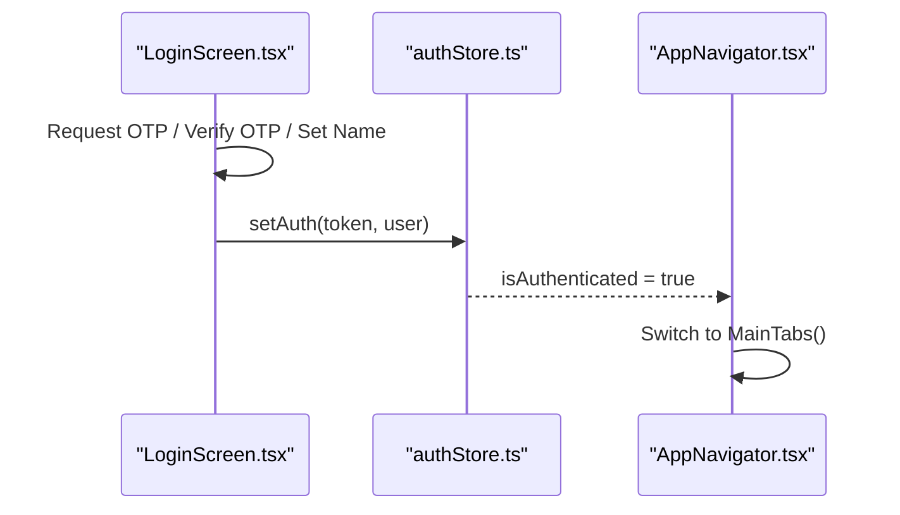
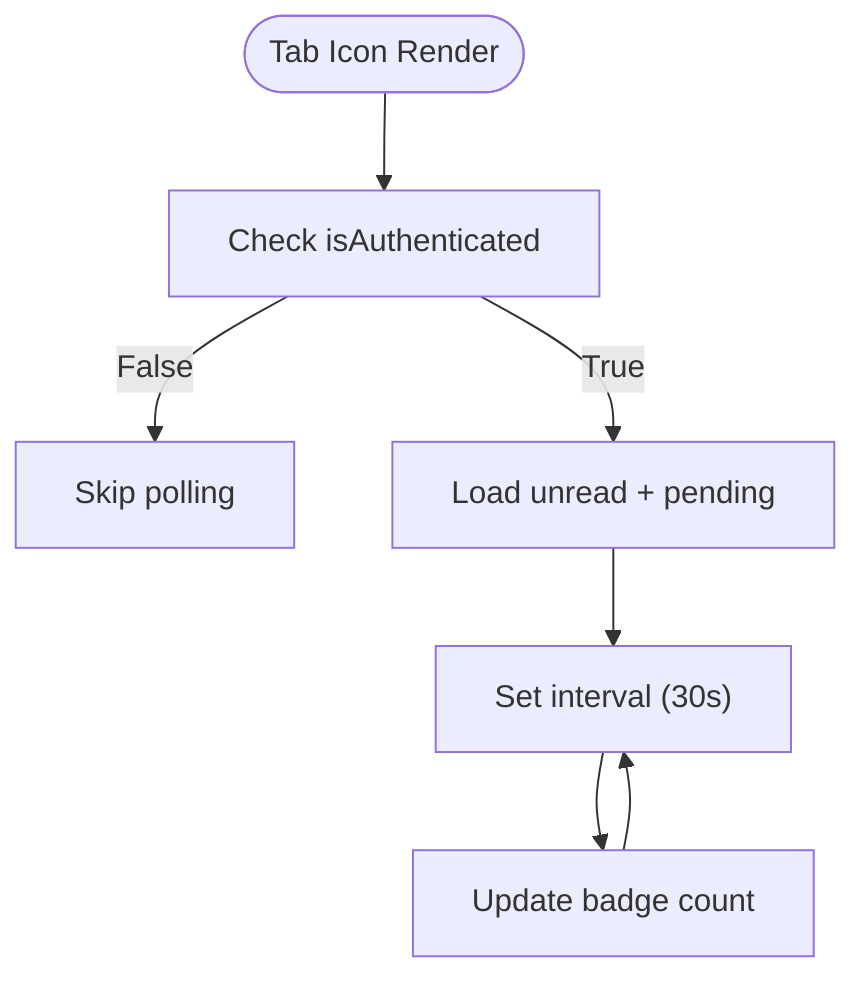
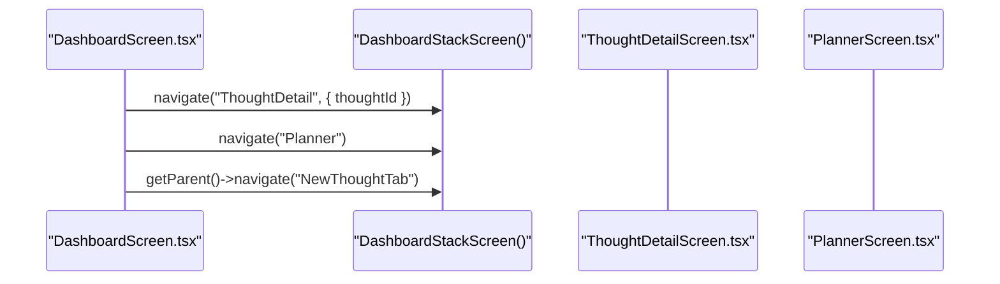
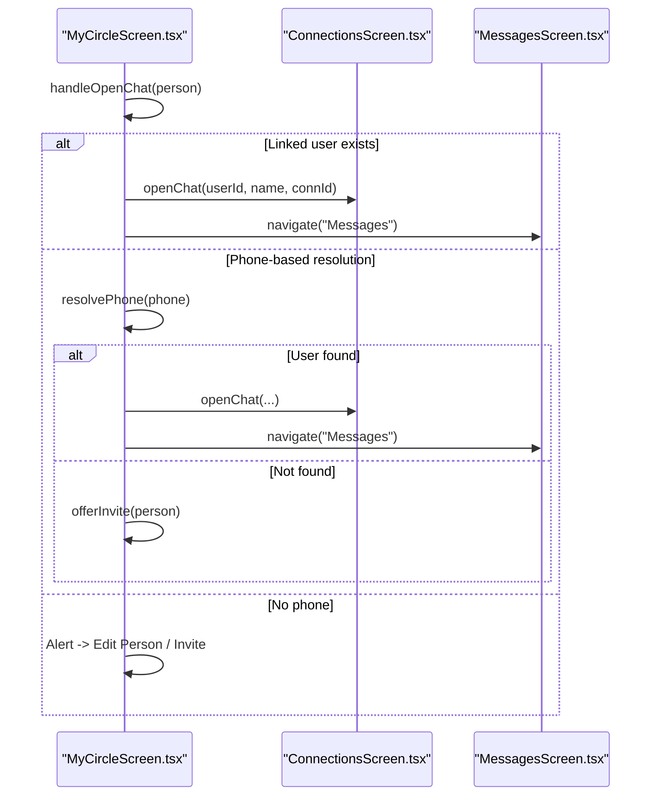
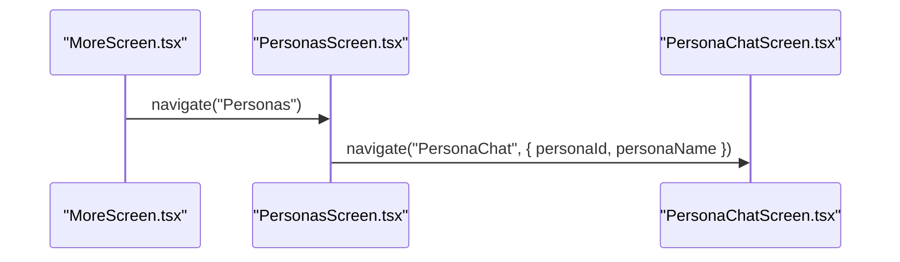
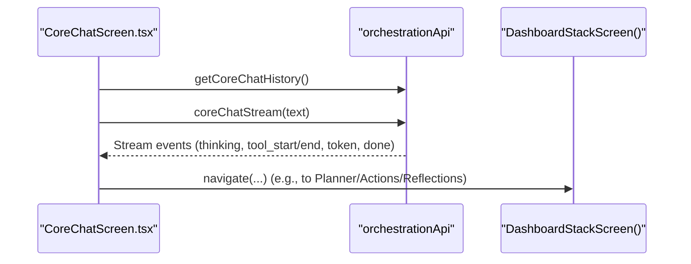
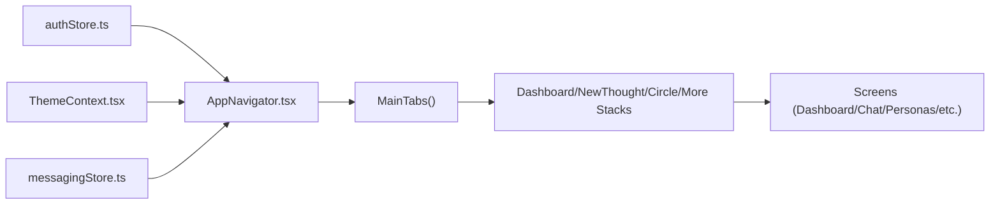

# Navigation System

<cite>
**Referenced Files in This Document**
- [AppNavigator.tsx](file://mobile/src/navigation/AppNavigator.tsx)
- [App.tsx](file://mobile/App.tsx)
- [DashboardScreen.tsx](file://mobile/src/screens/DashboardScreen.tsx)
- [LoginScreen.tsx](file://mobile/src/screens/LoginScreen.tsx)
- [CoreChatScreen.tsx](file://mobile/src/screens/CoreChatScreen.tsx)
- [MyCircleScreen.tsx](file://mobile/src/screens/MyCircleScreen.tsx)
- [MoreScreen.tsx](file://mobile/src/screens/MoreScreen.tsx)
- [PersonasScreen.tsx](file://mobile/src/screens/PersonasScreen.tsx)
- [authStore.ts](file://mobile/src/store/authStore.ts)
</cite>

## Table of Contents
1. [Introduction](#introduction)
2. [Project Structure](#project-structure)
3. [Core Components](#core-components)
4. [Architecture Overview](#architecture-overview)
5. [Detailed Component Analysis](#detailed-component-analysis)
6. [Dependency Analysis](#dependency-analysis)
7. [Performance Considerations](#performance-considerations)
8. [Troubleshooting Guide](#troubleshooting-guide)
9. [Conclusion](#conclusion)

## Introduction
This document describes the React Navigation-based mobile navigation system powering the 4Ever application. It covers the screen-based architecture with five main tabs (Dashboard, Core Chat, New Thought, Circle, More), supporting stacks for each tab, and a unified authentication flow. The system integrates theme-aware navigation themes, real-time badges for messaging, and robust parameter passing between screens. Authentication gating, navigation guards, and deep-linking readiness are implemented through centralized stores and navigation containers.

## Project Structure
The mobile navigation is organized around a single entry point that wires providers and the navigator. The navigator composes tab-based shells and nested stacks for each functional area.

**Diagram sources**
- [App.tsx:10-25](file://mobile/App.tsx#L10-L25)
- [AppNavigator.tsx:175-253](file://mobile/src/navigation/AppNavigator.tsx#L175-L253)

**Section sources**
- [App.tsx:10-25](file://mobile/App.tsx#L10-L25)
- [AppNavigator.tsx:255-282](file://mobile/src/navigation/AppNavigator.tsx#L255-L282)

## Core Components
- Navigation container and theme integration: The root navigator wraps the app with a theme-aware container and switches between authenticated tabs and login based on store state.
- Tab shell: Five tabs provide primary navigation: Home (Dashboard), Chat, Thought, Circle, and More.
- Stack shells: Each tab hosts a dedicated stack for its screens, enabling push/pop navigation and parameter passing.
- Authentication flow: A minimal stack handles phone-based OTP and optional Apple Sign-in, transitioning to authenticated views after successful login.
- Real-time badges: Messaging unread counts and pending requests are polled and displayed on the Circle tab icon.

**Section sources**
- [AppNavigator.tsx:175-253](file://mobile/src/navigation/AppNavigator.tsx#L175-L253)
- [AppNavigator.tsx:42-145](file://mobile/src/navigation/AppNavigator.tsx#L42-L145)
- [AppNavigator.tsx:147-173](file://mobile/src/navigation/AppNavigator.tsx#L147-L173)
- [LoginScreen.tsx:16-383](file://mobile/src/screens/LoginScreen.tsx#L16-L383)

## Architecture Overview
The navigation architecture follows a layered pattern:
- Providers: Theme provider, gesture handler, safe area, toast provider wrap the navigator.
- Root navigator: Decides between Auth stack and Main tabs.
- Tabs: Each tab encapsulates a stack of related screens.
- Screen parameters: Route params are passed via navigation.navigate and options({ route }) derived titles.

**Diagram sources**
- [App.tsx:10-25](file://mobile/App.tsx#L10-L25)
- [AppNavigator.tsx:255-282](file://mobile/src/navigation/AppNavigator.tsx#L255-L282)
- [AppNavigator.tsx:175-253](file://mobile/src/navigation/AppNavigator.tsx#L175-L253)

## Detailed Component Analysis

### Authentication Flow and Guards
- Login steps: Phone OTP and optional Apple Sign-in with countdown and resend logic.
- Auth persistence: Token and user are persisted via secure storage and async storage; hydration occurs on startup.
- Guard behavior: The root navigator conditionally renders the Auth stack or Main tabs based on authentication state.

**Diagram sources**
- [LoginScreen.tsx:96-157](file://mobile/src/screens/LoginScreen.tsx#L96-L157)
- [authStore.ts:32-52](file://mobile/src/store/authStore.ts#L32-L52)
- [AppNavigator.tsx:255-282](file://mobile/src/navigation/AppNavigator.tsx#L255-L282)

**Section sources**
- [LoginScreen.tsx:16-383](file://mobile/src/screens/LoginScreen.tsx#L16-L383)
- [authStore.ts:26-71](file://mobile/src/store/authStore.ts#L26-L71)
- [AppNavigator.tsx:255-282](file://mobile/src/navigation/AppNavigator.tsx#L255-L282)

### Tab Navigation and Badge Updates
- Tab shell: Five tabs with custom icons and labels.
- Badge logic: Unread count and pending requests are polled every 30 seconds and rendered on the Circle tab icon.
- Theme integration: Tab and stack themes adapt to light/dark modes.

**Diagram sources**
- [AppNavigator.tsx:175-191](file://mobile/src/navigation/AppNavigator.tsx#L175-L191)
- [AppNavigator.tsx:151-173](file://mobile/src/navigation/AppNavigator.tsx#L151-L173)

**Section sources**
- [AppNavigator.tsx:175-253](file://mobile/src/navigation/AppNavigator.tsx#L175-L253)
- [AppNavigator.tsx:147-173](file://mobile/src/navigation/AppNavigator.tsx#L147-L173)

### Dashboard Stack Navigation
- Screens: Dashboard home, Thought detail, Edit profile, Planner, Actions, Reflections, Person detail, Persona chat, Life wheel, Weekly check-in.
- Parameter passing: Titles derive from route params (e.g., personaName).
- Navigation patterns: Parent navigation to switch tabs (e.g., navigate('NewThoughtTab')).

**Diagram sources**
- [DashboardScreen.tsx:484-491](file://mobile/src/screens/DashboardScreen.tsx#L484-L491)
- [DashboardScreen.tsx:417-418](file://mobile/src/screens/DashboardScreen.tsx#L417-L418)
- [DashboardScreen.tsx:484-485](file://mobile/src/screens/DashboardScreen.tsx#L484-L485)
- [AppNavigator.tsx:57-80](file://mobile/src/navigation/AppNavigator.tsx#L57-L80)

**Section sources**
- [AppNavigator.tsx:57-80](file://mobile/src/navigation/AppNavigator.tsx#L57-L80)
- [DashboardScreen.tsx:67-526](file://mobile/src/screens/DashboardScreen.tsx#L67-L526)

### Circle Stack Navigation
- Screens: Circle home, Person detail, Persona chat, Messages, Connections, Contacts picker.
- Smart chat resolution: Attempts to open chats via linked user or phone-based resolution, with invite fallbacks.

**Diagram sources**
- [MyCircleScreen.tsx:105-195](file://mobile/src/screens/MyCircleScreen.tsx#L105-L195)
- [MyCircleScreen.tsx:197-222](file://mobile/src/screens/MyCircleScreen.tsx#L197-L222)

**Section sources**
- [AppNavigator.tsx:99-118](file://mobile/src/navigation/AppNavigator.tsx#L99-L118)
- [MyCircleScreen.tsx:56-701](file://mobile/src/screens/MyCircleScreen.tsx#L56-L701)

### More Stack Navigation
- Screens: More menu, Personas, Planner, Actions, Insights, Reflections, My Context, Memory, Knowledge Worker, Edit profile, Privacy & Data.
- Parameterized titles: Persona chat title derives from route params.

**Diagram sources**
- [MoreScreen.tsx:14-24](file://mobile/src/screens/MoreScreen.tsx#L14-L24)
- [PersonasScreen.tsx:244-245](file://mobile/src/screens/PersonasScreen.tsx#L244-L245)

**Section sources**
- [AppNavigator.tsx:120-145](file://mobile/src/navigation/AppNavigator.tsx#L120-L145)
- [MoreScreen.tsx:46-181](file://mobile/src/screens/MoreScreen.tsx#L46-L181)
- [PersonasScreen.tsx:145-310](file://mobile/src/screens/PersonasScreen.tsx#L145-L310)

### Core Chat Navigation and Streaming
- Core Chat supports message history, streaming responses, tool activities, and voice transcription/synthesis.
- Navigation is integrated within the tab stack; suggestions and session controls are part of the chat UI.

**Diagram sources**
- [CoreChatScreen.tsx:203-226](file://mobile/src/screens/CoreChatScreen.tsx#L203-L226)
- [CoreChatScreen.tsx:259-330](file://mobile/src/screens/CoreChatScreen.tsx#L259-L330)
- [AppNavigator.tsx:57-80](file://mobile/src/navigation/AppNavigator.tsx#L57-L80)

**Section sources**
- [CoreChatScreen.tsx:154-800](file://mobile/src/screens/CoreChatScreen.tsx#L154-L800)
- [AppNavigator.tsx:57-80](file://mobile/src/navigation/AppNavigator.tsx#L57-L80)

## Dependency Analysis
The navigation system relies on:
- React Navigation: Native stack and bottom tabs.
- Zustand stores: Authentication and messaging state.
- Theme context: Dynamic theme application to navigation surfaces.
- Async storage and secure store: Persistence for auth tokens and user data.

**Diagram sources**
- [authStore.ts:26-71](file://mobile/src/store/authStore.ts#L26-L71)
- [AppNavigator.tsx:1-10](file://mobile/src/navigation/AppNavigator.tsx#L1-L10)
- [AppNavigator.tsx:175-253](file://mobile/src/navigation/AppNavigator.tsx#L175-L253)

**Section sources**
- [authStore.ts:1-75](file://mobile/src/store/authStore.ts#L1-L75)
- [AppNavigator.tsx:1-10](file://mobile/src/navigation/AppNavigator.tsx#L1-L10)

## Performance Considerations
- Lazy initialization: The loader spinner appears while determining authentication state at startup.
- Debounced data fetching: Dashboard uses a debouncing mechanism to avoid frequent reloads during rapid navigation.
- Background caching: Dashboard caches aggregated data to disk for instant cold-start rendering.
- Auto-scroll behavior: Chat maintains pinned-to-bottom scrolling to improve UX during long conversations.
- Badge polling: Circle tab badges poll every 30 seconds to balance freshness and battery usage.

**Section sources**
- [AppNavigator.tsx:268-274](file://mobile/src/navigation/AppNavigator.tsx#L268-L274)
- [DashboardScreen.tsx:87-162](file://mobile/src/screens/DashboardScreen.tsx#L87-L162)
- [CoreChatScreen.tsx:192-197](file://mobile/src/screens/CoreChatScreen.tsx#L192-L197)
- [AppNavigator.tsx:182-191](file://mobile/src/navigation/AppNavigator.tsx#L182-L191)

## Troubleshooting Guide
- Authentication not persisting:
  - Verify token and user are written to secure storage and async storage on login.
  - Ensure hydration runs on startup and sets the store state accordingly.
- Navigation stuck on loader:
  - Confirm authentication store resolves isLoading to false after hydration.
- Tab badge not updating:
  - Check that unread and pending requests are loaded and polling is active.
- Chat not scrolling to bottom:
  - Ensure pinned-to-bottom logic is respected and scrollToBottom is invoked after updates.
- Parameterized titles not appearing:
  - Confirm route params are passed when navigating and options({ route }) extracts values.

**Section sources**
- [authStore.ts:56-71](file://mobile/src/store/authStore.ts#L56-L71)
- [AppNavigator.tsx:268-274](file://mobile/src/navigation/AppNavigator.tsx#L268-L274)
- [AppNavigator.tsx:182-191](file://mobile/src/navigation/AppNavigator.tsx#L182-L191)
- [CoreChatScreen.tsx:228-233](file://mobile/src/screens/CoreChatScreen.tsx#L228-L233)
- [AppNavigator.tsx:75-76](file://mobile/src/navigation/AppNavigator.tsx#L75-L76)

## Conclusion
The navigation system combines a clean tab-and-stack architecture with robust authentication, real-time badges, and theme-aware UI. It emphasizes performance through caching and debouncing, and provides a smooth user experience with thoughtful navigation patterns. The modular design enables easy extension of new screens and stacks as the application evolves.